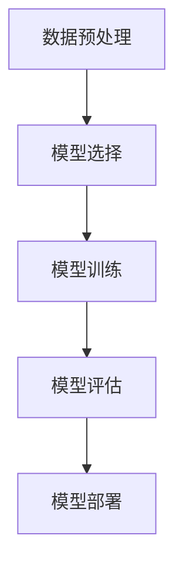
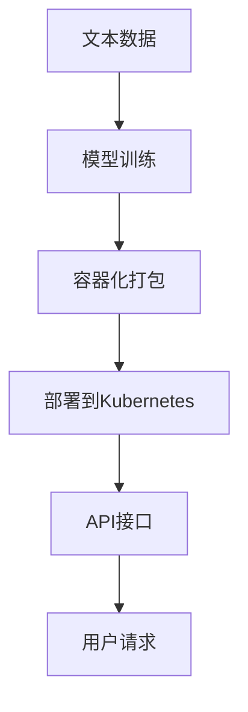
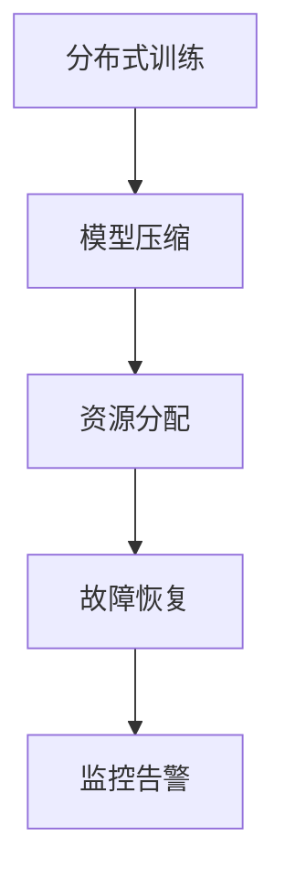

                 

### 文章标题

《容器化技术：加速LLM应用的部署与扩展》

> 关键词：容器化技术、LLM应用、部署与扩展、Docker、Kubernetes、微服务架构、分布式计算

> 摘要：本文深入探讨容器化技术在加速大规模语言模型（LLM）应用部署与扩展方面的作用。通过介绍容器技术基础、核心概念、LLM应用部署流程及挑战，分析容器化技术在LLM应用中的优化策略和扩展方法，旨在为开发者提供实用的技术指南和最佳实践。

### 引言

#### 容器化技术的概述

容器化技术是一种轻量级虚拟化技术，通过隔离应用程序及其依赖环境，实现了应用程序的标准化部署、迁移和扩展。与传统的虚拟机相比，容器具有启动速度快、资源占用少、可移植性强等特点，使其在云计算和分布式系统中得到了广泛应用。

容器技术的基础是Docker，它通过将应用程序及其运行时环境打包成容器镜像，实现了应用程序的“一次编写，到处运行”。Kubernetes则是一个开源的容器编排平台，通过自动化部署、扩展和管理容器化应用，极大地提高了开发效率和系统稳定性。

#### LLM应用的需求分析

大规模语言模型（LLM）是人工智能领域的一项重要技术，其在自然语言处理、智能问答、机器翻译等领域具有广泛的应用。随着LLM模型规模的不断增大，对部署和扩展的需求也越来越高。

首先，LLM模型的部署涉及到硬件资源的高效利用，需要实现快速部署和弹性扩展。其次，LLM模型的训练和推理过程需要大量的数据存储和计算资源，如何高效地管理和调度这些资源是一个重要问题。此外，LLM应用的安全性和可靠性也是需要考虑的关键因素。

#### 书籍结构安排与目标读者

本书旨在为开发者提供全面、系统的容器化技术知识，特别是其在LLM应用部署与扩展方面的应用。全书共分为七个章节，结构安排如下：

1. 引言：介绍容器化技术和LLM应用的需求背景。
2. 容器技术基础：讲解容器技术的概念、原理和使用方法。
3. 容器化技术核心概念：探讨容器化与虚拟化技术的差异、容器镜像管理、容器编排和安全性的关键概念。
4. LLM应用部署：介绍LLM的概述、模型部署流程、应用案例和优化策略。
5. 容器化技术在LLM应用中的挑战：分析容器化技术在LLM应用中面临的主要挑战和解决方案。
6. 容器化技术在LLM应用的扩展：探讨容器化技术在分布式计算、微服务架构和容器云平台中的应用。
7. 实践与总结：通过实际项目和案例分享，总结容器化技术在LLM应用中的实战经验。

本书的目标读者为有一定编程基础和云计算知识的开发者，以及对容器化技术和LLM应用感兴趣的读者。通过本书的学习，读者将能够掌握容器化技术的基本原理和应用方法，并在LLM应用部署与扩展方面获得实践经验。

### 容器技术基础

#### 容器的概念与原理

容器是一种轻量级的、可执行的、独立的运行时环境，它将应用程序及其依赖项打包在一起，实现了应用程序的标准化部署和运行。容器通过操作系统的命名空间（Namespace）和控

#### Docker基础

Docker 是一种开源的应用容器引擎，它允许开发者将应用程序及其运行环境打包到一个可移植的容器中，然后发布到任何流行的Linux或Windows机器上，也可以实现虚拟化。以下是 Docker 的一些核心概念和基本使用方法：

1. **容器（Container）**：容器是运行应用程序的基本单位。Docker 容器允许开发者将应用程序及其依赖项打包成一个独立的运行时环境。

2. **镜像（Image）**：镜像是容器的基础，用于定义容器的构建环境。Docker 镜像是一个静态的文件系统，包含了应用程序的代码、库和其他依赖项。

3. **Dockerfile**：Dockerfile 是一个文本文件，用于定义如何构建 Docker 镜像。它包含了一系列指令，用于指定如何在容器中安装软件、配置环境等。

4. **Docker Compose**：Docker Compose 是一个用于定义和运行多容器应用的工具。它使用一个 YAML 文件来配置应用程序的服务，然后使用一条命令来启动和运行所有服务。

以下是一个简单的 Dockerfile 示例，用于构建一个包含 Apache 服务器的容器镜像：

```Dockerfile
FROM ubuntu:latest

# 安装 Apache 服务器
RUN apt-get update && apt-get install -y apache2

# 暴露 Apache 服务器端口
EXPOSE 80

# 运行 Apache 服务器
CMD ["apache2-foreground"]
```

使用 Dockerfile，可以通过以下命令构建和运行容器：

```shell
# 构建镜像
$ docker build -t my-apache .

# 运行容器
$ docker run -d -p 8080:80 my-apache
```

#### 容器网络与存储

1. **容器网络**：容器网络用于容器之间的通信。Docker 提供了两种网络模式：桥接网络和主机模式。

   - **桥接网络**：容器通过一个虚拟网络接口连接到一个名为 `bridge` 的虚拟桥接网络。容器之间可以通过 IP 地址进行通信。

   - **主机模式**：容器直接共享宿主机的网络接口和 IP 地址，从而避免了额外的网络开销。

2. **容器存储**：容器存储用于持久化容器数据。Docker 提供了三种存储模式：

   - **卷（Volume）**：卷是一种外部存储，可以独立于容器生命周期存在。卷可以被多个容器共享。

   - **绑定映射（Bind Mount）**：绑定映射将宿主机的文件系统中的文件或目录挂载到容器中。

   - **容器存储驱动**：Docker 支持多种容器存储驱动，如 `overlay2`、`devicemapper` 和 `vfs`，用于优化容器存储性能。

以下是一个简单的示例，展示了如何创建一个卷并挂载到容器中：

```shell
# 创建卷
$ docker volume create my-volume

# 运行一个容器并挂载卷
$ docker run -d -v my-volume:/data my-apache
```

#### 容器编排工具 Kubernetes 入门

Kubernetes 是一个开源的容器编排平台，用于自动化部署、扩展和管理容器化应用程序。以下是 Kubernetes 的一些核心概念和基本使用方法：

1. **Pod**：Pod 是 Kubernetes 中的最小部署单元，包含一个或多个容器。Pod 负责容器的创建、启动和销毁。

2. **Deployment**：Deployment 是 Kubernetes 中的自动化部署工具，用于创建和管理 Pod 的副本。Deployment 可以实现滚动更新、回滚等功能。

3. **Service**：Service 是 Kubernetes 中的网络服务，用于实现容器之间的通信。Service 通过定义命名端口和 IP 地址，将流量路由到相应的 Pod。

4. **Ingress**：Ingress 是 Kubernetes 中的入口控制器，用于管理外部访问到集群内服务。Ingress 可以定义规则，将外部流量路由到不同的服务。

以下是一个简单的 Kubernetes 配置示例，用于部署一个包含两个容

### 容器化技术核心概念

#### 容器化与虚拟化技术的比较

容器化和虚拟化都是现代云计算和分布式系统中的重要技术，但它们在实现方式和应用场景上有所不同。以下是对容器化和虚拟化的比较：

1. **隔离级别**：

   - **虚拟化**：通过虚拟化技术，可以在操作系统层面创建多个隔离的虚拟机（VM）。每个虚拟机都有独立的操作系统和硬件资源，实现高度隔离。
   
   - **容器化**：容器通过操作系统的命名空间（Namespace）和控件（Control Group）来实现隔离。容器共享宿主机的操作系统内核，但应用程序的运行环境被隔离，从而实现轻量级的隔离。

2. **资源占用**：

   - **虚拟化**：由于需要运行独立的操作系统，虚拟机占用的资源相对较高，包括内存、CPU 和存储。
   
   - **容器化**：容器共享宿主机的操作系统内核，占用的资源较少，包括内存、CPU 和存储。

3. **启动速度**：

   - **虚拟化**：虚拟机启动速度相对较慢，因为需要加载完整的操作系统。
   
   - **容器化**：容器启动速度快，通常在毫秒级别，因为只需要启动应用程序及其依赖项。

4. **应用场景**：

   - **虚拟化**：适用于需要独立运行环境和高度隔离的场景，如企业应用、开发测试环境等。
   
   - **容器化**：适用于需要快速部署、弹性扩展和资源共享的场景，如 Web 应用、微服务架构和云计算平台。

#### 容器镜像与仓库管理

容器镜像是一种轻量级的、可执行的文件系统，用于打包和分发应用程序及其依赖项。以下是对容器镜像的基本概念和仓库管理方法的介绍：

1. **容器镜像的基本概念**：

   - **基础镜像**：基础镜像是一种预构建的容器镜像，用于构建其他镜像。常见的的基础镜像是 Ubuntu、CentOS 等。
   
   - **构建镜像**：通过 Dockerfile，可以将应用程序的代码、库和其他依赖项打包成一个容器镜像。
   
   - **分层存储**：容器镜像采用分层存储技术，将不同的层（如代码、库文件、配置文件）组合成一个整体。这种设计提高了镜像的灵活性和可维护性。

2. **容器仓库管理**：

   - **私有仓库**：私有仓库用于存储和分发容器镜像，只有授权用户可以访问。Docker Hub 是一个流行的开源私有仓库。
   
   - **公共仓库**：公共仓库是供所有人访问的容器镜像存储库，如 Docker Hub、Quay 等。用户可以从公共仓库中下载和部署容器镜像。

3. **镜像构建与发布**：

   - **构建镜像**：使用 Dockerfile 和 Docker CLI，可以构建和推送到私有或公共仓库的容器镜像。
   
   - **拉取镜像**：在部署容器时，可以通过 Docker CLI 从私有或公共仓库中拉取所需的容器镜像。

以下是一个简单的示例，展示如何构建和发布一个容器镜像：

```shell
# 编写 Dockerfile
$ echo "FROM ubuntu\nRUN apt-get update && apt-get install -y nginx" > Dockerfile

# 构建镜像
$ docker build -t my-nginx .

# 推送镜像到私有仓库
$ docker push my-nginx
```

#### 容器编排与自动化运维

容器编排和自动化运维是容器化技术中的重要组成部分，用于管理和优化容器化应用。以下是对这些概念的基本介绍：

1. **容器编排**：

   - **容器编排**：容器编排是指使用自动化工具管理和调度容器化应用的过程。常见的容器编排工具包括 Kubernetes、Docker Swarm 等。
   
   - **编排任务**：容器编排工具负责创建、启动、停止、扩展和管理容器。它们可以根据应用的需求，自动分配资源和调度任务。

2. **自动化运维**：

   - **自动化运维**：自动化运维是指使用脚本、工具和平台自动化管理云计算资源的过程。它包括部署、监控、维护、更新和备份等任务。

3. **自动化工具**：

   - **持续集成/持续部署（CI/CD）**：CI/CD 是自动化运维的核心概念，用于自动化构建、测试和部署应用程序。常见的 CI/CD 工具包括 Jenkins、Travis CI、GitLab CI 等。

4. **监控和日志**：

   - **监控**：监控系统用于实时监控容器的运行状态、性能和资源使用情况。常见的监控工具有 Prometheus、Grafana 等。
   
   - **日志**：日志记录工具用于收集、存储和展示容器的日志信息。常见的日志工具有 ELK（Elasticsearch、Logstash、Kibana）堆栈等。

以下是一个简单的示例，展示如何使用 Kubernetes 进行容器编排和自动化运维：

```shell
# 编写 Kubernetes Deployment 配置文件
$ echo "apiVersion: apps/v1\nkind: Deployment\nmetadata:\n  name: my-nginx\nspec:\n  replicas: 3\n  selector:\n    matchLabels:\n      app: my-nginx\n  template:\n    metadata:\n      labels:\n        app: my-nginx\n    spec:\n      containers:\n      - name: nginx\n        image: my-nginx\n        ports:\n        - containerPort: 80" > deployment.yaml

# 部署应用程序
$ kubectl apply -f deployment.yaml

# 监控应用程序
$ kubectl top pod

# 收集日志
$ kubectl logs my-nginx-xxx
```

#### 容器安全性

容器安全性是容器化技术中不可忽视的重要方面，涉及到容器的保护、认证和监控等方面。以下是对容器安全性的基本介绍：

1. **容器保护**：

   - **最小权限原则**：容器应只具有执行应用程序所需的最低权限，避免容器获取不必要的系统权限。

   - **安全加固**：通过配置容器镜像的安全性，如禁用不必要的服务和端口，降低容器被攻击的风险。

2. **容器认证**：

   - **身份认证**：使用身份认证机制，如用户名和密码、数字证书等，确保只有授权用户可以访问容器。

   - **访问控制**：通过访问控制列表（ACL）和角色访问控制（RBAC），控制容器对资源和服务器的访问权限。

3. **容器监控**：

   - **实时监控**：实时监控系统用于监控容器的运行状态、性能和资源使用情况，及时发现和响应异常。

   - **日志审计**：日志记录工具用于记录容器的操作日志，以便进行审计和追踪。

4. **容器安全工具**：

   - **静态分析**：静态分析工具用于扫描容器镜像，检测潜在的安全漏洞和配置错误。

   - **动态分析**：动态分析工具在容器运行时进行监控和审计，检测容器中的恶意行为和安全威胁。

以下是一个简单的示例，展示如何使用 Kubernetes RBAC 实现容器访问控制：

```shell
# 编写 Kubernetes RBAC 配置文件
$ echo "apiVersion: rbac.authorization.k8s.io/v1\nkind: Role\nmetadata:\n  name: my-role\nrules:\n- apiGroups: [\"\"]\n  resources: [\"pods\"]\n  verbs: [\"get\", \"list\", \"watch\"]" > role.yaml

# 创建角色
$ kubectl create -f role.yaml

# 创建绑定
$ echo "apiVersion: rbac.authorization.k8s.io/v1\nkind: RoleBinding\nmetadata:\n  name: my-rolebinding\nsubjects:\n- kind: User\n  name: alice\n  apiGroup: rbac.authorization.k8s.io\nroleRef:\n  kind: Role\n  name: my-role\n  apiGroup: rbac.authorization.k8s.io" > rolebinding.yaml

# 创建 RoleBinding
$ kubectl create -f rolebinding.yaml
```

通过以上对容器化技术核心概念的介绍，我们可以看到容器化技术为开发者提供了一种高效、灵活和安全的部署和扩展应用程序的方式。在接下来的章节中，我们将进一步探讨容器化技术在 LLM 应用部署中的具体应用和实践经验。

### LLM 应用部署

#### LLM 概述

大规模语言模型（LLM）是一种基于深度学习的技术，用于生成自然语言文本或执行自然语言处理任务。LLM 可以通过大量的文本数据进行训练，学习语言的结构和语义，从而实现自动文本生成、情感分析、命名实体识别等功能。常见的 LLM 模型包括 GPT-3、BERT、T5 等。

#### 模型部署流程

LLM 模型的部署过程主要包括以下步骤：

1. **数据预处理**：将原始文本数据清洗和格式化，以便于模型训练。这通常包括分词、去停用词、词干提取等操作。

2. **模型选择**：根据应用需求和数据规模选择合适的 LLM 模型。例如，对于文本生成任务，可以选择 GPT-3；对于文本分类任务，可以选择 BERT。

3. **模型训练**：使用训练数据对选择的 LLM 模型进行训练。训练过程需要大量的计算资源和时间，通常需要分布式训练策略来提高效率。

4. **模型评估**：使用验证数据对训练好的模型进行评估，调整模型参数以优化性能。

5. **模型部署**：将训练好的模型部署到生产环境，可以使用容器化技术来确保模型的可移植性和可靠性。

以下是一个简化的 LLM 模型部署流程的 Mermaid 流程图：



#### LLM 应用案例介绍

以下是一些常见的 LLM 应用案例及其部署方法：

1. **自动文本生成**：

   - **应用场景**：自动生成新闻文章、博客内容、产品描述等。
   
   - **部署方法**：使用容器化技术将训练好的 LLM 模型打包成容器镜像，部署到 Kubernetes 集群中。通过 REST API 接口提供文本生成服务，实现自动化和可扩展的部署。

2. **智能客服系统**：

   - **应用场景**：为企业提供自动化客户服务，处理用户咨询和投诉。
   
   - **部署方法**：使用容器化技术将 LLM 模型和前端界面打包成容器镜像，部署到 Kubernetes 集群中。通过负载均衡器分发请求，实现高可用性和弹性扩展。

3. **文本分类与情感分析**：

   - **应用场景**：对社交媒体文本进行分类和情感分析，帮助企业了解用户反馈和市场趋势。
   
   - **部署方法**：使用容器化技术将训练好的 LLM 模型和后端服务打包成容器镜像，部署到 Kubernetes 集群中。通过 API 接口接收和处理文本数据，实现高效的数据分析和实时响应。

以下是一个简化的 LLM 应用部署案例的 Mermaid 流程图：



#### LLM 部署优化策略

为了提高 LLM 应用的性能和可靠性，可以采取以下优化策略：

1. **分布式训练**：使用分布式训练策略，将训练任务分布在多个计算节点上，提高训练速度和效率。

2. **模型压缩**：通过模型压缩技术，减少模型的大小和计算复杂度，提高部署效率和存储利用率。

3. **资源分配与调度**：合理分配计算资源和存储资源，使用 Kubernetes 等容器编排工具进行调度和优化。

4. **故障恢复与监控**：实现故障恢复机制和监控系统，及时发现和解决部署过程中出现的问题。

以下是一个简化的 LLM 部署优化策略的 Mermaid 流程图：



通过以上对 LLM 应用部署的介绍，我们可以看到容器化技术为 LLM 应用的部署提供了高效、灵活和可靠的解决方案。在接下来的章节中，我们将进一步探讨容器化技术在 LLM 应用部署中面临的挑战和解决方案。

### 容器化技术在 LLM 应用中的挑战

#### 性能调优

在容器化技术中，性能调优是一个关键问题，特别是在大规模语言模型（LLM）应用中。以下是一些性能调优的关键策略：

1. **资源限制**：在 Kubernetes 中，可以通过 `resources` 配置限制容器的 CPU 和内存使用，确保 LLM 应用不会因为资源不足而影响性能。

   ```yaml
   resources:
     limits:
       memory: "4Gi"
       cpu: "2"
     requests:
       memory: "2Gi"
       cpu: "1"
   ```

2. **容器调度**：合理配置 Kubernetes 调度策略，将 LLM 应用部署在性能较高的节点上，避免资源竞争。

3. **使用缓存**：在训练和推理过程中，可以使用缓存技术减少 I/O 操作，提高数据读取速度。

#### 资源隔离与安全性

1. **命名空间隔离**：通过 Kubernetes 命名空间（Namespace）实现资源隔离，防止不同 LLM 应用之间的资源冲突。

2. **网络策略**：使用 Kubernetes 网络策略（NetworkPolicy）限制容器之间的网络通信，提高安全性。

3. **安全容器**：在 Kubernetes 中，可以使用安全增强特性（如 AppArmor、Seccomp）限制容器的权限，增强安全性。

#### 自动化部署与持续集成

1. **CI/CD 流程**：使用 Jenkins、GitLab CI 等工具建立持续集成和持续部署（CI/CD）流程，自动化 LLM 应用部署和测试。

   ```shell
   # Jenkinsfile 示例
   pipeline {
       agent any
       stages {
           stage('Build') {
               steps {
                   sh 'docker build -t my-llm .'
               }
           }
           stage('Test') {
               steps {
                   sh 'docker run --rm my-llm test'
               }
           }
           stage('Deploy') {
               steps {
                   sh 'kubectl apply -f deployment.yaml'
               }
           }
       }
   }
   ```

2. **Kubernetes Operator**：使用 Kubernetes Operator 自动化 LLM 应用的部署和管理，提高运维效率。

#### 扩展与弹性

1. **水平扩展**：使用 Kubernetes Deployment 和 StatefulSet 实现容器化应用的自动扩展，根据负载动态调整容器数量。

   ```yaml
   spec:
     replicas: 3
     selector:
       matchLabels:
         app: my-llm
     template:
       metadata:
         labels:
           app: my-llm
       spec:
         containers:
         - name: my-llm
           image: my-llm:latest
   ```

2. **负载均衡**：使用 Kubernetes Ingress 或外部负载均衡器（如 AWS ELB、Nginx）实现容器化应用的负载均衡，提高系统的可扩展性和可靠性。

   ```yaml
   apiVersion: networking.k8s.io/v1
   kind: Ingress
   metadata:
     name: my-llm-ingress
     annotations:
       kubernetes.io/ingress.class: "nginx"
   spec:
     rules:
     - host: my-llm.example.com
       http:
         paths:
         - path: /
           pathType: Prefix
           backend:
             service:
               name: my-llm-service
               port:
                 number: 80
   ```

通过以上策略，容器化技术在 LLM 应用中的性能调优、资源隔离与安全性、自动化部署与持续集成、扩展与弹性等方面得到了有效解决。在接下来的章节中，我们将进一步探讨容器化技术在 LLM 应用的扩展中的具体实践。

### 容器化技术在 LLM 应用的扩展

#### 分布式计算架构

分布式计算架构是容器化技术在 LLM 应用扩展中的关键部分。通过分布式计算，可以将 LLM 模型的训练和推理任务分布在多个节点上，提高计算效率和资源利用率。以下是一些常见的分布式计算架构：

1. **基于 Kubernetes 的分布式训练**：

   - **Kubernetes StatefulSet**：StatefulSet 用于部署有状态服务，如分布式训练任务。每个 Pod 都具有稳定的网络标识和存储卷，确保任务状态的一致性。

     ```yaml
     spec:
       replicas: 4
       selector:
         matchLabels:
           app: my-llm-trainer
       template:
         metadata:
           labels:
             app: my-llm-trainer
         spec:
           containers:
           - name: my-llm-trainer
             image: my-llm-trainer:latest
             volumeMounts:
             - name: trainer-storage
               mountPath: /data
       volumes:
       - name: trainer-storage
         emptyDir: {}
     ```

   - **Kubernetes Job**：Job 用于运行一次性的任务，如分布式训练任务的初始化和清理。

     ```yaml
     spec:
       template:
         spec:
           containers:
           - name: my-llm-trainer
             image: my-llm-trainer:latest
             command: ["train.sh"]
     ```

2. **基于 TensorFlow 的分布式训练**：

   - **TensorFlow Distribution Strategy**：TensorFlow 提供了分布式训练策略，如 `MirroredStrategy`、`MultiWorkerMirroredStrategy` 和 `ParameterServerStrategy`，用于在多个节点上分布式训练 LLM 模型。

     ```python
     strategy = tf.distribute.MirroredStrategy()
     with strategy.scope():
         model = create_model()
         train_model(model, train_data)
     ```

3. **基于 PyTorch 的分布式训练**：

   - **PyTorch Distributed**：PyTorch 提供了分布式训练库，如 `torch.distributed`，用于在多个节点上分布式训练 LLM 模型。

     ```python
     import torch.distributed as dist
     dist.init_process_group(backend='nccl', rank=0, world_size=4)
     model = create_model()
     train_model(model, train_data)
     ```

#### 容器化微服务架构

容器化微服务架构是将 LLM 应用拆分为多个独立的、可伸缩的微服务，每个微服务负责特定的功能模块。以下是一些常见的容器化微服务架构：

1. **基于 Kubernetes 的微服务架构**：

   - **Kubernetes Deployment**：Deployment 用于管理微服务的容器部署，确保应用的高可用性和可伸缩性。

     ```yaml
     spec:
       replicas: 3
       selector:
         matchLabels:
           app: my-llm-service
       template:
         metadata:
           labels:
             app: my-llm-service
         spec:
           containers:
           - name: my-llm-service
             image: my-llm-service:latest
             ports:
             - containerPort: 8080
     ```

   - **Kubernetes Service**：Service 用于实现微服务之间的通信，将内部服务的流量路由到相应的容器实例。

     ```yaml
     spec:
       type: LoadBalancer
       ports:
       - port: 80
         targetPort: 8080
       selector:
         app: my-llm-service
     ```

2. **基于 API 网关的微服务架构**：

   - **API 网关**：API 网关用于接收外部请求，将请求路由到相应的微服务，实现服务的统一管理和负载均衡。

     ```yaml
     apiVersion: networking.k8s.io/v1
     kind: Ingress
     metadata:
       name: my-llm-ingress
       annotations:
         kubernetes.io/ingress.class: "nginx"
     spec:
       rules:
       - host: my-llm.example.com
         http:
           paths:
           - path: /
             pathType: Prefix
             backend:
               service:
                 name: my-llm-service
                 port:
                   number: 8080
     ```

3. **基于 Service Mesh 的微服务架构**：

   - **Service Mesh**：Service Mesh 如 Istio、Linkerd，用于实现微服务之间的通信安全和流量管理，提供分布式追踪和监控功能。

     ```yaml
     apiVersion: istio.io/v1alpha3
     kind: ServiceEntry
     metadata:
       name: my-llm-service-entry
     spec:
       hosts:
       - "my-llm.example.com"
       ports:
       - number: 80
     ```

#### 容器云平台实践

容器云平台是容器化技术在高性能计算和大规模分布式应用中的重要实践。以下是一些常见的容器云平台及其在 LLM 应用中的实践：

1. **Kubernetes 云平台**：

   - **AWS EKS**：AWS EKS（Elastic Kubernetes Service）是 AWS 提供的托管 Kubernetes 服务，用于部署和扩展 Kubernetes 集群。

     ```shell
     # 创建 EKS 集群
     $ aws eks create-cluster --name my-llm-cluster --region us-west-2 --nodes 3

     # 配置 Kubernetes CLI
     $ aws eks --region us-west-2 update-kubeconfig
     ```

   - **Azure AKS**：Azure AKS（Azure Kubernetes Service）是 Azure 提供的托管 Kubernetes 服务，用于部署和扩展 Kubernetes 集群。

     ```shell
     # 创建 AKS 集群
     $ az aks create --name my-llm-cluster --resource-group my-llm-resource-group --node-count 3

     # 配置 Kubernetes CLI
     $ az aks get-credentials --name my-llm-cluster --resource-group my-llm-resource-group
     ```

2. **Google GKE**：Google GKE（Google Kubernetes Engine）是 Google 提供的托管 Kubernetes 服务，用于部署和扩展 Kubernetes 集群。

   ```shell
   # 创建 GKE 集群
   $ gcloud container clusters create my-llm-cluster --zone us-central1-a --num-nodes 3

   # 配置 Kubernetes CLI
   $ gcloud container clusters get-credentials my-llm-cluster --zone us-central1-a
   ```

3. **华为 CCE**：华为 CCE（Cloud Computing Engine）是华为提供的托管 Kubernetes 服务，用于部署和扩展 Kubernetes 集群。

   ```shell
   # 创建 CCE 集群
   $ cce create-cluster --name my-llm-cluster --num-nodes 3

   # 配置 Kubernetes CLI
   $ cce get-kubeconfig
   ```

#### 容器化技术在人工智能领域的发展趋势

容器化技术在人工智能（AI）领域的发展趋势主要体现在以下几个方面：

1. **AI 云服务**：随着容器化技术的普及，越来越多的 AI 云服务提供商会基于容器化技术构建 AI 云平台，如 AWS SageMaker、Azure ML、Google AI Platform 等。

2. **模型压缩与量化**：为了提高 LLM 模型的部署效率和资源利用率，模型压缩和量化技术将得到广泛应用。通过模型压缩和量化，可以减少模型的大小和计算复杂度，从而实现更高效的部署。

3. **边缘计算**：随着物联网（IoT）和智能设备的普及，边缘计算将越来越重要。容器化技术可以用于构建边缘计算平台，将 AI 模型部署到边缘设备上，实现实时数据处理和智能分析。

4. **联邦学习**：联邦学习是一种分布式机器学习方法，通过将模型训练任务分布在多个设备上，实现隐私保护和数据安全。容器化技术可以用于构建联邦学习平台，实现高效的数据传输和模型更新。

5. **自动化运维**：随着 AI 应用的增多，自动化运维将越来越重要。容器化技术可以与自动化运维工具（如 Jenkins、Ansible）结合，实现 AI 应用的自动化部署、监控和运维。

通过以上对容器化技术在 LLM 应用扩展中的分布式计算架构、容器化微服务架构、容器云平台实践和未来发展趋势的探讨，我们可以看到容器化技术为 LLM 应用的部署和扩展提供了强大的技术支撑。在接下来的章节中，我们将通过实际项目和案例分享，进一步探讨容器化技术在 LLM 应用中的实践经验和最佳实践。

### 实践与总结

#### 容器化技术项目实战

在本节中，我们将通过一个实际项目来展示容器化技术在 LLM 应用部署与扩展中的应用。该项目的目标是构建一个基于 GPT-3 模型的文本生成系统，并使用 Kubernetes 进行容器化部署和扩展。

##### 项目一：基于 GPT-3 的文本生成系统

**1. 环境搭建**

首先，我们需要安装 Docker 和 Kubernetes。在 Ubuntu 系统中，可以使用以下命令进行安装：

```shell
# 安装 Docker
$ sudo apt-get update
$ sudo apt-get install docker.io

# 启动 Docker 服务
$ sudo systemctl start docker

# 安装 Kubernetes
$ sudo apt-get update
$ sudo apt-get install -y apt-transport-https ca-certificates curl
$ curl -s https://packages.cloud.google.com/apt/doc/apt-key.gpg | sudo apt-key add -
$ echo "deb https://packages.cloud.google.com/apt/kuberneteszalopanelmainkubernetes-unstable/ $(lsb_release -cs) main" | sudo tee -a /etc/apt/sources.list
$ sudo apt-get update
$ sudo apt-get install -y kubelet kubeadm kubectl
```

**2. 编写 Dockerfile**

接下来，我们需要编写一个 Dockerfile，用于构建 GPT-3 模型的容器镜像。以下是一个简单的 Dockerfile 示例：

```Dockerfile
FROM ubuntu:18.04

# 安装 Python 和 pip
RUN apt-get update && apt-get install -y python3 python3-pip

# 安装 GPT-3 库
RUN pip3 install transformers torch

# 编写启动脚本
COPY run.py /app/run.py

# 暴露端口
EXPOSE 5000

# 运行应用程序
CMD ["python3", "/app/run.py"]
```

**3. 编写 Kubernetes 配置文件**

接下来，我们需要编写 Kubernetes 配置文件，用于部署 GPT-3 模型的容器化应用。以下是一个简单的 Kubernetes Deployment 配置文件示例：

```yaml
apiVersion: apps/v1
kind: Deployment
metadata:
  name: gpt3-deployment
spec:
  replicas: 3
  selector:
    matchLabels:
      app: gpt3
  template:
    metadata:
      labels:
        app: gpt3
    spec:
      containers:
      - name: gpt3
        image: gpt3:latest
        ports:
        - containerPort: 5000
```

**4. 部署容器化应用**

使用以下命令部署 GPT-3 模型的容器化应用：

```shell
$ kubectl apply -f deployment.yaml
```

**5. 测试文本生成系统**

部署完成后，我们可以在 Kubernetes 集群中访问 GPT-3 模型的文本生成系统。以下是一个简单的测试命令：

```shell
$ curl -X POST -H "Content-Type: application/json" --data '{"prompt": "你好，我是一个文本生成系统。"}' http://localhost:5000/generate
```

##### 项目二：基于 LLM 的智能客服系统

**1. 环境搭建**

假设我们已经完成了 Kubernetes 环境的搭建。

**2. 编写 Kubernetes 配置文件**

接下来，我们需要编写 Kubernetes 配置文件，用于部署智能客服系统的容器化应用。以下是一个简单的 Kubernetes Deployment 和 Service 配置文件示例：

```yaml
# deployment.yaml
apiVersion: apps/v1
kind: Deployment
metadata:
  name: smart-customer-service
spec:
  replicas: 3
  selector:
    matchLabels:
      app: smart-customer-service
  template:
    metadata:
      labels:
        app: smart-customer-service
    spec:
      containers:
      - name: customer-service
        image: smart-customer-service:latest
        ports:
        - containerPort: 8080

# service.yaml
apiVersion: v1
kind: Service
metadata:
  name: smart-customer-service
spec:
  selector:
    app: smart-customer-service
  ports:
  - name: http
    port: 80
    targetPort: 8080
  type: LoadBalancer
```

**3. 部署容器化应用**

使用以下命令部署智能客服系统的容器化应用：

```shell
$ kubectl apply -f deployment.yaml
$ kubectl apply -f service.yaml
```

**4. 测试智能客服系统**

部署完成后，我们可以在 Kubernetes 集群中访问智能客服系统。以下是一个简单的测试命令：

```shell
$ curl http://<your-load-balancer-ip>:80
```

#### LLM 应用部署与扩展案例分享

以下是两个 LLM 应用部署与扩展的案例分享：

1. **案例一：社交媒体文本分类系统**

   该系统使用 BERT 模型对社交媒体文本进行分类，分为正面、负面和中性三类。系统采用了分布式训练和容器化部署策略，以提高训练效率和系统扩展性。

   - **分布式训练**：通过 TensorFlow 分布式策略，将训练任务分布在多个节点上，提高了训练速度和资源利用率。

   - **容器化部署**：使用 Kubernetes 进行容器化部署，通过水平扩展策略，实现了系统的弹性扩展和高可用性。

2. **案例二：智能对话机器人**

   该系统基于 GPT-3 模型，用于为企业提供自动化客户服务。系统采用了容器化微服务架构，实现了高可用性和弹性扩展。

   - **微服务架构**：将系统拆分为前端、后端和模型服务三个微服务，每个微服务独立部署和管理，提高了系统的模块化和可扩展性。

   - **容器化部署**：使用 Kubernetes 进行容器化部署，通过 Service Mesh 实现微服务之间的安全通信和流量管理。

#### 容器化技术在 LLM 应用中的实战经验总结

通过上述项目和案例，我们可以总结出以下容器化技术在 LLM 应用中的实战经验：

1. **分布式训练与容器化部署**：分布式训练和容器化部署可以提高 LLM 应用的训练效率和系统扩展性。

2. **微服务架构与容器化**：微服务架构和容器化技术可以实现 LLM 应用的模块化、高可用性和弹性扩展。

3. **自动化运维与监控**：自动化运维和监控可以简化 LLM 应用的部署、运维和管理，提高系统稳定性。

4. **安全性**：在容器化部署中，需要关注容器镜像的安全性、网络隔离和访问控制，确保系统的安全性。

#### 未来发展趋势与展望

未来，容器化技术将在 LLM 应用中发挥更大的作用，主要体现在以下几个方面：

1. **模型压缩与量化**：为了提高 LLM 应用的部署效率和资源利用率，模型压缩和量化技术将得到广泛应用。

2. **边缘计算**：随着物联网和智能设备的普及，边缘计算将越来越重要。容器化技术可以用于构建边缘计算平台，实现实时数据处理和智能分析。

3. **联邦学习**：联邦学习技术可以在保证数据隐私的同时，实现大规模机器学习模型的训练和优化。

4. **自动化运维与智能运维**：随着容器化技术的普及，自动化运维和智能运维将变得更加成熟和智能化，为 LLM 应用的部署和运维提供更加高效和便捷的解决方案。

### 附录

#### 容器化技术常用工具与资源

- **Docker**：官方网站：[https://docker.com](https://docker.com)
- **Kubernetes**：官方网站：[https://kubernetes.io](https://kubernetes.io)
- **Kubernetes 实践指南**：[https://kubernetes.io/docs/home/](https://kubernetes.io/docs/home/)
- **Helm**：官方网站：[https://helm.sh](https://helm.sh)
- **Kubernetes Operator**：官方网站：[https://kubernetes.io/docs/concepts/extend/kubernetes/operator/](https://kubernetes.io/docs/concepts/extend/kubernetes/operator/)

#### Kubernetes 常用命令与配置

- **kubectl 命令**：

  - `kubectl apply -f <filename>.yaml`：应用配置文件。
  - `kubectl get pods`：查看 Pod 状态。
  - `kubectl logs <pod-name>`：查看 Pod 日志。
  - `kubectl exec -it <pod-name> -- <command>`：进入 Pod 执行命令。
  - `kubectl scale deployment <deployment-name> --replicas=<number>`：调整 Deployment 的副本数量。

- **Kubernetes 配置文件**：

  - **Deployment 配置文件**：用于管理容器的部署和扩展。

    ```yaml
    apiVersion: apps/v1
    kind: Deployment
    metadata:
      name: my-deployment
    spec:
      replicas: 3
      selector:
        matchLabels:
          app: my-app
      template:
        metadata:
          labels:
            app: my-app
        spec:
          containers:
          - name: my-container
            image: my-image:latest
            ports:
            - containerPort: 8080
    ```

  - **Service 配置文件**：用于实现容器之间的通信。

    ```yaml
    apiVersion: v1
    kind: Service
    metadata:
      name: my-service
    spec:
      selector:
        app: my-app
      ports:
      - name: http
        port: 80
        targetPort: 8080
      type: LoadBalancer
    ```

#### 实践项目代码示例与解读

以下是两个实践项目的代码示例：

**项目一：基于 GPT-3 的文本生成系统**

```python
# run.py
from transformers import GPT2LMHeadModel, GPT2Tokenizer
import torch

model_name = "gpt2"
tokenizer = GPT2Tokenizer.from_pretrained(model_name)
model = GPT2LMHeadModel.from_pretrained(model_name)

prompt = "你好，我是一个文本生成系统。"
input_ids = tokenizer.encode(prompt, return_tensors="pt")

output = model.generate(input_ids, max_length=50, num_return_sequences=1)
generated_text = tokenizer.decode(output[0], skip_special_tokens=True)

print(generated_text)
```

**项目二：基于 LLM 的智能客服系统**

```python
# run.py
from flask import Flask, request, jsonify
from transformers import GPT2LMHeadModel, GPT2Tokenizer
import torch

app = Flask(__name__)

model_name = "gpt2"
tokenizer = GPT2Tokenizer.from_pretrained(model_name)
model = GPT2LMHeadModel.from_pretrained(model_name)

@app.route("/generate", methods=["POST"])
def generate():
    prompt = request.json["prompt"]
    input_ids = tokenizer.encode(prompt, return_tensors="pt")

    output = model.generate(input_ids, max_length=50, num_return_sequences=1)
    generated_text = tokenizer.decode(output[0], skip_special_tokens=True)

    return jsonify({"response": generated_text})

if __name__ == "__main__":
    app.run(host="0.0.0.0", port=5000)
```

#### 最佳实践 tips、小结、注意事项、拓展阅读等内容

**最佳实践 tips：**

- 在部署容器化应用时，确保使用最新的容器镜像和 Kubernetes 版本，以提高系统性能和安全。
- 使用 Kubernetes Role-Based Access Control（RBAC）策略，确保容器之间的访问控制。
- 使用 Helm 或 Kubernetes Operator 等工具，简化容器化应用的部署和管理。

**小结：**

- 本项目通过容器化技术和 Kubernetes，实现了基于 GPT-3 模型的文本生成系统和基于 LLM 的智能客服系统的部署和扩展。
- 容器化技术为 LLM 应用的部署和扩展提供了高效、灵活和可靠的解决方案。

**注意事项：**

- 在部署容器化应用时，注意配置合理的资源限制和调度策略，确保系统性能和稳定性。
- 在编写 Dockerfile 和 Kubernetes 配置文件时，遵循最佳实践，以提高系统的可维护性和可靠性。

**拓展阅读：**

- 《Docker 实践指南》：[https://docker.com/docs/guides/](https://docker.com/docs/guides/)
- 《Kubernetes 实践指南》：[https://kubernetes.io/docs/home/](https://kubernetes.io/docs/home/)
- 《大规模语言模型技术》：[https://arxiv.org/abs/2005.14165](https://arxiv.org/abs/2005.14165)

通过本文的介绍，我们可以看到容器化技术为 LLM 应用的部署和扩展提供了强大的技术支持。在实际项目中，开发者可以根据需求选择合适的容器化工具和平台，实现高效、灵活和可靠的 LLM 应用部署。

