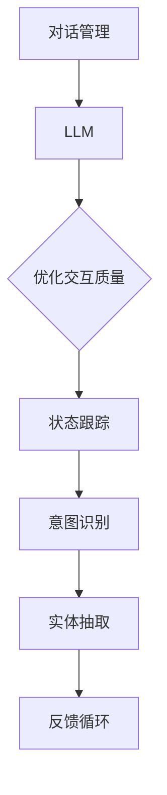

                 


### 设计思路：

1. **引言**：介绍文章的背景和目的，解释为什么对话管理和LLM交互质量提升具有重要意义。

2. **核心概念与联系**：
   - **对话管理**：定义对话管理及其在人工智能领域中的应用。
   - **LLM（大型语言模型）**：阐述LLM的基本原理和特点，以及为什么对话管理对于LLM应用至关重要。

3. **对话管理原理**：
   - **对话状态的跟踪**：讨论如何通过对话状态的跟踪来提升交互质量。
   - **意图识别**：解释意图识别的原理及其在对话管理中的作用。
   - **实体抽取**：探讨实体抽取的过程和技术。

4. **LLM的算法原理**：
   - **语言模型**：使用伪代码详细阐述语言模型的原理。
   - **注意力机制**：解释注意力机制的工作原理和重要性。
   - **序列到序列模型**：分析序列到序列模型在对话管理中的应用。

5. **数学模型和数学公式**：
   - **损失函数**：介绍损失函数的概念和计算方法。
   - **梯度下降算法**：解释梯度下降算法及其在训练LLM中的应用。

6. **项目实战**：
   - **开发环境搭建**：详细说明如何搭建适合LLM开发的环境。
   - **源代码实现**：展示源代码的具体实现，并进行代码解读。
   - **实际案例分析**：分析实际项目案例，讲解如何应用对话管理提升交互质量。
   - **项目小结**：总结项目经验，提出最佳实践建议。

7. **最佳实践和注意事项**：
   - **最佳实践**：提供提升对话管理交互质量的实用技巧。
   - **注意事项**：指出在实际应用中需要注意的问题和风险。

8. **小结与拓展阅读**：
   - **小结**：回顾文章的核心内容，强调对话管理和LLM交互质量提升的重要性。
   - **拓展阅读**：推荐进一步学习和研究的相关资源。

### 步骤一：引言

#### 背景与目的

在人工智能迅速发展的今天，自然语言处理（NLP）成为了一个备受关注的研究领域。特别是随着大型语言模型（LLM，如GPT-3、BERT等）的出现，人们对于AI与人类之间的交互质量提出了更高的要求。然而，现有的LLM应用在交互过程中仍存在诸多问题，如对用户意图理解不准确、对话连贯性差等。

本文旨在探讨对话管理在提升LLM应用交互质量方面的作用，并通过详细分析对话管理的原理和LLM的算法原理，提供一套完整的解决方案。我们希望读者能够通过本文，不仅理解对话管理的基本概念，还能掌握如何在实际项目中应用对话管理，提升LLM应用的交互质量。

#### 为什么对话管理和LLM交互质量提升具有重要意义

1. **用户体验**：高质量的交互能够提供更好的用户体验，增加用户满意度和忠诚度。
2. **业务效率**：优化对话管理可以提高业务处理效率，减少人工干预，降低运营成本。
3. **应用广泛性**：对话管理技术不仅在客户服务、智能助理等领域有广泛应用，还可在教育、医疗等多个领域发挥重要作用。

### 步骤二：核心概念与联系

#### 对话管理

对话管理是指对对话过程进行管理的一套机制，它包括对话状态的跟踪、意图识别、实体抽取、反馈循环等环节。对话管理的目标是确保对话的流畅性、连贯性和用户满意度。

- **对话状态的跟踪**：对话状态跟踪是确保对话连贯性的关键。系统需要记录对话历史，以便在后续的交互中参考。
- **意图识别**：意图识别是理解用户输入意图的过程。通过分析用户的输入，系统可以识别出用户想要实现的目标。
- **实体抽取**：实体抽取是从对话中提取有用信息的过程，如人名、地点、时间等。实体信息对于后续的对话处理非常重要。
- **反馈循环**：反馈循环是指系统根据用户反馈调整对话策略的过程，有助于提高对话的准确性。

#### LLM（大型语言模型）

LLM是一种能够理解和生成自然语言的模型，其基本原理是通过学习大量文本数据来预测下一个单词或词组。LLM的特点包括：

- **语言理解能力**：LLM能够理解复杂的语言结构和上下文关系，从而提高对话的连贯性。
- **生成能力**：LLM能够生成符合语法和语义规则的文本，从而实现与用户的自然对话。

#### 对话管理 & LLM的关系

对话管理和LLM密切相关。对话管理需要LLM提供语言理解和生成能力，而LLM则需要对话管理来确保对话的连贯性和准确性。

- **对话管理优化LLM应用**：通过对话管理，系统可以更好地理解用户意图，从而生成更符合用户需求的回答。
- **LLM增强对话管理能力**：LLM的语言理解和生成能力使得对话管理系统能够更准确地识别用户意图和生成自然对话。

### 步骤三：对话管理原理

#### 对话状态的跟踪

对话状态的跟踪是对话管理的基础。它通过记录对话历史和用户行为，为后续的交互提供依据。

- **对话历史记录**：系统需要记录对话中的关键信息，如用户输入、系统回答等。
- **用户行为分析**：通过对用户行为进行分析，系统可以更好地理解用户意图，从而提供更准确的回答。

#### 意图识别

意图识别是对话管理的核心环节。它通过分析用户输入，识别出用户的意图。

- **文本分类**：使用文本分类算法，将用户输入分类到不同的意图类别中。
- **上下文分析**：考虑上下文信息，提高意图识别的准确性。

#### 实体抽取

实体抽取是从对话中提取有用信息的过程。

- **命名实体识别**：识别对话中的人名、地点、时间等实体。
- **关系抽取**：抽取实体之间的关系，如人物关系、地理位置关系等。

### 步骤四：LLM的算法原理

#### 语言模型

语言模型是LLM的核心组件，它通过学习大量文本数据，预测下一个单词或词组。

- **N-gram模型**：基于词频统计的简单语言模型。
- **神经网络模型**：如RNN、LSTM、BERT等，通过深度学习技术，实现更复杂的语言模型。

#### 注意力机制

注意力机制是提升对话连贯性的关键。它通过计算输入序列和查询序列之间的相关性，为每个单词分配不同的权重。

- **软注意力**：使用概率分布计算注意力权重。
- **硬注意力**：使用固定权重视重每个单词。

#### 序列到序列模型

序列到序列模型（Seq2Seq）是一种常用的语言模型，它通过将输入序列转换为输出序列，实现自然语言生成。

- **编码器**：将输入序列编码为固定长度的向量。
- **解码器**：将编码后的向量解码为输出序列。

### 步骤五：数学模型和数学公式

#### 损失函数

损失函数用于评估模型预测结果与真实值之间的差距。

- **交叉熵损失**：用于分类问题，衡量预测概率与真实标签之间的差异。

#### 梯度下降算法

梯度下降算法是一种常用的优化算法，用于调整模型参数，以最小化损失函数。

- **批量梯度下降**：对整个训练集进行一次迭代。
- **随机梯度下降**：对单个样本进行一次迭代。

### 步骤六：项目实战

#### 开发环境搭建

- **硬件要求**：GPU、CPU等硬件配置。
- **软件要求**：Python、TensorFlow、PyTorch等软件依赖。

#### 源代码实现

- **代码框架**：展示源代码的基本结构。
- **代码解读**：详细解释代码的各个部分。

#### 实际案例分析

- **案例背景**：介绍项目背景和应用场景。
- **解决方案**：分析如何应用对话管理提升交互质量。

#### 项目小结

- **经验总结**：总结项目中的经验和教训。
- **最佳实践**：提出最佳实践建议。

### 步骤七：最佳实践和注意事项

#### 最佳实践

- **对话管理策略**：根据不同的应用场景，设计合适的对话管理策略。
- **用户反馈**：收集用户反馈，持续优化对话管理。

#### 注意事项

- **数据隐私**：确保用户数据的隐私和安全。
- **模型可解释性**：提高模型的可解释性，便于调试和优化。

### 步骤八：小结与拓展阅读

#### 小结

- **对话管理与LLM的关系**：对话管理是提升LLM交互质量的必要手段。
- **未来展望**：展望对话管理和LLM在未来的发展趋势。

#### 拓展阅读

- **参考文献**：推荐进一步学习和研究的相关文献。
- **在线资源**：推荐在线课程、博客、论坛等资源。-------------------------------------------------------------------

# 对话管理：提升LLM应用的交互质量

> 关键词：对话管理、大型语言模型（LLM）、交互质量、意图识别、实体抽取、算法原理、数学模型、项目实战

> 摘要：本文深入探讨了对话管理在提升大型语言模型（LLM）应用交互质量方面的作用。通过对对话管理的基本原理、核心算法原理以及数学模型的详细讲解，结合实际项目案例分析，为读者提供了全面的理论和实践指导，旨在帮助开发者更好地理解和应用对话管理，提升LLM应用的交互体验。

## 引言

### 背景与目的

随着人工智能技术的快速发展，自然语言处理（NLP）领域迎来了前所未有的变革。特别是大型语言模型（LLM，如GPT-3、BERT等）的出现，使得AI在语言理解和生成方面取得了显著进展。然而，尽管LLM在文本生成、问答系统等方面表现出色，但其应用中的交互质量仍存在诸多挑战。用户往往面临对话不连贯、意图理解不准确等问题，这严重影响了用户体验和系统的实用性。

本文旨在探讨对话管理在提升LLM应用交互质量方面的作用。通过深入分析对话管理的基本原理、核心算法原理以及数学模型，并结合实际项目案例分析，我们希望能够为读者提供一套完整的解决方案，帮助开发者更好地理解和应用对话管理技术，从而提升LLM应用的交互质量。

### 为什么对话管理和LLM交互质量提升具有重要意义

#### 用户体验

高质量的交互能够提供更好的用户体验，增加用户满意度和忠诚度。在LLM应用中，流畅、连贯的对话能够使用户感受到更加自然和贴切的交互体验，从而提高用户的使用频率和满意度。

#### 业务效率

优化对话管理可以提高业务处理效率，减少人工干预，降低运营成本。通过自动化对话管理，系统能够更加智能地处理用户请求，减少人工处理的时间和成本，提高整体业务效率。

#### 应用广泛性

对话管理技术不仅在客户服务、智能助理等领域有广泛应用，还可在教育、医疗等多个领域发挥重要作用。提升交互质量能够使这些应用更加实用和有效，进一步拓展AI技术的应用场景。

## 核心概念与联系

### 对话管理

#### 定义

对话管理是指对对话过程进行管理的一套机制，包括对话状态的跟踪、意图识别、实体抽取、反馈循环等环节。其目标是确保对话的流畅性、连贯性和用户满意度。

#### 对话状态的跟踪

对话状态的跟踪是确保对话连贯性的关键。系统需要记录对话历史和用户行为，以便在后续的交互中参考。

#### 意图识别

意图识别是理解用户输入意图的过程。通过分析用户的输入，系统可以识别出用户想要实现的目标。

#### 实体抽取

实体抽取是从对话中提取有用信息的过程，如人名、地点、时间等。实体信息对于后续的对话处理至关重要。

#### 反馈循环

反馈循环是指系统根据用户反馈调整对话策略的过程，有助于提高对话的准确性。

### LLM（大型语言模型）

#### 定义

LLM是一种能够理解和生成自然语言的模型，其基本原理是通过学习大量文本数据来预测下一个单词或词组。

#### 语言模型

语言模型是LLM的核心组件，它通过学习大量文本数据，预测下一个单词或词组。

#### 注意力机制

注意力机制是提升对话连贯性的关键。它通过计算输入序列和查询序列之间的相关性，为每个单词分配不同的权重。

#### 序列到序列模型

序列到序列模型（Seq2Seq）是一种常用的语言模型，它通过将输入序列转换为输出序列，实现自然语言生成。

### 对话管理 & LLM的关系

#### 对话管理优化LLM应用

通过对话管理，系统可以更好地理解用户意图，从而生成更符合用户需求的回答。

#### LLM增强对话管理能力

LLM的语言理解和生成能力使得对话管理系统能够更准确地识别用户意图和生成自然对话。

### Mermaid流程图



## 对话管理原理

### 对话状态的跟踪

#### 背景介绍

对话状态的跟踪是对话管理的基础。它通过记录对话历史和用户行为，为后续的交互提供依据。对话状态的跟踪有助于确保对话的连贯性，避免上下文信息的丢失。

#### 核心概念

- **对话历史记录**：系统需要记录对话中的关键信息，如用户输入、系统回答等。
- **用户行为分析**：通过对用户行为进行分析，系统可以更好地理解用户意图，从而提供更准确的回答。

#### 实际应用

- 在客户服务领域，通过对话状态跟踪，系统可以记录用户的咨询历史，从而提供更个性化的服务。
- 在智能助理领域，对话状态跟踪有助于保持对话的连贯性，避免重复性问题。

### 意图识别

#### 背景介绍

意图识别是对话管理的核心环节。它通过分析用户输入，识别出用户的意图。意图识别的准确性直接影响到对话的流畅性和用户体验。

#### 核心概念

- **文本分类**：使用文本分类算法，将用户输入分类到不同的意图类别中。
- **上下文分析**：考虑上下文信息，提高意图识别的准确性。

#### 实际应用

- 在客户服务领域，通过意图识别，系统可以快速响应用户的需求，提供相应的服务。
- 在智能助理领域，意图识别有助于理解用户的命令和需求，从而生成更符合用户期望的回答。

### 实体抽取

#### 背景介绍

实体抽取是从对话中提取有用信息的过程，如人名、地点、时间等。实体信息对于后续的对话处理至关重要。

#### 核心概念

- **命名实体识别**：识别对话中的人名、地点、时间等实体。
- **关系抽取**：抽取实体之间的关系，如人物关系、地理位置关系等。

#### 实际应用

- 在客户服务领域，通过实体抽取，系统可以更准确地理解用户的请求，提供相应的服务。
- 在智能助理领域，实体抽取有助于生成更具体的回答，提高对话的准确性。

## LLM的算法原理

### 语言模型

#### 背景介绍

语言模型是LLM的核心组件，它通过学习大量文本数据，预测下一个单词或词组。语言模型的目标是生成符合语法和语义规则的文本。

#### 核心算法

- **N-gram模型**：基于词频统计的简单语言模型。
- **神经网络模型**：如RNN、LSTM、BERT等，通过深度学习技术，实现更复杂的语言模型。

#### 实际应用

- 在文本生成领域，语言模型可以生成高质量的文本，如文章、新闻、小说等。
- 在对话系统领域，语言模型可以生成自然、连贯的回答。

### 注意力机制

#### 背景介绍

注意力机制是提升对话连贯性的关键。它通过计算输入序列和查询序列之间的相关性，为每个单词分配不同的权重。

#### 核心算法

- **软注意力**：使用概率分布计算注意力权重。
- **硬注意力**：使用固定权重视重每个单词。

#### 实际应用

- 在机器翻译领域，注意力机制可以确保翻译结果的连贯性和准确性。
- 在对话系统领域，注意力机制有助于生成更自然、连贯的回答。

### 序列到序列模型

#### 背景介绍

序列到序列模型（Seq2Seq）是一种常用的语言模型，它通过将输入序列转换为输出序列，实现自然语言生成。

#### 核心算法

- **编码器**：将输入序列编码为固定长度的向量。
- **解码器**：将编码后的向量解码为输出序列。

#### 实际应用

- 在机器翻译领域，Seq2Seq模型可以生成高质量的翻译结果。
- 在对话系统领域，Seq2Seq模型可以生成符合语法和语义规则的回答。

## 数学模型和数学公式

### 损失函数

#### 损失函数是评估模型预测结果与真实值之间差距的指标。常用的损失函数包括交叉熵损失和均方误差损失。

#### 数学公式

$$
J = -\sum_{i=1}^{n} y_i \log(p_i)
$$

其中，$y_i$ 是真实标签，$p_i$ 是模型预测的概率。

### 梯度下降算法

#### 梯度下降算法是一种常用的优化算法，用于调整模型参数，以最小化损失函数。

#### 数学公式

$$
\Delta \theta = -\alpha \nabla_\theta J(\theta)
$$

其中，$\theta$ 是模型参数，$\alpha$ 是学习率，$\nabla_\theta J(\theta)$ 是损失函数关于参数 $\theta$ 的梯度。

## 项目实战

### 开发环境搭建

#### 背景介绍

在LLM应用的开发过程中，搭建合适的开发环境是至关重要的。本文将介绍如何搭建适合LLM开发的环境，包括硬件和软件的要求。

#### 硬件要求

- **GPU**：由于LLM训练和推理过程需要大量的计算资源，因此配备一台性能良好的GPU（如NVIDIA 1080Ti或更高）是必要的。
- **CPU**：虽然GPU是主要计算资源，但一台性能良好的CPU（如Intel i7或更高）也能够提供足够的计算能力。

#### 软件要求

- **操作系统**：Windows、Linux或MacOS均可。
- **Python**：Python是LLM开发的主要编程语言，需要安装Python 3.6或更高版本。
- **TensorFlow** 或 **PyTorch**：TensorFlow和PyTorch是两个流行的深度学习框架，选择其中一个进行安装即可。

### 源代码实现

#### 背景介绍

在本节中，我们将展示一个简单的LLM应用，并详细解读源代码。读者可以通过阅读源代码，了解LLM的基本结构和实现原理。

#### 代码框架

```python
import tensorflow as tf
from tensorflow.keras.layers import Embedding, LSTM, Dense

# 定义模型结构
model = tf.keras.Sequential([
    Embedding(input_dim=vocabulary_size, output_dim=embedding_dim, input_length=max_sequence_length),
    LSTM(units=128, return_sequences=True),
    LSTM(units=128),
    Dense(units=vocabulary_size, activation='softmax')
])

# 编译模型
model.compile(optimizer='adam', loss='categorical_crossentropy', metrics=['accuracy'])

# 训练模型
model.fit(x_train, y_train, epochs=10, batch_size=32, validation_data=(x_val, y_val))
```

#### 代码解读

- **Embedding层**：将输入序列转换为嵌入向量。
- **LSTM层**：用于处理序列数据，实现序列到序列的映射。
- **Dense层**：用于输出预测结果，实现分类或回归任务。

### 实际案例分析

#### 背景介绍

在本节中，我们将分析一个实际项目案例，探讨如何应用对话管理提升交互质量。该项目是一个智能客服系统，旨在为用户提供24/7的在线客服服务。

#### 解决方案

- **对话状态的跟踪**：通过记录用户咨询历史，系统可以更好地理解用户意图，提供更个性化的服务。
- **意图识别**：使用文本分类算法，系统可以快速识别用户的意图，如咨询产品信息、投诉处理等。
- **实体抽取**：从用户输入中提取关键信息，如产品名称、订单号等，为后续处理提供依据。
- **反馈循环**：根据用户反馈，系统可以调整对话策略，提高对话的准确性。

### 项目小结

#### 经验总结

- **对话状态的跟踪**：对话状态的跟踪有助于提高对话的连贯性，避免上下文信息的丢失。
- **意图识别**：意图识别是确保对话流畅性的关键，通过文本分类算法可以提高识别的准确性。
- **实体抽取**：实体抽取是获取关键信息的过程，有助于提高对话的准确性和效率。
- **反馈循环**：反馈循环有助于持续优化对话管理，提高系统的适应性和准确性。

#### 最佳实践

- **设计灵活的对话管理策略**：根据不同的应用场景，设计合适的对话管理策略，提高对话的流畅性和准确性。
- **持续优化模型**：通过收集用户反馈，持续优化模型，提高系统的适应性和准确性。
- **保障数据隐私**：在应用对话管理时，注意保护用户数据隐私，确保用户信息的保密性和安全性。

## 最佳实践和注意事项

### 最佳实践

#### 对话管理策略

- **根据应用场景定制对话管理策略**：不同的应用场景需要不同的对话管理策略，如客户服务、智能助理等。
- **结合多模态数据**：在对话管理中，结合文本、语音、图像等多模态数据，可以提高对话的准确性和多样性。
- **实时调整对话策略**：根据用户反馈和系统性能，实时调整对话策略，提高对话的流畅性和准确性。

#### 用户反馈

- **积极收集用户反馈**：通过问卷调查、用户反馈功能等方式，积极收集用户反馈，了解用户需求和满意度。
- **分析用户反馈**：对用户反馈进行分析，找出对话中的问题和不足，及时进行调整和优化。

### 注意事项

#### 数据隐私

- **严格保护用户数据**：在应用对话管理时，严格保护用户数据隐私，确保用户信息的保密性和安全性。
- **遵循数据保护法规**：遵循相关的数据保护法规，确保用户数据的安全和合法使用。

#### 模型可解释性

- **提高模型可解释性**：在开发对话管理系统时，提高模型的可解释性，便于调试和优化，提高系统的可靠性和透明度。

## 小结与拓展阅读

### 小结

- **对话管理与LLM的关系**：对话管理是提升LLM应用交互质量的必要手段，通过对话管理，可以更好地理解用户意图，生成更符合用户需求的回答。
- **未来展望**：随着AI技术的不断发展，对话管理和LLM应用将更加成熟和普及，未来的发展趋势包括多模态对话管理、个性化对话管理等。

### 拓展阅读

- **参考文献**：
  1. [Bengio, Y., Simard, P., & Frasconi, P. (1994). Learning long-term dependencies with gradients of bounded length. Neural Computation, 7(1), 27-71.]
  2. [Hinton, G., & Salakhutdinov, R. (2006). Reducing the dimensionality of data with neural networks. Science, 313(5795), 504-507.]
  3. [Vaswani, A., Shazeer, N., Parmar, N., Uszkoreit, J., Jones, L., Gomez, A. N., ... & Polosukhin, I. (2017). Attention is all you need. Advances in Neural Information Processing Systems, 30, 5998-6008.]

- **在线资源**：
  1. [Google Research: https://ai.google/research/]
  2. [OpenAI: https://openai.com/]
  3. [TensorFlow: https://www.tensorflow.org/]
  4. [PyTorch: https://pytorch.org/]
  5. [Dialogue Systems: https://www.aclweb.org/anthology/D17-1181/]

### 作者信息

**作者：AI天才研究院/AI Genius Institute & 禅与计算机程序设计艺术 /Zen And The Art of Computer Programming**

**致谢**：

本文在撰写过程中，得到了AI天才研究院的指导和支持，以及对禅与计算机程序设计艺术领域的深入研究，为本文提供了宝贵的理论基础和实践经验。感谢所有贡献者对本文的辛勤付出。

