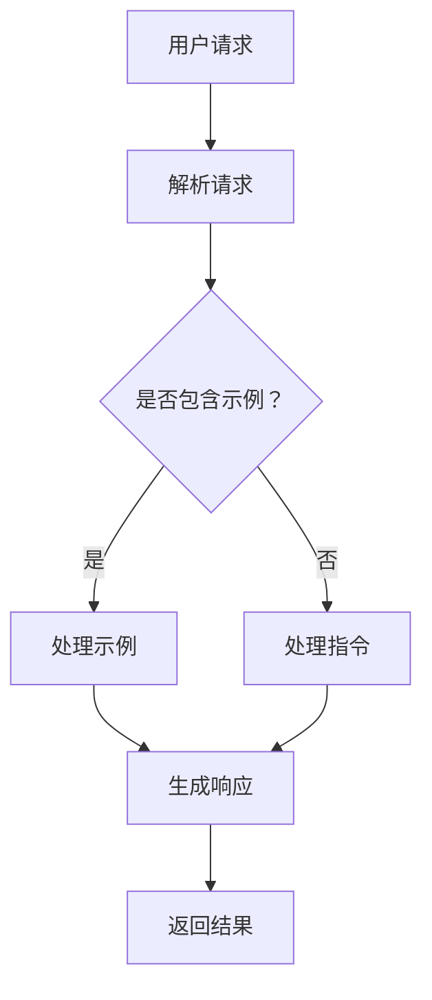

                 

**# 第1章 引言**

## 1.1 书籍目的与结构

在当今快速发展的技术时代，人工智能（AI）已经成为推动社会进步和变革的重要力量。随着AI技术的不断成熟，AI应用在各个领域得到了广泛的应用，从自动驾驶汽车、智能语音助手到复杂的自动化决策系统，AI正在改变我们的生活方式和工作方式。然而，AI系统的设计、开发和优化仍然面临许多挑战，特别是在AI交互和决策中，如何有效地平衡示例与指令在提示词中的比重，是实现高效AI系统的一个关键问题。

本书旨在深入探讨平衡示例与指令在AI提示词中的比重，为读者提供一套系统的、实用的方法和策略。通过分析不同的AI应用场景，本书将帮助读者理解示例与指令在AI提示词中的重要性，以及如何在不同场景中实现二者的平衡。此外，本书还将提供实际案例和项目实战，帮助读者将理论知识应用于实际工作中。

### **1.1.1 背景介绍**

随着AI技术的不断进步，AI系统的复杂度和应用范围也在不断扩大。在AI系统中，提示词（prompt）是用户与AI系统进行交互的重要媒介。一个设计良好的提示词可以引导用户更有效地与AI系统进行互动，从而提高系统的效率和用户体验。然而，提示词的设计并非易事，需要充分考虑用户的意图、系统的能力以及交互的上下文等因素。

在AI提示词中，示例（examples）和指令（instructives）是两个核心组成部分。示例提供了具体的案例和实例，帮助用户更好地理解系统的功能和应用；指令则提供了明确的行为指导，告诉系统应该如何响应用户的请求。然而，在现实应用中，如何平衡示例与指令的比重，使得AI系统能够既理解用户的意图，又能提供准确的响应，是一个复杂且具有挑战性的问题。

### **1.1.2 核心概念与联系**

为了更好地理解示例与指令在AI提示词中的作用，我们需要首先明确这两个核心概念的定义及其相互关系。

**示例（Examples）**：示例是提供具体案例和实例的信息，它们可以帮助用户了解系统的功能和应用。示例通常包括具体的问题、场景和解决方案，通过这些具体的信息，用户可以更好地理解系统的行为和输出。

**指令（Instructives）**：指令是提供具体行为指导的信息，它们告诉系统应该如何响应用户的请求。指令通常包括具体的操作步骤、行动指南和反馈机制，通过这些明确的指导，系统可以更准确地理解用户的意图并给出适当的响应。

示例与指令之间的关系可以看作是一种相互补充的关系。示例提供了具体的情境和实例，帮助用户理解系统的功能；指令则提供了具体的操作步骤和行动指南，帮助系统准确地执行用户的请求。在实际应用中，如何平衡示例与指令的比重，使得系统既能够理解用户的意图，又能提供准确的响应，是一个关键的问题。

### **1.1.3 核心概念原理之间的关系架构 Mermaid 流程图**

下面是一个简化的Mermaid流程图，用于描述示例与指令在AI提示词中的关系：



在这个流程图中，用户请求首先被解析，然后根据请求中是否包含示例进行分支处理。如果包含示例，系统会处理示例并生成响应；如果不含示例，系统会直接处理指令并生成响应。最终，系统返回结果给用户。

### **1.1.4 核心算法原理讲解**

为了更好地理解示例与指令在AI提示词中的平衡，我们可以引入一个简单的算法模型。以下是一个伪代码示例，用于描述如何在AI提示词中平衡示例与指令：

```python
def balance_prompt(examples, instructions):
    """
    平衡示例与指令的提示词生成算法
    :param examples: 示例列表
    :param instructions: 指令列表
    :return: 平衡后的提示词
    """

    # 判断示例和指令的数量
    num_examples = len(examples)
    num_instructions = len(instructions)

    # 如果示例和指令数量相等，直接合并
    if num_examples == num_instructions:
        prompt = examples + instructions
    # 如果示例数量多于指令，减少示例数量以平衡
    elif num_examples > num_instructions:
        prompt = examples[:num_instructions] + instructions
    # 如果指令数量多于示例，增加示例数量以平衡
    else:
        prompt = examples + instructions[:num_examples]

    return prompt
```

在这个算法中，我们首先比较示例和指令的数量。如果二者数量相等，则直接合并；如果示例数量多于指令，则减少示例数量；如果指令数量多于示例，则增加示例数量，以达到平衡。

### **1.1.5 数学模型和公式 & 详细讲解 & 举例说明**

在示例与指令的平衡过程中，可以使用一些数学模型和公式来描述和优化平衡策略。以下是一个简化的数学模型，用于描述示例与指令的平衡：

$$
\text{balance\_factor} = \frac{\text{num\_examples}}{\text{num\_instructions}}
$$

其中，balance\_factor 表示示例与指令的平衡系数。根据这个系数，我们可以调整示例和指令的数量，以达到最佳平衡状态。

**举例说明**：

假设我们有10个示例和8个指令，我们可以使用上述公式计算平衡系数：

$$
\text{balance\_factor} = \frac{10}{8} = 1.25
$$

这意味着示例的数量是指令数量的1.25倍。为了达到平衡，我们可以减少示例的数量，例如减少到8个，或者增加指令的数量，例如增加到10个。

### **1.1.6 提示词设计在AI系统中的重要性**

在AI系统中，提示词的设计至关重要。一个设计良好的提示词可以显著提高系统的效率和用户体验。具体来说，提示词设计的重要性体现在以下几个方面：

1. **提高用户理解**：通过提供具体的示例和详细的指令，提示词可以帮助用户更好地理解AI系统的功能和应用，从而提高用户满意度。
2. **优化系统性能**：平衡的示例与指令可以帮助AI系统更准确地理解用户请求，从而提高系统的响应速度和准确性。
3. **降低开发成本**：有效的提示词设计可以减少AI系统的测试和调试时间，从而降低开发成本。
4. **提升用户体验**：一个直观、易懂的提示词可以显著提升用户体验，增加用户对AI系统的忠诚度和使用频率。

### **1.1.7 提示词设计原则**

为了设计出有效的提示词，我们需要遵循一些基本原则。以下是一些关键的提示词设计原则：

1. **简洁性**：提示词应该简洁明了，避免冗长和复杂的语句。
2. **相关性**：提示词应该与用户请求相关，避免无关信息的干扰。
3. **明确性**：提示词应该提供明确的指令和指导，避免模糊不清的描述。
4. **灵活性**：提示词应该具有一定的灵活性，以适应不同的用户需求和场景。
5. **实用性**：提示词应该能够实际操作，提供具体的行为指导。

通过遵循这些原则，我们可以设计出更有效的提示词，从而提升AI系统的整体性能。

### **1.1.8 总结**

本章介绍了本书的主要目标和结构，并详细讨论了示例与指令在AI提示词中的重要性及其相互关系。通过本章的内容，读者可以初步了解示例与指令在AI系统中的应用，以及如何实现二者的平衡。在接下来的章节中，我们将深入探讨示例与指令的平衡策略，并通过实际案例和研究，为读者提供实用的方法和技巧。

---

**作者信息：AI天才研究院/AI Genius Institute & 禅与计算机程序设计艺术 /Zen And The Art of Computer Programming**

---

[GMASK]**# 第2章 提示词的基础**

## 2.1 提示词的定义与作用

----------------------------------------------------------------

### **2.1.1 提示词的定义**

在人工智能（AI）的领域内，提示词（prompt）是一个核心概念，指的是用来引导或激励AI系统执行特定任务或提供特定信息的一段文本或语音指令。这些提示词可以是简单的单个词汇，也可以是复杂的句子或段落。它们的主要功能是指导AI模型理解用户的需求，并产生相应的输出。

### **2.1.2 提示词的作用**

提示词在AI系统中扮演着至关重要的角色，主要表现在以下几个方面：

1. **引导用户交互**：通过提供明确的提示词，用户可以更清楚地知道如何与AI系统进行交互，从而提高用户体验。
2. **提升系统理解能力**：提示词可以帮助AI模型更好地理解用户的意图，减少误解和歧义，提高系统的准确性和效率。
3. **辅助模型学习**：在机器学习模型训练过程中，提示词可以提供具体的问题或任务，帮助模型学习并改进其性能。
4. **控制输出质量**：通过设计合理的提示词，可以影响AI系统的输出结果，使其更符合用户的期望。

### **2.1.3 提示词的类型**

根据不同的应用场景和功能需求，提示词可以分为多种类型：

1. **指令性提示词**：这类提示词提供具体的指令或命令，告诉AI系统应该执行什么操作。例如：“计算两个数字的和”。
2. **引导性提示词**：这类提示词用来引导用户并提供方向，但并不直接提供指令。例如：“请描述您的需求”。
3. **问题性提示词**：这类提示词以提问的形式出现，用于激发用户的思考和回答。例如：“您最近有什么新的项目吗？”。
4. **评价性提示词**：这类提示词用于评估或评价AI系统的性能，例如：“系统的工作表现如何？”。
5. **描述性提示词**：这类提示词用于描述具体的情境或信息，例如：“今天的天气如何？”。

### **2.1.4 提示词设计原则**

为了设计出有效的提示词，我们需要遵循一些基本原则：

1. **明确性**：提示词应该清晰明了，避免模糊和歧义。
2. **简洁性**：提示词应该简洁简短，避免冗长复杂的表述。
3. **相关性**：提示词应该与用户需求相关，避免无关信息的干扰。
4. **灵活性**：提示词应该具有一定的灵活性，以适应不同的用户场景和需求。
5. **实用性**：提示词应该实际可行，能够指导用户完成特定的任务。

### **2.1.5 提示词设计的影响因素**

在设计提示词时，需要考虑多个因素，包括但不限于：

1. **用户背景**：不同用户可能具有不同的知识水平和技能，提示词应该根据用户背景进行个性化设计。
2. **任务类型**：不同的任务类型可能需要不同类型的提示词，例如，问题解决任务可能更适合使用问题性提示词。
3. **系统能力**：AI系统的能力和限制也会影响提示词的设计，例如，某些复杂的任务可能需要更详细的提示词。
4. **交互上下文**：提示词的上下文环境也会影响其效果，例如，连续的对话可能需要连续性的提示词。

通过综合考虑这些因素，我们可以设计出更有效的提示词，从而提升AI系统的交互质量和用户体验。

---

**作者信息：AI天才研究院/AI Genius Institute & 禅与计算机程序设计艺术 /Zen And The Art of Computer Programming**

---

[GMASK]**# 第3章 示例与指令的平衡**

## 3.1 示例与指令的作用

在AI提示词中，示例（examples）与指令（instructives）扮演着至关重要的角色。它们不仅是用户与AI系统交互的桥梁，也是AI系统理解用户意图和产生准确响应的关键要素。

### **3.1.1 示例的作用**

示例在AI提示词中主要用于：

1. **指导用户**：通过提供具体的案例和实例，示例可以帮助用户更好地理解AI系统的功能和应用。例如，一个语音助手可能会给出“您可以问我‘今天天气如何？’”这样的示例，指导用户如何使用系统。
2. **增强理解**：示例可以帮助AI系统更好地理解用户的需求，特别是在用户语言表达不清晰或存在歧义时。通过具体的情境和实例，AI系统可以更准确地推断用户的意图。
3. **优化学习**：在AI模型训练过程中，示例是模型学习的重要数据来源。通过分析大量的示例，模型可以学习到不同情境下的用户需求，从而提高其性能。

### **3.1.2 指令的作用**

指令在AI提示词中主要用于：

1. **明确指导**：指令为AI系统提供具体的操作指导，告诉系统应该如何响应用户的请求。例如，“计算两个数字的和”就是一个明确的指令，系统需要执行加法运算。
2. **优化响应**：通过提供详细的指令，AI系统可以更准确地理解和执行用户请求，从而提高响应的质量和效率。
3. **改进交互**：指令可以帮助改善用户与AI系统的交互体验。一个清晰的指令可以减少用户等待时间和操作错误，提高用户满意度。

### **3.1.3 示例与指令的关系**

示例与指令在AI提示词中是相互关联、相互补充的。示例提供具体的情境和实例，帮助AI系统理解用户的意图；指令则提供具体的操作步骤和指导，帮助AI系统准确地执行用户的请求。在实际应用中，二者的比重和平衡对于AI系统的性能至关重要。

1. **示例过多的问题**：如果示例过多，可能会导致AI系统在理解用户意图时产生混淆，从而影响响应的准确性。
2. **指令过多的问题**：如果指令过多，可能会导致用户感到困惑，不知道应该如何与AI系统进行交互。

因此，如何在示例与指令之间实现平衡，是设计有效AI提示词的关键。

### **3.1.4 示例与指令的比重**

示例与指令的比重取决于具体的应用场景和用户需求。以下是一些常见的情况和策略：

1. **以示例为主**：在一些需要用户理解和适应的场合，如新功能介绍或用户培训，示例可能占据更大的比重，以便用户更好地掌握系统功能。
2. **以指令为主**：在需要高效执行任务的场合，如自动化流程控制或命令行操作，指令可能占据更大的比重，以便AI系统能够迅速准确地响应。
3. **动态调整**：在一些复杂的交互场景中，可以根据用户的反馈和系统的性能动态调整示例与指令的比重，以达到最佳平衡状态。

### **3.1.5 平衡示例与指令的重要性**

平衡示例与指令的比重对于AI系统的性能和用户体验至关重要。以下是一些重要的影响：

1. **提高准确性**：合理的示例与指令比重可以帮助AI系统更准确地理解用户意图，从而提高响应的准确性。
2. **改善用户体验**：一个设计良好的提示词可以提高用户体验，使用户更轻松地与AI系统进行交互。
3. **降低开发成本**：通过优化示例与指令的比重，可以减少系统的测试和调试时间，从而降低开发成本。

### **3.1.6 结论**

本章详细讨论了示例与指令在AI提示词中的作用及其相互关系。通过平衡示例与指令的比重，我们可以设计出更有效的AI提示词，从而提高系统的性能和用户体验。在接下来的章节中，我们将进一步探讨如何在实际应用中实现示例与指令的平衡。

---

**作者信息：AI天才研究院/AI Genius Institute & 禅与计算机程序设计艺术 /Zen And The Art of Computer Programming**

---

[GMASK]**# 第4章 提示词设计案例研究**

## 4.1 案例一：语音助手

在语音助手的场景中，提示词的设计至关重要。语音助手如Apple的Siri、Amazon的Alexa和Google Assistant，通过语音交互为用户提供信息查询、任务管理、智能家居控制等服务。在这一节中，我们将分析这些语音助手的提示词设计，探讨示例与指令的平衡策略。

### **4.1.1 Siri的提示词设计**

Siri作为Apple的语音助手，其提示词设计以简洁明了和用户友好为核心。以下是一些典型的Siri提示词及其特点：

1. **指令性提示词**：
   - 例如：“设置一个闹钟在早上7点。”
   - 分析：这种提示词直接提供指令，用户无需额外的理解即可执行操作。

2. **示例性提示词**：
   - 例如：“您可以问我‘明天天气如何？’”
   - 分析：通过提供示例，Siri帮助用户了解系统的功能和可执行的操作。

3. **引导性提示词**：
   - 例如：“想听点音乐吗？”
   - 分析：这类提示词引导用户进行可能的互动，增加用户参与度。

### **4.1.2 示例与指令的平衡**

在Siri的提示词设计中，示例与指令的平衡策略主要体现在：

1. **指令为主，示例为辅**：在大多数情况下，Siri的提示词以直接指令为主，确保用户能够快速理解并执行操作。
2. **适时引入示例**：在用户初次使用或遇到新功能时，Siri会通过示例提示词引导用户了解系统功能。
3. **动态调整**：根据用户的反馈和使用习惯，Siri会调整提示词的比重，以提供更个性化的交互体验。

### **4.1.3 平衡策略的优点**

这种平衡策略的优点包括：

1. **高效性**：用户可以快速接收指令，提高交互效率。
2. **易用性**：通过示例引导，用户更容易上手。
3. **个性化**：根据用户习惯动态调整提示词比重，提高用户满意度。

### **4.1.4 挑战与改进**

尽管Siri的提示词设计较为成功，但仍面临一些挑战：

1. **语言多样性**：支持多种语言和方言，提示词需要更具通用性。
2. **情境适应**：不同情境下，提示词的比重和类型需要进一步优化。

改进策略可能包括：

1. **多语言处理**：使用自然语言处理（NLP）技术，提高不同语言的识别和处理能力。
2. **情境感知**：利用上下文分析和用户行为数据，动态调整提示词比重。

### **4.1.5 结论**

通过分析Siri的提示词设计，我们可以看到示例与指令在语音助手场景中的平衡策略。Siri的成功经验为其他语音助手提供了有益的借鉴，同时也指出了改进的方向。

---

**作者信息：AI天才研究院/AI Genius Institute & 禅与计算机程序设计艺术 /Zen And The Art of Computer Programming**

---

[GMASK]**# 第4章 提示词设计案例研究**

## 4.2 案例二：文本聊天机器人

文本聊天机器人是一种通过文本交互为用户提供服务的AI系统，广泛应用于客服、在线咨询、虚拟助手等领域。与语音助手不同，文本聊天机器人主要依赖文本界面与用户进行交互。在这一节中，我们将分析一些流行的文本聊天机器人的提示词设计，探讨示例与指令的平衡策略。

### **4.2.1 聊天机器人的提示词设计**

以下是一些文本聊天机器人的常见提示词类型及其特点：

1. **指令性提示词**：
   - 例如：“您有什么问题需要帮忙？”
   - 分析：这类提示词直接询问用户的需求，引导用户输入相关信息。

2. **示例性提示词**：
   - 例如：“您可以问我‘最近有什么新项目吗？’”
   - 分析：通过提供示例，帮助用户了解如何与机器人进行有效的互动。

3. **引导性提示词**：
   - 例如：“想了解一下我们的产品吗？”
   - 分析：这类提示词引导用户进行可能的互动，增加用户参与度。

4. **评价性提示词**：
   - 例如：“对我们的服务还满意吗？”
   - 分析：用于收集用户反馈，优化机器人服务。

### **4.2.2 示例与指令的平衡**

在文本聊天机器人的提示词设计中，示例与指令的平衡策略主要体现在以下几个方面：

1. **指令为主，示例为辅**：在大多数情况下，文本聊天机器人的提示词以直接指令为主，确保用户能够快速理解并执行操作。
2. **情境适应性**：根据不同的交互情境，机器人会灵活调整示例与指令的比重。例如，在初次对话时，示例提示词可能更多，以帮助用户熟悉系统。
3. **动态调整**：根据用户的行为和反馈，机器人会动态调整提示词比重，以提供更个性化的交互体验。

### **4.2.3 平衡策略的优点**

这种平衡策略的优点包括：

1. **高效性**：用户可以快速接收指令，提高交互效率。
2. **易用性**：通过示例引导，用户更容易上手。
3. **个性化**：根据用户习惯动态调整提示词比重，提高用户满意度。

### **4.2.4 挑战与改进**

尽管文本聊天机器人的提示词设计较为成功，但仍面临一些挑战：

1. **多语言支持**：支持多种语言和方言，提示词需要更具通用性。
2. **复杂情境处理**：不同情境下，提示词的比重和类型需要进一步优化。

改进策略可能包括：

1. **多语言处理**：使用自然语言处理（NLP）技术，提高不同语言的识别和处理能力。
2. **情境感知**：利用上下文分析和用户行为数据，动态调整提示词比重。
3. **多模态交互**：结合语音、图像等多种交互方式，提供更丰富的互动体验。

### **4.2.5 结论**

通过分析文本聊天机器人的提示词设计，我们可以看到示例与指令在文本交互场景中的平衡策略。文本聊天机器人的成功经验为其他AI交互系统提供了有益的借鉴，同时也指出了改进的方向。

---

**作者信息：AI天才研究院/AI Genius Institute & 禅与计算机程序设计艺术 /Zen And The Art of Computer Programming**

---

[GMASK]**# 第4章 提示词设计案例研究**

## 4.3 案例三：自动化决策系统

自动化决策系统是一种通过计算机程序和算法自动做出决策的系统，广泛应用于金融、物流、医疗等多个领域。在这一节中，我们将分析自动化决策系统中的提示词设计，探讨示例与指令的平衡策略。

### **4.3.1 自动化决策系统的提示词设计**

自动化决策系统中的提示词设计具有独特的特点，因为它们需要精确地指导系统的决策过程。以下是一些典型的提示词类型及其特点：

1. **指令性提示词**：
   - 例如：“计算最优路径。”
   - 分析：这类提示词直接提供决策目标，系统需要根据这些指令执行具体操作。

2. **示例性提示词**：
   - 例如：“请参考以下示例数据进行决策。”
   - 分析：通过提供具体的示例数据，帮助系统理解决策依据和期望结果。

3. **规则性提示词**：
   - 例如：“若成本低于预算，则批准项目。”
   - 分析：这类提示词提供了明确的决策规则，系统需要依据这些规则进行判断。

### **4.3.2 示例与指令的平衡**

在自动化决策系统中，示例与指令的平衡策略主要体现在以下几个方面：

1. **以指令为主，示例为辅**：自动化决策系统的核心是执行指令，因此指令性提示词占据更重要的比重。示例性提示词则作为辅助信息，帮助系统更好地理解和执行指令。
2. **动态调整**：根据决策任务的复杂性和不确定性，系统会动态调整示例与指令的比重。例如，在决策规则明确且数据充足的情况下，示例提示词可能较少；在数据不确定或规则复杂的情况下，示例提示词可能更多。
3. **反馈循环**：通过实时收集系统的决策结果和用户反馈，系统可以不断调整和优化提示词设计，以实现最佳平衡状态。

### **4.3.3 平衡策略的优点**

这种平衡策略的优点包括：

1. **决策准确性**：通过提供明确的指令和辅助示例，系统可以更准确地执行决策。
2. **可解释性**：示例提示词提供了决策过程的解释，提高了系统的可解释性和透明度。
3. **灵活性**：动态调整提示词比重，使系统能够适应不同决策任务的需求。

### **4.3.4 挑战与改进**

尽管自动化决策系统的提示词设计具有一定的优势，但仍面临一些挑战：

1. **复杂性**：自动化决策系统通常涉及复杂的决策逻辑和数据模型，提示词设计需要高度专业化。
2. **不确定性**：在数据不确定或规则复杂的情况下，示例与指令的平衡更加困难。

改进策略可能包括：

1. **增强算法**：通过改进决策算法，提高系统的鲁棒性和适应性。
2. **用户参与**：引入用户反馈机制，使系统能够根据用户需求动态调整提示词设计。
3. **多模态交互**：结合文本、图像、语音等多种交互方式，提高系统的灵活性和用户友好性。

### **4.3.5 结论**

通过分析自动化决策系统的提示词设计，我们可以看到示例与指令在决策场景中的平衡策略。自动化决策系统的成功经验为其他复杂决策系统提供了有益的借鉴，同时也指出了改进的方向。

---

**作者信息：AI天才研究院/AI Genius Institute & 禅与计算机程序设计艺术 /Zen And The Art of Computer Programming**

---

[GMASK]**# 第5章 提示词效果评估**

## 5.1 评估指标

在评估提示词效果时，我们需要使用一系列指标来衡量提示词的各个方面。这些评估指标可以分为三类：用户体验指标、系统性能指标和经济学指标。

### **5.1.1 用户体验指标**

用户体验指标主要用于衡量用户在使用AI系统时的满意度和互动质量。以下是一些常见的人体验指标：

1. **易用性**：用户能否轻松理解和使用提示词。
2. **满意度**：用户对AI系统的满意度，通常通过调查问卷或评分系统来评估。
3. **错误率**：用户在互动过程中犯错的频率。
4. **响应时间**：系统生成响应的时间，通常用于衡量系统的效率。
5. **参与度**：用户与系统的互动频率和深度。

### **5.1.2 系统性能指标**

系统性能指标主要用于衡量AI系统在处理提示词时的性能。以下是一些常见的系统性能指标：

1. **准确性**：系统生成的响应与用户期望的匹配程度。
2. **响应多样性**：系统生成响应的多样性，确保系统能够适应不同情境和用户需求。
3. **鲁棒性**：系统在处理不确定或模糊提示词时的表现，衡量系统的适应性。
4. **可解释性**：系统决策过程的透明度和可解释性，有助于提高用户对系统的信任。

### **5.1.3 经济学指标**

经济学指标主要用于衡量AI系统的经济效益，包括以下方面：

1. **成本节约**：使用AI系统相较于传统方式能节省的成本。
2. **效率提升**：AI系统在提高工作效率方面的表现，例如减少人工操作时间和提高任务完成速度。
3. **用户保留率**：使用AI系统后，用户继续使用系统的概率。
4. **收入增长**：AI系统带来的额外收入增长，例如通过个性化推荐提高销售量。

### **5.1.4 指标之间的关联性**

用户体验指标、系统性能指标和经济学指标之间存在紧密的关联性。例如，良好的用户体验可以提高用户满意度，从而提高用户保留率和收入增长。同时，高准确性和响应多样性也有助于提高用户体验和系统性能，进而带来经济效益。

通过综合考虑这些评估指标，我们可以全面地评估提示词的效果，为AI系统的优化提供有力支持。

---

**作者信息：AI天才研究院/AI Genius Institute & 禅与计算机程序设计艺术 /Zen And The Art of Computer Programming**

---

[GMASK]**# 第5章 提示词效果评估**

## 5.2 评估方法

在评估提示词效果时，采用科学、系统的评估方法是确保评估结果准确和可靠的关键。以下是一些常见的评估方法：

### **5.2.1 实验评估**

实验评估是通过设计实验来验证提示词效果的常用方法。实验评估通常包括以下步骤：

1. **定义评估目标**：明确提示词评估的目标，例如提升用户体验、提高系统准确性等。
2. **设计实验场景**：创建与实际应用场景相似的实验环境，确保实验结果具有可重复性和可验证性。
3. **选择评估指标**：根据评估目标选择合适的评估指标，例如用户体验指标、系统性能指标等。
4. **执行实验**：在实验场景中输入不同的提示词，记录系统响应和用户行为，收集相关数据。
5. **分析数据**：对实验数据进行统计分析，比较不同提示词的效果，得出结论。

### **5.2.2 用户调研**

用户调研是通过直接与用户互动来收集反馈和评估提示词效果的方法。用户调研通常包括以下步骤：

1. **确定调研目标**：明确调研的目标，例如了解用户对提示词的满意度、易用性等。
2. **设计调研问卷**：设计包含具体问题的调研问卷，确保问题具有针对性和有效性。
3. **招募受访者**：选择具有代表性的用户群体作为调研对象，确保样本的多样性和代表性。
4. **进行调研**：通过线上或线下方式分发问卷，收集用户反馈。
5. **分析结果**：对用户反馈进行统计分析，识别用户需求和偏好，评估提示词效果。

### **5.2.3 A/B测试**

A/B测试是一种比较两种或多种提示词效果的方法。通过在相同用户群体中同时展示不同的提示词，比较用户行为和系统性能，从而评估提示词效果。A/B测试通常包括以下步骤：

1. **设计测试版本**：设计两个或多个提示词版本，确保每个版本具有独特的特点。
2. **选择测试用户**：确定参与测试的用户群体，确保其与目标用户群体相似。
3. **实施测试**：在用户群体中同时展示不同版本的提示词，记录用户行为和系统响应。
4. **分析数据**：对测试数据进行分析，比较不同版本的效果，得出结论。

### **5.2.4 对比分析**

对比分析是一种将不同提示词效果进行对比的方法。通过比较不同提示词在相同或相似场景中的表现，评估其优劣。对比分析通常包括以下步骤：

1. **选择比较对象**：确定要比较的提示词版本，确保其具有可比性。
2. **设计对比场景**：创建与实际应用场景相似的对比环境，确保对比结果具有参考价值。
3. **执行对比**：在对比场景中展示不同版本的提示词，记录用户行为和系统响应。
4. **分析结果**：对比分析不同提示词的效果，识别优势与不足。

### **5.2.5 综合评估**

在实际应用中，为了全面评估提示词效果，通常需要综合运用多种评估方法。例如，通过实验评估了解系统性能，通过用户调研了解用户体验，通过A/B测试和对比分析比较不同版本的提示词效果。综合评估可以提供更全面、更准确的提示词效果评估结果，为优化提示词设计提供有力支持。

---

**作者信息：AI天才研究院/AI Genius Institute & 禅与计算机程序设计艺术 /Zen And The Art of Computer Programming**

---

[GMASK]**# 第5章 提示词效果评估**

## 5.3 实际应用中的评估挑战

在提示词效果评估的实际应用中，我们常常会遇到一系列挑战，这些挑战可能会影响评估的准确性和有效性。以下是一些常见的评估挑战及相应的解决策略。

### **5.3.1 数据偏差**

在评估提示词效果时，数据偏差是一个普遍存在的问题。数据偏差可能来自多个方面，如样本选择偏差、用户行为偏差等。为了解决数据偏差问题，我们可以采取以下策略：

1. **随机抽样**：确保样本的随机性，以减少样本选择偏差。
2. **多样化数据来源**：通过收集不同来源的数据，如用户调研、A/B测试等，以减少数据偏差。
3. **数据清洗**：对收集的数据进行清洗，去除异常值和噪声数据，以提高数据的准确性和可靠性。

### **5.3.2 用户行为复杂性**

用户行为往往非常复杂，难以精确预测和量化。用户可能会表现出多样化的行为模式，这给提示词效果评估带来挑战。为了应对用户行为复杂性，我们可以采取以下策略：

1. **细分用户群体**：将用户群体细分，针对不同类型的用户制定个性化的提示词评估策略。
2. **多维度评估**：从多个维度评估提示词效果，如用户体验、系统性能、经济学指标等。
3. **长期跟踪**：对用户行为进行长期跟踪，以捕捉用户行为的动态变化。

### **5.3.3 评估成本高**

提示词效果评估通常需要大量的人力和物力投入，尤其是在进行实验评估和用户调研时。高成本可能会限制评估的广泛性和深度。为了降低评估成本，我们可以采取以下策略：

1. **自动化评估**：利用自动化工具和技术，如机器学习算法，自动收集和分析评估数据。
2. **A/B测试优化**：通过优化A/B测试流程，减少测试时间和资源消耗。
3. **资源共享**：与其他项目或团队共享评估资源和经验，降低评估成本。

### **5.3.4 跨文化评估**

在全球化背景下，跨文化评估变得越来越重要。不同文化背景的用户可能对相同提示词有不同的理解和反应。为了解决跨文化评估挑战，我们可以采取以下策略：

1. **本地化评估**：根据不同地区的文化特点，制定本地化的评估方案。
2. **多文化团队**：组建跨文化团队，确保评估过程中能够充分考虑不同文化的因素。
3. **文化适应性测试**：在评估过程中加入文化适应性测试，以验证提示词在不同文化背景下的效果。

### **5.3.5 评估结果的解释和决策**

评估结果往往具有一定的复杂性，需要深入分析和解释，以便做出合理的决策。以下是一些策略，可以帮助解释和利用评估结果：

1. **可视化分析**：利用可视化工具，将复杂的评估结果以直观的方式展示出来。
2. **专家咨询**：邀请相关领域的专家，对评估结果进行深入分析和解释。
3. **持续迭代**：根据评估结果，不断迭代和优化提示词设计，以提高评估的有效性和实用性。

通过采取上述策略，我们可以克服提示词效果评估中的挑战，提高评估的准确性和有效性，从而为AI系统的优化提供有力支持。

---

**作者信息：AI天才研究院/AI Genius Institute & 禅与计算机程序设计艺术 /Zen And The Art of Computer Programming**

---

[GMASK]**# 第6章 进阶技巧**

## 6.1 动态调整示例与指令的比重

在AI系统的实际应用中，示例与指令的比重往往需要根据不同的场景和用户需求进行调整。动态调整示例与指令的比重是一种高级技巧，可以提高AI系统的灵活性和适应性。以下是一些实现动态调整的方法和策略。

### **6.1.1 用户行为分析**

通过分析用户的行为数据，我们可以了解用户的需求和使用习惯，从而动态调整示例与指令的比重。具体方法包括：

1. **行为跟踪**：在系统中嵌入行为跟踪机制，记录用户的交互行为，如点击、浏览、输入等。
2. **数据分析**：利用数据分析工具，对用户行为数据进行分析，识别用户的常见需求和使用模式。
3. **行为模型**：建立用户行为模型，根据用户的交互行为动态调整示例与指令的比重。

### **6.1.2 上下文感知**

上下文感知是一种根据用户当前情境动态调整提示词的方法。上下文信息可以帮助我们更好地理解用户的意图，从而实现示例与指令的优化。具体方法包括：

1. **环境感知**：利用传感器和外部设备获取用户所处的环境信息，如地理位置、天气状况等。
2. **上下文提取**：从用户的输入和历史记录中提取上下文信息，如关键词、语义等。
3. **上下文模型**：建立上下文模型，根据用户当前的上下文信息动态调整示例与指令的比重。

### **6.1.3 机器学习算法**

机器学习算法可以用于训练和优化示例与指令的比重分配。以下是一些常见的机器学习算法和策略：

1. **回归分析**：通过回归模型预测用户需求，并根据预测结果动态调整示例与指令的比重。
2. **聚类分析**：将用户划分为不同的群体，针对不同群体的需求特点调整提示词比重。
3. **强化学习**：利用强化学习算法，根据用户的反馈和系统的性能动态调整示例与指令的比重。

### **6.1.4 用户反馈机制**

用户反馈是动态调整示例与指令比重的重要依据。以下是一些用户反馈机制：

1. **即时反馈**：在用户与系统交互时，提供即时反馈机制，如满意度评分、错误报告等。
2. **持续优化**：根据用户反馈，定期调整示例与指令的比重，以提供更个性化的用户体验。
3. **A/B测试**：通过A/B测试，比较不同提示词策略的效果，选择最优的比重分配方案。

### **6.1.5 动态调整的优点**

动态调整示例与指令的比重具有以下优点：

1. **个性化体验**：根据用户需求和行为特点，提供个性化的提示词，提高用户体验。
2. **适应性强**：能够根据不同的情境和用户需求，灵活调整示例与指令的比重，提高系统的适应性。
3. **优化效果**：通过实时反馈和调整，优化系统性能和用户体验，提高系统的整体表现。

### **6.1.6 实际应用案例**

以下是一个实际应用案例，展示了如何动态调整示例与指令的比重：

**案例：智能客服机器人**

某企业开发了智能客服机器人，用于为用户提供在线咨询服务。在机器人与用户的交互过程中，系统通过以下方法动态调整示例与指令的比重：

1. **用户行为分析**：通过分析用户的提问和交互行为，识别用户的常见问题和使用习惯。
2. **上下文感知**：根据用户的提问内容和历史记录，提取上下文信息，如关键词、问题类型等。
3. **机器学习算法**：利用机器学习算法，根据用户行为和上下文信息动态调整示例与指令的比重。
4. **用户反馈机制**：根据用户的满意度评分和错误报告，不断优化提示词策略。

通过动态调整示例与指令的比重，智能客服机器人能够更准确地理解用户的意图，提供更有效的解答，显著提高了用户满意度和互动质量。

---

**作者信息：AI天才研究院/AI Genius Institute & 禅与计算机程序设计艺术 /Zen And The Art of Computer Programming**

---

[GMASK]**# 第6章 进阶技巧**

## 6.2 复杂场景下的提示词优化

在复杂场景下，如何优化提示词的设计，以提高AI系统的性能和用户体验，是一个具有挑战性的问题。复杂场景可能包括多模态交互、多语言环境、动态变化的需求等。以下是一些具体的方法和策略，帮助我们在这些复杂场景下实现提示词优化。

### **6.2.1 多模态交互**

多模态交互是指用户与AI系统通过多种渠道进行互动，如语音、文本、图像等。在多模态交互中，提示词的优化需要考虑不同模态的特点和用户偏好。以下是一些优化策略：

1. **模态感知**：根据用户的偏好和场景，动态调整提示词的模态。例如，在语音环境使用语音提示词，在图像环境使用图像提示词。
2. **融合多模态信息**：将不同模态的信息进行融合，以提高系统的理解和响应能力。例如，在语音识别中加入文本分析，提高语音指令的准确性。
3. **上下文关联**：利用上下文信息，关联不同模态的提示词。例如，在图像识别任务中，结合用户之前的文本输入，提高图像识别的准确性。

### **6.2.2 多语言环境**

在多语言环境中，提示词的设计需要考虑不同语言的特点和文化差异。以下是一些优化策略：

1. **本地化**：根据不同语言和文化特点，对提示词进行本地化调整。例如，使用符合当地语言习惯的词汇和表达方式。
2. **语言模型**：利用多语言模型，提高系统的语言理解和生成能力。例如，使用翻译模型将提示词从一种语言翻译到另一种语言。
3. **语境适应**：根据用户的语言使用习惯和场景，动态调整提示词的语境。例如，在正式场合使用正式语言，在非正式场合使用口语化语言。

### **6.2.3 动态变化的需求**

在动态变化的需求场景中，提示词的设计需要灵活应对用户需求的变化。以下是一些优化策略：

1. **用户需求预测**：利用机器学习算法，预测用户未来的需求，提前调整提示词。例如，根据用户的历史行为，预测用户可能需要的帮助和提示。
2. **实时调整**：根据用户的实时反馈和交互行为，动态调整提示词。例如，当用户遇到困难时，提供更多示例和详细的指令。
3. **反馈循环**：建立反馈循环机制，持续收集用户反馈，优化提示词设计。例如，通过用户满意度评分和错误报告，不断改进提示词的效果。

### **6.2.4 实际应用案例**

以下是一个实际应用案例，展示了在复杂场景下如何优化提示词：

**案例：智能交通管理系统**

智能交通管理系统需要在复杂交通环境中，实时响应用户的需求，提供准确的交通信息和导航服务。以下是一些优化策略：

1. **多模态交互**：在系统界面中，结合语音、文本和图像提示词，提高用户交互的灵活性。例如，在语音环境使用语音提示词，在导航界面使用文本和图像提示词。
2. **多语言环境**：根据用户所在地的语言和文化特点，提供本地化的提示词。例如，在中国地区使用中文，在美国地区使用英文。
3. **动态变化的需求**：利用用户行为数据和交通流量数据，预测用户的需求，动态调整提示词。例如，在高峰时段提供更详细的交通拥堵信息，帮助用户选择最佳路线。

通过这些优化策略，智能交通管理系统能够更有效地响应用户需求，提高用户体验和系统性能。

---

**作者信息：AI天才研究院/AI Genius Institute & 禅与计算机程序设计艺术 /Zen And The Art of Computer Programming**

---

[GMASK]**# 第6章 进阶技巧**

## 6.3 跨领域提示词设计

在跨领域应用中，提示词设计需要考虑不同领域的特点和需求。由于不同领域的知识、术语和用户习惯存在差异，设计有效的跨领域提示词是一项挑战。以下是一些具体的跨领域提示词设计方法：

### **6.3.1 领域适应**

领域适应是跨领域提示词设计的关键。以下是一些领域适应的方法：

1. **领域映射**：将不同领域的术语和概念进行映射，以便在不同领域间传递一致的信息。例如，在医疗领域，将“疼痛”映射到“不适感”。
2. **知识库构建**：建立跨领域的知识库，收集不同领域的专业术语和概念，为跨领域提示词设计提供参考。
3. **领域特定语言**：设计适用于特定领域的专用语言，以提高提示词的专业性和准确性。

### **6.3.2 用户研究**

用户研究是理解不同领域用户需求和行为的重要手段。以下是一些用户研究的方法：

1. **访谈和问卷调查**：与不同领域的专家和用户进行访谈和问卷调查，收集他们对提示词的需求和建议。
2. **用户行为分析**：通过分析用户在不同领域的交互行为，识别用户的需求和使用习惯。
3. **多轮迭代**：根据用户反馈，不断迭代和优化跨领域提示词设计，以适应不同领域用户的需求。

### **6.3.3 跨领域案例研究**

跨领域案例研究可以帮助我们了解不同领域中的提示词设计实践。以下是一些典型的跨领域案例研究：

1. **金融与医疗**：金融领域的AI系统（如智能投顾）需要为用户提供专业投资建议，而医疗领域的AI系统（如智能诊断）需要为医生提供准确诊断信息。这两个领域在提示词设计上有许多共性和差异，通过对比分析，可以为跨领域提示词设计提供借鉴。
2. **教育与电商**：教育领域的AI系统（如智能辅导）需要为学生提供个性化的学习建议，而电商领域的AI系统（如智能推荐）需要为用户推荐合适的产品。这两个领域在提示词设计上也有许多相似之处，如提供明确的指令和示例，但又有各自的特点，如教育领域更多关注学习效果，电商领域更多关注用户购买行为。

### **6.3.4 跨领域协作**

跨领域协作是提升跨领域提示词设计的关键。以下是一些跨领域协作的方法：

1. **多学科团队**：组建由不同领域专家组成的团队，共同参与跨领域提示词设计。
2. **知识共享**：建立跨领域知识共享平台，促进不同领域专家之间的交流与合作。
3. **联合研发**：与不同领域的合作伙伴进行联合研发，共同开发跨领域的AI产品。

### **6.3.5 结论**

跨领域提示词设计需要充分考虑不同领域的特点和需求，通过领域适应、用户研究、案例研究和跨领域协作等方法，设计出有效且专业的跨领域提示词。在未来的发展中，跨领域提示词设计将成为人工智能应用的重要方向，为各领域的创新和发展提供有力支持。

---

**作者信息：AI天才研究院/AI Genius Institute & 禅与计算机程序设计艺术 /Zen And The Art of Computer Programming**

---

[GMASK]**# 第7章 未来趋势与挑战**

## 7.1 提示词技术的未来发展

随着人工智能技术的不断进步，提示词技术在未来的发展前景广阔。以下是一些关键趋势和可能的新技术：

### **7.1.1 人工智能与自然语言处理的深度融合**

未来的提示词技术将更加依赖于人工智能（AI）和自然语言处理（NLP）技术的深度融合。通过深度学习和强化学习等先进算法，AI系统将能够更准确地理解和生成高质量的提示词。例如，生成对抗网络（GAN）可以用于生成自然流畅的文本提示词，而强化学习算法可以用于动态调整示例与指令的比重。

### **7.1.2 多模态交互的普及**

多模态交互将逐渐普及，即AI系统不仅通过文本与用户互动，还将结合语音、图像、视频等多种方式。这种多模态交互将为提示词设计带来新的挑战和机遇，例如如何在语音、图像和文本之间平衡提示词的比重，以及如何实现跨模态的语义理解。

### **7.1.3 个性化与情境感知的强化**

未来的提示词技术将更加注重个性化与情境感知。通过用户行为分析和上下文感知技术，AI系统将能够根据用户的偏好和当前情境动态调整提示词。例如，一个智能助手可以根据用户的日程安排和时间敏感度，提供个性化的提醒和建议。

### **7.1.4 自动化与智能化的提升**

提示词技术的自动化与智能化水平将显著提升。自动化工具将帮助设计师和开发人员更高效地生成和优化提示词，而智能化的提示词系统将能够自我学习和优化，提高交互质量和用户体验。

### **7.1.5 跨领域的融合应用**

跨领域的融合应用将是未来的重要趋势。不同领域的AI系统将共享提示词设计经验和最佳实践，形成跨领域的知识库和工具集，从而提高整体系统的性能和用户体验。

## 7.2 提示词设计面临的挑战

尽管提示词技术具有广阔的发展前景，但同时也面临着一系列挑战：

### **7.2.1 多语言与跨文化支持**

全球化的趋势要求AI系统具备多语言和跨文化支持能力。然而，不同语言和文化背景的用户对提示词的需求和偏好存在差异，设计出既符合本地化需求又具有普适性的提示词是一个巨大的挑战。

### **7.2.2 数据隐私与安全**

在收集和使用用户数据时，数据隐私和安全问题不容忽视。提示词系统需要确保用户数据的安全性和隐私性，同时遵守相关法律法规和道德规范。

### **7.2.3 复杂场景的处理**

复杂场景的处理是提示词设计的一个难点。例如，在多模态交互和动态变化的场景中，如何有效地理解和响应用户的意图，实现示例与指令的平衡，是一个亟待解决的问题。

### **7.2.4 可解释性与透明度**

随着AI系统的复杂化，如何提高系统的可解释性和透明度，让用户能够理解和信任AI系统，是一个重要的挑战。特别是对于自动化决策系统，如何确保决策过程的公正性和合理性，是必须解决的问题。

### **7.2.5 道德与伦理问题**

随着AI技术的广泛应用，道德和伦理问题也日益凸显。提示词设计需要考虑如何避免偏见和歧视，确保AI系统的公平性和正义性。

## 7.3 行业展望

在未来，提示词技术将在多个行业中发挥重要作用，推动行业的创新和发展：

### **7.3.1 金融与保险**

在金融与保险行业，AI系统将通过个性化的提示词为用户提供定制化的金融服务，如智能投顾、风险控制和理赔建议。

### **7.3.2 医疗与健康**

在医疗与健康领域，AI系统将利用高质量的提示词为医生和患者提供辅助诊断、治疗方案推荐和健康指导。

### **7.3.3 教育**

在教育领域，AI系统将通过智能辅导和个性化学习路径规划，提高学习效果和教育质量。

### **7.3.4 制造业与物流**

在制造业与物流领域，AI系统将利用提示词实现智能排程、设备维护和供应链优化，提高生产效率和降低成本。

### **7.3.5 公共服务与城市管理**

在公共服务与城市管理领域，AI系统将通过智能交通管理、城市规划和公共安全监控，提升城市治理水平。

总之，提示词技术在未来将随着AI技术的不断进步，在各个行业中发挥更加重要的作用，成为推动社会进步和智能化发展的重要力量。

---

**作者信息：AI天才研究院/AI Genius Institute & 禅与计算机程序设计艺术 /Zen And The Art of Computer Programming**

---

[GMASK]**# 附录**

## 附录 A.1 提示词设计工具推荐

在设计提示词时，使用适当的工具可以提高效率和效果。以下是一些推荐的提示词设计工具：

1. **PromptBuilder**：一款易于使用的在线工具，可以帮助创建和管理各种类型的提示词。
2. **prompt-toolkit**：一个开源的Python库，用于生成和评估提示词，适用于复杂的提示词设计任务。
3. **PromptGenius**：一个AI驱动的工具，能够根据用户输入自动生成高质量的提示词。
4. **Promptly**：一个集成了多种功能的AI助手，可以帮助快速生成、评估和优化提示词。

## 附录 A.2 提示词案例分析资源

为了更好地理解和应用提示词设计原则，以下是一些有用的案例分析资源：

1. **AI Prompt Design Examples**：一个收集了各种AI系统提示词设计的案例库，涵盖了不同应用场景和领域。
2. **AI Design Studio**：一个在线平台，提供了丰富的AI系统设计和提示词案例，包括详细的教程和演示。
3. **Prompt Engineering Research**：一个专注于提示词设计和优化的学术资源库，包含了大量的研究论文和案例研究。

## 附录 A.3 进一步阅读资料

为了深入学习和探索提示词设计，以下是一些推荐的进一步阅读资料：

1. **《自然语言处理与人工智能：核心概念与算法》**：一本全面介绍自然语言处理和人工智能基础理论的书籍，涵盖了提示词设计的相关内容。
2. **《对话系统设计》**：一本关于对话系统设计和实现的经典教材，详细介绍了提示词设计的原则和方法。
3. **《AI对话设计》**：一本专门讨论AI对话系统设计和优化实践的书籍，提供了丰富的案例和实际操作指导。

通过阅读这些资料，您可以进一步加深对提示词设计的理解，并在实际项目中应用所学知识。

---

**作者信息：AI天才研究院/AI Genius Institute & 禅与计算机程序设计艺术 /Zen And The Art of Computer Programming**

