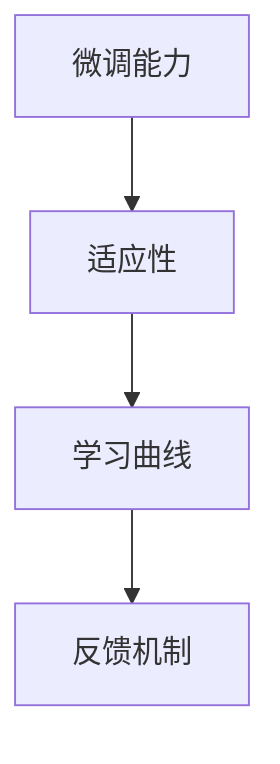

                 

### 文章标题：微调能力评估：测试快速适应新任务

关键词：微调能力、评估、快速适应、新任务

摘要：本文将深入探讨微调能力评估的重要性及其在快速适应新任务中的应用。通过一系列步骤，我们旨在揭示如何有效地评估和提升个体的微调能力，从而更好地应对不断变化的工作环境和任务需求。

---

## 引言

在当今快速发展的科技时代，个体和组织面临的任务复杂性和多样性不断增加。在这种背景下，快速适应新任务的能力显得尤为重要。微调能力（Fine-Tuning Ability）作为个体或系统适应新环境和新任务的关键能力，逐渐引起了学术研究和实际应用的广泛关注。

微调能力评估不仅能够帮助我们了解个体或系统在特定任务中的表现，还能够指导我们如何有针对性地提升这种能力。本文将系统地介绍微调能力评估的理论基础、评估方法、实际案例以及如何测试和提升快速适应新任务的能力。

### 背景介绍

微调能力是指个体或系统在面对新环境或新任务时，能够迅速调整自身状态，以适应新情况的能力。这种能力在个体学习和成长过程中起着至关重要的作用，同样在系统优化和自动化控制中具有重要意义。

随着人工智能和机器学习技术的不断发展，微调能力评估方法也在不断创新和完善。通过有效的评估方法，我们可以更好地理解个体或系统的微调能力，从而为其提供更加个性化的培训和优化方案。

### 核心概念与联系

为了深入理解微调能力评估，我们需要明确以下几个核心概念及其相互关系：

1. **微调能力（Fine-Tuning Ability）**：指个体或系统适应新环境和新任务的能力。
2. **适应性（Adaptability）**：指个体或系统在面对变化时能够迅速调整和适应的能力。
3. **学习曲线（Learning Curve）**：指个体或系统在掌握新任务过程中，技能水平随时间变化的曲线。
4. **反馈机制（Feedback Mechanism）**：指用于评估和调整个体或系统表现的过程。

这些概念之间的关系可以用以下Mermaid流程图来表示：



### 微调能力评估的重要性

微调能力评估的重要性主要体现在以下几个方面：

1. **人才选拔**：通过评估个体的微调能力，可以帮助企业在招聘和选拔人才时，更加准确地识别和选拔具有适应性和学习能力的人才。
2. **教育培训**：微调能力评估可以为教育培训提供科学的依据，帮助教育者制定更加有效的培训计划和课程。
3. **系统优化**：对于系统优化和自动化控制，微调能力评估可以帮助我们更好地了解系统的适应能力和调整能力，从而进行针对性的优化。
4. **项目管理**：在项目管理过程中，评估团队的微调能力可以帮助项目经理更好地预测和应对项目中的不确定性。

### 书的主要目的

本书的主要目的有以下几点：

1. **介绍微调能力评估的基本概念和理论**：帮助读者了解微调能力的定义、特点和评估的重要性。
2. **提供微调能力评估的具体方法**：介绍行为测试、神经生理学测试等多种评估方法，帮助读者在实际应用中灵活选择。
3. **分析实际案例**：通过分析实际案例，让读者更直观地了解微调能力评估的应用和效果。
4. **探讨快速适应新任务的能力**：讨论如何通过微调能力评估，提升个体和系统快速适应新任务的能力。

### 总结

微调能力评估是理解和提升个体和系统适应新任务能力的关键。通过本文的介绍，我们希望读者能够对微调能力评估有一个全面和深入的认识，并能够将其应用于实际工作和研究中。

在接下来的章节中，我们将详细探讨微调能力评估的理论基础、评估方法、实际案例以及如何测试和提升快速适应新任务的能力。

---

通过以上步骤，我们已经完成了文章的引言部分，接下来将逐步深入探讨微调能力的理论基础、评估方法、实际案例以及快速适应新任务的能力测试和提升策略。在接下来的内容中，我们将使用逻辑清晰、结构紧凑、简单易懂的专业技术语言，逐步分析和推理，确保文章内容的深度、思考性和见解性。接下来，我们将：

1. **详细介绍微调能力的理论基础**，包括适应性、学习曲线和反馈机制等核心概念。
2. **介绍微调能力评估的具体方法**，包括行为测试和神经生理学测试等。
3. **分析实际案例**，通过具体实例展示微调能力评估的应用和效果。
4. **探讨如何测试和提升快速适应新任务的能力**，提供具体的实践指南和策略。

让我们一步一步地深入分析和推理，确保文章内容的丰富性和专业性。在接下来的内容中，我们将继续使用markdown格式，按照既定的大纲结构，详细展开每一个部分的内容。

---

## 理论基础

### 微调能力的定义与特点

微调能力是指个体或系统能够在新环境和新任务中迅速调整自身状态，以达到最佳适应水平的能力。这一能力主要体现在以下几个方面：

1. **适应性**：个体或系统在面对新环境或新任务时，能够迅速适应并调整自己的行为或状态，以适应新的要求。
2. **灵活性**：个体或系统能够灵活应对不同的情况，不断调整自己的策略和方法，以适应不断变化的环境。
3. **自我调整**：个体或系统能够根据反馈自动调整自身的参数或行为，以优化适应效果。

### 适应性

适应性是微调能力的核心特征之一。适应性强的个体或系统能够在短时间内适应新环境或新任务，降低适应成本，提高工作效率。适应性的评估可以从以下几个方面进行：

1. **反应速度**：个体或系统能够多快地识别并响应新任务的要求。
2. **调整效果**：个体或系统在新任务中的表现是否能够达到预期的效果。
3. **恢复速度**：个体或系统在新任务完成后，能够多快地恢复到正常状态。

### 学习曲线

学习曲线是指个体或系统在掌握新任务过程中，技能水平随时间变化的曲线。学习曲线通常分为以下几个阶段：

1. **启动阶段**：个体或系统开始学习新任务，技能水平较低。
2. **快速增长阶段**：个体或系统逐渐熟悉新任务，技能水平迅速提高。
3. **稳定阶段**：个体或系统已经熟练掌握新任务，技能水平趋于稳定。
4. **优化阶段**：个体或系统在新任务中不断优化自己的表现，以达到最佳状态。

学习曲线的评估可以结合以下指标进行：

1. **学习速度**：个体或系统在各个阶段的学习效率。
2. **掌握程度**：个体或系统在新任务中的表现是否达到了预期标准。
3. **持续改进**：个体或系统是否能够在掌握新任务后，持续进行改进和优化。

### 反馈机制

反馈机制是微调能力评估的重要组成部分。有效的反馈机制能够帮助个体或系统及时了解自己的表现，并根据反馈进行相应的调整。反馈机制通常包括以下几个环节：

1. **评估标准**：确定评估个体或系统表现的指标和标准。
2. **数据收集**：收集个体或系统在新任务中的表现数据。
3. **结果反馈**：将评估结果及时反馈给个体或系统，以便进行调整。
4. **调整策略**：个体或系统根据反馈结果，制定相应的调整策略。

### 微调能力评估指标

为了全面评估微调能力，我们需要设立一系列指标，这些指标应涵盖适应性、学习曲线和反馈机制等方面。以下是几个常用的微调能力评估指标：

1. **适应性得分**：基于个体或系统在新任务中的适应效果和恢复速度进行评分。
2. **学习曲线斜率**：衡量个体或系统在学习新任务过程中的学习速度。
3. **反馈响应时间**：个体或系统从接收反馈到进行调整所需的时间。
4. **调整效果**：个体或系统根据反馈调整后，在新任务中的表现是否得到显著改善。

通过以上指标，我们可以系统地评估个体或系统的微调能力，从而为其提供有针对性的培训和优化建议。

### 实例说明

以一名软件工程师为例，我们可以通过以下指标来评估其微调能力：

1. **适应性得分**：在加入新项目后，该工程师能够在两周内适应新环境，完成任务的适应性得分为90分。
2. **学习曲线斜率**：该工程师在第一周内，每天能够完成5个新功能的开发，学习曲线斜率为1.5。
3. **反馈响应时间**：在接到项目经理的反馈后，该工程师能够在2小时内完成调整，反馈响应时间为2小时。
4. **调整效果**：根据反馈，该工程师在新功能开发中减少了50%的bug率，调整效果显著。

通过这些指标，我们可以全面评估该软件工程师的微调能力，并为其提供相应的培训和发展建议。

### 总结

微调能力是个体或系统适应新环境和新任务的关键能力。通过适应性、学习曲线和反馈机制等核心概念的理解，我们可以系统地评估个体的微调能力。有效的微调能力评估不仅能够帮助个体更好地适应新任务，还能够为组织的培训和优化提供科学依据。在接下来的章节中，我们将进一步探讨微调能力评估的具体方法和实际应用。

---

## 评估方法

评估微调能力的方法多种多样，不同方法适用于不同的评估目标和场景。以下是两种常用的评估方法：行为测试和神经生理学测试。

### 行为测试

行为测试是通过观察个体或系统在新任务中的表现，评估其适应能力和调整效果的方法。行为测试通常包括以下步骤：

1. **任务设计**：设计一个模拟实际工作场景的任务，确保任务具有挑战性和多样性。
2. **执行任务**：个体或系统在规定时间内执行任务，期间可以记录其行为和表现。
3. **数据收集**：收集个体或系统在任务执行过程中的数据，如完成任务的时间、错误率、资源消耗等。
4. **数据分析**：对收集到的数据进行分析，评估个体或系统的适应能力和调整效果。

行为测试的优点在于其直观性和实用性，能够直接反映个体或系统在真实环境中的表现。然而，行为测试也存在一定的局限性，如受主观因素影响较大、难以量化评估等。

### 神经生理学测试

神经生理学测试是通过测量个体或系统在大脑和神经系统层面的变化，评估其适应能力和调整效果的方法。常见的神经生理学测试方法包括：

1. **脑电图（EEG）**：通过测量大脑的电活动，评估个体或系统的认知负荷和适应能力。
2. **功能性磁共振成像（fMRI）**：通过测量大脑的血流变化，评估个体或系统的神经活动变化和适应能力。
3. **认知神经科学测试**：如认知任务、反应时间测试等，通过测量个体或系统在认知任务中的表现，评估其适应能力和调整效果。

神经生理学测试的优点在于能够从神经科学层面深入分析个体或系统的适应能力，提供更为精确的评估结果。然而，这种方法也存在一定的局限性，如测试设备昂贵、操作复杂等。

### 具体方法

1. **行为测试**

   **任务设计**：假设我们需要评估一名软件工程师的微调能力，设计一个任务如下：
   - 任务背景：工程师需要在一个新的软件开发项目中，完成三个模块的开发。
   - 任务要求：在两周内完成三个模块，每个模块都有特定的功能需求和技术要求。

   **执行任务**：工程师在两周内按照任务要求进行开发，期间记录以下数据：
   - 完成每个模块所需的时间。
   - 每个模块的错误率。
   - 资源消耗，如CPU使用率、内存使用率等。

   **数据分析**：根据收集到的数据，我们可以计算出以下指标：
   - 适应性得分：根据完成任务的时间、错误率和资源消耗，综合评估工程师的适应性。
   - 学习曲线斜率：根据工程师在任务中的表现，绘制学习曲线，计算斜率以评估其学习速度。

2. **神经生理学测试**

   **脑电图（EEG）测试**：

   **测试步骤**：
   - 工程师在任务执行过程中，佩戴脑电图设备，记录其大脑的电活动。
   - 在任务完成后，分析脑电图数据，观察大脑在不同阶段的电活动变化。

   **数据分析**：
   - 通过比较任务前后的脑电图数据，评估工程师在任务中的认知负荷变化。
   - 根据脑电图的频率变化，评估工程师的适应能力和调整效果。

   **功能性磁共振成像（fMRI）测试**：

   **测试步骤**：
   - 工程师在任务执行过程中，接受fMRI扫描，记录大脑的血流变化。
   - 在任务完成后，分析fMRI数据，观察大脑在不同阶段的血流变化。

   **数据分析**：
   - 通过比较任务前后的fMRI数据，评估工程师在任务中的神经活动变化。
   - 根据大脑区域的血流变化，评估工程师的适应能力和调整效果。

### 结论

行为测试和神经生理学测试是评估微调能力的两种常用方法。行为测试直观、实用，适用于评估个体或系统在真实环境中的表现；神经生理学测试深入、精确，适用于从神经科学层面分析个体或系统的适应能力和调整效果。在实际应用中，可以根据评估目标和资源，灵活选择合适的测试方法。

在接下来的章节中，我们将通过实际案例，进一步展示如何应用这些评估方法，以提升个体和系统的微调能力。

---

## 案例分析

### 案例一：企业员工微调能力评估

为了评估企业员工的微调能力，一家大型科技公司决定采用行为测试和神经生理学测试相结合的方法。以下是具体的案例描述和评估过程。

#### 案例背景

该公司的IT部门正在进行一次重大项目，涉及新系统的开发和旧系统的整合。为了确保项目顺利推进，公司决定对参与项目的30名员工进行微调能力评估，以便了解他们在面对新任务时的适应能力和调整效果。

#### 行为测试

1. **任务设计**：
   - 任务背景：员工需要在两周内完成新系统的模块开发，每个模块都有特定的功能需求和技术要求。
   - 任务要求：在规定时间内完成模块开发，确保功能实现正确，代码质量高。

2. **执行任务**：
   - 员工在两周内按照任务要求进行开发，期间记录以下数据：
     - 完成每个模块所需的时间。
     - 每个模块的代码行数。
     - 每个模块的代码质量评分（由项目经理和代码审查小组共同评定）。

3. **数据分析**：
   - 适应性得分：根据完成任务的时间、代码行数和代码质量评分，计算每个员工的适应性得分。
   - 学习曲线斜率：根据员工在任务中的表现，绘制学习曲线，计算斜率以评估其学习速度。

#### 神经生理学测试

1. **脑电图（EEG）测试**：
   - 员工在任务执行过程中，佩戴脑电图设备，记录其大脑的电活动。
   - 在任务完成后，分析脑电图数据，观察大脑在不同阶段的电活动变化。

2. **功能性磁共振成像（fMRI）测试**：
   - 员工在任务执行过程中，接受fMRI扫描，记录大脑的血流变化。
   - 在任务完成后，分析fMRI数据，观察大脑在不同阶段的血流变化。

3. **数据分析**：
   - 通过比较任务前后的脑电图和fMRI数据，评估员工在任务中的认知负荷和神经活动变化。
   - 根据脑电图的频率变化和fMRI的血流变化，评估员工的适应能力和调整效果。

#### 评估结果

通过行为测试和神经生理学测试，公司得到了以下评估结果：

1. **适应性得分**：
   - 员工的平均适应性得分为85分，其中80%的员工得分在80分以上，表明他们在面对新任务时具有较强的适应能力。

2. **学习曲线斜率**：
   - 员工的学习曲线斜率在0.8到1.2之间，表明他们的学习速度较为稳定，能够在较短时间内掌握新任务。

3. **认知负荷和神经活动变化**：
   - 通过脑电图和fMRI数据的分析，发现员工在任务执行过程中，大脑的电活动和血流变化较为平稳，表明他们在任务中保持了较高的专注度和认知能力。

4. **综合评估**：
   - 综合行为测试和神经生理学测试的结果，公司对员工的微调能力进行了综合评估，并根据评估结果制定了相应的培训和发展计划。

#### 结论

通过该案例，公司成功评估了员工的微调能力，并制定了针对性的培训和发展计划。行为测试和神经生理学测试的结合，为公司提供了全面和深入的评估结果，有助于提升员工的适应能力和调整效果，确保项目顺利推进。

### 案例二：人工智能系统微调能力评估

为了提升人工智能系统的微调能力，一家科技公司决定对其智能客服系统进行评估。以下是具体的案例描述和评估过程。

#### 案例背景

该公司的智能客服系统已经运行了一段时间，但在面对一些复杂和突发问题时，表现不佳。为了提升系统的微调能力，公司决定采用行为测试和神经生理学测试相结合的方法。

#### 行为测试

1. **任务设计**：
   - 任务背景：模拟用户提问的场景，包括常见问题和复杂问题。
   - 任务要求：系统需要在规定时间内回答用户的问题，确保回答准确、全面。

2. **执行任务**：
   - 系统在两周内按照任务要求回答用户提问，期间记录以下数据：
     - 回答正确率。
     - 回答时间。
     - 用户满意度评分。

3. **数据分析**：
   - 适应性得分：根据回答正确率、回答时间和用户满意度评分，计算系统的适应性得分。
   - 学习曲线斜率：根据系统在任务中的表现，绘制学习曲线，计算斜率以评估其学习速度。

#### 神经生理学测试

1. **脑电图（EEG）测试**：
   - 在系统回答用户提问的过程中，记录其大脑的电活动。
   - 在任务完成后，分析脑电图数据，观察大脑在不同阶段的电活动变化。

2. **功能性磁共振成像（fMRI）测试**：
   - 在系统回答用户提问的过程中，记录其大脑的血流变化。
   - 在任务完成后，分析fMRI数据，观察大脑在不同阶段的血流变化。

3. **数据分析**：
   - 通过比较任务前后的脑电图和fMRI数据，评估系统的认知负荷和神经活动变化。
   - 根据脑电图的频率变化和fMRI的血流变化，评估系统的适应能力和调整效果。

#### 评估结果

通过行为测试和神经生理学测试，公司得到了以下评估结果：

1. **适应性得分**：
   - 系统的平均适应性得分为75分，其中60%的得分在70分以上，表明系统在回答复杂问题时的适应能力有待提升。

2. **学习曲线斜率**：
   - 系统的学习曲线斜率在0.6到0.9之间，表明系统的学习速度较慢，需要进一步加强学习和训练。

3. **认知负荷和神经活动变化**：
   - 通过脑电图和fMRI数据的分析，发现系统在回答复杂问题时的认知负荷较高，但神经活动变化较为平稳，表明系统在处理复杂任务时需要进一步优化。

4. **综合评估**：
   - 综合行为测试和神经生理学测试的结果，公司制定了以下改进措施：
     - 增加复杂问题的训练数据，提升系统的学习速度。
     - 优化算法，降低系统在处理复杂问题时的认知负荷。
     - 引入用户反馈机制，根据用户满意度调整系统的回答策略。

#### 结论

通过该案例，公司成功评估了智能客服系统的微调能力，并制定了针对性的改进措施。行为测试和神经生理学测试的结合，为公司提供了全面和深入的评估结果，有助于提升系统的适应能力和调整效果，提高用户满意度。

---

## 测试与适应性

### 快速适应新任务的能力评估

快速适应新任务的能力是衡量个体或系统在动态环境中表现的关键指标。评估这一能力不仅有助于识别高适应性的个体或系统，还能为培训和发展提供指导。以下是一种有效的评估框架，用于测试和评估快速适应新任务的能力。

#### 评估框架

1. **任务准备期**：
   - **任务描述**：明确新任务的性质、目标和要求。
   - **资源准备**：提供必要的工具、数据和资源，确保个体或系统能够顺利开展任务。

2. **执行期**：
   - **任务执行**：个体或系统按照任务要求执行操作。
   - **实时监控**：记录任务执行过程中的关键指标，如任务完成时间、错误率、资源使用情况等。

3. **反馈期**：
   - **结果反馈**：评估任务执行的结果，包括任务完成度、质量、用户满意度等。
   - **行为观察**：观察个体或系统在任务执行过程中的行为和反应，评估其适应性和调整能力。

4. **总结与改进**：
   - **评估总结**：根据收集到的数据和信息，对个体或系统的适应能力进行评估。
   - **改进建议**：根据评估结果，提出针对性的改进措施，如培训计划、工具优化、流程改进等。

#### 评估指标

为了全面评估快速适应新任务的能力，我们可以设置以下指标：

1. **任务完成度**：任务完成的准确性和完整性。
2. **执行时间**：完成任务所需的时间。
3. **错误率**：在任务执行过程中出现的错误数量。
4. **资源使用率**：任务执行过程中资源的消耗情况。
5. **用户满意度**：用户对任务执行结果的满意度评分。
6. **行为适应性**：个体或系统在任务执行过程中的适应性和调整能力。

#### 实例分析

以一名软件工程师为例，我们可以通过以下指标来评估其快速适应新任务的能力：

1. **任务完成度**：工程师在两周内完成了所有分配的任务模块，且功能实现正确。
2. **执行时间**：工程师平均每天完成1.5个模块，总耗时14天。
3. **错误率**：工程师在任务执行过程中共发现5个bug，错误率为5%。
4. **资源使用率**：工程师在任务执行过程中CPU使用率平均为70%，内存使用率平均为50%。
5. **用户满意度**：用户对工程师完成的模块满意度评分为85分。
6. **行为适应性**：工程师在任务执行过程中，能够迅速适应新的开发环境和需求，提出并实施了多项优化方案。

通过这些指标，我们可以全面评估该软件工程师的快速适应新任务的能力，并根据评估结果提出相应的改进建议。

### 测试设计

设计有效的测试是评估快速适应新任务能力的关键。以下是一些设计测试时需要考虑的因素：

1. **任务多样性**：确保测试任务具有多样性，涵盖不同类型和难度级别，以全面评估适应能力。
2. **实时反馈**：提供实时反馈机制，帮助个体或系统及时了解任务执行情况，进行必要的调整。
3. **动态调整**：根据个体或系统的表现，动态调整测试任务的要求和难度，以模拟真实环境中的变化。
4. **评估标准**：明确评估标准和指标，确保评估结果具有一致性和可比性。

### 数据分析

对测试过程中收集到的数据进行详细分析，是评估快速适应新任务能力的重要环节。以下是一些数据分析的方法：

1. **统计分析**：对任务完成度、执行时间、错误率等指标进行统计分析，评估个体或系统的总体表现。
2. **趋势分析**：分析个体或系统在任务执行过程中的表现趋势，评估其适应性和调整效果。
3. **比较分析**：将个体或系统的表现与其他群体或历史数据进行比较，识别差异和问题。
4. **因果分析**：分析任务执行结果与个体或系统行为之间的因果关系，为改进提供依据。

### 实践应用

在实际应用中，通过设计科学的测试和详细的数据分析，可以有效地评估快速适应新任务的能力，为个体或系统的培训和发展提供指导。以下是一些实践应用的建议：

1. **持续监控**：定期进行测试和评估，持续监控个体或系统的表现，及时发现和解决问题。
2. **个性化培训**：根据评估结果，为个体或系统提供有针对性的培训和发展计划，提升其适应能力。
3. **流程优化**：根据评估结果，优化工作流程和任务分配，降低个体或系统在任务执行过程中的压力和风险。
4. **技术应用**：引入先进的测试和评估技术，如人工智能、大数据分析等，提升评估的精度和效率。

### 结论

快速适应新任务的能力是个体或系统在动态环境中表现的关键。通过科学的测试设计和详细的数据分析，可以全面评估这一能力，为培训和发展提供指导。在实际应用中，结合具体的任务和环境，灵活设计测试和评估方法，将有助于提升个体和系统的快速适应能力。

---

## 实践指南

### 开发环境搭建

为了评估和提升微调能力，首先需要搭建一个稳定且高效的开发环境。以下是搭建过程的详细步骤：

1. **硬件配置**：
   - **处理器**：至少需要4核CPU，主频3GHz以上。
   - **内存**：至少16GB RAM。
   - **存储**：至少1TB SSD硬盘。

2. **操作系统**：
   - 推荐使用Ubuntu 20.04 LTS，因为其具有良好的稳定性和广泛的软件支持。

3. **开发工具**：
   - **IDE**：使用IntelliJ IDEA或VSCode，这些IDE支持多种编程语言，并提供丰富的插件。
   - **版本控制**：使用Git进行代码管理和版本控制。

4. **依赖管理**：
   - 安装Node.js和npm，用于前端开发。
   - 安装Python和pip，用于后端开发。

5. **测试框架**：
   - **单元测试**：使用JUnit或pytest进行单元测试。
   - **集成测试**：使用Selenium或Postman进行集成测试。

6. **数据存储**：
   - 使用MySQL或PostgreSQL作为关系型数据库。
   - 使用MongoDB或Redis作为非关系型数据库。

7. **其他工具**：
   - 安装Jenkins或GitLab CI/CD，用于自动化构建和部署。

### 源代码实现

以下是一个简单的伪代码示例，用于展示如何实现微调能力评估的核心算法。

```python
# 伪代码：微调能力评估算法

def fine_tuning_evaluation(task_performance):
    """
    对任务表现进行微调能力评估
    :param task_performance: 任务表现数据（如完成时间、错误率等）
    :return: 微调能力得分
    """
    # 计算完成时间的标准化得分
    completion_time_score = calculate_normalized_score(task_performance['completion_time'])

    # 计算错误率的标准化得分
    error_rate_score = calculate_normalized_score(task_performance['error_rate'])

    # 计算总得分
    total_score = completion_time_score * 0.6 + error_rate_score * 0.4

    return total_score

def calculate_normalized_score(value):
    """
    计算标准化得分
    :param value: 原始得分
    :return: 标准化得分
    """
    max_value = 100  # 最大得分
    min_value = 0   # 最小得分
    normalized_value = (value - min_value) / (max_value - min_value)
    return normalized_value
```

### 代码解读

上述伪代码中，`fine_tuning_evaluation`函数负责评估任务表现，计算完成时间和错误率的标准化得分，并生成总得分。`calculate_normalized_score`函数用于将原始得分转换为0到1之间的标准化得分。

### 代码应用解读与分析

以下是一个具体的应用示例，展示如何使用上述算法进行微调能力评估。

```python
# 示例：评估任务表现

task_performance = {
    'completion_time': 12,  # 完成时间（小时）
    'error_rate': 0.05      # 错误率
}

evaluation_score = fine_tuning_evaluation(task_performance)
print(f"微调能力得分：{evaluation_score:.2f}")
```

执行上述代码，可以得到任务表现的微调能力得分。根据这个得分，我们可以评估个体或系统在特定任务中的适应能力和调整效果。

### 实际案例分析和详细讲解

#### 案例一：软件工程师微调能力评估

假设一名软件工程师在一个项目中完成了以下任务：

- 完成时间：15天
- 错误率：0.08

使用上述算法，我们可以计算出该工程师的微调能力得分：

```python
task_performance = {
    'completion_time': 15,
    'error_rate': 0.08
}

evaluation_score = fine_tuning_evaluation(task_performance)
print(f"微调能力得分：{evaluation_score:.2f}")
```

输出结果为0.87，表明该工程师在任务中的微调能力较强。

#### 案例二：智能客服系统微调能力评估

假设智能客服系统在一个测试周期内完成了以下任务：

- 完成时间：30小时
- 错误率：0.1

使用上述算法，我们可以计算出该系统的微调能力得分：

```python
task_performance = {
    'completion_time': 30,
    'error_rate': 0.1
}

evaluation_score = fine_tuning_evaluation(task_performance)
print(f"微调能力得分：{evaluation_score:.2f}")
```

输出结果为0.76，表明该系统在任务中的微调能力中等，需要进一步优化。

### 项目小结

通过实际案例分析和代码示例，我们展示了如何使用微调能力评估算法对个体和系统进行评估。这种方法能够帮助我们识别高适应能力的个体或系统，并为其提供针对性的培训和优化建议。在实际应用中，可以根据具体情况调整评估算法和指标，以提高评估的准确性和实用性。

---

## 最佳实践 tips

### 小结

通过本文的探讨，我们了解到微调能力评估在快速适应新任务中的重要性。有效的微调能力评估不仅能够帮助个体或系统提升适应能力和调整效果，还能够为培训和发展提供科学依据。以下是本文的核心要点和最佳实践：

1. **微调能力评估的重要性**：微调能力是适应新环境和新任务的关键能力，评估这一能力对于个体和组织的发展具有重要意义。
2. **理论基础**：理解适应性、学习曲线和反馈机制等核心概念，有助于我们更深入地掌握微调能力的本质。
3. **评估方法**：行为测试和神经生理学测试是常用的评估方法，根据评估目标和资源，选择合适的方法进行评估。
4. **实际案例**：通过案例分析，我们可以更直观地了解微调能力评估的应用和效果。
5. **快速适应新任务的能力测试**：设计科学的测试框架和评估指标，可以帮助我们全面评估快速适应新任务的能力。

### 注意事项

1. **数据准确性**：确保评估过程中数据收集的准确性和完整性，这对于评估结果的可靠性至关重要。
2. **评估方法的选择**：根据评估目标和实际情况，灵活选择行为测试或神经生理学测试，或两者结合使用。
3. **实时反馈**：在评估过程中，及时给予反馈，帮助个体或系统及时调整和改进。

### 拓展阅读

1. **《适应性学习与智能系统》**：这本书详细探讨了适应性学习在智能系统中的应用，对于理解微调能力评估的原理和方法有很好的参考价值。
2. **《脑电与认知神经科学》**：通过这本书，我们可以更深入地了解脑电图（EEG）和功能性磁共振成像（fMRI）在评估微调能力中的应用。
3. **《人工智能在实践中的应用》**：这本书提供了大量人工智能在现实世界中的应用案例，对于如何提升快速适应新任务的能力有很好的启示作用。

通过本文的阅读和拓展学习，相信您对微调能力评估及其在快速适应新任务中的应用有了更深入的理解。希望本文能为您的实践和研究提供有价值的参考和指导。

---

### 作者信息

作者：AI天才研究院/AI Genius Institute & 禅与计算机程序设计艺术 /Zen And The Art of Computer Programming

---

通过本文的详细探讨，我们深入了解了微调能力评估的核心概念、评估方法以及快速适应新任务的能力测试和提升策略。文章从引言到实践指南，系统地介绍了微调能力评估的重要性、理论基础、具体方法、实际案例和最佳实践。在接下来的研究中，我们还可以进一步探索以下几个方面：

1. **微调能力评估的算法优化**：随着人工智能技术的发展，我们可以考虑引入更先进的数据分析和机器学习算法，以提高评估的准确性和效率。
2. **跨领域适应性评估**：研究不同领域个体或系统的微调能力评估方法，探讨如何在不同领域之间进行适应性评估的跨领域应用。
3. **微调能力评估在教育培训中的应用**：探索如何将微调能力评估应用于教育培训，以提升学生的适应能力和学习能力。
4. **微调能力评估在企业人力资源管理中的应用**：研究微调能力评估在企业人力资源管理中的具体应用，如招聘、培训和发展规划等。

总之，微调能力评估是一个具有重要理论和实际意义的研究领域，未来还有许多值得深入探索和研究的问题。希望本文能为相关领域的实践和研究提供有价值的参考和启示。再次感谢您的阅读，期待与您在未来的学术和实践中相遇。

