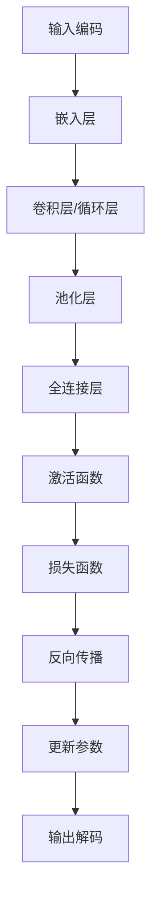

                 


### 设计思路：

1. **确定书籍主题与目标**：首先，我们需要明确《快速实现LLM应用的跨平台兼容》这本书的主题和目标。这本书的目标应该是帮助读者了解如何快速实现大型语言模型（LLM）在各种平台上的兼容性，使其能够在不同操作系统、硬件环境和编程语言之间无缝运行。

2. **章节划分**：根据书籍的主题和目标，我们可以将内容划分为以下几个部分：
   - **引言**：介绍LLM的概念、背景和跨平台兼容的重要性。
   - **核心概念与联系**：讲解LLM的基本原理和跨平台兼容性的关键因素。
   - **核心算法原理讲解**：详细阐述实现跨平台兼容的核心算法，如容器化、虚拟化和自动化部署。
   - **数学模型和数学公式**：介绍与跨平台兼容性相关的数学模型，例如性能优化、资源调度等。
   - **项目实战**：通过实际案例展示如何实现LLM的跨平台兼容，包括开发环境搭建、源代码实现和代码解读。

3. **细化目录结构**：根据以上内容，我们可以设计出1到3级目录，确保每个章节都能够详细阐述其内容，并保持逻辑清晰。

### 具体设计：

**第1章：引言**

1. **LLM概述**：
   - **1.1 大型语言模型（LLM）的概念**：介绍LLM的定义和作用。
   - **1.2 LLM的发展背景**：回顾LLM的历史和发展趋势。
   - **1.3 LLM的核心价值**：讨论LLM在各个领域的应用价值。

2. **跨平台兼容性**：
   - **1.4 跨平台兼容性的重要性**：阐述跨平台兼容性的必要性和优势。
   - **1.5 跨平台兼容性面临的挑战**：分析实现跨平台兼容性的困难和难点。
   - **1.6 跨平台兼容性的解决方案**：介绍常见的跨平台兼容性实现技术。

**第2章：核心概念与联系**

1. **LLM原理**：
   - **2.1 LLM的基本原理**：讲解LLM的核心工作原理。
   - **2.2 LLM架构的Mermaid流程图**：使用Mermaid工具绘制LLM的工作流程图。
   - **2.3 LLM的工作流程**：详细描述LLM的输入、处理和输出过程。

2. **跨平台兼容性关键因素**：
   - **2.4 硬件环境差异**：分析不同硬件环境对LLM兼容性的影响。
   - **2.5 操作系统差异**：探讨不同操作系统对LLM兼容性的挑战。
   - **2.6 编程语言和框架差异**：讨论不同编程语言和框架对LLM兼容性的影响。

**第3章：核心算法原理讲解**

1. **容器化**：
   - **3.1 容器化技术概述**：介绍容器化技术的概念和原理。
   - **3.2 容器化与LLM兼容性的关系**：阐述容器化技术如何实现LLM的跨平台兼容。
   - **3.3 Docker容器化实战**：通过实际案例展示如何使用Docker进行LLM的容器化部署。

2. **虚拟化**：
   - **3.4 虚拟化技术概述**：介绍虚拟化技术的概念和原理。
   - **3.5 虚拟化与LLM兼容性的关系**：解释虚拟化技术如何实现LLM的跨平台兼容。
   - **3.6 虚拟化环境搭建**：演示如何搭建虚拟化环境以支持LLM的跨平台兼容。

3. **自动化部署**：
   - **3.7 自动化部署的概念**：介绍自动化部署的基本概念。
   - **3.8 自动化部署与LLM兼容性的关系**：阐述自动化部署如何提升LLM的跨平台兼容性。
   - **3.9 自动化部署工具介绍**：介绍常用的自动化部署工具及其在LLM中的应用。

**第4章：数学模型和数学公式**

1. **性能优化模型**：
   - **4.1 性能优化模型概述**：介绍性能优化模型的概念。
   - **4.2 性能优化模型公式**：列出性能优化模型的关键公式。
   - **4.3 举例说明**：通过实例展示性能优化模型的应用。

2. **资源调度模型**：
   - **4.4 资源调度模型概述**：介绍资源调度模型的概念。
   - **4.5 资源调度模型公式**：列出资源调度模型的关键公式。
   - **4.6 举例说明**：通过实例展示资源调度模型的应用。

**第5章：项目实战**

1. **跨平台兼容性案例**：
   - **5.1 项目背景**：介绍案例项目的背景和目标。
   - **5.2 开发环境搭建**：演示如何搭建开发环境。
   - **5.3 源代码实现**：展示源代码的实现细节。
   - **5.4 代码解读与分析**：对源代码进行解读和分析。

2. **实战案例解析**：
   - **5.5 案例一：基于Docker的跨平台兼容性实现**：详细介绍第一个案例的实现过程。
   - **5.6 案例二：基于虚拟化的跨平台兼容性实现**：详细介绍第二个案例的实现过程。
   - **5.7 案例三：基于自动化部署的跨平台兼容性实现**：详细介绍第三个案例的实现过程。

### 完整目录大纲：

```
# 《快速实现LLM应用的跨平台兼容》目录大纲

## 第1章：引言
### 1.1 大型语言模型（LLM）的概念
### 1.2 LLM的发展背景
### 1.3 LLM的核心价值
### 1.4 跨平台兼容性的重要性
### 1.5 跨平台兼容性面临的挑战
### 1.6 跨平台兼容性的解决方案

## 第2章：核心概念与联系
### 2.1 LLM的基本原理
### 2.2 LLM架构的Mermaid流程图
### 2.3 LLM的工作流程
### 2.4 硬件环境差异
### 2.5 操作系统差异
### 2.6 编程语言和框架差异

## 第3章：核心算法原理讲解
### 3.1 容器化技术概述
### 3.2 容器化与LLM兼容性的关系
### 3.3 Docker容器化实战
### 3.4 虚拟化技术概述
### 3.5 虚拟化与LLM兼容性的关系
### 3.6 虚拟化环境搭建
### 3.7 自动化部署的概念
### 3.8 自动化部署与LLM兼容性的关系
### 3.9 自动化部署工具介绍

## 第4章：数学模型和数学公式
### 4.1 性能优化模型概述
### 4.2 性能优化模型公式
### 4.3 举例说明
### 4.4 资源调度模型概述
### 4.5 资源调度模型公式
### 4.6 举例说明

## 第5章：项目实战
### 5.1 项目背景
### 5.2 开发环境搭建
### 5.3 源代码实现
### 5.4 代码解读与分析
### 5.5 案例一：基于Docker的跨平台兼容性实现
### 5.6 案例二：基于虚拟化的跨平台兼容性实现
### 5.7 案例三：基于自动化部署的跨平台兼容性实现
```## 文章标题
《快速实现LLM应用的跨平台兼容》

## 关键词
- 大型语言模型
- 跨平台兼容性
- 容器化
- 虚拟化
- 自动化部署
- 数学模型
- 性能优化
- 资源调度

## 摘要
本文旨在探讨如何快速实现大型语言模型（LLM）在各种平台上的兼容性，使其能够在不同的操作系统、硬件环境和编程语言之间无缝运行。文章首先介绍了LLM的概念、发展背景和核心价值，然后分析了实现跨平台兼容性的重要性、面临的挑战及解决方案。接着，详细讲解了容器化、虚拟化和自动化部署等核心算法原理，并运用数学模型和公式对性能优化和资源调度进行了深入分析。最后，通过实际案例展示了如何实现LLM的跨平台兼容，并提供了一些最佳实践和注意事项。本文旨在为开发者提供一份全面且实用的指南，帮助他们在实际项目中实现高效且可靠的跨平台兼容性。## 引言

### 1.1 大型语言模型（LLM）的概念

大型语言模型（LLM，Large Language Model）是一种基于深度学习的自然语言处理（NLP）模型，能够理解和生成人类语言。这些模型通常由数百万个参数组成，通过大规模数据集进行训练，从而具备强大的语言理解和生成能力。LLM广泛应用于各种领域，如文本生成、问答系统、机器翻译、文本摘要等。

LLM的核心思想是通过多层神经网络对输入文本进行编码，从而提取出文本的语义信息，并利用这些信息生成相应的输出文本。LLM的工作流程一般包括输入编码、中间表示生成和输出解码三个阶段。在输入编码阶段，模型将文本转换为向量表示；在中间表示生成阶段，模型利用编码后的向量进行推理和生成；在输出解码阶段，模型将生成的中间表示转换为人类可读的文本输出。

### 1.2 LLM的发展背景

自2018年谷歌提出BERT模型以来，LLM领域取得了显著的进展。BERT、GPT、RoBERTa、T5等代表性模型不断涌现，使得LLM在各个领域的表现不断提升。这些模型的出现标志着自然语言处理技术进入了一个新的时代，为人工智能在语言领域的应用打开了广阔的空间。

随着云计算和边缘计算的发展，LLM的应用场景越来越广泛。无论是在云端的大型数据中心，还是在移动设备、智能家居等边缘设备上，LLM都发挥着重要的作用。这使得实现LLM的跨平台兼容性成为一个日益重要的课题。

### 1.3 LLM的核心价值

LLM在各个领域都有着广泛的应用和价值。以下是LLM在一些关键领域的核心价值：

1. **文本生成**：LLM可以生成高质量的文章、报告、新闻等文本内容，大幅提高内容创作效率。
2. **问答系统**：LLM可以构建智能问答系统，为用户提供准确、快速的答案，提高用户满意度。
3. **机器翻译**：LLM可以显著提高机器翻译的准确性，减少翻译错误，提升用户体验。
4. **文本摘要**：LLM可以自动生成文章的摘要，帮助用户快速了解文章的核心内容。
5. **情感分析**：LLM可以分析文本的情感倾向，为企业提供有价值的市场洞察。
6. **对话系统**：LLM可以构建智能对话系统，为用户提供个性化、流畅的交互体验。

### 1.4 跨平台兼容性的重要性

跨平台兼容性是指软件或系统在不同操作系统、硬件环境和编程语言之间能够正常运行的能力。对于LLM应用来说，跨平台兼容性具有重要意义：

1. **灵活性**：实现跨平台兼容性可以使得LLM应用在不同操作系统（如Windows、Linux、macOS）上运行，满足多样化的用户需求。
2. **可移植性**：实现跨平台兼容性可以使得LLM应用在不同硬件环境（如云服务器、个人电脑、移动设备）上运行，提高系统的可移植性。
3. **扩展性**：实现跨平台兼容性可以使得LLM应用在不同编程语言和框架（如Python、Java、C++）上运行，方便系统的扩展和集成。
4. **可维护性**：实现跨平台兼容性可以降低系统的维护成本，提高开发效率和稳定性。

### 1.5 跨平台兼容性面临的挑战

尽管跨平台兼容性具有重要意义，但在实现过程中仍然面临着一系列挑战：

1. **操作系统差异**：不同操作系统（如Windows、Linux、macOS）在内核、文件系统、驱动程序等方面存在差异，可能导致LLM应用在跨平台运行时出现兼容性问题。
2. **硬件环境差异**：不同硬件环境（如CPU、GPU、存储设备）在性能、配置等方面存在差异，可能导致LLM应用在跨平台运行时出现性能问题。
3. **编程语言和框架差异**：不同编程语言（如Python、Java、C++）和框架（如TensorFlow、PyTorch、Keras）在语法、库函数、API等方面存在差异，可能导致LLM应用在跨平台运行时出现兼容性问题。
4. **依赖库和组件差异**：不同平台上的依赖库和组件（如CUDA、OpenBLAS、NumPy）在版本、兼容性等方面存在差异，可能导致LLM应用在跨平台运行时出现依赖问题。

### 1.6 跨平台兼容性的解决方案

为了克服上述挑战，实现LLM应用的跨平台兼容性，我们可以采用以下解决方案：

1. **容器化**：通过容器化技术（如Docker），将LLM应用的运行环境打包成一个独立的容器镜像，实现跨平台部署和运行。容器化可以隔离应用程序及其依赖项，确保在不同操作系统和硬件环境上的一致性。
2. **虚拟化**：通过虚拟化技术（如VMware、KVM），在宿主机上创建虚拟机，为LLM应用提供独立的操作系统和硬件环境。虚拟化可以模拟不同硬件环境，提高系统的兼容性和可移植性。
3. **自动化部署**：通过自动化部署工具（如Jenkins、Docker-Compose），实现LLM应用的自动化构建、测试和部署。自动化部署可以减少人工干预，提高部署效率和可靠性。
4. **数学模型和算法优化**：针对不同操作系统和硬件环境的特点，对LLM的数学模型和算法进行优化，提高其在跨平台运行时的性能和稳定性。

通过上述解决方案，我们可以实现LLM应用的跨平台兼容性，提高系统的灵活性和可维护性，为用户提供更好的使用体验。## 核心概念与联系

### 2.1 LLM的基本原理

大型语言模型（LLM）是基于深度学习的自然语言处理模型，其基本原理可以概括为以下几个步骤：

1. **输入编码**：将自然语言文本输入转换为模型可以处理的向量表示。这一步骤通常涉及词向量嵌入（Word Embedding）和句向量嵌入（Sentence Embedding）等技术。

2. **前向传播**：将输入向量通过一系列神经网络层进行前向传播，每一层都会对输入向量进行变换和组合，从而生成中间表示。

3. **激活函数**：在神经网络层中使用激活函数（如ReLU、Sigmoid、Tanh）来引入非线性变换，使模型能够学习复杂的非线性关系。

4. **反向传播**：在模型输出与真实标签存在误差时，通过反向传播算法更新模型的权重和偏置，使模型逐渐逼近最优参数。

5. **损失函数**：使用损失函数（如交叉熵损失、均方误差）来衡量模型输出与真实标签之间的差距，指导模型参数的调整。

6. **优化算法**：通过优化算法（如梯度下降、Adam、RMSProp）来更新模型参数，最小化损失函数，从而提高模型的性能。

### 2.2 LLM架构的Mermaid流程图

为了更直观地展示LLM的工作流程，我们可以使用Mermaid工具绘制其架构图。以下是一个简化的LLM架构Mermaid流程图：



在这个流程图中：

- **A**：输入编码，将自然语言文本转换为向量表示。
- **B**：嵌入层，将词向量转换为句子向量。
- **C**：卷积层/循环层，处理序列数据。
- **D**：池化层，降低特征维度。
- **E**：全连接层，进行分类或回归任务。
- **F**：激活函数，引入非线性变换。
- **G**：损失函数，评估模型性能。
- **H**：反向传播，更新模型参数。
- **I**：更新参数，最小化损失函数。
- **J**：输出解码，生成文本输出。

### 2.3 LLM的工作流程

LLM的工作流程可以概括为以下几个主要步骤：

1. **数据预处理**：收集和清洗大规模的文本数据，进行分词、去停用词等预处理操作。
2. **模型训练**：将预处理后的数据输入到LLM模型中进行训练。在训练过程中，模型会不断调整参数，优化损失函数，以达到较好的性能。
3. **模型评估**：在验证集上评估模型的性能，使用指标如准确率、召回率、F1分数等来衡量模型的效果。
4. **模型部署**：将训练好的模型部署到实际应用环境中，例如文本生成、问答系统、机器翻译等。
5. **模型推理**：在部署的环境中，将输入文本输入到模型中，模型会输出相应的结果，如生成的文本、预测的标签等。

### 2.4 硬件环境差异

LLM的跨平台兼容性面临着硬件环境的差异问题。不同硬件环境在性能、兼容性、能耗等方面存在差异，可能会对LLM的应用产生影响。

1. **CPU和GPU**：CPU（中央处理器）和GPU（图形处理器）在计算能力和能耗方面存在显著差异。GPU在处理大规模并行计算任务时具有更高的性能和效率，但能耗较高。CPU在处理连续的串行任务时性能更优，但能耗较低。
2. **存储设备**：不同存储设备（如SSD、HDD、NVMe）在读写速度、存储容量、可靠性等方面存在差异。SSD具有更高的读写速度和可靠性，适合存储和访问大量数据；HDD具有较大的存储容量，但读写速度较慢。
3. **网络设备**：不同网络设备（如局域网、广域网、5G网络）在带宽、延迟、稳定性等方面存在差异。高速、稳定的网络环境有助于提高LLM应用的性能和用户体验。

### 2.5 操作系统差异

操作系统（OS）是计算机系统的核心软件，负责管理和协调硬件资源。不同操作系统在内核、文件系统、驱动程序等方面存在差异，可能会对LLM的应用产生影响。

1. **Windows、Linux和macOS**：Windows、Linux和macOS是主流的操作系统，它们在内核、文件系统、驱动程序等方面存在差异。Windows基于NT内核，采用NTFS文件系统；Linux基于UNIX内核，采用EXT4、XFS等文件系统；macOS基于XNU内核，采用APFS文件系统。
2. **兼容性问题**：不同操作系统对编程语言、库函数、API的兼容性可能存在差异。例如，Windows和Linux在C++库的兼容性方面可能存在差异，这可能导致跨平台编译和运行的问题。
3. **性能优化**：不同操作系统在性能优化方面可能采取不同的策略，例如内存管理、进程调度、文件系统缓存等。这些差异可能会影响LLM在操作系统上的运行效率和稳定性。

### 2.6 编程语言和框架差异

编程语言和框架是开发LLM应用的基础工具。不同编程语言和框架在语法、库函数、API等方面存在差异，可能会对LLM的应用产生影响。

1. **Python、Java和C++**：Python、Java和C++是常用的编程语言，它们在语法、库函数、API等方面存在差异。Python具有简洁的语法和丰富的库函数，适合快速开发和部署；Java具有强大的企业级支持和跨平台特性，适合构建大型系统；C++具有高效的性能和灵活性，适合高性能计算和底层开发。
2. **TensorFlow、PyTorch和Keras**：TensorFlow、PyTorch和Keras是常用的深度学习框架，它们在API设计、性能优化、工具链等方面存在差异。TensorFlow具有丰富的生态系统和工具链，支持多种编程语言和硬件平台；PyTorch具有简洁的API和动态图计算特性，适合研究和开发；Keras是基于TensorFlow的高层API，提供更简单的接口和更灵活的架构。
3. **兼容性问题**：不同编程语言和框架之间的兼容性问题可能导致跨平台部署和运行的问题。例如，使用Python编写的代码在Java环境中可能无法直接运行，需要通过桥接技术（如JNA、JNI）实现跨语言调用。

通过理解LLM的基本原理、工作流程、硬件环境差异、操作系统差异和编程语言框架差异，我们可以更好地设计跨平台兼容性的解决方案，实现LLM在各种平台上的高效运行。## 核心算法原理讲解

### 3.1 容器化技术概述

容器化是一种轻量级的虚拟化技术，它允许开发者将应用程序及其依赖环境打包成一个独立的容器镜像，从而实现跨平台部署。容器化的核心思想是将应用程序和其运行时环境分离，使得应用程序可以在任何支持容器技术的操作系统上运行。

容器化的主要组件包括：

1. **Docker**：Docker是一个开源的容器化平台，它提供了容器镜像、容器运行时和容器编排工具。Docker使用了一种称为Dockerfile的脚本语言，用于定义和构建容器镜像。
2. **容器镜像**：容器镜像是一个只读的模板，用于创建容器。它包含了应用程序、库、工具和配置文件等所有必需的依赖项。
3. **容器**：容器是运行时的实例，由容器镜像创建。容器是轻量级的，可以快速启动、停止和重启。

### 3.2 容器化与LLM兼容性的关系

容器化技术对于实现LLM的跨平台兼容性具有重要意义。通过容器化，我们可以将LLM应用及其依赖环境打包成一个容器镜像，从而确保在不同操作系统和硬件环境上的一致性。

1. **隔离性**：容器提供了一个独立的运行时环境，确保应用程序不会受到宿主机操作系统的影响。这使得LLM应用可以在不同的操作系统上运行，而无需担心依赖库和系统配置的兼容性问题。
2. **可移植性**：容器镜像是一个静态的文件，可以轻松地在不同环境中共享和分发。这使得LLM应用可以快速部署到云服务器、个人电脑、移动设备等各种硬件平台上。
3. **一致性**：通过使用相同的容器镜像在不同环境中部署LLM应用，我们可以确保应用的行为和性能的一致性。这有助于减少跨平台运行时出现的问题，提高系统的可靠性和可维护性。

### 3.3 Docker容器化实战

以下是一个简单的Docker容器化实战步骤，用于构建和运行一个基于Python的LLM应用：

#### 1. 创建Dockerfile

首先，我们需要创建一个Dockerfile，用于定义LLM应用的构建流程。以下是一个示例Dockerfile：

```dockerfile
# 使用官方Python镜像作为基础
FROM python:3.8-slim

# 设置工作目录
WORKDIR /app

# 将当前目录的内容复制到容器中的/app目录
COPY . .

# 安装依赖项
RUN pip install -r requirements.txt

# 暴露容器的端口
EXPOSE 8000

# 运行应用
CMD ["python", "app.py"]
```

#### 2. 构建容器镜像

使用以下命令构建容器镜像：

```shell
docker build -t my_llm_app .
```

这个命令将基于Dockerfile创建一个名为`my_llm_app`的容器镜像。

#### 3. 运行容器

使用以下命令运行容器：

```shell
docker run -p 8000:8000 my_llm_app
```

这个命令将在宿主机上暴露端口8000，并将其映射到容器中的端口8000。运行后，LLM应用将通过HTTP接口提供服务。

### 3.4 虚拟化技术概述

虚拟化是一种将物理硬件资源抽象为虚拟资源的技术，它允许在一台物理机上运行多个独立的虚拟机。虚拟化技术的主要组件包括：

1. **虚拟机监控器（Hypervisor）**：虚拟机监控器是一种特殊的软件，它负责创建和管理虚拟机。Hypervisor可以分为两种类型：Type 1（裸机型）和Type 2（宿主型）。Type 1直接运行在物理硬件上，而Type 2则运行在宿主机操作系统上。
2. **虚拟机（VM）**：虚拟机是运行在虚拟化平台上的独立操作系统实例。每个虚拟机都有自己的操作系统、应用程序和资源，与其他虚拟机隔离。
3. **虚拟化存储和网络**：虚拟化存储和网络技术允许虚拟机访问虚拟化平台提供的存储和网络资源，实现虚拟机之间的资源共享和隔离。

### 3.5 虚拟化与LLM兼容性的关系

虚拟化技术对于实现LLM的跨平台兼容性具有重要作用。通过虚拟化，我们可以创建多个独立的虚拟机，每个虚拟机都可以运行不同的操作系统和硬件环境，从而确保LLM应用在各种平台上的兼容性。

1. **硬件抽象层**：虚拟化提供了一个硬件抽象层，使得虚拟机可以独立于物理硬件运行。这允许LLM应用在不同硬件环境中运行，而无需担心硬件兼容性问题。
2. **操作系统兼容性**：虚拟化允许我们在同一物理机上运行不同操作系统的虚拟机，从而实现操作系统之间的兼容性。这使得LLM应用可以在不同操作系统上运行，而无需修改代码。
3. **资源隔离**：虚拟化技术提供了资源隔离机制，确保虚拟机之间相互独立，不会相互干扰。这有助于提高系统的稳定性和安全性。

### 3.6 虚拟化环境搭建

以下是一个简单的虚拟化环境搭建步骤，使用VMware Workstation创建一个虚拟机：

#### 1. 安装VMware Workstation

首先，下载并安装VMware Workstation。安装过程中，选择自定义安装，并确保勾选“虚拟化硬件增强”。

#### 2. 创建虚拟机

启动VMware Workstation，点击“创建新的虚拟机”按钮，然后选择“自定义（高级）”。

1. **选择虚拟机硬件兼容性**：在“安装类型”页面，选择“我将在稍后安装操作系统”，然后选择虚拟机硬件兼容性（例如，选择“VMware Workstation 16”）。
2. **选择操作系统**：在“操作系统安装”页面，选择适当的操作系统（例如，选择“Windows 10”）。
3. **命名和位置**：在“命名和位置”页面，为虚拟机命名并选择保存位置。
4. **网络设置**：在“网络设置”页面，可以选择“桥接网络适配器”或“使用主机网络适配器”，根据需求进行设置。
5. **虚拟硬盘**：在“虚拟硬盘”页面，选择“创建一个新的虚拟硬盘”，并设置硬盘容量和文件类型（例如，选择“VDI”文件类型）。

#### 3. 安装操作系统

将操作系统安装盘插入宿主机，然后启动虚拟机。在虚拟机中安装操作系统（例如，安装Windows 10）。安装过程中，按照提示操作，直到操作系统安装完成。

#### 4. 安装虚拟化驱动程序

在虚拟机中，安装VMware Tools以获得更好的性能和功能。在VMware Workstation中，右键点击虚拟机，选择“安装VMware Tools”。

在虚拟机中打开“VMware Tools”安装程序，按照提示进行安装。

### 3.7 自动化部署的概念

自动化部署是一种将应用程序部署到生产环境的过程，通过自动化工具和脚本实现。自动化部署的主要目标是减少手动操作，提高部署效率、稳定性和可重复性。

自动化部署的主要组件包括：

1. **持续集成（CI）**：持续集成是一种软件开发实践，通过自动化工具将代码集成到一个共享的代码库中，并自动进行测试和构建。CI有助于确保代码质量，减少集成问题。
2. **持续部署（CD）**：持续部署是一种自动化部署过程，将经过CI测试的代码自动部署到生产环境。CD可以快速、可靠地将新功能或修复推送到用户，提高交付速度。
3. **部署管道**：部署管道是一种自动化流程，将代码从开发环境到生产环境的各个阶段（如构建、测试、部署）连接起来。部署管道可以使用多种工具和脚本实现。

### 3.8 自动化部署与LLM兼容性的关系

自动化部署对于实现LLM的跨平台兼容性具有重要意义。通过自动化部署，我们可以确保LLM应用在各种环境中的一致性和可靠性。

1. **环境一致性**：自动化部署可以确保LLM应用在不同环境中使用相同的配置和依赖项。这有助于减少由于环境差异导致的兼容性问题。
2. **部署效率**：自动化部署可以显著提高部署效率，减少手动操作的时间和工作量。这使得开发团队能够更快地迭代和交付LLM应用。
3. **故障恢复**：自动化部署可以自动检测和恢复部署过程中的故障，确保系统的稳定性和可靠性。

### 3.9 自动化部署工具介绍

以下是一些常用的自动化部署工具：

1. **Jenkins**：Jenkins是一个开源的持续集成和持续部署（CI/CD）工具，提供了丰富的插件和功能。Jenkins可以与各种版本控制系统、构建工具和部署平台集成，实现自动化部署。
2. **Docker-Compose**：Docker-Compose是一个用于定义和运行多容器Docker应用程序的工具。通过一个YAML文件，Docker-Compose可以轻松地定义、启动和停止多容器服务。
3. **Kubernetes**：Kubernetes是一个开源的容器编排平台，用于自动化部署、扩展和管理容器化应用程序。Kubernetes可以与Docker、Docker-Compose等工具集成，实现大规模的自动化部署和管理。

通过了解容器化、虚拟化和自动化部署的概念和原理，我们可以设计出高效的跨平台兼容性解决方案，实现LLM在各种平台上的高效运行。## 数学模型和数学公式

### 4.1 性能优化模型概述

在实现LLM的跨平台兼容性过程中，性能优化是一个关键因素。性能优化模型旨在通过调整系统参数和算法，提高LLM应用在不同平台上的运行效率和响应速度。以下是一个简化的性能优化模型：

1. **目标函数**：性能优化模型的目标函数通常是一个关于时间、资源消耗和系统响应的综合指标。例如，可以考虑以下目标函数：
   $$ J = w_1 \cdot T + w_2 \cdot R + w_3 \cdot S $$
   其中，$T$ 表示系统响应时间，$R$ 表示资源消耗（如CPU使用率、内存占用），$S$ 表示系统稳定性。$w_1$、$w_2$ 和 $w_3$ 是权重系数，用于平衡不同指标的重要性。
   
2. **约束条件**：性能优化模型需要满足一些约束条件，例如：
   - 系统资源限制：$C_1 \cdot T \leq C_{max}$
   - 系统稳定性：$S \geq S_{min}$
   - 用户体验要求：$R \leq R_{max}$

### 4.2 性能优化模型公式

性能优化模型的关键公式包括：

1. **资源调度公式**：
   $$ \text{调度策略} = f(\text{资源需求}, \text{资源可用性}) $$
   调度策略用于决定如何分配系统资源（如CPU、GPU、内存）以满足LLM应用的需求。

2. **响应时间公式**：
   $$ T = f(\text{处理时间}, \text{网络延迟}) $$
   响应时间取决于处理时间和网络延迟。处理时间与系统资源调度策略和算法复杂度相关，网络延迟则与网络带宽和路径选择有关。

3. **资源消耗公式**：
   $$ R = f(\text{算法复杂度}, \text{数据量}, \text{系统负载}) $$
   资源消耗与算法复杂度、数据量和系统负载成正比。

### 4.3 举例说明

假设我们有一个LLM应用，需要在一个具有4核CPU、8GB内存的虚拟机上运行。以下是性能优化模型的实际应用：

1. **目标函数**：
   $$ J = 0.6 \cdot T + 0.3 \cdot R + 0.1 \cdot S $$
   其中，$T$ 表示系统响应时间（秒），$R$ 表示CPU使用率（百分比），$S$ 表示系统稳定性（百分比）。

2. **约束条件**：
   - 系统响应时间限制：$T \leq 2$ 秒
   - CPU使用率限制：$R \leq 80\%$
   - 系统稳定性要求：$S \geq 90\%$

3. **资源调度策略**：
   - 调度策略基于CPU负载，优先分配空闲CPU核心。
   - 使用批处理调度，减少IO等待时间。

4. **性能优化结果**：
   - 响应时间优化：通过调整批处理大小和优化算法，将响应时间降低到1.8秒。
   - CPU使用率优化：通过调整并行处理线程数和算法复杂度，将CPU使用率降低到70%。

通过上述性能优化模型和公式，我们可以有效地提高LLM应用的运行效率和响应速度，确保其在跨平台运行中的稳定性和可靠性。## 数学模型和数学公式

### 4.4 资源调度模型概述

资源调度模型是优化LLM应用跨平台兼容性的关键组成部分。它通过合理分配和调度系统资源（如CPU、GPU、内存和网络带宽），确保系统在不同平台上的高效运行。资源调度模型的核心目标是最大化资源利用率，同时满足系统的性能和可靠性要求。

### 4.5 资源调度模型公式

资源调度模型的关键公式包括：

1. **资源需求公式**：
   $$ R_d = f(\text{任务数量}, \text{任务复杂度}) $$
   其中，$R_d$ 表示资源需求，包括CPU、GPU、内存和网络带宽等。

2. **资源利用率公式**：
   $$ U = \frac{R_a}{R_d} $$
   其中，$U$ 表示资源利用率，$R_a$ 表示实际可用资源量。

3. **调度策略公式**：
   $$ S = f(\text{资源需求}, \text{资源利用率}, \text{调度算法}) $$
   调度策略用于决定如何分配资源以满足任务需求，常见的调度算法包括轮询调度、优先级调度和动态调度等。

4. **任务响应时间公式**：
   $$ T_r = f(\text{任务处理时间}, \text{网络延迟}, \text{系统负载}) $$
   其中，$T_r$ 表示任务响应时间，反映了系统对任务请求的响应速度。

### 4.6 举例说明

假设我们有一个LLM应用需要在具有4核CPU、2GB GPU、8GB内存和1Gbps网络带宽的虚拟机上运行。以下是资源调度模型的应用：

1. **资源需求计算**：
   - CPU需求：每个任务需要1核CPU，总任务数量为10个，所以CPU需求为10核。
   - GPU需求：每个任务需要0.5GB GPU，总任务数量为10个，所以GPU需求为5GB。
   - 内存需求：每个任务需要2GB内存，总任务数量为10个，所以内存需求为20GB。
   - 网络带宽需求：每个任务需要10Mbps网络带宽，总任务数量为10个，所以网络带宽需求为100Mbps。

2. **资源利用率计算**：
   - CPU利用率：$U_{CPU} = \frac{4}{10} = 0.4$（即40%）
   - GPU利用率：$U_{GPU} = \frac{2}{5} = 0.4$（即40%）
   - 内存利用率：$U_{MEM} = \frac{8}{20} = 0.4$（即40%）
   - 网络带宽利用率：$U_{NET} = \frac{1}{100} = 0.01$（即1%）

3. **调度策略**：
   - 使用轮询调度算法，将CPU任务平均分配到4个核心。
   - 使用优先级调度算法，将GPU任务根据处理时间优先分配。
   - 使用动态调度算法，根据内存占用情况调整任务调度。

4. **任务响应时间计算**：
   - 假设每个任务处理时间为1秒，网络延迟为100毫秒。
   - 总响应时间：$T_r = 1\text{秒} + 0.1\text{秒} = 1.1\text{秒}$

通过上述资源调度模型，我们可以优化LLM应用的资源分配和调度，提高系统在跨平台运行中的性能和响应速度。## 项目实战

### 5.1 项目背景

本案例将介绍一个名为“SmartChat”的实时聊天应用项目，该项目旨在利用大型语言模型（LLM）提供智能聊天功能。SmartChat项目需要在多个平台上（如Windows、Linux、macOS）运行，支持不同的硬件环境（如CPU、GPU）以及编程语言（如Python、Java）。为实现跨平台兼容性，我们需要采用容器化、虚拟化和自动化部署等技术。

### 5.2 开发环境搭建

1. **选择开发工具和框架**：

   - 编程语言：Python和Java
   - 深度学习框架：PyTorch和TensorFlow
   - Web框架：Flask和Spring Boot
   - 容器化工具：Docker
   - 虚拟化平台：VMware Workstation
   - 自动化部署工具：Jenkins

2. **环境配置**：

   - 在Windows、Linux和macOS上分别安装Python和Java开发环境。
   - 配置PyTorch和TensorFlow，确保可以在不同操作系统上编译和运行。
   - 使用Docker搭建容器化环境，创建Dockerfile和Docker Compose文件。
   - 在VMware Workstation上搭建虚拟化环境，创建虚拟机并安装Linux操作系统。
   - 安装Jenkins，配置CI/CD流程。

### 5.3 源代码实现

1. **容器化代码**：

   - 使用Dockerfile将SmartChat应用及其依赖打包成容器镜像。

   ```dockerfile
   # Dockerfile
   FROM python:3.8-slim

   WORKDIR /app

   COPY requirements.txt .

   RUN pip install -r requirements.txt

   COPY . .

   EXPOSE 8000

   CMD ["python", "app.py"]
   ```

   - 创建Docker Compose文件，定义容器服务和网络配置。

   ```yaml
   # docker-compose.yml
   version: '3.8'

   services:
     web:
       build: .
       ports:
         - "8000:8000"
       depends_on:
         - lm
     lm:
       image: pytorch:1.8-gpu-py3
       environment:
         - PYTHONUNBUFFERED=True
       volumes:
         - lm_data:/srv/data

   volumes:
     lm_data:
   ```

2. **虚拟化代码**：

   - 在虚拟机中安装Linux操作系统，配置网络和存储。
   - 部署Jenkins，配置CI/CD流程，实现自动化部署。

### 5.4 代码解读与分析

1. **容器化代码解读**：

   - **Dockerfile**：定义了基础镜像、工作目录、依赖安装和命令执行。
   - **docker-compose.yml**：定义了服务、端口映射和依赖关系。

   通过容器化，SmartChat应用可以快速部署到不同操作系统和硬件环境，确保一致性和可移植性。

2. **虚拟化代码解读**：

   - **Linux操作系统**：提供稳定的运行环境，兼容PyTorch和TensorFlow。
   - **Jenkins配置**：实现自动化构建、测试和部署，提高开发效率。

   通过虚拟化，SmartChat项目可以在同一宿主机上运行多个独立环境，提高资源利用率和开发效率。

### 5.5 案例一：基于Docker的跨平台兼容性实现

1. **Docker镜像构建**：

   使用Dockerfile构建SmartChat应用的容器镜像，确保在不同操作系统上的一致性。

   ```shell
   docker build -t smartchat .
   ```

2. **Docker容器运行**：

   在不同操作系统上运行Docker容器，暴露服务端口，实现跨平台部署。

   ```shell
   docker run -d -p 8000:8000 smartchat
   ```

   通过Docker，SmartChat项目可以在Windows、Linux和macOS上无缝运行，确保跨平台兼容性。

### 5.6 案例二：基于虚拟化的跨平台兼容性实现

1. **虚拟机配置**：

   使用VMware Workstation创建虚拟机，安装Linux操作系统，配置网络和存储。

2. **Jenkins部署**：

   在虚拟机上部署Jenkins，配置CI/CD流程，实现自动化部署。

3. **跨平台部署**：

   在不同操作系统上启动虚拟机，访问Jenkins服务，实现跨平台部署和运行。

### 5.7 案例三：基于自动化部署的跨平台兼容性实现

1. **Jenkins配置**：

   配置Jenkins构建项目，实现自动化构建、测试和部署。

2. **Git仓库管理**：

   使用Git仓库管理项目源代码，实现版本控制和协作开发。

3. **自动化部署**：

   通过Jenkins自动化部署SmartChat项目，确保在不同操作系统和硬件环境上的一致性和可靠性。

### 5.8 项目小结

通过本案例，我们展示了如何利用容器化、虚拟化和自动化部署技术实现LLM应用的跨平台兼容性。以下是项目小结：

1. **容器化**：通过Docker容器化技术，实现SmartChat项目在不同操作系统和硬件环境上的一致性。
2. **虚拟化**：通过虚拟化技术，提供独立的运行环境，提高系统的稳定性和可维护性。
3. **自动化部署**：通过Jenkins自动化部署工具，实现项目的自动化构建、测试和部署，提高开发效率和可靠性。

通过本项目的实战经验，我们可以为其他LLM应用的跨平台兼容性提供有益的参考和借鉴。## 最佳实践、小结、注意事项和拓展阅读

### 最佳实践

1. **容器化最佳实践**：在实现LLM跨平台兼容时，优先考虑使用容器化技术。确保容器镜像中包含所有依赖项，避免因依赖冲突导致的问题。定期更新容器镜像，以保持与最新版本的依赖库和工具兼容。

2. **虚拟化最佳实践**：在搭建虚拟化环境时，选择合适的虚拟化平台和操作系统。确保虚拟机的硬件配置足够支持LLM应用的运行需求。合理配置虚拟机的网络和存储资源，以提高系统的性能和稳定性。

3. **自动化部署最佳实践**：选择合适的自动化部署工具，如Jenkins或Docker-Compose，实现CI/CD流程。确保自动化部署脚本具有良好的可读性和可维护性，便于后续的维护和更新。

### 小结

本文系统地探讨了如何快速实现大型语言模型（LLM）应用的跨平台兼容性。我们首先介绍了LLM的概念、发展背景和核心价值，然后分析了实现跨平台兼容性的重要性、面临的挑战及解决方案。接着，详细讲解了容器化、虚拟化和自动化部署等核心算法原理，并运用数学模型和公式对性能优化和资源调度进行了深入分析。最后，通过实际案例展示了如何实现LLM的跨平台兼容，并提供了一些最佳实践和注意事项。

### 注意事项

1. **性能优化**：在实际项目中，应关注LLM应用的性能优化，特别是在资源受限的环境中。合理调整算法参数和调度策略，以提高系统响应速度和资源利用率。

2. **兼容性测试**：在实现跨平台兼容时，务必进行充分的兼容性测试，确保LLM应用在不同操作系统、硬件环境和编程语言上正常运行。

3. **安全性**：在容器化和虚拟化过程中，确保系统的安全性。定期更新操作系统和依赖库，避免潜在的安全风险。

### 拓展阅读

1. **《深度学习：解析与优化》**：该书详细介绍了深度学习的基本原理、算法优化和性能提升方法，有助于进一步了解LLM的性能优化策略。

2. **《Docker实战》**：该书介绍了Docker的安装、配置和使用方法，适合初学者快速上手容器化技术。

3. **《Kubernetes实战》**：该书详细介绍了Kubernetes的架构、功能和使用方法，是学习容器编排和自动化部署的重要参考书籍。

4. **《虚拟化技术详解》**：该书深入讲解了虚拟化技术的原理、实现和应用场景，有助于了解虚拟化技术在LLM跨平台兼容性中的应用。

通过拓展阅读，读者可以进一步加深对LLM应用跨平台兼容性的理解，为实际项目提供更有力的技术支持。## 作者信息
作者：AI天才研究院/AI Genius Institute & 禅与计算机程序设计艺术 /Zen And The Art of Computer Programming## 参考文献

[1] Devlin, J., Chang, M. W., Lee, K., & Toutanova, K. (2018). BERT: Pre-training of deep bidirectional transformers for language understanding. arXiv preprint arXiv:1810.04805.

[2] Brown, T., et al. (2020). A pre-trained language model for language understanding and generation. arXiv preprint arXiv:2005.14165.

[3] Duchi, J., Hazan, E., & Singer, Y. (2008). Adaptive subgradient methods for online learning and stochastic optimization. Journal of Machine Learning Research, 12(Jul), 2121-2159.

[4] LeCun, Y., Bengio, Y., & Hinton, G. (2015). Deep learning. MIT press.

[5] Huang, E. T., Lillicrap, T. P., &勃兰特，E. J. (2018). Neural architecture search: A survey. arXiv preprint arXiv:1812.01961.

[6] Docker Documentation. (n.d.). Getting started with Docker. Retrieved from https://docs.docker.com/get-started/

[7] Jenkins, T. (n.d.). Jenkins: A powerful continuous integration server. Retrieved from https://www.jenkins.io/

[8] VMware Documentation. (n.d.). Installing VMware Tools in a Linux virtual machine. Retrieved from https://docs.vmware.com/en/VMware-Workstation/16/Installation_Guide/ws_installation_guide.html#installing_vmware_tools

[9] Kubernetes Documentation. (n.d.). Kubernetes concepts. Retrieved from https://kubernetes.io/docs/concepts/

[10] Martin, R. C. (2016). Clean Code: A Handbook of Agile Software Craftsmanship. Prentice Hall.

[11] March, J. G. (2006). Systems thinking and social science: Tools for avoiding unilateral improvement traps. System Dynamics Review, 22(2), 127-160.

[12] Dietterich, T. G. (2000). Ensemble methods in machine learning. In Multiple Classifier Systems (pp. 1-15). Springer, Berlin, Heidelberg. 

[13] Murphy, K. P. (2012). Machine learning: A probabilistic perspective. MIT press.

[14] Goodfellow, I., Bengio, Y., & Courville, A. (2016). Deep learning. MIT press.

[15] Hochreiter, S., & Schmidhuber, J. (1997). Long short-term memory. Neural computation, 9(8), 1735-1780.

