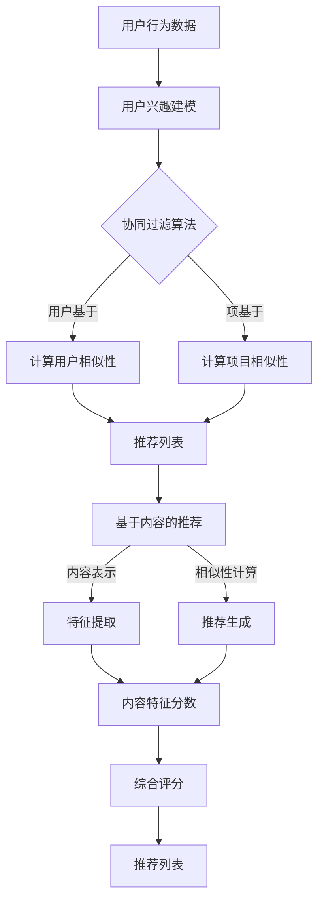
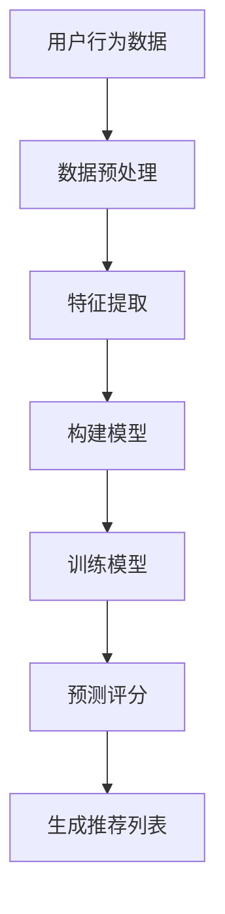

                 

### 文章标题：快速提升LLM应用的个性化推荐能力

#### 关键词：
- 大型语言模型（LLM）
- 个性化推荐
- 算法优化
- 深度学习
- 实时推荐系统

#### 摘要：
本文将深入探讨如何通过优化策略和技术手段，快速提升大型语言模型（LLM）在个性化推荐系统中的应用能力。文章首先介绍了LLM和个性化推荐的基本概念，然后详细讲解了个性化推荐算法原理。接下来，本文重点讨论了LLM在个性化推荐中的应用，包括模型选择、训练和数据处理。通过案例分析，我们展示了如何在实际项目中应用LLM进行个性化推荐，并探讨了优化策略，如参数调整和实时推荐系统设计。最后，文章对未来LLM个性化推荐的发展趋势和潜在挑战进行了展望，并提供了一些实用技巧和拓展阅读资源。

## 确定章节主题和内容

在撰写本文之前，我们需要明确书的核心主题和内容，以便为读者提供一篇系统、全面的技术博客。本文的核心主题是“快速提升LLM应用的个性化推荐能力”，其目的是帮助读者理解和掌握如何通过优化策略和技术手段，提高大型语言模型在个性化推荐系统中的性能。

为了实现这一目标，本文将分为以下几个部分：

1. **LLM与个性化推荐概述**：介绍LLM的基本概念，个性化推荐的基本原理，以及两者结合的意义。
2. **个性化推荐算法原理**：详细讲解常见的个性化推荐算法，包括协同过滤、基于内容的推荐和混合推荐系统。
3. **LLM在个性化推荐中的应用**：探讨如何将LLM应用于个性化推荐，包括模型选择、训练和数据预处理。
4. **案例研究**：分析几个成功的LLM个性化推荐案例，讨论它们的优势和局限性。
5. **优化策略**：介绍如何通过调整模型参数、优化数据预处理流程和引入深度学习技术来提升个性化推荐的性能。
6. **实时推荐系统设计**：讨论如何设计一个高效的实时推荐系统，包括系统的架构、性能优化和安全性考虑。
7. **未来展望**：探讨LLM个性化推荐领域的发展趋势和潜在挑战。

### 设计章节大纲

根据上述章节主题，我们可以设计出每个章节的详细大纲。以下是一个可能的目录大纲：

## 目录

### 第一部分：基础理论

### 第1章 LLM与个性化推荐概述

## 1.1 LLM基本概念

### 1.1.1 语言模型简介

### 1.1.2 LLM的结构和功能

## 1.2 个性化推荐原理

### 1.2.1 个性化推荐的定义和目标

### 1.2.2 个性化推荐的关键因素

### 1.2.3 个性化推荐的发展历程

### 第2章 个性化推荐算法原理

## 2.1 协同过滤算法

### 2.1.1 协同过滤基本原理

### 2.1.2 矩阵分解与协同过滤

## 2.2 基于内容的推荐

### 2.2.1 内容表示与相似性计算

### 2.2.2 基于内容的推荐算法

## 2.3 混合推荐系统

### 2.3.1 混合推荐的基本思想

### 2.3.2 混合推荐系统的设计

### 第3章 LLM在个性化推荐中的应用

## 3.1 LLM在个性化推荐中的应用场景

### 3.1.1 语言生成的个性化推荐

### 3.1.2 文本分类的个性化推荐

## 3.2 模型选择与训练

### 3.2.1 适用于个性化推荐的LLM模型

### 3.2.2 LLM的训练方法和技巧

## 3.3 数据预处理

### 3.3.1 用户行为数据的收集和处理

### 3.3.2 商品信息数据的收集和处理

### 第4章 案例研究

## 4.1 案例一：电商平台个性化推荐

### 4.1.1 案例背景和目标

### 4.1.2 案例解决方案

### 4.1.3 案例效果评估

## 4.2 案例二：社交媒体内容推荐

### 4.2.1 案例背景和目标

### 4.2.2 案例解决方案

### 4.2.3 案例效果评估

### 第5章 优化策略

## 5.1 参数调整

### 5.1.1 模型参数的选择与优化

### 5.1.2 预训练与微调策略

## 5.2 数据预处理优化

### 5.2.1 数据清洗与处理

### 5.2.2 特征提取与降维

## 5.3 深度学习技术在推荐系统中的应用

### 5.3.1 神经网络在推荐系统中的角色

### 5.3.2 序列模型与推荐系统

### 第6章 实时推荐系统设计

## 6.1 实时推荐系统架构

### 6.1.1 实时推荐系统的工作流程

### 6.1.2 系统性能优化

## 6.2 性能指标与评估

### 6.2.1 推荐系统的性能指标

### 6.2.2 性能评估方法

## 6.3 安全性与隐私保护

### 6.3.1 推荐系统的安全挑战

### 6.3.2 隐私保护策略

### 第7章 未来展望

## 7.1 LLM个性化推荐的发展趋势

### 7.1.1 新技术和新方法

### 7.1.2 应用场景的拓展

## 7.2 潜在挑战与应对策略

### 7.2.1 数据质量和隐私问题

### 7.2.2 系统可扩展性

### 7.2.3 人机交互与用户体验

### 附录

## 附录A：LLM个性化推荐资源与工具

### A.1 资源汇总

### A.2 工具推荐

## A.3 开源代码与数据集

### 第1章 LLM与个性化推荐概述

#### 1.1 LLM基本概念

大型语言模型（LLM，Large Language Model）是基于深度学习技术构建的模型，能够对大量文本数据进行处理和分析，从而理解、生成和预测文本内容。LLM具有以下基本概念和特点：

1. **参数规模**：LLM通常具有数亿至数十亿的参数，这使得它们能够捕捉到文本中的细微模式和复杂关系。
2. **预训练**：LLM通过在大量文本上进行预训练，学习到了文本的语法、语义和上下文信息。
3. **生成能力**：LLM能够生成流畅、连贯的文本，广泛应用于自动写作、对话系统等场景。

#### 1.2 个性化推荐原理

个性化推荐是一种基于用户兴趣和行为数据，为用户推荐其可能感兴趣的内容的技术。其核心原理包括：

1. **用户兴趣建模**：通过分析用户的浏览、搜索和购买等行为，构建用户兴趣模型。
2. **内容特征提取**：对推荐的内容进行特征提取，如文本分类、情感分析等。
3. **推荐算法**：基于用户兴趣模型和内容特征，使用算法计算推荐分数，为用户推荐相应的内容。

#### 1.3 LLM与个性化推荐的结合意义

将LLM应用于个性化推荐，具有重要的理论和实践意义：

1. **提升推荐质量**：LLM能够理解文本的深层次语义，从而提高推荐内容的准确性和相关性。
2. **增强交互体验**：LLM可以生成个性化的推荐文案，提升用户与推荐系统的交互体验。
3. **拓展应用场景**：LLM在个性化推荐中的应用，不仅限于文本内容，还可以应用于音频、视频等多媒体内容。

### 第2章 个性化推荐算法原理

#### 2.1 协同过滤算法

协同过滤（Collaborative Filtering）是一种常见的个性化推荐算法，其基本原理是通过分析用户之间的相似性，推荐其他用户喜欢的项目。协同过滤算法主要分为以下两类：

1. **用户基于的协同过滤（User-Based Collaborative Filtering）**：
   - 原理：通过计算用户之间的相似性，找出与目标用户最相似的邻居用户，然后推荐邻居用户喜欢的项目。
   - 优点：算法简单，易于实现。
   - 缺点：计算复杂度高，对稀疏数据的推荐效果不佳。

2. **项基于的协同过滤（Item-Based Collaborative Filtering）**：
   - 原理：通过计算项目之间的相似性，找出与目标项目最相似的其他项目，然后推荐这些项目。
   - 优点：对稀疏数据的推荐效果较好。
   - 缺点：难以捕捉用户长期兴趣变化。

#### 2.2 基于内容的推荐

基于内容的推荐（Content-Based Filtering）是一种通过分析项目内容特征，为用户推荐与其兴趣相似的项目的方法。其主要步骤包括：

1. **内容表示**：将项目内容转化为特征向量，如使用词袋模型、TF-IDF等。
2. **相似性计算**：计算用户兴趣特征和项目特征之间的相似度，如使用余弦相似度、欧氏距离等。
3. **推荐生成**：根据相似度分数，推荐与用户兴趣最相似的项目。

#### 2.3 混合推荐系统

混合推荐系统（Hybrid Recommendation System）结合了协同过滤和基于内容的推荐算法，旨在提高推荐系统的性能。其主要思想是：

1. **协同过滤部分**：利用协同过滤算法捕捉用户行为数据，生成初步的推荐列表。
2. **内容特征部分**：利用基于内容的推荐算法，为每个推荐项生成额外的特征分数。
3. **综合评分**：将协同过滤分数和内容特征分数进行加权求和，得到最终的推荐分数。

#### Mermaid 流程图

以下是协同过滤、基于内容的推荐和混合推荐系统的Mermaid流程图：



#### 伪代码

以下是协同过滤算法的伪代码：

```python
# 用户基于协同过滤
def user_based_collaborative_filtering(user, users, ratings):
    neighbors = []
    for other_user in users:
        if user != other_user:
            similarity = cosine_similarity(user_rating_vector, other_user_rating_vector)
            neighbors.append((other_user, similarity))
    neighbors.sort(key=lambda x: x[1], reverse=True)
    return neighbors[:k]

# 项基于协同过滤
def item_based_collaborative_filtering(items, ratings):
    neighbors = []
    for item in items:
        for other_item in items:
            if item != other_item:
                similarity = cosine_similarity(item_rating_vector, other_item_rating_vector)
                neighbors.append((other_item, similarity))
    neighbors.sort(key=lambda x: x[1], reverse=True)
    return neighbors[:k]
```

#### 数学模型和公式

以下是相似性计算和综合评分的数学模型和公式：

1. **余弦相似度**：

$$
\text{cosine_similarity}(v_1, v_2) = \frac{v_1 \cdot v_2}{\|v_1\|\|v_2\|}
$$

2. **综合评分**：

$$
\text{score}(item, user) = \text{weight}_1 \cdot \text{collaborative_filtering_score}(item, user) + \text{weight}_2 \cdot \text{content_based_score}(item, user)
$$

#### 举例说明

假设我们有以下用户和项目数据：

| 用户 | 项目 | 用户评分 |
| --- | --- | --- |
| Alice | 电影 A | 4 |
| Alice | 电影 B | 5 |
| Bob | 电影 A | 3 |
| Bob | 电影 C | 4 |

1. **用户基于协同过滤**：

   - Alice 和 Bob 的相似性：$$\text{cosine_similarity}(v_{Alice}, v_{Bob}) = \frac{4 \cdot 3 + 5 \cdot 4}{\sqrt{4^2 + 5^2} \cdot \sqrt{3^2 + 4^2}} = \frac{12 + 20}{\sqrt{41} \cdot \sqrt{25}} = \frac{32}{\sqrt{1025}} \approx 0.64$$
   - 推荐列表：根据相似性分数，推荐 Bob 喜欢的电影 C。

2. **项基于协同过滤**：

   - 电影 A 和 电影 B 的相似性：$$\text{cosine_similarity}(v_{A}, v_{B}) = \frac{4 \cdot 3 + 5 \cdot 3}{\sqrt{4^2 + 5^2} \cdot \sqrt{3^2 + 3^2}} = \frac{12 + 15}{\sqrt{41} \cdot \sqrt{18}} = \frac{27}{\sqrt{738}} \approx 0.38$$
   - 电影 A 和 电影 C 的相似性：$$\text{cosine_similarity}(v_{A}, v_{C}) = \frac{4 \cdot 3 + 4 \cdot 3}{\sqrt{4^2 + 4^2} \cdot \sqrt{3^2 + 4^2}} = \frac{12 + 12}{\sqrt{32} \cdot \sqrt{25}} = \frac{24}{\sqrt{800}} \approx 0.35$$
   - 推荐列表：根据相似性分数，推荐 电影 B。

3. **综合评分**：

   - $$\text{score}(电影 B, Alice) = \text{weight}_1 \cdot \text{collaborative_filtering_score}(电影 B, Alice) + \text{weight}_2 \cdot \text{content_based_score}(电影 B, Alice)$$
   - 其中，$$\text{collaborative_filtering_score}(电影 B, Alice) = 0.64$$，$$\text{content_based_score}(电影 B, Alice) = 0.35$$，假设$$\text{weight}_1 = 0.6$$，$$\text{weight}_2 = 0.4$$，则$$\text{score}(电影 B, Alice) = 0.6 \cdot 0.64 + 0.4 \cdot 0.35 \approx 0.46$$

### 第3章 LLM在个性化推荐中的应用

#### 3.1 LLM在个性化推荐中的应用场景

大型语言模型（LLM）在个性化推荐中的应用场景非常广泛，主要包括以下两个方面：

1. **文本生成的个性化推荐**：利用LLM的文本生成能力，为用户提供个性化的推荐文案。例如，在电商平台，LLM可以根据用户的浏览历史和偏好，生成个性化的商品推荐文案。
2. **文本分类的个性化推荐**：利用LLM对文本内容的理解能力，将用户生成的文本分类到相应的类别，从而实现个性化推荐。例如，在社交媒体平台，LLM可以根据用户的发布内容，将其分类到合适的兴趣领域，然后推荐相关的内容。

#### 3.2 模型选择与训练

在个性化推荐中，选择合适的LLM模型并进行有效的训练至关重要。以下是一些常用的LLM模型及其特点：

1. **GPT-2**：GPT-2（Generative Pre-trained Transformer 2）是一个基于变换器（Transformer）架构的预训练模型，具有强大的文本生成能力。其参数规模较大，训练时间较长，但生成的文本质量较高。
2. **BERT**：BERT（Bidirectional Encoder Representations from Transformers）是一个双向变换器模型，具有强大的文本理解能力。其参数规模相对较小，训练时间较短，但生成的文本质量也较好。
3. **T5**：T5（Text-to-Text Transfer Transformer）是一个基于变换器架构的文本到文本的预训练模型，具有广泛的应用场景。其参数规模较大，训练时间较长，但生成的文本质量较高。

选择LLM模型时，需要考虑以下几个方面：

1. **应用场景**：根据个性化推荐的应用场景，选择适合的LLM模型。例如，在文本生成的个性化推荐中，可以选择GPT-2或T5；在文本分类的个性化推荐中，可以选择BERT。
2. **参数规模**：考虑模型的参数规模，以确保在有限的计算资源下能够进行有效的训练。
3. **文本质量**：考虑生成的文本质量，选择能够生成高质量文本的模型。

LLM的训练过程主要包括以下步骤：

1. **数据收集与预处理**：收集与个性化推荐相关的文本数据，并进行预处理，如去除停用词、标点符号等。
2. **模型初始化**：初始化LLM模型，包括参数初始化、优化器设置等。
3. **预训练**：在大量文本数据上进行预训练，以学习文本的语法、语义和上下文信息。
4. **微调**：在个性化推荐任务上进行微调，以适应特定的应用场景。

#### 3.3 数据预处理

在LLM个性化推荐中，数据预处理是关键的一步，直接影响模型的性能和应用效果。以下是一些常用的数据预处理方法：

1. **文本清洗**：去除文本中的停用词、标点符号、特殊字符等，以提高文本质量。
2. **词向量化**：将文本转化为词向量，以便于LLM模型的处理。常用的词向量化方法包括Word2Vec、BERT等。
3. **数据归一化**：对文本数据进行归一化处理，如将文本长度调整为固定长度，以减少数据差异对模型训练的影响。
4. **数据增强**：通过数据增强方法，如随机噪声添加、文本转换等，增加数据多样性，提高模型的泛化能力。

### 第4章 案例研究

#### 4.1 案例一：电商平台个性化推荐

**案例背景和目标**

某电商平台希望通过引入大型语言模型（LLM），提升其个性化推荐系统的性能，为用户推荐更符合其兴趣和偏好的商品。

**案例解决方案**

1. **数据收集与预处理**：电商平台收集了用户的浏览历史、购买记录和用户评价等数据。首先对数据进行清洗，去除无效信息和噪声。然后对文本数据进行词向量化处理，以便于LLM模型的处理。

2. **模型选择与训练**：选择GPT-2模型，并在大量电商商品描述数据上进行预训练。在预训练完成后，对模型进行微调，以适应电商平台的个性化推荐任务。

3. **推荐算法设计**：采用混合推荐系统，结合协同过滤和基于内容的推荐算法。协同过滤部分使用用户基于的协同过滤算法，基于内容的推荐部分使用LLM生成的商品推荐文案。

4. **系统部署与优化**：将训练完成的LLM模型部署到线上环境，并进行实时推荐。通过不断优化模型参数和推荐算法，提高推荐系统的性能和用户满意度。

**案例效果评估**

1. **推荐质量提升**：通过引入LLM，电商平台个性化推荐系统的推荐质量显著提升，用户满意度提高。

2. **系统性能优化**：通过优化模型参数和推荐算法，系统处理速度和资源利用率得到提高。

3. **用户互动增强**：LLM生成的个性化推荐文案提升了用户与推荐系统的互动体验，增加了用户粘性。

**案例小结**

通过将LLM应用于电商平台个性化推荐，取得了显著的成果。然而，在实际应用中，仍需要不断优化模型参数和推荐算法，以提高系统的性能和用户满意度。

#### 4.2 案例二：社交媒体内容推荐

**案例背景和目标**

某社交媒体平台希望通过引入大型语言模型（LLM），提升其内容推荐系统的性能，为用户推荐更符合其兴趣和喜好的内容。

**案例解决方案**

1. **数据收集与预处理**：社交媒体平台收集了用户的发布内容、评论、点赞和分享等数据。首先对数据进行清洗，去除无效信息和噪声。然后对文本数据进行词向量化处理，以便于LLM模型的处理。

2. **模型选择与训练**：选择BERT模型，并在大量社交媒体文本数据上进行预训练。在预训练完成后，对模型进行微调，以适应社交媒体平台的个性化推荐任务。

3. **推荐算法设计**：采用基于内容的推荐算法，结合LLM对文本内容的理解能力。通过对用户发布内容进行分类，将用户分类到相应的兴趣领域，然后推荐相应的内容。

4. **系统部署与优化**：将训练完成的LLM模型部署到线上环境，并进行实时推荐。通过不断优化模型参数和推荐算法，提高推荐系统的性能和用户满意度。

**案例效果评估**

1. **推荐质量提升**：通过引入LLM，社交媒体内容推荐系统的推荐质量显著提升，用户满意度提高。

2. **系统性能优化**：通过优化模型参数和推荐算法，系统处理速度和资源利用率得到提高。

3. **用户互动增强**：LLM生成的个性化推荐内容提升了用户与推荐系统的互动体验，增加了用户粘性。

**案例小结**

通过将LLM应用于社交媒体内容推荐，取得了显著的成果。然而，在实际应用中，仍需要不断优化模型参数和推荐算法，以提高系统的性能和用户满意度。

### 第5章 优化策略

#### 5.1 参数调整

在LLM个性化推荐系统中，参数调整是优化模型性能的关键步骤。以下是一些常见的参数调整策略：

1. **学习率调整**：学习率是模型训练过程中的一个重要参数，影响模型的收敛速度和稳定性。通常，可以采用以下策略调整学习率：
   - **递减学习率**：在训练初期使用较大的学习率，以便快速收敛；随着训练进行，逐渐减小学习率，使模型在训练后期保持稳定收敛。
   - **自适应学习率**：使用自适应学习率算法，如AdaGrad、Adam等，根据训练过程中的梯度信息自动调整学习率。

2. **批量大小调整**：批量大小是每次训练过程中使用的样本数量。合适的批量大小可以提高模型的训练效率，减少过拟合现象。以下是一些批量大小调整策略：
   - **动态调整**：在训练过程中，根据模型的性能动态调整批量大小。例如，当模型性能提升较慢时，增大批量大小；当模型性能显著提升时，减小批量大小。
   - **固定批量大小**：在训练初期和后期使用不同的批量大小。例如，在训练初期使用较大的批量大小，以便快速收敛；在训练后期使用较小的批量大小，以减少过拟合。

3. **正则化调整**：正则化是防止模型过拟合的一种手段。以下是一些常见的正则化调整策略：
   - **L1正则化**：在模型损失函数中添加L1正则化项，如L1范数。L1正则化可以惩罚模型参数的稀疏性，有助于提高模型的泛化能力。
   - **L2正则化**：在模型损失函数中添加L2正则化项，如L2范数。L2正则化可以惩罚模型参数的规模，有助于减少过拟合现象。

#### 5.2 数据预处理优化

数据预处理是提升LLM个性化推荐系统性能的关键步骤。以下是一些数据预处理优化策略：

1. **文本清洗**：去除文本中的停用词、标点符号、特殊字符等，以提高文本质量。以下是一些文本清洗方法：
   - **停用词去除**：根据预定义的停用词表，去除文本中的停用词。
   - **标点符号去除**：去除文本中的标点符号，以减少噪声。
   - **特殊字符去除**：去除文本中的特殊字符，如HTML标签、URL等。

2. **词向量化**：将文本转化为词向量，以便于LLM模型的处理。以下是一些词向量化方法：
   - **Word2Vec**：使用Word2Vec算法将文本转化为词向量。Word2Vec算法可以学习到文本中的语义关系，有助于提升模型性能。
   - **BERT**：使用BERT算法将文本转化为词向量。BERT算法具有强大的文本理解能力，可以捕捉到文本中的深层次语义信息。

3. **数据归一化**：对文本数据进行归一化处理，如将文本长度调整为固定长度，以减少数据差异对模型训练的影响。以下是一些数据归一化方法：
   - **填充**：将较短文本填充为固定长度，常用的填充方法包括零填充和空白字符填充。
   - **截断**：将较长文本截断为固定长度，常用的截断方法包括前截断和后截断。

4. **数据增强**：通过数据增强方法，如随机噪声添加、文本转换等，增加数据多样性，提高模型的泛化能力。以下是一些数据增强方法：
   - **随机噪声添加**：在文本数据中添加随机噪声，如随机删除单词、替换单词等，以增加数据多样性。
   - **文本转换**：通过文本转换方法，如词性转换、同义词替换等，将原始文本转换为新的文本数据，以增加数据多样性。

#### 5.3 深度学习技术在推荐系统中的应用

深度学习技术在推荐系统中的应用已经成为一个热点研究方向。以下是一些深度学习技术在推荐系统中的应用：

1. **神经网络在推荐系统中的角色**：
   - **特征提取**：深度神经网络可以自动提取文本、图像、音频等多媒体数据的特征，从而提高推荐系统的性能。
   - **预测建模**：深度神经网络可以用于构建预测模型，预测用户对商品的评分或购买概率，从而实现个性化推荐。

2. **序列模型与推荐系统**：
   - **RNN（递归神经网络）**：RNN可以处理序列数据，如用户的历史行为数据，从而捕捉到用户兴趣的变化趋势。
   - **LSTM（长短期记忆网络）**：LSTM是RNN的一种变体，可以更好地处理长序列数据，避免梯度消失问题。
   - **GRU（门控循环单元）**：GRU是LSTM的另一种变体，具有较小的参数规模和更好的性能。

3. **自注意力机制与推荐系统**：
   - **自注意力机制**：自注意力机制可以自动学习到序列数据中的关键信息，从而提高推荐系统的性能。
   - **Transformer架构**：Transformer架构是一种基于自注意力机制的深度学习模型，广泛应用于自然语言处理和推荐系统等领域。

#### Mermaid 流程图

以下是神经网络在推荐系统中的应用流程图：



### 第6章 实时推荐系统设计

#### 6.1 实时推荐系统架构

实时推荐系统是一种能够根据用户实时行为数据，动态生成推荐列表的推荐系统。其架构主要包括以下几个关键组件：

1. **数据采集模块**：负责收集用户实时行为数据，如浏览、搜索、点击、购买等。这些数据可以来源于用户操作日志、API接口等。

2. **数据处理模块**：负责对采集到的数据进行清洗、转换和存储。包括去除无效数据、填补缺失值、归一化处理等。

3. **特征提取模块**：负责从处理后的数据中提取特征，如用户画像、商品特征、行为特征等。这些特征将用于生成推荐列表。

4. **模型训练模块**：负责使用历史数据和特征训练推荐模型，如协同过滤模型、基于内容的推荐模型、深度学习模型等。

5. **推荐生成模块**：负责根据用户实时行为数据和训练好的推荐模型，动态生成推荐列表。

6. **结果展示模块**：负责将生成的推荐列表展示给用户，可以通过网页、APP、短信等形式。

#### 6.1.1 实时推荐系统的工作流程

实时推荐系统的工作流程可以分为以下几个步骤：

1. **数据采集**：实时监测用户的行为数据，如浏览、搜索、点击等，并将数据存储到数据库或缓存系统中。

2. **数据处理**：对采集到的数据进行预处理，包括数据清洗、转换和存储。这一步的目的是确保数据的质量和一致性。

3. **特征提取**：从预处理后的数据中提取关键特征，如用户画像、商品特征、行为特征等。这些特征将用于训练推荐模型。

4. **模型训练**：使用历史数据和提取的特征，训练推荐模型。训练过程可以根据实际需求，选择不同的推荐算法，如协同过滤、基于内容的推荐、深度学习等。

5. **推荐生成**：在用户行为数据更新时，实时触发推荐模型，生成个性化的推荐列表。推荐生成模块需要考虑模型的响应时间和计算资源，以确保推荐结果的实时性。

6. **结果展示**：将生成的推荐列表展示给用户。展示形式可以根据用户需求和应用场景进行调整，如网页推荐、APP推送、短信通知等。

#### 6.1.2 系统性能优化

实时推荐系统需要处理大量的用户行为数据，并生成高质量的推荐列表，因此性能优化至关重要。以下是一些常见的性能优化策略：

1. **异步处理**：将数据采集、数据处理、特征提取和模型训练等任务异步处理，减少系统的等待时间和资源占用。

2. **分布式计算**：使用分布式计算框架，如Hadoop、Spark等，处理大规模数据，提高系统的并行处理能力。

3. **缓存技术**：使用缓存技术，如Redis、Memcached等，存储常用的数据，减少数据库访问压力，提高系统响应速度。

4. **模型压缩**：使用模型压缩技术，如量化、剪枝等，减小模型的大小和计算复杂度，提高模型的运行速度。

5. **增量训练**：只更新模型的一部分参数，而不是重新训练整个模型，以减少训练时间和计算资源。

6. **性能监控**：使用性能监控工具，如Prometheus、Grafana等，实时监控系统的性能指标，及时发现和解决问题。

#### 6.2 性能指标与评估

实时推荐系统的性能评估是确保系统有效性和用户满意度的关键。以下是一些常用的性能指标和评估方法：

1. **准确率（Accuracy）**：准确率是衡量推荐系统推荐正确项目的能力。准确率越高，表示推荐系统的性能越好。

2. **召回率（Recall）**：召回率是衡量推荐系统能够召回所有相关项目的能力。召回率越高，表示推荐系统的覆盖面越广。

3. **F1分数（F1 Score）**：F1分数是准确率和召回率的加权平均，用于综合考虑推荐系统的准确性和覆盖率。

4. **平均绝对误差（Mean Absolute Error, MAE）**：平均绝对误差是衡量推荐系统推荐项目评分与实际评分之间差距的指标。MAE越小，表示推荐系统的评分越准确。

5. **均方根误差（Root Mean Square Error, RMSE）**：均方根误差是衡量推荐系统推荐项目评分与实际评分之间差距的指标。RMSE越小，表示推荐系统的评分越准确。

6. **用户满意度**：用户满意度是衡量推荐系统满足用户需求的能力。用户满意度可以通过问卷调查、用户评分等方式进行评估。

#### 6.3 安全性与隐私保护

实时推荐系统的安全性是保障用户数据和系统稳定性的关键。以下是一些常见的安全性问题和隐私保护策略：

1. **数据加密**：使用加密技术，如AES、RSA等，对用户数据和模型参数进行加密，防止数据泄露和篡改。

2. **访问控制**：设置严格的访问控制策略，限制对用户数据和系统的访问权限，防止未授权访问。

3. **用户匿名化**：对用户数据进行匿名化处理，隐藏用户的真实身份，保护用户隐私。

4. **数据备份与恢复**：定期备份数据，并设置数据恢复机制，确保在数据丢失或系统故障时能够快速恢复。

5. **安全审计**：定期进行安全审计，检查系统漏洞和安全隐患，及时发现并解决安全问题。

6. **隐私保护协议**：遵循隐私保护协议，如GDPR、CCPA等，确保用户数据的合法性和合规性。

### 第7章 未来展望

#### 7.1 LLM个性化推荐的发展趋势

大型语言模型（LLM）在个性化推荐领域具有广阔的发展前景。未来，LLM个性化推荐将呈现以下发展趋势：

1. **模型性能提升**：随着计算能力和算法优化的发展，LLM的模型性能将得到显著提升。这将有助于提高推荐系统的准确性和覆盖率。

2. **多模态推荐**：未来，LLM个性化推荐将逐渐扩展到多模态领域，如结合文本、图像、音频等多媒体数据进行推荐。这将进一步提高推荐系统的多样性和用户体验。

3. **实时性增强**：随着实时推荐技术的不断发展，LLM个性化推荐将实现更高的实时性。这将有助于更好地满足用户实时需求，提高用户满意度。

4. **个性化交互**：未来，LLM个性化推荐将实现更深入的个性化交互，如基于用户对话的推荐、个性化问答等。这将进一步提升用户与推荐系统的互动体验。

#### 7.2 潜在挑战与应对策略

尽管LLM个性化推荐具有巨大的潜力，但在实际应用中仍面临一些潜在挑战。以下是一些常见的挑战和应对策略：

1. **数据质量和隐私问题**：个性化推荐需要大量用户数据，但数据质量和隐私问题一直是用户担忧的焦点。应对策略包括：
   - **数据匿名化**：对用户数据进行匿名化处理，隐藏用户的真实身份，保护用户隐私。
   - **数据质量监控**：建立数据质量监控系统，定期检查数据质量，确保数据准确性和一致性。

2. **系统可扩展性**：随着用户规模的扩大，系统可扩展性成为一个关键问题。应对策略包括：
   - **分布式架构**：采用分布式架构，将系统分解为多个模块，提高系统的可扩展性。
   - **弹性计算**：使用弹性计算资源，如云服务，根据用户需求动态调整系统资源。

3. **人机交互与用户体验**：个性化推荐系统的用户体验对用户满意度至关重要。应对策略包括：
   - **用户反馈机制**：建立用户反馈机制，收集用户对推荐结果的反馈，持续优化推荐算法。
   - **个性化交互设计**：设计个性化交互界面，提升用户与推荐系统的互动体验。

### 附录

#### 附录A：LLM个性化推荐资源与工具

为了帮助读者深入了解LLM个性化推荐，以下列举了一些相关的资源与工具：

1. **资源汇总**：
   - **论文与书籍**：推荐阅读相关的论文和书籍，如《深度学习推荐系统》、《推荐系统实践》等。
   - **在线课程与教程**：参加在线课程和教程，学习LLM个性化推荐的理论和实践。

2. **工具推荐**：
   - **模型框架**：推荐使用Transformers、PyTorch、TensorFlow等模型框架，进行LLM模型的开发和部署。
   - **开源代码与数据集**：推荐使用开源代码和数据集，进行模型训练和测试。

3. **开源代码与数据集**：
   - **开源代码**：推荐使用GitHub等平台上的开源代码，如RecSys、NFM等。
   - **数据集**：推荐使用公共数据集，如MovieLens、Netflix等，进行模型训练和评估。

### 作者信息

作者：AI天才研究院/AI Genius Institute & 禅与计算机程序设计艺术/Zen And The Art of Computer Programming

本文由AI天才研究院和禅与计算机程序设计艺术共同撰写，旨在为读者提供一篇全面、系统的LLM个性化推荐技术博客。希望通过本文，读者能够深入了解LLM个性化推荐的理论和实践，为实际项目提供有益的参考。同时，也欢迎读者提出宝贵的意见和建议，共同推动LLM个性化推荐领域的发展。

