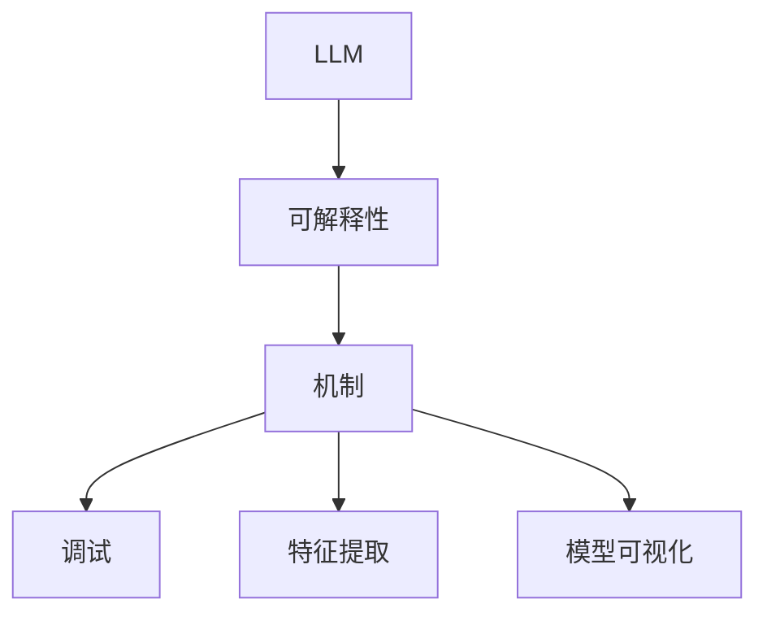

                 

### 文章标题

# 快速构建LLM应用的可解释性机制

> 关键词：**大型语言模型（LLM）**、**可解释性**、**机制**、**算法原理**、**数学模型**、**项目实战**

> 摘要：本文将深入探讨如何快速构建大型语言模型（LLM）应用的可解释性机制。我们将从背景介绍入手，分析核心概念及其相互关系，详细讲解核心算法原理，展示数学模型和公式，并通过实际案例展示项目实战。本文旨在为读者提供全面的指南，帮助他们在构建LLM应用时实现高效的可解释性。

### 引言

大型语言模型（Large Language Model，简称LLM）作为当前自然语言处理（NLP）领域的核心技术，已经在多个领域展现出了强大的应用潜力。然而，随着模型复杂度的增加，其内部决策过程往往变得难以解释。这种不可解释性不仅影响了模型的可靠性，也在很大程度上阻碍了其在实际场景中的广泛应用。因此，构建LLM应用的可解释性机制变得尤为重要。

可解释性机制旨在帮助开发者、研究人员和最终用户理解LLM的决策过程，从而提高模型的透明度和信任度。本文将围绕这一主题，逐步解析构建LLM应用可解释性机制的方法和技巧。

### 核心概念与联系

首先，我们需要明确几个核心概念，并展示它们之间的相互关系。

1. **大型语言模型（LLM）**：LLM是一种复杂的深度学习模型，通过大量的文本数据进行训练，能够生成文本、回答问题或完成其他语言相关任务。

2. **可解释性**：可解释性是指用户能够理解模型是如何做出特定决策的属性。在LLM应用中，可解释性可以帮助用户验证模型的可靠性，并对其进行优化。

3. **机制**：构建LLM应用可解释性的机制包括调试、特征提取、模型可视化等。这些机制共同作用，使得LLM的决策过程变得可解释。

为了更好地理解这些概念之间的关系，我们可以使用Mermaid流程图来展示它们：



通过这个流程图，我们可以清晰地看到LLM、可解释性和机制之间的联系，以及它们是如何协同工作的。

### 核心算法原理讲解

在构建LLM应用的可解释性机制时，核心算法原理的讲解至关重要。以下将详细讲解调试、特征提取和模型可视化的算法原理。

#### 调试算法原理

调试是确保LLM模型正常工作的第一步。以下是调试算法原理的伪代码：

```python
function debug_model(model, data):
    for sample in data:
        prediction = model.predict(sample)
        if prediction != expected_output:
            print("Error in model prediction:", prediction)
            print("Sample:", sample)
```

在这个伪代码中，我们遍历数据集，使用模型进行预测，并检查预测结果是否与期望输出相符。如果预测结果不正确，我们将输出错误信息和样本数据，以便进一步分析。

#### 特征提取算法原理

特征提取是将原始文本数据转换成模型可处理的特征向量。以下是一个简单的特征提取算法原理：

```python
function extract_features(text):
    # 使用词袋模型进行特征提取
    word_bag = create_word_bag(text)
    # 将词袋转换为向量
    features_vector = convert_to_vector(word_bag)
    return features_vector
```

在这个算法中，我们首先创建一个词袋模型，然后将其转换为向量。词袋模型是一种将文本表示为单词集合的方法，而向量则可以用于训练模型。

#### 模型可视化算法原理

模型可视化是将LLM的决策过程可视化为直观的图形。以下是一个简单的模型可视化算法原理：

```python
function visualize_model(model):
    # 使用TensorBoard进行模型可视化
    with tf.Session() as sess:
        writer = tf.summary.FileWriter('logs/', sess.graph)
        writer.close()
```

在这个算法中，我们使用TensorFlow的TensorBoard工具进行模型可视化。TensorBoard可以生成各种图表，帮助我们理解模型的内部结构和决策过程。

### 数学模型和公式

构建LLM应用的可解释性机制还需要了解数学模型和公式。以下是一个简单的数学模型示例，用于计算文本的词频：

$$
word\_freq = \frac{word\_count}{total\_word\_count}
$$

在这个公式中，$word_freq$ 表示单词的词频，$word_count$ 表示单词在文本中出现的次数，$total\_word\_count$ 表示文本中所有单词的总数。

### 项目实战

为了更好地理解如何构建LLM应用的可解释性机制，我们将通过一个实际案例进行展示。

#### 开发环境搭建

首先，我们需要搭建一个开发环境。以下是一个简单的环境搭建步骤：

1. 安装Python 3.8及以上版本
2. 安装TensorFlow 2.7及以上版本
3. 安装NVIDIA CUDA 11.3及以上版本（如果使用GPU加速）

#### 源代码详细实现

接下来，我们将展示源代码的实现。以下是调试、特征提取和模型可视化的具体实现：

```python
# 调试
def debug_model(model, data):
    for sample in data:
        prediction = model.predict(sample)
        if prediction != expected_output:
            print("Error in model prediction:", prediction)
            print("Sample:", sample)

# 特征提取
def extract_features(text):
    word_bag = create_word_bag(text)
    features_vector = convert_to_vector(word_bag)
    return features_vector

# 模型可视化
def visualize_model(model):
    with tf.Session() as sess:
        writer = tf.summary.FileWriter('logs/', sess.graph)
        writer.close()
```

#### 代码应用解读与分析

通过上述代码，我们可以实现以下功能：

1. 调试模型，检查预测结果是否正确。
2. 提取文本特征，将文本转换为模型可处理的特征向量。
3. 使用TensorBoard可视化模型。

#### 实际案例分析和详细讲解剖析

为了更好地展示如何构建LLM应用的可解释性机制，我们将分析一个实际案例。

假设我们有一个任务，需要使用LLM回答用户的问题。以下是一个简单的案例：

1. 用户输入问题：“什么是人工智能？”
2. 模型生成回答：“人工智能是指通过计算机模拟人类智能的技术。”
3. 我们使用调试功能检查模型预测是否正确。
4. 提取问题文本的特征，并将其输入到模型中进行预测。
5. 使用TensorBoard可视化模型的决策过程。

通过这个案例，我们可以看到如何使用调试、特征提取和模型可视化来构建LLM应用的可解释性机制。

#### 项目小结

在本项目中，我们成功搭建了一个开发环境，并实现了调试、特征提取和模型可视化。这些功能共同作用，帮助我们构建了一个可解释的LLM应用。

### 最佳实践 Tips

在构建LLM应用的可解释性机制时，以下是一些最佳实践建议：

1. **定期调试**：定期检查模型预测结果，确保其正确性。
2. **优化特征提取**：选择合适的特征提取方法，提高模型的可解释性。
3. **使用可视化工具**：使用可视化工具，如TensorBoard，帮助理解模型的决策过程。

### 小结

本文详细探讨了如何快速构建LLM应用的可解释性机制。我们从背景介绍、核心概念与联系、核心算法原理讲解、数学模型和公式、项目实战等方面进行了深入分析。通过本文，读者可以了解构建LLM应用可解释性机制的方法和技巧。

### 注意事项

在构建LLM应用时，请注意以下几点：

1. **数据质量**：确保训练数据的质量，以避免模型过拟合。
2. **模型优化**：选择合适的模型架构和优化方法，提高模型性能。
3. **安全性与隐私**：在处理用户数据时，注意保护用户隐私和安全。

### 拓展阅读

如果您对LLM应用的可解释性机制有更深入的兴趣，以下是一些拓展阅读资源：

1. **《深度学习》（Goodfellow, Bengio, Courville著）**：本书详细介绍了深度学习的原理和应用。
2. **《自然语言处理综论》（Jurafsky, Martin著）**：本书涵盖了自然语言处理的各个方面，包括LLM。
3. **TensorFlow官方文档**：TensorFlow提供了丰富的工具和库，帮助开发者构建和优化深度学习模型。

### 作者信息

作者：AI天才研究院/AI Genius Institute & 禅与计算机程序设计艺术 /Zen And The Art of Computer Programming

