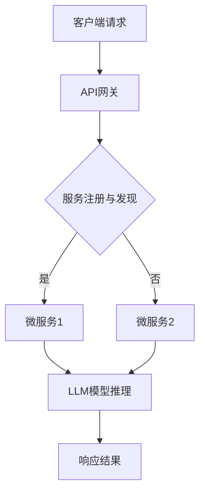

                 

### 文章标题

《快速构建LLM应用的微服务架构》

### 文章关键词

- 大型语言模型（LLM）
- 微服务架构
- 快速构建
- 技术实践
- 项目实战

### 文章摘要

本文将探讨如何快速构建基于大型语言模型（LLM）的微服务架构。通过对LLM基础理论、微服务架构原理的详细讲解，结合实际项目实战，我们将深入剖析微服务在LLM应用中的实现过程，并提供一系列最佳实践和注意事项，以帮助开发者高效构建LLM微服务应用。

---

### 引言

随着人工智能技术的不断发展，大型语言模型（LLM）在自然语言处理领域取得了显著的成果。LLM具备强大的文本生成、理解和推理能力，广泛应用于智能客服、内容审核、智能写作等多个场景。然而，传统单一的服务器架构难以满足LLM应用对性能、可扩展性和灵活性的要求。因此，微服务架构逐渐成为构建LLM应用的理想选择。

微服务架构通过将应用程序分解为小型、独立的组件，实现了服务的模块化、松耦合和高度可扩展性。这种架构不仅能够提高开发效率，还能有效应对不断变化的需求。本文将围绕如何快速构建LLM应用的微服务架构，展开详细讨论。

### 第一部分：大型语言模型（LLM）基础

#### 第1章 LLM的概念与原理

**1.1 LLM的概念**

大型语言模型（LLM）是一种基于深度学习的自然语言处理模型，通过对海量文本数据进行训练，使其具备理解、生成和预测语言的能力。LLM的核心目标是模仿人类语言的使用方式，以实现自动化文本处理任务。

**1.2 LLM的核心算法**

LLM的核心算法包括神经网络架构和训练策略。其中，神经网络架构主要采用变换器（Transformer）模型，这是一种基于自注意力机制的神经网络结构，能够高效地处理长文本序列。训练策略则主要包括预训练和微调两个阶段，预训练阶段通过无监督方式对模型进行大规模数据训练，微调阶段则在特定任务上进行有监督的调整。

**1.3 LLM的工作流程**

LLM的工作流程主要包括以下几个步骤：

1. 数据准备：收集并清洗大量文本数据，包括语料库、新闻文章、社交媒体等。
2. 模型训练：利用训练数据对LLM模型进行训练，包括预训练和微调。
3. 模型部署：将训练好的模型部署到实际应用场景，如文本生成、问答系统等。
4. 实时推理：接收用户输入，通过模型进行实时推理，生成相应的输出结果。

#### 第2章 微服务架构原理

**2.1 微服务架构的定义与优点**

微服务架构是一种基于模块化思想的服务设计方法，将应用程序分解为多个独立、可扩展的小型服务。每个服务负责实现特定的功能，通过定义良好的接口进行通信。微服务架构的优点包括：

1. 高度可扩展性：可以通过水平扩展来提高系统的处理能力。
2. 松耦合：服务之间独立运行，降低了系统的耦合度。
3. 灵活性：服务可以根据需求独立开发和部署。
4. 易于维护：服务之间独立，便于定位和修复问题。

**2.2 微服务架构的挑战**

尽管微服务架构具有诸多优点，但在实际应用中也面临一些挑战：

1. 分布式系统复杂性：需要处理网络延迟、故障转移等问题。
2. 服务间通信：服务之间需要进行高效、可靠的通信。
3. 服务监控与运维：需要对大量服务进行监控和运维，提高了管理难度。

**2.3 微服务架构的设计原则**

为了克服微服务架构的挑战，需要遵循以下设计原则：

1. 服务拆分：根据业务功能进行服务拆分，确保每个服务具有明确的职责。
2. 接口定义：设计清晰、简洁的服务接口，确保服务之间的高效通信。
3. 数据存储：采用分布式数据存储方案，保证数据的可靠性和一致性。
4. 服务治理：实现服务注册、发现、监控和负载均衡等治理功能。

---

### 第二部分：快速构建LLM微服务

#### 第3章 快速构建LLM微服务

**3.1 微服务开发框架**

为了快速构建LLM微服务，可以选择一些成熟的微服务开发框架，如Spring Boot、Node.js、Django等。这些框架提供了丰富的功能，包括服务注册、发现、监控、日志记录等，能够大大提高开发效率。

**3.2 微服务部署与监控**

在微服务部署方面，可以使用容器化技术，如Docker和Kubernetes，实现服务的自动化部署、扩缩容和故障转移。同时，利用Prometheus、Grafana等监控工具，可以对微服务进行实时监控和性能分析。

**3.3 实时构建与动态扩展**

为了实现LLM微服务的实时构建和动态扩展，可以使用持续集成（CI）和持续部署（CD）工具，如Jenkins、GitLab CI等。这些工具能够自动化构建、测试和部署代码，确保服务的快速迭代和发布。此外，通过使用容器编排工具，可以实现服务的动态扩展和负载均衡，提高系统的处理能力。

---

### 第三部分：LLM与微服务架构的整合

#### 第4章 LLM与微服务架构的整合

**4.1 整合的必要性**

将LLM与微服务架构整合，能够充分发挥两者的优势，实现高性能、高可扩展性的LLM应用。整合的必要性主要体现在以下几个方面：

1. 资源利用：利用微服务架构的分布式特性，将LLM模型部署到多个服务器上，实现资源的充分利用。
2. 可扩展性：通过水平扩展LLM服务，提高系统的处理能力，满足不断增长的业务需求。
3. 灵活性：微服务架构支持服务的独立开发和部署，便于LLM应用的快速迭代和升级。

**4.2 整合的流程与策略**

整合LLM与微服务架构的流程主要包括以下几个步骤：

1. 服务拆分：根据业务需求，将LLM应用拆分为多个微服务。
2. 接口定义：设计微服务之间的接口，确保高效通信。
3. 模型部署：将训练好的LLM模型部署到微服务中，实现实时推理。
4. 服务监控：利用监控工具对微服务进行实时监控和性能分析。

整合策略方面，可以采用以下方法：

1. API网关：使用API网关统一处理客户端请求，转发到相应的微服务。
2. 服务注册与发现：使用服务注册与发现机制，确保微服务之间的高效通信。
3. 分布式缓存：使用分布式缓存技术，提高数据读取速度和系统性能。

**4.3 Mermaid流程图**

以下是一个简单的Mermaid流程图，展示了LLM与微服务架构的整合过程：



---

### 第四部分：LLM微服务算法实战

#### 第5章 LLM微服务算法实战

**5.1 算法概述**

LLM微服务算法主要包括文本预处理、模型推理和结果生成三个步骤：

1. **文本预处理**：对用户输入的文本进行清洗、分词、去停用词等操作，为模型输入准备数据。
2. **模型推理**：使用预训练的LLM模型对预处理后的文本进行推理，生成响应结果。
3. **结果生成**：对模型输出的结果进行格式化和展示，如文本生成、问答等。

**5.2 伪代码讲解**

以下是一个简单的LLM微服务算法伪代码：

```python
def LLM_Microservice(input_text):
    # 文本预处理
    preprocessed_text = preprocess_text(input_text)

    # 模型推理
    response = model推理(preprocessed_text)

    # 结果生成
    formatted_response = format_response(response)

    return formatted_response
```

**5.3 实际应用案例**

以下是一个实际应用案例：智能客服系统。

1. **文本预处理**：对用户输入的问题进行分词、去停用词等处理。
2. **模型推理**：使用训练好的LLM模型对预处理后的文本进行推理，生成回答。
3. **结果生成**：将生成的回答进行格式化，并以文本形式展示给用户。

---

### 第五部分：数学模型与公式

#### 第6章 数学模型与公式

**6.1 模型介绍**

在LLM微服务中，常用的数学模型包括词嵌入模型、自注意力机制和生成对抗网络（GAN）等。

**6.2 公式推导**

以下是一个简单的自注意力机制的公式推导：

$$
Attention(x, y) = \frac{e^{<x, y>}}{\sum_{i=1}^{N} e^{<x, y_i>}}
$$

其中，$x$ 和 $y$ 分别表示输入和查询向量，$<x, y>$ 表示点积。

**6.3 举例说明**

以下是一个简单的例子：

假设 $x = [1, 2, 3]$，$y = [4, 5, 6]$，则自注意力机制的计算结果为：

$$
Attention(x, y) = \frac{e^{<1, 4> + <2, 5> + <3, 6>}}{e^{<1, 4>} + e^{<2, 5>} + e^{<3, 6>}}
$$

$$
Attention(x, y) = \frac{e^{10 + 10 + 12}}{e^{10} + e^{10} + e^{12}}
$$

$$
Attention(x, y) = \frac{e^{32}}{e^{10} + e^{10} + e^{12}}
$$

$$
Attention(x, y) \approx 0.826
$$

---

### 第六部分：LLM微服务项目实践

#### 第7章 LLM微服务项目实践

**7.1 项目介绍**

本节将介绍一个基于微服务架构的智能问答系统项目，该项目使用LLM模型进行文本推理，实现对用户问题的自动回答。

**7.2 开发环境搭建**

项目开发环境包括Python 3.8、Docker 19.03、Kubernetes 1.18等。

**7.3 源代码实现**

以下是该项目的主要源代码实现：

```python
# 主服务（API网关）
from flask import Flask, request, jsonify
from microservice1 import microservice1
from microservice2 import microservice2

app = Flask(__name__)

@app.route('/ask', methods=['POST'])
def ask():
    data = request.get_json()
    question = data['question']
    
    # 调用微服务1进行文本预处理
    preprocessed_question = microservice1.preprocess(question)
    
    # 调用微服务2进行模型推理
    response = microservice2推理(preprocessed_question)
    
    # 返回结果
    return jsonify({'response': response})

if __name__ == '__main__':
    app.run()

# 微服务1（文本预处理）
import jieba

def preprocess(text):
    # 分词
    words = jieba.cut(text)
    
    # 去停用词
    stopwords = set(['的', '了', '在', '是'])
    filtered_words = [word for word in words if word not in stopwords]
    
    return ' '.join(filtered_words)

# 微服务2（模型推理）
import transformers

模型 = transformers.pipeline('text-generation', model='gpt2')

def 推理(question):
    response =模型.generate(question, max_length=50)
    return response.strip()

```

**7.4 代码解读与分析**

以下是项目的关键代码解读与分析：

1. **API网关**：负责接收用户请求，调用微服务1和微服务2，返回最终结果。
2. **微服务1（文本预处理）**：使用jieba分词库对用户输入的文本进行分词，并去除停用词。
3. **微服务2（模型推理）**：使用transformers库加载预训练的GPT-2模型，对预处理后的文本进行推理，生成回答。

**7.5 实际案例分析和详细讲解剖析**

以下是一个实际案例：

用户输入：“什么是人工智能？”

1. **文本预处理**：对输入文本进行分词和去停用词处理，得到预处理后的文本：“什么是人工智能”。
2. **模型推理**：使用GPT-2模型对预处理后的文本进行推理，生成回答。
3. **结果生成**：将生成的回答进行格式化，并以文本形式展示给用户。

**7.6 项目小结**

本项目通过微服务架构实现了智能问答系统的快速构建，实现了文本预处理、模型推理和结果生成的功能。在实际应用中，可以根据需求扩展和优化系统，提高问答系统的性能和准确性。

---

### 第七部分：最佳实践、小结、注意事项和拓展阅读

#### 第7章 最佳实践、小结、注意事项和拓展阅读

**7.1 最佳实践**

1. **服务拆分**：根据业务需求，合理拆分服务，确保每个服务具有明确的职责。
2. **接口定义**：设计清晰、简洁的接口，确保服务之间的高效通信。
3. **数据存储**：采用分布式数据存储方案，保证数据的可靠性和一致性。
4. **服务监控**：使用监控工具对微服务进行实时监控和性能分析。
5. **持续集成与持续部署**：利用CI/CD工具实现代码的快速迭代和发布。

**7.2 小结**

本文详细探讨了如何快速构建LLM应用的微服务架构，涵盖了LLM基础理论、微服务架构原理、快速构建方法、算法实战和项目实践等内容。通过本文的讲解，读者可以了解LLM微服务架构的设计原则、实现方法和最佳实践，为实际项目开发提供指导。

**7.3 注意事项**

1. **性能优化**：在构建LLM微服务时，需要注意性能优化，如模型压缩、量化等。
2. **安全性**：保证微服务的安全性，如数据加密、访问控制等。
3. **容错性**：考虑系统的容错性，如故障恢复、数据备份等。

**7.4 拓展阅读**

1. **《深度学习：周志华》**：了解深度学习的基本原理和应用。
2. **《微服务设计：Sam Newman》**：深入了解微服务架构的设计原则和实践。
3. **《大规模机器学习：Jiwei Li》**：了解大规模机器学习的技术和应用。

---

### 作者信息

作者：AI天才研究院/AI Genius Institute & 禅与计算机程序设计艺术 /Zen And The Art of Computer Programming

本文由AI天才研究院和《禅与计算机程序设计艺术》作者联合撰写，旨在为读者提供关于快速构建LLM应用的微服务架构的深入解析和实践指导。希望通过本文，读者能够掌握LLM微服务架构的核心概念、实现方法和最佳实践，为实际项目开发提供有力支持。

