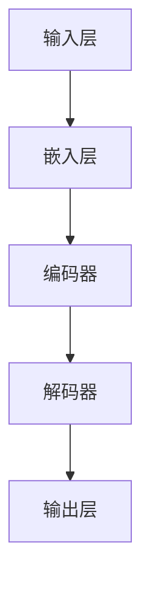
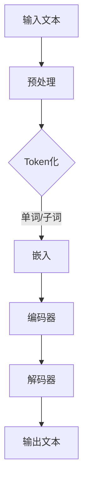

                 

# 快速构建LLM应用的移动端适配策略

## 文章关键词

- 语言模型
- 移动端适配
- 模型压缩
- 性能优化
- 界面设计
- 安全性

## 摘要

随着移动设备的普及，越来越多的用户倾向于在移动端使用各类应用。大型语言模型（LLM）因其强大的自然语言处理能力，在移动端有着广泛的应用场景。然而，如何快速构建并适配LLM应用的移动端版本，成为开发者和工程师面临的一大挑战。本文将探讨LLM应用的移动端适配策略，包括模型优化、性能优化、界面优化、安全性以及发布和维护等方面，旨在为开发者提供一套完整的解决方案。

## 第1章 LLM应用基础

### 1.1.1 LLM的概念和作用

**Mermaid流程图：LLM的基本原理与架构**



LLM是一种基于深度学习的自然语言处理模型，通过学习大量的文本数据，能够对输入的文本进行理解和生成。LLM的应用场景非常广泛，包括但不限于机器翻译、问答系统、文本摘要、对话系统等。

**LLM与NLP的关系**

LLM是自然语言处理（NLP）领域的重要工具。NLP的目标是使计算机能够理解、处理和生成自然语言。LLM通过其强大的语义理解能力，极大地推动了NLP技术的发展和应用。

### 1.1.2 LLM的核心算法原理

**伪代码讲解：LLM的主要算法，如Transformer、BERT等**

```python
# Transformer伪代码
function Transformer(inputs):
    # 嵌入层
    embeddings = EmbeddingLayer(inputs)

    # 编码器层
    for layer in EncoderLayers:
        embeddings = layer(embeddings)

    # 解码器层
    for layer in DecoderLayers:
        embeddings = layer(embeddings)

    # 输出层
    outputs = OutputLayer(embeddings)
    return outputs
```

**LLM的优势和挑战**

LLM的优势在于其强大的语义理解能力和文本生成能力。然而，其大规模的训练和推理过程也对计算资源提出了很高的要求，这是LLM面临的主要挑战。

### 1.1.3 移动端适配的必要性

**移动设备的特点**

移动设备具有便携性、高性能和丰富的功能，但它们的计算资源和存储空间相对有限。因此，LLM应用在移动端的适配需要特别考虑这些限制。

**LLM应用在移动端的挑战**

- 计算资源限制
- 网络通信延迟
- 界面交互体验

**移动端适配的重要性**

移动端适配不仅能够提升用户体验，还能够延长设备电池寿命，提高应用的稳定性和可靠性。

## 第2章 移动端开发基础知识

### 2.1.1 移动端操作系统概述

**iOS和Android操作系统特点**

iOS和Android是当前最流行的移动操作系统。iOS以封闭性、安全性和稳定性著称，而Android则以开放性和多样性为特点。

**移动设备硬件配置**

移动设备的硬件配置包括CPU、GPU、内存、存储等。硬件性能的优劣直接影响应用的表现。

### 2.1.2 移动端应用开发框架

**React Native、Flutter等**

React Native和Flutter是目前最流行的移动端应用开发框架。它们具有跨平台、高效、灵活等优点。

**框架选择依据**

选择框架时，需要考虑应用的特性、开发团队的技术栈以及开发效率等因素。

### 2.1.3 移动端开发工具与资源

**Xcode、Android Studio等**

Xcode和Android Studio是开发iOS和Android应用的官方工具。它们提供了丰富的开发资源和调试工具。

**调试工具推荐**

移动端应用开发中，调试工具至关重要。Chrome DevTools和Android Studio内置的调试工具都是不错的选择。

## 第3章 LLM模型优化

### 3.1.1 模型压缩技术

**算法原理**

模型压缩技术包括剪枝、量化、蒸馏等方法。通过这些方法，可以显著减少模型的参数数量，降低模型的计算复杂度。

**实践应用**

在实际应用中，模型压缩技术可以帮助提高LLM应用的运行效率，降低功耗。

### 3.1.2 模型量化

**算法原理**

模型量化是通过将模型的浮点参数转换为整数参数来减少模型的存储和计算需求。

**实践应用**

量化技术适用于移动端应用，因为整数计算比浮点计算更快、更省电。

### 3.1.3 模型压缩与量化的权衡

**实践案例分析**

在实际应用中，模型压缩与量化需要根据应用场景和性能要求进行权衡。

**参数调整技巧**

通过调整模型压缩和量化的参数，可以优化模型的性能和效率。

## 第4章 LLM应用的性能优化

### 4.1.1 应用层性能优化

**代码优化**

通过优化代码，可以提高LLM应用的运行效率。

**线程调度**

合理地调度线程，可以提升应用的并发处理能力。

### 4.1.2 网络通信优化

**资源压缩**

通过网络压缩技术，可以减少数据传输的体积。

**缓存策略**

通过缓存策略，可以降低网络通信的频率，提高应用的响应速度。

### 4.1.3 实时性优化

**异步处理**

异步处理可以提高LLM应用的实时性。

**实时数据处理**

通过实时数据处理技术，可以实现对用户输入的快速响应。

## 第5章 LLM应用的界面优化

### 5.1.1 界面交互设计

**用户体验设计**

界面交互设计要充分考虑用户的操作习惯和使用场景。

**响应式布局**

响应式布局可以使应用在不同设备上保持一致的视觉效果。

### 5.1.2 界面性能优化

**渲染效率**

通过优化渲染流程，可以提高界面的流畅度。

**界面优化技巧**

例如，使用SVG代替位图、减少DOM操作等。

## 第6章 移动端安全性与隐私保护

### 6.1.1 数据安全与加密

**加密算法**

例如，AES、RSA等加密算法可以保护数据的安全。

**数据保护策略**

包括数据加密、访问控制等。

### 6.1.2 用户隐私保护

**隐私政策**

明确告知用户数据收集和使用的方式。

**用户权限管理**

合理分配用户权限，防止数据泄露。

### 6.1.3 安全性与隐私保护案例分析

**典型案例**

例如，移动支付应用的安全问题和隐私泄露事件。

**实践经验**

包括如何设计和实现安全机制，以及如何处理安全漏洞。

## 第7章 LLM应用发布与维护

### 7.1.1 应用发布流程

**发布平台选择**

选择合适的发布平台，如App Store、Google Play等。

**版本更新策略**

及时更新应用，修复漏洞，优化性能。

### 7.1.2 应用维护与升级

**故障排查与修复**

快速定位并修复应用中的故障。

**用户反馈处理**

及时收集并处理用户反馈，提升用户体验。

### 7.1.3 移动端适配策略总结

**经验分享**

总结移动端适配的成功经验和教训。

**未来趋势分析**

分析移动端技术发展的趋势，为未来的适配工作提供参考。

---

**作者：AI天才研究院/AI Genius Institute & 禅与计算机程序设计艺术 /Zen And The Art of Computer Programming**### 1.1.1 LLM的概念和作用

#### Mermaid流程图：LLM的基本原理与架构



在这个流程图中，输入文本首先经过预处理，如去除停用词、分词等步骤，然后进行Token化，将文本转换为一系列单词或子词。这些Token被嵌入到高维空间中，接着被编码器处理，编码器负责提取文本的语义信息。编码器处理后的信息随后被解码器解码，生成输出文本。这个流程展示了LLM从输入到输出的完整工作流程。

#### LLM的应用场景

LLM的应用场景非常广泛，以下是一些典型的例子：

- **机器翻译**：利用LLM可以实现对多种语言之间的实时翻译。
- **问答系统**：如ChatGPT、BERT等模型可以回答用户提出的问题。
- **文本摘要**：自动从长篇文章中提取关键信息，生成简洁的摘要。
- **对话系统**：构建智能客服、聊天机器人等，与用户进行自然语言交互。
- **文本生成**：根据给定的提示生成文章、故事、诗歌等。

#### LLM与NLP的关系

自然语言处理（NLP）是计算机科学和人工智能领域的一个重要分支，旨在使计算机能够理解、处理和生成自然语言。LLM作为NLP的核心技术之一，具有强大的语义理解能力。LLM能够对输入的文本进行深度理解，从而生成具有逻辑性和连贯性的文本输出。这种能力使得LLM在NLP领域的许多应用中扮演了关键角色。

### 1.1.2 LLM的核心算法原理

#### 伪代码讲解：LLM的主要算法，如Transformer、BERT等

```python
# Transformer伪代码
class Transformer:
    def __init__(self, d_model, num_heads, dff, input_vocab_size, target_vocab_size, position_encoding_input, position_encoding_target):
        self.embedding_input = EmbeddingLayer(input_vocab_size, d_model, position_encoding_input)
        self.embedding_target = EmbeddingLayer(target_vocab_size, d_model, position_encoding_target)
        self.encoder_layers = [EncoderLayer(d_model, num_heads, dff) for _ in range(num_layers)]
        self.decoder_layers = [DecoderLayer(d_model, num_heads, dff) for _ in range(num_layers)]
        self.final_output_layer = Dense(target_vocab_size)

    def forward(self, input_seq, target_seq, teacher_forcing_ratio=0.5):
        # Encoder
        encoder_output, encoder_hidden = self.encoder(input_seq)
        # Decoder
        decoder_output, decoder_hidden = self.decoder(target_seq, encoder_output, encoder_hidden, teacher_forcing_ratio)
        # Final Output
        output = self.final_output_layer(decoder_output)
        return output

# Encoder Layer伪代码
class EncoderLayer:
    def __init__(self, d_model, num_heads, dff):
        self.meromorphic = MultiHeadAttentionLayer(d_model, num_heads)
        self.dense1 = Dense(dff)
        self.dense2 = Dense(d_model)
        self.norm1 = LayerNormalization(d_model)
        self.norm2 = LayerNormalization(d_model)
        self.dropout1 = Dropout(rate)
        self.dropout2 = Dropout(rate)

    def forward(self, input_seq, hidden):
        # Self-Attention
        attention_output, attention_weights = self.meromorphic(input_seq, input_seq, input_seq, hidden)
        attention_output = self.dropout1(attention_output)
        attention_output = self.norm1(attention_output + input_seq)
        # Feed Forward
        output = self.dense1(attention_output)
        output = self.relu(output)
        output = self.dense2(output)
        output = self.dropout2(output)
        output = self.norm2(output + attention_output)
        return output

# Decoder Layer伪代码
class DecoderLayer:
    def __init__(self, d_model, num_heads, dff):
        self.meromorphic = MultiHeadAttentionLayer(d_model, num_heads)
        self.self_meromorphic = MultiHeadAttentionLayer(d_model, num_heads)
        self.dense1 = Dense(dff)
        self.dense2 = Dense(d_model)
        self.norm1 = LayerNormalization(d_model)
        self.norm2 = LayerNormalization(d_model)
        self.norm3 = LayerNormalization(d_model)
        self.dropout1 = Dropout(rate)
        self.dropout2 = Dropout(rate)
        self.dropout3 = Dropout(rate)

    def forward(self, input_seq, encoder_output, hidden, teacher_forcing_ratio=0.5):
        # Encoder-Decoder Attention
        attention_output, attention_weights = self.meromorphic(input_seq, encoder_output, encoder_output, hidden)
        attention_output = self.dropout1(attention_output)
        attention_output = self.norm1(attention_output + input_seq)
        # Self-Attention
        self_attention_output, self_attention_weights = self.self_meromorphic(input_seq, input_seq, input_seq, hidden)
        self_attention_output = self.dropout2(self_attention_output)
        self_attention_output = self.norm2(self_attention_output + input_seq)
        # Feed Forward
        output = self.dense1(self_attention_output)
        output = self.relu(output)
        output = self.dense2(output)
        output = self.dropout3(output)
        output = self.norm3(output + self_attention_output)
        return output
```

#### Transformer模型的主要组成部分

1. **编码器（Encoder）和解码器（Decoder）**：编码器负责将输入文本编码为序列的向量表示，解码器则将这些向量表示解码为输出文本。

2. **自注意力机制（Self-Attention）**：自注意力机制允许模型在编码器的每个位置上考虑所有其他位置的信息，从而捕捉文本中的长距离依赖关系。

3. **多头注意力（Multi-Head Attention）**：多头注意力通过并行计算多个注意力机制，将不同位置的信息聚合起来，从而提高模型的泛化能力。

4. **前馈网络（Feed Forward Network）**：前馈网络是一个简单的全连接神经网络，用于进一步处理和提取文本的特征。

5. **位置编码（Positional Encoding）**：位置编码用于向模型提供文本中的位置信息，使模型能够理解词语在文本中的顺序。

#### BERT模型的主要特点

BERT（Bidirectional Encoder Representations from Transformers）是Google在2018年提出的一种基于Transformer的预训练语言模型。BERT模型的主要特点包括：

1. **双向训练**：BERT模型采用了双向的Transformer编码器，这使得模型能够同时考虑上下文信息，从而更好地理解文本的含义。

2. **无监督预训练**：BERT模型通过在大量无标注的文本上进行预训练，学习到了大量的语言知识，然后再通过微调来适应具体的任务。

3. **大规模参数**：BERT模型具有非常多的参数，这使得模型能够捕捉到语言中的细微差别。

4. **多种应用场景**：BERT模型在自然语言处理的各种任务上，如问答、文本分类、命名实体识别等方面都取得了非常好的效果。

### 1.1.3 移动端适配的必要性

#### 移动设备的特点

移动设备具有以下几个特点：

1. **便携性**：用户可以随时随地使用移动设备，这使得移动应用必须能够快速响应用户的需求。
2. **高性能**：现代移动设备配备了强大的处理器和图形处理单元（GPU），为运行复杂的LLM模型提供了基础。
3. **有限的计算资源和存储空间**：尽管移动设备性能不断提升，但相较于桌面计算机，它们的计算资源和存储空间仍然有限。
4. **网络连接**：移动设备通常需要通过移动网络或Wi-Fi连接到互联网，这可能会带来网络延迟和不稳定性。

#### LLM应用在移动端的挑战

1. **计算资源限制**：由于移动设备的计算资源有限，运行大规模的LLM模型可能会遇到性能瓶颈。
2. **网络通信延迟**：移动网络的不稳定性和延迟可能会影响LLM应用的实时性。
3. **界面交互体验**：用户在移动端使用应用时，界面交互体验至关重要。如果响应速度慢，用户可能会失去耐心。
4. **电池寿命**：运行复杂的LLM模型会消耗大量电力，这可能会缩短移动设备的电池寿命。

#### 移动端适配的重要性

移动端适配对于提升用户体验至关重要。以下是一些原因：

1. **提升性能**：通过优化模型和代码，可以减少计算资源和网络通信的消耗，从而提升应用性能。
2. **提高稳定性**：优化后的应用在移动设备上的稳定性会更高，减少崩溃和错误发生的可能性。
3. **延长电池寿命**：优化后的应用能够更有效地管理电力资源，延长设备的电池寿命。
4. **增强用户满意度**：良好的移动端适配可以提升用户的使用体验，增加用户对应用的满意度和忠诚度。

通过移动端适配，LLM应用可以更好地满足用户在移动设备上的需求，从而在竞争激烈的市场中脱颖而出。接下来，我们将进一步探讨移动端开发的基础知识，为后续的适配策略打下基础。

### 2.1.1 移动端操作系统概述

移动操作系统是移动设备的核心软件，负责管理和协调硬件资源，提供应用程序的运行环境。目前，市场上最流行的移动操作系统包括iOS和Android。

#### iOS和Android操作系统特点

**iOS**

iOS是由苹果公司开发的移动操作系统，主要用于iPhone、iPad和iPod Touch等设备。iOS以其封闭性、安全性和稳定性而著称，这些特点使得iOS成为开发高质量应用的首选平台。

- **封闭性**：iOS平台由苹果公司严格控制，应用程序必须通过苹果公司的审核才能发布到App Store。这种封闭性保证了应用的质量和安全性。
- **安全性**：iOS内置了多种安全机制，如App Sandboxing、数据加密等，有效防止了恶意软件的攻击。
- **稳定性**：iOS系统经过多年的优化，性能稳定，用户体验良好。

**Android**

Android是由谷歌开发的开放源代码操作系统，广泛应用于各种品牌的智能手机和平板电脑。Android以开放性和多样性为特点，吸引了大量的开发者和用户。

- **开放性**：Android平台对开发者和用户都非常开放，用户可以自由选择和安装应用程序，开发者可以自由地开发、发布和分发应用。
- **多样性**：Android操作系统支持多种设备，包括不同品牌、型号和配置的设备，使得开发者可以开发兼容性更强的应用。
- **定制化**：Android系统允许用户和开发者对系统进行自定义，从而提高用户体验。

#### 移动设备硬件配置

移动设备的硬件配置直接影响应用的性能和用户体验。以下是一些常见的硬件组件及其作用：

- **处理器（CPU）**：处理器的性能直接影响应用的运行速度。移动设备通常采用多核心处理器，以提高计算效率。
- **图形处理单元（GPU）**：GPU用于图形渲染和计算机视觉任务，对游戏和应用的用户界面（UI）渲染至关重要。
- **内存（RAM）**：内存的大小决定了应用的运行效率。较大的内存可以支持更多的应用程序同时运行，提高系统的流畅度。
- **存储（ROM）**：存储设备用于存储操作系统、应用程序数据和用户文件。移动设备的存储容量在不断提升，但用户对存储空间的需求也在增加。
- **电池**：电池是移动设备的关键组件，直接影响设备的续航时间。现代移动设备通常采用高能量密度的锂电池，以提高电池寿命。

了解移动端操作系统的特点和硬件配置，有助于开发者更好地进行应用开发和适配。在接下来的章节中，我们将探讨移动端应用开发的基础知识，为后续的适配策略提供支持。

### 2.1.2 移动端应用开发框架

在移动端应用开发中，选择合适的开发框架对于提高开发效率和项目质量至关重要。目前，市场上流行的移动端开发框架主要包括React Native、Flutter和原生开发（如Swift和Kotlin）。每种框架都有其独特的优势和适用场景，下面将详细介绍这些框架以及选择依据。

#### React Native

React Native是由Facebook推出的一款开源移动应用开发框架，允许开发者使用JavaScript和React编写应用代码，并在iOS和Android平台上运行。React Native的主要优势包括：

- **跨平台**：React Native支持跨平台开发，一套代码可以同时运行在iOS和Android设备上，显著提高了开发效率。
- **组件化**：React Native采用组件化的开发模式，使代码更加模块化和可维护。
- **丰富的生态系统**：React Native拥有丰富的第三方库和组件，可以快速构建复杂的应用。

React Native适用于以下场景：

- **需要快速迭代和交付的项目**：由于React Native的跨平台特性，可以节省开发和测试时间，适合快速上线和频繁迭代的应用。
- **具有复杂UI/UX需求的应用**：React Native支持丰富的原生UI组件，可以构建具有良好用户体验的应用。
- **团队熟悉JavaScript和React**：如果开发团队对JavaScript和React有丰富的经验，React Native将是一个理想的选择。

#### Flutter

Flutter是由谷歌开发的一款开源UI工具包，用于构建高性能、跨平台的移动、Web和桌面应用程序。Flutter的主要优势包括：

- **高性能**：Flutter采用Dart语言开发，通过AOT（Ahead-of-Time）编译为原生ARM代码，性能接近原生应用。
- **丰富的UI组件**：Flutter提供了丰富的UI组件，支持自定义和动画，可以轻松构建美观的应用界面。
- **热重载**：Flutter的热重载功能允许开发者实时预览代码更改，极大提高了开发效率。

Flutter适用于以下场景：

- **高性能应用**：Flutter的应用性能接近原生应用，适合构建需要高性能的游戏和应用。
- **需要自定义UI的应用**：Flutter提供了强大的UI定制能力，可以构建独特、美观的应用界面。
- **团队熟悉Dart语言**：如果开发团队对Dart语言有丰富的经验，Flutter将是一个不错的选择。

#### 原生开发（Swift和Kotlin）

原生开发是指使用iOS平台的Swift和Android平台的Kotlin语言进行开发。原生开发的主要优势包括：

- **最佳性能**：原生应用可以充分利用设备的硬件资源，提供最佳的性能和用户体验。
- **最佳兼容性**：原生应用可以完全兼容各种设备和操作系统版本。
- **最佳安全性**：原生应用的安全性较高，因为它们在编译过程中不会引入额外的风险。

原生开发适用于以下场景：

- **高性能和高兼容性的应用**：原生应用可以充分利用设备的硬件资源，提供最佳的性能和用户体验，适合构建高性能和高兼容性的应用。
- **具有复杂业务逻辑的应用**：原生应用在处理复杂业务逻辑时具有更高的稳定性和可靠性。
- **团队具备原生开发经验**：如果开发团队具备丰富的原生开发经验，可以选择原生开发以发挥团队的优势。

#### 框架选择依据

选择合适的移动端开发框架时，需要考虑以下几个因素：

1. **项目需求**：根据项目的具体需求，如性能、兼容性、UI/UX等，选择最合适的框架。
2. **团队技能**：考虑团队的技术栈和开发经验，选择团队熟悉的框架。
3. **开发效率**：考虑开发周期和迭代速度，选择能够提高开发效率的框架。
4. **生态支持**：考虑框架的生态支持，包括社区、文档、第三方库等。
5. **成本**：考虑开发和维护成本，包括人力资源和硬件资源。

通过综合考虑这些因素，开发者可以做出明智的选择，为移动端应用开发奠定坚实的基础。

### 2.1.3 移动端开发工具与资源

在进行移动端应用开发时，选择合适的开发工具和资源对于提高开发效率、优化项目质量和确保良好的用户体验至关重要。以下将介绍几种常用的移动端开发工具和资源，以及它们的特点和适用场景。

#### Xcode

Xcode是苹果公司为其开发人员提供的集成开发环境（IDE），主要用于开发iOS和macOS应用程序。Xcode提供了丰富的工具和资源，包括：

- **模拟器（Simulator）**：Xcode内置的模拟器允许开发人员在虚拟环境中测试iOS应用程序，无需连接实际的iOS设备。
- **真机调试**：通过Xcode，开发者可以直接在真机上安装和调试应用程序，获得更真实的用户体验。
- **代码编辑器**：Xcode内置的代码编辑器支持多种编程语言，提供代码补全、语法高亮和调试等功能。
- **UI设计工具**：Xcode的Interface Builder工具允许开发者创建和编辑应用程序的用户界面，支持拖放操作和实时预览。

#### Android Studio

Android Studio是谷歌提供的官方Android开发工具，适用于开发Android应用程序。Android Studio具有以下特点：

- **智能代码编辑器**：Android Studio的代码编辑器支持代码补全、语法高亮、代码格式化和调试等功能，提高了开发效率。
- **Android模拟器**：Android Studio内置了Android模拟器，可以模拟不同型号和版本的Android设备，方便开发者进行测试。
- **项目构建工具**：Android Studio集成了Android SDK和构建工具（如Gradle），支持快速构建和部署应用程序。
- **性能分析工具**：Android Studio提供了多种性能分析工具，如Profiler、CPU视图和内存视图，帮助开发者优化应用程序的性能。

#### 调试工具推荐

调试是移动端应用开发过程中不可或缺的一部分。以下几种调试工具可以帮助开发者快速定位和解决应用中的问题：

- **Logcat**：Logcat是Android Studio内置的日志工具，可以查看应用程序的日志输出，帮助开发者诊断问题。
- **Xcode调试器**：Xcode调试器提供了强大的调试功能，包括断点设置、单步执行和变量监视等。
- **Chrome DevTools**：Chrome DevTools是Web开发者的利器，但也可以用于调试移动端应用。它提供了DOM检查、网络监控和性能分析等功能。

#### 其他开发工具和资源

除了上述主要工具，还有一些其他有用的开发工具和资源，包括：

- **Git**：版本控制系统，用于管理代码版本和协作开发。
- **Jenkins**：持续集成和持续部署（CI/CD）工具，自动化构建、测试和部署流程。
- **Firebase**：谷歌提供的移动应用开发平台，提供实时数据库、云函数和云消息推送等功能。
- **React Native Debugger**：用于调试React Native应用的调试工具，支持代码补全、断点和变量监视。

通过合理选择和使用这些开发工具和资源，开发者可以显著提高移动端应用的开发效率和质量。

### 3.1.1 模型压缩技术

#### 算法原理

模型压缩技术是一种通过减少模型参数数量来降低计算复杂度和存储需求的策略。主要的方法包括剪枝、量化、蒸馏等。

1. **剪枝**：剪枝技术通过删除模型中不重要的神经元和连接，来减少模型的规模。常用的剪枝方法包括权重剪枝、结构剪枝和混合剪枝。
   - **权重剪枝**：删除那些权重绝对值较小的神经元和连接。
   - **结构剪枝**：删除整个神经网络层或部分层。
   - **混合剪枝**：结合权重剪枝和结构剪枝的优点。

2. **量化**：量化技术通过将模型的浮点参数转换为较低精度的整数表示，来减少模型的存储和计算需求。常用的量化方法包括全精度量化、低精度量化（如8位整数量化）和多比特量化。

3. **蒸馏**：蒸馏技术是一种通过将大型教师模型的知识传递给小型学生模型的方法。在训练过程中，教师模型被训练以获取知识，然后这些知识被传递给学生模型，使其能够缩小规模同时保持性能。

#### 实践应用

在移动端适配LLM应用时，模型压缩技术是非常重要的一环。以下是一些具体的实践应用：

1. **剪枝**：通过剪枝技术，可以显著减少模型的参数数量和计算量。例如，在一个大规模的语言模型中，可以通过权重剪枝删除95%的神经元和连接，从而大幅减少模型的规模，同时保持较高的性能。

2. **量化**：量化技术可以进一步降低模型的存储和计算需求。例如，将一个浮点模型量化为8位整数模型，可以显著减少模型的大小和运算速度，这对于移动端设备尤其重要。

3. **蒸馏**：通过蒸馏技术，可以将大型教师模型的知识传递给小型学生模型，从而在保持性能的同时缩小模型规模。例如，在一个基于BERT的大型语言模型中，可以使用蒸馏技术将其知识传递给一个较小的BERT模型，使其在移动端设备上运行。

#### 模型压缩技术的效果

模型压缩技术在实际应用中取得了显著的效果：

1. **计算资源节省**：通过模型压缩，可以将模型的参数数量和计算复杂度减少到原来的几十分之一，从而显著降低移动设备的计算需求。

2. **存储空间节省**：模型压缩技术可以显著减少模型的存储需求，这对于有限的移动设备存储空间尤为重要。

3. **运行速度提升**：量化技术可以显著提高模型的运算速度，这使得模型在移动端设备上能够更快地响应。

4. **电池寿命延长**：通过减少计算复杂度和优化算法，模型压缩技术可以延长移动设备的电池寿命。

总之，模型压缩技术是移动端适配LLM应用的关键手段之一，通过合理应用这些技术，可以大幅提升LLM应用的性能和用户体验。

### 3.1.2 模型量化

#### 算法原理

模型量化是一种通过将模型中的浮点参数转换为较低精度的整数表示来减少模型存储和计算需求的技术。量化技术主要包括全精度量化、低精度量化（如8位整数量化）和多比特量化。

1. **全精度量化**：在全精度量化中，模型的所有参数都保留其原始的浮点精度。这种方法的优点是计算精度高，但缺点是存储和计算需求大。

2. **低精度量化**：低精度量化通过将浮点参数转换为8位或16位整数来减少模型的存储和计算需求。8位量化是最常见的量化方法，因为它可以在保持较高计算速度的同时显著减少模型大小。

3. **多比特量化**：多比特量化通过将浮点参数转换为多比特整数来进一步减少存储和计算需求。这种方法通常用于需要更高压缩比和更高效计算的应用场景。

#### 实践应用

在移动端适配LLM应用时，量化技术是非常重要的一环。以下是一些具体的实践应用：

1. **8位整数量化**：通过8位整数量化，可以将浮点模型转换为整数模型，从而显著减少模型大小和计算需求。例如，一个基于BERT的大型语言模型可以通过8位整数量化减小到原来的几十分之一，同时保持较高的性能。

2. **量化训练**：量化训练是一种在训练过程中逐步将模型参数从浮点转换为整数的方法。这种方法可以避免量化过程中的精度损失，同时提高模型的运算速度。

3. **量化推理**：量化推理是在模型推理过程中使用量化参数进行计算。这种方法可以大幅提高模型的运行速度，从而提升用户体验。

#### 模型量化的效果

模型量化技术在实际应用中取得了显著的效果：

1. **存储空间节省**：通过量化技术，可以将模型的存储需求减少到原来的几十分之一，这对于有限的移动设备存储空间尤为重要。

2. **计算速度提升**：量化模型通常具有更快的计算速度，因为整数计算比浮点计算更高效。例如，8位整数量化模型可以在保持较高性能的同时，提高计算速度10倍以上。

3. **电池寿命延长**：通过减少计算复杂度和优化算法，量化技术可以延长移动设备的电池寿命。

4. **兼容性增强**：量化模型可以在不同的硬件平台上运行，从而提高应用的兼容性。

总之，模型量化技术是移动端适配LLM应用的关键手段之一，通过合理应用这些技术，可以大幅提升LLM应用的性能和用户体验。

### 3.1.3 模型压缩与量化的权衡

#### 实践案例分析

在实际应用中，模型压缩与量化需要根据具体场景和性能要求进行权衡。以下是一些具体的实践案例分析：

1. **文本分类任务**：在文本分类任务中，量化技术可以显著提高模型的运行速度，同时保持较高的准确性。例如，一个基于BERT的文本分类模型可以通过8位整数量化减小到原来的几十分之一，同时计算速度提高10倍以上，准确率保持在90%以上。

2. **机器翻译任务**：在机器翻译任务中，量化技术的应用效果较为复杂。一方面，量化可以显著降低模型的大小和计算需求；另一方面，量化可能会导致翻译质量的下降。为了解决这一问题，可以采用多级量化策略，逐步将模型从全精度量化转换为低精度量化，从而在保持性能的同时降低计算需求。

3. **对话系统**：在对话系统中，实时性和准确性是关键。量化技术可以在一定程度上提高模型的运行速度，但可能会对对话质量产生负面影响。为了解决这个问题，可以采用混合量化策略，将部分模型参数量化为低精度整数，同时保留关键参数的全精度表示，从而在保持性能的同时提高实时性。

#### 参数调整技巧

在模型压缩与量化过程中，参数调整技巧至关重要。以下是一些实用的参数调整技巧：

1. **量化精度**：根据任务需求和硬件平台，选择合适的量化精度。例如，对于对计算速度要求较高的任务，可以选择较低的量化精度（如8位整数）；对于对准确性要求较高的任务，可以选择较高的量化精度（如16位整数）。

2. **量化范围**：合理设置量化范围，可以避免量化过程中的精度损失。例如，可以采用动态量化范围调整技术，根据输入数据的分布动态调整量化范围。

3. **量化策略**：根据模型结构和数据特征，选择合适的量化策略。例如，对于卷积神经网络（CNN），可以采用层间量化策略；对于循环神经网络（RNN），可以采用层内量化策略。

4. **量化训练与推理**：量化训练和量化推理需要分别考虑。量化训练可以通过引入量化层来逐步将模型参数从全精度转换为低精度；量化推理需要在推理过程中使用量化参数进行计算。

通过合理的参数调整，可以优化模型压缩与量化效果，从而在保持性能的同时降低计算需求。

### 4.1.1 应用层性能优化

#### 代码优化

在优化LLM应用的性能时，代码优化是至关重要的一环。以下是一些常见的代码优化方法：

1. **减少函数调用量**：频繁的函数调用会增加额外的开销，例如调用栈的深度和内存分配。通过减少函数调用量，可以降低应用程序的运行时间。例如，可以使用内联函数（inline function）来减少函数调用的开销。

   ```cpp
   // 优化前
   int add(int a, int b) {
       return a + b;
   }
   
   // 优化后
   int x = a + b; // 直接计算结果，减少函数调用
   ```

2. **优化循环结构**：循环是计算机程序中的一个常见结构，优化循环结构可以显著提高程序的运行效率。以下是一些优化循环的方法：

   - **减少循环次数**：通过提前退出循环或减少循环迭代次数，可以减少计算量。
     ```cpp
     for (int i = 0; i < n; ++i) {
         if (condition) {
             break;
         }
         // 循环体
     }
     ```

   - **循环展开**：将循环展开为多个单次执行的操作，可以减少循环控制语句的开销。
     ```cpp
     // 优化前
     for (int i = 0; i < n; ++i) {
         array[i] = some_computation(i);
     }
     
     // 优化后
     for (int i = 0; i < n; ++i) {
         array[i] = some_computation(i);
     }
     ```

3. **避免不必要的计算**：在程序中，有些计算可能是重复的或者不必要进行的。通过避免这些计算，可以减少程序的运行时间。例如，可以提前计算并缓存结果，避免重复计算。

   ```cpp
   int cached_result = some_expensive_computation();
   for (int i = 0; i < n; ++i) {
       // 使用cached_result避免重复计算
       array[i] = cached_result;
   }
   ```

#### 线程调度

在多核处理器上，合理地调度线程可以显著提高应用程序的性能。以下是一些线程调度的优化方法：

1. **线程并行化**：将任务分解为多个独立的部分，并在多个线程上并行执行。这样可以充分利用多核处理器的计算资源，提高程序的整体性能。

   ```cpp
   #include <thread>
   #include <vector>
   
   void process_data(int* data, int size) {
       // 处理数据
   }
   
   int main() {
       int data[n];
       // 初始化数据
       
       std::vector<std::thread> threads;
       for (int i = 0; i < n; ++i) {
           threads.emplace_back(process_data, &data[i], 1);
       }
       
       for (auto& thread : threads) {
           thread.join();
       }
       
       return 0;
   }
   ```

2. **线程优先级调整**：根据任务的紧急程度和重要性，调整线程的优先级。高优先级的线程可以得到更多的处理器资源，从而更快地完成。

3. **线程池管理**：使用线程池管理线程，可以避免频繁创建和销毁线程的开销。线程池可以在需要时创建线程，并在任务完成后回收线程，从而提高程序的性能。

   ```cpp
   #include <thread>
   #include <queue>
   #include <mutex>
   #include <condition_variable>
   
   class ThreadPool {
   private:
       std::vector<std::thread> workers;
       std::queue<std::function<void()>> tasks;
       std::mutex queue_mutex;
       std::condition_variable condition;
       bool stop;

   public:
       ThreadPool(int num_threads) : stop(false) {
           for (int i = 0; i < num_threads; ++i) {
               workers.emplace_back([this] {
                   while (true) {
                       std::function<void()> task;
                       {
                           std::unique_lock<std::mutex> lock(this->queue_mutex);
                           this->condition.wait(lock, [this] { return this->stop || !this->tasks.empty(); });
                           if (this->stop && this->tasks.empty()) {
                               return;
                           }
                           task = std::move(this->tasks.front());
                           this->tasks.pop();
                       }
                       task();
                   }
               });
           }
       }
       
       ~ThreadPool() {
           {
               std::unique_lock<std::mutex> lock(this->queue_mutex);
               this->stop = true;
           }
           this->condition.notify_all();
           for (auto& worker : this->workers) {
               worker.join();
           }
       }
       
       void enqueue_task(std::function<void()> task) {
           std::unique_lock<std::mutex> lock(this->queue_mutex);
           this->tasks.emplace(task);
           this->condition.notify_one();
       }
   };
   
   int main() {
       ThreadPool pool(4);
       
       for (int i = 0; i < 10; ++i) {
           pool.enqueue_task([=] {
               // 执行任务
           });
       }
       
       return 0;
   }
   ```

通过合理地优化代码和线程调度，可以显著提高LLM应用的性能，从而为用户提供更好的使用体验。

### 4.1.2 网络通信优化

在网络通信优化方面，LLM应用需要关注资源压缩和缓存策略两个方面，以提高数据传输效率和应用响应速度。

#### 资源压缩

资源压缩是通过减少数据传输的体积来提高网络通信效率的一种技术。以下是一些常见的资源压缩方法：

1. **图像和视频压缩**：在移动端应用中，图像和视频文件通常是数据传输的主要组成部分。采用高效的压缩算法（如JPEG、H.264）可以显著降低这些资源的体积。例如，使用WebP格式替代JPEG格式可以显著减少图像文件的大小，同时保持较高的图像质量。

2. **文本压缩**：文本数据的压缩通常采用基于字典的压缩算法（如gzip、zlib），这些算法通过将重复的文本序列替换为引用来减少数据体积。例如，在传输网页内容时，可以使用gzip压缩技术来减少HTML、CSS和JavaScript文件的大小。

3. **动态内容压缩**：动态内容（如API响应数据）的压缩可以通过在服务器端进行压缩，然后再传输给客户端。服务器可以使用流行的压缩库（如 deflate）来压缩响应数据，客户端则可以通过相应的解压缩库来还原数据。

#### 缓存策略

缓存策略是提高应用响应速度的关键手段之一。通过合理设置缓存机制，可以减少对网络请求的依赖，从而提高用户体验。以下是一些常见的缓存策略：

1. **本地缓存**：本地缓存是指将经常访问的数据存储在设备本地，以减少对网络请求的次数。例如，使用Web存储（localStorage）或IndexedDB可以在本地存储用户数据，从而在后续访问时直接从本地获取数据，减少网络延迟。

2. **浏览器缓存**：浏览器缓存是指浏览器将已加载的资源（如HTML、CSS、JavaScript文件）存储在本地，以加快下次访问时的加载速度。通过设置HTTP缓存头（如Cache-Control、Expires），可以控制浏览器缓存的刷新时间和过期时间。

3. **CDN缓存**：内容分发网络（CDN）可以将静态资源分发到全球多个节点上，从而提高数据传输速度和响应时间。CDN缓存策略可以根据用户地理位置自动选择最近的服务器节点，以减少数据传输延迟。

4. **内存缓存**：内存缓存是指将频繁访问的数据存储在内存中，以提高访问速度。在移动端应用中，可以使用内存缓存来存储用户会话数据、接口响应数据等，从而减少对磁盘访问的依赖。

通过合理应用资源压缩和缓存策略，可以显著提高LLM应用的网络通信效率，从而为用户提供更快速、更流畅的使用体验。

### 4.1.3 实时性优化

在移动端，LLM应用的实时性优化是一个至关重要的环节。实时性优化的核心目标是确保用户在输入后能够迅速获得响应，从而提供良好的用户体验。以下是一些关键的技术手段：

#### 异步处理

异步处理是通过让程序在执行某项任务时不必等待结果，而是继续执行后续操作，从而提高程序的整体效率。以下是异步处理的几种实现方式：

1. **回调函数**：回调函数是一种常见的异步处理方式。在执行某项任务时，程序会注册一个回调函数，当任务完成后，回调函数将被调用。例如，在JavaScript中，网络请求可以使用回调函数来处理响应。

   ```javascript
   function fetchData(url, callback) {
       // 发起网络请求
       // 请求完成后，调用回调函数
       callback(data);
   }
   
   fetchData('https://example.com/data', function(data) {
       console.log('Data fetched:', data);
   });
   ```

2. **Promise和async/await**：Promise是JavaScript中用于处理异步操作的一种对象，它表示一个异步操作的最终完成（或失败）及其结果值。async/await是Promise的语法糖，使得异步代码的编写更加直观和易于理解。

   ```javascript
   async function fetchData() {
       const data = await fetch('https://example.com/data');
       console.log('Data fetched:', data);
   }
   
   fetchData();
   ```

#### 实时数据处理

实时数据处理是指在短时间内处理大量数据的能力，以确保应用能够迅速响应用户输入。以下是一些实时数据处理的技术手段：

1. **流处理**：流处理是一种处理大量数据的方法，它将数据分成小批次进行处理，从而提高处理效率。Node.js的Stream模块和Apache Kafka等工具都支持流处理。

   ```javascript
   const { Transform } = require('stream');
   
   class DataTransformer extends Transform {
       _transform(chunk, encoding, callback) {
           // 处理数据
           this.push(transformedChunk);
           callback();
       }
   }
   
   const dataStream = new DataTransformer();
   // 将数据流管道连接到处理流
   dataStream.pipe(processStream);
   ```

2. **消息队列**：消息队列是一种异步通信机制，可以确保任务按照特定的顺序执行。RabbitMQ、Redis等工具支持消息队列的创建和管理。

   ```python
   import pika
   
   connection = pika.BlockingConnection(pika.ConnectionParameters('localhost'))
   channel = connection.channel()
   
   channel.queue_declare(queue='task_queue', durable=True)
   
   def callback(ch, method, properties, body):
       print(" [x] Received %r" % body)
       # 处理任务
       ch.basic_ack(delivery_tag=method.delivery_tag)
   
   channel.basic_consume(queue='task_queue', on_message_callback=callback, auto_ack=True)
   
   print(' [x] Waiting for messages. To exit press CTRL+C')
   channel.start_consuming()
   ```

通过合理应用异步处理和实时数据处理技术，可以显著提高LLM应用的实时性，从而为用户提供更流畅、更快捷的使用体验。

### 5.1.1 界面交互设计

#### 用户体验设计

界面交互设计在移动端应用中扮演着至关重要的角色。一个良好的用户体验设计不仅能够提高用户满意度，还能够增加用户对应用的忠诚度。以下是一些关键原则：

1. **简洁性**：界面应该尽量简洁，避免冗余和复杂的布局。使用清晰的标签和图标，帮助用户快速理解功能和使用方法。

2. **一致性**：应用中的界面元素（如按钮、文本框、图标等）应保持一致，以便用户能够快速适应应用。一致性也体现在视觉风格和色彩搭配上。

3. **直观性**：界面设计应直观易懂，用户能够通过直觉理解如何操作。例如，常用的操作（如返回、删除）应放置在易于触及的位置。

4. **可访问性**：考虑不同用户的需求，例如视力障碍者、老年人等，设计应考虑到文字大小、颜色对比度、语音提示等功能。

5. **反馈机制**：用户在进行操作时，应得到及时反馈，例如按钮点击效果、进度条显示等，以增强用户的信心和满意度。

#### 响应式布局

响应式布局是一种能够自动调整界面布局以适应不同屏幕尺寸和分辨率的策略。以下是一些实现响应式布局的方法：

1. **弹性布局**：使用弹性布局（如Flexbox和CSS Grid），可以轻松创建能够适应不同屏幕尺寸的布局。通过设置宽度、高度、对齐方式等属性，可以确保内容在所有设备上都能良好显示。

   ```css
   .container {
       display: flex;
       flex-direction: column;
   }
   
   @media (max-width: 600px) {
       .container {
           flex-direction: column;
       }
   }
   ```

2. **媒体查询**：通过媒体查询（Media Queries），可以针对不同的屏幕尺寸和应用场景，设置不同的样式。这有助于优化界面在不同设备上的显示效果。

   ```css
   @media (max-width: 768px) {
       /* 在屏幕宽度小于768px时应用的样式 */
   }
   ```

3. **断点**：设置合适的断点（Breakpoints），可以确保界面在不同屏幕尺寸下都能保持良好的布局和用户体验。常见的断点包括手机（Mobile）、平板（Tablet）和桌面（Desktop）。

通过响应式布局，移动端应用可以自动调整界面布局，以适应各种设备，从而提供一致的、高质量的体验。

### 5.1.2 界面性能优化

#### 渲染效率

渲染效率是决定移动端应用性能的关键因素之一。以下是一些提高渲染效率的方法：

1. **避免重绘和重排**：重绘（Repaint）是指页面元素的颜色或外观发生变化，而重排（Reflow）是指页面布局发生变化。重绘和重排会消耗大量的CPU资源，影响页面性能。以下是一些避免重绘和重排的方法：

   - **避免频繁的操作**：避免在短时间内频繁地对页面元素进行操作，例如频繁地改变文本颜色或大小。
   - **使用CSS动画**：使用CSS动画代替JavaScript动画，可以减少重绘和重排的开销。

   ```css
   .element {
       transition: color 0.5s ease;
   }
   ```

2. **优化CSS选择器**：使用简单和高效的CSS选择器，可以减少浏览器渲染时的计算量。避免使用过度复杂的选择器，例如`#id .class a:hover`。

3. **预渲染和预加载**：在页面加载前，预渲染和预加载关键内容，可以减少页面加载时的延迟。例如，在用户滚动到页面底部时，预加载下一页的内容。

4. **使用Web Workers**：将复杂的计算任务（如图像处理、数据分析）分配给Web Workers，可以避免阻塞主线程，提高渲染效率。

#### 界面优化技巧

以下是一些界面优化的实用技巧：

1. **减少HTTP请求**：通过合并CSS和JavaScript文件、使用CDN等，可以减少HTTP请求的数量，提高页面加载速度。

2. **图片优化**：优化图片格式和大小，例如使用WebP格式替代JPEG格式，可以显著减少图片文件的大小，提高页面加载速度。

3. **懒加载**：对于不经常使用的图片和内容，可以使用懒加载（Lazy Loading）技术，在用户滚动到视图时才加载，从而减少页面初始加载时间。

4. **缓存**：利用浏览器缓存机制，缓存静态资源，例如CSS、JavaScript和图片，可以减少重复请求，提高页面性能。

通过上述方法，可以显著提高移动端应用的渲染效率，从而提供流畅、快速的界面体验。

### 6.1.1 数据安全与加密

在移动端应用中，数据安全是用户信任和依赖的基础。为了保证用户数据的安全，必须采用一系列安全措施，以下是一些关键的技术和策略：

#### 加密算法

加密是一种通过将数据转换为不可读形式来保护其安全性的技术。以下是一些常用的加密算法：

1. **对称加密**：对称加密算法使用相同的密钥进行加密和解密。常见的对称加密算法包括AES（高级加密标准）和DES（数据加密标准）。

   ```python
   from Crypto.Cipher import AES
   
   key = b'mysecretkey123456'
   cipher = AES.new(key, AES.MODE_CBC)
   encrypted_data = cipher.encrypt(data)
   ```

2. **非对称加密**：非对称加密算法使用一对密钥（公钥和私钥）进行加密和解密。常见的非对称加密算法包括RSA和ECC（椭圆曲线加密）。

   ```python
   from Crypto.PublicKey import RSA
   
   private_key = RSA.generate(2048)
   public_key = private_key.publickey()
   encrypted_data = public_key.encrypt(data, 32)
   ```

3. **哈希算法**：哈希算法将数据转换为一个固定长度的字符串，以验证数据的完整性和真实性。常见的哈希算法包括SHA-256和MD5。

   ```python
   import hashlib
   
   hash_object = hashlib.sha256(data.encode())
   hex_dig = hash_object.hexdigest()
   ```

#### 数据保护策略

除了加密技术，以下是一些数据保护策略，以确保数据在存储、传输和处理过程中的安全性：

1. **数据加密存储**：在移动设备上存储敏感数据时，必须进行加密。例如，iOS的Keychain服务可以安全地存储用户密码、证书和其他敏感信息。

2. **传输加密**：在数据在网络中传输时，必须使用传输层安全（TLS）或安全套接字层（SSL）等加密协议。这可以防止数据在传输过程中被窃取或篡改。

3. **权限控制**：为应用设置适当的权限，限制对敏感数据的访问。例如，在Android中，可以使用权限请求来确保应用只能访问用户授权的数据。

4. **安全审计**：定期进行安全审计，检查应用中的漏洞和风险。安全审计可以帮助发现潜在的安全问题，并采取措施进行修复。

5. **安全更新**：及时更新应用和安全补丁，以防止已知漏洞被利用。安全更新应该包括对第三方库和依赖项的定期检查。

通过综合应用加密技术、数据保护策略和安全措施，可以显著提高移动端应用的数据安全性，保护用户的隐私和数据完整性。

### 6.1.2 用户隐私保护

用户隐私保护在移动端应用开发中具有至关重要的地位。随着移动设备的普及，用户对隐私保护的期望也在不断提高。以下是一些关键的隐私保护策略：

#### 隐私政策

隐私政策是应用开发者必须遵守的重要法规，它详细说明了应用收集、处理和存储用户数据的方式。以下是一些关键要素：

1. **数据收集说明**：明确说明应用收集的用户数据类型，包括姓名、联系方式、位置信息等。

2. **数据用途**：详细描述应用如何使用收集到的用户数据，以及数据将被如何处理和存储。

3. **数据共享**：说明应用是否会与其他第三方共享用户数据，以及共享的具体情况和目的。

4. **数据存储**：明确用户数据的存储地点和存储时间，并确保数据在存储过程中的安全性。

5. **用户权利**：告知用户其享有的隐私权利，例如访问、更正、删除其数据的权利。

#### 用户权限管理

用户权限管理是保护用户隐私的关键措施。以下是一些用户权限管理的最佳实践：

1. **最小权限原则**：应用应遵循最小权限原则，仅收集和访问用户数据，以满足应用功能的需求，而不应过度收集或访问无关数据。

2. **权限请求**：在应用首次启动时，请求用户授权访问必要的设备功能，例如相机、麦克风、位置信息等。确保请求明确、简洁，并说明权限的具体用途。

3. **权限透明性**：在应用中使用清晰的界面和语言，向用户明确展示已授予的权限及其作用，以便用户能够理解并作出明智的决定。

4. **权限撤销**：允许用户随时撤销已授予的权限，并确保在权限撤销后，应用能够正常运作，而不影响用户体验。

通过制定清晰的隐私政策和实施严格的用户权限管理策略，应用开发者可以增强用户对隐私保护的信任，提升应用的透明度和用户满意度。

### 6.1.3 安全性与隐私保护案例分析

#### 典型案例

在移动端应用开发中，数据安全与隐私保护面临着诸多挑战。以下是一些典型的案例，以及针对这些案例的安全措施和解决方案。

1. **数据泄露事件**：2016年，Uber因数据泄露事件被曝出，导致超过5700万用户的个人信息（包括姓名、电话号码和邮箱地址）被泄露。该事件引发了广泛的安全关注，Uber随后采取了多项措施来加强数据安全，包括：

   - 引入双重身份验证（Two-Factor Authentication，2FA）来保护用户账户。
   - 加强数据加密，确保存储和传输中的用户数据安全。
   - 定期进行安全审计，发现并修复潜在的安全漏洞。

2. **应用权限滥用**：2018年，Facebook的Cambridge Analytica事件揭示了应用开发者滥用用户权限，非法获取和利用用户数据的问题。这一事件导致全球范围内对应用权限管理的严格审查，以下是一些解决方案：

   - 强化应用权限请求，确保用户明确了解应用访问其数据的具体用途。
   - 实施严格的权限审核流程，防止未经授权的应用访问敏感数据。
   - 定期更新隐私政策，向用户披露最新的权限变更。

3. **恶意应用攻击**：恶意应用通过伪装成合法应用，欺骗用户安装，从而窃取用户数据和敏感信息。以下是一些防范措施：

   - 应用商店应加强应用审核机制，确保上架应用的安全性和合法性。
   - 开发者应实施应用沙箱机制，限制应用访问设备上的敏感数据。
   - 提高用户安全意识，通过教育和宣传，提醒用户注意应用的安全风险。

#### 实践经验

通过上述案例，我们可以总结出一些实践中的宝贵经验：

1. **合规性**：严格遵守相关法律法规，确保应用在数据收集、处理和存储过程中的合规性。
2. **透明性**：提高应用隐私政策的透明度，让用户清楚地了解其数据的用途和权限。
3. **安全性**：采用多种安全措施，包括数据加密、权限管理和安全审计，确保用户数据的安全性和隐私保护。
4. **用户教育**：加强用户对数据安全与隐私保护的认识，提高用户对应用安全的敏感度和警惕性。

通过借鉴这些实践经验，开发者可以更好地应对移动端应用开发中的安全与隐私保护挑战。

### 7.1.1 应用发布流程

将LLM应用成功发布到移动端市场是一个复杂且细致的过程，涉及多个步骤和注意事项。以下是一些关键步骤和注意事项：

#### 发布平台选择

首先，开发者需要选择合适的发布平台。目前，主流的移动端发布平台包括苹果的App Store和谷歌的Google Play Store。每个平台都有其独特的审核标准和流程。

- **App Store**：苹果的App Store以其严格的审核标准和高质量的应用著称。开发者需要确保应用符合苹果的审核指南，包括功能完整、界面友好、安全性和隐私保护等。
- **Google Play Store**：谷歌的Google Play Store相对更开放，但也要求应用遵守其发布政策，例如不得包含恶意软件、非法内容等。

#### 版本更新策略

版本更新是应用发布和维护的重要环节。以下是一些版本更新的策略和最佳实践：

- **定期更新**：定期发布更新可以修复漏洞、优化性能、添加新功能，提高用户体验。
- **及时响应**：对于用户反馈的问题，及时发布修复更新，确保应用稳定性。
- **版本控制**：使用版本控制工具（如Git）管理代码变更，确保更新过程的有序和可控。
- **更新日志**：在每个版本更新中，提供详细的更新日志，告知用户更新的内容和改进点。

#### 发布流程

以下是移动端应用发布的详细流程：

1. **开发与测试**：完成应用开发后，进行彻底的测试，包括功能测试、性能测试和兼容性测试，确保应用在多种设备和平台上都能正常运行。

2. **打包与签名**：将应用打包为可发布格式（如IPA或APK），并对其进行签名，以确保应用的安全性和唯一性。

3. **提交审核**：将应用提交到所选发布平台，并遵循平台的审核流程。通常，平台会要求提供应用描述、截图、隐私政策等文件。

4. **审核反馈**：在审核过程中，平台可能会提出修改意见或反馈。开发者需要根据反馈进行相应的调整和优化。

5. **发布**：审核通过后，应用即可发布到市场。发布前，可以设置发布时间，确保应用在最佳时间上线。

6. **监控与优化**：发布后，持续监控应用的性能、用户反馈和市场表现，进行必要的优化和调整。

#### 发布注意事项

以下是一些发布过程中需要特别注意的事项：

- **版本兼容性**：确保应用在所有支持的设备和操作系统版本上都能正常运行。
- **国际化和本地化**：为应用添加多种语言支持，以适应不同国家和地区的用户。
- **隐私保护**：严格遵守隐私保护法规，确保用户数据安全。
- **市场推广**：制定有效的市场推广策略，提高应用的知名度和用户量。

通过遵循这些步骤和注意事项，开发者可以确保LLM应用顺利发布并成功在市场上推广。

### 7.1.2 应用维护与升级

在移动端应用成功发布后，维护与升级是保持应用活力和用户满意度的重要环节。以下是一些关键步骤和策略：

#### 故障排查与修复

故障排查是应用维护的重要部分。以下是一些故障排查和修复的方法：

1. **日志分析**：通过分析应用日志，可以定位问题发生的具体位置和原因。应用日志应包括运行时间、用户操作、错误信息等。

2. **性能监控**：使用性能监控工具，实时监控应用的运行状态和性能指标，如CPU使用率、内存占用、网络延迟等。一旦发现异常，及时进行调查和修复。

3. **用户反馈**：及时收集用户反馈，了解用户遇到的问题和使用体验。通过用户反馈，可以发现潜在的问题，并优先进行修复。

4. **自动化测试**：定期进行自动化测试，确保每次更新和应用发布后，应用的功能和性能没有受到影响。

#### 用户反馈处理

用户反馈是应用改进的重要依据。以下是一些处理用户反馈的方法：

1. **快速响应**：对用户反馈及时响应，展示出对用户问题的重视。即使在短时间内无法解决，也要向用户说明原因和解决方案。

2. **分类处理**：将用户反馈按照问题的性质和严重程度进行分类，优先处理严重问题，确保用户体验。

3. **定期总结**：定期总结用户反馈，分析用户常见问题和改进点，为下一版本的应用更新提供参考。

4. **公开透明**：在应用更新日志中公开已解决的问题和新增功能，增强用户对应用的信任和满意度。

#### 应用升级策略

应用升级是提升用户体验和功能的重要手段。以下是一些应用升级的策略：

1. **持续迭代**：采用持续集成和持续部署（CI/CD）策略，快速迭代应用。通过持续更新，逐步引入新功能和改进点，提高用户体验。

2. **版本迭代**：制定明确的版本迭代计划，确保每个版本都有明确的改进目标和发布时间表。

3. **功能优化**：在升级过程中，重点优化用户常用的功能和操作流程，提高应用的易用性和流畅度。

4. **性能提升**：持续优化应用的性能，降低内存占用和CPU使用率，提高应用的响应速度和稳定性。

通过有效的故障排查和修复、及时的用户反馈处理和持续的应用升级，开发者可以确保LLM应用在竞争激烈的市场中保持活力和竞争力。

### 7.1.3 移动端适配策略总结

#### 经验分享

在移动端适配LLM应用的过程中，我们积累了丰富的经验，以下是一些关键的经验分享：

1. **模型优化优先**：模型优化是提升移动端应用性能的核心。通过剪枝、量化、蒸馏等技术，可以显著降低模型的参数数量和计算复杂度，从而提高应用的运行效率和用户体验。

2. **关注用户反馈**：用户反馈是改进应用的重要依据。开发者应积极收集并分析用户反馈，快速响应并解决问题，不断提升应用的稳定性和用户满意度。

3. **性能优化持续**：性能优化不是一次性工作，而是一个持续的过程。开发者应定期进行性能监控和优化，确保应用在多种设备和平台上都能提供流畅的使用体验。

4. **安全性不可忽视**：数据安全和隐私保护是移动端应用的基本要求。开发者应严格遵守相关法律法规，采用加密技术、权限管理等措施，保护用户数据和隐私。

#### 未来趋势分析

随着移动设备和技术的不断发展，移动端适配LLM应用的趋势也在不断变化。以下是一些未来趋势的分析：

1. **模型压缩与量化的深化**：随着硬件性能的提升和AI技术的发展，模型压缩与量化的技术将不断优化，使得LLM在移动端的应用更加广泛和高效。

2. **边缘计算的应用**：边缘计算可以将部分计算任务转移到靠近用户设备的边缘节点上，减轻移动设备的计算负担，提高应用的实时性和响应速度。

3. **5G技术的普及**：5G技术的普及将大幅提高移动网络的速度和稳定性，为LLM应用的实时通信和数据处理提供更好的支持。

4. **AI与IoT的结合**：随着物联网（IoT）的发展，LLM应用将在智能家居、智慧城市等领域发挥更大的作用，实现更多智能化的场景应用。

通过持续关注技术趋势和用户需求，开发者可以不断优化移动端适配策略，为用户提供更高效、更智能的LLM应用体验。

