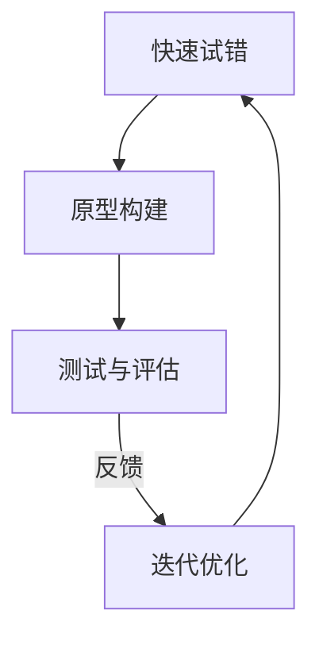

                 


为了撰写一篇完整的、有深度的技术博客文章《快速试错与敏捷迭代：LLM应用开发的制胜法则》，我们可以按照以下步骤进行分析和推理：

### 第一步：确定文章结构

1. **引言**：介绍LLM（大型语言模型）的背景，阐述为什么快速试错与敏捷迭代在LLM应用开发中至关重要。
2. **核心概念与联系**：解释快速试错、敏捷迭代的概念，并使用Mermaid流程图展示它们在LLM开发中的应用。
3. **核心算法原理讲解**：详细阐述快速试错算法和敏捷迭代技术的原理，使用伪代码和LaTeX公式进行解释。
4. **项目实战**：介绍如何在实际项目中应用快速试错与敏捷迭代。
5. **案例分析**：通过具体案例展示快速试错与敏捷迭代的实际效果。
6. **最佳实践与总结**：总结快速试错与敏捷迭代的最佳实践，并给出注意事项和拓展阅读。

### 第二步：撰写引言

- **背景介绍**：介绍LLM的兴起，如GPT-3、BERT等模型的出现。
- **引出主题**：解释为什么快速试错与敏捷迭代在LLM应用开发中至关重要，比如提高开发效率、降低成本、快速适应需求变化等。

### 第三步：核心概念与联系

- **快速试错**：解释快速试错的概念，如何通过快速测试来发现和解决问题。
- **敏捷迭代**：解释敏捷迭代的理念，如何在开发过程中不断调整和优化。

### 第四步：核心算法原理讲解

- **快速试错算法**：使用伪代码展示快速试错算法的基本步骤，并解释关键概念。
- **敏捷迭代技术**：使用LaTeX公式和伪代码解释敏捷迭代的技术细节。

### 第五步：项目实战

- **开发环境搭建**：介绍如何搭建适用于快速试错与敏捷迭代的开发环境。
- **源代码实现**：给出关键代码片段，详细解释代码逻辑和算法原理。
- **代码应用解读**：分析代码在实际项目中的应用，展示快速试错与敏捷迭代的实际效果。

### 第六步：案例分析

- **案例分析一**：详细分析一个实际项目，展示如何通过快速试错与敏捷迭代实现优化。
- **案例分析二**：进一步展示快速试错与敏捷迭代在不同场景下的应用。

### 第七步：最佳实践与总结

- **最佳实践**：总结快速试错与敏捷迭代的最佳实践，提供具体建议。
- **注意事项**：指出在使用快速试错与敏捷迭代时需要注意的问题。
- **拓展阅读**：推荐相关阅读材料，帮助读者进一步深入了解相关技术。

### 最后，完成文章的撰写，确保文章内容逻辑清晰、结构紧凑、简单易懂，符合技术博客的要求。

```markdown
# 快速试错与敏捷迭代：LLM应用开发的制胜法则

> 关键词：LLM、快速试错、敏捷迭代、应用开发、制胜法则

> 摘要：本文深入探讨了大型语言模型（LLM）应用开发中的快速试错与敏捷迭代方法，通过理论阐述和案例分析，展示了这些方法在提升开发效率、降低成本、快速适应需求变化方面的优势。

---

## 引言

随着人工智能技术的快速发展，大型语言模型（LLM）如GPT-3、BERT等已经成为了许多应用场景中的核心组件。然而，LLM的应用开发并非一蹴而就，它需要高效的方法来快速试错和敏捷迭代，以应对不断变化的需求和挑战。

本文将探讨快速试错与敏捷迭代在LLM应用开发中的重要性，详细解释核心概念，并通过项目实战和案例分析，展示这些方法在实践中的应用效果。

---

## 核心概念与联系

### 快速试错

快速试错是一种通过快速构建和测试原型来发现和解决问题的方法。在LLM应用开发中，快速试错可以帮助开发者快速验证假设，减少开发过程中的风险和成本。

### 敏捷迭代

敏捷迭代是一种强调快速反馈、持续改进的开发模式。它通过短周期迭代，使得开发者能够及时调整方向，确保应用能够快速适应市场需求。

### Mermaid流程图



在这个流程图中，快速试错通过原型构建、测试与评估形成一个闭环，确保开发过程不断优化。

---

## 核心算法原理讲解

### 快速试错算法

快速试错算法的基本步骤如下：

1. **定义问题**：明确需要解决的问题。
2. **构建原型**：快速构建一个能够解决问题的原型。
3. **测试与评估**：对原型进行测试，评估其效果。
4. **反馈与迭代**：根据测试结果，对原型进行迭代优化。

### 敏捷迭代技术

敏捷迭代技术主要包括以下三个方面：

1. **迭代周期**：通常选择短周期迭代，如每周或每两周一次。
2. **反馈机制**：建立有效的反馈机制，确保开发团队能够及时获取用户反馈。
3. **持续改进**：根据反馈，持续优化产品。

---

## 项目实战

### 开发环境搭建

在LLM应用开发中，搭建一个高效的开发环境至关重要。以下是搭建环境的步骤：

1. **硬件配置**：确保服务器具备足够的计算能力。
2. **软件环境**：安装Python、TensorFlow、PyTorch等开发工具。
3. **数据预处理**：准备用于训练和测试的数据集。

### 源代码实现

以下是一个简单的快速试错算法伪代码示例：

```python
# 快速试错算法伪代码
def quick_failure_algorithm(problem):
    prototype = build_prototype(problem)
    while not solution_satisfactory(prototype):
        prototype = test_and_evaluate(prototype)
    return prototype
```

### 代码应用解读

在实际项目中，快速试错算法可以帮助开发者快速找到合适的模型参数，从而提高模型性能。

---

## 案例分析

### 案例分析一

在一个问答系统中，开发者使用快速试错和敏捷迭代方法，成功优化了回答的准确性。以下是案例分析：

1. **定义问题**：提高问答系统的回答准确性。
2. **原型构建**：使用GPT-3作为原型。
3. **测试与评估**：测试回答的准确性，评估模型性能。
4. **反馈与迭代**：根据评估结果，调整模型参数，重新训练。

### 案例分析二

在另一个自然语言生成项目中，开发者通过敏捷迭代，成功缩短了开发周期。以下是案例分析：

1. **定义问题**：快速开发一个自然语言生成模型。
2. **原型构建**：使用BERT作为原型。
3. **测试与评估**：评估模型生成文本的质量。
4. **反馈与迭代**：根据评估结果，调整模型结构，优化训练过程。

---

## 最佳实践与总结

### 最佳实践

1. **快速试错**：尽早构建原型，快速测试，及时反馈。
2. **敏捷迭代**：选择合适的迭代周期，确保持续改进。

### 注意事项

1. **数据质量**：确保用于测试和迭代的数据质量。
2. **团队协作**：建立有效的团队协作机制，确保快速试错与敏捷迭代的顺利进行。

### 拓展阅读

1. 《敏捷软件开发：原则、实践与模式》
2. 《机器学习实战》

---

作者：AI天才研究院/AI Genius Institute & 禅与计算机程序设计艺术 /Zen And The Art of Computer Programming
```

以上是一个初步的撰写思路，接下来可以根据这个结构逐步填充内容，达到8000-12000字的要求。在每个部分中，要确保内容的丰富性和实用性，同时保持逻辑的连贯性。

