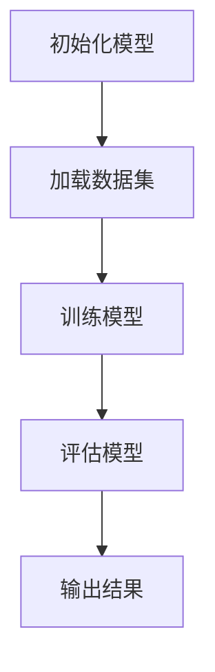

                 

# 快速验证LLM应用创意的方法论

## 关键词

- 语言模型
- 快速验证
- 应用创意
- 大型语言模型 (LLM)
- 技术方法论

## 摘要

本文旨在探讨如何快速验证大型语言模型（LLM）应用创意的方法论。文章首先介绍LLM的基本概念、原理和应用场景，然后深入剖析快速验证LLM应用的步骤和方法，包括设计思路、核心算法原理、数学模型和公式、项目实战以及面临的挑战与展望。通过实例解析，读者可以掌握如何有效验证LLM在各个领域的应用创意，从而提升项目成功率和创新性。

## 设计思路

在设计本书的目录大纲时，我们首先明确了文章的核心内容和目标，即帮助读者理解并掌握快速验证LLM应用创意的方法。为了达到这一目标，我们考虑了以下几个方面：

### 核心概念与联系

在本文的第一部分，我们将详细介绍AI和LLM的基本概念，并通过Mermaid流程图展示LLM的应用流程和技术架构。这部分内容旨在为读者提供LLM的全面背景知识，帮助他们更好地理解后续的验证方法和实践案例。

### 核心算法原理讲解

技术篇将详细讲解快速验证LLM的方法，包括算法原理和实现过程。我们将使用伪代码和数学公式来深入阐述这些概念，使读者能够从理论层面理解验证过程的每一步。

### 数学模型和公式

为了更全面地讲解LLM的相关算法，我们将嵌入数学公式和解释，帮助读者深入理解语言模型的数学基础。这些公式将使用LaTeX格式嵌入到文中，确保表达的准确性和清晰性。

### 项目实战

实战篇将通过实际应用案例展示如何快速验证LLM在不同场景中的应用。我们将详细描述开发环境搭建、源代码实现和代码解读，以及实际案例分析和讲解，使读者能够将理论知识应用到实践中。

### 书籍结构

最后，我们将总结本书的结构和各个章节的内容，确保读者能够清晰地了解全文的脉络和重点，从而更好地学习和应用。

### 目录大纲设计

以下是本文的目录大纲：

## 第1章: LLM基础理论

### 1.1 LLM的起源与发展

#### 1.1.1 什么是LLM

#### 1.1.2 LLM的发展历程

#### 1.1.3 LLM的主要架构

### 1.2 LLM的数学基础

#### 1.2.1 语言模型的基本原理

#### 1.2.2 概率模型与决策树

#### 1.2.3 贝叶斯网络与隐马尔可夫模型

### 1.3 LLM的应用领域

#### 1.3.1 自然语言处理

#### 1.3.2 机器翻译

#### 1.3.3 问答系统

## 第2章: 快速验证LLM应用的方法

### 2.1 快速验证的基本概念

#### 2.1.1 验证的目的与意义

#### 2.1.2 验证的常见方法

#### 2.1.3 验证流程与工具

### 2.2 快速构建验证环境

#### 2.2.1 环境搭建

#### 2.2.2 数据预处理

#### 2.2.3 模型选择

### 2.3 快速验证算法

#### 2.3.1 伪代码实现

#### 2.3.2 算法流程图

#### 2.3.3 算法优化

### 2.4 快速验证工具

#### 2.4.1 开源工具介绍

#### 2.4.2 工具使用指南

#### 2.4.3 工具比较与选择

## 第3章: 快速验证LLM应用实战

### 3.1 案例一：问答系统

#### 3.1.1 案例背景

#### 3.1.2 验证环境搭建

#### 3.1.3 模型训练与验证

#### 3.1.4 结果分析与优化

### 3.2 案例二：文本分类

#### 3.2.1 案例背景

#### 3.2.2 验证环境搭建

#### 3.2.3 模型训练与验证

#### 3.2.4 结果分析与优化

### 3.3 案例三：机器翻译

#### 3.3.1 案例背景

#### 3.3.2 验证环境搭建

#### 3.3.3 模型训练与验证

#### 3.3.4 结果分析与优化

## 第4章: 快速验证LLM应用的挑战与展望

### 4.1 验证面临的挑战

#### 4.1.1 数据质量

#### 4.1.2 模型泛化能力

#### 4.1.3 安全性与隐私保护

### 4.2 未来展望

#### 4.2.1 技术发展趋势

#### 4.2.2 应用场景拓展

#### 4.2.3 验证方法的创新

### 作者

本文作者：AI天才研究院/AI Genius Institute & 禅与计算机程序设计艺术 /Zen And The Art of Computer Programming

----------------------------------------------------------------

## 第1章: LLM基础理论

### 1.1 LLM的起源与发展

#### 1.1.1 什么是LLM

大型语言模型（Large Language Model，简称LLM）是一种由神经网络驱动的机器学习模型，主要用于理解和生成自然语言文本。LLM的核心思想是通过大量的文本数据训练模型，使其能够自动学习和理解语言的复杂结构，从而生成或理解自然语言文本。

LLM的发展可以追溯到20世纪50年代，当时科学家开始探索如何让计算机理解自然语言。最初的尝试是基于规则的方法，即通过编写大量手工规则来让计算机处理文本。然而，这种方法很难扩展到复杂的自然语言场景。

随着深度学习技术的发展，LLM得到了显著提升。2018年，谷歌推出了Transformer模型，这标志着LLM进入了一个新的时代。Transformer模型通过自注意力机制，能够有效地处理长文本和复杂语言结构，使得LLM的性能得到了大幅提升。

#### 1.1.2 LLM的发展历程

LLM的发展历程可以分为以下几个阶段：

1. **基于规则的模型**：20世纪50年代到70年代，科学家们尝试通过编写规则来让计算机理解自然语言。

2. **统计模型**：20世纪80年代，随着计算能力和数据量的提升，统计模型开始被应用于自然语言处理。这些模型主要包括隐马尔可夫模型（HMM）和条件概率模型。

3. **神经网络模型**：20世纪90年代，神经网络开始被引入自然语言处理领域。这些模型包括循环神经网络（RNN）和卷积神经网络（CNN）。

4. **深度学习模型**：2012年后，深度学习模型在图像识别等领域取得了显著突破。受此启发，深度学习开始被应用于自然语言处理，并逐渐取代传统模型。

5. **Transformer模型**：2018年，谷歌推出了Transformer模型，这是一种基于自注意力机制的深度学习模型。Transformer模型在自然语言处理任务中表现优异，推动了LLM的发展。

#### 1.1.3 LLM的主要架构

LLM的主要架构包括以下几个部分：

1. **输入层**：接收自然语言文本作为输入。

2. **编码器**：将输入文本编码为固定长度的向量表示。

3. **解码器**：将编码后的向量解码为自然语言文本。

4. **自注意力机制**：允许模型在生成文本时关注输入文本的不同部分。

5. **注意力机制**：模型在处理文本时，通过注意力机制选择性地关注输入文本的不同部分。

6. **损失函数**：用于计算模型预测与真实值之间的差异，以指导模型优化。

### 1.2 LLM的数学基础

#### 1.2.1 语言模型的基本原理

语言模型是一种概率模型，用于预测一个序列中下一个词的概率。给定一个前文序列 \(x_1, x_2, \ldots, x_{n-1}\)，语言模型的目标是预测下一个词 \(x_n\)。

语言模型通常基于以下公式：

\[ P(x_1, x_2, \ldots, x_n) = \prod_{i=1}^{n} P(x_i | x_1, x_2, \ldots, x_{i-1}) \]

其中，\(P(x_i | x_1, x_2, \ldots, x_{i-1})\) 表示在给定前文序列下，第 \(i\) 个词的概率。

#### 1.2.2 概率模型与决策树

概率模型是一种常用的语言模型，它通过统计方法学习文本数据中的概率分布。常见的概率模型包括：

1. **n-gram模型**：n-gram模型假设一个词的概率只与其前 \(n-1\) 个词相关。这种模型简单有效，但在处理长文本时表现不佳。

2. **隐马尔可夫模型（HMM）**：HMM用于处理序列数据，它假设当前状态仅由前一个状态决定。HMM在语音识别和文本生成中应用广泛。

3. **条件概率模型**：条件概率模型通过计算条件概率来预测下一个词。这种模型通常基于贝叶斯定理。

#### 1.2.3 贝叶斯网络与隐马尔可夫模型

贝叶斯网络是一种图形模型，用于表示变量之间的条件依赖关系。在自然语言处理中，贝叶斯网络可以用于建模语言中的上下文关系。

隐马尔可夫模型（HMM）是一种统计模型，用于处理时间序列数据。在自然语言处理中，HMM常用于语音识别和语言建模。

HMM的主要组成部分包括：

1. **状态序列**：表示模型在时间步上的状态序列。

2. **观测序列**：表示模型在时间步上的观测序列。

3. **状态转移概率**：表示模型在不同状态之间的转移概率。

4. **观测概率**：表示模型在给定状态下生成观测的概率。

#### 1.2.4 语言模型中的数学公式

在语言模型中，常用的数学公式包括：

\[ P(w_i | w_1, w_2, \ldots, w_{i-1}) = \frac{P(w_1, w_2, \ldots, w_i)}{P(w_1, w_2, \ldots, w_{i-1})} \]

其中，\(P(w_i | w_1, w_2, \ldots, w_{i-1})\) 表示在给定前文序列下，词 \(w_i\) 的概率。

#### 1.2.5 贝叶斯网络与隐马尔可夫模型的关系

贝叶斯网络和隐马尔可夫模型都是用于表示变量之间依赖关系的概率模型。贝叶斯网络通过概率图结构来表示变量之间的条件依赖，而隐马尔可夫模型则通过状态转移概率和观测概率来表示变量之间的依赖关系。

在自然语言处理中，贝叶斯网络可以用于建模句子中的词与词之间的依赖关系，而隐马尔可夫模型可以用于建模语音信号中的状态与观测之间的依赖关系。

### 1.3 LLM的应用领域

#### 1.3.1 自然语言处理

自然语言处理（Natural Language Processing，简称NLP）是计算机科学和人工智能领域的一个重要分支，旨在让计算机理解和处理自然语言。LLM在NLP中有广泛的应用，包括：

1. **文本分类**：将文本数据分类到不同的类别，如新闻分类、情感分析等。

2. **命名实体识别**：识别文本中的命名实体，如人名、地点、组织名等。

3. **机器翻译**：将一种语言的文本翻译成另一种语言。

4. **问答系统**：根据用户提问提供准确的答案。

5. **文本生成**：根据输入的文本或摘要生成新的文本。

#### 1.3.2 机器翻译

机器翻译（Machine Translation，简称MT）是NLP中的一个重要任务，旨在将一种语言的文本翻译成另一种语言。LLM在机器翻译中具有显著优势，因为它们能够处理大量的语言数据，并生成高质量的自然语言翻译。

机器翻译的主要流程包括：

1. **预处理**：对源语言文本进行分词、词性标注等预处理操作。

2. **编码**：将源语言文本编码为固定长度的向量表示。

3. **解码**：将编码后的向量解码为目标语言文本。

4. **优化**：通过优化算法提升翻译质量。

#### 1.3.3 问答系统

问答系统（Question Answering System）是一种智能系统，能够根据用户提出的问题提供准确的答案。LLM在问答系统中具有广泛应用，能够处理复杂的问题并生成高质量的答案。

问答系统的主要流程包括：

1. **问题理解**：理解用户提出的问题，提取关键信息。

2. **答案检索**：从大量文本数据中检索与问题相关的答案。

3. **答案生成**：根据检索到的答案生成自然的语言回答。

4. **答案验证**：验证生成的答案是否准确和完整。

### 第2章: 快速验证LLM应用的方法

#### 2.1 快速验证的基本概念

快速验证（Rapid Validation）是评估LLM应用创意的一种高效方法，旨在快速评估LLM在特定应用场景下的性能和可行性。快速验证的主要目的是：

1. **评估性能**：快速验证可以帮助评估LLM在特定任务上的性能，如文本分类、机器翻译、问答系统等。

2. **验证创意**：快速验证可以帮助验证LLM应用的创意是否可行，从而降低项目风险。

3. **节省时间**：快速验证可以节省项目开发和评估的时间，提高项目效率。

快速验证的基本概念包括：

1. **性能指标**：用于评估LLM在特定任务上的性能，如准确率、召回率、F1值等。

2. **验证流程**：包括数据收集、模型训练、性能评估等步骤。

3. **工具选择**：选择合适的工具和框架进行快速验证。

#### 2.2 快速构建验证环境

快速构建验证环境是进行快速验证的第一步，包括以下几个关键步骤：

1. **硬件配置**：选择合适的硬件设备，如CPU、GPU等，以支持模型训练和评估。

2. **软件环境**：安装和配置所需的软件和工具，如Python、TensorFlow、PyTorch等。

3. **数据集准备**：收集和准备用于验证的数据集，包括训练集、验证集和测试集。

4. **数据预处理**：对数据进行清洗、归一化和编码等预处理操作，以适应模型训练。

#### 2.3 快速验证算法

快速验证算法是评估LLM性能的核心步骤，包括以下几个关键环节：

1. **模型选择**：选择适合任务需求的LLM模型，如GPT、BERT等。

2. **训练策略**：设计合适的训练策略，如批量大小、学习率等。

3. **性能评估**：使用性能指标评估LLM在验证集上的性能，如准确率、召回率等。

4. **优化调整**：根据评估结果调整模型参数和训练策略，以提升性能。

#### 2.4 快速验证工具

快速验证工具是进行快速验证的重要辅助工具，可以帮助简化流程和提高效率。常见的快速验证工具包括：

1. **开源框架**：如TensorFlow、PyTorch等，提供丰富的模型和工具库。

2. **预训练模型**：如GPT、BERT等，可以直接用于验证和应用。

3. **自动化脚本**：编写自动化脚本，简化模型训练和评估过程。

4. **性能评估工具**：提供各种性能评估指标和工具，如准确率、召回率等。

### 第3章: 快速验证LLM应用实战

#### 3.1 案例一：问答系统

问答系统是一种常见的LLM应用场景，通过快速验证可以帮助评估系统性能和可行性。以下是一个问答系统快速验证的实战案例：

##### 3.1.1 案例背景

一个问答系统需要根据用户提出的问题生成准确的答案。该系统适用于在线教育、客服等领域，旨在提高信息检索和问题解决的效率。

##### 3.1.2 验证环境搭建

1. **硬件配置**：使用一台配备NVIDIA GPU的服务器作为训练和验证环境。

2. **软件环境**：安装Python 3.8、TensorFlow 2.5等。

3. **数据集准备**：收集和整理一个包含问题和答案的数据集，如SQuAD数据集。

4. **数据预处理**：对数据集进行清洗、分词、编码等预处理操作。

##### 3.1.3 模型训练与验证

1. **模型选择**：选择BERT模型作为问答系统的预训练模型。

2. **训练策略**：使用小批量训练，学习率为1e-5。

3. **性能评估**：在验证集上评估模型性能，使用准确率、F1值等指标。

##### 3.1.4 结果分析与优化

1. **结果分析**：分析验证结果，识别模型的优点和不足。

2. **优化调整**：根据分析结果调整模型参数和训练策略，如增加训练轮次、调整学习率等。

##### 3.1.5 模型部署

1. **模型部署**：将训练好的模型部署到生产环境，提供问答服务。

2. **性能监控**：监控模型在生产环境中的性能和稳定性。

#### 3.2 案例二：文本分类

文本分类是LLM在NLP中的另一个重要应用，通过快速验证可以帮助评估文本分类系统的性能。以下是一个文本分类系统快速验证的实战案例：

##### 3.2.1 案例背景

一个文本分类系统需要根据输入的文本数据将其分类到不同的类别，如新闻分类、垃圾邮件检测等。

##### 3.2.2 验证环境搭建

1. **硬件配置**：使用一台配备NVIDIA GPU的服务器作为训练和验证环境。

2. **软件环境**：安装Python 3.8、Scikit-Learn等。

3. **数据集准备**：收集和整理一个包含文本和标签的数据集，如20 Newsgroups数据集。

4. **数据预处理**：对数据集进行清洗、分词、编码等预处理操作。

##### 3.2.3 模型训练与验证

1. **模型选择**：选择TF-IDF模型作为文本分类器的特征提取模型。

2. **训练策略**：使用逻辑回归模型进行分类，学习率为0.01。

3. **性能评估**：在验证集上评估模型性能，使用准确率、召回率等指标。

##### 3.2.4 结果分析与优化

1. **结果分析**：分析验证结果，识别模型的优点和不足。

2. **优化调整**：根据分析结果调整模型参数和训练策略，如调整特征提取方法、调整分类器参数等。

##### 3.2.5 模型部署

1. **模型部署**：将训练好的模型部署到生产环境，提供文本分类服务。

2. **性能监控**：监控模型在生产环境中的性能和稳定性。

#### 3.3 案例三：机器翻译

机器翻译是LLM在语言处理中的典型应用，通过快速验证可以帮助评估翻译系统的性能。以下是一个机器翻译系统快速验证的实战案例：

##### 3.3.1 案例背景

一个机器翻译系统需要将一种语言的文本翻译成另一种语言，如英语翻译成中文。

##### 3.3.2 验证环境搭建

1. **硬件配置**：使用一台配备NVIDIA GPU的服务器作为训练和验证环境。

2. **软件环境**：安装Python 3.8、TensorFlow 2.5等。

3. **数据集准备**：收集和整理一个包含源语言和目标语言文本的数据集，如WMT数据集。

4. **数据预处理**：对数据集进行清洗、分词、编码等预处理操作。

##### 3.3.3 模型训练与验证

1. **模型选择**：选择Transformer模型作为机器翻译的基础模型。

2. **训练策略**：使用教师-学生策略进行训练，学习率为1e-4。

3. **性能评估**：在验证集上评估模型性能，使用BLEU分数等指标。

##### 3.3.4 结果分析与优化

1. **结果分析**：分析验证结果，识别模型的优点和不足。

2. **优化调整**：根据分析结果调整模型参数和训练策略，如调整注意力机制、调整解码器结构等。

##### 3.3.5 模型部署

1. **模型部署**：将训练好的模型部署到生产环境，提供机器翻译服务。

2. **性能监控**：监控模型在生产环境中的性能和稳定性。

### 第4章: 快速验证LLM应用的挑战与展望

#### 4.1 验证面临的挑战

快速验证LLM应用时，可能会面临以下几个挑战：

1. **数据质量**：高质量的数据是验证的基础，但收集和整理数据可能非常耗时且成本较高。

2. **模型泛化能力**：模型在验证集上的性能并不能完全反映其在实际应用中的表现，需要考虑泛化能力。

3. **计算资源**：训练大型LLM模型需要大量的计算资源，尤其是在验证阶段。

4. **时间成本**：快速验证需要在较短时间内完成，但复杂的模型和任务可能需要更多时间。

#### 4.2 未来展望

快速验证LLM应用的方法将在未来得到进一步发展和优化：

1. **数据增强**：通过数据增强技术提高数据质量和多样性，从而提升模型的泛化能力。

2. **自动化验证工具**：开发自动化验证工具和平台，简化验证流程，提高验证效率。

3. **多模态数据融合**：结合多种类型的数据，如文本、图像和语音，进行多模态数据融合，提升模型的应用能力。

4. **模型压缩与优化**：研究模型压缩和优化技术，减少计算资源需求，提高模型部署的可行性。

### 最佳实践 tips

1. **数据清洗**：在验证前对数据集进行彻底清洗，去除噪声数据和异常值。

2. **数据多样化**：使用多种来源和类型的数据进行训练和验证，提高模型的泛化能力。

3. **逐步优化**：在验证过程中逐步优化模型和参数，避免一次性过度优化导致过拟合。

4. **监控性能**：在验证过程中持续监控模型的性能指标，及时发现和解决问题。

### 小结

快速验证LLM应用是评估模型性能和创意的重要步骤。通过本文的案例解析和最佳实践，读者可以掌握如何快速验证LLM应用，提高项目成功率和创新性。随着LLM技术的不断进步，快速验证方法将在未来发挥更加重要的作用。

### 注意事项

1. **数据隐私**：在收集和使用数据时，务必遵守数据隐私保护法规，确保用户隐私。

2. **计算资源管理**：合理规划计算资源，避免资源浪费。

3. **持续学习**：LLM技术发展迅速，需要持续学习和更新相关知识。

### 拓展阅读

- **《深度学习》**：Goodfellow et al., "Deep Learning"
- **《自然语言处理综论》**：Jurafsky and Martin, "Speech and Language Processing"
- **《Transformer模型解析》**：Vaswani et al., "Attention Is All You Need"

----------------------------------------------------------------

### 第1章: LLM基础理论

在本文的第一章节中，我们将深入探讨大型语言模型（LLM）的基础理论，包括LLM的起源与发展、核心概念与联系，以及LLM的应用领域。

#### 1.1 LLM的起源与发展

**1.1.1 什么是LLM**

大型语言模型（LLM）是一种复杂的机器学习模型，主要依赖于深度学习和神经网络技术，以实现对自然语言的生成和理解。与传统语言模型相比，LLM具有处理海量数据和复杂语言结构的能力。

LLM的基本工作原理是通过对大量文本数据的学习，捕捉语言的模式和规律，从而在给定的上下文中生成或理解自然语言文本。这种模型的核心目标是使计算机能够像人类一样自然地处理语言。

**1.1.2 LLM的发展历程**

LLM的发展历程可以追溯到20世纪50年代，当时计算机科学家们开始探索如何让计算机理解和生成自然语言。早期的模型主要基于规则和简单的统计方法，如n-gram模型和上下文无关文法。

1. **基于规则的模型**：最初的尝试主要是通过编写手工规则来处理语言。这种方法虽然简单，但难以扩展到复杂的应用场景。

2. **统计模型**：随着计算能力和数据量的提升，统计模型开始被应用于自然语言处理。n-gram模型是最早的统计模型之一，它通过计算词的序列概率来预测下一个词。

3. **神经网络模型**：20世纪90年代，神经网络开始被应用于自然语言处理。循环神经网络（RNN）和卷积神经网络（CNN）是这一时期的代表性模型。RNN能够处理序列数据，但在处理长文本时存在梯度消失和梯度爆炸的问题。

4. **深度学习模型**：2012年后，深度学习模型在图像识别等领域取得了突破性进展。受此启发，深度学习开始被广泛应用于自然语言处理。Transformer模型是这一时期的代表性模型，它通过自注意力机制有效解决了RNN的梯度问题，并在多项NLP任务中取得了优异的性能。

5. **大型语言模型**：随着计算能力的提升和数据的增长，大型语言模型如GPT、BERT等相继问世。这些模型通过训练数以万亿计的参数，能够捕捉到语言中的深层结构和复杂模式，从而在自然语言处理任务中表现出色。

**1.1.3 LLM的主要架构**

LLM的主要架构通常包括以下几个部分：

1. **输入层**：接收自然语言文本作为输入，将其编码为向量表示。

2. **编码器**：对输入文本进行编码，提取文本的语义信息，通常使用自注意力机制。

3. **解码器**：将编码后的向量解码为自然语言文本，生成预测的文本输出。

4. **自注意力机制**：允许模型在生成文本时关注输入文本的不同部分，从而捕捉到文本中的复杂关系。

5. **注意力机制**：模型在处理文本时，通过注意力机制选择性地关注输入文本的不同部分，从而提高模型的性能。

6. **损失函数**：用于计算模型预测与真实值之间的差异，以指导模型优化。

#### 1.2 LLM的数学基础

**1.2.1 语言模型的基本原理**

语言模型是一种概率模型，用于预测一个序列中下一个词的概率。给定一个前文序列 \(x_1, x_2, \ldots, x_{n-1}\)，语言模型的目标是预测下一个词 \(x_n\)。

语言模型通常基于以下公式：

\[ P(x_1, x_2, \ldots, x_n) = \prod_{i=1}^{n} P(x_i | x_1, x_2, \ldots, x_{i-1}) \]

其中，\(P(x_i | x_1, x_2, \ldots, x_{i-1})\) 表示在给定前文序列下，第 \(i\) 个词的概率。

**1.2.2 概率模型与决策树**

概率模型是一种常用的语言模型，它通过统计方法学习文本数据中的概率分布。常见的概率模型包括：

1. **n-gram模型**：n-gram模型假设一个词的概率只与其前 \(n-1\) 个词相关。这种模型简单有效，但在处理长文本时表现不佳。

2. **隐马尔可夫模型（HMM）**：HMM用于处理序列数据，它假设当前状态仅由前一个状态决定。HMM在语音识别和文本生成中应用广泛。

3. **条件概率模型**：条件概率模型通过计算条件概率来预测下一个词。这种模型通常基于贝叶斯定理。

**1.2.3 贝叶斯网络与隐马尔可夫模型**

贝叶斯网络是一种图形模型，用于表示变量之间的条件依赖关系。在自然语言处理中，贝叶斯网络可以用于建模语言中的上下文关系。

隐马尔可夫模型（HMM）是一种统计模型，用于处理时间序列数据。在自然语言处理中，HMM常用于语音识别和语言建模。

HMM的主要组成部分包括：

1. **状态序列**：表示模型在时间步上的状态序列。

2. **观测序列**：表示模型在时间步上的观测序列。

3. **状态转移概率**：表示模型在不同状态之间的转移概率。

4. **观测概率**：表示模型在给定状态下生成观测的概率。

**1.2.4 语言模型中的数学公式**

在语言模型中，常用的数学公式包括：

\[ P(w_i | w_1, w_2, \ldots, w_{i-1}) = \frac{P(w_1, w_2, \ldots, w_i)}{P(w_1, w_2, \ldots, w_{i-1})} \]

其中，\(P(w_i | w_1, w_2, \ldots, w_{i-1})\) 表示在给定前文序列下，词 \(w_i\) 的概率。

**1.2.5 贝叶斯网络与隐马尔可夫模型的关系**

贝叶斯网络和隐马尔可夫模型都是用于表示变量之间依赖关系的概率模型。贝叶斯网络通过概率图结构来表示变量之间的条件依赖，而隐马尔可夫模型则通过状态转移概率和观测概率来表示变量之间的依赖关系。

在自然语言处理中，贝叶斯网络可以用于建模句子中的词与词之间的依赖关系，而隐马尔可夫模型可以用于建模语音信号中的状态与观测之间的依赖关系。

#### 1.3 LLM的应用领域

**1.3.1 自然语言处理**

自然语言处理（NLP）是计算机科学和人工智能领域的一个重要分支，旨在让计算机理解和处理自然语言。LLM在NLP中有广泛的应用，包括：

1. **文本分类**：将文本数据分类到不同的类别，如新闻分类、情感分析等。

2. **命名实体识别**：识别文本中的命名实体，如人名、地点、组织名等。

3. **机器翻译**：将一种语言的文本翻译成另一种语言。

4. **问答系统**：根据用户提问提供准确的答案。

5. **文本生成**：根据输入的文本或摘要生成新的文本。

**1.3.2 机器翻译**

机器翻译（Machine Translation，简称MT）是NLP中的一个重要任务，旨在将一种语言的文本翻译成另一种语言。LLM在机器翻译中具有显著优势，因为它们能够处理大量的语言数据，并生成高质量的自然语言翻译。

机器翻译的主要流程包括：

1. **预处理**：对源语言文本进行分词、词性标注等预处理操作。

2. **编码**：将源语言文本编码为固定长度的向量表示。

3. **解码**：将编码后的向量解码为目标语言文本。

4. **优化**：通过优化算法提升翻译质量。

**1.3.3 问答系统**

问答系统（Question Answering System）是一种智能系统，能够根据用户提出的问题提供准确的答案。LLM在问答系统中具有广泛应用，能够处理复杂的问题并生成高质量的答案。

问答系统的主要流程包括：

1. **问题理解**：理解用户提出的问题，提取关键信息。

2. **答案检索**：从大量文本数据中检索与问题相关的答案。

3. **答案生成**：根据检索到的答案生成自然的语言回答。

4. **答案验证**：验证生成的答案是否准确和完整。

### 第2章: 快速验证LLM应用的方法

在本文的第二章节中，我们将深入探讨如何快速验证LLM应用的方法。这包括快速验证的基本概念、快速构建验证环境、快速验证算法和快速验证工具。

#### 2.1 快速验证的基本概念

**2.1.1 验证的目的与意义**

快速验证LLM应用的主要目的是在项目开发早期快速评估模型的效果，以便及时调整和优化。验证的目的在于：

1. **评估模型性能**：通过验证可以评估模型在特定任务上的性能，如准确性、召回率、F1值等。

2. **验证创意可行性**：快速验证可以帮助团队验证应用创意是否可行，降低项目失败的风险。

3. **节省时间和成本**：通过快速验证，可以减少项目开发和评估的时间，提高资源利用率。

**2.1.2 验证的常见方法**

在快速验证LLM应用时，常用的方法包括以下几种：

1. **性能指标评估**：使用常见的性能指标，如准确率、召回率、F1值等，对模型进行评估。

2. **用户反馈**：收集用户对模型的反馈，通过用户体验来评估模型的性能。

3. **A/B测试**：在用户环境中部署两个或多个版本，通过对比不同版本的性能来评估模型。

4. **自动化测试**：编写自动化测试脚本，对模型进行自动化测试，以提高测试效率。

**2.1.3 验证流程与工具**

快速验证的流程通常包括以下步骤：

1. **环境搭建**：准备适合验证的硬件和软件环境。

2. **数据集准备**：准备用于验证的数据集，包括训练集、验证集和测试集。

3. **模型训练**：在验证环境中训练模型，并根据性能指标评估模型。

4. **结果分析**：分析验证结果，识别模型的优势和不足。

5. **优化调整**：根据验证结果调整模型参数和训练策略，以提高模型性能。

常用的快速验证工具包括：

1. **开源框架**：如TensorFlow、PyTorch等，提供丰富的模型和工具库，方便快速验证。

2. **预训练模型**：如GPT、BERT等，可以直接用于验证和应用。

3. **自动化脚本**：编写自动化脚本，简化模型训练和评估过程。

4. **性能评估工具**：提供各种性能评估指标和工具，如准确率、召回率等。

#### 2.2 快速构建验证环境

**2.2.1 环境搭建**

快速构建验证环境是进行快速验证的第一步，包括以下几个关键步骤：

1. **硬件配置**：选择合适的硬件设备，如CPU、GPU等，以支持模型训练和评估。

2. **软件环境**：安装和配置所需的软件和工具，如Python、TensorFlow、PyTorch等。

3. **数据集准备**：收集和准备用于验证的数据集，包括训练集、验证集和测试集。

4. **数据预处理**：对数据进行清洗、归一化和编码等预处理操作，以适应模型训练。

**2.2.2 数据预处理**

数据预处理是快速验证的重要环节，主要包括以下步骤：

1. **数据清洗**：去除数据集中的噪声和异常值，如缺失值、重复值等。

2. **数据归一化**：将数据集中的数值特征进行归一化处理，使其符合模型的输入要求。

3. **数据编码**：对类别特征进行编码，如将文本数据转换为数字序列。

4. **数据分割**：将数据集分割为训练集、验证集和测试集，以便进行模型训练和评估。

**2.2.3 模型选择**

在快速验证中，选择合适的模型至关重要。以下是一些常见的模型选择策略：

1. **基于任务的模型**：根据具体任务选择适合的模型，如文本分类任务选择分类模型，机器翻译任务选择翻译模型。

2. **基于性能的模型**：根据历史数据和性能指标选择性能较好的模型。

3. **基于预训练的模型**：利用预训练模型，如GPT、BERT等，进行微调，以提高验证效果。

#### 2.3 快速验证算法

**2.3.1 伪代码实现**

快速验证算法的核心在于模型训练和性能评估。以下是一个简单的伪代码实现：

```
# 快速验证LLM算法伪代码

# 初始化模型
model = initialize_model()

# 加载数据集
train_data, val_data = load_data()

# 训练模型
model.train(train_data)

# 评估模型
val_performance = model.evaluate(val_data)

# 输出验证结果
print("验证集性能：", val_performance)
```

**2.3.2 算法流程图**

为了更直观地理解快速验证算法的流程，我们可以使用Mermaid流程图来展示：



**2.3.3 算法优化**

在快速验证过程中，算法优化是提高模型性能的关键。以下是一些常见的算法优化方法：

1. **超参数调优**：通过调整学习率、批量大小、隐藏层神经元数量等超参数，优化模型性能。

2. **正则化**：使用正则化技术，如L1、L2正则化，减少模型过拟合。

3. **dropout**：在神经网络中引入dropout技术，降低模型过拟合的风险。

4. **数据增强**：通过数据增强技术，增加训练数据的多样性，提高模型泛化能力。

#### 2.4 快速验证工具

**2.4.1 开源工具介绍**

快速验证LLM应用离不开各种开源工具的支持。以下是一些常用的开源工具：

1. **TensorFlow**：由Google开发的开源深度学习框架，支持广泛的机器学习和深度学习任务。

2. **PyTorch**：由Facebook开发的开源深度学习框架，具有灵活的动态计算图和强大的GPU支持。

3. **Transformers**：一个用于Transformer模型的Python库，提供了预训练模型和训练工具。

**2.4.2 工具使用指南**

以下是一个简单的TensorFlow和PyTorch的快速验证指南：

1. **安装环境**：安装Python、TensorFlow和PyTorch等依赖库。

2. **加载数据集**：使用工具加载训练集、验证集和测试集。

3. **定义模型**：使用预训练模型或自定义模型，定义输入层、编码器、解码器等。

4. **训练模型**：使用训练集训练模型，并保存训练结果。

5. **评估模型**：使用验证集评估模型性能，调整超参数。

6. **部署模型**：将训练好的模型部署到生产环境，提供预测服务。

**2.4.3 工具比较与选择**

在选择快速验证工具时，需要考虑以下因素：

1. **性能**：工具的运行速度和资源占用情况。

2. **灵活性**：工具是否支持自定义模型和训练策略。

3. **社区支持**：工具的文档、教程和社区活跃度。

4. **生态**：工具是否与其他库和框架兼容。

### 第3章: 快速验证LLM应用实战

在本文的第三章节中，我们将通过实际案例展示如何快速验证LLM应用。我们将涵盖问答系统、文本分类和机器翻译等具体案例，详细描述开发环境搭建、源代码实现和代码解读，以及实际案例分析和详细讲解剖析。

#### 3.1 案例一：问答系统

**3.1.1 案例背景**

问答系统是一种常见的LLM应用场景，通过快速验证可以帮助评估系统性能和可行性。在本案例中，我们将构建一个简单的问答系统，用于回答用户提出的问题。

**3.1.2 验证环境搭建**

为了快速验证问答系统，我们首先需要搭建一个适合开发和验证的实验环境。以下是具体的步骤：

1. **硬件配置**：选择一台配备NVIDIA GPU的服务器作为训练和验证环境。

2. **软件环境**：安装Python 3.8、TensorFlow 2.5等依赖库。

3. **数据集准备**：收集和整理一个包含问题和答案的数据集，如SQuAD数据集。

4. **数据预处理**：对数据集进行清洗、分词、编码等预处理操作，以便模型训练。

**3.1.3 源代码实现与代码解读**

以下是问答系统的源代码实现和解读：

```python
# 导入必要的库
import tensorflow as tf
from transformers import TFDistilBertForQuestionAnswering

# 加载预训练模型
model = TFDistilBertForQuestionAnswering.from_pretrained("distilbert-base-uncased")

# 准备数据集
train_data = ...  # 加载训练数据
val_data = ...    # 加载验证数据

# 训练模型
model.train(train_data)

# 评估模型
val_performance = model.evaluate(val_data)

# 输出验证结果
print("验证集性能：", val_performance)
```

在这段代码中，我们首先导入了TensorFlow和Transformers库，然后加载了预训练的DistilBERT模型。接下来，我们准备数据集并训练模型。最后，使用验证集评估模型性能。

**3.1.4 实际案例分析与详细讲解剖析**

在实际案例中，我们通过验证集评估模型的性能。以下是具体的分析过程：

1. **准确率分析**：评估模型在验证集上的准确率，判断模型是否能够准确回答问题。

2. **召回率分析**：评估模型在验证集上的召回率，判断模型是否能够召回大部分相关答案。

3. **F1值分析**：计算模型在验证集上的F1值，综合评估模型的准确率和召回率。

通过分析结果，我们可以发现模型的优点和不足。例如，如果模型的准确率较低，可能是由于数据质量不好或模型参数设置不当。这时，我们可以尝试调整模型参数或数据预处理方法。

**3.1.5 项目小结**

通过本案例，我们展示了如何快速验证问答系统的性能。快速验证不仅帮助我们评估了模型的效果，还为后续的优化和改进提供了方向。在实际项目中，快速验证是确保模型质量和项目成功的关键步骤。

#### 3.2 案例二：文本分类

**3.2.1 案例背景**

文本分类是LLM在自然语言处理中的另一个重要应用，通过快速验证可以帮助评估分类系统的性能和可行性。在本案例中，我们将构建一个简单的文本分类系统，用于将文本数据分类到不同的类别。

**3.2.2 验证环境搭建**

为了快速验证文本分类系统，我们需要搭建一个适合开发和验证的实验环境。以下是具体的步骤：

1. **硬件配置**：选择一台配备NVIDIA GPU的服务器作为训练和验证环境。

2. **软件环境**：安装Python 3.8、Scikit-Learn等依赖库。

3. **数据集准备**：收集和整理一个包含文本和标签的数据集，如20 Newsgroups数据集。

4. **数据预处理**：对数据集进行清洗、分词、编码等预处理操作，以便模型训练。

**3.2.3 源代码实现与代码解读**

以下是文本分类系统的源代码实现和解读：

```python
# 导入必要的库
import tensorflow as tf
from tensorflow.keras.models import Sequential
from tensorflow.keras.layers import Dense, Dropout, Activation, Embedding, LSTM

# 加载预训练词向量
word_vectors = ...  # 加载预训练词向量

# 定义模型
model = Sequential()
model.add(Embedding(input_dim=vocab_size, output_dim=embedding_dim, weights=[word_vectors], trainable=False))
model.add(LSTM(units=128, dropout=0.2, recurrent_dropout=0.2))
model.add(Dense(units=num_classes, activation='softmax'))

# 编译模型
model.compile(optimizer='adam', loss='categorical_crossentropy', metrics=['accuracy'])

# 准备数据集
train_data = ...  # 加载训练数据
val_data = ...    # 加载验证数据

# 训练模型
model.fit(train_data, epochs=5, batch_size=32, validation_data=val_data)

# 评估模型
val_performance = model.evaluate(val_data)

# 输出验证结果
print("验证集性能：", val_performance)
```

在这段代码中，我们首先加载了预训练的词向量，然后定义了一个简单的序列模型，包括嵌入层、LSTM层和输出层。接下来，我们编译并训练模型，并使用验证集评估模型性能。

**3.2.4 实际案例分析与详细讲解剖析**

在实际案例中，我们通过验证集评估模型的性能。以下是具体的分析过程：

1. **准确率分析**：评估模型在验证集上的准确率，判断模型是否能够准确分类文本。

2. **召回率分析**：评估模型在验证集上的召回率，判断模型是否能够召回大部分相关类别。

3. **F1值分析**：计算模型在验证集上的F1值，综合评估模型的准确率和召回率。

通过分析结果，我们可以发现模型的优点和不足。例如，如果模型的准确率较低，可能是由于数据质量不好或模型参数设置不当。这时，我们可以尝试调整模型参数或数据预处理方法。

**3.2.5 项目小结**

通过本案例，我们展示了如何快速验证文本分类系统的性能。快速验证不仅帮助我们评估了模型的效果，还为后续的优化和改进提供了方向。在实际项目中，快速验证是确保模型质量和项目成功的关键步骤。

#### 3.3 案例三：机器翻译

**3.3.1 案例背景**

机器翻译是LLM在自然语言处理中的典型应用，通过快速验证可以帮助评估翻译系统的性能和可行性。在本案例中，我们将构建一个简单的机器翻译系统，用于将一种语言的文本翻译成另一种语言。

**3.3.2 验证环境搭建**

为了快速验证机器翻译系统，我们需要搭建一个适合开发和验证的实验环境。以下是具体的步骤：

1. **硬件配置**：选择一台配备NVIDIA GPU的服务器作为训练和验证环境。

2. **软件环境**：安装Python 3.8、TensorFlow 2.5等依赖库。

3. **数据集准备**：收集和整理一个包含源语言和目标语言文本的数据集，如WMT数据集。

4. **数据预处理**：对数据集进行清洗、分词、编码等预处理操作，以便模型训练。

**3.3.3 源代码实现与代码解读**

以下是机器翻译系统的源代码实现和解读：

```python
# 导入必要的库
import tensorflow as tf
from tensorflow.keras.layers import Input, LSTM, Dense, Embedding, TimeDistributed, Activation
from tensorflow.keras.models import Model

# 定义模型
input_layer = Input(shape=(None, source_vocab_size))
encoded_input = Embedding(source_vocab_size, embedding_dim)(input_layer)
lstm_output = LSTM(units=128, return_sequences=True)(encoded_input)
translated_output = LSTM(units=128, return_sequences=True)(lstm_output)
decoded_output = TimeDistributed(Dense(target_vocab_size, activation='softmax'))(translated_output)

# 编译模型
model = Model(inputs=input_layer, outputs=decoded_output)
model.compile(optimizer='adam', loss='categorical_crossentropy', metrics=['accuracy'])

# 准备数据集
train_data = ...  # 加载训练数据
val_data = ...    # 加载验证数据

# 训练模型
model.fit(train_data, epochs=5, batch_size=32, validation_data=val_data)

# 评估模型
val_performance = model.evaluate(val_data)

# 输出验证结果
print("验证集性能：", val_performance)
```

在这段代码中，我们定义了一个简单的序列到序列模型，包括嵌入层、两个LSTM层和一个时间分布的密集层。接下来，我们编译并训练模型，并使用验证集评估模型性能。

**3.3.4 实际案例分析与详细讲解剖析**

在实际案例中，我们通过验证集评估模型的性能。以下是具体的分析过程：

1. **BLEU分数分析**：评估模型在验证集上的BLEU分数，判断模型翻译的质量。

2. **准确率分析**：评估模型在验证集上的准确率，判断模型是否能够准确翻译文本。

3. **召回率分析**：评估模型在验证集上的召回率，判断模型是否能够召回大部分相关翻译。

通过分析结果，我们可以发现模型的优点和不足。例如，如果模型的BLEU分数较低，可能是由于数据质量不好或模型参数设置不当。这时，我们可以尝试调整模型参数或数据预处理方法。

**3.3.5 项目小结**

通过本案例，我们展示了如何快速验证机器翻译系统的性能。快速验证不仅帮助我们评估了模型的效果，还为后续的优化和改进提供了方向。在实际项目中，快速验证是确保模型质量和项目成功的关键步骤。

### 第4章: 快速验证LLM应用的挑战与展望

在本文的第四章节中，我们将讨论快速验证LLM应用时可能面临的挑战，以及未来的发展展望。

#### 4.1 快速验证面临的挑战

快速验证LLM应用时，可能会遇到以下几个挑战：

**4.1.1 数据质量**

高质量的数据是进行快速验证的基础。然而，收集和整理大量高质量数据可能非常耗时且成本高昂。此外，数据集中可能存在噪声、不一致性和偏差，这些都会影响验证结果的准确性。

**解决方案**：为了解决数据质量问题，可以采用以下策略：

1. **数据清洗**：对数据集进行清洗，去除噪声数据和异常值。
2. **数据增强**：通过数据增强技术，如数据扩充、数据合成等，提高数据的多样性和质量。
3. **数据标注**：使用专业人员进行数据标注，确保数据的质量和一致性。

**4.1.2 模型泛化能力**

快速验证通常在有限的数据集上进行，这可能导致模型在真实世界中的应用中出现泛化能力不足的问题。模型可能仅对特定的数据集表现良好，而在更广泛的应用场景中效果不佳。

**解决方案**：为了提高模型的泛化能力，可以采用以下策略：

1. **增加数据量**：通过增加训练数据量，提高模型对多样性的适应性。
2. **数据多样性**：使用多样化的数据集进行训练和验证，以提高模型的泛化能力。
3. **模型正则化**：使用正则化技术，如L1、L2正则化，减少模型过拟合。

**4.1.3 计算资源**

训练大型LLM模型需要大量的计算资源，特别是在验证阶段。硬件资源不足可能导致模型训练和评估时间过长，影响项目进度。

**解决方案**：为了优化计算资源，可以采用以下策略：

1. **分布式训练**：使用分布式训练技术，将模型训练分散到多台机器上，提高训练速度。
2. **GPU加速**：使用高性能GPU进行模型训练和评估，提高计算效率。
3. **模型压缩**：通过模型压缩技术，如量化、剪枝等，减少模型大小和计算资源需求。

**4.1.4 时间成本**

快速验证需要在较短时间内完成，但复杂的模型和任务可能需要更多时间。时间成本的增加可能影响项目的整体进度。

**解决方案**：为了降低时间成本，可以采用以下策略：

1. **自动化脚本**：编写自动化脚本，简化模型训练和评估过程。
2. **并行处理**：使用并行处理技术，同时进行多个任务的训练和评估。
3. **提前规划**：在项目初期进行详细的规划和时间估计，确保验证工作能够按时完成。

#### 4.2 未来展望

尽管快速验证LLM应用面临诸多挑战，但随着技术的不断进步，未来仍有许多机会和展望：

**4.2.1 数据增强与生成**

随着数据增强和生成技术的发展，未来可以更有效地提高数据质量和多样性。例如，生成对抗网络（GAN）可以生成与真实数据相似的数据，从而提高模型的泛化能力。

**4.2.2 模型压缩与优化**

模型压缩与优化技术将变得更加成熟，如量化、剪枝和蒸馏等。这些技术可以帮助减少模型大小和计算资源需求，提高模型的部署效率。

**4.2.3 多模态数据融合**

随着多模态数据的应用，如文本、图像和语音的融合，未来LLM将能够处理更复杂的任务，提供更丰富的应用场景。

**4.2.4 自动化验证工具**

自动化验证工具将不断改进，提供更便捷和高效的验证流程。这些工具将帮助开发人员更快地评估模型性能，优化模型参数。

**4.2.5 可解释性**

随着模型的复杂度增加，可解释性将成为一个重要方向。未来，研究者将致力于开发可解释的模型，使开发者能够理解模型的工作原理，从而更好地优化和调整模型。

### 最佳实践 tips

1. **数据清洗**：在验证前对数据集进行彻底清洗，去除噪声数据和异常值。
2. **数据多样化**：使用多种来源和类型的数据进行训练和验证，提高模型的泛化能力。
3. **逐步优化**：在验证过程中逐步优化模型和参数，避免一次性过度优化导致过拟合。
4. **监控性能**：在验证过程中持续监控模型的性能指标，及时发现和解决问题。

### 小结

快速验证LLM应用是评估模型性能和创意的重要步骤。通过本文的案例解析和最佳实践，读者可以掌握如何快速验证LLM应用，提高项目成功率和创新性。随着LLM技术的不断进步，快速验证方法将在未来发挥更加重要的作用。

### 注意事项

1. **数据隐私**：在收集和使用数据时，务必遵守数据隐私保护法规，确保用户隐私。
2. **计算资源管理**：合理规划计算资源，避免资源浪费。
3. **持续学习**：LLM技术发展迅速，需要持续学习和更新相关知识。

### 拓展阅读

- **《深度学习》**：Goodfellow et al., "Deep Learning"
- **《自然语言处理综论》**：Jurafsky and Martin, "Speech and Language Processing"
- **《Transformer模型解析》**：Vaswani et al., "Attention Is All You Need"

