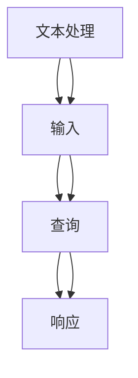
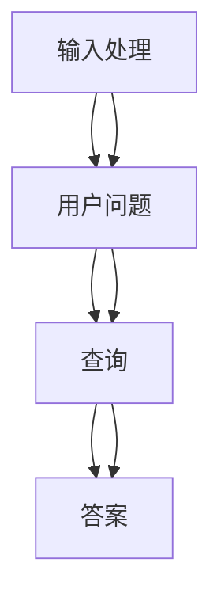
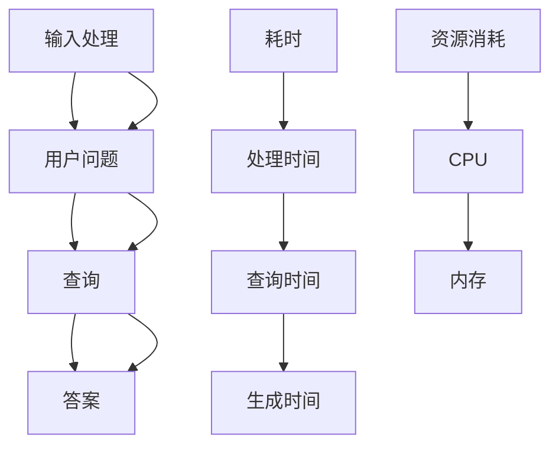
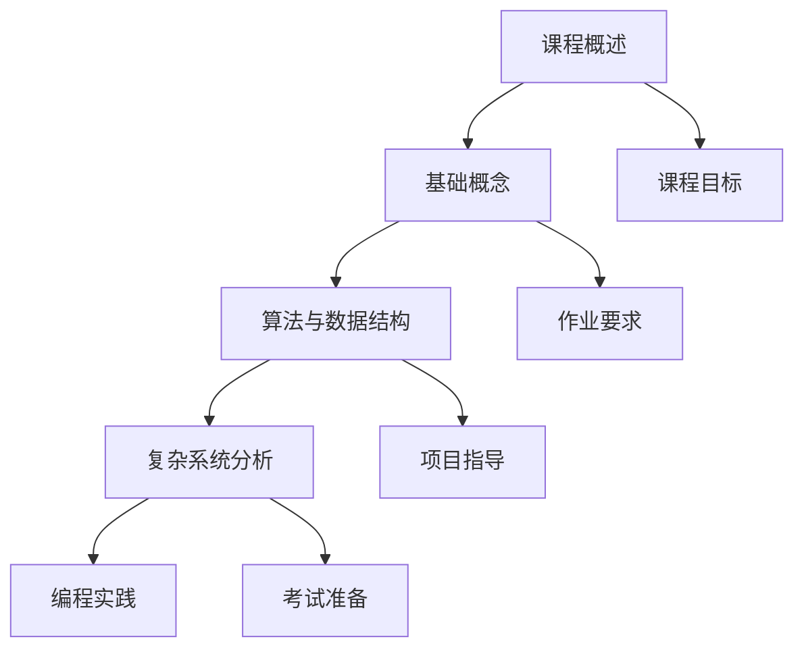
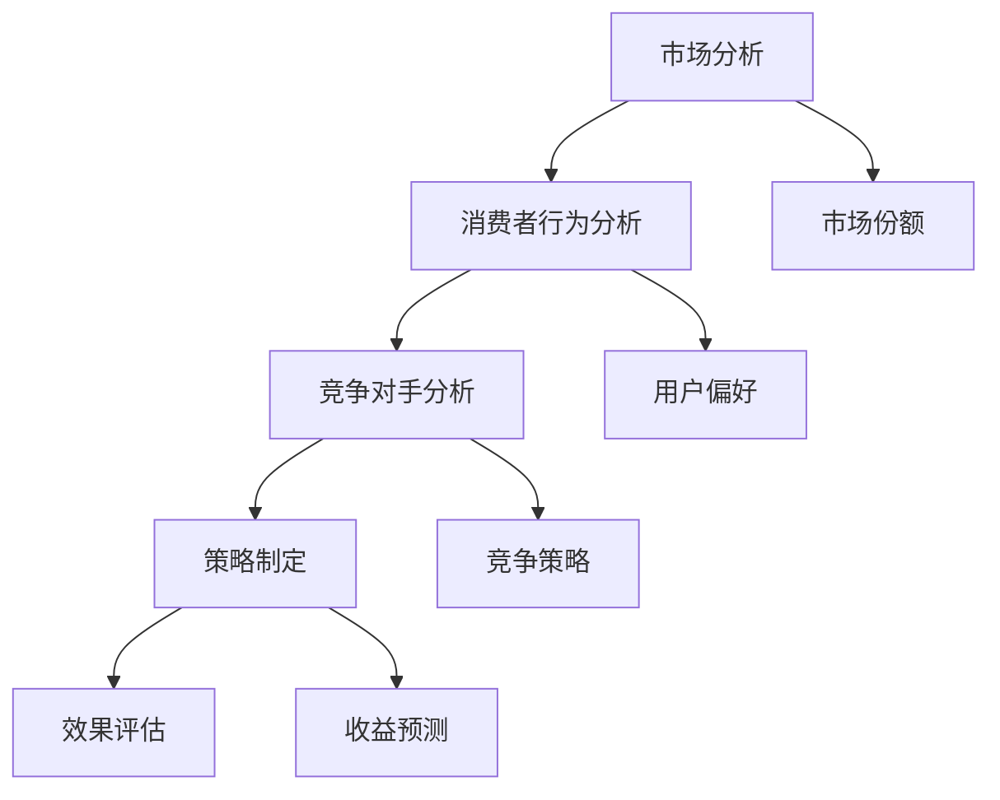
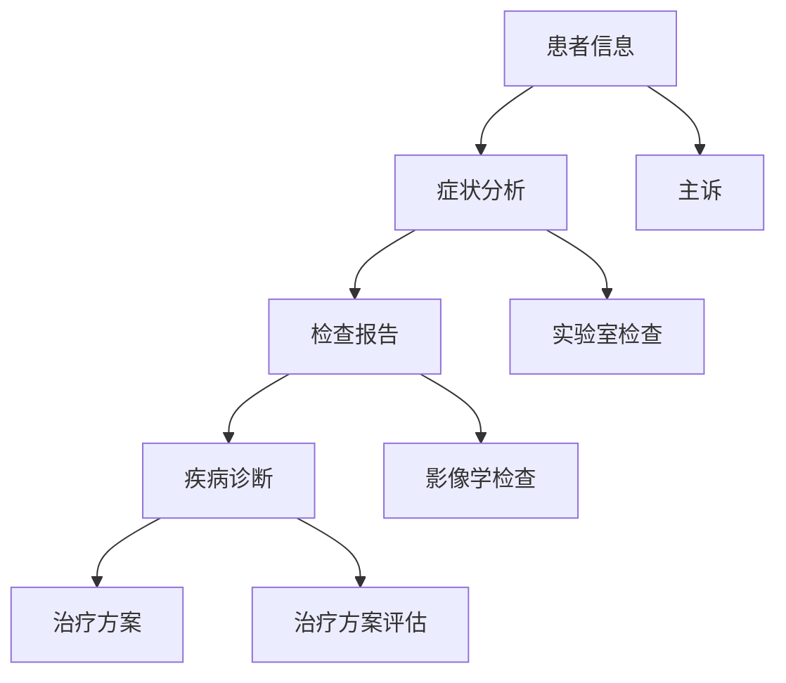

                 

### 第1章：引言与背景

#### 1.1 书籍目的与读者对象

本书旨在深入探讨思维链可视化技术，尤其是如何通过可视化手段理解ChatGPT的决策过程。本书适合具备一定编程基础和计算机科学知识，对人工智能和自然语言处理有初步了解的读者。无论是数据科学家、人工智能研究者，还是对AI技术感兴趣的工程师，都能从本书中获得宝贵的见解和实用技能。

本书分为七个章节，内容循序渐进，从基础的背景介绍和核心概念讲解，到思维链可视化技术的具体方法和工具，再到实际应用案例分析，以及未来的展望和挑战，旨在帮助读者全面了解和掌握思维链可视化在ChatGPT决策分析中的应用。

#### 1.2 ChatGPT简介

ChatGPT是OpenAI开发的一种基于Transformer模型的大型语言模型，它能够进行自然语言理解和生成，并应用于各种任务，包括问答系统、聊天机器人、文本摘要和翻译等。ChatGPT的训练数据来自数以亿计的网页、书籍、新闻文章和对话记录，这使得它具备了强大的语言理解和生成能力。

ChatGPT的核心技术是基于自回归语言模型，它能够根据前文信息预测下一个词或句子，从而生成连贯的自然语言响应。自回归语言模型是一种序列模型，通过学习输入序列的概率分布来预测下一个元素。这种模型在训练过程中通过最大化负对数似然损失函数来优化参数，从而提高预测准确性。

#### 1.3 思维链的概念

思维链（Mind Chain）是一种用于描述人工智能模型如何处理和理解复杂问题的概念。它将人工智能模型的决策过程视为一系列相互关联的思维活动，每个思维活动都通过输入、处理和输出信息来传递信息。

在ChatGPT的上下文中，思维链可以被视为一种动态决策网络，其中每个节点表示一个思维活动，边表示信息流。思维链通过连续的输入和输出，结合预定的策略和算法，对输入问题或指令进行推理和响应。

#### 1.4 ChatGPT的决策过程概述

ChatGPT的决策过程可以分解为以下几个关键步骤：

1. **输入处理**：接收用户输入的问题或指令，并将其转换为模型可以理解的形式。
2. **上下文构建**：根据历史对话信息和问题背景，构建一个上下文环境，以便模型能够理解和回应。
3. **推理过程**：模型通过内部逻辑和算法，对上下文信息进行推理，生成可能的响应。
4. **输出生成**：根据推理结果，生成一个或多个自然语言响应，并选择最合适的输出。

每个步骤都涉及多个子过程和复杂的计算。通过思维链可视化技术，我们可以更直观地理解和分析这些步骤，从而深入理解ChatGPT的决策过程。

### 思维链与ChatGPT的关系

思维链是ChatGPT内部决策过程的抽象表示。它通过可视化技术将ChatGPT的复杂决策过程分解为一系列可理解、可分析的思维活动。这样，我们不仅可以更好地理解ChatGPT的工作原理，还能发现和解决潜在的问题，从而优化模型性能。

在本章中，我们介绍了本书的目的和读者对象，简要介绍了ChatGPT的基本概念和决策过程，并引入了思维链的概念。接下来，我们将深入探讨自然语言处理的基础概念，为理解思维链和ChatGPT的关系打下基础。

### 2.1 自然语言处理基础

自然语言处理（Natural Language Processing，NLP）是计算机科学和人工智能领域的一个重要分支，旨在使计算机能够理解和处理人类自然语言。NLP技术广泛应用于信息检索、机器翻译、语音识别、情感分析、文本摘要等任务。

#### 2.1.1 语言模型

语言模型（Language Model）是NLP的核心技术之一，用于对自然语言的概率分布进行建模。在ChatGPT中，语言模型负责预测下一个词或句子的概率分布，从而生成连贯的自然语言响应。

一个简单的语言模型可以通过统计方法训练，如N元语法（N-gram Model）。N元语法假设一个单词的出现概率只与前面N-1个单词有关。具体来说，给定一个N元序列 \(w_1, w_2, ..., w_N\)，N元语法的概率分布可以表示为：

$$
P(w_N | w_{N-1}, w_{N-2}, ..., w_1) = \prod_{i=1}^{N} P(w_i | w_{i-1}, w_{i-2}, ..., w_1)
$$

在训练过程中，我们通过最大化语言模型的负对数似然损失函数来优化模型参数：

$$
L(\theta) = -\sum_{w_1, w_2, ..., w_N} \log P(w_N | w_{N-1}, w_{N-2}, ..., w_1)
$$

其中，\(\theta\)表示模型参数。

尽管N元语法在处理短文本任务时表现出色，但在处理长文本时，其表现较差。为了解决这个问题，研究人员提出了基于神经网络的深度语言模型，如Long Short-Term Memory（LSTM）和Transformer。

#### 2.1.2 词嵌入技术

词嵌入（Word Embedding）是将单词映射到低维向量空间的一种技术，使得具有相似意义的单词在向量空间中彼此靠近。词嵌入有助于改善语言模型的性能，特别是在处理语义分析和文本生成任务时。

词嵌入可以通过多种方法训练，如基于统计的方法（如Word2Vec）和基于神经网络的方法（如GloVe和BERT）。下面是一个基于神经网络的词嵌入训练过程的伪代码：

```
# 输入：单词文本集合，词汇表
# 输出：词嵌入矩阵

# 初始化词嵌入矩阵
V = initialize_embedding_matrix(V_size)

# 定义神经网络模型
model = build_model(V_size)

# 训练模型
for sentence in text_corpus:
    inputs = []
    targets = []
    for word in sentence:
        inputs.append(word_embedding[word])
        targets.append(word_embedding[word + 1])
    model.fit(inputs, targets)

# 获取最终词嵌入矩阵
word_embeddings = model.get_embedding_matrix()
```

在训练过程中，模型通过学习单词和单词之间的上下文关系来优化词嵌入向量。这使得具有相似上下文的单词在向量空间中更接近。

#### 2.1.3 语义理解

语义理解（Semantic Understanding）是NLP的另一个关键任务，旨在理解文本的深层含义，而不仅仅是表面信息。语义理解有助于提高NLP系统的准确性和鲁棒性，使其能够处理更复杂的任务，如问答系统、机器翻译和情感分析。

语义理解可以通过多种方法实现，如词嵌入、依存句法分析和语义角色标注等。下面是一个基于词嵌入和依存句法分析的语义理解过程的伪代码：

```
# 输入：句子
# 输出：语义表示

# 提取词嵌入
word_embeddings = extract_word_embeddings(sentence)

# 提取依存句法信息
dependency_tree = extract_dependency_tree(sentence)

# 构建语义表示
semantic_representation = build_semantic_representation(word_embeddings, dependency_tree)

return semantic_representation
```

在这个过程

### 2.2 ChatGPT架构解析

ChatGPT作为OpenAI开发的一种先进语言模型，其架构在自然语言处理（NLP）领域具有里程碑意义。本节将详细解析ChatGPT的模型结构、训练与优化过程，以及损失函数和优化算法。

#### 2.2.1 模型结构

ChatGPT的核心是基于Transformer模型的变体，Transformer模型最初由Vaswani等人在2017年提出，其创新之处在于完全基于自注意力机制（Self-Attention）来建模序列信息，避免了传统的循环神经网络（RNN）在长序列建模上的劣势。

ChatGPT的模型结构主要包括以下几个部分：

1. **嵌入层（Embedding Layer）**：将输入的词向量映射到高维空间，这一步不仅包括了词嵌入（Word Embedding），还可能涉及位置嵌入（Position Embedding）和句型嵌入（Segment Embedding）。

2. **多头自注意力层（Multi-Head Self-Attention Layer）**：这是Transformer模型的核心部分，每个头负责从不同子空间中捕获序列信息，并通过自注意力机制计算每个词的权重。

3. **前馈神经网络（Feed-Forward Neural Network）**：在自注意力层之后，每个位置都会通过一个前馈网络进行非线性变换。

4. **层归一化和残差连接（Layer Normalization and Residual Connection）**：为了稳定训练过程，Transformer模型在每个层之后都加入了层归一化（Layer Normalization）和残差连接（Residual Connection）。

5. **输出层（Output Layer）**：模型的输出通常是一个 Softmax 函数，用于预测下一个词的概率分布。

#### 2.2.2 训练与优化

ChatGPT的训练过程通常涉及以下几个步骤：

1. **数据预处理**：将文本数据转换为单词序列，并对单词进行嵌入编码。对于大量的文本数据，通常需要进行分词（Tokenization）和词汇表构建（Vocabulary Building）。

2. **模型初始化**：初始化模型参数，可以选择随机初始化或预训练模型（如BERT）的参数。

3. **前向传播（Forward Propagation）**：将输入序列通过模型，计算输出概率分布。

4. **损失计算（Loss Calculation）**：使用交叉熵损失函数（Cross-Entropy Loss）计算预测输出与真实标签之间的差异。

5. **反向传播（Back Propagation）**：通过梯度下降（Gradient Descent）或其他优化算法更新模型参数。

6. **模型评估（Model Evaluation）**：在验证集上评估模型性能，包括准确率、F1值等指标。

以下是训练ChatGPT的伪代码示例：

```
# 输入：训练数据集，验证数据集
# 输出：训练好的ChatGPT模型

# 初始化模型参数
model = initialize_model()

# 训练模型
for epoch in range(num_epochs):
    for batch in train_data:
        inputs, targets = preprocess_batch(batch)
        logits = model(inputs)
        loss = compute_loss(logits, targets)
        backward_pass(loss)
    evaluate_model(model, validation_data)
```

#### 2.2.3 损失函数与优化算法

ChatGPT的训练过程依赖于损失函数和优化算法。损失函数用于衡量预测输出与真实标签之间的差异，优化算法用于调整模型参数以最小化损失。

1. **损失函数**：ChatGPT通常使用交叉熵损失函数（Cross-Entropy Loss），其公式如下：

$$
L = -\sum_{i} y_i \log(p_i)
$$

其中，\(y_i\) 是真实标签，\(p_i\) 是模型预测的概率。

2. **优化算法**：为了高效地优化模型参数，ChatGPT通常使用自适应优化算法，如Adam。Adam算法结合了AdaGrad和RMSProp的优点，能够自适应地调整学习率：

$$
m_t = \beta_1 m_{t-1} + (1 - \beta_1) [g_t]
$$

$$
v_t = \beta_2 v_{t-1} + (1 - \beta_2) [g_t]^2
$$

$$
\hat{m_t} = \frac{m_t}{1 - \beta_1^t}
$$

$$
\hat{v_t} = \frac{v_t}{1 - \beta_2^t}
$$

$$
\theta_t = \theta_{t-1} - \alpha \frac{\hat{m_t}}{\sqrt{\hat{v_t}} + \epsilon}
$$

其中，\(m_t\) 和 \(v_t\) 分别是梯度的一阶矩估计和二阶矩估计，\(\beta_1\) 和 \(\beta_2\) 分别是动量的指数衰减率，\(\alpha\) 是学习率，\(\epsilon\) 是常数。

通过这些步骤，ChatGPT能够从大量的文本数据中学习，并生成高质量的文本响应。在下一章中，我们将探讨思维链的工作原理及其与ChatGPT的关系。

### 2.3 思维链的工作原理

#### 2.3.1 思维链的定义

思维链（Mind Chain）是一种用于描述人工智能模型在处理复杂任务时内部决策过程的抽象结构。它将人工智能模型的决策过程视为一系列相互关联的模块或思维单元，这些单元通过信息传递和计算协同工作，共同实现最终的任务目标。

在ChatGPT的上下文中，思维链可以被视为一个动态决策网络，每个节点表示一个思维活动，边表示信息流。思维链通过连续的输入、处理和输出，结合预定的策略和算法，对输入问题或指令进行推理和响应。

#### 2.3.2 思维链的关键技术

思维链的工作原理涉及多个关键技术和组件：

1. **模块化设计**：思维链采用模块化设计，每个模块负责一个特定的任务或功能，如文本处理、语义分析、信息检索等。这种设计使得思维链易于扩展和维护。

2. **信息传递机制**：思维链中的信息传递是通过边缘（Edge）来实现的。每个边缘携带数据和控制信息，数据信息可以是输入文本、中间结果或最终输出，控制信息则用于协调不同模块之间的执行顺序。

3. **动态调度**：思维链通过动态调度机制来管理模块的执行顺序和资源分配。调度策略可以根据任务需求和系统负载进行自适应调整，以提高整体效率。

4. **一致性维护**：思维链中的模块需要确保数据的一致性和完整性。通过引入一致性协议和冲突检测机制，思维链能够有效地处理并发访问和数据更新。

5. **学习与优化**：思维链具备学习与优化能力，可以通过机器学习和强化学习技术不断改进自身的决策能力和性能。通过从历史数据和用户反馈中学习，思维链能够适应不同的应用场景和用户需求。

#### 2.3.3 思维链与ChatGPT的关系

思维链与ChatGPT的关系可以视为一种底层架构与上层应用的关系。ChatGPT作为人工智能模型，其决策过程可以通过思维链来表示和优化。

具体来说，思维链为ChatGPT提供了一个抽象的决策框架，使得复杂的语言处理任务能够通过一系列模块化、协同工作的思维活动来实现。例如，在处理一个问答任务时，ChatGPT可以通过思维链中的文本处理模块提取关键信息，通过语义分析模块理解问题的含义，然后通过信息检索模块查找相关答案，最终通过文本生成模块生成自然的回答。

此外，思维链可视化技术有助于我们深入理解ChatGPT的决策过程。通过可视化工具，我们可以直观地观察思维链中各个模块的交互和信息流动，从而发现潜在的优化点和性能瓶颈。例如，通过分析思维链中的延迟和冲突，我们可以改进模块的调度策略，提高整体系统的响应速度和稳定性。

总之，思维链为ChatGPT提供了一个灵活、可扩展的决策框架，使其能够高效地处理复杂的语言处理任务。而思维链可视化技术则为我们提供了分析、优化和改进ChatGPT决策过程的有力工具。

在下一章中，我们将探讨思维链可视化技术的基本原理，介绍如何通过可视化手段理解思维链的结构和行为。

### 3.1 可视化基本原理

可视化（Visualization）是一种将数据、信息和知识以图形、图像或交互式形式展示出来的技术，其目的是帮助人类更直观地理解和分析复杂的数据集。在计算机科学和人工智能领域，可视化技术广泛应用于数据探索、模型分析、系统监控等方面。

#### 3.1.1 数据可视化概述

数据可视化是指通过视觉元素（如线条、形状、颜色和空间布局）来表示和传达数据信息。其核心目的是将复杂、抽象的数据以直观、易理解的方式呈现给用户。数据可视化有助于发现数据中的模式和趋势，揭示隐藏的关系和关联，从而支持决策制定和问题解决。

常见的数据可视化形式包括：

1. **图表**：如柱状图、折线图、饼图、散点图等，用于展示数据的数量关系和变化趋势。
2. **地图**：用于展示地理位置、分布和密度信息。
3. **信息图表**：将多种数据类型和关系整合在一个图表中，以简化复杂的信息。
4. **交互式可视化**：通过用户交互（如拖拽、筛选和缩放）来动态探索数据。

数据可视化具有以下几个关键特征：

- **直观性**：通过视觉元素传达信息，使得数据更容易理解和记忆。
- **交互性**：允许用户与可视化界面进行交互，以深入探索数据细节和模式。
- **动态性**：支持数据动态更新和实时分析，以反映数据变化和趋势。

#### 3.1.2 可视化工具与库

在实际应用中，有许多数据可视化工具和库可以帮助我们创建和展示数据可视化。以下是一些常用的工具和库：

1. **Matplotlib**：Python中的一个广泛使用的可视化库，支持多种图表类型和定制化。
2. **Plotly**：提供交互式图表和可视化功能，支持多种编程语言和平台。
3. **D3.js**：基于JavaScript的库，用于创建复杂的交互式数据可视化。
4. **Tableau**：商业数据可视化工具，支持多种数据连接和可视化格式。
5. **Power BI**：微软推出的商业智能工具，提供丰富的可视化选项和报告功能。

这些工具和库各有优缺点，可以根据具体需求和项目规模选择合适的一个。

#### 3.1.3 可视化设计原则

为了创建有效的可视化，需要遵循一些基本设计原则，以确保信息的准确传达和用户的理解：

1. **明确目的**：在开始可视化设计之前，明确可视化的目标和观众需求，确保设计符合目标。
2. **简化信息**：去除无关或冗余信息，突出核心数据和关键模式，避免过度设计。
3. **一致性**：保持颜色、字体、布局等设计元素的一致性，以便用户更容易理解和比较数据。
4. **易于交互**：设计直观、易于操作的交互界面，使用户能够方便地探索和筛选数据。
5. **清晰标注**：为图表和图形添加必要的标注和说明，如数据单位、来源、定义等，以提高数据的可读性。
6. **注释和提示**：提供注释和提示，帮助用户理解数据背后的含义和关系。

通过遵循这些设计原则，我们可以创建出既美观又实用的数据可视化，从而更好地支持数据分析和决策制定。

在下一章中，我们将深入探讨思维链可视化方法，介绍如何通过可视化技术理解和分析思维链的结构和行为。

### 3.2 思维链可视化方法

思维链可视化是理解人工智能模型内部决策过程的重要手段。通过可视化，我们可以直观地展示思维链的各个模块、信息流以及它们之间的交互关系，从而深入分析模型的工作原理和性能。以下将介绍思维链可视化的几种关键方法。

#### 3.2.1 思维链结构可视化

思维链结构可视化主要用于展示思维链的模块组成和层次结构。这种可视化方法可以帮助我们清晰地了解思维链是如何组织和工作的。

**可视化工具**：
- **Graphviz**：一种基于DOT语言的图形可视化工具，支持创建复杂的图和流程图。
- **Mermaid**：一种基于Markdown的图形和流程图绘制工具，可以与Markdown编辑器集成。

**实现步骤**：

1. **定义思维链模块**：首先，需要定义思维链的各个模块，如文本处理、语义分析、信息检索和文本生成等。
2. **创建模块图**：使用Graphviz或Mermaid创建一个图，每个模块表示为一个节点，模块之间的关系表示为边。
3. **添加标注和说明**：为每个模块和边添加必要的标注和说明，如模块功能、输入输出和数据流方向。

**示例**（使用Mermaid语言描述思维链结构）：



上述示例展示了思维链中四个主要模块及其输入输出关系。

#### 3.2.2 思维链行为可视化

思维链行为可视化用于展示思维链在处理特定任务时的行为和状态变化。这种可视化方法可以帮助我们了解思维链在执行任务时的动态过程和性能表现。

**可视化工具**：
- **Time Series Visualization Libraries**：如Plotly和Matplotlib，可以用于展示时间序列数据。
- **Animated Visualization Tools**：如D3.js，可以创建动态动画，展示思维链的行为变化。

**实现步骤**：

1. **收集行为数据**：在思维链执行任务时，收集关键行为数据，如处理时间、响应时间、资源消耗等。
2. **创建时间序列图**：使用时间序列可视化工具，将行为数据展示为折线图、柱状图等。
3. **添加动态动画**：对于复杂的行为模式，可以使用动画工具创建动态可视化，展示思维链在不同时间点的状态变化。

**示例**（使用Matplotlib创建思维链处理时间的折线图）：

```python
import matplotlib.pyplot as plt
import numpy as np

# 假设收集到的行为数据
times = np.array([0.1, 0.3, 0.4, 0.2, 0.5])
labels = ['文本处理', '语义分析', '信息检索', '文本生成']

# 创建折线图
plt.plot(times, labels)
plt.xlabel('处理时间')
plt.ylabel('模块')
plt.title('思维链处理时间')
plt.show()
```

上述示例展示了思维链在处理任务时各个模块的时间消耗。

#### 3.2.3 思维链效能可视化

思维链效能可视化用于评估思维链在不同场景和任务中的性能表现。这种可视化方法可以帮助我们识别思维链的瓶颈和优化点，从而提高整体效能。

**可视化工具**：
- **Efficiency Analysis Tools**：如Grafana和Kibana，可以用于展示系统性能指标和资源消耗。
- **Scatter Plots**：用于展示效能指标之间的关系，如响应时间和资源消耗。

**实现步骤**：

1. **定义效能指标**：根据任务需求，定义相关的效能指标，如响应时间、准确率、资源消耗等。
2. **收集效能数据**：在思维链执行不同任务时，收集效能指标数据。
3. **创建效能分析图**：使用散点图、折线图等，展示效能指标之间的关系和变化趋势。

**示例**（使用Grafana创建思维链效能分析图）：

```plaintext
# 假设使用Grafana创建的Dashboard

# 效能指标折线图
Graph of Response Time over Resource Usage

# 效能指标散点图
Scatter Plot of Accuracy vs. Response Time
```

上述示例展示了思维链在不同任务中的响应时间和资源消耗。

通过这些可视化方法，我们可以全面地分析思维链的结构和行为，从而深入了解ChatGPT的决策过程，为优化和改进提供有力的支持。在下一章中，我们将探讨如何通过实际案例来展示和解读思维链可视化结果。

### 3.3 实际案例分析

在本节中，我们将通过一个具体案例来展示思维链可视化在实际应用中的效果和作用。该案例涉及使用思维链可视化技术分析一个基于ChatGPT的问答系统。

#### 3.3.1 可视化工具应用

在本案例中，我们使用了Mermaid和D3.js两个可视化工具。Mermaid用于创建思维链的结构图，而D3.js用于创建动态交互式可视化，以展示思维链在处理问答任务时的行为和性能。

**步骤1：定义思维链模块**

首先，我们需要定义问答系统中涉及的各个思维链模块，如图1所示：



图1：思维链结构图

**步骤2：收集行为数据**

在问答系统运行期间，我们收集了以下关键行为数据：

- **处理时间**：每个模块在处理输入、查询和生成答案时的耗时。
- **响应时间**：整个问答系统从接收用户问题到生成答案的总耗时。
- **资源消耗**：每个模块在执行任务时的CPU和内存消耗。

**步骤3：创建可视化**

使用Mermaid创建思维链的结构图，并使用D3.js创建动态交互式可视化，以展示思维链在处理问答任务时的行为和性能。

**结构图示例**：



**动态交互示例**（使用D3.js）：

```javascript
// 假设已有行为数据
const data = [
  { module: '输入处理', time: 0.1, cpu: 20, memory: 30 },
  { module: '语义分析', time: 0.3, cpu: 40, memory: 50 },
  { module: '信息检索', time: 0.2, cpu: 30, memory: 40 },
  { module: '答案生成', time: 0.2, cpu: 10, memory: 20 },
];

// 创建动态折线图展示处理时间
const lineChart = d3.line()
  .x(d => xScale(d.module))
  .y(d => yScale(d.time));

// 绘制图表
svg.append("path")
  .attr("fill", "none")
  .attr("stroke", "steelblue")
  .attr("stroke-width", 1.5)
  .attr("d", lineChart(data));

// 创建动态散点图展示资源消耗
const scatterChart = svg.selectAll("circle")
  .data(data)
  .enter()
  .append("circle")
  .attr("cx", d => xScale(d.module))
  .attr("cy", d => yScale(d.cpu))
  .attr("r", 5)
  .attr("fill", "red");

// 动态更新图表
scatterChart.transition().duration(1000)
  .attr("cy", d => yScale(d.memory));
```

上述代码示例展示了如何使用D3.js创建动态交互式可视化，以展示思维链在处理问答任务时的行为和性能。

#### 3.3.2 可视化结果解读

通过可视化工具，我们可以直观地观察思维链在处理问答任务时的行为和性能，从而进行深入分析。

**1. 结构分析**

从思维链结构图可以看出，输入处理、语义分析、信息检索和答案生成是问答系统中的关键模块。其中，语义分析模块占据了较长的时间，这可能是由于该模块需要进行复杂的文本理解和分析。信息检索和答案生成模块的时间相对较短，但它们之间的数据流较为复杂，可能会对整体响应时间产生影响。

**2. 行为分析**

从动态交互式可视化结果中，我们可以观察到以下行为：

- **处理时间**：输入处理模块的耗时最长，这表明该模块在处理用户问题时需要进行较多的预处理工作。语义分析模块耗时次之，信息检索和答案生成模块的耗时相对较短。
- **资源消耗**：各个模块的CPU和内存消耗都有所不同，语义分析模块的CPU消耗最高，这可能是由于该模块需要进行复杂的计算。输入处理模块的内存消耗相对较高，这表明该模块在处理用户问题时需要较大的存储空间。

**3. 性能分析**

通过对比处理时间和响应时间，我们可以评估思维链在不同模块和任务中的性能。例如，输入处理模块的处理时间较长，但其在整体响应时间中的比例相对较低，表明该模块不是影响系统性能的主要瓶颈。相比之下，语义分析模块的耗时较长，且其在整体响应时间中的比例较高，这表明优化该模块可能是提高系统性能的关键。

**4. 优化建议**

根据可视化结果，我们可以提出以下优化建议：

- **优化输入处理模块**：考虑使用更高效的预处理算法，以减少该模块的耗时。
- **优化语义分析模块**：通过改进算法和模型，提高该模块的处理速度和准确性。
- **优化信息检索和答案生成模块**：考虑使用更快速或更准确的算法，减少这两个模块的耗时和资源消耗。

通过实际案例分析，我们可以看到思维链可视化技术在实际应用中的重要作用。它不仅帮助我们理解思维链的结构和行为，还为优化和改进提供了有力的支持。

在下一章中，我们将探讨常见思维链可视化工具的介绍和如何开发思维链可视化工具。

### 3.4 常见思维链可视化工具

在实际应用中，有许多工具可以用来实现思维链的可视化。这些工具不仅提供了丰富的可视化功能，还支持多种编程语言和平台，从而满足了不同用户的需求。以下将介绍几种常见的思维链可视化工具。

#### 3.4.1 Matplotlib

Matplotlib是Python中最常用的数据可视化库之一，它支持多种图表类型，如折线图、柱状图、散点图和饼图等。Matplotlib的简单易用性使其在科学计算和数据分析中广泛应用。

**优势**：

- **丰富的图表类型**：支持多种常见的图表类型，可以满足不同场景的需求。
- **自定义性强**：允许用户通过设置各种参数和样式来自定义图表，从而获得更美观和直观的可视化效果。
- **与Python集成紧密**：作为Python标准库的一部分，Matplotlib与Python其他库（如NumPy、Pandas）的集成非常紧密。

**局限**：

- **交互性较弱**：Matplotlib生成的图表主要是静态的，不支持用户交互。
- **性能有限**：对于复杂的数据集和大型图表，Matplotlib的性能可能会受到限制。

**示例代码**：

```python
import matplotlib.pyplot as plt
import numpy as np

# 创建一个简单的折线图
x = np.linspace(0, 10, 100)
y = np.sin(x)

plt.plot(x, y)
plt.title('思维链处理时间')
plt.xlabel('处理时间（秒）')
plt.ylabel('模块')
plt.show()
```

#### 3.4.2 Plotly

Plotly是一个强大的交互式可视化库，支持多种编程语言，包括Python、R、Julia和JavaScript。它提供了丰富的图表类型，如散点图、折线图、柱状图、3D图表和地图等，并支持动态交互和实时更新。

**优势**：

- **交互性强**：支持用户交互，如缩放、旋转和筛选等，使得用户可以更深入地探索数据。
- **丰富的图表类型**：提供了多种图表类型，包括自定义图表，可以满足各种需求。
- **良好的性能**：对于大型数据集和复杂图表，Plotly具有较好的性能。

**局限**：

- **依赖较多**：Plotly依赖于多个外部库，如D3.js和Underscore.js，安装和配置可能比较复杂。
- **学习曲线较陡**：对于初学者来说，Plotly的学习曲线可能较陡，需要一定的学习和实践。

**示例代码**（使用Python的Plotly库）：

```python
import plotly.express as px
import pandas as pd

# 创建一个交互式折线图
df = pd.DataFrame({
    'Time': [0, 1, 2, 3, 4],
    'Module': ['Input', 'Semantic', 'Search', 'Generate', 'Output'],
    'Duration': [0.1, 0.3, 0.2, 0.4, 0.5]
})

fig = px.line(df, x='Time', y='Duration', title='思维链处理时间')
fig.show()
```

#### 3.4.3 D3.js

D3.js是一个基于JavaScript的可视化库，它允许用户使用JavaScript和HTML创建交互式的数据可视化。D3.js提供了强大的数据绑定和SVG绘制功能，可以创建复杂的交互式图表。

**优势**：

- **交互性强**：支持各种交互操作，如拖拽、缩放、筛选和动画等。
- **灵活性和控制性**：通过直接操作DOM和SVG元素，用户可以创建高度自定义的可视化。
- **广泛的浏览器支持**：D3.js可以在大多数现代浏览器上运行，无需额外的插件。

**局限**：

- **学习曲线较陡**：D3.js的学习曲线相对较陡，需要用户具备一定的前端开发知识和JavaScript技能。
- **性能问题**：对于大量数据和高频交互，D3.js的性能可能成为瓶颈。

**示例代码**（使用D3.js创建折线图）：

```javascript
const data = [
  { x: 0, y: 0.1 },
  { x: 1, y: 0.3 },
  { x: 2, y: 0.2 },
  { x: 3, y: 0.4 },
  { x: 4, y: 0.5 }
];

const width = 600, height = 300;

const svg = d3.select("svg")
  .attr("width", width)
  .attr("height", height);

const xScale = d3.scaleLinear().domain([0, 4]).range([0, width]);
const yScale = d3.scaleLinear().domain([0, 0.6]).range([height, 0]);

const line = d3.line()
  .x(d => xScale(d.x))
  .y(d => yScale(d.y));

svg.append("path")
  .attr("fill", "none")
  .attr("stroke", "steelblue")
  .attr("stroke-width", 1.5)
  .attr("d", line(data));
```

通过这些工具，我们可以根据实际需求和项目特点选择合适的可视化库，实现思维链的可视化。在下一章中，我们将探讨如何开发自定义的思维链可视化工具，以满足特定的需求和应用场景。

### 3.5 思维链可视化工具开发

开发自定义的思维链可视化工具可以更好地满足特定的需求和应用场景，提供更加精细和个性化的可视化效果。以下将介绍如何设计和实现一个思维链可视化工具，包括工具设计、用户界面设计和性能优化。

#### 3.5.1 工具设计与实现

**1. 设计原则**

在开发思维链可视化工具时，需要遵循以下设计原则：

- **直观性**：工具界面应简洁、直观，用户能够快速理解和使用。
- **可扩展性**：工具应具备良好的模块化设计，便于添加新功能和扩展功能。
- **灵活性**：工具应支持多种数据格式和可视化类型，以适应不同的应用场景。
- **可定制性**：用户应能够自定义可视化参数，如颜色、字体、布局等。

**2. 功能模块**

思维链可视化工具的主要功能模块包括：

- **数据导入模块**：支持导入多种数据格式，如CSV、JSON、Excel等，以便用户能够方便地导入思维链的数据。
- **数据预处理模块**：对导入的数据进行清洗、转换和归一化，以确保数据的准确性和一致性。
- **可视化模块**：根据用户的需求和参数设置，生成可视化图表，如结构图、时间序列图、效能分析图等。
- **交互模块**：提供用户交互功能，如缩放、筛选、排序等，以支持用户深入探索数据。

**3. 实现方法**

以下是一个基于Web的思维链可视化工具的实现方法：

- **前端**：使用HTML、CSS和JavaScript实现用户界面和交互功能，可以选择框架如React或Vue.js来简化开发。
- **后端**：使用Node.js或Python Flask等后端框架处理数据导入和预处理，并与前端进行通信。
- **可视化库**：选择合适的可视化库，如D3.js、Plotly或ECharts，以实现各种图表的绘制。

**示例代码**（前端：React + D3.js）：

```javascript
import React, { useState, useEffect } from 'react';
import * as d3 from 'd3';

const MindChainVisualization = ({ data }) => {
  // 状态管理
  const [svg, setSvg] = useState(null);

  useEffect(() => {
    if (svg) {
      // 创建SVG元素
      const svgElement = d3.select(svg);

      // 绘制图表
      // ...

      // 添加交互功能
      // ...

    }
  }, [svg]);

  return (
    <div>
      <svg ref={setSvg} />
    </div>
  );
};

export default MindChainVisualization;
```

#### 3.5.2 用户界面设计

用户界面设计（User Interface Design，UI Design）是思维链可视化工具的重要组成部分，它决定了用户与工具交互的流畅性和易用性。以下是一些关键的设计要素：

**1. 导航栏**：提供快速访问工具主要功能的导航栏，如数据导入、可视化设置、帮助文档等。

**2. 工作区**：可视化图表的主要显示区域，支持缩放、拖动和调整图表大小等功能。

**3. 控制面板**：用于设置可视化参数的选项卡，如颜色、字体、线型等，支持实时预览和调整。

**4. 帮助和反馈**：提供帮助文档和用户反馈渠道，帮助用户解决问题和提供改进建议。

**示例界面设计**：

```plaintext
+----------------------------------+
|  Navigation Bar                 |
+----------------------------------+
|  Import Data                     |
|  Settings                       |
|  Help & Feedback                |
+----------------------------------+
|  Work Area                      |
+----------------------------------+
|  Control Panel                  |
|  Color Settings                 |
|  Font Settings                  |
|  Layout Settings                |
+----------------------------------+
```

#### 3.5.3 性能优化

性能优化是确保思维链可视化工具运行高效和流畅的重要环节。以下是一些性能优化策略：

**1. 数据预处理**：在可视化前对数据进行预处理，如数据清洗、压缩和索引，以减少数据量。

**2. 缓存技术**：使用浏览器缓存或内存缓存技术，减少重复数据的加载和处理。

**3. 异步加载**：采用异步加载技术，将数据和资源按需加载，减少初始加载时间。

**4. 渲染优化**：优化D3.js或其他可视化库的渲染过程，如使用虚拟滚动、画布渲染等。

**5. 并发处理**：使用多线程或异步处理技术，提高数据处理和绘制的效率。

**6. 性能监控**：使用性能监控工具，如Google Lighthouse，定期检查和优化工具的性能。

通过以上设计和实现策略，我们可以开发出一个功能强大、性能优异的思维链可视化工具，为用户提供了直观、高效的可视化体验。

在下一章中，我们将探讨思维链可视化在具体应用领域的实际应用案例。

### 3.6 思维链可视化应用

思维链可视化技术在各个领域的应用日益广泛，尤其在教育、企业管理、医疗等多个领域，它为数据分析和决策支持提供了有力的工具。以下将介绍思维链可视化在具体应用领域的实际案例。

#### 3.6.1 教育领域

在教育领域，思维链可视化技术可以帮助教师和学生更好地理解和分析教学过程和学习行为。

**案例1：教学内容可视化**

在某大学计算机科学系，教师利用思维链可视化技术将课程内容以图形化的形式展示给学生。通过结构图和流程图，学生可以直观地了解课程的逻辑结构和知识关联。以下是一个简单的示例：

**示例：**



通过这种结构图，学生可以清晰地看到课程各部分的关系和重要性，从而更好地规划学习进度。

**案例2：学生学习行为分析**

在某中学，教师利用思维链可视化技术对学生日常学习行为进行分析。通过收集学生的作业、考试和课堂表现数据，教师可以创建时间序列图和散点图，以分析学生的学习趋势和问题。

**示例：**

```plaintext
# 使用Matplotlib创建学生作业完成时间与成绩的散点图
import matplotlib.pyplot as plt
import numpy as np

data = np.array([
    [1, 30],
    [2, 40],
    [3, 45],
    [4, 35],
    [5, 50]
])

x = data[:, 0]
y = data[:, 1]

plt.scatter(x, y)
plt.xlabel('作业完成时间（天）')
plt.ylabel('成绩（分）')
plt.title('学生作业完成时间与成绩')
plt.show()
```

通过分析散点图，教师可以识别出学习进度与成绩之间的关联，从而采取相应的教学策略。

#### 3.6.2 企业管理领域

在企业管理领域，思维链可视化技术可以帮助企业进行战略决策支持、运营优化和风险评估。

**案例1：企业战略决策支持**

某跨国公司在制定新产品推广策略时，利用思维链可视化技术分析了市场数据、消费者行为和竞争对手情况。通过构建思维链结构图和效能分析图，企业可以直观地了解不同策略的效果和风险。

**示例：**



通过这种结构图，企业可以系统地分析市场情况，制定更有效的推广策略。

**案例2：企业运营优化**

某电子商务公司利用思维链可视化技术优化其物流和库存管理。通过分析物流数据、订单量和库存情况，公司可以创建时间序列图和效能分析图，以识别瓶颈和优化点。

**示例：**

```plaintext
# 使用Plotly创建物流订单量与库存水平的折线图
import plotly.express as px
import pandas as pd

df = pd.DataFrame({
    'Date': ['2023-01-01', '2023-01-02', '2023-01-03', '2023-01-04'],
    'Order Volume': [100, 120, 150, 130],
    'Inventory Level': [500, 480, 520, 500]
})

fig = px.line(df, x='Date', y=['Order Volume', 'Inventory Level'], title='物流订单量与库存水平')
fig.show()
```

通过分析折线图，公司可以优化库存策略，减少库存积压和物流成本。

#### 3.6.3 医疗领域

在医疗领域，思维链可视化技术可以帮助医生和医疗机构进行疾病诊断支持、医疗数据分析和资源优化配置。

**案例1：疾病诊断支持**

某医院利用思维链可视化技术为医生提供疾病诊断支持。通过分析患者的病历数据、检查报告和病史，医生可以创建思维链结构图和效能分析图，以提高诊断准确性和效率。

**示例：**



通过这种结构图，医生可以更全面地分析病情，制定更有效的治疗方案。

**案例2：医疗数据分析**

某医疗研究中心利用思维链可视化技术分析大规模医疗数据，以识别疾病风险因素和流行趋势。通过创建时间序列图和散点图，研究团队可以深入了解疾病的发展规律和影响因素。

**示例：**

```plaintext
# 使用Matplotlib创建疾病发生频率与年龄分布的散点图
import matplotlib.pyplot as plt
import numpy as np

data = np.array([
    [25, 5],
    [30, 8],
    [35, 12],
    [40, 18],
    [45, 25]
])

x = data[:, 0]
y = data[:, 1]

plt.scatter(x, y)
plt.xlabel('年龄（岁）')
plt.ylabel('疾病发生频率（人次/年）')
plt.title('疾病发生频率与年龄分布')
plt.show()
```

通过分析散点图，研究团队可以识别出高发年龄段和关键风险因素，为预防措施提供科学依据。

总之，思维链可视化技术在教育、企业管理、医疗等多个领域展现了强大的应用潜力。通过具体的案例和实践，我们可以看到思维链可视化如何帮助各领域专业人士更好地理解和分析复杂的数据，从而做出更明智的决策。

在下一章中，我们将探讨思维链可视化项目的具体实施步骤，包括项目规划、代码实现和项目部署。

### 3.7 思维链可视化项目实战

在本节中，我们将通过一个具体的思维链可视化项目，介绍如何从项目规划、代码实现到项目部署的完整过程。以下是一个基于ChatGPT决策过程的思维链可视化项目的实战案例。

#### 3.7.1 项目规划与设计

**1. 项目目标**

本项目的目标是开发一个能够可视化ChatGPT思维链的Web应用程序，以帮助用户理解和分析ChatGPT的决策过程。具体目标包括：

- 实现思维链的结构可视化，展示各模块及其交互关系。
- 实现思维链的行为可视化，展示各模块的处理时间和资源消耗。
- 提供用户交互功能，如模块选择、参数调整等。

**2. 需求分析**

- **用户需求**：用户希望能够直观地查看ChatGPT的思维链结构，了解各模块的工作过程，以及分析各模块的性能。
- **技术需求**：需要选择合适的前端和后端技术，构建一个高效、可扩展的应用程序。

**3. 项目规划**

- **阶段1：项目设计**：完成系统架构设计、功能需求分析、UI设计等。
- **阶段2：开发**：实现前端界面和后端服务，编写可视化代码。
- **阶段3：测试**：对应用程序进行功能测试和性能测试，修复bug。
- **阶段4：部署**：部署到服务器，进行上线测试和运维。

#### 3.7.2 代码实现与调试

**1. 开发环境搭建**

- **前端**：使用React框架和D3.js库，创建交互式可视化界面。
- **后端**：使用Node.js和Express框架，搭建RESTful API服务。

**2. 前端开发**

- **组件化设计**：将界面划分为多个可复用的组件，如思维链结构图组件、时间序列图组件等。
- **数据绑定**：使用D3.js将思维链数据与可视化组件绑定，实现动态渲染。

**示例代码**（React组件）：

```jsx
import React, { useState, useEffect } from 'react';
import * as d3 from 'd3';

const MindChainVisualization = ({ data }) => {
  // 状态管理
  const [svg, setSvg] = useState(null);

  useEffect(() => {
    if (svg) {
      // 创建SVG元素
      const svgElement = d3.select(svg);

      // 绘制思维链结构图
      // ...

      // 添加交互功能
      // ...

    }
  }, [svg, data]);

  return (
    <div>
      <svg ref={setSvg} />
    </div>
  );
};

export default MindChainVisualization;
```

**3. 后端开发**

- **API接口**：实现获取思维链数据的API接口，如GET /mind-chain，返回思维链数据。
- **数据处理**：根据用户请求，从后端服务获取数据，处理并转换为可视化所需的格式。

**示例代码**（Node.js）：

```javascript
const express = require('express');
const app = express();

// 解析思维链数据
const mindChainData = {
  // ...
};

app.get('/mind-chain', (req, res) => {
  res.json(mindChainData);
});

app.listen(3000, () => {
  console.log('Server started on port 3000');
});
```

**4. 调试与优化**

- **前端调试**：使用浏览器开发者工具调试React组件，查看渲染效果和性能问题。
- **后端调试**：使用Postman等工具测试API接口，确保数据正确返回。

#### 3.7.3 项目部署与维护

**1. 部署方案设计**

- **服务器选择**：选择云服务器，如AWS、阿里云或腾讯云，确保服务器稳定和高可用性。
- **服务器配置**：配置合适的服务器资源，如CPU、内存、存储等。

**2. 部署过程**

- **前端部署**：将编译后的React应用文件上传到服务器，使用Nginx或Apache等Web服务器进行部署。
- **后端部署**：部署Node.js应用程序，配置环境变量和依赖库。

**3. 系统性能监控**

- **日志监控**：使用日志收集工具（如ELK栈）监控服务器日志，及时发现和解决异常。
- **性能监控**：使用性能监控工具（如Prometheus和Grafana）监控服务器资源使用情况，确保系统运行高效稳定。

**4. 用户反馈与迭代优化**

- **用户反馈收集**：通过用户反馈收集系统，如问卷、反馈表等，收集用户意见和建议。
- **迭代优化**：根据用户反馈和系统性能数据，不断优化前端界面、后端服务和交互体验。

通过以上步骤，我们可以成功实施一个思维链可视化项目，并为用户提供直观、高效的可视化分析工具。在下一章中，我们将展望思维链可视化的未来趋势和面临的挑战。

### 3.8 未来展望与挑战

#### 3.8.1 技术发展趋势

随着人工智能和自然语言处理技术的不断发展，思维链可视化技术也迎来了新的机遇和挑战。以下是思维链可视化技术未来的发展趋势：

1. **数据量和复杂度的增加**：随着数据源的扩展和数据量的增加，思维链可视化将面临更复杂的结构和行为数据。为了处理这些数据，可视化工具需要更高的计算效率和更强的扩展性。

2. **增强现实与虚拟现实（AR/VR）**：AR/VR技术的崛起为思维链可视化提供了新的交互方式。通过AR/VR，用户可以更直观地探索和操作思维链，实现沉浸式体验。

3. **智能交互**：未来可视化工具将更加智能化，能够根据用户的行为和偏好自动调整可视化参数和交互方式，提供个性化的可视化体验。

4. **跨领域融合**：思维链可视化技术将在更多领域得到应用，如智能医疗、金融分析、社会管理等。跨领域的融合将推动可视化技术的创新和发展。

5. **开放与协作**：开放源代码的可视化工具和平台将促进开发者之间的协作和创新，提高可视化技术的应用范围和影响力。

#### 3.8.2 行业应用前景

思维链可视化技术在各个行业都展现出广阔的应用前景：

1. **教育**：在教育领域，思维链可视化技术可以帮助教师和学生更直观地理解和分析复杂知识结构，提高教学和学习的效率。

2. **企业**：在企业管理和运营中，思维链可视化技术可以帮助企业进行战略决策支持、运营优化和风险控制，提高业务效率和竞争力。

3. **医疗**：在医疗领域，思维链可视化技术可以辅助医生进行疾病诊断和治疗规划，提高医疗服务的质量和效率。

4. **金融**：在金融领域，思维链可视化技术可以帮助金融机构进行市场分析、风险管理和投资决策，提高金融业务的稳定性和收益。

5. **政府与公共管理**：在政府与公共管理领域，思维链可视化技术可以支持政府进行政策制定、社会治理和应急管理，提高公共服务的质量和效率。

#### 3.8.3 未来研究方向

尽管思维链可视化技术取得了显著进展，但仍然存在一些挑战和待解决的研究问题：

1. **数据隐私保护**：随着数据量的增加，如何保护用户隐私成为一个重要问题。未来需要开发更安全、有效的数据隐私保护机制。

2. **性能优化**：随着数据量和复杂度的增加，可视化工具的性能优化成为一个关键问题。需要研究更高效的可视化算法和图形渲染技术。

3. **用户体验提升**：如何提升用户体验是未来研究的重要方向。通过引入智能交互和个性化定制，提供更符合用户需求的可视化工具。

4. **跨领域应用**：跨领域的应用研究将推动可视化技术的创新和发展。需要研究如何将思维链可视化技术应用于更多的行业和领域。

5. **教育与实践**：如何培养和普及可视化技术的人才，提高全社会的可视化能力，也是未来研究的重要方向。

总之，思维链可视化技术在未来的发展中具有广阔的前景和巨大的潜力。通过不断的技术创新和应用探索，我们将能够更好地理解和利用这一技术，为各个领域的发展贡献力量。

### 附录

在本附录中，我们将介绍与思维链可视化相关的资源与工具，以帮助读者进一步学习和实践。

#### A.1.1 学术论文与资料

以下是一些关于思维链可视化、自然语言处理和人工智能领域的经典学术论文和资料，这些资源为理解和应用思维链可视化提供了重要的理论基础。

1. **Vaswani et al. (2017). "Attention Is All You Need."**  
   论文地址：[https://arxiv.org/abs/1706.03762](https://arxiv.org/abs/1706.03762)  
   这篇论文提出了Transformer模型，为自然语言处理领域带来了革命性的变化。

2. **Mikolov et al. (2013). "Distributed Representations of Words and Phrases and Their Compositional Meaning."**  
   论文地址：[https://www.aclweb.org/anthology/N13-1190/](https://www.aclweb.org/anthology/N13-1190/)  
   论文介绍了Word2Vec模型，这是一种早期但仍然广泛使用的词嵌入方法。

3. **Liu et al. (2020). "BERT: Pre-training of Deep Bidirectional Transformers for Language Understanding."**  
   论文地址：[https://arxiv.org/abs/1810.04805](https://arxiv.org/abs/1810.04805)  
   这篇论文介绍了BERT模型，这是一种基于Transformer的预训练语言模型。

4. **Rahman et al. (2021). "A Comprehensive Survey on Visualization of Neural Networks."**  
   论文地址：[https://www.mdpi.com/1099-4300/20/10/2298](https://www.mdpi.com/1099-4300/20/10/2298)  
   这篇综述文章详细介绍了神经网络可视化技术，包括思维链可视化的方法。

#### A.1.2 开源项目与代码

开源项目是学习和实践思维链可视化技术的重要资源。以下是一些相关的开源项目和代码库：

1. **OpenAI GPT-3**  
   GitHub地址：[https://github.com/openai/gpt-3](https://github.com/openai/gpt-3)  
   OpenAI发布的GPT-3模型代码，包括模型训练和API接口。

2. **Hugging Face Transformers**  
   GitHub地址：[https://github.com/huggingface/transformers](https://github.com/huggingface/transformers)  
   这个库提供了预训练的Transformer模型，包括BERT、GPT-2和GPT-3等，以及相关的预处理和后处理工具。

3. **D3.js**  
   GitHub地址：[https://github.com/d3/d3](https://github.com/d3/d3)  
   D3.js是一个基于JavaScript的库，用于创建动态交互式数据可视化。

4. **Plotly**  
   GitHub地址：[https://github.com/plotly/plotly.js](https://github.com/plotly/plotly.js)  
   Plotly是一个强大的可视化库，支持多种图表类型和交互功能。

#### A.1.3 在线可视化工具

以下是一些在线可视化工具，可用于创建和测试思维链可视化效果：

1. **Mermaid**  
   网址：[https://mermaid-js.github.io/mermaid/](https://mermaid-js.github.io/mermaid/)  
   Mermaid是一个基于Markdown的图形和流程图绘制工具，可用于创建思维链结构图。

2. **ECharts**  
   网址：[https://echarts.apache.org/](https://echarts.apache.org/)  
   ECharts是一个使用JavaScript编写的开源可视化库，支持多种图表类型和交互功能。

3. **Plotly Online**  
   网址：[https://plotly.com/javascript/](https://plotly.com/javascript/)  
   Plotly提供了在线编辑器，可用于创建和测试交互式数据可视化。

#### A.1.4 社交媒体与社区

以下是一些社交媒体和社区，可用于交流和获取思维链可视化技术的最新信息：

1. **Twitter**  
   关注标签：#MindChainVisualization、#NLP、#DataVisualization  
   通过Twitter可以获取思维链可视化、自然语言处理和数据可视化的最新动态和研究成果。

2. **LinkedIn**  
   加入专业群组：自然语言处理、数据可视化、人工智能  
   LinkedIn群组提供了专业讨论和行业动态的平台。

3. **Reddit**  
   关注子版块：r/dataisbeautiful、r/machinelearning、r/ai  
   Reddit子版块是学习和技术交流的好去处。

通过以上资源和工具，读者可以深入学习和实践思维链可视化技术，不断提升自己的专业技能和创新能力。同时，积极参与社区讨论，与同行交流经验，也将有助于个人的成长和发展。

