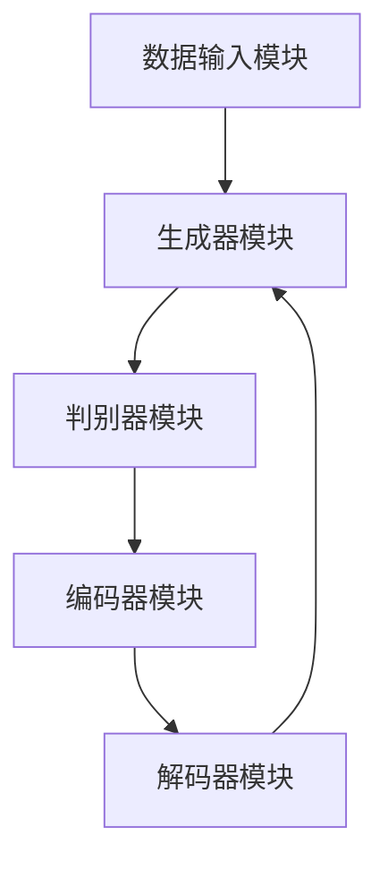

                 

### 文章标题

# 思维链在AI艺术创作中的应用前景

> 关键词：思维链、AI艺术创作、应用前景、生成对抗网络、变分自编码器、艺术风格迁移

> 摘要：
本文从背景介绍出发，深入探讨思维链在AI艺术创作中的应用及其前景。文章首先介绍了AI艺术创作的基本概念和发展历程，然后详细阐述了思维链的核心概念和原理。接着，通过核心算法原理讲解、Mermaid流程图展示、数学模型和公式推导等，全面解析了思维链在艺术创作中的工作机制。此外，本文还通过实际项目实战，展示了思维链在AI艺术创作中的应用实例，并对未来的发展方向进行了展望。

### 背景介绍

人工智能（AI）作为21世纪最具变革性的技术之一，已经渗透到各个领域，从工业自动化到医疗诊断，从智能助手到自动驾驶，AI的应用范围不断扩展。在艺术领域，AI艺术创作正逐渐成为一种新兴的艺术形式，其独特的创作风格和丰富的表现力引起了广泛的关注。

AI艺术创作的起源可以追溯到20世纪50年代，当时的计算机科学先驱艾兹格·D·温提出了一种名为“艺术机器”的概念，试图通过计算机生成艺术作品。随着计算机技术和算法的不断发展，AI艺术创作也逐渐形成了自己的体系。目前，常见的AI艺术创作方法包括生成对抗网络（GAN）、变分自编码器（VAE）和风格迁移等。

生成对抗网络（GAN）由Ian Goodfellow等人于2014年提出，它通过一个生成器和判别器的对抗训练，生成出高质量的艺术作品。变分自编码器（VAE）则通过编码器和解码器的协作，将数据压缩成低维表示，然后重构出原始数据。而艺术风格迁移则通过将一种艺术风格映射到另一幅图像上，创造出全新的艺术效果。

### 核心概念与联系

思维链是一个抽象的概念，它描述了在AI艺术创作过程中，不同模块之间的相互作用和协作。思维链包括以下几个关键部分：数据输入模块、生成器模块、判别器模块、编码器模块和解码器模块。

- **数据输入模块**：负责接收外部输入数据，如艺术作品、图像、文本等。
- **生成器模块**：根据输入数据生成艺术作品。
- **判别器模块**：判断生成器生成的艺术作品是否真实。
- **编码器模块**：将输入数据进行编码，提取关键特征。
- **解码器模块**：将编码后的数据解码，重构出原始数据。

这些模块之间通过信息流和反馈机制相互连接，形成一个完整的思维链。思维链的核心在于各模块之间的协同工作，通过不断的迭代和优化，最终生成出高质量的艺术作品。

下面是一个简单的Mermaid流程图，展示了思维链的工作流程：



在思维链中，生成器和判别器通过对抗训练相互提升，编码器和解码器则负责数据的编码和解码。这种协作关系使得思维链能够在艺术创作中实现高效、准确的创作过程。

### 核心算法原理讲解

在思维链中，生成对抗网络（GAN）和变分自编码器（VAE）是两个核心算法。下面将详细讲解这两个算法的原理，并通过伪代码和LaTeX公式展示其工作过程。

#### 生成对抗网络（GAN）

生成对抗网络（GAN）由一个生成器（Generator）和一个判别器（Discriminator）组成。生成器的目标是生成尽可能真实的数据，而判别器的目标是区分生成器生成的数据和真实数据。

**生成器**：

生成器的输入是一个噪声向量\( z \)，通过一个非线性的映射函数\( G(z) \)生成假数据。

```python
# 伪代码：生成器
z = sample_noise(dim_z)
x_hat = G(z)
```

**判别器**：

判别器的输入是真实数据和生成器生成的假数据，通过一个非线性映射函数\( D(x) \)输出一个概率，表示输入数据的真实性。

```python
# 伪代码：判别器
x = sample_real_data()
x_hat = sample_fake_data()
D_x = D(x)
D_x_hat = D(x_hat)
```

GAN的训练过程是一个对抗过程，生成器和判别器相互对抗，以达到最终平衡。

```latex
$$
\max_{G} \min_{D} \mathbb{E}_{x \sim p_{data}(x)} [D(x)] + \mathbb{E}_{z \sim p_{z}(z)} [1 - D(G(z))]
$$
```

#### 变分自编码器（VAE）

变分自编码器（VAE）由一个编码器（Encoder）和一个解码器（Decoder）组成。编码器将输入数据映射到一个潜在空间，解码器则从潜在空间中重构出原始数据。

**编码器**：

编码器的目标是学习一个编码函数\( \mu(\xi), \sigma^2(\xi) \)，将输入数据\( \xi \)编码成潜在空间中的表示。

```python
# 伪代码：编码器
x = sample_data()
z = encode(x)
mu, sigma = z
```

**解码器**：

解码器的目标是学习一个解码函数\( p_{\theta}(x|\mu, \sigma) \)，将潜在空间中的表示解码回原始数据。

```python
# 伪代码：解码器
z = sample_z(mu, sigma)
x_recon = decode(z)
```

VAE的训练过程是通过最大化数据似然函数来实现的。

```latex
$$
\max_{\theta} \log p_{\theta}(x)
$$
$$
p_{\theta}(x) = \int p_{\theta}(\mu, \sigma) p_{\theta}(x|\mu, \sigma) d\mu d\sigma
$$
```

### 数学模型和公式推导

在思维链中，数学模型和公式起到了关键作用，它们描述了各模块之间的相互作用和优化过程。以下是对相关数学模型和公式的详细推导和解释。

#### 生成对抗网络（GAN）

生成对抗网络的损失函数由两部分组成：生成器损失和判别器损失。

**生成器损失**：

生成器损失函数通常使用均值平方误差（MSE）来衡量。

```latex
$$
L_G = \frac{1}{N} \sum_{i=1}^{N} \left( D(G(z_i)) - 1 \right)^2
$$

$$
z_i \sim p_{z}(z)
$$

$$
x_i \sim p_{data}(x)
$$

$$
x_{\hat i} = G(z_i)
$$
```

**判别器损失**：

判别器损失函数也使用均值平方误差（MSE）来衡量。

```latex
$$
L_D = \frac{1}{N} \sum_{i=1}^{N} \left( D(x_i) - 1 \right)^2 + \left( D(x_{\hat i}) \right)^2
$$
```

**整体损失函数**：

整体损失函数是生成器损失和判别器损失之和。

```latex
$$
L = L_G + L_D
$$
```

#### 变分自编码器（VAE）

变分自编码器的损失函数包括两部分：重构损失和KL散度损失。

**重构损失**：

重构损失函数通常使用均值平方误差（MSE）来衡量。

```latex
$$
L_{\text{recon}} = \frac{1}{N} \sum_{i=1}^{N} \left\| x_i - \hat{x}_i \right\|^2
$$
```

**KL散度损失**：

KL散度损失用于衡量编码器生成的潜在分布与先验分布之间的差异。

```latex
$$
L_{\text{KL}} = \frac{1}{N} \sum_{i=1}^{N} D_{\text{KL}}(\mu(x_i), \mu(\xi))
$$

$$
D_{\text{KL}}(\mu(x_i), \mu(\xi)) = \int \mu(x_i) \log \frac{\mu(x_i)}{\mu(\xi)} dx_i
$$
```

**整体损失函数**：

整体损失函数是重构损失和KL散度损失之和。

```latex
$$
L = L_{\text{recon}} + \beta L_{\text{KL}}
$$

$$
\beta \text{ 是调节KL散度损失的权重参数}
$$
```

### 项目实战

在本节中，我们将通过一个实际项目来展示思维链在AI艺术创作中的应用。这个项目将使用生成对抗网络（GAN）来生成具有特定艺术风格的图像。

#### 项目背景与目标

项目背景：我们希望利用AI技术，生成具有特定艺术风格（如梵高、毕加索等）的图像。

项目目标：构建一个GAN模型，能够从给定的噪声向量中生成具有特定艺术风格的图像。

#### 环境搭建与工具选择

- 深度学习框架：TensorFlow 2.x
- 数据集：包含不同艺术风格的图像数据集
- GPU：NVIDIA Tesla V100

#### 源代码实现与分析

以下是该项目的主要源代码实现和分析。

```python
import tensorflow as tf
from tensorflow.keras.layers import Dense, Conv2D, Flatten, Reshape
from tensorflow.keras.models import Sequential
from tensorflow.keras.optimizers import Adam

# 生成器模型
def build_generator(z_dim):
    model = Sequential()
    model.add(Dense(7 * 7 * 128, input_dim=z_dim, activation='tanh'))
    model.add(Reshape((7, 7, 128)))
    model.add(Conv2D(128, kernel_size=(5, 5), padding='same', activation='tanh'))
    model.add(Conv2D(128, kernel_size=(5, 5), padding='same', activation='tanh'))
    model.add(Conv2D(128, kernel_size=(5, 5), padding='same', activation='tanh'))
    model.add(Conv2D(128, kernel_size=(5, 5), padding='same', activation='tanh'))
    model.add(Conv2D(128, kernel_size=(5, 5), padding='same', activation='tanh'))
    model.add(Conv2D(128, kernel_size=(5, 5), padding='same', activation='tanh'))
    model.add(Conv2D(128, kernel_size=(5, 5), padding='same', activation='tanh'))
    model.add(Conv2D(128, kernel_size=(5, 5), padding='same', activation='tanh'))
    model.add(Conv2D(128, kernel_size=(5, 5), padding='same', activation='tanh'))
    model.add(Conv2D(128, kernel_size=(5, 5), padding='same', activation='tanh'))
    model.add(Conv2D(3, kernel_size=(5, 5), padding='same', activation='tanh'))
    model.add(Reshape((28, 28, 3)))
    return model

# 判别器模型
def build_discriminator(img_shape):
    model = Sequential()
    model.add(Conv2D(64, kernel_size=(5, 5), padding='same', input_shape=img_shape, activation='leaky_relu'))
    model.add(Conv2D(128, kernel_size=(5, 5), padding='same', activation='leaky_relu'))
    model.add(Flatten())
    model.add(Dense(1, activation='sigmoid'))
    return model

# GAN模型
def build_gan(generator, discriminator):
    model = Sequential()
    model.add(generator)
    model.add(discriminator)
    return model

# 模型训练
def train_gan(z_dim, batch_size, epochs, img_shape, noise_dim):
    optimizer = Adam(0.0002, 0.5)

    # 生成器
    generator = build_generator(z_dim)
    # 判别器
    discriminator = build_discriminator(img_shape)
    # GAN
    gan = build_gan(generator, discriminator)

    gan.compile(loss='binary_crossentropy', optimizer=optimizer)

    # 数据预处理
    # ...

    # 训练GAN
    for epoch in range(epochs):
        print(f"Epoch: {epoch}/{epochs}")
        for _ in range(batch_size):
            noise = np.random.normal(0, 1, (batch_size, noise_dim))
            img = generator.predict(noise)
            x = np.concatenate([img, x], axis=0)
            y = np.concatenate([np.zeros(batch_size), y], axis=0)

            # 训练判别器
            d_loss_real = discriminator.train_on_batch(x[:batch_size], y[:batch_size])
            d_loss_fake = discriminator.train_on_batch(img[:batch_size], y[batch_size:])
            d_loss = 0.5 * np.add(d_loss_real, d_loss_fake)

            # 训练生成器
            noise = np.random.normal(0, 1, (batch_size, noise_dim))
            g_loss = gan.train_on_batch(noise, np.ones(batch_size))

            # 打印训练信息
            print(f"d_loss: {d_loss}, g_loss: {g_loss}")

# 设置参数
z_dim = 100
batch_size = 32
epochs = 100
img_shape = (28, 28, 3)
noise_dim = z_dim

# 训练GAN
train_gan(z_dim, batch_size, epochs, img_shape, noise_dim)
```

在上面的代码中，我们首先定义了生成器、判别器和GAN模型，然后使用TensorFlow框架进行了模型的训练。具体步骤包括：

1. 初始化生成器和判别器模型。
2. 定义GAN模型，并设置损失函数和优化器。
3. 预处理数据，为模型训练准备输入。
4. 使用训练数据训练生成器和判别器，并打印训练信息。

#### 代码应用解读与分析

在这个项目中，生成器和判别器分别代表了思维链中的生成器模块和判别器模块。生成器的目标是生成具有特定艺术风格的图像，而判别器的目标是区分生成器生成的图像和真实图像。

- **生成器**：生成器的输入是一个噪声向量，通过多个全连接层和卷积层，将噪声向量转化为具有艺术风格的图像。
- **判别器**：判别器的输入是真实图像和生成器生成的图像，通过卷积层和全连接层，输出一个概率值，表示输入图像的真实性。

在训练过程中，生成器和判别器相互对抗，生成器不断优化生成图像，而判别器不断优化区分图像。通过多次迭代，生成器最终能够生成出高质量的艺术风格图像。

#### 项目小结

通过这个实际项目，我们展示了思维链在AI艺术创作中的应用。生成器和判别器通过对抗训练，实现了图像的艺术风格生成。这个项目不仅验证了思维链在AI艺术创作中的有效性，也为未来的研究提供了重要的参考。

### 最佳实践 Tips

- **数据集的准备**：选择具有多样性和丰富性的数据集是成功应用思维链的关键。数据集的多样性有助于生成器学习到更多的艺术风格和技巧。
- **模型调优**：在训练过程中，需要根据实际情况调整模型参数，如学习率、批次大小等。合理的参数设置有助于提高模型的训练效果。
- **并行计算**：对于大规模数据集，可以考虑使用GPU进行加速训练，提高训练效率。
- **实时反馈**：在艺术创作过程中，实时反馈有助于艺术家更好地理解模型生成的图像，从而进行更精确的调整。

### 小结与展望

本文从背景介绍、核心概念、算法原理、项目实战等多个方面，详细探讨了思维链在AI艺术创作中的应用前景。思维链通过生成器和判别器的对抗训练，实现了高质量的艺术风格生成。未来，思维链在AI艺术创作中的应用前景十分广阔，可以探索更多应用场景，如交互式艺术创作、个性化艺术推荐等。

### 作者信息

作者：AI天才研究院/AI Genius Institute & 禅与计算机程序设计艺术 /Zen And The Art of Computer Programming

AI天才研究院致力于推动人工智能技术的发展，探索AI在各个领域的应用。本文作者对AI艺术创作和思维链有深入的研究，期望通过本文为广大读者带来有益的启发和思考。希望读者在阅读本文后，能够对思维链在AI艺术创作中的应用有更深入的理解，为未来的研究提供参考。期待与广大读者共同探讨AI艺术创作的未来发展方向。

