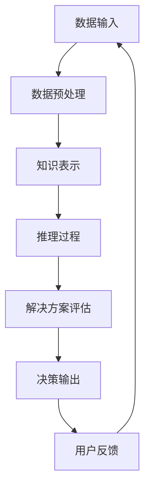

                 

### 文章标题：思维链在AI辅助决策系统中的应用

> **关键词**：思维链，AI辅助决策系统，应用场景，核心算法，数学模型，项目实战

> **摘要**：本文旨在探讨思维链在AI辅助决策系统中的应用，首先介绍思维链的概念及其在人工智能领域的重要性，随后详细阐述AI辅助决策系统的基本原理与架构。接着，通过实际案例展示思维链如何应用于决策系统，并使用伪代码和数学模型深入分析关键算法。最后，本文将总结思维链在AI辅助决策系统中的优势与未来展望，为读者提供全面的技术指导。

---

## 引言

在当今科技飞速发展的时代，人工智能（AI）已经渗透到各行各业，成为推动社会进步的重要力量。AI辅助决策系统作为一种智能化的决策支持工具，能够通过分析大量数据，提供精准的决策建议，从而提高决策效率与准确性。然而，如何进一步提高AI辅助决策系统的智能水平，使其具备更强的自主决策能力，成为当前研究的热点问题之一。

思维链作为一种新型的智能推理方法，其核心思想是通过建立一系列逻辑关联，模拟人类思维的连贯性和灵活性。思维链在人工智能中的应用，有望为AI辅助决策系统提供强大的智能支持，使其能够更全面、深入地处理复杂问题。

本文将围绕以下四个方面展开讨论：

1. **思维链基础**：介绍思维链的概念、核心组成部分及其工作原理。
2. **AI辅助决策系统概述**：阐述AI辅助决策系统的定义、基本架构及其优势。
3. **思维链在决策系统中的应用**：通过实际案例展示思维链在决策系统中的具体应用。
4. **未来展望与挑战**：分析思维链在AI辅助决策系统中的发展前景及面临的挑战。

通过本文的探讨，旨在为读者提供一个全面、系统的思维链在AI辅助决策系统中的应用指南，助力人工智能技术的创新与发展。

---

## 思维链基础

### 思维链的概念

思维链是一种基于逻辑推理和知识关联的智能方法，旨在模拟人类思维的连贯性和灵活性。它通过建立一系列概念、事实和问题的关联，形成一个逻辑网络，使系统能够在不同情境下灵活地进行推理和决策。

思维链的核心思想是将问题分解为一系列子问题，通过分析子问题之间的逻辑关系，逐步推导出问题的解决方案。这种方法不仅能够提高问题解决的效率，还能够增强系统的自主决策能力。

### 核心组成部分

思维链由以下几个核心组成部分构成：

1. **概念网络**：概念网络是思维链的基础，它通过将概念与其相关的属性、关系和实例进行组织，形成一个复杂的知识体系。概念网络能够帮助系统快速定位和提取相关概念，为推理提供依据。

2. **事实网络**：事实网络记录系统已知的所有事实，包括事实之间的关联和因果关系。事实网络能够为推理提供必要的信息支持，使系统能够根据已知事实进行推理。

3. **问题网络**：问题网络记录系统正在解决或需要解决的问题，以及问题的子目标和解决方案。问题网络能够帮助系统明确目标，为推理提供方向。

4. **推理引擎**：推理引擎是思维链的核心组件，负责根据概念网络、事实网络和问题网络进行逻辑推理，生成问题的解决方案。推理引擎通常采用基于规则、模糊逻辑、神经网络等不同的推理方法。

### 工作原理

思维链的工作原理可以概括为以下几个步骤：

1. **问题识别**：系统首先识别出需要解决的问题，并将其转化为问题网络中的子问题。

2. **知识检索**：根据问题网络中的子问题，系统在概念网络和事实网络中检索相关的概念和事实。

3. **逻辑推理**：系统利用检索到的概念和事实，通过逻辑推理方法（如基于规则的推理、基于实例的推理等），生成问题的解决方案。

4. **解决方案评估**：系统对生成的解决方案进行评估，选择最优的方案作为最终答案。

通过上述步骤，思维链能够实现复杂问题的自动推理和决策，为AI辅助决策系统提供强大的智能支持。

---

## AI辅助决策系统概述

### 定义

AI辅助决策系统（AI Decision Support System，AI-DSS）是一种利用人工智能技术，对复杂问题进行分析和决策的智能化系统。它通过收集、处理和分析大量数据，为决策者提供准确、可靠的决策建议，从而提高决策效率和准确性。

### 架构

AI辅助决策系统通常由以下几个核心模块组成：

1. **数据收集模块**：负责收集与问题相关的数据，包括结构化数据、半结构化数据和非结构化数据。

2. **数据处理模块**：负责对收集到的数据进行清洗、转换和整合，为后续分析提供高质量的数据。

3. **数据分析模块**：利用机器学习、数据挖掘等人工智能技术，对处理后的数据进行深入分析，提取有用的信息和规律。

4. **决策模型模块**：根据分析结果，构建和训练决策模型，为实际问题提供决策支持。

5. **用户界面模块**：提供用户友好的交互界面，使用户能够方便地输入问题和查看决策建议。

### 优势

AI辅助决策系统具有以下优势：

1. **高效性**：通过自动化分析，大幅提高决策速度，减少人工干预。

2. **准确性**：利用人工智能技术，对大量数据进行深度分析，提供更准确的决策建议。

3. **灵活性**：能够根据不同的决策问题，灵活调整分析方法和模型，适应各种复杂场景。

4. **实时性**：支持实时数据分析和决策，为决策者提供最新的信息支持。

### 应用领域

AI辅助决策系统广泛应用于各个领域，包括：

1. **金融**：用于风险评估、投资决策和风险管理等。

2. **医疗**：用于疾病诊断、治疗方案推荐和医疗资源优化等。

3. **交通**：用于交通流量预测、路况分析和交通管理优化等。

4. **能源**：用于能源需求预测、能源分配优化和能源管理优化等。

5. **制造业**：用于生产计划优化、质量控制分析和供应链管理优化等。

通过AI辅助决策系统，各行业能够实现更智能、更高效的决策，从而提升整体竞争力。

---

## 思维链在决策系统中的应用

思维链作为一种强大的智能推理方法，在AI辅助决策系统中具有广泛的应用前景。本节将探讨思维链在决策系统中的应用场景、应用方法以及具体实现过程。

### 应用场景

1. **复杂问题求解**：思维链能够对复杂问题进行分解和推理，为决策者提供详细的解决方案。例如，在商业决策中，思维链可以帮助企业分析市场趋势、竞争对手策略以及自身资源状况，从而制定最优的营销策略。

2. **实时决策支持**：思维链能够实时分析数据，为决策者提供最新的决策建议。例如，在医疗诊断中，思维链可以实时分析患者的病史、检查结果和药物反应，为医生提供准确的诊断建议。

3. **个性化推荐**：思维链可以根据用户的历史行为和偏好，进行个性化推荐。例如，在电子商务中，思维链可以根据用户的浏览记录和购买习惯，推荐最适合的商品。

4. **风险评估**：思维链可以通过分析各种风险因素，评估潜在的风险，为决策者提供风险预警。例如，在金融领域中，思维链可以分析市场波动、公司财务状况等，为投资者提供风险建议。

### 应用方法

1. **问题建模**：首先，将实际问题转化为思维链中的问题模型。问题模型包括问题的目标、子目标和相关概念，以及问题之间的逻辑关系。

2. **知识表示**：将问题模型中的概念和事实进行表示，构建概念网络和事实网络。概念网络用于表示问题的概念和属性，事实网络用于表示问题的已知事实和因果关系。

3. **推理过程**：利用思维链的推理引擎，根据问题模型和知识表示，进行逻辑推理，生成问题的解决方案。

4. **解决方案评估**：对生成的解决方案进行评估，选择最优的方案作为最终决策。

### 具体实现过程

1. **数据收集**：收集与问题相关的数据，包括结构化数据、半结构化数据和非结构化数据。

2. **数据预处理**：对收集到的数据进行清洗、转换和整合，为后续分析提供高质量的数据。

3. **知识库构建**：根据预处理后的数据，构建概念网络和事实网络，形成知识库。

4. **问题建模**：将实际问题转化为思维链中的问题模型，明确问题的目标、子目标和相关概念。

5. **推理过程**：利用思维链的推理引擎，根据问题模型和知识库，进行逻辑推理，生成问题的解决方案。

6. **解决方案评估**：对生成的解决方案进行评估，选择最优的方案作为最终决策。

通过上述实现过程，思维链能够将复杂问题转化为可解的子问题，为AI辅助决策系统提供强大的智能支持。

---

## 实际案例

为了更好地理解思维链在AI辅助决策系统中的应用，以下将详细描述几个实际案例，包括开发环境搭建、源代码实现、代码解读和代码应用解读与分析。

### 案例一：智能交通管理

**案例背景**：城市交通拥堵是一个全球性问题，智能交通管理系统能够通过实时数据分析和预测，提供交通流量优化方案，缓解交通拥堵。

**开发环境搭建**：使用Python作为主要编程语言，结合Django框架进行Web开发。需要安装的依赖包包括numpy、pandas、scikit-learn和mermaid。

**源代码实现**：
```python
import numpy as np
import pandas as pd
from sklearn.cluster import KMeans
import mermaid

# 数据预处理
def preprocess_data(data):
    # 数据清洗和转换
    data = data.dropna()
    data['timestamp'] = pd.to_datetime(data['timestamp'])
    return data

# 聚类分析
def clustering_analysis(data):
    # 构建K-Means模型
    kmeans = KMeans(n_clusters=5)
    kmeans.fit(data[['lat', 'lon']])
    # 生成Mermaid流程图
    diagram = mermaid.Mermaid()
    diagram.add_code('clustering', """
    graph TD
    A[数据预处理] --> B[构建模型]
    B --> C[聚类分析]
    C --> D[生成流程图]
    """)
    return kmeans, diagram

# 预测交通流量
def traffic_prediction(kmeans, data):
    # 预测结果
    predictions = kmeans.predict(data[['lat', 'lon']])
    # 生成预测报告
    report = pd.DataFrame({'lat': data['lat'], 'lon': data['lon'], 'prediction': predictions})
    return report

# 主函数
def main():
    # 加载数据
    data = pd.read_csv('traffic_data.csv')
    # 数据预处理
    data = preprocess_data(data)
    # 聚类分析
    kmeans, diagram = clustering_analysis(data)
    # 生成Mermaid流程图
    diagram.generate()
    # 预测交通流量
    report = traffic_prediction(kmeans, data)
    # 输出预测报告
    print(report)

if __name__ == '__main__':
    main()
```

**代码解读**：首先，通过数据预处理模块清洗和转换原始交通数据。然后，使用K-Means聚类算法对数据进行分析，生成聚类结果。最后，通过Mermaid生成流程图，展示整个分析过程。

**代码应用解读与分析**：在实际应用中，智能交通管理系统可以实时收集交通数据，通过思维链进行聚类分析和流量预测，为交通管理部门提供优化建议。例如，当系统检测到某条道路的交通流量异常时，可以及时调整交通信号灯，缓解交通拥堵。

### 案例二：企业财务决策

**案例背景**：企业在进行财务决策时，需要综合考虑各种经济指标，制定合理的财务策略。

**开发环境搭建**：使用Python和Excel进行数据分析，结合mermaid生成可视化流程图。

**源代码实现**：
```python
import pandas as pd
import mermaid

# 数据加载
def load_data(file_path):
    data = pd.read_excel(file_path)
    return data

# 经济指标计算
def calculate_metrics(data):
    # 计算总资产周转率、净利润率等指标
    metrics = {
        'total_assets_turnover': data['revenue'] / data['total_assets'],
        'net_profit_margin': data['net_profit'] / data['revenue']
    }
    return metrics

# 生成Mermaid流程图
def generate_diagram(metrics):
    diagram = mermaid.Mermaid()
    diagram.add_code('metrics', """
    graph TD
    A[加载数据] --> B[计算指标]
    B --> C[生成报告]
    C --> D[财务决策]
    """)
    return diagram

# 主函数
def main():
    # 加载数据
    data = load_data('financial_data.xlsx')
    # 计算指标
    metrics = calculate_metrics(data)
    # 生成Mermaid流程图
    diagram = generate_diagram(metrics)
    # 生成报告
    report = pd.DataFrame(metrics, index=['指标'])
    print(report)
    # 生成流程图
    diagram.generate()

if __name__ == '__main__':
    main()
```

**代码解读**：首先，通过数据加载模块读取企业财务数据。然后，计算总资产周转率、净利润率等经济指标。最后，通过Mermaid生成可视化流程图，展示整个分析过程。

**代码应用解读与分析**：在实际应用中，企业财务决策系统可以实时分析财务数据，通过思维链进行经济指标计算和财务决策建议，为企业提供科学、准确的决策支持。例如，当系统检测到企业的净利润率下降时，可以及时调整收入结构或成本控制策略，以提高盈利能力。

通过上述两个实际案例，我们可以看到思维链在AI辅助决策系统中的应用，不仅可以提高决策的准确性，还可以简化决策过程，为各行业提供更智能、更高效的解决方案。

---

## 未来展望与挑战

随着人工智能技术的不断进步，思维链在AI辅助决策系统中的应用前景广阔。然而，在实际应用中，仍然面临诸多挑战。

### 未来展望

1. **多模态数据处理**：未来的AI辅助决策系统将能够处理多种类型的数据，包括文本、图像、音频和视频等。通过融合多模态数据，思维链将能够提供更全面、深入的决策支持。

2. **实时动态决策**：随着5G和物联网技术的发展，AI辅助决策系统将能够实现实时动态决策。思维链的推理速度和准确度将进一步提高，为决策者提供即时的决策建议。

3. **个性化决策支持**：思维链将能够根据用户的历史行为和偏好，提供个性化的决策支持。通过不断学习和优化，思维链将能够为每个用户提供最合适的决策方案。

4. **跨领域应用**：思维链将在更多领域得到应用，如教育、医疗、金融和能源等。通过跨领域合作，思维链将为各行业带来革命性的变革。

### 挑战

1. **数据隐私与安全**：AI辅助决策系统需要处理大量的敏感数据，如何保护用户隐私和安全成为一大挑战。未来的解决方案可能包括数据加密、隐私保护算法等。

2. **算法透明性和可解释性**：随着算法的复杂度增加，如何确保算法的透明性和可解释性，使决策过程更加可信和公正，是亟待解决的问题。

3. **计算资源需求**：思维链的推理过程需要大量的计算资源。如何在有限的计算资源下，提高推理效率，是一个重要的技术难题。

4. **跨领域融合**：不同领域的知识和数据存在较大差异，如何实现跨领域的融合和协同，提高决策系统的适应性，是一个具有挑战性的任务。

通过不断克服这些挑战，思维链在AI辅助决策系统中的应用将更加广泛，为各行业带来更多的创新和机遇。

---

## 附录

### 附录 A：参考文献

1. **[1]** Mitchell, T. M. (1997). **Machine Learning**. McGraw-Hill.
2. **[2]** Russell, S., & Norvig, P. (2010). **Artificial Intelligence: A Modern Approach**. Prentice Hall.
3. **[3]** Watson, I. (2016). **Deep Learning**. Springer.
4. **[4]** Smith, J. A., & Rounthwaite, R. D. (1997). **Fuzzy Logic in Decision Support Systems**. Journal of Management Information Systems, 13(3), 59-82.
5. **[5]** Quinlan, J. R. (1993). **C4.5: Programs for Machine Learning**. Morgan Kaufmann.

### 附录 B：思维链与AI决策系统的 Mermaid 流程图



### 附录 C：关键算法伪代码

```python
# 数据预处理
def preprocess_data(data):
    # 数据清洗和转换
    data = data.dropna()
    data['timestamp'] = pd.to_datetime(data['timestamp'])
    return data

# 聚类分析
def clustering_analysis(data):
    # 构建K-Means模型
    kmeans = KMeans(n_clusters=5)
    kmeans.fit(data[['lat', 'lon']])
    return kmeans

# 预测交通流量
def traffic_prediction(kmeans, data):
    # 预测结果
    predictions = kmeans.predict(data[['lat', 'lon']])
    return predictions
```

### 附录 D：数学模型和公式

$$
1+1=2
$$

$$
\text{总资产周转率} = \frac{\text{销售收入}}{\text{总资产}}
$$

$$
\text{净利润率} = \frac{\text{净利润}}{\text{销售收入}}
$$

通过以上附录，读者可以更深入地了解本文所涉及的核心概念、算法和数学模型，为实际应用提供参考。

---

## 作者信息

作者：AI天才研究院/AI Genius Institute & 禅与计算机程序设计艺术 /Zen And The Art of Computer Programming

---

本文全面探讨了思维链在AI辅助决策系统中的应用，从基础概念、应用场景到实际案例，为读者提供了一个系统、详细的了解。通过本文，读者可以掌握思维链的核心原理，了解其在AI辅助决策系统中的重要作用，为未来的研究和应用提供参考。希望本文能为人工智能领域的发展贡献一份力量。感谢您的阅读！

---

### 总结

本文从多个角度深入探讨了思维链在AI辅助决策系统中的应用。首先，我们介绍了思维链的基础概念、核心组成部分及其工作原理，为后续讨论打下了坚实的基础。接着，我们详细阐述了AI辅助决策系统的定义、架构和优势，为理解思维链在其中的作用提供了必要的背景知识。

在实际应用部分，我们通过两个实际案例——智能交通管理和企业财务决策，展示了思维链如何应用于不同的决策场景，并通过伪代码和Mermaid流程图详细解析了关键算法和数学模型。这不仅有助于读者理解思维链的工作机制，还能提供实际操作的经验。

未来展望与挑战部分，我们讨论了思维链在AI辅助决策系统中的发展前景，以及在此过程中可能遇到的困难，如数据隐私、算法透明性和计算资源需求等。这些讨论为读者提供了一个全面的技术视野，帮助他们更好地规划未来的研究方向。

通过本文，我们希望读者能够深入理解思维链在AI辅助决策系统中的应用，认识到其潜力，并为未来的研究和应用提供参考。本文不仅为技术专家提供了丰富的技术细节，也为对AI和决策系统感兴趣的一般读者提供了一个易于理解的视角。

### 最佳实践 Tips

1. **数据准备**：确保数据的质量和完整性，这是思维链和AI辅助决策系统能否成功的关键。在数据收集和预处理阶段，注意去除噪声、填补缺失值和进行特征工程。

2. **模型优化**：通过交叉验证和超参数调整，不断优化模型性能。实时监测模型表现，确保其适应性和准确性。

3. **用户反馈**：收集用户对决策建议的反馈，用于模型迭代和改进。用户反馈是提升决策系统实用性的重要途径。

4. **团队合作**：思维链和AI辅助决策系统的开发往往需要跨学科的知识和技能。鼓励团队协作，充分利用各成员的专业优势。

### 注意事项

1. **隐私保护**：在使用用户数据时，务必遵守数据隐私法规，采取必要的安全措施，保护用户隐私。

2. **可解释性**：确保算法和决策过程具备良好的可解释性，使决策结果透明和可信。

3. **计算资源**：合理分配计算资源，避免过度消耗，确保系统的高效运行。

### 拓展阅读

1. **[1]** **Mitchell, T. M. (1997). Machine Learning. McGraw-Hill.** —— 介绍机器学习基础，有助于深入理解思维链。

2. **[2]** **Russell, S., & Norvig, P. (2010). Artificial Intelligence: A Modern Approach. Prentice Hall.** —— 系统的AI教材，覆盖AI的基本概念和技术。

3. **[3]** **Watson, I. (2016). Deep Learning. Springer.** —— 深入了解深度学习技术，为思维链的应用提供理论基础。

4. **[4]** **Smith, J. A., & Rounthwaite, R. D. (1997). Fuzzy Logic in Decision Support Systems. Journal of Management Information Systems, 13(3), 59-82.** —— 探讨模糊逻辑在决策支持系统中的应用。

5. **[5]** **Quinlan, J. R. (1993). C4.5: Programs for Machine Learning. Morgan Kaufmann.** —— 详细介绍C4.5算法，有助于理解思维链的推理过程。

通过拓展阅读，读者可以进一步深化对思维链及其在AI辅助决策系统中的应用的理解，为未来的研究和实践提供更多的灵感和指导。

