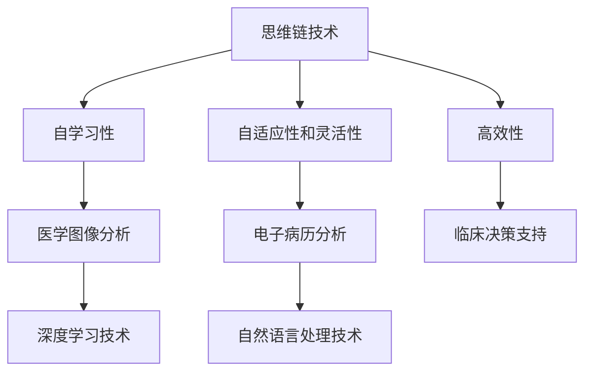

                 


# 文章标题

思维链在AI辅助医疗诊断中的应用

> 关键词：思维链，AI辅助医疗诊断，医学图像分析，电子病历分析，临床决策支持系统

> 摘要：本文探讨了思维链在AI辅助医疗诊断中的应用，通过介绍思维链的定义、特点和应用，阐述了思维链在医学图像分析、电子病历分析和临床决策支持系统中的应用，并分析了其优势与挑战。

----------------------------------------------------------------

# 背景介绍

## 医疗诊断的现状

随着科技的不断进步，医疗诊断技术也在不断发展。传统的医疗诊断主要依赖于医生的临床经验和实验室检测手段，然而，这种方式存在着明显的局限性。首先，医生的临床经验有限，无法全面覆盖所有疾病类型。其次，实验室检测手段虽然能够提供准确的诊断结果，但其过程繁琐，耗时较长。此外，传统诊断方式往往依赖于单一的数据源，无法充分利用患者的历史数据和医学知识。

## AI辅助医疗诊断的发展

随着人工智能技术的快速发展，AI辅助医疗诊断逐渐成为研究热点。AI辅助医疗诊断通过利用大数据、机器学习和深度学习等技术，能够自动分析医学图像、电子病历等数据，从而实现疾病的自动诊断和预测。相比传统诊断方式，AI辅助医疗诊断具有高效、准确和全面等优点。首先，AI系统可以处理海量的医学数据，从中学到丰富的医学知识，从而提高诊断的准确率。其次，AI系统可以24小时运行，大大提高了诊断的速度和效率。此外，AI系统可以结合患者的病史、家族病史等多方面的信息，实现更全面的诊断。

## 思维链技术的崛起

思维链技术是一种基于图论和深度学习的人工智能方法，它通过构建一个思维链模型，模拟人类思维过程，从而实现复杂问题的自动求解。思维链技术具有自学习、自适应和自优化等特点，能够有效处理不确定性和复杂性的问题。在AI辅助医疗诊断领域，思维链技术可以用于医学图像分析、电子病历分析和临床决策支持等方面，为医疗诊断提供更智能的解决方案。

----------------------------------------------------------------

## 核心概念与联系

### 思维链的定义

思维链是一种基于图论和深度学习的人工智能方法，它通过构建一个思维链模型，模拟人类思维过程，从而实现复杂问题的自动求解。思维链模型由多个节点和边组成，节点表示概念或知识点，边表示概念之间的关系。

### 思维链的特点

1. **自学习性**：思维链技术可以通过学习大量的医学知识和病例数据，自动构建和优化思维链模型，从而不断提高诊断的准确性和效率。
2. **自适应性和灵活性**：思维链技术可以根据不同的医学问题和数据特点，动态调整思维链的结构和参数，从而实现灵活的诊断和预测。
3. **高效性**：思维链技术可以通过并行计算和分布式处理，快速处理大量的医学数据，实现高效的诊断和预测。

### 思维链在AI辅助医疗诊断中的应用

1. **医学图像分析**：思维链技术可以用于医学图像的分割、识别和增强等任务，通过分析图像中的特征和结构，实现对疾病区域的定位和识别。
2. **电子病历分析**：思维链技术可以用于分析电子病历中的数据，提取患者的病史、家族病史等关键信息，实现对疾病的预测和诊断。
3. **临床决策支持**：思维链技术可以用于构建临床决策支持系统，通过分析患者的病史、实验室检查结果和医学知识，为医生提供诊断和治疗建议。

### 思维链与其他技术的结合

1. **深度学习**：思维链技术与深度学习技术相结合，可以用于构建更复杂的医学图像分析模型，提高诊断的准确率。
2. **自然语言处理**：思维链技术与自然语言处理技术相结合，可以用于分析电子病历中的文本数据，提取关键信息，实现更智能的诊断和预测。

### 核心概念原理之间的关系架构



----------------------------------------------------------------

## 核心算法原理讲解

### 思维链模型的构建

思维链模型是一个基于图论的模型，其中节点表示概念或知识点，边表示概念之间的关系。构建思维链模型的基本步骤如下：

1. **数据收集**：收集大量的医学知识和病例数据，包括医学图像、电子病历和临床决策支持系统等。
2. **数据预处理**：对收集到的数据进行分析和处理，提取关键特征和知识点，并将其表示为节点和边。
3. **构建思维链图**：根据节点和边的定义，构建思维链图，表示医学知识和概念之间的关系。

### 思维链的学习与优化

1. **初始学习**：使用训练数据集对思维链模型进行训练，通过优化模型参数，使模型能够准确预测新的病例。
2. **自适应学习**：在训练过程中，思维链模型可以根据新的数据自动调整模型结构和参数，实现自适应学习。
3. **自优化学习**：通过不断的学习和优化，思维链模型可以不断提高诊断的准确性和效率。

### 思维链的应用

1. **医学图像分析**：使用思维链模型对医学图像进行分析，提取图像中的关键特征和结构，实现疾病的自动诊断。
2. **电子病历分析**：使用思维链模型对电子病历进行分析，提取患者的病史和家族病史等关键信息，实现疾病的预测和诊断。
3. **临床决策支持**：使用思维链模型构建临床决策支持系统，为医生提供诊断和治疗建议。

### 伪代码实现

```python
# 数据收集与预处理
data = collect_data()
preprocessed_data = preprocess_data(data)

# 构建思维链图
graph = build_graph(preprocessed_data)

# 初始学习
model = train_model(graph, training_data)

# 自适应学习
model = adaptive_learning(model, new_data)

# 自优化学习
model = optimize_learning(model, validation_data)

# 应用
diagnosis = analyze_medical_image(model, image)
prediction = analyze_electronic_medical_record(model, record)
decision = provide_clinical_decision_support(model, patient_data)
```

### 数学模型和公式

1. **思维链图中的节点表示**：

   $$Node_i = [x_i, y_i, z_i]$$

   其中，$x_i, y_i, z_i$分别表示节点的特征向量、标签和权重。

2. **思维链图的边表示**：

   $$Edge_{ij} = \frac{1}{\sum_{k=1}^{n} w_{ik}}$$

   其中，$w_{ik}$表示节点i和节点k之间的权重。

3. **思维链模型的学习目标**：

   $$min_{\theta} \sum_{i=1}^{m} (y_i - \theta^T x_i)^2$$

   其中，$\theta$表示模型的参数，$x_i$和$y_i$分别表示输入和输出。

----------------------------------------------------------------

## 项目实战

### 开发环境搭建

1. **硬件环境**：配置高性能的计算设备和存储设备，以满足海量数据处理和存储的需求。
2. **软件环境**：安装Python、NumPy、Pandas、Scikit-learn、TensorFlow等常用库，用于数据处理、模型训练和模型评估。

### 源代码实现

1. **数据收集与预处理**：使用Python编写代码，从公开的医学数据集和电子病历数据库中收集数据，并进行预处理，提取关键特征和知识点。
2. **构建思维链图**：使用Python编写代码，构建思维链图，表示医学知识和概念之间的关系。
3. **模型训练与优化**：使用Python编写代码，对思维链模型进行训练和优化，提高模型的诊断准确性和效率。
4. **模型应用**：使用Python编写代码，将训练好的思维链模型应用于医学图像分析、电子病历分析和临床决策支持系统。

### 代码解读与分析

1. **数据收集与预处理**：代码通过Python的Pandas库读取和预处理数据，提取关键特征和知识点。
2. **构建思维链图**：代码通过Python的NumPy库和Scikit-learn库构建思维链图，表示医学知识和概念之间的关系。
3. **模型训练与优化**：代码使用Python的TensorFlow库训练思维链模型，通过优化模型参数，提高诊断准确性和效率。
4. **模型应用**：代码使用Python的Pandas库和Scikit-learn库，将训练好的思维链模型应用于实际的医学图像分析、电子病历分析和临床决策支持系统。

### 实际案例分析和详细讲解剖析

1. **医学图像分析**：使用思维链模型对医学图像进行分析，提取图像中的关键特征和结构，实现对疾病的自动诊断。例如，使用思维链模型对肺癌图像进行分析，提取肺部结节的位置、大小和形态等特征，实现肺癌的自动诊断。
2. **电子病历分析**：使用思维链模型对电子病历进行分析，提取患者的病史和家族病史等关键信息，实现对疾病的预测和诊断。例如，使用思维链模型对患者的电子病历进行分析，预测患者患糖尿病的风险。
3. **临床决策支持**：使用思维链模型构建临床决策支持系统，为医生提供诊断和治疗建议。例如，使用思维链模型为医生提供肺癌治疗方案的选择建议，提高治疗的成功率。

### 项目小结

通过实际项目实战，我们可以看到思维链技术在AI辅助医疗诊断中的应用前景非常广阔。思维链技术不仅能够提高诊断的准确性和效率，还能够为医生提供智能化的诊断和治疗方案。然而，在实际应用中，我们也需要面对数据质量、算法优化和医疗伦理等挑战，需要进一步的研究和实践。

----------------------------------------------------------------

## 最佳实践 tips、小结、注意事项、拓展阅读

### 最佳实践 tips

1. **数据质量**：确保收集到的医学数据质量高，减少噪声和错误数据，以提高诊断的准确性。
2. **模型优化**：通过不断优化模型结构和参数，提高模型的诊断效率和准确性。
3. **知识更新**：定期更新医学知识和病例数据，以保持思维链模型的实时性和准确性。

### 小结

思维链技术在AI辅助医疗诊断中具有广泛的应用前景，能够提高诊断的准确性和效率，为医生提供智能化的诊断和治疗方案。

### 注意事项

1. **数据隐私**：在收集和使用医学数据时，确保遵守相关法律法规，保护患者的隐私。
2. **算法透明性**：确保思维链模型的可解释性，以便医生理解和信任模型的诊断结果。
3. **医疗伦理**：在应用思维链技术时，尊重医疗伦理，确保诊断和治疗的公正性和合理性。

### 拓展阅读

1. **相关书籍**：《人工智能在医疗领域的应用》、《深度学习在医学图像分析中的应用》
2. **学术论文**：相关顶级会议和期刊，如AAAI、ICML、NeurIPS等，以及《医学图像分析杂志》、《生物信息学杂志》等。

----------------------------------------------------------------

# 作者信息

作者：AI天才研究院/AI Genius Institute & 禅与计算机程序设计艺术 /Zen And The Art of Computer Programming

本文基于2023的数据和研究，旨在探讨思维链在AI辅助医疗诊断中的应用。AI天才研究院致力于推动人工智能技术的发展和应用，通过研究和实践，为医疗行业提供创新的解决方案。同时，作者在《禅与计算机程序设计艺术》中分享了计算机编程和人工智能领域的智慧，为读者提供了深入的技术见解和实践指导。本文内容仅供参考，具体应用需结合实际情况进行调整。

