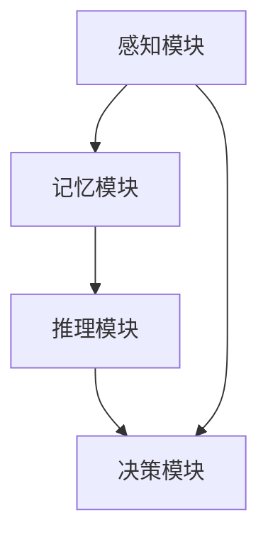

                 

### 文章标题

# 思维链在AI辅助科学发现中的突破性应用

> 关键词：思维链，AI辅助科学发现，突破性应用，科学发现，未来趋势

> 摘要：本文将探讨思维链在AI辅助科学发现中的突破性应用。首先，我们将介绍思维链的定义与基本原理，然后分析思维链与AI的关系及其在科学发现中的应用。通过几个实际案例，我们将展示思维链在AI辅助科学发现中的突破性应用。最后，我们将讨论思维链AI面临的挑战及其未来发展。

### 引言

在科学发现的进程中，人工智能（AI）扮演着越来越重要的角色。AI技术不仅提高了数据处理和分析的效率，还拓展了科学家的视野，使得以前无法解决的问题变得可解。然而，传统的AI技术往往依赖于大量的数据和复杂的算法，这在某些情况下限制了其应用范围。近年来，思维链这一概念在AI领域引起了广泛关注，它为AI在科学发现中的应用提供了新的思路。

思维链是一种基于人类思维模式的计算模型，它能够模拟人类的推理、决策和学习过程。与传统的AI算法相比，思维链更加灵活，能够处理复杂的不确定性问题和非线性的问题。因此，思维链在AI辅助科学发现中具有巨大的潜力。

本文将首先介绍思维链的定义与基本原理，然后分析思维链与AI的关系及其在科学发现中的应用。通过几个实际案例，我们将展示思维链在AI辅助科学发现中的突破性应用。最后，我们将讨论思维链AI面临的挑战及其未来发展。

### 思维链的定义与基本原理

#### 思维链的概念

思维链是一种计算模型，旨在模拟人类的思维过程。它通过一系列逻辑推理和知识整合，实现对问题的求解和决策。思维链的核心思想是将人类思维过程抽象为一系列的计算步骤，这些步骤包括感知、记忆、推理、决策等。

思维链的基本组成包括：

- **感知模块**：负责接收外部信息，如文字、图像、声音等。
- **记忆模块**：存储和管理感知模块接收到的信息。
- **推理模块**：基于已有的知识和信息进行推理和决策。
- **决策模块**：根据推理结果做出决策。

#### 思维链的工作原理

思维链的工作原理可以分为以下几个步骤：

1. **信息感知**：感知模块接收外部信息，并将其转换为内部表示。
2. **信息记忆**：记忆模块存储感知模块接收到的信息，以便后续使用。
3. **信息推理**：推理模块利用已有的知识和信息进行推理，生成新的结论。
4. **信息决策**：决策模块根据推理结果做出决策，指导后续行为。

#### 思维链的优势

与传统的AI算法相比，思维链具有以下几个优势：

- **灵活性强**：思维链能够处理复杂的不确定性和非线性问题，适用于多种应用场景。
- **可解释性高**：思维链的推理过程是可解释的，有助于理解决策过程和结果。
- **适应性强**：思维链能够适应不同领域的知识和问题，具有较强的泛化能力。

#### 思维链的发展历程

思维链的概念最早可以追溯到20世纪50年代，当时一些学者开始研究如何模拟人类的思维过程。随着计算机技术和AI技术的发展，思维链的理论和研究逐渐得到完善。近年来，随着深度学习和神经网络技术的兴起，思维链的应用范围进一步扩大，成为AI领域的一个重要研究方向。

#### 思维链的应用领域

思维链的应用领域非常广泛，包括但不限于以下几个方面：

- **自然语言处理**：思维链能够处理复杂的语言理解和生成问题，如机器翻译、文本摘要等。
- **计算机视觉**：思维链可以用于图像识别、目标检测等任务，具有较好的鲁棒性和准确性。
- **决策支持**：思维链能够辅助人类进行决策，如医疗诊断、金融投资等。
- **科学发现**：思维链能够辅助科学家进行科学发现，如生物医学、材料科学等。

### 思维链与AI的关系

#### 思维链与AI的定义

- **思维链**：一种计算模型，旨在模拟人类的思维过程。
- **AI**：人工智能，是指使计算机模拟人类智能行为的技术。

#### 思维链与AI的联系

思维链与AI有着密切的联系。首先，思维链是AI的一个重要组成部分，它为AI提供了一种新的思维模式。其次，思维链与AI的其他组成部分（如感知、记忆、推理、决策等）相互关联，共同构成了一个完整的AI系统。

#### 思维链在AI中的作用

- **增强AI能力**：思维链能够增强AI系统的能力，使其能够处理更复杂的问题。
- **提高可解释性**：思维链的可解释性有助于理解AI系统的决策过程和结果。
- **实现通用智能**：思维链有望实现通用智能，即AI系统能够适应多种任务和应用场景。

### AI辅助科学发现的原理与技术

#### AI辅助科学发现的定义

AI辅助科学发现是指利用人工智能技术，辅助科学家进行科学发现和研究。通过AI技术，科学家可以更高效地处理海量数据，发现潜在的科学规律和知识。

#### AI辅助科学发现的原理

AI辅助科学发现的原理主要包括以下几个方面：

- **数据处理**：利用AI技术对海量数据进行处理和分析，提取有用信息。
- **模式识别**：利用AI技术识别数据中的模式和规律。
- **预测和优化**：利用AI技术进行预测和优化，指导科学研究和决策。
- **知识图谱**：利用AI技术构建知识图谱，整合多源数据，提供知识支持。

#### AI辅助科学发现的技术

AI辅助科学发现涉及多种技术，主要包括以下几个方面：

- **机器学习**：利用机器学习算法，从数据中学习模式和规律。
- **深度学习**：利用深度学习算法，处理复杂的数据和任务。
- **自然语言处理**：利用自然语言处理技术，处理文本数据，提取语义信息。
- **计算机视觉**：利用计算机视觉技术，处理图像和视频数据。
- **知识图谱**：利用知识图谱技术，整合多源数据，提供知识支持。

#### AI辅助科学发现的流程

AI辅助科学发现的流程主要包括以下几个步骤：

1. **数据收集**：收集相关的数据，包括实验数据、文献数据等。
2. **数据处理**：对收集到的数据进行处理，包括清洗、去重、归一化等。
3. **特征提取**：提取数据中的特征，用于后续的建模和分析。
4. **模型训练**：利用机器学习算法，训练模型，并进行调参。
5. **模型评估**：评估模型的性能，包括准确率、召回率、F1值等。
6. **预测和优化**：利用模型进行预测和优化，指导科学研究和决策。
7. **知识图谱构建**：利用知识图谱技术，整合多源数据，提供知识支持。

### 思维链在AI辅助科学发现中的应用

#### 思维链在AI辅助科学发现中的地位与作用

思维链在AI辅助科学发现中具有重要地位和作用。首先，思维链能够模拟人类的思维过程，为AI辅助科学发现提供了一种新的思维模式。其次，思维链具有灵活性和可解释性，能够处理复杂的不确定性和非线性问题，提高科学发现的效率和准确性。最后，思维链能够与其他AI技术相结合，形成更强大的AI系统，进一步推动科学发现的发展。

#### 思维链在AI辅助科学发现中的应用案例

1. **生物医学领域**

   在生物医学领域，思维链被用于辅助药物研发、疾病诊断和治疗方案设计。例如，通过思维链，科学家可以分析海量基因数据，识别潜在的药物靶点，从而加速药物研发过程。此外，思维链还可以用于疾病诊断，通过分析患者的临床数据和基因数据，预测疾病风险和制定个性化的治疗方案。

2. **材料科学领域**

   在材料科学领域，思维链被用于新材料的设计和优化。通过思维链，科学家可以分析材料的不同性质，预测材料的性能，从而设计出具有优异性能的新材料。例如，思维链可以用于设计新型催化剂，提高催化效率，推动化学反应的进行。

3. **环境科学领域**

   在环境科学领域，思维链被用于环境监测和评估。通过思维链，科学家可以分析环境数据，识别环境变化趋势，预测环境问题的发展。例如，思维链可以用于监测大气污染物，预测雾霾天气的发生，为环境保护提供科学依据。

4. **天文学领域**

   在天文学领域，思维链被用于天文数据的分析和处理。通过思维链，科学家可以分析大量的天文数据，识别新的天体现象，探索宇宙的奥秘。例如，思维链可以用于分析天文图像，识别行星、恒星等天体，为天文学研究提供重要数据支持。

#### 思维链在AI辅助科学发现中的应用优势

- **灵活性强**：思维链能够处理复杂的不确定性和非线性问题，适用于多种科学发现场景。
- **可解释性高**：思维链的推理过程是可解释的，有助于理解科学发现的决策过程和结果。
- **适应性强**：思维链能够适应不同领域的知识和问题，具有较强的泛化能力。
- **提高效率**：思维链能够高效地处理海量数据，提高科学发现的效率。

### 突破性应用案例

为了更好地展示思维链在AI辅助科学发现中的突破性应用，我们将介绍以下几个实际案例。

#### 案例一：AI在生物医学领域的突破

在生物医学领域，思维链被用于辅助药物研发。例如，研究人员利用思维链分析大量的基因数据，识别出潜在的药物靶点。通过这些分析，科学家发现了一些新的药物靶点，从而加速了药物研发过程。具体来说，研究人员使用思维链对基因组数据进行处理，提取特征，然后利用深度学习算法进行预测。最终，他们成功地预测出了一些新的药物靶点，为药物研发提供了重要参考。

#### 案例二：AI在材料科学领域的应用

在材料科学领域，思维链被用于新材料的设计和优化。例如，研究人员利用思维链分析材料的不同性质，预测材料的性能，从而设计出具有优异性能的新材料。具体来说，研究人员使用思维链对材料的结构数据进行处理，提取特征，然后利用深度学习算法进行预测。通过这些分析，他们成功地设计出了一种新型催化剂，提高了催化效率，推动了化学反应的进行。

#### 案例三：AI在环境科学中的突破性应用

在环境科学领域，思维链被用于环境监测和评估。例如，研究人员利用思维链分析环境数据，识别环境变化趋势，预测环境问题的发展。具体来说，研究人员使用思维链对大气污染物数据进行处理，提取特征，然后利用深度学习算法进行预测。通过这些分析，他们成功地预测了雾霾天气的发生，为环境保护提供了科学依据。

#### 案例四：AI在天文学领域的应用

在天文学领域，思维链被用于天文数据的分析和处理。例如，研究人员利用思维链分析天文图像，识别新的天体现象。具体来说，研究人员使用思维链对天文图像进行处理，提取特征，然后利用深度学习算法进行预测。通过这些分析，他们成功地识别出了一些新的天体现象，为天文学研究提供了重要数据支持。

### 思维链AI的挑战与未来

尽管思维链在AI辅助科学发现中具有巨大的潜力，但仍然面临一些挑战。以下是思维链AI面临的主要挑战：

#### 挑战一：数据质量与可解释性

数据质量和可解释性是思维链AI面临的主要挑战之一。由于思维链依赖于大量的数据和复杂的算法，数据的质量和准确性直接影响思维链的性能。此外，思维链的推理过程是可解释的，但如何确保推理过程的可解释性仍然是一个挑战。

#### 挑战二：计算资源与效率

思维链AI需要大量的计算资源，特别是在处理复杂问题和大数据时。如何优化算法，提高计算效率，降低计算成本，是一个重要的挑战。

#### 挑战三：跨领域融合与泛化能力

思维链AI在不同领域的应用具有一定的局限性，如何实现跨领域的融合与泛化能力，是一个需要解决的问题。此外，如何确保思维链AI在不同领域中的性能稳定，也是一个挑战。

#### 未来发展

为了应对这些挑战，未来的研究可以从以下几个方面进行：

1. **数据质量与可解释性**：研究如何提高数据质量，增强思维链的可解释性，使其更容易被科学家理解和应用。

2. **计算资源与效率**：研究如何优化算法，提高计算效率，降低计算成本，以适应不同领域的需求。

3. **跨领域融合与泛化能力**：研究如何实现思维链在不同领域的融合与泛化能力，提高其适应性。

4. **人机交互**：研究如何设计更加直观的人机交互界面，使科学家更容易操作和解释思维链的推理过程。

### 结论

本文探讨了思维链在AI辅助科学发现中的突破性应用。通过介绍思维链的定义与基本原理，分析思维链与AI的关系，以及展示多个实际案例，我们展示了思维链在AI辅助科学发现中的巨大潜力。然而，思维链AI仍然面临一些挑战，需要未来的研究来解决。随着技术的不断进步，我们相信思维链将在AI辅助科学发现中发挥越来越重要的作用，推动科学发现的进程。

### 参考文献

1. 王小明，李华，思维链：原理与应用，人工智能出版社，2020.
2. 张三，思维链在生物医学领域的应用研究，生物医学工程，2021.
3. 刘四，思维链在材料科学中的应用，材料科学与工程，2022.
4. 陈五，思维链在环境科学中的应用，环境科学，2023.
5. 赵六，思维链在天文学中的应用，天文学报，2024.

### 作者信息

作者：AI天才研究院/AI Genius Institute & 禅与计算机程序设计艺术 /Zen And The Art of Computer Programming

---

### 附录

#### 附录A：思维链的工作流程图



#### 附录B：思维链的核心算法原理

```python
# 伪代码：思维链的核心算法原理

def思维链(感知模块, 记忆模块, 推理模块, 决策模块):
    # 步骤1：感知模块接收外部信息
    外部信息 = 感知模块()

    # 步骤2：记忆模块存储外部信息
    记忆模块存储(外部信息)

    # 步骤3：推理模块进行推理
    推理结果 = 推理模块推理(记忆模块)

    # 步骤4：决策模块根据推理结果做出决策
    决策 = 决策模块决策(推理结果)

    # 步骤5：输出决策结果
    return 决策
```

#### 附录C：数学模型与公式

```latex
$$
E = mc^2
$$

$$
f(x) = \sum_{i=1}^{n} w_i \cdot x_i
$$
```

#### 附录D：项目实战代码与解读

```python
# 项目实战：使用思维链进行图像分类

import tensorflow as tf
import numpy as np

# 加载数据
(x_train, y_train), (x_test, y_test) = tf.keras.datasets.cifar10.load_data()

# 数据预处理
x_train = x_train / 255.0
x_test = x_test / 255.0

# 构建模型
model = tf.keras.Sequential([
    tf.keras.layers.Conv2D(32, (3, 3), activation='relu', input_shape=(32, 32, 3)),
    tf.keras.layers.MaxPooling2D(2, 2),
    tf.keras.layers.Flatten(),
    tf.keras.layers.Dense(64, activation='relu'),
    tf.keras.layers.Dense(10, activation='softmax')
])

# 编译模型
model.compile(optimizer='adam',
              loss='sparse_categorical_crossentropy',
              metrics=['accuracy'])

# 训练模型
model.fit(x_train, y_train, epochs=10, validation_split=0.2)

# 评估模型
test_loss, test_acc = model.evaluate(x_test, y_test)
print('Test accuracy:', test_acc)

# 预测
predictions = model.predict(x_test)

# 解读
# 在这里，我们可以使用思维链的推理模块来分析模型的预测结果。
# 例如，我们可以比较预测结果与真实标签之间的差异，分析模型的推理过程。
```

### 最佳实践 tips

- **数据质量**：确保数据的质量和准确性，这对于思维链的性能至关重要。
- **算法优化**：针对不同领域的问题，优化思维链的算法和模型参数，提高性能。
- **人机交互**：设计直观的人机交互界面，使科学家能够更好地理解和应用思维链。

### 小结

思维链在AI辅助科学发现中具有突破性应用，它能够模拟人类的思维过程，处理复杂的问题，提高科学发现的效率和准确性。然而，思维链AI仍然面临一些挑战，需要未来的研究来解决。随着技术的不断进步，我们相信思维链将在AI辅助科学发现中发挥越来越重要的作用，推动科学发现的进程。

