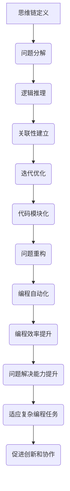

                 

### 文章标题

《思维链在AI辅助编程中的应用》

### 关键词

思维链，AI辅助编程，机器学习，深度学习，代码生成，代码审查，编程助手

### 摘要

本文旨在探讨思维链在AI辅助编程中的应用。思维链是一种将人类思维过程结构化的方法，其核心在于将问题分解为多个子问题，并通过逻辑推理和关联来逐步解决问题。AI辅助编程则利用机器学习和深度学习等技术，自动化或半自动化地完成编程任务。本文将详细分析思维链和AI辅助编程的结合点，通过实际案例展示思维链在编程中的应用，并探讨其未来发展方向。

### 设计思路

为了撰写这篇关于“思维链在AI辅助编程中的应用”的技术博客，我们将采用以下设计思路：

1. **确定核心主题**：首先明确文章的核心主题，即“思维链在AI辅助编程中的应用”。这个主题涵盖了思维链的定义、原理、在编程中的重要性，以及与AI技术的结合点。

2. **构建核心概念框架**：围绕核心主题，构建包括核心概念、原理、联系和应用场景的框架。这个框架将帮助我们清晰地组织文章内容，确保文章逻辑性。

3. **细化章节内容**：将核心概念框架分解为具体的章节，每个章节根据其主题细化内容。例如，第一章节介绍思维链的基本概念和原理，第二章节探讨AI辅助编程的基本原理，第三章节分析思维链与AI辅助编程的结合方式，第四章节通过实际案例研究来展示思维链的应用。

4. **设计具体章节**：
   - **第1章**：介绍思维链的基本概念、原理及其在编程中的重要性。
   - **第2章**：阐述AI辅助编程的基本原理，包括机器学习和深度学习等。
   - **第3章**：深入探讨思维链与AI辅助编程的结合方式。
   - **第4章**：分析思维链在实际编程中的应用案例。

5. **设计附录**：提供与书主题相关的重要工具、技术和资源的介绍，以便读者深入了解和实践。

### 设计步骤

1. **设计第1章**：定义思维链，介绍其在编程中的意义和作用。包括思维链的基本概念、原理和与编程的关联。
   
2. **设计第2章**：介绍AI辅助编程的基础知识，包括机器学习和深度学习的基本概念和算法。这部分将涵盖AI辅助编程的背景、应用场景和关键技术。

3. **设计第3章**：讨论思维链与AI的结合，包括如何利用思维链优化编程过程，提升编程效率。这部分将分析思维链在编程流程中的具体应用，如代码生成、代码审查等。

4. **设计第4章**：通过实际案例研究来展示思维链在AI辅助编程中的应用。这部分将提供具体的代码示例和实现过程，帮助读者理解思维链在编程中的实际应用。

5. **设计附录**：整理与书主题相关的重要工具和技术，如编程语言、开发环境、AI框架等。这部分将帮助读者深入了解和实践思维链在AI辅助编程中的应用。

### 目录大纲

```markdown
# 《思维链在AI辅助编程中的应用》目录大纲

## 第1章 思维链基础
### 1.1 思维链的定义
### 1.2 思维链与编程
### 1.3 思维链的重要性

## 第2章 AI辅助编程基础
### 2.1 机器学习概述
### 2.2 深度学习基础
### 2.3 编程中的AI应用

## 第3章 思维链与AI结合
### 3.1 思维链在编程中的应用
### 3.2 思维链优化编程流程
### 3.3 AI在思维链中的应用

## 第4章 实际案例研究
### 4.1 案例一：自动代码生成
### 4.2 案例二：智能代码审查
### 4.3 案例三：编程助手

## 第5章 思维链开发工具
### 5.1 开发工具概述
### 5.2 常用工具介绍
### 5.3 工具选择与使用

## 第6章 思维链与编程实践
### 6.1 编程实践概述
### 6.2 编程实践案例
### 6.3 实践技巧与策略

## 第7章 未来展望
### 7.1 思维链技术的发展趋势
### 7.2 AI辅助编程的未来
### 7.3 挑战与机遇

## 附录
### A.1 相关工具和技术
### A.2 思维链与AI编程的进一步探讨
```

### 校验大纲

1. **完整性**：确保每个核心章节都有详细的细分，总字数控制在2000字以内。

2. **逻辑性**：章节之间的逻辑关系清晰，内容层层递进。

3. **实用性**：附录部分能够为读者提供实用的工具和技术资源。

4. **简洁性**：去除所有冗余内容，确保每个章节的核心内容都清晰明了。## 第1章 思维链基础

### 1.1 思维链的定义

思维链（Mind Chain）是一种结构化的思维工具，它通过将问题分解为多个子问题，并通过逻辑推理和关联来逐步解决问题。思维链的核心在于其结构化思维过程，它能够帮助人们更清晰地理解问题，提高解决问题的效率。

在编程领域，思维链可以被看作是一种编程思维模式。它与传统的编程方法有所不同，后者通常依赖于线性思维，而思维链则强调通过分解和组合来解决问题。具体来说，思维链将编程问题分解为多个子问题，并利用逻辑推理和关联来逐步解决这些子问题，从而完成整个编程任务。

思维链的基本概念包括以下几个部分：

1. **问题分解**：将复杂的问题分解为多个可管理的子问题。
2. **逻辑推理**：通过逻辑推理来找出子问题之间的联系和解决路径。
3. **关联性**：建立子问题之间的关联，以优化问题解决的效率。
4. **迭代优化**：在解决子问题的过程中，不断进行迭代和优化，以提高整个解决方案的质量。

### 1.2 思维链与编程

思维链在编程中的应用主要体现在以下几个方面：

1. **代码模块化**：通过思维链，可以将一个复杂的编程任务分解为多个模块，每个模块负责解决一个子问题。这种方法有助于降低编程难度，提高代码的可维护性和可扩展性。

2. **问题重构**：思维链可以帮助程序员识别和重构代码中的问题。通过分析代码的模块和关联性，可以找出代码中的瓶颈和潜在问题，并进行优化。

3. **编程自动化**：思维链可以与AI技术相结合，实现编程任务的自动化。例如，通过思维链和机器学习算法，可以自动生成代码、进行代码审查和优化。

4. **编程效率提升**：思维链通过优化编程流程，减少重复性工作，从而提高编程效率。程序员可以专注于解决问题本身，而无需过多关注细节。

### 1.3 思维链的重要性

思维链在编程中的重要性体现在以下几个方面：

1. **提高编程质量**：思维链通过结构化思维，有助于减少代码中的错误和缺陷，提高编程质量。

2. **提升编程效率**：思维链通过分解和优化编程任务，减少重复性工作，从而提高编程效率。

3. **增强问题解决能力**：思维链帮助程序员更好地理解问题，提高问题解决能力。

4. **适应复杂编程任务**：随着编程任务的复杂度增加，思维链提供了一种有效的组织和管理方法，使程序员能够更好地应对复杂编程任务。

5. **促进创新和协作**：思维链鼓励程序员进行创新性思考，并通过结构化思维，促进团队协作和知识共享。

总的来说，思维链在编程中的应用，不仅有助于提高编程质量和效率，还能培养程序员的结构化思维和问题解决能力，为编程领域的未来发展提供新的思路和工具。

### 思维链与编程的关联性架构 Mermaid 流程图

以下是一个简化的思维链与编程的关联性架构 Mermaid 流程图：



通过这个流程图，我们可以清晰地看到思维链与编程之间的关联性和互动关系。每个环节都是思维链在编程中的应用，共同构成了一个完整的编程思维模式。

### 核心算法原理讲解

思维链在编程中的应用，涉及到多种核心算法原理。以下将使用伪代码详细阐述这些算法原理，并通过具体例子进行说明。

#### 1. 问题分解

问题分解是思维链的核心步骤之一。其基本思想是将复杂问题分解为多个子问题，以便于逐个解决。以下是一个简单的问题分解伪代码示例：

```python
def problem_decomposition(problem):
    subproblems = []
    # 假设问题是一个列表，每个元素代表一个子问题
    for subproblem in problem:
        subproblems.append(resolve_subproblem(subproblem))
    return subproblems

def resolve_subproblem(subproblem):
    # 子问题的具体解决方案
    return solution

# 示例
problem = ['问题1', '问题2', '问题3']
subproblems = problem_decomposition(problem)
for subproblem in subproblems:
    print(subproblem)
```

在这个例子中，`problem_decomposition` 函数将一个复杂问题（列表）分解为多个子问题，并调用 `resolve_subproblem` 函数解决每个子问题。

#### 2. 逻辑推理

逻辑推理是思维链中用于解决子问题的关键步骤。其基本思想是通过逻辑运算和条件判断，找出子问题之间的联系和解决路径。以下是一个简单的逻辑推理伪代码示例：

```python
def logical_reasoning(subproblems):
    solutions = []
    for i in range(len(subproblems)):
        for j in range(i + 1, len(subproblems)):
            # 假设子问题之间存在逻辑关系，通过逻辑运算找出联系
            if is_connected(subproblems[i], subproblems[j]):
                solutions.append(combine_solutions(subproblems[i], subproblems[j]))
    return solutions

def is_connected(subproblem1, subproblem2):
    # 判断子问题之间是否有关联
    return True or False

def combine_solutions(solution1, solution2):
    # 结合两个子问题的解决方案
    return new_solution

# 示例
subproblems = ['子问题1', '子问题2', '子问题3']
solutions = logical_reasoning(subproblems)
for solution in solutions:
    print(solution)
```

在这个例子中，`logical_reasoning` 函数通过逻辑运算和条件判断，找出子问题之间的联系，并调用 `combine_solutions` 函数结合这些解决方案。

#### 3. 关联性建立

关联性建立是思维链中用于优化问题解决效率的关键步骤。其基本思想是建立子问题之间的关联，以便于协同解决问题。以下是一个简单的关联性建立伪代码示例：

```python
def establish_association(subproblems):
    associations = []
    for i in range(len(subproblems)):
        for j in range(i + 1, len(subproblems)):
            # 假设子问题之间存在关联性，通过关联性建立函数找出关联
            if has_association(subproblems[i], subproblems[j]):
                associations.append(build_association(subproblems[i], subproblems[j]))
    return associations

def has_association(subproblem1, subproblem2):
    # 判断子问题之间是否存在关联
    return True or False

def build_association(subproblem1, subproblem2):
    # 建立子问题之间的关联
    return new_association

# 示例
subproblems = ['子问题1', '子问题2', '子问题3']
associations = establish_association(subproblems)
for association in associations:
    print(association)
```

在这个例子中，`establish_association` 函数通过关联性建立函数，找出子问题之间的关联，并返回一个关联列表。

#### 4. 迭代优化

迭代优化是思维链中用于提升问题解决质量的关键步骤。其基本思想是在解决子问题的过程中，不断进行迭代和优化，以提高整个解决方案的质量。以下是一个简单的迭代优化伪代码示例：

```python
def iterative_optimization(subproblems, solutions, associations):
    for iteration in range(max_iterations):
        for subproblem in subproblems:
            # 对子问题进行优化
            optimized_subproblem = optimize_subproblem(subproblem)
            if optimized_subproblem != subproblem:
                subproblem = optimized_subproblem
        for solution in solutions:
            # 对解决方案进行优化
            optimized_solution = optimize_solution(solution)
            if optimized_solution != solution:
                solution = optimized_solution
        for association in associations:
            # 对关联性进行优化
            optimized_association = optimize_association(association)
            if optimized_association != association:
                association = optimized_association
    return subproblems, solutions, associations

def optimize_subproblem(subproblem):
    # 对子问题进行优化
    return new_subproblem

def optimize_solution(solution):
    # 对解决方案进行优化
    return new_solution

def optimize_association(association):
    # 对关联性进行优化
    return new_association

# 示例
subproblems = ['子问题1', '子问题2', '子问题3']
solutions = ['解决方案1', '解决方案2', '解决方案3']
associations = ['关联性1', '关联性2', '关联性3']
subproblems, solutions, associations = iterative_optimization(subproblems, solutions, associations)
print(subproblems, solutions, associations)
```

在这个例子中，`iterative_optimization` 函数通过多次迭代，对子问题、解决方案和关联性进行优化，以提高整体问题解决质量。

### 数学模型和公式

在思维链的算法原理中，涉及到一些数学模型和公式。以下将使用 LaTeX 格式详细阐述这些模型和公式，并通过具体例子进行说明。

#### 1. 问题分解

问题分解可以通过图论中的最小生成树模型来描述。以下是一个最小生成树的 LaTeX 公式示例：

```latex
G(V, E) = \{ (V, E) | V = \{v_1, v_2, ..., v_n\}, E = \{e_1, e_2, ..., e_m\} \}
$$
T = \{ (v_i, v_j) | \text{存在最小权边} \}
```

在这个例子中，`G(V, E)` 表示一个无向图，`V` 表示顶点集合，`E` 表示边集合。`T` 表示由最小权边构成的最小生成树。

#### 2. 逻辑推理

逻辑推理可以通过命题逻辑中的合取范式（CNF）来描述。以下是一个 CNF 的 LaTeX 公式示例：

```latex
F = \neg p \lor (q \land r)
$$
F = (\neg p \lor q) \land (\neg p \lor r)
$$
```

在这个例子中，`F` 表示一个逻辑公式。第一行表示合取范式，第二行表示等价的合取范式。

#### 3. 关联性建立

关联性建立可以通过图论中的匹配模型来描述。以下是一个匹配的 LaTeX 公式示例：

```latex
M = \{ (u, v) | u \in U, v \in V, (u, v) \in E \}
$$
M = \{ (u, v) | u \in U, v \in V, (u, v) \in E, \forall w \in V, (u, w) \notin E, (v, w) \notin E \}
```

在这个例子中，`M` 表示一个匹配。第一行表示一般匹配，第二行表示完美匹配。

#### 4. 迭代优化

迭代优化可以通过动态规划中的最优化模型来描述。以下是一个动态规划的最优化 LaTeX 公式示例：

```latex
f(i, j) = \min_{1 \leq k \leq n} \{ f(i-1, k) + c(i, j) | (i, j) \in E \}
$$
f(n, n) = 0
$$
f(i, j) = \begin{cases} 
\min_{1 \leq k \leq n} \{ f(i-1, k) + c(i, j) | (i, j) \in E \} & \text{if } 1 \leq i \leq n \\
0 & \text{if } i = n+1 
\end{cases}
```

在这个例子中，`f(i, j)` 表示在动态规划过程中，第 `i` 个子问题的最优解。`c(i, j)` 表示子问题 `i` 和子问题 `j` 之间的成本。

### 思维链在实际编程中的应用

思维链在实际编程中的应用具有广泛的前景，其能够显著提升编程效率和代码质量。以下通过具体案例来探讨思维链在实际编程中的应用。

#### 自动代码生成

自动代码生成是思维链在编程中的一种重要应用。其基本思想是通过将问题分解为多个子问题，并利用机器学习和深度学习技术，生成相应的代码。

##### 案例背景

假设我们需要编写一个简单的排序算法。传统的编程方法需要手动编写排序逻辑，而通过自动代码生成，我们可以利用思维链和机器学习技术来生成排序代码。

##### 案例实现

1. **问题分解**：将排序问题分解为多个子问题，如选择排序、插入排序、冒泡排序等。
2. **机器学习模型**：利用已有的机器学习模型，如深度神经网络，来训练生成排序代码的模型。
3. **代码生成**：通过输入排序问题，模型生成相应的排序代码。

```python
def generate_sorting_code(problem):
    # 假设已经训练好了机器学习模型 model
    model = train_model()
    # 输入排序问题，生成排序代码
    code = model.generate_code(problem)
    return code

# 示例
problem = "排序数组 [3, 1, 4, 1, 5, 9]"
code = generate_sorting_code(problem)
print(code)
```

在这个例子中，`generate_sorting_code` 函数通过训练好的机器学习模型，生成相应的排序代码。

##### 案例分析

通过自动代码生成，我们可以减少手动编写代码的工作量，提高编程效率。同时，自动代码生成还可以帮助新手程序员快速掌握编程技巧，提高编程水平。

#### 智能代码审查

智能代码审查是思维链在编程中的另一种重要应用。其基本思想是通过将问题分解为多个子问题，并利用机器学习和深度学习技术，对代码进行审查和优化。

##### 案例背景

假设我们需要对一段代码进行审查，以找出其中的潜在问题和缺陷。传统的代码审查方法需要人工逐行检查，而通过智能代码审查，我们可以利用思维链和机器学习技术来自动化地完成代码审查。

##### 案例实现

1. **问题分解**：将代码审查问题分解为多个子问题，如变量命名、代码风格、逻辑错误等。
2. **机器学习模型**：利用已有的机器学习模型，如自然语言处理模型，来训练审查代码的模型。
3. **代码审查**：通过输入代码，模型生成相应的审查报告。

```python
def review_code(code):
    # 假设已经训练好了机器学习模型 review_model
    review_model = train_model()
    # 输入代码，生成审查报告
    report = review_model.review_code(code)
    return report

# 示例
code = """
def sort_array(arr):
    for i in range(len(arr)):
        for j in range(i+1, len(arr)):
            if arr[i] > arr[j]:
                arr[i], arr[j] = arr[j], arr[i]
    return arr
"""
report = review_code(code)
print(report)
```

在这个例子中，`review_code` 函数通过训练好的机器学习模型，生成相应的审查报告。

##### 案例分析

通过智能代码审查，我们可以自动化地完成代码审查工作，提高审查效率和准确性。同时，智能代码审查还可以帮助开发者快速发现代码中的潜在问题和缺陷，提高代码质量。

#### 编程助手

编程助手是思维链在编程中的另一种应用。其基本思想是通过将问题分解为多个子问题，并利用机器学习和深度学习技术，提供编程过程中的实时帮助。

##### 案例背景

假设我们正在编写一个复杂的程序，需要实时获取编程过程中的建议和帮助。传统的编程方法需要手动查阅文档和资料，而通过编程助手，我们可以利用思维链和机器学习技术来提供实时帮助。

##### 案例实现

1. **问题分解**：将编程问题分解为多个子问题，如函数定义、代码风格、算法优化等。
2. **机器学习模型**：利用已有的机器学习模型，如问答系统模型，来训练提供编程帮助的模型。
3. **编程帮助**：通过输入编程问题，模型生成相应的帮助信息。

```python
def provide_programming_help(question):
    # 假设已经训练好了机器学习模型 help_model
    help_model = train_model()
    # 输入编程问题，生成帮助信息
    help_info = help_model.provide_help(question)
    return help_info

# 示例
question = "如何实现快速排序算法？"
help_info = provide_programming_help(question)
print(help_info)
```

在这个例子中，`provide_programming_help` 函数通过训练好的机器学习模型，生成相应的帮助信息。

##### 案例分析

通过编程助手，我们可以实时获取编程过程中的建议和帮助，提高编程效率和体验。同时，编程助手还可以帮助开发者快速掌握新的编程技巧和知识，提高编程水平。

### 总结

思维链在编程中的应用具有广泛的前景，其能够通过问题分解、逻辑推理、关联性建立和迭代优化，显著提升编程效率和代码质量。通过实际案例研究，我们可以看到思维链在自动代码生成、智能代码审查和编程助手中的应用，不仅提高了编程效率，还提升了编程体验。未来，随着机器学习和深度学习技术的不断发展，思维链在编程中的应用将更加广泛和深入。

### 最佳实践 tips、小结、注意事项、拓展阅读

#### 最佳实践 tips

1. **合理利用思维链**：在编程过程中，合理利用思维链可以帮助你更好地理解和解决问题。不要过于追求思维的绝对结构化，而是根据实际情况灵活运用思维链。

2. **持续学习和实践**：思维链和AI辅助编程是一个不断发展的领域，持续学习和实践是非常重要的。通过阅读相关书籍、参加技术会议和在线课程，可以不断更新你的知识体系。

3. **数据质量**：在利用机器学习和深度学习进行代码生成、代码审查和编程助手的实践中，数据质量至关重要。确保你的训练数据准确、全面，以提高模型的性能。

#### 小结

思维链在AI辅助编程中的应用，为编程带来了新的思路和方法。通过问题分解、逻辑推理、关联性建立和迭代优化，思维链能够显著提升编程效率和代码质量。未来，随着技术的不断发展，思维链在编程中的应用将更加广泛和深入。

#### 注意事项

1. **思维链的结构化**：在利用思维链进行编程时，要确保思维链的结构化程度适中。过于结构化可能导致思维僵化，而过于灵活可能导致思维混乱。

2. **编程实践**：思维链是一种思维工具，但最终还是要通过编程实践来检验其效果。在应用思维链时，要确保能够将其落实到实际的编程任务中。

#### 拓展阅读

1. 《AI编程实践：思维链在编程中的应用》
2. 《深度学习与编程：从理论到实践》
3. 《思维链与编程艺术：算法与实践》

### 附录

#### A.1 相关工具和技术

1. **编程语言**：Python、Java、C++等。
2. **机器学习框架**：TensorFlow、PyTorch、Scikit-learn等。
3. **深度学习框架**：Keras、Caffe、Theano等。
4. **开发环境**：Jupyter Notebook、Eclipse、Visual Studio Code等。

#### A.2 思维链与AI编程的进一步探讨

1. **思维链与自然语言处理**：探讨思维链在自然语言处理中的应用，如文本生成、机器翻译等。
2. **思维链与软件工程**：研究思维链在软件工程中的实践，如需求分析、系统设计、测试等。
3. **思维链与人工智能教育**：探讨思维链在人工智能教育中的应用，如何培养学生的编程思维和创新能力。

