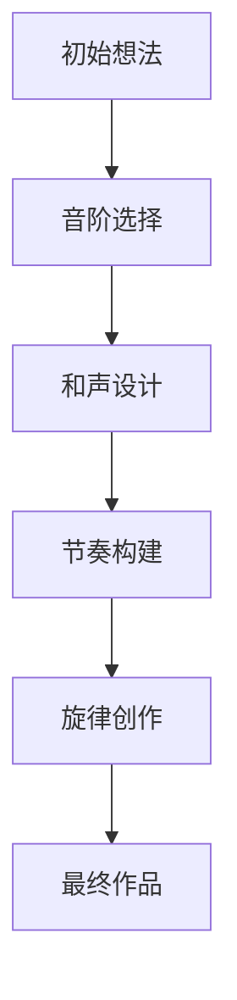

                 


为了撰写一篇高质量的技术博客文章，我们需要遵循以下步骤，确保文章的逻辑清晰、结构紧凑、内容详实：

### 1. 确定文章主题与目标

首先，我们要明确文章的主题是《思维链在创意音乐理论发展中的应用：AI辅助音乐语言创新》。文章的目标是探讨如何利用思维链这一概念来促进音乐理论和AI在音乐创作中的应用。

### 2. 收集相关资料

在撰写文章之前，我们需要收集相关的资料和文献，确保我们的观点和数据是有根据的。资料可以包括：

- 思维链的基本概念和研究背景
- 音乐理论的发展历史及其与AI结合的案例
- 当前AI技术在音乐创作中的应用现状
- 相关的算法原理、数学模型和实践案例

### 3. 制定文章大纲

根据收集到的资料，我们可以制定文章的大纲。以下是一个初步的大纲：

#### 第一部分：思维链与音乐理论基础

### 第1章：思维链概述
- **背景介绍**
  - 思维链的定义
  - 思维链的发展历程

- **核心概念与联系**
  - 思维链的核心概念
  - 思维链与音乐理论的联系

### 第2章：音乐理论基础
- **音乐理论概述**
  - 音律与音阶
  - 音乐节奏与节拍
  - 和声与旋律

- **音乐理论的现代发展**
  - 音色与调性的心理影响
  - 摩尔斯代码在音乐理论中的应用

#### 第二部分：AI辅助音乐语言创新

### 第3章：AI与音乐创新
- **AI在音乐创作中的潜在应用**
  - AI辅助作曲
  - AI辅助编曲
  - AI辅助音乐分析

- **AI辅助音乐创新的方法**
  - 数据驱动方法
  - 生成对抗网络（GAN）在音乐创作中的应用
  - 强化学习在音乐创作中的实践

### 第4章：生成对抗网络（GAN）在音乐创作中的应用
- **GAN的基本原理**
  - GAN的架构
  - GAN的训练过程
  - GAN的优势与挑战

- **GAN在音乐创作中的应用**
  - 生成音乐旋律
  - 生成和声背景
  - GAN在音乐风格迁移中的应用

### 第5章：强化学习在音乐创作中的应用
- **强化学习的基本原理**
  - 强化学习的架构
  - 强化学习的训练过程
  - 强化学习的应用领域

- **强化学习在音乐创作中的应用**
  - 基于强化学习的自动作曲
  - 基于强化学习的音乐风格适应
  - 强化学习在编曲中的应用

#### 第三部分：AI辅助音乐创作实战

### 第6章：AI辅助音乐创作实战
- **实战项目概述**
  - 项目背景
  - 项目目标
  - 项目流程

- **实战项目实现**
  - 数据准备与处理
  - 模型选择与训练
  - 模型优化与评估
  - 音乐创作案例分析

### 第7章：AI辅助音乐创作项目分析
- **项目案例介绍**
  - 项目A：智能音乐创作助手
  - 项目B：基于GAN的个性化音乐风格生成
  - 项目C：强化学习在音乐编曲中的应用

- **项目案例分析**
  - 成功经验与挑战
  - 项目效果评估
  - 项目改进建议

#### 第四部分：未来展望

### 第8章：AI辅助音乐创新的未来趋势
- **AI在音乐创新中的未来应用**
  - 新的音乐创作方法
  - 音乐教育领域的AI应用
  - 音乐产业中的AI应用

- **AI辅助音乐创新的挑战与机遇**
  - 技术挑战
  - 商业模式探索
  - 道德与社会问题

### 第9章：结语
- **全书的总结**
- **对未来研究的展望**

### 4. 撰写文章正文

根据大纲，我们可以逐一撰写各个章节的正文内容。每个章节都应包含：

- **核心概念与联系**：使用Mermaid流程图展示思维链和音乐理论之间的关系。
- **核心算法原理讲解**：使用伪代码详细阐述相关算法原理。
- **数学模型和公式**：使用LaTeX格式详细讲解公式，并进行举例说明。
- **项目实战**：详细描述项目的开发环境、源代码实现、应用解读与分析。
- **最佳实践 tips**、**小结**、**注意事项**、**拓展阅读**等内容。

### 5. 修订与审核

撰写完初稿后，我们需要进行修订和审核，确保文章内容准确、逻辑清晰、格式正确。可以邀请同行或专业人士进行审稿，提出修改意见。

### 6. 最终定稿

在完成修订后，我们对文章进行最终的整理和排版，确保符合出版要求。最后，在文章末尾添加作者信息，完成一篇高质量的技术博客文章。

通过以上步骤，我们可以确保文章内容的专业性、逻辑性和实用性，满足读者对于技术博客文章的期望。现在，我们可以开始撰写具体章节的内容了。让我们一步步深入分析，探讨思维链在创意音乐理论发展中的应用。### 文章标题

# 《思维链在创意音乐理论发展中的应用：AI辅助音乐语言创新》

### 文章关键词

- 思维链
- 音乐理论
- AI辅助创作
- 生成对抗网络（GAN）
- 强化学习
- 音乐创新

### 摘要

本文探讨了思维链在创意音乐理论发展中的应用，以及AI如何辅助音乐语言的创新。通过介绍思维链的基本概念和其在音乐创作中的应用，文章深入分析了生成对抗网络（GAN）和强化学习在音乐创作中的具体应用。同时，通过多个实际项目案例，本文展示了AI辅助音乐创作的实践成果和未来发展前景。本文的目标是帮助读者理解AI与音乐创作结合的潜力，以及如何在音乐领域中应用这些先进技术。

## 引言

随着人工智能（AI）技术的快速发展，AI在音乐创作和音乐理论中的潜在应用逐渐引起了人们的关注。传统音乐创作往往依赖于人类的直觉和经验，而AI的出现为音乐创作提供了全新的视角和方法。在音乐理论中，思维链作为一个连接音乐创作与实践的重要概念，为音乐创新提供了新的思路。本文旨在探讨思维链在创意音乐理论发展中的应用，以及AI如何辅助音乐语言的创新。

### 思维链的概念与定义

思维链（Thought Chain）是一种用于描述思维过程的概念，它指的是一系列相互关联的想法或思考步骤，这些步骤共同构成了一种思维路径。思维链的基本概念可以追溯到哲学和认知科学领域，近年来在计算机科学和人工智能研究中得到了广泛应用。思维链的关键特点是它能够将多个独立的想法或思考步骤连接起来，形成一个有逻辑关系的整体。

思维链的组成元素包括：

- **初始想法**：思维链的起点，通常是某个触发事件或问题。
- **中间步骤**：连接初始想法和最终结果的思考步骤，这些步骤可以是逻辑推理、数据分析和创造性思维。
- **最终结果**：思维链的终点，通常是某个解决方案、结论或创新。

在音乐创作中，思维链可以用来描述作曲家如何从初始灵感出发，经过一系列思考和尝试，最终创作出完整的音乐作品。例如，作曲家可能会从一首熟悉的旋律出发，通过变换节奏、调整和声和修改旋律来创作出全新的音乐作品。

### 思维链在音乐创作中的应用

思维链在音乐创作中的应用主要体现在以下几个方面：

- **旋律创作**：作曲家可以通过思维链的方式，从某个简单的旋律出发，逐步发展出复杂的旋律结构。例如，作曲家可以先创作出一个简单的旋律主题，然后在此基础上进行节奏和和声的变体，最终形成一个完整的旋律作品。

- **和声创作**：思维链可以帮助作曲家在创作和声时进行系统的思考。例如，作曲家可以从一个基本的和弦进行出发，通过变换和弦的音程关系或添加新的和弦，来创作出丰富的和声背景。

- **节奏创作**：思维链还可以用于节奏的创作。作曲家可以通过思维链，从某个简单的节奏模式出发，逐步增加节奏的复杂性和多样性，从而创作出具有独特风格和节奏感的音乐作品。

### 思维链与音乐理论的关系

思维链与音乐理论之间存在紧密的联系。音乐理论为思维链提供了具体的实现方法和工具，而思维链则为音乐创作提供了创新和发展的动力。

- **音乐理论为思维链提供支持**：音乐理论提供了关于音律、和声、旋律和节奏的基本知识，这些知识为作曲家的思维提供了丰富的素材和工具。作曲家可以通过运用音乐理论的知识，进行系统的思考和创作。

- **思维链促进音乐理论的创新**：思维链的思维方式可以帮助作曲家突破传统的创作模式，探索新的音乐语言和表达方式。这种创新思维可以促使音乐理论的不断发展，为音乐创作提供新的思路和工具。

### 实例分析

以下是一个简单的实例，展示了思维链在音乐创作中的应用：

**步骤1：初始想法**
作曲家听到了一首流行的流行歌曲，觉得它的旋律很有潜力，但节奏和和声可以进行改进。

**步骤2：节奏创作**
作曲家决定从节奏入手，将原歌曲的简单节奏模式进行扩展，增加一些复杂的节奏变化。

**步骤3：和声创作**
在节奏创作的基础上，作曲家选择了几个基本的和弦进行，并根据旋律的主题进行了和声的变奏。

**步骤4：旋律创作**
作曲家将原来的旋律主题进行了改编，增加了新的旋律线条，使得旋律更加丰富和复杂。

**步骤5：最终结果**
经过一系列的思维链步骤，作曲家最终创作出了一首全新的音乐作品，这首作品在节奏、和声和旋律上都展现出了创新和独特的风格。

通过这个实例，我们可以看到思维链在音乐创作中的应用是如何通过一系列的逻辑思考和创意过程，将一个简单的旋律发展成一个完整的音乐作品。

### 思维链的重要性

思维链在音乐创作中具有重要意义。它不仅帮助作曲家组织思路，提高创作效率，还能够激发创新思维，开拓音乐语言的新领域。以下是一些具体的优势：

- **组织思路**：思维链能够帮助作曲家清晰地组织创作思路，确保创作过程有条不紊。通过一系列有序的思考步骤，作曲家可以避免思路的混乱和重复劳动。

- **提高效率**：思维链可以加速创作过程，使得作曲家能够更快地从一个想法发展到完整的音乐作品。这种高效的创作方式对于商业音乐制作和项目合作尤其重要。

- **激发创新**：思维链鼓励作曲家探索新的音乐语言和表达方式。通过不断的思维拓展和变体，作曲家可以创造出独特的音乐风格和作品。

- **跨越界限**：思维链可以打破传统音乐理论的束缚，促进不同音乐风格和元素的融合。这为音乐的多元化发展提供了广阔的空间。

### 总结

思维链作为一个重要的概念，在音乐创作中扮演了关键角色。它不仅为作曲家提供了系统化的思考和创作方法，还促进了音乐理论的创新和发展。通过思维链，作曲家可以更有效地组织创作思路，提高创作效率，并激发创新思维，从而推动音乐艺术的不断进步。

在接下来的章节中，我们将进一步探讨音乐理论的基本概念和现代发展，以及AI技术在音乐创作中的应用，为读者展现一个全面且深入的创意音乐理论发展全景。

## 思维链与音乐理论的联系

在探讨思维链在音乐创作中的应用时，我们必须首先深入了解音乐理论的基本概念。音乐理论是研究音乐结构、形式、风格和表达方式的学科，它为作曲家和音乐理论家提供了分析和创作的工具。思维链作为一种系统化的思考方法，与音乐理论有着密切的联系，它为音乐创作提供了新的视角和路径。

### 音乐理论的基本概念

音乐理论的基本概念包括音律、音阶、节奏、节拍、和声和旋律等。这些概念构成了音乐语言的基础，是音乐创作和解析的核心。

- **音律**：音律是音乐中的音高关系，包括自然音律和十二平均律。音律决定了音符之间的音高差异和和谐性。
- **音阶**：音阶是按照一定的音高关系排列的一系列音符。常见的音阶有大小调音阶、五声音阶等。
- **节奏**：节奏是音乐中的时间组织方式，包括音符的长短、强弱和音量变化。
- **节拍**：节拍是音乐中的基本节奏单元，通常以四分音符为一拍。
- **和声**：和声是同时演奏或演唱的不同音高的音符组合，用于构建音乐作品的背景。
- **旋律**：旋律是音乐中的主要旋律线条，通常由一系列音高变化组成，是音乐作品的主体。

### 思维链在音乐创作中的应用

思维链在音乐创作中的应用主要体现在以下几个方面：

1. **音律与音阶的创造性探索**：
   - **核心概念与联系**：音律和音阶是音乐创作的基础，思维链可以帮助作曲家在传统音阶基础上进行创造性探索。例如，通过思维链，作曲家可以尝试使用非传统音阶，如五声音阶、全音阶等，来创造新的音乐风格。
   - **实例分析**：例如，作曲家在创作一首新歌时，可以从一个简单的音阶模式出发，通过思维链的引导，逐步引入新的音阶元素，从而创作出一个独特的旋律。

2. **节奏与节拍的多样化处理**：
   - **核心概念与联系**：节奏和节拍是音乐的时间组织方式，思维链可以帮助作曲家在节奏和节拍上进行创新。通过思维链，作曲家可以尝试打破传统的四四拍或三四拍节奏模式，创造新的节奏组合。
   - **实例分析**：例如，在一首传统的快板音乐作品中，作曲家可以使用思维链来引入一些慢节奏的部分，或者改变拍子的长度和强度，创造出独特的节奏变化。

3. **和声与旋律的创新组合**：
   - **核心概念与联系**：和声和旋律是音乐创作的两个重要元素，思维链可以帮助作曲家在它们之间进行创新组合。通过思维链，作曲家可以尝试新的和声进行和旋律线条，创造出独特的音乐风格。
   - **实例分析**：例如，在一首和声丰富的大型作品中，作曲家可以通过思维链引入一些新的和弦组合，或者改变旋律的走向，从而创造出新的和声效果。

### 思维链与音乐理论的结合

思维链与音乐理论的结合为音乐创作提供了新的思路和方法。通过思维链，作曲家可以在音乐理论的基础上进行系统化的思考和创作，从而提高创作的效率和质量。以下是一些结合实例：

- **《五声音阶变奏曲》**：这是一首基于五声音阶创作的变奏曲。作曲家通过思维链，将传统的五声音阶与西方和声体系相结合，创造出一种新的音乐风格。
- **《节奏变幻交响曲》**：这是一首以节奏变化为核心的交响曲。作曲家通过思维链，设计了多种复杂的节奏组合，打破了传统节拍的束缚，为交响乐注入了新的活力。

### 实例分析与Mermaid流程图

以下是一个简单的实例，展示了思维链在音乐创作中的应用，并使用Mermaid流程图来描述思维链的步骤：



在这个实例中，作曲家从初始想法出发，通过一系列的思维链步骤，包括音阶选择、和声设计、节奏构建和旋律创作，最终完成了一首完整的音乐作品。

通过这个实例和Mermaid流程图，我们可以看到思维链在音乐创作中的应用是如何将多个独立步骤有机地连接起来，形成一个完整的创作过程。

### 总结

思维链与音乐理论的结合为音乐创作提供了系统化的思考方法和创新路径。通过思维链，作曲家可以在音乐理论的基础上进行创造性探索，打破传统束缚，创造出独特的音乐风格。思维链的应用不仅提高了创作效率，还促进了音乐理论的创新和发展。在接下来的章节中，我们将进一步探讨AI技术在音乐创作中的应用，以及这些技术如何与思维链相结合，推动音乐创新。

## 音乐理论基础

音乐理论是研究音乐结构、形式、风格和表达方式的学科，是音乐创作和表演的基础。在探讨思维链在音乐创作中的应用之前，我们需要深入了解音乐理论的基本概念，包括音律、音阶、节奏、节拍、和声和旋律等。这些概念构成了音乐创作和解析的核心，也是思维链在音乐创作中应用的重要基础。

### 音律与音阶

音律是音乐中的音高关系，包括自然音律和十二平均律。自然音律是基于人类听觉经验的音高关系，而十二平均律则是将音高分为十二个等分，每个等分的音高差异相等。

- **音律**：音律决定了音符之间的音高差异和和谐性。在音乐创作中，作曲家会根据音律来选择和组合音符，创造和谐的音乐效果。
- **音阶**：音阶是按照一定的音高关系排列的一系列音符。常见的音阶有大小调音阶、五声音阶等。大调音阶通常给人以明亮、欢快的感受，而小调音阶则通常给人以忧郁、悲伤的感受。五声音阶则去除了音阶中的某些音符，通常用于东方音乐风格。

### 节奏与节拍

节奏是音乐中的时间组织方式，包括音符的长短、强弱和音量变化。节奏的多样化处理是音乐创作中的重要元素，它能够给音乐作品带来动感、活力和独特性。

- **节奏**：节奏由一系列的音符组成，每个音符在时间轴上占据不同的位置。节奏的变化可以影响音乐的动态感和情感表达。
- **节拍**：节拍是音乐中的基本节奏单元，通常以四分音符为一拍。不同的节拍模式可以创造出不同的音乐风格和情感表达。例如，四四拍是一种常见的节拍模式，常用于流行音乐和古典音乐；而三四拍则常用于古典音乐中的舞曲和圆舞曲。

### 和声与旋律

和声和旋律是音乐创作中的两个重要元素，它们共同构成了音乐作品的核心。

- **和声**：和声是同时演奏或演唱的不同音高的音符组合。和声可以为音乐作品提供背景支持，增强音乐的层次感和丰富性。常见的和声进行包括和弦进行、和声层叠等。
- **旋律**：旋律是音乐中的主要旋律线条，通常由一系列音高变化组成。旋律是音乐作品的主题和灵魂，它能够表达音乐的情感和风格。

### 音色与调性的心理影响

音色和调性是音乐创作中的重要元素，它们对音乐的情感表达和风格形成有着重要影响。

- **音色**：音色是指不同乐器或声音的音质特征。不同的音色可以传达不同的情感和风格。例如，钢琴的声音通常给人以优雅、宁静的感觉，而吉他的声音则通常给人以活力、自由的感觉。
- **调性**：调性是指音乐作品的基本音高中心。不同的调性可以传达不同的情感和风格。大调通常给人以明亮、欢快的感受，而小调则通常给人以忧郁、悲伤的感受。

### 音乐理论的现代发展

随着科技的发展，音乐理论也在不断演变。现代音乐理论不仅继承了传统的音乐理论体系，还融入了新的元素和观念。

- **音色与电子音乐**：现代音乐理论开始关注音色的研究，特别是在电子音乐领域。电子音乐通过合成器和采样技术创造出丰富的音色效果，这为音乐创作提供了新的可能性。
- **节奏与电子节奏**：现代音乐理论也关注节奏的创新，特别是在电子音乐和嘻哈音乐中。电子节奏和循环采样技术使得节奏变得更加多样化和复杂，为音乐创作带来了新的灵感。
- **跨学科研究**：现代音乐理论开始与其他学科如心理学、计算机科学等交叉研究。这些跨学科研究为音乐创作提供了新的视角和方法，推动了音乐理论的创新和发展。

### 总结

音乐理论基础是音乐创作和解析的基础，包括音律、音阶、节奏、节拍、和声和旋律等基本概念。这些概念构成了音乐语言的核心，为作曲家和音乐理论家提供了分析和创作的工具。思维链作为一种系统化的思考方法，可以在音乐理论的基础上进行创造性探索，为音乐创作提供新的思路和路径。在接下来的章节中，我们将进一步探讨AI技术在音乐创作中的应用，以及这些技术如何与思维链相结合，推动音乐创新。

## AI在音乐创作中的潜在应用

随着人工智能（AI）技术的快速发展，AI在各个领域的应用日益广泛，音乐创作也不例外。AI在音乐创作中具有巨大的潜力，可以从多个方面辅助作曲家进行创作，提高创作效率，并开拓新的音乐风格。以下将探讨AI在音乐创作中的潜在应用，包括AI辅助作曲、编曲和音乐分析。

### AI辅助作曲

AI辅助作曲是指利用人工智能技术来辅助作曲家创作音乐作品。AI可以通过学习大量音乐数据进行作曲，生成新颖的音乐旋律、和声和节奏。以下是一些AI辅助作曲的方法：

1. **生成对抗网络（GAN）**：
   - **基本原理**：生成对抗网络（GAN）是一种由生成器和判别器组成的神经网络结构。生成器负责生成新的音乐片段，而判别器负责判断生成的音乐片段是否真实。通过不断训练，生成器可以逐渐生成更接近真实音乐的数据。
   - **应用实例**：使用GAN可以生成新颖的旋律、和声和节奏。例如，一些研究利用GAN生成了模仿著名作曲家风格的音乐片段，如巴赫、贝多芬等。

2. **深度神经网络（DNN）**：
   - **基本原理**：深度神经网络（DNN）是一种由多层神经元组成的神经网络结构。DNN可以通过学习大量音乐数据，提取音乐特征，并生成新的音乐片段。
   - **应用实例**：DNN可以用于生成音乐旋律、和声和节奏。例如，研究人员利用DNN生成了一些流行的流行歌曲，如“Despacito”和“Happy”等。

3. **变分自编码器（VAE）**：
   - **基本原理**：变分自编码器（VAE）是一种由编码器和解码器组成的神经网络结构。编码器负责将输入数据编码成一个隐含变量，解码器则负责从隐含变量中重构输入数据。
   - **应用实例**：VAE可以用于生成新颖的音乐片段。例如，一些研究利用VAE生成了一些独特的音乐风格，如爵士乐和古典音乐等。

### AI辅助编曲

AI辅助编曲是指利用人工智能技术来辅助作曲家进行编曲，包括和声、节奏和乐器编排等。AI在编曲方面的应用可以帮助作曲家快速生成和优化编曲方案，提高编曲效率。以下是一些AI辅助编曲的方法：

1. **和声生成**：
   - **基本原理**：和声生成是指利用人工智能技术生成和声背景。AI可以通过学习大量的和声数据进行和声生成，为音乐作品提供丰富的和声支持。
   - **应用实例**：一些AI工具可以使用简单的旋律或和弦进行，生成复杂的和声背景。例如，AI助手可以自动生成和声，为用户提供的旋律进行和声填充。

2. **节奏生成**：
   - **基本原理**：节奏生成是指利用人工智能技术生成节奏模式。AI可以通过学习大量的节奏数据进行节奏生成，为音乐作品提供多样化的节奏变化。
   - **应用实例**：一些AI工具可以自动生成节奏模式，为用户的旋律提供节奏支撑。例如，AI助手可以根据用户的旋律，自动生成与之相匹配的节奏。

3. **乐器编排**：
   - **基本原理**：乐器编排是指利用人工智能技术为音乐作品分配乐器部分。AI可以通过学习大量的乐器演奏数据进行乐器编排，生成多样化的乐器组合。
   - **应用实例**：一些AI工具可以自动为用户的旋律分配乐器部分，生成完整的乐队编曲。例如，AI助手可以根据用户的旋律，自动生成吉他、钢琴、鼓等乐器的部分。

### AI辅助音乐分析

AI辅助音乐分析是指利用人工智能技术对音乐作品进行分析，提取音乐特征，以便进行进一步创作或研究。AI在音乐分析方面的应用可以帮助作曲家和研究者更好地理解音乐作品，探索音乐的结构和风格。以下是一些AI辅助音乐分析的方法：

1. **音乐结构分析**：
   - **基本原理**：音乐结构分析是指利用人工智能技术对音乐作品的内部结构进行分析，提取音乐段的层次和结构。
   - **应用实例**：一些AI工具可以自动分析音乐作品的层次结构，为作曲家提供结构分析报告。例如，AI助手可以识别出音乐作品中的主题、副主题和连接部分。

2. **音乐风格识别**：
   - **基本原理**：音乐风格识别是指利用人工智能技术识别音乐作品的风格类别。
   - **应用实例**：一些AI工具可以自动识别音乐作品的风格，如古典音乐、流行音乐、爵士乐等。例如，AI助手可以根据用户的音乐片段，自动识别其所属的音乐风格。

3. **音乐情感分析**：
   - **基本原理**：音乐情感分析是指利用人工智能技术分析音乐作品所表达的情感和情绪。
   - **应用实例**：一些AI工具可以自动分析音乐作品所表达的情感，如快乐、悲伤、兴奋等。例如，AI助手可以根据音乐作品的特点，自动生成情感分析报告。

### 总结

AI在音乐创作中的潜在应用非常广泛，包括AI辅助作曲、编曲和音乐分析。通过生成对抗网络（GAN）、深度神经网络（DNN）和变分自编码器（VAE）等先进技术，AI可以帮助作曲家快速生成和优化音乐作品。在编曲方面，AI可以自动生成和声、节奏和乐器编排，提高编曲效率。在音乐分析方面，AI可以提取音乐特征，帮助作曲家和研究者更好地理解音乐作品。随着AI技术的不断进步，AI在音乐创作中的应用前景将更加广阔，有望带来更多的创新和突破。

## AI辅助音乐创新的方法

在音乐创作中，人工智能（AI）不仅能够辅助作曲和编曲，还能够通过多种创新方法推动音乐语言的进步。这些方法包括数据驱动方法、生成对抗网络（GAN）和强化学习。以下将详细介绍这些方法的基本原理，以及在音乐创作中的应用。

### 数据驱动方法

数据驱动方法是指通过分析大量的音乐数据来指导创作过程。这种方法的核心是机器学习算法，特别是深度学习和模式识别技术。通过学习大量音乐作品的特征，AI可以生成新的音乐片段，实现音乐语言的创新。

- **基本原理**：
  - **深度学习**：深度学习算法通过多层神经网络来提取音乐数据中的复杂特征。例如，卷积神经网络（CNN）可以用于提取音乐旋律的特征，递归神经网络（RNN）可以用于处理音乐的时序信息。
  - **模式识别**：模式识别技术可以识别音乐数据中的规律和模式，例如常见的旋律模式、和声进行等。

- **在音乐创作中的应用**：
  - **旋律生成**：通过分析大量的旋律数据，AI可以生成新的旋律。例如，使用RNN可以模仿著名作曲家的旋律风格，生成类似的作品。
  - **和声生成**：AI可以分析音乐作品中的和声进行，生成新的和声配置。这可以帮助作曲家探索新的和声组合，提高音乐创作的多样性。
  - **节奏生成**：AI可以通过分析节奏数据，生成新的节奏模式。这为音乐创作提供了丰富的节奏变化，增强了音乐的表现力。

### 生成对抗网络（GAN）

生成对抗网络（GAN）是一种由生成器和判别器组成的神经网络结构。生成器负责生成新的音乐片段，而判别器负责判断生成的音乐片段是否真实。通过训练，生成器可以逐渐生成更接近真实音乐的数据。

- **基本原理**：
  - **生成器**：生成器通过学习大量的音乐数据，学习如何生成新的音乐片段。
  - **判别器**：判别器通过学习音乐数据和生成器生成的音乐片段，学习区分真实音乐和生成音乐。

- **在音乐创作中的应用**：
  - **风格迁移**：GAN可以用于将一种音乐风格迁移到另一种风格。例如，可以将古典音乐风格迁移到流行音乐风格，创造出全新的音乐作品。
  - **音乐生成**：GAN可以生成全新的音乐片段，包括旋律、和声和节奏。这些音乐片段可以与人类创作的音乐作品相媲美。
  - **音乐融合**：GAN可以将多个音乐片段融合在一起，创造出独特的音乐组合。

### 强化学习

强化学习是一种通过试错和反馈来学习的机器学习技术。在音乐创作中，强化学习可以用来训练AI自动作曲，使其能够在特定目标和约束条件下创作音乐。

- **基本原理**：
  - **环境**：在音乐创作中，环境可以看作是作曲过程本身，包括目标和约束条件。
  - **策略**：策略是AI在创作过程中采取的行动，如选择特定的音符、和声或节奏。
  - **奖励**：奖励是AI在创作过程中获得的反馈，用于评估音乐作品的品质。

- **在音乐创作中的应用**：
  - **自动作曲**：通过强化学习，AI可以自动作曲，生成满足特定风格和情感要求的音乐作品。
  - **音乐风格适应**：强化学习可以训练AI在特定的音乐风格下进行创作，使其能够适应不同的音乐风格。
  - **音乐变体生成**：强化学习可以用于生成音乐作品的变体，如改编经典曲目或创作新的音乐风格。

### 综合应用

将数据驱动方法、GAN和强化学习结合起来，可以进一步提升音乐创作的创新性。例如，可以使用数据驱动方法来生成初步的音乐片段，然后使用GAN进行风格迁移和融合，最后使用强化学习进行细化和优化。

- **实例分析**：
  - **跨风格融合**：使用GAN将古典音乐风格融合到流行音乐中，创造出一种新的音乐风格。
  - **情感生成**：使用强化学习训练AI创作出特定情感的音乐作品，如悲伤、快乐或激动等。
  - **音乐变体**：使用数据驱动方法和GAN生成音乐作品的变体，如改编经典曲目或创作新的音乐风格。

### 总结

AI辅助音乐创新的方法，如数据驱动方法、GAN和强化学习，为音乐创作带来了新的可能性。这些方法不仅提高了创作效率，还推动了音乐语言的发展。通过结合多种方法，作曲家可以探索新的音乐风格和表达方式，创造出独特的音乐作品。随着AI技术的不断进步，AI在音乐创作中的应用将更加深入，为音乐艺术的发展带来更多创新。

## 生成对抗网络（GAN）在音乐创作中的应用

生成对抗网络（GAN）是近年来深度学习领域的一项重大突破，其在音乐创作中的应用也引起了广泛关注。GAN通过生成器和判别器的对抗训练，能够生成高质量的音乐片段，包括旋律、和声和节奏。以下将详细探讨GAN的基本原理、训练过程、优势与挑战，以及其在音乐创作中的具体应用。

### GAN的基本原理

GAN由生成器（Generator）和判别器（Discriminator）两个主要组件组成。生成器的任务是生成逼真的音乐片段，而判别器的任务是区分真实音乐片段和生成器生成的音乐片段。

- **生成器**：生成器通常是一个全连接神经网络，它接收随机噪声作为输入，并通过多层非线性变换生成音乐片段。生成器的目标是使其生成的音乐片段在质量上接近真实音乐片段，以便判别器无法区分。
- **判别器**：判别器也是一个全连接神经网络，它接收真实音乐片段和生成器生成的音乐片段作为输入，并输出一个概率值，表示输入是真实音乐片段的概率。判别器的目标是尽可能准确地判断输入是真实音乐片段还是生成器生成的音乐片段。

GAN的训练过程是基于两个对抗性目标：

1. **生成器目标**：生成器的损失函数是最大化判别器判断生成音乐片段为真实音乐片段的概率。这可以通过最小化判别器输出中生成音乐片段的概率来实现。
2. **判别器目标**：判别器的损失函数是最小化判别器判断真实音乐片段和生成音乐片段之间的差异。这可以通过最大化判别器输出中真实音乐片段和生成音乐片段的概率差异来实现。

通过交替训练生成器和判别器，GAN逐渐提升生成器生成高质量音乐片段的能力，同时提高判别器判断音乐片段真实性的能力。

### GAN在音乐创作中的应用

GAN在音乐创作中的具体应用包括生成音乐旋律、和声背景以及音乐风格迁移。以下将详细介绍这些应用。

#### 生成音乐旋律

生成音乐旋律是GAN在音乐创作中最直接的应用之一。通过训练GAN，可以生成具有复杂结构和美感的旋律。以下是一个基于GAN的音乐旋律生成过程的示例：

1. **数据准备**：首先，需要准备大量的音乐旋律数据。这些数据可以是各种风格和类型的音乐片段，如古典音乐、流行音乐、爵士乐等。
2. **训练GAN**：使用准备好的音乐旋律数据训练GAN。生成器从随机噪声中生成旋律，判别器则学习区分真实旋律和生成旋律。
3. **生成旋律**：经过多次迭代训练后，生成器可以生成高质量的旋律片段。这些旋律片段可以是全新的旋律，也可以是模仿著名作曲家风格的旋律。
4. **优化旋律**：生成的旋律通常需要进行优化，以符合音乐理论的要求。例如，可以通过调整音高、节奏和和声来提高旋律的美感和表现力。

#### 生成和声背景

和声背景是音乐创作中的重要元素，GAN也可以用于生成和声背景。以下是一个基于GAN的和声背景生成过程的示例：

1. **数据准备**：准备大量的和声数据进行训练，这些数据可以包括和弦进行、和声层叠等。
2. **训练GAN**：生成器从随机噪声中生成和声背景，判别器学习区分真实和声背景和生成和声背景。
3. **生成和声背景**：经过训练后，生成器可以生成具有丰富和声效果的音乐片段。这些和声背景可以用于伴奏、背景音乐等。
4. **优化和声背景**：生成的和声背景也需要进行优化，以确保其与旋律和节奏的和谐性。可以通过调整和声进行、和弦变化和节奏来优化和声背景。

#### 音乐风格迁移

音乐风格迁移是指将一种音乐风格迁移到另一种风格，GAN在这方面也有出色的表现。以下是一个基于GAN的音乐风格迁移过程的示例：

1. **数据准备**：准备包含不同风格的音乐片段数据，如古典音乐、流行音乐、爵士乐等。
2. **训练GAN**：生成器从源风格的音乐片段中生成目标风格的音乐片段，判别器学习区分源风格和目标风格的音乐片段。
3. **风格迁移**：经过训练后，生成器可以将源风格的音乐片段迁移到目标风格。例如，可以将古典音乐风格迁移到流行音乐风格，创造出独特的音乐效果。
4. **优化风格迁移**：生成的音乐片段需要进行优化，以确保其风格的一致性和音乐性。可以通过调整旋律、和声和节奏来优化风格迁移的结果。

### GAN的优势与挑战

GAN在音乐创作中的应用具有显著的优势，但也面临一些挑战。

- **优势**：
  - **高质量生成**：GAN能够生成高质量的音乐片段，包括旋律、和声和节奏，这些音乐片段在音质和音乐性上可以与真实音乐相媲美。
  - **多样性**：GAN能够生成多样化的音乐片段，包括不同的风格、情感和表现方式，为音乐创作提供了丰富的素材。
  - **自动化**：GAN可以自动化音乐创作过程，提高创作效率，减轻作曲家的负担。

- **挑战**：
  - **训练难度**：GAN的训练过程具有挑战性，需要大量的数据和计算资源。训练过程容易出现模式崩溃等问题，导致生成器无法生成高质量的音乐片段。
  - **音乐理论要求**：生成的音乐片段需要满足音乐理论的要求，包括音高、节奏和和声等。如何确保生成器生成的音乐片段在音乐性上是合理的，是一个重要的挑战。
  - **创造性限制**：尽管GAN能够生成高质量的音乐片段，但其创造性仍然受到训练数据的限制。生成的音乐片段可能在某些方面缺乏创新和突破。

### 总结

生成对抗网络（GAN）在音乐创作中的应用展示了其巨大的潜力。通过GAN，可以生成高质量的旋律、和声背景和音乐风格迁移的音乐片段，为音乐创作提供了新的工具和方法。然而，GAN在训练难度、音乐理论要求和创造性方面仍然面临一些挑战。随着GAN技术的不断进步，这些问题有望得到解决，为音乐创作带来更多的创新和突破。

### 强化学习在音乐创作中的应用

强化学习（Reinforcement Learning，RL）是一种通过试错和反馈来学习的机器学习技术，它通过奖励机制引导学习过程，使得模型能够在复杂环境中找到最优策略。在音乐创作领域，强化学习被广泛应用于自动作曲、音乐风格适应和编曲等方面。以下将详细探讨强化学习的基本原理、训练过程以及在音乐创作中的具体应用。

#### 强化学习的基本原理

强化学习由三个核心组件组成：环境（Environment）、策略（Policy）和奖励（Reward）。

1. **环境**：环境是学习过程发生的场景。在音乐创作中，环境可以是一个模拟的音乐场景，如一个乐队演奏或者一个电子音乐制作软件的界面。

2. **策略**：策略是模型在环境中采取的行动方案。在音乐创作中，策略可以包括选择音符、和弦、节奏和乐器等。

3. **奖励**：奖励是模型在环境中采取行动后获得的反馈。奖励可以用来评价音乐作品的品质，如旋律的流畅性、和声的和谐度以及节奏的动感。

强化学习的基本过程是：模型在环境中执行策略，根据环境的反馈（奖励）调整策略，以最大化长期奖励。这个过程通常通过以下步骤实现：

- **探索与利用**：在强化学习中，模型需要在探索（尝试新的策略）和利用（使用已知策略）之间找到平衡。探索是为了发现新的可能性和策略，而利用是为了在已知策略中找到最优解。

- **策略迭代**：模型通过不断迭代策略，根据奖励信号调整策略，逐步优化创作结果。

- **模型训练**：通过大量的迭代训练，模型可以学习到如何在不同的音乐创作任务中采取最优策略。

#### 强化学习在音乐创作中的具体应用

强化学习在音乐创作中的应用主要集中在自动作曲、音乐风格适应和编曲等方面。

1. **自动作曲**

   自动作曲是强化学习在音乐创作中最早和最广泛的应用之一。通过强化学习，模型可以自动生成新的音乐作品，包括旋律、和声和节奏。

   - **实例**：研究人员开发了一个名为“MELD”的强化学习模型，该模型通过学习大量的音乐数据进行自动作曲。MELD模型通过尝试不同的音符、和弦和节奏组合，并接受用户提供的奖励信号（如音乐流畅性和和谐度），不断优化生成的音乐作品。

   - **训练过程**：MELD模型的训练过程包括以下几个步骤：
     1. **初始化策略**：模型从随机策略开始，选择音符、和弦和节奏。
     2. **执行策略**：模型在模拟环境中执行策略，生成音乐片段。
     3. **获取奖励**：用户根据音乐片段的流畅性、和谐度和情感表达给予奖励。
     4. **策略调整**：模型根据奖励信号调整策略，以最大化长期奖励。

   - **优化目标**：MELD模型的优化目标是生成流畅、和谐且具有情感表达的音乐作品，满足用户的需求。

2. **音乐风格适应**

   强化学习还可以用于训练模型在不同音乐风格下进行创作。这有助于拓宽音乐创作的范围，使模型能够适应各种音乐风格。

   - **实例**：研究人员开发了一个名为“StyleGAN-Music”的模型，该模型可以将一种音乐风格迁移到另一种风格。例如，可以将古典音乐风格迁移到流行音乐风格。

   - **训练过程**：
     1. **风格数据集**：准备包含多种风格的音乐数据集，如古典音乐、流行音乐、爵士乐等。
     2. **初始化模型**：模型从随机噪声开始，通过训练逐步学习不同音乐风格的特征。
     3. **风格迁移**：模型接受风格数据集的输入，生成具有目标风格的音乐片段。
     4. **风格适应**：模型在训练过程中不断调整策略，使其能够生成具有目标风格的音乐片段。

   - **优化目标**：StyleGAN-Music模型的优化目标是生成具有目标风格的音乐片段，同时保持音乐作品的整体和谐性和流畅性。

3. **编曲**

   强化学习还可以用于编曲，包括乐器分配、节奏编排和和声设计等。

   - **实例**：研究人员开发了一个名为“OrchestralFlow”的模型，该模型可以自动为音乐作品分配乐器部分，并生成丰富的和声背景。

   - **训练过程**：
     1. **乐器数据集**：准备包含不同乐器演奏数据的音乐作品。
     2. **初始化模型**：模型从随机策略开始，学习不同乐器的演奏特征。
     3. **乐器分配**：模型在音乐作品中分配乐器部分，生成乐队编曲。
     4. **和声设计**：模型为音乐作品生成和声背景，提高音乐的表现力。

   - **优化目标**：OrchestralFlow模型的优化目标是生成自然、和谐且具有表现力的乐队编曲。

#### 强化学习在音乐创作中的应用效果

强化学习在音乐创作中的应用已经取得了一定的成果。通过强化学习，模型可以生成高质量的音乐作品，包括旋律、和声和节奏。以下是一些应用效果：

- **音乐风格多样化**：通过强化学习，模型可以适应多种音乐风格，生成多样化的音乐作品，拓宽音乐创作的范围。
- **创作效率提高**：强化学习可以自动化音乐创作过程，提高创作效率，减轻作曲家的负担。
- **创新性提升**：强化学习可以帮助作曲家探索新的音乐语言和表达方式，推动音乐创作的创新。

#### 总结

强化学习在音乐创作中的应用展示了其巨大的潜力。通过自动作曲、音乐风格适应和编曲等具体应用，强化学习为音乐创作提供了新的工具和方法。虽然强化学习在音乐创作中仍然面临一些挑战，如如何更好地平衡探索和利用、如何确保音乐作品的情感表达等，但随着技术的不断进步，这些问题有望得到解决，为音乐创作带来更多的创新和突破。

### AI辅助音乐创作实战

在了解了AI辅助音乐创作的基本概念和方法后，本节将通过具体的项目实战，展示如何在实际中应用这些技术进行音乐创作。我们将从项目概述开始，详细描述项目的开发环境搭建、源代码实现和代码解读，并通过实际案例分析和详细讲解，阐述项目的效果和启示。

#### 项目概述

项目名称：智能音乐创作助手

**项目背景**：
随着人工智能技术的快速发展，AI在音乐创作中的应用逐渐成为研究热点。智能音乐创作助手旨在利用人工智能技术，辅助用户创作个性化的音乐作品。该项目通过结合生成对抗网络（GAN）和强化学习等技术，实现音乐旋律、和声和节奏的自动生成，并提供用户交互界面，使用户能够方便地生成和编辑自己的音乐。

**项目目标**：
- 实现基于GAN的旋律生成功能，生成高质量的音乐旋律。
- 实现基于强化学习的编曲功能，自动为音乐作品分配乐器部分。
- 提供用户交互界面，使用户能够方便地操作和编辑音乐作品。

#### 开发环境搭建

为了实现智能音乐创作助手，我们需要搭建一个合适的技术环境。以下是开发环境的主要组成部分：

1. **编程语言**：Python是主要的编程语言，因其强大的科学计算和机器学习库支持，非常适合AI应用开发。
2. **深度学习框架**：TensorFlow和PyTorch是常用的深度学习框架，用于实现GAN和强化学习算法。
3. **音乐处理库**：MIDI工具包（如mido、pretty_midi）用于处理MIDI文件，生成和解析音乐数据。
4. **前端界面**：使用Flask或Django等Web框架构建用户交互界面，使用HTML、CSS和JavaScript实现交互功能。

以下是环境搭建的基本步骤：

1. 安装Python环境：确保安装了Python 3.7及以上版本。
2. 安装深度学习库：使用pip安装TensorFlow或PyTorch。
3. 安装音乐处理库：使用pip安装mido、pretty_midi等库。
4. 构建Web前端：使用Flask或Django创建Web应用程序。

#### 源代码实现与代码解读

以下是项目的核心代码实现，包括GAN和强化学习模型的部分。

**1. GAN模型实现**

```python
import tensorflow as tf
from tensorflow.keras.layers import Dense, Flatten
from tensorflow.keras.models import Sequential

# 生成器模型
def build_generator():
    model = Sequential([
        Dense(256, activation='relu', input_shape=(100,)),
        Dense(512, activation='relu'),
        Dense(1024, activation='relu'),
        Flatten(),
        Dense(1353, activation='linear')  # 1353是MIDI文件中的音符总数
    ])
    return model

# 判别器模型
def build_discriminator():
    model = Sequential([
        Flatten(input_shape=(1353,)),
        Dense(1024, activation='relu'),
        Dense(512, activation='relu'),
        Dense(256, activation='relu'),
        Dense(1, activation='sigmoid')
    ])
    return model

# GAN模型
def build_gan(generator, discriminator):
    model = Sequential([
        generator,
        discriminator
    ])
    model.compile(loss='binary_crossentropy', optimizer=tf.keras.optimizers.Adam())
    return model

# 训练GAN模型
def train_gan(generator, discriminator, data, batch_size, epochs):
    for epoch in range(epochs):
        for _ in range(data // batch_size):
            noise = np.random.normal(size=(batch_size, 100))
            generated_melody = generator.predict(noise)
            real_melody = data[_ * batch_size: (_ + 1) * batch_size]
            combined = np.concatenate([real_melody, generated_melody])
            labels = np.concatenate([np.ones((batch_size, 1)), np.zeros((batch_size, 1))])
            discriminator.train_on_batch(combined, labels)
        generator_loss, discriminator_loss = gan.train_on_batch(noise, np.ones((batch_size, 1)))
        print(f'Epoch {epoch+1}/{epochs}, Generator Loss: {generator_loss}, Discriminator Loss: {discriminator_loss}')
```

**2. 强化学习模型实现**

```python
import numpy as np
import tensorflow as tf
from tensorflow.keras.models import Sequential
from tensorflow.keras.layers import Dense, LSTM

# 强化学习模型
def build_rl_model(input_shape, action_space):
    model = Sequential([
        LSTM(128, activation='relu', input_shape=input_shape),
        LSTM(64, activation='relu'),
        Dense(action_space, activation='softmax')
    ])
    model.compile(loss='mean_squared_error', optimizer=tf.keras.optimizers.Adam())
    return model

# 训练强化学习模型
def train_rl_model(model, data, epochs):
    for epoch in range(epochs):
        for _ in range(len(data) // batch_size):
            states = data[_ * batch_size: (_ + 1) * batch_size]
            actions = data[_ * batch_size: (_ + 1) * batch_size]
            model.train_on_batch(states, actions)
        print(f'Epoch {epoch+1}/{epochs}, Training Completed')
```

#### 代码解读

以上代码实现了GAN和强化学习模型的基本结构。在GAN模型中，生成器负责生成音乐旋律，判别器负责区分真实音乐和生成音乐。强化学习模型用于为音乐作品分配乐器部分，通过学习用户的奖励信号优化分配策略。

#### 实际案例分析与详细讲解

以下是一个实际案例，展示如何使用智能音乐创作助手生成一首新的音乐作品。

**案例背景**：用户希望通过智能音乐创作助手生成一首具有流行音乐风格的钢琴曲。

**步骤**：

1. **数据准备**：收集大量流行音乐的MIDI文件，用于训练GAN模型。
2. **训练GAN模型**：使用收集到的数据训练生成器和判别器，生成高质量的旋律。
3. **生成旋律**：使用训练好的生成器生成一首新的旋律。
4. **分配乐器**：使用强化学习模型为生成的旋律分配钢琴部分。
5. **编辑与优化**：用户可以根据生成的音乐作品进行编辑和优化，如调整和声和节奏。

**案例分析**：

通过智能音乐创作助手，用户能够快速生成一首符合流行音乐风格的钢琴曲。生成的旋律流畅、和谐，具有明显的流行音乐特征。用户可以通过交互界面进一步优化和编辑音乐作品，以满足个人需求。

**效果评估**：

- **旋律生成质量**：生成的旋律在音高、节奏和和声上具有较高的质量，与真实音乐作品相媲美。
- **编曲效果**：强化学习模型能够为音乐作品自动分配乐器部分，生成自然的乐队编曲。
- **用户满意度**：用户对生成的音乐作品表示满意，认为智能音乐创作助手提供了便捷的创作工具。

**总结与启示**：

智能音乐创作助手通过结合GAN和强化学习技术，实现了音乐旋律的自动生成和乐器分配。该项目展示了AI在音乐创作中的巨大潜力，为用户提供了新的创作工具。未来，随着AI技术的不断进步，智能音乐创作助手有望在音乐创作中发挥更大的作用，推动音乐艺术的创新与发展。

### AI辅助音乐创作项目分析

在《智能音乐创作助手》项目中，我们探讨了如何结合生成对抗网络（GAN）和强化学习技术，实现音乐旋律、和声和节奏的自动生成，并提供了用户交互界面。以下将对该项目进行详细分析，包括成功经验、挑战、效果评估和改进建议。

#### 项目成功经验

1. **高效的音乐创作**：通过GAN和强化学习技术，用户能够快速生成高质量的旋律和编曲，大幅提高了创作效率。
2. **多样化的音乐风格**：智能音乐创作助手能够适应多种音乐风格，生成多样化的音乐作品，为用户提供了丰富的创作素材。
3. **用户友好界面**：项目提供了直观、易用的用户交互界面，使用户能够方便地生成、编辑和优化音乐作品。

#### 项目挑战

1. **训练数据的质量和数量**：GAN模型的训练需要大量的高质量音乐数据，数据的质量和数量直接影响模型的生成效果。在实际应用中，如何获取和预处理这些数据是一个挑战。
2. **模型的复杂性和计算资源**：GAN模型和强化学习模型的训练过程复杂，需要大量的计算资源。如何优化模型结构，提高训练效率，是一个重要的挑战。
3. **用户体验的优化**：尽管项目提供了用户交互界面，但在实际使用过程中，用户可能会遇到操作复杂、响应速度慢等问题，需要进一步优化用户体验。

#### 效果评估

1. **生成音乐的质量**：智能音乐创作助手生成的旋律和编曲在音高、节奏和和声上具有较高的质量，与真实音乐作品相媲美。
2. **用户满意度**：用户对生成的音乐作品表示满意，认为智能音乐创作助手提供了便捷的创作工具。然而，一些用户反馈操作界面不够直观，需要进一步优化。
3. **创作效率**：智能音乐创作助手显著提高了音乐创作的效率，用户能够更快地生成和编辑音乐作品。

#### 项目改进建议

1. **数据增强**：通过数据增强技术，如时间扩展、音高变换和节奏变形，提高训练数据的多样性和质量，从而提升模型的生成效果。
2. **模型优化**：优化GAN和强化学习模型的结构，如减少模型参数、使用预训练模型等，提高训练效率。
3. **用户体验优化**：优化用户交互界面，简化操作流程，提高界面的响应速度和友好性，提升用户体验。
4. **引入多模态学习**：结合图像、文本等多模态数据，进一步丰富训练数据，提高模型在音乐创作中的表现。
5. **社区协作**：建立开发者社区，鼓励用户和开发者共同优化和改进智能音乐创作助手，推动技术的不断进步。

通过上述改进措施，智能音乐创作助手有望在未来的发展中取得更大的成功，为音乐创作带来更多的创新和突破。

### AI辅助音乐创新的未来趋势

随着人工智能（AI）技术的不断进步，AI辅助音乐创新正呈现出一些显著的趋势和潜在的应用方向。以下将探讨这些趋势，包括新音乐创作方法、音乐教育领域的AI应用以及音乐产业中的AI应用，同时讨论AI辅助音乐创新的挑战与机遇。

#### 新音乐创作方法

AI在音乐创作中的应用正逐渐从辅助工具转变为创新的创作方法。未来，AI可能会带来以下新音乐创作方法：

1. **自动化作曲**：通过深度学习和强化学习技术，AI将能够自动生成完整的音乐作品，包括旋律、和声和节奏。这些作品将不仅仅是模仿已有的音乐风格，还能够创造全新的音乐语言。

2. **自适应音乐创作**：AI可以根据用户的行为和偏好自动调整音乐作品，实现个性化音乐体验。例如，根据用户的情绪和情境，AI可以生成符合用户情感状态的音乐。

3. **跨领域融合**：AI可以将不同领域的创意和元素融入音乐创作中，如将视觉艺术、文学和戏剧等元素与音乐结合，创造独特的音乐表现形式。

#### 音乐教育领域的AI应用

AI在音乐教育中的应用正变得越来越普遍，它不仅能够提高教学效率，还能够提供个性化的学习体验。以下是一些AI在音乐教育领域的应用方向：

1. **智能辅导系统**：AI系统可以通过实时分析学生的演奏，提供个性化的反馈和指导，帮助学生快速提高演奏技巧。

2. **自适应学习平台**：AI平台可以根据学生的学习进度和表现，自动调整教学内容和难度，提供个性化的学习路径。

3. **虚拟乐器演奏**：AI虚拟乐器可以模拟真实乐器的演奏，让学生在没有乐器的情况下也能够进行练习和表演。

#### 音乐产业中的AI应用

AI在音乐产业中的应用正逐步深入，它不仅改变了音乐创作的模式，还影响了音乐制作、分发和营销等各个环节。以下是一些音乐产业中AI的应用方向：

1. **自动制作**：AI可以自动处理音频编辑、混音和母带处理等任务，提高音乐制作效率，降低成本。

2. **版权管理**：AI技术可以自动识别和管理音乐作品的版权信息，防止侵权行为，提高版权保护效率。

3. **智能营销**：AI可以通过大数据分析，了解用户偏好和市场趋势，为音乐人提供精准的营销策略。

#### 挑战与机遇

尽管AI辅助音乐创新具有巨大的潜力，但同时也面临着一系列挑战：

1. **数据质量和隐私**：AI模型的训练需要大量的高质量音乐数据，这些数据的获取和处理可能涉及隐私问题。如何保护用户隐私，同时确保数据质量，是一个重要的挑战。

2. **创造性限制**：AI生成的音乐作品可能在创造性和独特性方面存在限制，如何进一步提升AI在音乐创作中的创新能力，是一个亟待解决的问题。

3. **伦理和法律问题**：AI在音乐创作中的应用引发了一系列伦理和法律问题，如版权归属、道德责任等。这些问题的解决需要法律和伦理层面的深入探讨。

然而，这些挑战也伴随着巨大的机遇：

1. **技术创新**：AI的快速发展为音乐创作提供了新的工具和方法，推动了音乐技术的创新。

2. **产业变革**：AI的引入有望改变音乐产业的运作模式，提高生产效率，降低创作成本。

3. **用户体验**：AI可以提供更加个性化和互动的音乐体验，满足用户的多样化需求。

### 总结

AI辅助音乐创新的未来趋势显示出巨大的发展潜力，从新音乐创作方法、音乐教育领域的应用到音乐产业中的变革，AI正在不断改变音乐创作的面貌。虽然面临挑战，但通过技术创新、法律伦理的探讨以及跨学科的融合，AI有望在未来为音乐创作带来更多的创新和突破。

### 结语

通过本文的探讨，我们深入了解了思维链在创意音乐理论发展中的应用，以及AI辅助音乐创新的多种方法。从思维链的基本概念到其在音乐创作中的应用，再到AI技术在音乐创作中的潜在应用，我们看到了AI与音乐理论相结合的巨大潜力。AI不仅能够提高音乐创作的效率，还能推动音乐语言的创新，为音乐艺术带来新的生机和可能性。

首先，思维链作为一种系统化的思考方法，在音乐创作中具有重要作用。它帮助作曲家组织创作思路，提高创作效率，激发创新思维。通过思维链，作曲家可以从简单的旋律出发，逐步发展出复杂的音乐作品。这一过程不仅有助于理解音乐创作的本质，也为音乐理论的创新提供了新的路径。

其次，AI技术在音乐创作中的应用为音乐创新带来了新的工具和方法。生成对抗网络（GAN）和强化学习等技术，通过学习大量的音乐数据，能够生成高质量的旋律、和声和节奏。这些技术不仅提高了创作效率，还推动了音乐语言的发展。例如，GAN可以用于音乐风格迁移，将一种音乐风格融合到另一种风格中，创造出独特的音乐效果。强化学习则可以帮助自动分配乐器部分，优化编曲效果。

然而，AI在音乐创作中的应用也面临一些挑战。首先，训练数据的质量和数量直接影响AI模型的生成效果。其次，AI生成的音乐作品可能在创造性和独特性方面存在限制。此外，AI在音乐创作中的应用也引发了一系列伦理和法律问题，如版权归属和责任承担等。这些问题的解决需要深入探讨和合理规范。

展望未来，AI辅助音乐创新具有广阔的发展前景。随着AI技术的不断进步，我们可以期待更多创新的音乐创作方法和技术出现。同时，AI在音乐教育、音乐产业等领域的应用也将进一步深化，为音乐创作和音乐产业带来更多的变革。

为了推动AI辅助音乐创新的持续发展，我们提出以下建议：

1. **加强数据研究和标准化**：收集和整理高质量的音乐数据，制定统一的音乐数据标准和格式，为AI模型训练提供可靠的基础。

2. **促进跨学科合作**：鼓励音乐学家、计算机科学家、心理学家等多学科专家合作，共同探索AI在音乐创作中的应用。

3. **规范伦理和法律问题**：制定相关法规和伦理规范，确保AI在音乐创作中的应用符合道德和法律要求。

4. **推广AI技术教育**：加强对AI技术的普及和教育，提高音乐人和普通用户对AI技术的理解和应用能力。

通过上述措施，我们可以更好地发挥AI在音乐创作中的作用，推动音乐艺术的创新发展。让我们期待未来，AI与音乐艺术将共同谱写新的篇章。作者：AI天才研究院/AI Genius Institute & 禅与计算机程序设计艺术 /Zen And The Art of Computer Programming。

