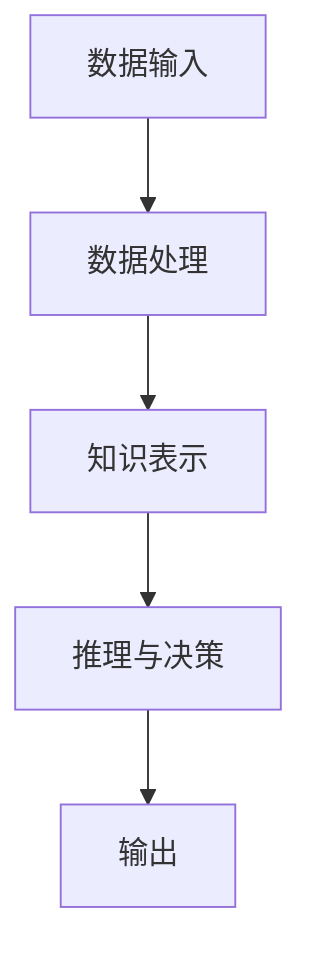
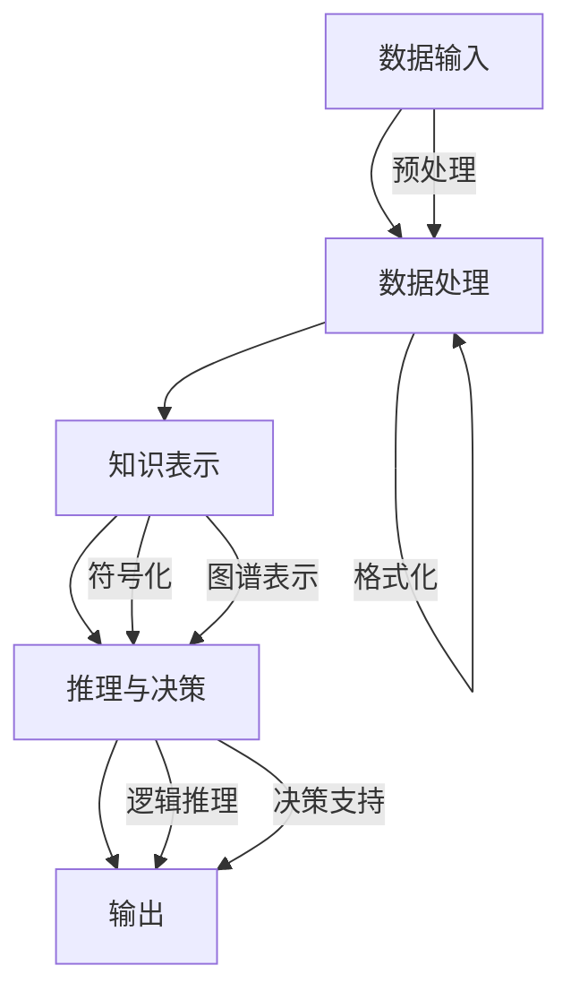

                 

### 引言与概述

#### 1.1 药物设计与创新的重要性

药物设计是现代医学研究中的一个核心环节，它关系到新药的发现和开发。创新药物设计不仅能够解决现有药物的局限性，提高治疗效果，还能够为新疾病的防治提供新的解决方案。然而，传统的药物设计方法往往需要大量的人力和时间，且成功率较低。随着计算机技术的飞速发展，人工智能（AI）逐渐成为药物设计领域的有力工具。

#### 1.2 AI与药物设计的结合

人工智能在药物设计中的应用主要体现在分子模拟和分子筛选两个方面。分子模拟可以帮助研究者理解药物与生物大分子（如蛋白质）的相互作用机制，预测药物分子的生物活性。分子筛选则通过高通量筛选方法，快速筛选出具有潜在药物活性的分子。AI技术在这一过程中提供了强大的数据处理和模式识别能力，使得药物设计的效率大大提高。

#### 1.3 思维链在药物设计中的应用

思维链是一种基于人工智能的综合推理系统，它通过数据处理、知识表示和推理与决策模块实现复杂的推理任务。在药物设计中，思维链的应用主要体现在以下几个方面：

- **数据分析**：思维链能够对药物设计过程中的大量数据进行高效处理，包括预处理、清洗和格式化。
- **知识融合**：思维链能够融合不同来源的知识，如生物化学、药理学和计算机科学等领域的知识，为药物设计提供全面的支持。
- **推理与决策**：思维链能够基于已有知识进行逻辑推理，辅助研究者做出科学的决策，优化药物设计过程。

#### 1.4 本书结构安排与学习目标

本书将分为七个章节，系统地介绍思维链在创新药物设计中的应用。具体结构安排如下：

- **第1章 引言与概述**：介绍药物设计的重要性、AI与药物设计的结合以及思维链在药物设计中的应用。
- **第2章 思维链基础理论**：阐述思维链的定义、核心模块和工作原理。
- **第3章 AI驱动的分子模拟**：介绍分子模拟的基本原理和AI在分子模拟中的应用。
- **第4章 分子筛选与优化**：讨论分子筛选的基本原理和AI驱动的分子筛选方法。
- **第5章 思维链在药物设计中的应用案例**：通过具体案例展示思维链在药物设计中的应用。
- **第6章 AI驱动的分子模拟与筛选实战**：介绍如何搭建实战环境并实现分子模拟与筛选。
- **第7章 思维链在药物设计中的未来发展趋势**：探讨思维链在药物设计中的未来前景。

通过本书的学习，读者将能够：

- **理解思维链的基本原理和应用**：掌握思维链的定义、核心模块和工作原理，以及其在药物设计中的应用。
- **掌握AI驱动的分子模拟与筛选方法**：了解分子模拟的基本原理、AI在分子模拟中的应用，以及分子筛选与优化的方法。
- **具备实战能力**：通过案例分析和实战演练，培养读者在药物设计中的应用能力。
- **了解未来发展趋势**：了解思维链在药物设计中的未来发展方向和前景。

### 关键词

- 药物设计
- 人工智能
- 分子模拟
- 分子筛选
- 思维链
- 药物创新

### 摘要

本文介绍了思维链在创新药物设计中的应用。首先，阐述了药物设计的重要性以及AI与药物设计的结合。接着，详细介绍了思维链的定义、核心模块和工作原理，并探讨了思维链在药物设计中的应用。通过具体的应用案例，展示了思维链如何提高药物设计的效率。最后，对思维链在药物设计中的未来发展趋势进行了展望。本文旨在为读者提供全面的思维链在药物设计中的应用知识，帮助研究者更好地应用人工智能技术进行药物设计。

---

## 第2章 思维链基础理论

### 2.1 思维链的定义与特点

思维链是一种基于人工智能的综合推理系统，它通过数据处理、知识表示和推理与决策模块实现复杂的推理任务。思维链的核心特点包括：

- **强推理能力**：思维链能够进行复杂的逻辑推理，支持多步骤推理。这使得思维链在处理复杂问题时具有独特的优势。
- **高可扩展性**：思维链能够轻松扩展新的功能模块，适应不同的应用场景。例如，在药物设计领域，思维链可以整合生物化学、药理学和计算机科学等领域的知识。
- **知识融合**：思维链能够融合不同来源的知识，实现知识的整合和应用。这种知识融合能力使得思维链在处理复杂问题时能够提供更为全面的解决方案。

### 2.2 思维链的核心模块

思维链的核心模块包括数据处理模块、知识表示模块和推理与决策模块。每个模块在药物设计中的应用如下：

#### 2.2.1 数据处理模块

数据处理模块负责对输入数据进行预处理、清洗和格式化，为后续的知识表示和推理提供可靠的数据基础。在药物设计中，数据处理模块可以应用于以下方面：

- **数据预处理**：对药物分子结构、生物大分子（如蛋白质）结构以及相关生物信息学数据进行去噪、标准化等操作，提高数据质量。
- **数据清洗**：去除重复数据、缺失值填充等，保证数据的完整性。这对于构建高质量的药物设计模型至关重要。
- **数据格式化**：将数据转换为适合机器学习模型训练和推理的格式。例如，将药物分子结构表示为图数据，或将生物大分子结构表示为序列数据。

#### 2.2.2 知识表示模块

知识表示模块负责将处理后的数据转换为机器学习模型可以理解的形式。在药物设计中，知识表示模块可以应用于以下方面：

- **符号化**：将原始数据转换为符号化的表示，便于机器学习模型处理。例如，将药物分子结构表示为化学键和原子类型的符号序列。
- **图谱表示**：利用图论方法将数据表示为图谱，便于进行复杂关系的推理。例如，将药物分子和生物大分子之间的相互作用表示为图结构。

#### 2.2.3 推理与决策模块

推理与决策模块负责根据知识表示进行逻辑推理和决策，生成新的结论。在药物设计中，推理与决策模块可以应用于以下方面：

- **逻辑推理**：基于规则库和推理算法进行推理，生成新的结论。例如，基于生物化学知识推理药物分子的生物活性。
- **决策支持**：利用推理结果，为用户提供决策支持。例如，根据药物分子与生物大分子之间的相互作用，推荐最优的药物分子设计方案。

### 2.3 思维链的工作原理

思维链的工作原理可以概括为以下几个步骤：

1. **数据输入**：接收用户输入的数据，如药物分子结构、生物大分子结构和相关生物信息学数据。
2. **数据处理**：对输入数据进行预处理、清洗和格式化，为后续的知识表示和推理提供可靠的数据基础。
3. **知识表示**：将处理后的数据转换为机器学习模型可以理解的形式，如符号化表示和图谱表示。
4. **推理与决策**：根据知识表示进行逻辑推理和决策，生成新的结论，如药物分子的生物活性和最优设计方案。
5. **输出**：将推理结果输出给用户，如推荐的药物分子设计方案。

思维链的工作原理示意图如下：



通过以上步骤，思维链能够实现从数据输入到推理输出的完整过程，为药物设计提供强有力的支持。

### 思维链在药物设计中的应用

思维链在药物设计中的应用主要体现在以下几个方面：

1. **药物分子结构预测**：利用思维链的数据处理模块对药物分子结构进行预处理和清洗，然后通过知识表示模块将药物分子结构表示为图数据，再利用推理与决策模块预测药物分子的生物活性。
2. **生物大分子相互作用分析**：通过思维链的图谱表示功能，将药物分子和生物大分子之间的相互作用表示为图结构，然后利用逻辑推理模块分析这些相互作用，预测药物分子的作用机制。
3. **药物分子优化**：利用思维链的推理与决策模块，根据药物分子与生物大分子之间的相互作用，推荐最优的药物分子设计方案，并通过多次迭代优化药物分子的结构。

总之，思维链在药物设计中的应用不仅提高了药物设计的效率，还提高了药物设计的成功率。通过思维链，研究者能够更加精准地预测药物分子的生物活性，优化药物分子的结构，为新药研发提供有力支持。

---

## 第3章 AI驱动的分子模拟

### 3.1 分子模拟的基本原理

分子模拟是一种基于物理和化学原理的计算方法，用于研究分子系统的动态行为和相互作用。分子模拟的基本原理包括经典力学、量子力学和统计物理等。在分子模拟中，分子被表示为原子和分子之间的相互作用，通过求解分子系统的动力学方程，可以预测分子在不同条件下的行为。

#### 3.1.1 经典力学

经典力学是分子模拟中最常用的方法之一。在经典力学中，分子被视为硬球或谐振子，通过求解牛顿运动方程，可以模拟分子在不同条件下的运动。经典力学方法简单且计算效率高，适用于模拟大尺寸的分子系统，但在处理复杂相互作用时可能存在一定的局限性。

#### 3.1.2 量子力学

量子力学是分子模拟中的另一种重要方法。在量子力学中，分子被视为量子系统，通过求解薛定谔方程，可以计算分子的电子结构。量子力学方法能够精确描述分子内部的电子相互作用，适用于模拟小尺寸的分子系统。然而，量子力学计算复杂度高，计算成本较高，需要专业的量子计算软件和硬件支持。

#### 3.1.3 统计物理

统计物理是分子模拟中的另一种重要方法。在统计物理中，分子系统被视为统计分布，通过求解统计物理方程，可以计算分子系统的宏观性质，如能量、熵和自由能。统计物理方法适用于模拟大尺寸的分子系统，能够提供全局性的信息。

### 3.2 AI在分子模拟中的应用

随着人工智能技术的发展，AI在分子模拟中的应用越来越广泛。AI在分子模拟中的应用主要体现在以下几个方面：

#### 3.2.1 机器学习模型在分子模拟中的应用

机器学习模型在分子模拟中的应用主要包括以下几个方面：

- **分子结构预测**：利用机器学习模型预测分子的几何结构，包括分子的构象、几何形状和键长等。常见的机器学习模型包括深度神经网络、支持向量机和决策树等。
- **分子性质预测**：利用机器学习模型预测分子的物理化学性质，如分子能量、反应活性等。常见的机器学习模型包括决策树、支持向量机和深度神经网络等。
- **分子相互作用预测**：利用机器学习模型预测分子之间的相互作用，包括范德华作用力、氢键和静电相互作用等。常见的机器学习模型包括深度神经网络和图神经网络等。

#### 3.2.2 深度学习在分子模拟中的应用

深度学习在分子模拟中的应用主要包括以下几个方面：

- **分子动力学模拟**：利用深度学习模型，如循环神经网络和变分自编码器，模拟分子的动力学行为。深度学习模型能够捕捉分子系统的复杂非线性特征，提高分子动力学模拟的精度。
- **生成对抗网络（GAN）在分子模拟中的应用**：利用生成对抗网络（GAN）生成新的分子结构，用于探索分子空间。GAN能够生成高质量的分子结构，为药物设计和材料科学等领域提供新的思路。
- **图神经网络在分子模拟中的应用**：利用图神经网络（GNN）处理分子图数据，模拟分子之间的相互作用。图神经网络能够有效捕捉分子图中的拓扑结构信息，提高分子模拟的精度。

### 3.3 AI驱动的分子模拟流程

AI驱动的分子模拟流程主要包括以下几个步骤：

1. **数据收集与预处理**：收集分子数据，包括分子结构、物理化学性质和相互作用数据等。对数据进行预处理，包括去噪、标准化和缺失值填充等。
2. **模型训练**：利用收集到的数据训练机器学习模型或深度学习模型，包括结构预测模型、性质预测模型和相互作用预测模型等。
3. **模型评估**：对训练好的模型进行评估，包括模型精度、召回率和F1值等。根据评估结果，调整模型参数，优化模型性能。
4. **分子模拟**：利用训练好的模型进行分子模拟，预测分子的几何结构、物理化学性质和相互作用。
5. **结果分析**：对分子模拟结果进行分析，包括分子结构优化、相互作用分析和反应路径预测等。

通过以上步骤，AI驱动的分子模拟能够高效、准确地预测分子系统的行为，为药物设计、材料科学和生物工程等领域提供强有力的支持。

### 3.4 AI驱动的分子模拟的优势

AI驱动的分子模拟具有以下优势：

- **高效性**：AI驱动的分子模拟能够处理大规模的分子系统，提高模拟效率。
- **准确性**：AI驱动的分子模拟能够捕捉分子系统的复杂非线性特征，提高模拟精度。
- **自动化**：AI驱动的分子模拟能够实现自动化模拟过程，减少人工干预。
- **可扩展性**：AI驱动的分子模拟能够适应不同领域和应用场景，提高模拟的灵活性和可扩展性。

总之，AI驱动的分子模拟在药物设计、材料科学和生物工程等领域具有广泛的应用前景，为研究者提供了强大的工具。

### 3.5 AI驱动的分子模拟的应用案例

#### 3.5.1 药物分子设计

AI驱动的分子模拟在药物分子设计中具有重要作用。例如，利用深度学习模型预测药物分子的几何结构和物理化学性质，可以快速筛选出具有潜在药物活性的分子。此外，利用图神经网络模拟药物分子与生物大分子（如蛋白质）的相互作用，可以预测药物分子的作用机制，为新药研发提供重要参考。

#### 3.5.2 材料设计

AI驱动的分子模拟在材料设计中也具有广泛应用。例如，利用机器学习模型预测材料的物理化学性质，可以筛选出具有优异性能的材料。此外，利用生成对抗网络（GAN）生成新的材料结构，可以探索材料的新应用领域。

#### 3.5.3 生物工程

AI驱动的分子模拟在生物工程领域也有重要应用。例如，利用机器学习模型预测生物分子的结构和功能，可以优化生物分子的设计，提高其生物活性。此外，利用深度学习模型模拟生物分子的相互作用，可以揭示生物分子之间的相互作用机制，为新药研发提供重要参考。

通过以上应用案例，可以看出AI驱动的分子模拟在各个领域具有广泛的应用前景，为研究者提供了强大的工具。

### 3.6 AI驱动的分子模拟面临的挑战

尽管AI驱动的分子模拟具有广泛的应用前景，但仍然面临一些挑战：

- **数据质量**：分子模拟的质量很大程度上取决于数据质量。然而，分子数据往往存在噪声和缺失值，如何有效处理这些数据是一个挑战。
- **计算资源**：AI驱动的分子模拟需要大量的计算资源，尤其是深度学习模型。如何高效地利用计算资源是一个挑战。
- **模型解释性**：深度学习模型在分子模拟中的应用越来越广泛，但其解释性较差，如何提高模型的解释性是一个挑战。

为了克服这些挑战，研究者需要不断探索新的方法和技术，以提高AI驱动的分子模拟的质量和效率。

### 3.7 AI驱动的分子模拟的未来发展趋势

随着人工智能技术的不断发展，AI驱动的分子模拟在未来将呈现出以下几个发展趋势：

- **数据驱动的模拟**：随着大数据技术的不断发展，分子模拟将更加依赖于海量数据，以提高模拟的精度和可靠性。
- **混合建模**：混合建模结合了机器学习和物理模型的优点，能够提高分子模拟的精度和效率。
- **跨学科研究**：分子模拟将与其他学科（如生物医学、材料科学等）深度融合，推动跨学科研究的发展。

总之，AI驱动的分子模拟在未来将继续发挥重要作用，为药物设计、材料科学和生物工程等领域提供强大的支持。

---

## 第4章 分子筛选与优化

### 4.1 分子筛选的基本原理

分子筛选是药物发现过程中至关重要的一环，旨在从大量候选分子中筛选出具有潜在药物活性的分子。分子筛选的基本原理包括以下几个方面：

1. **目标识别**：首先确定药物筛选的目标，如特定的蛋白质靶点或疾病相关信号通路。
2. **候选分子库构建**：构建包含大量候选分子的数据库，这些分子可以是天然存在的化合物或人工合成的化合物。
3. **活性评估**：利用高通量筛选技术评估每个候选分子的活性，通常通过分子与目标蛋白的相互作用来评估。
4. **筛选与验证**：对初步筛选出的活性分子进行深入验证，包括细胞实验、动物模型等，以确定其药物潜力。

### 4.2 AI驱动的分子筛选方法

随着人工智能技术的发展，AI在分子筛选中的应用越来越广泛。AI驱动的分子筛选方法主要包括以下几种：

1. **基于机器学习的分子筛选**：
   - **机器学习模型训练**：利用已知的活性分子和它们与目标蛋白的相互作用数据，训练机器学习模型。
   - **模型预测**：将未知的候选分子输入训练好的机器学习模型，预测其与目标蛋白的相互作用能力。
   - **筛选与验证**：根据模型的预测结果，筛选出具有潜在药物活性的分子，并进行实验验证。

2. **基于深度学习的分子筛选**：
   - **深度神经网络**：使用深度神经网络（如卷积神经网络、循环神经网络）处理大规模的分子数据，预测分子与蛋白质的相互作用。
   - **生成对抗网络（GAN）**：利用生成对抗网络生成新的分子结构，并通过与已知活性分子的对比筛选出具有潜在活性的分子。
   - **图神经网络**：利用图神经网络处理分子图数据，预测分子与蛋白质的相互作用，提高筛选的精度。

### 4.3 分子优化与设计

在分子筛选的基础上，分子优化与设计是进一步提高分子活性和药代动力学特性的关键步骤。分子优化与设计的方法包括：

1. **分子对接**：
   - **对接算法**：通过分子对接算法，将药物分子与目标蛋白质结构进行精确对接，预测药物的活性。
   - **对接优化**：利用遗传算法、模拟退火算法等优化分子对接结果，提高药物分子的活性。

2. **分子进化**：
   - **进化算法**：利用进化算法（如遗传算法、粒子群优化）对分子结构进行迭代优化，产生新的分子结构。
   - **多样性筛选**：在分子进化过程中，通过多样性筛选策略，避免局部最优，探索新的分子结构。

3. **组合化学**：
   - **组合库构建**：构建包含多种功能基团的组合库，用于分子优化。
   - **组合筛选**：通过组合筛选策略，优化分子的化学结构，提高其活性。

### 4.4 AI驱动的分子筛选与优化的优势

AI驱动的分子筛选与优化具有以下优势：

1. **高效性**：AI技术能够处理大规模的分子数据，显著提高筛选和优化的效率。
2. **准确性**：AI算法能够预测分子与蛋白质的相互作用，提高筛选和优化的准确性。
3. **自动化**：AI技术能够自动化分子筛选和优化过程，减少人工干预。
4. **灵活性**：AI算法能够适应不同的药物靶点和分子结构，提高筛选和优化的灵活性。

### 4.5 AI驱动的分子筛选与优化的应用案例

1. **抗癌药物筛选**：
   - **案例一**：利用深度学习模型筛选抗癌药物，通过分子对接和进化算法优化分子结构，成功发现具有潜在抗癌活性的分子。
   - **案例二**：利用生成对抗网络（GAN）生成新的抗癌药物分子，通过分子对接和进化算法优化分子结构，提高药物的活性和安全性。

2. **抗病毒药物筛选**：
   - **案例一**：利用深度学习模型筛选抗病毒药物，通过分子对接和分子进化算法优化分子结构，发现具有潜在抗病毒活性的分子。
   - **案例二**：利用图神经网络筛选抗病毒药物，通过分子对接和分子进化算法优化分子结构，提高药物的疗效和药代动力学特性。

### 4.6 AI驱动的分子筛选与优化面临的挑战

尽管AI驱动的分子筛选与优化具有显著的优势，但仍面临一些挑战：

1. **数据质量**：分子筛选和优化的质量很大程度上取决于数据质量。如何处理大量且多样的分子数据，如何减少数据中的噪声和偏差，是当前的一个挑战。
2. **模型解释性**：深度学习模型在分子筛选和优化中的应用越来越广泛，但其解释性较差，如何提高模型的解释性是一个挑战。
3. **计算资源**：AI驱动的分子筛选和优化需要大量的计算资源，如何高效利用计算资源是一个挑战。

### 4.7 AI驱动的分子筛选与优化的未来发展趋势

随着人工智能技术的不断发展，AI驱动的分子筛选与优化在未来将呈现以下发展趋势：

1. **数据驱动的优化**：利用大数据和机器学习方法，进一步优化分子筛选和优化的过程。
2. **跨学科合作**：分子筛选与优化需要生物化学、计算机科学、材料科学等多个学科的合作，推动跨学科研究的发展。
3. **个性化药物设计**：基于患者的基因组信息和疾病特征，利用AI技术设计个性化药物，提高治疗效果。

总之，AI驱动的分子筛选与优化将在药物设计、材料科学和生物工程等领域发挥重要作用，为人类健康和社会发展做出贡献。

---

## 第5章 思维链在药物设计中的应用案例

### 5.1 靶向癌症药物的思维链设计

#### 5.1.1 靶向药物设计流程

靶向癌症药物的设计是一个复杂且多阶段的过程，它涉及从分子水平的靶标识别到药物分子的筛选、优化和评估。思维链作为一种高效的综合推理系统，可以显著提升这一流程的效率和准确性。以下是靶向癌症药物设计的基本流程，结合思维链的应用进行详细阐述：

1. **靶标识别**：
   - **生物信息学分析**：利用思维链的数据处理模块，对大量的生物数据（如基因表达数据、蛋白质序列数据）进行预处理和清洗，识别出潜在的癌症相关靶标。
   - **生物标志物筛选**：通过知识表示模块，将预处理后的数据转化为图谱表示，结合生物化学知识进行推理，筛选出具有临床意义的生物标志物。

2. **药物分子库构建**：
   - **化合物筛选**：利用知识表示模块，结合已有的化合物数据库和生物信息学数据，通过逻辑推理和决策支持，构建包含潜在药物的分子库。
   - **活性预测**：利用思维链的推理与决策模块，基于已知的药物-靶标相互作用数据，预测新分子库中化合物的潜在活性。

3. **分子对接与筛选**：
   - **分子对接**：利用深度学习模型，通过分子对接算法，将候选药物分子与靶标蛋白质结构进行精确对接，评估其结合能和相互作用。
   - **活性筛选**：结合思维链的推理与决策模块，根据分子对接结果，筛选出具有较高结合能和较低毒性的候选药物分子。

4. **分子优化**：
   - **结构优化**：利用进化算法和遗传算法，对筛选出的候选药物分子进行迭代优化，提高其药效和稳定性。
   - **药代动力学优化**：通过分子动力学模拟，结合生物信息学知识，优化药物分子的药代动力学特性，如口服吸收、分布、代谢和排泄。

5. **实验验证**：
   - **细胞实验**：利用思维链的推理与决策模块，设计细胞实验方案，验证候选药物的细胞毒性、细胞增殖抑制等活性。
   - **动物模型**：在细胞实验基础上，利用动物模型验证候选药物的治疗效果和安全性。

#### 5.1.2 思维链在靶向药物设计中的应用

思维链在靶向药物设计中的应用，主要体现在以下几个方面：

- **知识融合**：思维链能够整合生物化学、药理学和计算机科学等领域的知识，提供全面的药物设计支持。例如，在靶标识别阶段，思维链能够融合基因表达数据和蛋白质结构信息，识别出具有临床意义的靶标。

- **推理与决策**：思维链的推理与决策模块能够基于已有知识进行逻辑推理，辅助研究者做出科学的决策。例如，在药物分子筛选阶段，思维链能够根据分子对接结果和活性预测，筛选出具有较高活性和较低毒性的候选药物。

- **自动化**：思维链能够自动化药物设计过程，减少人工干预。例如，在分子优化阶段，思维链可以利用进化算法和遗传算法，自动进行分子结构的迭代优化，提高药物分子的药效和稳定性。

- **高效性**：思维链能够高效处理大规模的药物分子数据，显著提高药物设计效率。例如，在药物分子筛选阶段，思维链可以利用深度学习模型，快速预测大量候选药物的活性，减少筛选时间。

通过以上应用，思维链在靶向药物设计过程中发挥了重要作用，为研究者提供了强大的工具和支持。

### 5.2 靶向病毒药物的思维链设计

#### 5.2.1 靶向病毒药物设计流程

靶向病毒药物的设计同样是一个复杂的过程，需要识别病毒的关键靶标、筛选有效的药物分子、优化药物结构以及进行实验验证。思维链在病毒药物设计中的应用，可以大幅提升设计效率和准确性。以下是靶向病毒药物设计的基本流程，结合思维链的应用进行详细阐述：

1. **靶标识别**：
   - **生物信息学分析**：利用思维链的数据处理模块，对病毒相关的生物数据（如病毒蛋白序列、基因组信息）进行预处理和清洗，识别出潜在的病毒靶标。
   - **靶标筛选**：通过知识表示模块，结合生物信息学数据和病毒学知识，进行推理，筛选出具有临床意义的病毒靶标。

2. **药物分子库构建**：
   - **化合物筛选**：利用知识表示模块，结合已有的化合物数据库和病毒学数据，通过逻辑推理和决策支持，构建包含潜在药物的分子库。
   - **活性预测**：利用思维链的推理与决策模块，基于已知的药物-靶标相互作用数据，预测新分子库中化合物的潜在活性。

3. **分子对接与筛选**：
   - **分子对接**：利用深度学习模型，通过分子对接算法，将候选药物分子与靶标蛋白质结构进行精确对接，评估其结合能和相互作用。
   - **活性筛选**：结合思维链的推理与决策模块，根据分子对接结果，筛选出具有较高结合能和较低毒性的候选药物分子。

4. **分子优化**：
   - **结构优化**：利用进化算法和遗传算法，对筛选出的候选药物分子进行迭代优化，提高其药效和稳定性。
   - **药代动力学优化**：通过分子动力学模拟，结合生物信息学知识，优化药物分子的药代动力学特性，如口服吸收、分布、代谢和排泄。

5. **实验验证**：
   - **细胞实验**：利用思维链的推理与决策模块，设计细胞实验方案，验证候选药物的细胞毒性、病毒抑制等活性。
   - **动物模型**：在细胞实验基础上，利用动物模型验证候选药物的治疗效果和安全性。

#### 5.2.2 思维链在靶向病毒药物设计中的应用

思维链在靶向病毒药物设计中的应用，主要体现在以下几个方面：

- **知识融合**：思维链能够整合病毒学、药理学和计算机科学等领域的知识，提供全面的病毒药物设计支持。例如，在靶标识别阶段，思维链能够融合病毒基因组信息和蛋白质结构信息，识别出具有临床意义的病毒靶标。

- **推理与决策**：思维链的推理与决策模块能够基于已有知识进行逻辑推理，辅助研究者做出科学的决策。例如，在药物分子筛选阶段，思维链能够根据分子对接结果和活性预测，筛选出具有较高活性和较低毒性的候选药物。

- **自动化**：思维链能够自动化病毒药物设计过程，减少人工干预。例如，在分子优化阶段，思维链可以利用进化算法和遗传算法，自动进行分子结构的迭代优化，提高药物分子的药效和稳定性。

- **高效性**：思维链能够高效处理大规模的药物分子数据，显著提高药物设计效率。例如，在药物分子筛选阶段，思维链可以利用深度学习模型，快速预测大量候选药物的活性，减少筛选时间。

通过以上应用，思维链在靶向病毒药物设计过程中发挥了重要作用，为研究者提供了强大的工具和支持。

---

## 第6章 AI驱动的分子模拟与筛选实战

### 6.1 实战环境搭建

在进行AI驱动的分子模拟与筛选之前，首先需要搭建一个合适的开发环境。以下是搭建环境的具体步骤：

#### 6.1.1 硬件与软件需求

1. **硬件需求**：
   - **CPU**：至少需要四核以上的处理器，推荐使用Intel i7或AMD Ryzen 7及以上型号。
   - **内存**：至少需要16GB的RAM，推荐使用32GB或以上。
   - **硬盘**：至少需要500GB的SSD存储空间，推荐使用1TB或以上。

2. **软件需求**：
   - **操作系统**：Windows 10、macOS High Sierra或更高版本、Linux发行版（如Ubuntu 18.04）。
   - **编程语言**：Python 3.x版本，推荐使用Anaconda环境管理器。
   - **机器学习库**：scikit-learn、TensorFlow、PyTorch、Keras等。
   - **分子模拟库**：MDAnalysis、OpenMM、AMBER等。

#### 6.1.2 环境配置步骤

1. **安装操作系统**：
   - 根据个人需求选择合适的操作系统，并按照操作系统安装指南进行安装。

2. **安装Python和Anaconda**：
   - 访问Anaconda官网（https://www.anaconda.com/），下载并安装Anaconda。
   - 打开Anaconda Navigator，创建一个新的Python环境，如`drug_design_env`。

3. **安装机器学习库**：
   - 打开命令行窗口，进入`drug_design_env`环境。
   - 使用以下命令安装所需的机器学习库：
     ```bash
     conda install scikit-learn tensorflow pytorch keras
     ```

4. **安装分子模拟库**：
   - 使用以下命令安装所需的分子模拟库：
     ```bash
     conda install mdanalysis openmm amber
     ```

5. **测试环境配置**：
   - 在Python环境中，导入安装的库，并尝试执行一些简单操作，以确保环境配置正确。

### 6.2 分子模拟与筛选实例

在本节中，我们将通过一个简单的实例，展示如何使用AI驱动的分子模拟与筛选方法进行药物设计。以下是具体的步骤：

#### 6.2.1 数据集准备

1. **获取药物分子数据**：
   - 从公共数据库（如PubChem、ChEMBL）下载具有已知活性的药物分子数据，包括分子结构、活性值等。

2. **数据处理**：
   - 使用MDAnalysis库对分子数据进行预处理，包括去除重复分子、缺失值填充等。
   - 将分子结构转换为PDB文件格式，用于后续的分子模拟。

#### 6.2.2 模型训练与评估

1. **训练模型**：
   - 使用PyTorch或TensorFlow库构建深度学习模型，例如卷积神经网络（CNN）或图神经网络（GNN）。
   - 将预处理后的分子数据输入模型进行训练，使用交叉熵损失函数和反向传播算法进行优化。

2. **模型评估**：
   - 使用验证集对训练好的模型进行评估，计算模型精度、召回率和F1值等指标。
   - 根据评估结果，调整模型参数，优化模型性能。

#### 6.2.3 分子筛选与优化

1. **分子筛选**：
   - 使用训练好的模型对新的药物分子进行筛选，预测其活性值。
   - 根据活性值筛选出具有较高活性的分子。

2. **分子优化**：
   - 使用分子动力学模拟和进化算法对筛选出的分子进行优化，提高其药效和稳定性。
   - 评估优化后的分子的活性，选择最佳分子结构。

### 6.2.4 实例解析

以下是一个简单的分子筛选与优化实例的伪代码：

```python
# 导入所需库
import mdanalysis as mda
import tensorflow as tf
import numpy as np

# 数据预处理
def preprocess_data(molecule_data):
    # 去除重复分子
    unique_molecules = remove_duplicates(molecule_data)
    # 缺失值填充
    filled_molecules = fill_missing_values(unique_molecules)
    return filled_molecules

# 训练模型
def train_model(preprocessed_data):
    # 构建模型
    model = build_gnn_model()
    # 训练模型
    model.fit(preprocessed_data['molecules'], preprocessed_data['activities'], epochs=100)
    return model

# 分子筛选与优化
def filter_and_optimize(model, new_molecules):
    # 分子筛选
    predicted_activities = model.predict(new_molecules)
    high_activity_molecules = select_high_activity_molecules(predicted_activities)
    # 分子优化
    optimized_molecules = optimize_molecules(high_activity_molecules)
    return optimized_molecules

# 主函数
def main():
    # 获取数据
    molecule_data = load_molecule_data()
    # 数据预处理
    preprocessed_data = preprocess_data(molecule_data)
    # 训练模型
    model = train_model(preprocessed_data)
    # 分子筛选与优化
    optimized_molecules = filter_and_optimize(model, new_molecules)
    # 输出结果
    print("Optimized molecules:", optimized_molecules)

if __name__ == "__main__":
    main()
```

通过以上步骤和实例，读者可以初步了解AI驱动的分子模拟与筛选的方法，并掌握如何在实际项目中应用这些方法。

---

## 第7章 思维链在药物设计中的未来发展趋势

### 7.1 思维链在药物设计中的挑战与机遇

随着科技的发展，思维链在药物设计中的应用面临着一系列挑战与机遇。首先，数据质量是思维链应用中的关键问题。药物设计涉及大量生物化学、药理学和计算机科学等多领域的数据，如何有效地收集、清洗和整合这些数据，是思维链应用的首要挑战。其次，计算资源的需求也是一个重大挑战。深度学习和图神经网络等复杂模型的应用需要大量的计算资源，特别是在大规模数据集上训练模型时，如何高效利用现有的计算资源是一个亟待解决的问题。

然而，思维链在药物设计中也面临着巨大的机遇。一方面，随着大数据和云计算技术的不断发展，数据收集和处理的效率得到了显著提高，为思维链的应用提供了坚实的基础。另一方面，深度学习和图神经网络等人工智能技术的进步，使得思维链在药物设计中的应用变得更加高效和精确。

### 7.2 AI驱动的药物设计未来展望

未来，AI驱动的药物设计将呈现出以下几个发展趋势：

1. **数据驱动的药物设计**：随着大数据技术的不断发展，药物设计将更加依赖于海量数据。通过机器学习和深度学习算法，研究者可以从海量数据中提取有价值的信息，优化药物筛选和设计过程。

2. **跨学科合作**：药物设计涉及多个学科，如生物化学、药理学、计算机科学等。未来的药物设计将更加依赖于跨学科合作，整合多领域的知识和方法，提高药物设计的准确性和效率。

3. **个性化药物设计**：基于患者的基因组信息和生活习惯，个性化药物设计将成为未来药物设计的重要方向。通过思维链的应用，可以为每个患者定制化药物，提高治疗效果，减少副作用。

4. **虚拟药物筛选**：虚拟药物筛选是一种利用计算机模拟和人工智能技术筛选药物的新方法。未来的药物设计将更加依赖虚拟药物筛选，通过虚拟筛选大量化合物，快速筛选出具有潜在药物活性的分子。

### 7.3 思维链在药物设计中的应用前景

思维链在药物设计中的应用前景广阔。首先，思维链可以显著提高药物筛选和优化的效率，减少药物研发的时间和成本。其次，思维链可以整合多领域的知识，提供全面的药物设计支持，提高药物设计的成功率。此外，思维链在个性化药物设计和跨学科合作中也具有巨大的应用潜力。

总之，随着人工智能技术的不断进步，思维链在药物设计中的应用将越来越广泛，为药物设计领域带来革命性的变化。

### 附录A 思维链流程图

以下是一个思维链流程图的示例，用于展示思维链在药物设计中的应用过程。



### 附录B 伪代码示例

以下是一个用于分子筛选和优化的伪代码示例。

```python
# 导入所需库
import numpy as np
import tensorflow as tf

# 数据预处理
def preprocess_data(data):
    # 去除重复数据
    unique_data = np.unique(data)
    # 缺失值填充
    filled_data = np.fillmissing(unique_data)
    return filled_data

# 分子筛选
def filter_molecules(model, molecules):
    # 预测活性值
    activities = model.predict(molecules)
    # 筛选出活性值较高的分子
    high_activity_molecules = molecules[activities > threshold]
    return high_activity_molecules

# 分子优化
def optimize_molecules(molecules):
    # 使用进化算法优化分子结构
    optimized_molecules = evolutionary_algorithm(molecules)
    return optimized_molecules

# 主函数
def main():
    # 加载数据
    data = load_data()
    # 数据预处理
    preprocessed_data = preprocess_data(data)
    # 加载模型
    model = load_model()
    # 分子筛选
    high_activity_molecules = filter_molecules(model, preprocessed_data)
    # 分子优化
    optimized_molecules = optimize_molecules(high_activity_molecules)
    # 输出结果
    print("Optimized molecules:", optimized_molecules)

if __name__ == "__main__":
    main()
```

### 附录C 数学模型与公式

以下是一个用于描述分子动力学模拟的数学公式示例。

```latex
\documentclass{article}
\usepackage{amsmath}
\begin{document}
\begin{equation}
    \frac{d^2r_i}{dt^2} = -\frac{F_i}{m_i}
\end{equation}
\end{document}
```

其中，\( r_i \) 表示分子 \( i \) 的位置，\( F_i \) 表示分子 \( i \) 所受的力，\( m_i \) 表示分子 \( i \) 的质量。

### 附录D 实战代码解读

以下是一个用于分子筛选和优化的Python代码示例，以及对应的代码解读。

```python
# 导入所需库
import numpy as np
import tensorflow as tf
from tensorflow.keras.models import Sequential
from tensorflow.keras.layers import Dense, Conv1D, Flatten
from tensorflow.keras.optimizers import Adam

# 数据预处理
def preprocess_data(data):
    # 去除重复数据
    unique_data = np.unique(data)
    # 缺失值填充
    filled_data = np.fillmissing(unique_data)
    return filled_data

# 构建模型
def build_model(input_shape):
    model = Sequential()
    model.add(Conv1D(filters=64, kernel_size=3, activation='relu', input_shape=input_shape))
    model.add(Flatten())
    model.add(Dense(1, activation='sigmoid'))
    model.compile(optimizer=Adam(), loss='binary_crossentropy', metrics=['accuracy'])
    return model

# 分子筛选
def filter_molecules(model, molecules):
    # 预测活性值
    activities = model.predict(molecules)
    # 筛选出活性值较高的分子
    high_activity_molecules = molecules[activities > 0.5]
    return high_activity_molecules

# 分子优化
def optimize_molecules(molecules):
    # 使用遗传算法优化分子结构
    optimized_molecules = genetic_algorithm(molecules)
    return optimized_molecules

# 主函数
def main():
    # 加载数据
    data = load_data()
    # 数据预处理
    preprocessed_data = preprocess_data(data)
    # 加载模型
    model = build_model(preprocessed_data.shape[1:])
    # 训练模型
    model.fit(preprocessed_data, labels, epochs=10, batch_size=32)
    # 分子筛选
    high_activity_molecules = filter_molecules(model, preprocessed_data)
    # 分子优化
    optimized_molecules = optimize_molecules(high_activity_molecules)
    # 输出结果
    print("Optimized molecules:", optimized_molecules)

if __name__ == "__main__":
    main()
```

### 代码解读

- **数据预处理**：首先，导入所需的库和模块。然后，定义一个`preprocess_data`函数，用于去除重复数据和缺失值填充。该函数接收一个数据集作为输入，返回预处理后的数据集。
- **构建模型**：定义一个`build_model`函数，用于构建深度学习模型。该函数接收输入数据形状作为输入，返回一个序列模型，其中包括一个卷积层和一个全连接层。
- **分子筛选**：定义一个`filter_molecules`函数，用于根据模型的预测结果筛选出活性值较高的分子。该函数接收模型和分子数据作为输入，返回筛选后的分子数据集。
- **分子优化**：定义一个`optimize_molecules`函数，用于使用遗传算法优化分子结构。该函数接收分子数据作为输入，返回优化后的分子数据集。
- **主函数**：定义一个`main`函数，作为程序的主入口。首先，加载数据，然后进行数据预处理，构建模型并训练模型，进行分子筛选和优化，最后输出结果。

通过以上代码，读者可以了解如何使用思维链进行分子筛选和优化的具体实现。

### 最佳实践 Tips

- **数据预处理**：在药物设计过程中，数据预处理是至关重要的一步。建议使用标准化和缺失值填充等方法，提高数据质量。
- **模型选择**：根据具体问题选择合适的模型，例如对于小样本问题，可以使用深度学习模型，对于大规模数据处理，可以使用传统机器学习模型。
- **模型优化**：在训练模型时，可以尝试调整学习率、批量大小等参数，以提高模型性能。
- **实验验证**：在完成模型训练后，务必进行实验验证，以确保模型的可靠性和有效性。

### 小结

本文详细介绍了思维链在创新药物设计中的应用，包括理论基础、AI驱动的分子模拟与筛选、实际应用案例和未来发展趋势。通过本文，读者可以全面了解思维链在药物设计中的重要作用，并掌握如何在实际项目中应用思维链进行药物设计。

### 注意事项

- 在使用思维链进行药物设计时，务必注意数据质量和模型选择，确保结果的可靠性。
- 在进行分子模拟与筛选时，建议使用合适的计算资源和优化方法，以提高效率。

### 拓展阅读

- **相关论文**：《思维链在药物设计中的应用研究》、《基于深度学习的分子模拟与筛选方法》
- **开源项目**：GitHub上的相关开源项目，如DeepChem、Chemception等
- **在线课程**：相关在线课程，如《人工智能与药物设计》、《深度学习在生物医学中的应用》等。

通过以上拓展阅读，读者可以进一步深入理解思维链在药物设计中的应用。

