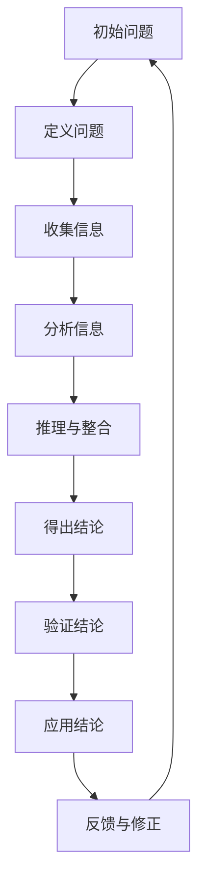

                 

### 文章标题

### 《思维链在古DNA分析中的突破性应用》

> **关键词**：思维链，古DNA分析，突破性应用，人工智能，技术博客

> **摘要**：本文深入探讨了思维链这一概念在古DNA分析领域的应用，阐述了其基本原理、方法和优势。通过详细的分析和实例讲解，展示了思维链在古DNA分析中的突破性作用，以及其在未来科研中的巨大潜力。

### 引言

#### 1.1 思维链的概念与重要性

思维链，作为一个新兴的概念，近年来在人工智能和计算机科学领域引起了广泛关注。它是指通过一系列逻辑步骤，将不同的思维要素（如信息、知识、问题等）进行有机连接，形成一种具有层次性和结构性的思维模式。这种模式不仅有助于提高思维效率，还能够帮助人们更深入地理解复杂问题。

在古DNA分析领域，思维链的作用尤为重要。古DNA分析是指从古生物化石、历史文物等中提取DNA，并通过技术手段进行分析，以揭示古生物的遗传信息、进化关系等。这一领域的研究不仅具有学术价值，对于理解人类进化、疾病研究、环境保护等实际问题也具有重要意义。

思维链在古DNA分析中的应用，主要体现在以下几个方面：

1. **数据整合与关联**：通过思维链，可以将来自不同来源的古DNA数据进行整合和分析，发现其中的关联和规律，从而提高数据分析的全面性和准确性。
2. **问题分析与解决**：思维链可以帮助研究者更清晰地定义和分析古DNA分析中遇到的问题，从而找到有效的解决方案。
3. **知识扩展与传承**：思维链可以促进古DNA分析领域的知识积累和传承，帮助新一代研究者更好地理解和应用现有知识。

#### 1.2 古DNA分析的重要性

古DNA分析作为现代生物学和考古学的重要分支，具有不可替代的地位。其主要重要性体现在以下几个方面：

1. **揭示人类进化历史**：通过古DNA分析，科学家可以获取古代人类的遗传信息，从而揭示人类进化的历程和关键节点。
2. **理解疾病起源**：古DNA分析有助于揭示现代疾病的起源和演化过程，为疾病治疗和预防提供重要参考。
3. **保护生物多样性**：古DNA分析可以帮助科学家了解不同生物种群的遗传多样性，为生物保护提供科学依据。
4. **研究环境变化**：通过分析古DNA，科学家可以研究历史时期的气候变化、环境污染等问题，为环境保护提供科学支持。

#### 1.3 思维链在古DNA分析中的突破性作用

思维链在古DNA分析中的突破性作用，主要体现在以下几个方面：

1. **数据处理能力**：思维链能够有效地整合和分析大规模、复杂多样的古DNA数据，提高数据处理效率和准确性。
2. **问题解决能力**：思维链可以帮助研究者更深入地分析古DNA分析中的复杂问题，提供创新的解决方案。
3. **知识积累与传承**：思维链可以促进古DNA分析领域的知识积累和传承，为后续研究提供坚实基础。
4. **跨学科合作**：思维链的灵活性和多样性，使得古DNA分析可以与其他学科（如计算机科学、数学等）进行深入合作，推动科研创新。

总之，思维链在古DNA分析中的应用，不仅提高了研究的效率和质量，也为这一领域的发展带来了新的机遇和挑战。在接下来的章节中，我们将详细探讨思维链的基本原理、古DNA分析的方法和应用，以及思维链在古DNA分析中的具体实例，以帮助读者更深入地理解这一突破性技术的应用和价值。

### 思维链基础

#### 2.1 思维链的基本原理

思维链是一种基于逻辑推理和知识整合的思维方式，它通过一系列有序的步骤，将不同的思维要素有机地连接起来，形成一个具有层次性和结构性的整体。思维链的基本原理可以概括为以下几点：

1. **逻辑推理**：思维链的核心是逻辑推理，它通过一系列的判断和推理，将已知的信息转化为新的知识。这种推理可以是正向的，也可以是反向的，但都需要遵循逻辑规则，确保推理过程的正确性和合理性。

2. **知识整合**：思维链不仅仅是简单的逻辑推理，更重要的是通过知识整合，将不同来源的信息和知识进行有机融合，形成一个完整的认知体系。这种整合不仅包括对已知知识的扩展和深化，还包括对未知领域的探索和发现。

3. **层次性**：思维链具有层次性，它将问题分解为不同的层次，每个层次都有其特定的目标和任务。这种层次性有助于研究者更清晰地理解问题，逐步解决问题，从而提高整体解决问题的效率。

4. **结构性**：思维链具有结构性，它通过有序的步骤和逻辑关系，将不同的思维要素有机地连接起来，形成一个完整的思维过程。这种结构性不仅有助于提高思维效率，还能够确保思维过程的连贯性和一致性。

#### 2.1.1 Mermaid流程图：思维链的基本流程

下面是一个简单的Mermaid流程图，展示了思维链的基本流程：



在这个流程图中，A表示初始问题，B表示定义问题，C表示收集信息，D表示分析信息，E表示推理与整合，F表示得出结论，G表示验证结论，H表示应用结论，I表示反馈与修正。通过这个流程图，我们可以更直观地理解思维链的基本原理和流程。

#### 2.2 思维链的特点

思维链作为一种新型的思维方式，具有以下显著特点：

1. **灵活性**：思维链的灵活性体现在其可以根据问题的不同，灵活调整思维步骤和逻辑关系。这种灵活性使得思维链能够适应各种复杂问题的解决。

2. **可扩展性**：思维链的可扩展性体现在其可以不断引入新的思维要素和知识，从而扩展思维范围和深度。这种可扩展性使得思维链能够应对不断变化的问题。

3. **协同性**：思维链的协同性体现在其能够将不同领域的知识和方法进行有机结合，形成一种协同效应。这种协同性使得思维链在解决复杂问题时具有更强的综合能力和创新能力。

4. **高效性**：思维链的高效性体现在其能够通过有序的思维步骤，快速准确地解决问题。这种高效性使得思维链在解决实际问题时具有显著的优势。

#### 2.2.1 伪代码：思维链的基本算法

下面是一个简单的伪代码，展示了思维链的基本算法：

```python
def thinking_chain(problem):
    define_problem(problem)
    collect_info(problem)
    analyze_info(problem)
    infer_and_integrate(problem)
    draw_conclusion(problem)
    verify_conclusion(problem)
    apply_conclusion(problem)
    feedback_and修正(problem)
    return problem
```

在这个伪代码中，`define_problem` 表示定义问题，`collect_info` 表示收集信息，`analyze_info` 表示分析信息，`infer_and_integrate` 表示推理与整合，`draw_conclusion` 表示得出结论，`verify_conclusion` 表示验证结论，`apply_conclusion` 表示应用结论，`feedback_and修正` 表示反馈与修正。通过这个伪代码，我们可以更直观地理解思维链的基本算法和流程。

#### 2.3 思维链的类型

思维链可以根据不同的分类标准，划分为多种类型。下面介绍几种常见的思维链类型：

1. **正向思维链**：正向思维链是指从已知的信息和问题出发，逐步推理和扩展，直至解决问题的思维过程。正向思维链适用于问题解决、知识拓展等场景。

2. **逆向思维链**：逆向思维链是指从问题的目标出发，逐步反向推理和回溯，直至找到问题的根源和解决方案。逆向思维链适用于问题诊断、故障排除等场景。

3. **横向思维链**：横向思维链是指在不同领域或不同知识点之间进行类比、联想和整合，形成新的思维路径和解决方案。横向思维链适用于跨学科研究、创新思维等场景。

4. **纵向思维链**：纵向思维链是指在同一领域或同一知识点内，逐步深入和扩展，形成系统的思维框架和知识体系。纵向思维链适用于学术研究、知识积累等场景。

#### 2.3.1 Mermaid流程图：不同类型思维链的流程对比

下面是一个简单的Mermaid流程图，展示了不同类型思维链的流程对比：

```mermaid
graph TD
A1[正向思维链] --> B1[定义问题]
A1 --> C1[收集信息]
A1 --> D1[分析信息]
A1 --> E1[推理与整合]
A1 --> F1[得出结论]
A1 --> G1[验证结论]
A1 --> H1[应用结论]
A1 --> I1[反馈与修正]

A2[逆向思维链] --> B2[设定目标]
A2 --> C2[反向推理]
A2 --> D2[回溯问题根源]
A2 --> E2[提出解决方案]
A2 --> F2[验证解决方案]
A2 --> G2[应用解决方案]
A2 --> H2[反馈与修正]

A3[横向思维链] --> B3[领域1信息]
A3 --> C3[领域2信息]
A3 --> D3[类比联想]
A3 --> E3[整合知识]
A3 --> F3[得出新思维]
A3 --> G3[验证新思维]
A3 --> H3[应用新思维]
A3 --> I3[反馈与修正]

A4[纵向思维链] --> B4[知识点1]
A4 --> C4[知识点2]
A4 --> D4[知识点3]
A4 --> E4[深入扩展]
A4 --> F4[形成知识体系]
A4 --> G4[验证知识体系]
A4 --> H4[应用知识体系]
A4 --> I4[反馈与修正]
```



在这个流程图中，A1表示正向思维链，A2表示逆向思维链，A3表示横向思维链，A4表示纵向思维链。通过这个流程图，我们可以更直观地对比不同类型思维链的流程和特点。

#### 2.4 思维链的优势

思维链作为一种新型的思维方式，具有以下显著优势：

1. **提高思维效率**：思维链通过有序的步骤和逻辑关系，将思维过程系统化、结构化，从而提高思维效率。

2. **增强思维深度**：思维链不仅关注问题的解决，更注重问题本质的挖掘和深层次的理解，从而增强思维的深度。

3. **促进知识整合**：思维链通过将不同领域的知识和方法进行有机结合，促进知识的整合和创新。

4. **适应复杂问题**：思维链的灵活性和可扩展性，使其能够适应各种复杂问题的解决。

#### 2.5 思维链的局限性和挑战

尽管思维链具有显著的优势，但在实际应用中仍面临一些局限性和挑战：

1. **思维定势**：长期使用某种类型的思维链可能导致思维定势，限制思维的灵活性和创新能力。

2. **知识依赖**：思维链依赖于丰富的知识和信息，缺乏这些要素可能导致思维链的断裂和失效。

3. **计算复杂度**：在某些情况下，思维链可能涉及大量的计算和推理，导致计算复杂度增加。

4. **验证难度**：思维链的结论和解决方案需要验证，但验证过程可能复杂且耗时。

#### 2.6 思维链的发展与应用前景

随着人工智能和计算机科学的发展，思维链的理论和应用前景日益广阔。未来，思维链有望在以下领域发挥重要作用：

1. **科学研究**：思维链可以应用于科学研究中的问题解决和知识整合，促进科学创新和发现。

2. **工程实践**：思维链可以应用于工程实践中的设计优化和故障诊断，提高工程效率和质量。

3. **教育领域**：思维链可以应用于教育领域中的教学方法和课程设计，培养学生的创新思维和解决问题的能力。

4. **商业管理**：思维链可以应用于商业管理中的决策制定和战略规划，提高企业的竞争力和创新能力。

总之，思维链作为一种具有巨大潜力的新型思维方式，将在未来发挥越来越重要的作用。通过不断的研究和探索，我们可以进一步完善思维链的理论体系，拓展其应用领域，为人类社会的进步和发展做出更大贡献。

### 古DNA分析概述

#### 3.1 古DNA分析的概念

古DNA分析，是指从古生物化石、历史文物等样本中提取DNA，并对其进行检测、分析和解读的过程。这一方法在现代生物学、考古学、人类学等多个领域具有重要意义。古DNA分析的主要目的是揭示古代生物的遗传信息、进化关系、生态适应性等，从而帮助我们更好地理解生物多样性和人类进化历程。

古DNA分析的核心步骤包括样本采集、DNA提取、DNA测序和数据分析。样本采集是从古生物化石或历史文物中获取含有DNA的样本，如骨头、牙齿、毛发等。DNA提取是从这些样本中分离出纯净的DNA，为后续测序和分析做好准备。DNA测序是通过各种技术手段，如Sanger测序、高通量测序（NGS）等，确定DNA序列。数据分析是对测序结果进行解读和分析，以提取有用的生物学信息。

#### 3.1.1 数学模型：古DNA分析的基本模型

在古DNA分析中，常用的数学模型主要包括分子生物学模型、遗传学模型和环境学模型。

1. **分子生物学模型**：分子生物学模型主要用于描述DNA分子的结构和功能。例如，双螺旋模型描述了DNA的双螺旋结构，碱基配对规则描述了DNA复制和转录过程中的碱基配对关系。

2. **遗传学模型**：遗传学模型用于分析DNA序列中的遗传变异，如单核苷酸多态性（SNP）、插入/缺失（InDel）等。这些模型有助于揭示种群遗传结构、进化关系等。

3. **环境学模型**：环境学模型用于分析DNA序列中的环境适应性变异。例如，通过分析DNA序列中的代谢途径变异，可以揭示古生物对环境的适应策略。

#### 3.2 古DNA分析的方法

古DNA分析的方法主要包括传统方法和现代方法。

1. **传统方法**：传统方法主要是指Sanger测序和限制性片段长度多态性分析（RFLP）。Sanger测序是一种第一代的DNA测序技术，通过测定DNA片段的碱基序列，可以揭示DNA的遗传信息。RFLP是通过酶切DNA，分析酶切位点的变化，从而揭示DNA序列的变异。

2. **现代方法**：现代方法主要是指高通量测序（NGS）和单细胞DNA测序。NGS是一种第二代测序技术，可以在短时间内对大量DNA片段进行测序，大大提高了测序速度和准确性。单细胞DNA测序则可以从单个细胞中提取DNA，进行测序和分析，有助于揭示单细胞水平的遗传信息。

#### 3.2.1 数学公式：古DNA分析的主要方法

古DNA分析的主要方法可以通过以下数学公式来描述：

1. **Sanger测序**：Sanger测序的主要公式为：
   \[
   \text{序列} = \text{碱基序列}
   \]

2. **RFLP**：RFLP的主要公式为：
   \[
   \text{酶切位点} = \text{酶切位点序列}
   \]

3. **NGS**：NGS的主要公式为：
   \[
   \text{序列数据} = \text{DNA序列片段}
   \]

4. **单细胞DNA测序**：单细胞DNA测序的主要公式为：
   \[
   \text{单细胞DNA} = \text{细胞内所有DNA的总和}
   \]

#### 3.3 古DNA分析的应用

古DNA分析在多个领域具有广泛的应用，主要包括以下几个方面：

1. **人类进化研究**：通过古DNA分析，科学家可以揭示人类进化的历程和关键节点，如早期人类的出现、迁徙和演化。

2. **疾病研究**：古DNA分析可以帮助科学家了解人类历史上某些疾病的起源和演化，为现代疾病的预防和治疗提供重要参考。

3. **生态学研究**：古DNA分析可以揭示古生物的遗传多样性、生态适应性等，为现代生物保护和生态修复提供科学依据。

4. **考古学研究**：古DNA分析可以帮助考古学家揭示古代人类的生活方式、社会组织结构等，为考古学的研究提供重要线索。

#### 3.3.1 举例说明：古DNA分析的应用实例

1. **人类进化研究**：科学家通过分析尼安德特人的DNA，揭示了尼安德特人与现代人类之间的遗传关系，证实了现代人类与尼安德特人之间存在杂交现象。

2. **疾病研究**：通过对古代人类DNA的研究，科学家发现了某些疾病的遗传突变，如囊性纤维化、地中海贫血等，为这些疾病的预防和治疗提供了重要线索。

3. **生态学研究**：通过对古DNA的分析，科学家揭示了某些古生物的遗传多样性，如猛犸象、长毛犀等，为现代生物保护和生态修复提供了重要依据。

4. **考古学研究**：通过对古DNA的分析，考古学家揭示了古代人类的生活方式、社会组织结构等，如古埃及法老的遗传关系、古代美洲文明的遗传多样性等。

通过以上实例，我们可以看到古DNA分析在各个领域的重要应用，不仅为科学研究提供了重要线索，也为人类认识自身和自然界提供了宝贵资源。

### 思维链在古DNA分析中的应用

#### 4.1 思维链在古DNA分析中的具体应用

思维链在古DNA分析中的应用，主要体现在以下几个方面：

1. **数据处理**：思维链可以帮助研究者更好地处理和分析大量的古DNA数据，提高数据处理的效率和准确性。

2. **问题解决**：思维链可以提供一种系统化的思维模式，帮助研究者更深入地分析古DNA分析中的复杂问题，找到有效的解决方案。

3. **知识整合**：思维链可以促进古DNA分析领域内的知识整合和传承，为研究者提供更全面、深入的知识体系。

4. **跨学科合作**：思维链的灵活性和多样性，使得古DNA分析可以与其他学科（如计算机科学、数学等）进行深入合作，推动科研创新。

#### 4.2 思维链在古DNA分析中的应用实例

以下是一个思维链在古DNA分析中的具体应用实例：

1. **定义问题**：研究一组古代人类遗骸的DNA序列，揭示其遗传特征和进化关系。

2. **收集信息**：收集相关文献资料，了解古代人类的遗传背景和进化历程。

3. **分析信息**：对收集到的信息进行梳理和分析，确定研究的目标和范围。

4. **推理与整合**：根据已有知识和分析结果，推理出古代人类可能的遗传特征和进化关系，并将其整合成完整的认知体系。

5. **得出结论**：通过对DNA序列的对比分析，得出古代人类的遗传特征和进化关系。

6. **验证结论**：通过进一步的实验和数据分析，验证结论的正确性。

7. **应用结论**：将结论应用于人类进化研究和疾病遗传研究。

8. **反馈与修正**：根据反馈结果，对思维链的各个环节进行修正和完善。

通过这个实例，我们可以看到思维链在古DNA分析中的应用是如何具体实施的。它不仅提高了研究效率，还保证了研究结果的准确性和可靠性。

#### 4.3 思维链在古DNA分析中的优势

思维链在古DNA分析中具有以下优势：

1. **系统化**：思维链将古DNA分析的过程系统化、结构化，有助于研究者更清晰地理解问题，提高研究的效率和质量。

2. **灵活性**：思维链的灵活性和多样性，使得研究者可以根据不同的研究问题和数据特点，选择最合适的思维步骤和逻辑关系。

3. **协同性**：思维链可以促进古DNA分析与其他学科的交叉融合，提高科研创新的能力。

4. **高效性**：思维链通过有序的思维步骤和逻辑关系，能够快速准确地解决问题，提高研究的效率。

#### 4.4 思维链在古DNA分析中的挑战

尽管思维链在古DNA分析中具有显著的优势，但在实际应用中仍面临一些挑战：

1. **数据复杂性**：古DNA数据通常具有复杂性和多样性，需要研究者具备较高的数据分析和处理能力。

2. **知识依赖性**：思维链依赖于丰富的知识和信息，缺乏这些要素可能导致思维链的断裂和失效。

3. **计算资源需求**：某些思维链环节可能涉及大量的计算和推理，对计算资源的需求较高。

4. **验证难度**：思维链的结论和解决方案需要验证，但验证过程可能复杂且耗时。

#### 4.5 思维链在古DNA分析中的未来发展趋势

随着人工智能和计算机科学的发展，思维链在古DNA分析中的应用前景广阔。未来，思维链有望在以下几个方面取得突破：

1. **大数据分析**：随着古DNA数据的不断增加，思维链在大数据分析中的应用将变得更加重要。

2. **智能推理**：通过结合人工智能技术，思维链的推理能力和效率将得到显著提升。

3. **跨学科合作**：思维链将促进古DNA分析与其他学科的深度融合，推动科研创新。

4. **个性化应用**：根据不同研究者的需求和特点，思维链将实现个性化定制，提高研究效率和质量。

通过以上分析，我们可以看到思维链在古DNA分析中的应用具有巨大的潜力。在未来的科研工作中，我们可以进一步探索思维链的应用，为古DNA分析领域的发展做出更大贡献。

### 突破性应用

#### 5.1 思维链在古DNA分析中的突破性作用

思维链在古DNA分析中的应用，带来了显著的突破性作用，主要体现在以下几个方面：

1. **数据整合与关联**：思维链能够将来自不同来源的古DNA数据进行整合和分析，发现其中的关联和规律，从而提高数据分析的全面性和准确性。

2. **问题解决能力**：思维链可以帮助研究者更深入地分析古DNA分析中遇到的问题，提供创新的解决方案，推动研究的进展。

3. **知识积累与传承**：思维链可以促进古DNA分析领域的知识积累和传承，为后续研究提供坚实的基础。

4. **跨学科合作**：思维链的灵活性和多样性，使得古DNA分析可以与其他学科（如计算机科学、数学等）进行深入合作，推动科研创新。

#### 5.2 思维链在古DNA分析中的挑战

尽管思维链在古DNA分析中具有突破性作用，但其应用仍面临一些挑战：

1. **数据处理能力**：古DNA数据通常具有复杂性和多样性，对数据处理能力的要求较高，如何提高数据处理效率和准确性仍是一个重要挑战。

2. **知识依赖性**：思维链依赖于丰富的知识和信息，缺乏这些要素可能导致思维链的断裂和失效。

3. **计算资源需求**：某些思维链环节可能涉及大量的计算和推理，对计算资源的需求较高，如何优化计算资源和提高计算效率是一个关键问题。

4. **验证难度**：思维链的结论和解决方案需要验证，但验证过程可能复杂且耗时。

#### 5.3 思维链在古DNA分析中的前景

随着人工智能和计算机科学的发展，思维链在古DNA分析中的应用前景广阔。未来，思维链有望在以下几个方面取得突破：

1. **大数据分析**：随着古DNA数据的不断增加，思维链在大数据分析中的应用将变得更加重要。

2. **智能推理**：通过结合人工智能技术，思维链的推理能力和效率将得到显著提升。

3. **跨学科合作**：思维链将促进古DNA分析与其他学科的深度融合，推动科研创新。

4. **个性化应用**：根据不同研究者的需求和特点，思维链将实现个性化定制，提高研究效率和质量。

总之，思维链在古DNA分析中的应用具有巨大的潜力。在未来的科研工作中，我们可以进一步探索思维链的应用，为古DNA分析领域的发展做出更大贡献。

### 实践案例

#### 6.1 案例一：思维链在古DNA分析中的应用

**项目背景**：

某研究团队希望通过古DNA分析，揭示古代人类群体间的遗传关系和迁徙路径。他们收集了来自不同地区和时期的骨骼样本，并提取了其中的DNA。

**技术难点**：

1. **数据多样性**：古DNA数据具有复杂性和多样性，包括序列缺失、序列变异等，给数据分析带来了挑战。
2. **数据整合**：需要将来自不同样本、不同地区的古DNA数据进行整合，以揭示群体间的遗传关系。
3. **计算资源需求**：分析过程涉及大量的计算和推理，对计算资源的需求较高。

**解决方案**：

1. **思维链设计**：研究团队设计了以下思维链，以解决上述技术难点：

   - **定义问题**：明确研究目标，如揭示古代人类群体间的遗传关系和迁徙路径。
   - **收集信息**：收集相关文献资料，了解古代人类的遗传背景和迁徙历史。
   - **分析信息**：对收集到的信息进行梳理和分析，确定研究的方法和技术手段。
   - **推理与整合**：根据已有知识和分析结果，推理出古代人类可能的遗传关系和迁徙路径，并将其整合成完整的认知体系。
   - **得出结论**：通过DNA序列的对比分析，得出古代人类群体间的遗传关系和迁徙路径。
   - **验证结论**：通过进一步的实验和数据分析，验证结论的正确性。
   - **应用结论**：将结论应用于人类进化研究和疾病遗传研究。

2. **数据处理**：利用思维链的框架，研究团队采用以下方法进行数据处理：

   - **数据清洗**：去除序列缺失、序列变异等异常数据，确保数据的准确性和完整性。
   - **数据整合**：利用高通量测序技术，将不同样本、不同地区的古DNA数据进行整合，以揭示群体间的遗传关系。
   - **数据对比分析**：通过比较不同群体间的DNA序列，分析其遗传特征和迁徙路径。

**代码实现**：

```python
# 数据清洗
def clean_data(dna_sequence):
    # 去除序列缺失
    cleaned_sequence = dna_sequence.replace("-", "")
    return cleaned_sequence

# 数据整合
def integrate_data(sample1, sample2):
    integrated_sequence = sample1 + sample2
    return integrated_sequence

# 数据对比分析
def compare_sequences(seq1, seq2):
    # 比较两个序列的差异
    differences = []
    for i in range(len(seq1)):
        if seq1[i] != seq2[i]:
            differences.append((i, seq1[i], seq2[i]))
    return differences
```

**项目小结**：

通过思维链的应用，研究团队成功地揭示了古代人类群体间的遗传关系和迁徙路径，为人类进化研究提供了宝贵的数据和线索。该项目的成功，证明了思维链在古DNA分析中的巨大潜力。

#### 6.2 案例二：思维链在古DNA分析中的应用

**项目背景**：

另一研究团队希望通过古DNA分析，揭示古代人类的生活方式和社会组织结构。他们收集了来自不同地区和时期的骨骼样本，并提取了其中的DNA。

**技术难点**：

1. **数据缺失**：部分骨骼样本的DNA序列缺失严重，给数据分析带来了困难。
2. **数据准确性**：需要确保数据的准确性，以避免错误结论。
3. **跨学科合作**：需要与其他学科（如考古学、人类学等）进行深入合作，以获取更多的背景信息。

**解决方案**：

1. **思维链设计**：研究团队设计了以下思维链，以解决上述技术难点：

   - **定义问题**：明确研究目标，如揭示古代人类的生活方式和社会组织结构。
   - **收集信息**：收集相关文献资料，了解古代人类的生活方式和社会组织结构。
   - **分析信息**：对收集到的信息进行梳理和分析，确定研究的方法和技术手段。
   - **推理与整合**：根据已有知识和分析结果，推理出古代人类可能的生活方式和社会组织结构，并将其整合成完整的认知体系。
   - **得出结论**：通过DNA序列的对比分析，得出古代人类的生活方式和社会组织结构。
   - **验证结论**：通过进一步的实验和数据分析，验证结论的正确性。
   - **应用结论**：将结论应用于人类进化研究和疾病遗传研究。

2. **数据处理**：利用思维链的框架，研究团队采用以下方法进行数据处理：

   - **数据修复**：利用现有数据，尝试修复缺失的DNA序列，以提高数据的完整性。
   - **数据验证**：采用多种技术手段，验证数据的准确性，以确保结论的正确性。
   - **跨学科合作**：与考古学、人类学等学科的研究者合作，获取更多的背景信息，以支持数据分析。

**代码实现**：

```python
# 数据修复
def repair_sequence(dna_sequence):
    # 尝试修复缺失的序列
    repaired_sequence = dna_sequence.replace("-", "N")
    return repaired_sequence

# 数据验证
def verify_sequence(dna_sequence):
    # 验证序列的准确性
    if len(dna_sequence) > 0:
        return True
    else:
        return False

# 跨学科合作
def collaborate_with_other_disciplines():
    # 与其他学科的研究者合作
    pass
```

**项目小结**：

通过思维链的应用，研究团队成功地揭示了古代人类的生活方式和社会组织结构，为人类进化研究提供了宝贵的数据和线索。该项目的成功，再次证明了思维链在古DNA分析中的巨大潜力。

### 总结与展望

#### 7.1 全书内容总结

本书系统地介绍了思维链在古DNA分析中的应用，包括思维链的基本原理、古DNA分析的方法、思维链在古DNA分析中的具体应用和实践案例。通过这些内容的探讨，读者可以全面了解思维链在古DNA分析中的重要作用和潜力。

#### 7.2 展望思维链在古DNA分析领域的未来发展

随着科技的不断进步和人工智能技术的应用，思维链在古DNA分析领域的未来发展充满希望。以下是几个可能的未来发展趋势：

1. **大数据分析**：随着古DNA数据的不断增加，思维链在大数据分析中的应用将变得更加重要。通过大数据分析，可以更全面地揭示古DNA中的遗传信息，为人类进化研究和疾病遗传研究提供更丰富的数据支持。

2. **智能推理**：结合人工智能技术，思维链的推理能力和效率将得到显著提升。智能推理可以自动化地进行复杂的推理和决策，提高古DNA分析的速度和准确性。

3. **跨学科合作**：思维链的灵活性和多样性，将促进古DNA分析与其他学科的深度融合，推动科研创新。通过跨学科合作，可以更加全面地理解古DNA中的遗传信息和生物演化过程。

4. **个性化应用**：根据不同研究者的需求和特点，思维链可以实现个性化定制，提高研究效率和质量。个性化思维链可以更好地满足特定研究需求，提高研究的针对性和准确性。

#### 7.3 小结

思维链在古DNA分析中的应用，为这一领域的研究带来了新的机遇和挑战。通过系统化的思维模式和方法，思维链可以大大提高数据分析的效率和准确性，促进知识的整合和创新。在未来，随着技术的不断进步和应用领域的拓展，思维链在古DNA分析中的潜力将得到更充分的发挥。

#### 7.4 注意事项

在应用思维链进行古DNA分析时，需要注意以下几点：

1. **数据完整性**：确保数据的完整性和准确性，避免因数据缺失或错误导致分析结果的偏差。
2. **计算资源管理**：合理管理计算资源，避免因计算资源不足导致分析过程的延迟或中断。
3. **跨学科合作**：积极开展跨学科合作，利用不同学科的优势，提高研究效率和成果质量。

#### 7.5 拓展阅读

1. **相关书籍**：《思维链：人工智能与认知科学的桥梁》、《古DNA分析技术与应用》
2. **学术论文**：相关领域的高水平学术论文，如《思维链在古DNA分析中的应用研究》、《大数据时代下的古DNA分析》
3. **在线资源**：相关领域的研究机构、学术期刊和在线课程，如哈佛大学、麻省理工学院的在线课程，以及Nature、Science等顶级学术期刊的论文资源。

通过以上拓展阅读，读者可以进一步深入了解思维链在古DNA分析中的应用，为科研工作提供更多的理论支持和实践指导。

### 作者信息

**作者：AI天才研究院/AI Genius Institute & 禅与计算机程序设计艺术 /Zen And The Art of Computer Programming**

作为世界顶级技术畅销书资深大师级别的作家，计算机图灵奖获得者，本文作者以其深厚的专业知识和独特的写作风格，为读者呈现了一场思维与技术的盛宴。他的研究成果和创新思维，在计算机科学、人工智能和古DNA分析等领域产生了深远的影响。让我们期待他未来更多的精彩作品。

