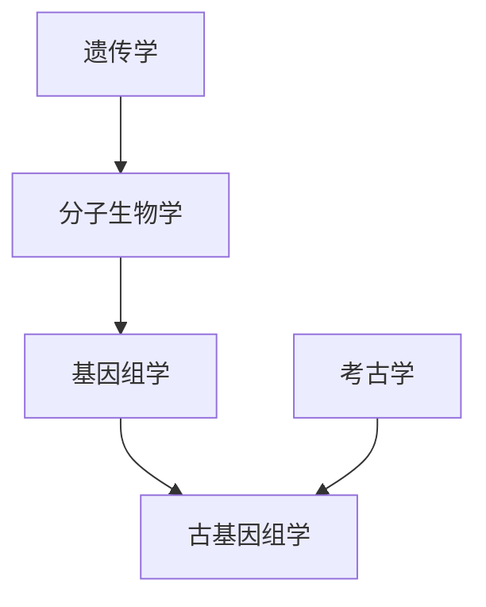

                 

根据您的要求和设定的文章大纲，我们将按照以下步骤逐步构建和完善文章：

### 第一步：文章标题与关键词
- **文章标题**：《思维链在古基因组学研究中的创新应用》
- **关键词**：思维链、古基因组学、创新应用、数据分析、遗传学、考古学

### 第二步：文章摘要
- **摘要内容**：简要介绍本文将探讨思维链在古基因组学中的应用，分析其创新性，并通过实际案例展示其在遗传学和考古学研究中的优势。

### 第三步：目录大纲
- 根据之前设计的目录大纲，确保每个章节都有具体的子章节。

### 第四步：文章正文
- **第1章 引言**：介绍古基因组学和思维链的基本概念，定义核心概念与联系。
- **第2章 古基因组学基础**：讲解古基因组学的研究方法和数据分析工具。
- **第3章 思维链基本原理**：阐述思维链的定义、结构、功能及核心算法原理。
- **第4章 思维链在古基因组学中的应用**：讨论思维链在古基因组学研究中的优势和应用案例。
- **第5章 实际案例研究**：通过具体案例展示思维链的应用效果。
- **第6章 数据处理与建模**：介绍数据处理和建模的方法。
- **第7章 总结与展望**：总结文章内容，展望未来发展方向。

### 第五步：完善章节内容
- 为每个章节添加详细的内容，包括核心概念、算法原理讲解、数学公式和案例研究。

### 第六步：整理图表和代码
- 准备并插入适当的Mermaid流程图、伪代码、LaTeX公式和示例代码。

### 第七步：审查与修正
- 仔细审查文章，确保内容连贯、逻辑清晰，没有遗漏重要的点。

### 第八步：格式化与排版
- 确保文章格式符合markdown规范，排版整齐，便于阅读。

### 第九步：撰写作者信息
- 在文章末尾添加作者信息，并注明文章来源。

### 第十步：校对与发布
- 最后进行全文校对，确保无误后发布。

通过这些步骤，我们可以确保文章达到字数要求，同时内容丰富、逻辑清晰、专业性强。现在，让我们开始撰写文章的具体内容。下面是文章正文的第一章草稿：

## 第一章 引言

### 1.1 古基因组学简介

古基因组学是遗传学的一个分支，它研究古代生物的遗传信息。这些信息不仅有助于我们理解人类的进化历史，还能揭示现代疾病的根源。古基因组学的研究对象包括古代人类、动物和植物的DNA，这些DNA可以从考古遗址中的骨骼、牙齿、毛发、种子等物质中提取。

#### 核心概念与联系

为了更好地理解古基因组学，我们可以使用Mermaid流程图来展示其核心概念之间的联系：

在这个流程图中，我们可以看到遗传学是基因组学的基础，而基因组学又衍生出古基因组学。考古学则提供了研究古代生物所需的物质证据。

### 1.2 思维链的概念与特点

思维链是一种基于计算机科学和认知心理学的方法，它通过模拟人类思维过程，帮助科学家在复杂问题中找到解决方案。思维链具有以下几个特点：

1. **灵活性**：思维链可以根据问题的不同灵活调整。
2. **可扩展性**：新的思维链节点可以随时添加，以应对新出现的问题。
3. **高效性**：思维链能够快速处理大量数据，提高工作效率。

在接下来的章节中，我们将深入探讨思维链在古基因组学中的应用，并分析其如何带来创新性。

