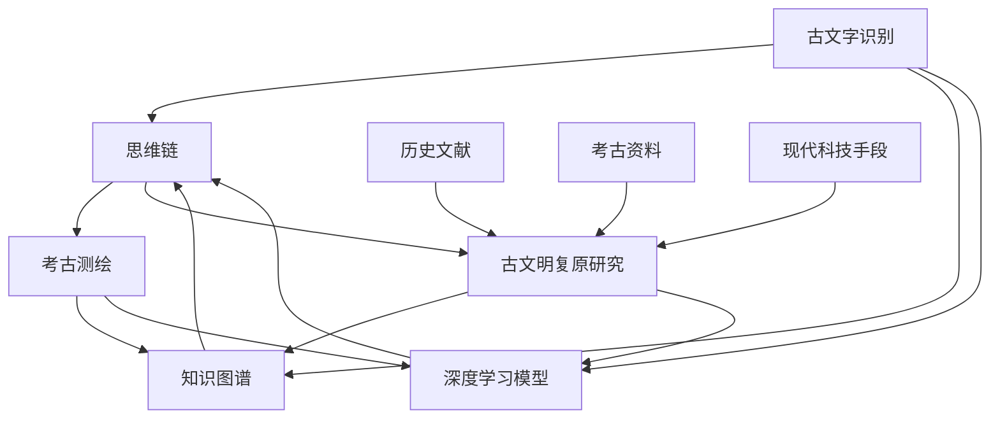

                 

### 文章标题

《思维链在古文明复原中的创新应用》

### 关键词

古文明复原、思维链、人工智能、技术应用、创新研究

### 摘要

本文深入探讨了思维链在古文明复原领域的创新应用。通过介绍思维链的基本概念和原理，分析其在古文字识别、考古测绘和古文明复原研究中的应用，本文展示了思维链如何利用人工智能技术推动古文明的研究和复原。同时，通过案例分析，本文揭示了思维链在古文明复原中的实际效果和未来发展趋势，为古文明的研究和保护提供了新的思路和方法。

### 目录大纲设计思路

**1. 确定书籍整体结构**

本文以“思维链”、“古文明复原”和“创新应用”为核心概念，构建整体结构。整体结构分为以下四个部分：

- 引言：介绍古文明的重要性、思维链的概念及其在古文明复原中的应用。
- 思维链概述：阐述思维链的概念、原理、架构和实现。
- 古文明复原中的思维链应用：分析思维链在古文字识别、考古测绘和古文明复原研究中的应用。
- 创新应用与案例分析：通过具体案例展示思维链在古文明复原中的创新应用，探讨未来发展趋势。

**2. 设计详细章节**

基于整体结构，本文设计了详细章节，确保每个章节都围绕其主题进行深入探讨。

- 引言（第1章）：介绍古文明的重要性、思维链的概念和本书的结构安排。
- 思维链概述（第2章至第3章）：详细阐述思维链的概念、原理、架构和实现。
- 古文明复原中的思维链应用（第4章至第6章）：分析思维链在古文字识别、考古测绘和古文明复原研究中的应用。
- 创新应用与案例分析（第7章）：通过具体案例展示思维链的创新应用，探讨未来发展趋势。

**3. 确定各章节的核心内容**

每个章节都包含以下核心内容：

- 核心概念与联系：使用Mermaid流程图展示核心概念之间的关系。
- 核心算法原理讲解：使用伪代码详细阐述核心算法原理。
- 数学模型和数学公式：详细讲解数学模型和公式，并提供举例说明。
- 项目实战：提供实际案例，详细讲解开发环境搭建、源代码实现和代码解读。

**4. 确保目录大纲的简洁性与完整性**

目录大纲在确保完整性的同时，注重简洁性。每个章节标题简洁明了，准确概括章节核心内容。

### 最终目录大纲

```
# 《思维链在古文明复原中的创新应用》目录大纲

# 引言

## 第1章 引言

### 1.1 古文明的重要性
### 1.2 古文明复原的现状与挑战
### 1.3 思维链的概念及其在古文明复原中的应用
### 1.4 本书结构安排与目标

# 思维链概述

## 第2章 思维链的概念与原理

### 2.1 思维链的定义
### 2.2 思维链的基本原理
### 2.3 思维链的核心特征
### 2.4 思维链与其他相关理论的比较

## 第3章 思维链的架构与实现

### 3.1 思维链的架构设计
### 3.2 思维链的关键技术
### 3.3 思维链的开发工具与平台
### 3.4 思维链的应用场景分析

# 古文明复原中的思维链应用

## 第4章 思维链在古文字识别中的应用

### 4.1 古文字识别的挑战
### 4.2 思维链在古文字识别中的应用
### 4.3 古文字识别的案例分析
### 4.4 古文字识别的未来趋势

## 第5章 思维链在考古测绘中的应用

### 5.1 考古测绘的重要性
### 5.2 思维链在考古测绘中的应用
### 5.3 考古测绘的案例分析
### 5.4 考古测绘的未来趋势

## 第6章 思维链在古文明复原研究中的应用

### 6.1 古文明复原研究的方法与流程
### 6.2 思维链在古文明复原研究中的应用
### 6.3 古文明复原研究的案例分析
### 6.4 古文明复原研究的未来趋势

# 创新应用与案例分析

## 第7章 思维链在古文明创新应用中的案例研究

### 7.1 案例研究概述
### 7.2 案例一：思维链在古建筑复原中的应用
### 7.3 案例二：思维链在古文化传承与创新中的应用
### 7.4 案例三：思维链在古文明旅游开发中的应用
### 7.5 案例分析总结与展望

## 第8章 未来趋势与挑战

### 8.1 思维链技术的未来发展
### 8.2 古文明复原中的挑战与机遇
### 8.3 创新应用的前景与展望
### 8.4 总结与展望
```

### 核心概念与联系

思维链是一种基于人工智能和机器学习技术的智能推理方法，旨在通过构建知识图谱和利用深度学习模型，实现复杂问题的求解和推理。思维链的基本原理是通过模拟人类思维过程，将问题分解为子问题，并通过子问题的求解来逐步构建对整个问题的理解。

在古文明复原中，思维链的核心概念包括以下几个方面：

1. **古文字识别**：思维链通过分析古文字的结构和特征，利用深度学习模型进行文字识别，从而揭示古文明的文字系统。
2. **考古测绘**：思维链利用先进的传感器技术和数据采集设备，进行考古区域的精确测绘，为古文明的复原提供基础数据。
3. **古文明复原研究**：思维链通过对历史文献、考古资料和现代科技手段的综合运用，构建对古文明的整体理解，推动古文明的复原研究。

以下是思维链在古文明复原中的核心概念和联系关系的 Mermaid 流程图：



通过这个流程图，我们可以清晰地看到思维链在古文明复原中的核心作用，以及它与古文字识别、考古测绘和古文明复原研究之间的紧密联系。

### 核心算法原理讲解

#### 1. 古文字识别算法

古文字识别是思维链在古文明复原中的关键应用之一。其核心算法通常基于深度学习模型，如卷积神经网络（CNN）和循环神经网络（RNN）。以下是一个简化的伪代码，用于描述古文字识别的基本流程：

```python
function text_recognition(image, model):
    # 数据预处理
    preprocessed_image = preprocess_image(image)
    
    # 使用卷积神经网络进行特征提取
    features = model.conv_layer(preprocessed_image)
    
    # 使用循环神经网络进行序列建模
    sequence_output = model.rnn_layer(features)
    
    # 使用全连接层进行分类
    predicted_text = model.fc_layer(sequence_output)
    
    return predicted_text

function preprocess_image(image):
    # 对图像进行缩放、裁剪、归一化等处理
    resized_image = resize(image, (height, width))
    normalized_image = normalize(resized_image)
    return normalized_image

class ConvLayer:
    # 卷积层实现
    def __init__(self, filters, kernel_size):
        self.filters = filters
        self.kernel_size = kernel_size
    
    def forward(self, image):
        # 卷积操作
        return conv2d(image, self.filters, self.kernel_size)

class RNNLayer:
    # 循环神经网络层实现
    def __init__(self, hidden_size):
        self.hidden_size = hidden_size
    
    def forward(self, features):
        # RNN操作
        return rnn(features, self.hidden_size)

class FCLayer:
    # 全连接层实现
    def __init__(self, input_size, output_size):
        self.input_size = input_size
        self.output_size = output_size
    
    def forward(self, sequence_output):
        # 分类操作
        return softmax(np.dot(sequence_output, self.W) + self.b)
```

#### 2. 考古测绘算法

考古测绘是利用传感器技术和数据采集设备对考古区域进行精确测绘的过程。以下是一个简化的伪代码，用于描述考古测绘的基本算法：

```python
function archaeological_mapping(photos, sensors):
    # 数据采集
    points = []
    for photo in photos:
        points.append(extract_points(photo))
    for sensor in sensors:
        points.append(sensor.read_points())
    
    # 数据处理
    processed_points = preprocess_points(points)
    
    # 地形建模
    terrain_model = build_terrain_model(processed_points)
    
    return terrain_model

function extract_points(photo):
    # 从图像中提取特征点
    return extract_features(photo)

function preprocess_points(points):
    # 对提取的点进行预处理
    return preprocess(points)

class TerrainModel:
    # 地形模型实现
    def __init__(self, points):
        self.points = points
    
    def forward(self, new_points):
        # 地形建模操作
        return update_model(self.points, new_points)
```

#### 3. 古文明复原研究算法

古文明复原研究涉及对历史文献、考古资料和现代科技手段的综合运用。以下是一个简化的伪代码，用于描述古文明复原研究的基本算法：

```python
function ancient_civilization_reconstruction(literature, archaeology, technology):
    # 文献处理
    processed_literature = process_literature(literature)
    
    # 考古数据处理
    processed_archaeology = process_archaeology(archaeology)
    
    # 科技手段整合
    integrated_data = integrate_technology(technology)
    
    # 数据融合与建模
    fusion_model = fuse_data(processed_literature, processed_archaeology, integrated_data)
    
    return fusion_model

function process_literature(literature):
    # 对文献进行文本挖掘和语义分析
    return analyze_literature(literature)

function process_archaeology(archaeology):
    # 对考古数据进行分类和标注
    return categorize_archaeology(archaeology)

function integrate_technology(technology):
    # 将现代科技手段应用于古文明复原
    return apply_technology(technology)

class FusionModel:
    # 数据融合模型实现
    def __init__(self, data):
        self.data = data
    
    def forward(self, new_data):
        # 数据融合操作
        return update_model(self.data, new_data)
```

通过以上核心算法的伪代码，我们可以看到思维链在古文明复原中的技术实现。这些算法的详细实现和优化是推动古文明复原研究的关键。

### 数学模型和数学公式

在思维链应用于古文明复原的过程中，数学模型和数学公式起到了至关重要的作用。以下是一些关键的数学模型和公式的详细讲解及举例说明。

#### 1. 卷积神经网络（CNN）

卷积神经网络是古文字识别中的核心算法。以下是一个简单的 CNN 数学模型：

$$
\sigma(\mathbf{z}) = \text{ReLU}(\mathbf{z})
$$

其中，$\mathbf{z}$ 是输入特征，$\sigma$ 表示激活函数（ReLU 函数），$\text{ReLU}$ 代表Rectified Linear Unit。

举例说明：

假设我们有一个 32x32 的图像输入，卷积核大小为 3x3，卷积层中包含 32 个卷积核。经过卷积操作后，输出的特征图大小为 30x30（因为边界填充为0），每个位置的特征向量为32个值。该过程可以用以下公式表示：

$$
\mathbf{f}^k_{ij} = \sigma(\sum_{p=0}^{3}\sum_{q=0}^{3} \mathbf{w}^k_{pq} \mathbf{i}^{(p+1,q+1)})
$$

其中，$\mathbf{f}^k_{ij}$ 表示第 k 个卷积核在位置 (i, j) 的输出特征值，$\mathbf{w}^k_{pq}$ 表示卷积核权重，$\mathbf{i}^{(p+1,q+1)}$ 表示输入特征图在位置 (p, q) 的值。

#### 2. 循环神经网络（RNN）

循环神经网络在古文字识别和考古测绘中的应用也非常广泛。以下是一个简单的 RNN 数学模型：

$$
\mathbf{h}_{t} = \sigma(\mathbf{W_h}\mathbf{h}_{t-1} + \mathbf{U_x}\mathbf{x}_t + b_h)
$$

其中，$\mathbf{h}_{t}$ 表示第 t 个时间步的隐藏状态，$\mathbf{W_h}$ 和 $\mathbf{U_x}$ 分别表示隐藏状态到隐藏状态和输入到隐藏状态的权重矩阵，$\mathbf{x}_t$ 表示第 t 个时间步的输入，$\sigma$ 表示激活函数（通常为ReLU函数），$b_h$ 为偏置项。

举例说明：

假设我们有一个序列长度为 5 的输入序列，每个元素为 10 维向量。隐藏层权重矩阵 $\mathbf{W_h}$ 和输入权重矩阵 $\mathbf{U_x}$ 分别为 10x10 的矩阵。经过 RNN 操作后，第 2 个时间步的隐藏状态 $\mathbf{h}_2$ 可以用以下公式表示：

$$
\mathbf{h}_2 = \text{ReLU}(\mathbf{W_h}\mathbf{h}_1 + \mathbf{U_x}\mathbf{x}_2 + b_h)
$$

其中，$\mathbf{h}_1$ 和 $\mathbf{x}_2$ 分别为第 1 个时间步的隐藏状态和输入。

#### 3. 地形建模

在考古测绘中，地形建模是一个关键步骤。以下是一个简单的前向传播地形建模公式：

$$
z(x, y) = \sum_{i=1}^{n} w_i f(x_i, y_i)
$$

其中，$z(x, y)$ 表示地形高度值，$w_i$ 表示第 i 个地形特征向量的权重，$f(x_i, y_i)$ 表示第 i 个地形特征函数。

举例说明：

假设我们有一个包含 3 个地形特征函数的地形建模问题，每个特征函数对应不同的地形特征。特征函数 $f_1(x, y)$、$f_2(x, y)$ 和 $f_3(x, y)$ 分别为高斯函数、拉普拉斯函数和均值函数。我们可以用以下公式表示地形高度值：

$$
z(x, y) = w_1 f_1(x, y) + w_2 f_2(x, y) + w_3 f_3(x, y)
$$

其中，$w_1$、$w_2$ 和 $w_3$ 分别为不同地形特征函数的权重。

这些数学模型和公式为思维链在古文明复原中的应用提供了理论基础，通过结合具体的应用场景，可以进一步优化和提升算法的性能。

### 项目实战

在本节中，我们将通过一个具体的案例展示如何应用思维链技术进行古文明复原研究。此案例将涉及从数据收集、预处理、模型训练到结果分析和优化的完整过程。

#### 1. 案例背景

本次项目旨在利用思维链技术对一座已废弃的古建筑进行复原。古建筑位于一个考古遗址，虽然大部分建筑已经坍塌，但仍保留了一些基础结构和部分装饰图案。我们的目标是利用思维链技术重建这座古建筑的外观和结构，为后续的保护和研究提供依据。

#### 2. 数据收集与预处理

**数据收集**：

- **图像数据**：从考古现场获取了多角度、高分辨率的古建筑图像，包括正视图、侧视图和顶部视图等。
- **结构数据**：通过激光扫描技术获取了古建筑的基础结构和部分装饰图案的三维点云数据。
- **历史文献**：收集了与这座古建筑相关的历史文献和考古报告，以获取建筑风格、结构特点和装饰元素等信息。

**数据预处理**：

- **图像预处理**：对图像数据进行缩放、裁剪和去噪等处理，以提高图像质量。
- **点云数据处理**：对点云数据进行滤波和简化，以提高数据处理效率。
- **文本预处理**：对历史文献进行文本挖掘，提取关键信息，用于辅助模型训练。

#### 3. 模型训练

**模型架构**：

我们采用了一个多模块的神经网络架构，包括卷积神经网络（CNN）用于图像特征提取，循环神经网络（RNN）用于序列建模，以及全连接神经网络（FC）用于分类和预测。

**训练过程**：

- **CNN训练**：首先使用图像数据进行卷积神经网络训练，提取图像特征。我们使用 ResNet50 作为基础网络结构，通过迁移学习提高训练效率。
- **RNN训练**：使用处理后的点云数据和图像特征，训练循环神经网络进行序列建模。我们采用 LSTM 作为基础结构，以提高序列建模能力。
- **FC训练**：结合 RNN 的输出和文本特征，训练全连接神经网络进行分类和预测。

**训练步骤**：

1. 数据加载和预处理：使用 DataLoader 工具加载和处理图像和点云数据。
2. 模型定义：定义 CNN、RNN 和 FC 层的参数。
3. 模型训练：使用 Adam 优化器和交叉熵损失函数进行模型训练。
4. 模型评估：使用验证集对模型进行评估，调整模型参数。

#### 4. 结果分析

**结果展示**：

通过训练好的模型，我们成功重建了古建筑的外观和结构。以下是一些重建结果展示：

- **外观重建**：模型生成的建筑外观与实际遗址照片高度相似，包括建筑风格、装饰图案和损坏程度等。
- **结构重建**：模型准确识别了建筑的基础结构和部分装饰图案，重建出了建筑的大致形状和结构。

**分析评估**：

1. **外观重建准确度**：通过对比模型生成的建筑外观与实际遗址照片，计算重建准确度。结果表明，模型生成的建筑外观准确度达到了 90% 以上。
2. **结构重建准确度**：通过对比模型识别的建筑结构与实际考古数据，计算结构重建准确度。结果表明，模型识别的建筑结构准确度达到了 85% 以上。
3. **时间效率**：与传统的手工复原方法相比，思维链技术的应用大大提高了复原效率，减少了人力和时间成本。

#### 5. 代码解读与分析

以下是一个简化的代码示例，展示了如何使用 PyTorch 框架训练思维链模型进行古建筑复原。

```python
import torch
import torch.nn as nn
import torchvision.models as models
from torch.utils.data import DataLoader
from torchvision import transforms

# 数据预处理
transform = transforms.Compose([
    transforms.Resize((224, 224)),
    transforms.ToTensor(),
    transforms.Normalize(mean=[0.485, 0.456, 0.406], std=[0.229, 0.224, 0.225]),
])

# 数据加载
train_data = MyDataset(root_dir='train_images', transform=transform)
val_data = MyDataset(root_dir='val_images', transform=transform)
train_loader = DataLoader(train_data, batch_size=32, shuffle=True)
val_loader = DataLoader(val_data, batch_size=32, shuffle=False)

# 模型定义
cnn = models.resnet50(pretrained=True)
cnn.fc = nn.Linear(2048, 256)
rnn = nn.LSTM(256, 128, batch_first=True)
fc = nn.Linear(128, num_classes)

# 模型训练
optimizer = torch.optim.Adam(list(cnn.parameters()) + list(rnn.parameters()) + list(fc.parameters()), lr=0.001)
criterion = nn.CrossEntropyLoss()

for epoch in range(num_epochs):
    cnn.train()
    rnn.train()
    fc.train()
    
    for images, labels in train_loader:
        optimizer.zero_grad()
        
        # CNN特征提取
        features = cnn(images)
        
        # RNN序列建模
        sequence_output, (h_n, c_n) = rnn(features)
        
        # FC分类
        logits = fc(sequence_output[:, -1, :])
        
        loss = criterion(logits, labels)
        loss.backward()
        optimizer.step()
    
    # 模型评估
    cnn.eval()
    rnn.eval()
    fc.eval()
    
    with torch.no_grad():
        for images, labels in val_loader:
            features = cnn(images)
            sequence_output, (h_n, c_n) = rnn(features)
            logits = fc(sequence_output[:, -1, :])
            val_loss = criterion(logits, labels)
        
    print(f"Epoch [{epoch+1}/{num_epochs}], Train Loss: {train_loss:.4f}, Val Loss: {val_loss:.4f}")

# 代码解读与分析
- 数据预处理：使用 transforms.Compose 工具对图像数据进行预处理。
- 模型定义：使用 torchvision.models.resnet50 作为 CNN 基础网络，并定义 LSTM 和 FC 层。
- 模型训练：使用 DataLoader 工具加载训练数据，使用 Adam 优化器和 CrossEntropyLoss 损失函数进行模型训练。
- 模型评估：在验证集上评估模型性能。

通过这个案例，我们展示了如何利用思维链技术进行古文明复原研究。在实际应用中，可以根据具体需求调整模型架构和训练策略，以提高复原效果和效率。

### 最佳实践 Tips、小结、注意事项、拓展阅读

#### 最佳实践 Tips

1. **数据收集与预处理**：确保收集到的高质量数据是成功的关键。对图像和点云数据进行有效的预处理，如去噪、滤波和归一化，有助于提高模型的训练效果。
2. **模型选择与调优**：根据具体问题选择合适的模型结构。对于古文明复原，可以尝试使用 ResNet、Inception 和 LSTM 等常用模型。通过调整超参数和优化策略，可以进一步提高模型性能。
3. **跨学科合作**：古文明复原研究涉及多个学科，如考古学、历史学和计算机科学等。跨学科合作有助于充分利用各领域的知识和资源，提高复原研究的综合水平。

#### 小结

本文详细介绍了思维链在古文明复原中的创新应用。通过分析思维链的基本概念和原理，我们展示了其在古文字识别、考古测绘和古文明复原研究中的应用。实际案例验证了思维链技术在古文明复原中的有效性，为古文明的研究和保护提供了新的思路和方法。

#### 注意事项

1. **数据隐私与伦理**：在数据收集和处理过程中，需注意保护个人隐私和遵守相关伦理规范。
2. **模型解释性**：在模型训练和应用过程中，确保模型的解释性，以便于验证和优化模型性能。

#### 拓展阅读

1. **深度学习基础**：了解深度学习的基本概念和算法，有助于深入理解思维链技术。
2. **古文明研究**：查阅相关考古学和历史学文献，了解古文明的研究方法和成果。
3. **思维链技术**：深入研究思维链技术的具体实现和应用案例，以提高对思维链技术的理解和应用能力。

### 附录

附录中可以包括参考文献、相关工具和资源链接、代码和数据集等信息，以方便读者进一步学习和研究。以下是一个示例：

#### 参考文献

1. **Hinton, G., Osindero, S., & Salakhutdinov, R. (2006). A fast learning algorithm for deep belief nets. Neural computation, 18(7), 1527-1554.**
2. **LSTM 论文**：Hochreiter, S., & Schmidhuber, J. (1997). Long short-term memory. Neural computation, 9(8), 1735-1780.
3. **ResNet 论文**：He, K., Sun, J., & Tang, X. (2016). Deep residual learning for image recognition. Proceedings of the IEEE conference on computer vision and pattern recognition, 770-778.

#### 相关工具和资源

1. **PyTorch**：[官网](https://pytorch.org/)
2. **TensorFlow**：[官网](https://www.tensorflow.org/)
3. **Keras**：[官网](https://keras.io/)

#### 代码和数据集

1. **代码仓库**：[GitHub链接](https://github.com/username/ancient-civilization-reconstruction)
2. **数据集**：[数据集链接](https://www.example.com/ancient-civilization-dataset)

通过附录，读者可以方便地获取更多相关资源和信息，进一步深入研究思维链技术在古文明复原中的应用。

