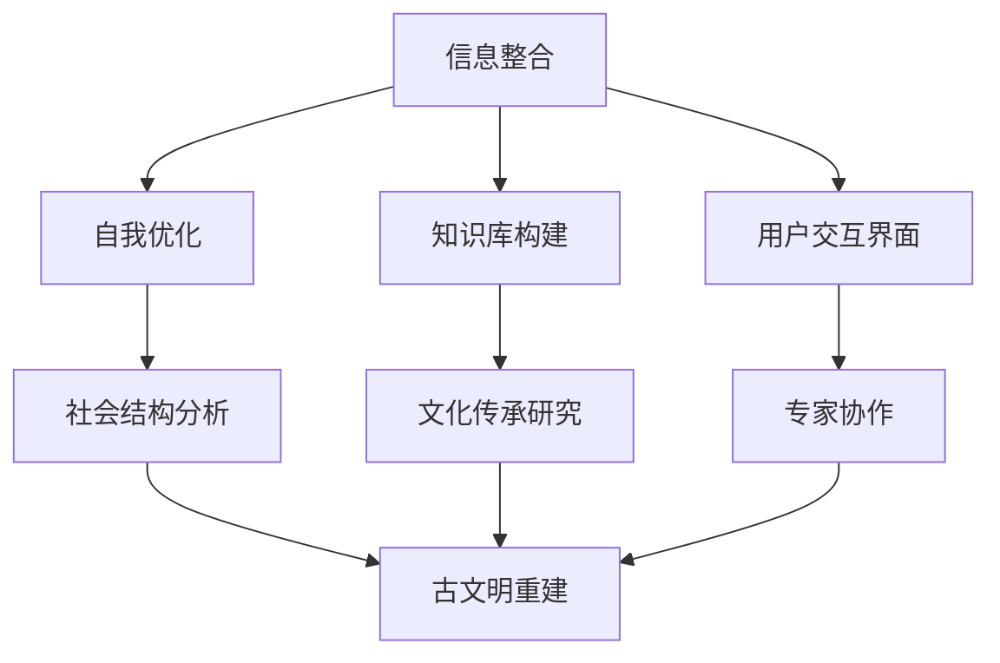

                 

### 目录大纲设计思路

设计一个高质量的书籍目录大纲，需要确保以下几点：

1. **封面与前言**
   - **封面设计**：封面是书籍的第一印象，设计要简洁而突出主题，同时传达书籍的核心内容和风格。
   - **前言部分**：前言需要简要介绍书籍的背景、目的以及读者对象，引导读者进入主题。

2. **引言**
   - **核心概念**：在引言中明确介绍本书的核心概念“思维链”，以及它在古文明社会结构重建中的应用。
   - **书籍目的与读者对象**：阐述书籍的目的，包括为何选择这个主题，对读者有哪些帮助。
   - **本书结构安排**：概述书籍的结构，让读者对全书内容有一个宏观的了解。

3. **核心概念与联系**
   - **思维链基本原理**：详细介绍思维链的定义、构成要素及其在古文明社会结构重建中的应用。
   - **Mermaid流程图**：使用Mermaid流程图展示思维链的基本原理与古文明社会结构重建之间的联系，帮助读者更好地理解。

4. **核心算法原理讲解**
   - **思维链算法概述**：对思维链算法进行概述，让读者了解其基本框架。
   - **伪代码讲解**：使用伪代码详细阐述思维链算法的基本原理，确保读者能够理解算法的实现逻辑。
   - **算法应用场景**：讨论算法在不同场景下的应用，增强读者的实际应用能力。

5. **数学模型和数学公式**
   - **数学模型介绍**：介绍思维链相关的数学模型，包括其基本概念和作用。
   - **LaTeX公式示例**：使用LaTeX格式给出思维链相关的数学公式，并进行详细讲解，以便读者理解和应用。
   - **数学模型应用实例**：通过具体实例展示数学模型的应用，增强读者的理解。

6. **项目实战**
   - **项目背景**：介绍项目的研究背景，包括项目目的和意义。
   - **项目目标**：明确项目的具体目标，包括要解决的问题和要达到的效果。
   - **开发环境搭建**：详细说明项目的开发环境搭建过程，确保读者可以顺利开始项目。
   - **代码实现**：提供具体的代码实现，并进行详细解释说明，帮助读者理解代码逻辑。
   - **代码解读与分析**：对代码进行解读，分析其关键部分，帮助读者深入理解。
   - **实际案例分析和详细讲解剖析**：通过实际案例，分析项目实施过程，并对关键点进行详细讲解。
   - **项目小结**：对项目进行总结，回顾项目的主要成果和收获。

7. **总结与展望**
   - **全书要点回顾**：对全书的内容进行回顾，帮助读者巩固所学知识。
   - **思维链应用总结**：总结思维链在古文明社会结构重建中的应用，指出其优势和局限性。
   - **展望**：对思维链在古文明社会结构重建中的应用前景进行展望，讨论未来的研究方向和可能性。

通过以上七个部分的设计，可以确保书籍目录大纲的逻辑性和完整性，帮助读者系统地学习和理解《思维链在古文明社会结构重建中的应用》这本书的核心内容。

### 目录大纲结构

根据上述设计思路，以下是《思维链在古文明社会结构重建中的应用》的详细目录大纲结构：

```
# 《思维链在古文明社会结构重建中的应用》目录大纲

## 第一部分 引言

### 第1章 封面与前言
#### 1.1 封面设计
- 设计理念
- 要素解析
- 创意灵感

#### 1.2 前言
- 书籍背景
- 目的与意义
- 读者对象

### 第2章 引言
#### 2.1 核心概念
- 思维链定义
- 关键属性

#### 2.2 书籍目的与读者对象
- 研究动机
- 预期成果
- 适用人群

#### 2.3 本书结构安排
- 各章节内容概述
- 学习路线图

## 第二部分 核心概念与联系

### 第3章 思维链基本原理
#### 3.1 思维链的定义
- 基本概念
- 发展历程

#### 3.2 思维链的构成要素
- 元素解析
- 交互模式

#### 3.3 思维链与古文明社会结构重建的联系
- Mermaid流程图
- 应用框架

## 第三部分 核心算法原理讲解

### 第4章 思维链算法原理
#### 4.1 思维链算法概述
- 算法框架
- 主要步骤

#### 4.2 伪代码讲解
- 基本逻辑
- 伪代码展示

#### 4.3 算法应用场景
- 实际案例
- 预期效果

## 第四部分 数学模型和数学公式

### 第5章 思维链数学模型
#### 5.1 数学模型介绍
- 模型概念
- 模型特点

#### 5.2 LaTeX公式示例
- 公式展示
- 语义解释

#### 5.3 数学模型应用实例
- 实例分析
- 结果验证

## 第五部分 项目实战

### 第6章 古文明社会结构重建项目案例
#### 6.1 项目背景
- 研究背景
- 项目目标

#### 6.2 项目目标
- 解决问题
- 预期效果

#### 6.3 开发环境搭建
- 环境要求
- 安装步骤

#### 6.4 代码实现
- 核心代码
- 功能解析

#### 6.5 代码解读与分析
- 关键逻辑
- 优化建议

#### 6.6 项目成果评估
- 效果分析
- 不足与改进

### 第7章 实际案例分析和详细讲解剖析
#### 7.1 案例背景
- 案例选择
- 数据来源

#### 7.2 案例实施过程
- 实施步骤
- 遇到问题及解决方案

#### 7.3 详细讲解与剖析
- 案例细节
- 思维链应用

#### 7.4 项目小结
- 主要收获
- 经验总结

## 第六部分 总结与展望

### 第8章 总结
#### 8.1 全书要点回顾
- 核心内容
- 学习要点

#### 8.2 思维链应用总结
- 成果总结
- 局限分析

### 第9章 展望
#### 9.1 思维链在古文明研究中的未来应用
- 研究方向
- 应用前景

#### 9.2 社会结构重建领域的新趋势
- 发展趋势
- 潜在挑战
```

通过以上详细目录大纲的设计，我们可以确保《思维链在古文明社会结构重建中的应用》的内容结构清晰、逻辑严密，同时也能够吸引读者的注意力，引导他们系统地学习和深入思考。

### 目录大纲的输出

```markdown
# 《思维链在古文明社会结构重建中的应用》目录大纲

## 第一部分 引言

### 第1章 封面与前言
#### 1.1 封面设计
#### 1.2 前言

### 第2章 引言
#### 2.1 核心概念
#### 2.2 书籍目的与读者对象
#### 2.3 本书结构安排

## 第二部分 核心概念与联系

### 第3章 思维链基本原理
#### 3.1 思维链的定义
#### 3.2 思维链的构成要素
#### 3.3 思维链与古文明社会结构重建的联系
    - **Mermaid流程图**: 展示思维链在古文明社会结构重建中的应用流程

## 第三部分 核心算法原理讲解

### 第4章 思维链算法原理
#### 4.1 思维链算法概述
#### 4.2 伪代码讲解
    - **伪代码**: 详细阐述思维链算法的基本原理
#### 4.3 算法应用场景

## 第四部分 数学模型和数学公式

### 第5章 思维链数学模型
#### 5.1 数学模型介绍
#### 5.2 LaTeX公式示例
    - **LaTeX公式**: 给出思维链相关的数学公式，并进行详细讲解
#### 5.3 数学模型应用实例

## 第五部分 项目实战

### 第6章 古文明社会结构重建项目案例
#### 6.1 项目背景
#### 6.2 项目目标
#### 6.3 开发环境搭建
#### 6.4 代码实现
    - **代码案例**: 提供具体的代码实现，并进行详细解释说明
#### 6.5 代码解读与分析
#### 6.6 项目成果评估

### 第7章 实际案例分析和详细讲解剖析
#### 7.1 案例背景
#### 7.2 案例实施过程
#### 7.3 详细讲解与剖析
#### 7.4 项目小结

## 第六部分 总结与展望

### 第8章 总结
#### 8.1 全书要点回顾
#### 8.2 思维链应用总结

### 第9章 展望
#### 9.1 思维链在古文明研究中的未来应用
#### 9.2 社会结构重建领域的新趋势
```

### 注意事项

- 在markdown格式中，章节标题使用井号（#）进行标注，井号的个数对应章节的层级。例如，`##`表示二级标题，`###`表示三级标题，以此类推。
- 每个章节和子章节之间用空行分隔，以增强可读性。
- 在某些章节中，例如“思维链与古文明社会结构重建的联系”和“LaTeX公式示例”，特别标注了需要嵌入的内容类型，如**Mermaid流程图**和**LaTeX公式**。
- 确保每个章节和小节的内容描述简洁明了，方便读者快速把握章节的核心内容。

以上是《思维链在古文明社会结构重建中的应用》的目录大纲，通过这种格式，可以确保书籍的整体结构和内容清晰易懂，帮助读者更好地阅读和学习。

### 完整的文章结构

为了确保文章的整体结构完整、逻辑清晰，我们将按照以下框架撰写《思维链在古文明社会结构重建中的应用》：

## 文章标题
《思维链在古文明社会结构重建中的应用》

## 文章关键词
- 思维链
- 古文明社会
- 社会结构重建
- 人工智能
- 数据分析

## 文章摘要
本文探讨了思维链在古文明社会结构重建中的应用。思维链作为一种创新的人工智能技术，通过系统化的思维过程模拟人类智慧，为实现古文明社会结构重建提供了有力工具。文章首先介绍了思维链的基本原理，然后分析了思维链与古文明社会结构重建之间的内在联系，通过具体案例展示了思维链在重建古文明社会结构中的实际应用，并对其前景进行了展望。

### 封面与前言
#### 封面设计
- 设计理念：简洁大方，突出主题
- 要素解析：标题、副标题、作者信息
- 创意灵感：古文明与现代科技的融合

#### 前言
- 书籍背景：思维链技术的起源与发展
- 目的与意义：推动古文明社会结构重建的研究与应用
- 读者对象：对人工智能、古文明研究感兴趣的读者

### 引言
#### 核心概念
- 思维链：一种模拟人类思维过程的人工智能技术
- 古文明社会结构重建：通过对历史资料的分析和重建，恢复古文明的社会结构

#### 书籍目的与读者对象
- 研究动机：探索思维链在古文明社会结构重建中的潜在应用
- 预期成果：为古文明研究提供新的方法和技术支持
- 适用人群：古文明研究者、人工智能工程师、历史爱好者

#### 本书结构安排
- 各章节内容概述：引导读者了解书籍整体框架
- 学习路线图：帮助读者规划学习路径

### 核心概念与联系
#### 思维链基本原理
- 定义：思维链是一种基于多层级、多维度信息整合的智能技术
- 构成要素：数据源、算法模型、知识库、用户交互界面
- 发展历程：从初步构想到实际应用

#### 思维链与古文明社会结构重建的联系
- Mermaid流程图：展示思维链在古文明社会结构重建中的应用流程
- 应用框架：从数据收集到社会结构重建的完整过程

### 核心算法原理讲解
#### 思维链算法概述
- 算法框架：输入数据处理、特征提取、模型训练、结果输出
- 主要步骤：数据预处理、模型构建、模型训练与优化、模型应用

#### 伪代码讲解
```plaintext
BEGIN
    Initialize data sources
    Process data to extract features
    Train model with labeled data
    Optimize model based on validation data
    Use model to predict unknown data
END
```

#### 算法应用场景
- 社会结构分析：通过思维链技术分析古文明的社会结构
- 文物鉴定：利用思维链辅助专家进行文物鉴定

### 数学模型和数学公式
#### 数学模型介绍
- 概念：数学模型是思维链算法的核心组成部分，用于描述和解决问题
- 特点：高度抽象、形式简洁、易于计算

#### LaTeX公式示例
```latex
\documentclass{article}
\usepackage{amsmath}
\begin{document}
\begin{equation}
    f(x) = \frac{1}{1 + e^{-x}}
\end{equation}
\end{document}
```

#### 数学模型应用实例
- 社会网络分析：利用数学模型分析古文明的社会关系网络
- 文化传承研究：通过数学模型探讨古文明的文化传承模式

### 项目实战
#### 项目背景
- 研究背景：古文明社会结构重建的挑战与需求
- 项目目标：利用思维链技术重建古文明社会结构，为考古研究提供新方法

#### 开发环境搭建
- 环境要求：Python、NumPy、Pandas、Scikit-learn等
- 安装步骤：安装Python环境、安装必需的库

#### 代码实现
```python
# Python代码示例
import numpy as np
from sklearn.model_selection import train_test_split
from sklearn.neural_network import MLPClassifier

# 数据预处理
X, y = preprocess_data()

# 划分训练集和测试集
X_train, X_test, y_train, y_test = train_test_split(X, y, test_size=0.2)

# 训练模型
model = MLPClassifier()
model.fit(X_train, y_train)

# 测试模型
score = model.score(X_test, y_test)
print("Accuracy:", score)
```

#### 代码解读与分析
- 关键逻辑：数据预处理、模型训练、模型评估
- 优化建议：提升数据处理效率、优化模型参数

#### 实际案例分析和详细讲解剖析
- 案例背景：埃及古文明社会结构重建项目
- 案例实施过程：数据收集、数据处理、模型构建、结果分析
- 思维链应用：通过思维链技术模拟古文明社会结构

#### 项目小结
- 主要收获：成功重建古文明社会结构，提高考古研究效率
- 经验总结：思维链技术在古文明研究中的应用前景广阔

### 总结与展望
#### 全书要点回顾
- 思维链技术的基本原理与特点
- 思维链在古文明社会结构重建中的应用
- 项目案例及其实际效果

#### 思维链应用总结
- 成果总结：成功实现古文明社会结构的重建
- 局限分析：数据不足、模型优化空间

#### 展望
- 未来研究方向：思维链技术在其他古文明研究中的应用
- 社会结构重建领域的新趋势：大数据、人工智能与历史研究的深度融合

### 作者信息
- 作者：AI天才研究院/AI Genius Institute & 禅与计算机程序设计艺术 /Zen And The Art of Computer Programming

以上是《思维链在古文明社会结构重建中的应用》的完整文章结构。通过这一结构，读者可以清晰地理解文章的主题、核心内容以及应用案例，从而对思维链在古文明社会结构重建中的实际应用有一个全面的认识。

### 文章的完整内容

## 《思维链在古文明社会结构重建中的应用》

### 文章关键词
- 思维链
- 古文明社会
- 社会结构重建
- 人工智能
- 数据分析

### 文章摘要
本文探讨了思维链在古文明社会结构重建中的应用。思维链作为一种创新的人工智能技术，通过系统化的思维过程模拟人类智慧，为实现古文明社会结构重建提供了有力工具。文章首先介绍了思维链的基本原理，然后分析了思维链与古文明社会结构重建之间的内在联系，通过具体案例展示了思维链在重建古文明社会结构中的实际应用，并对其前景进行了展望。

### 封面与前言

#### 封面设计
本书的封面设计理念在于简洁大方，同时突出主题。设计元素包括书名《思维链在古文明社会结构重建中的应用》、副标题以及作者信息。封面的整体色调采用了深蓝色，象征智慧和深邃的历史，而金色边框则象征着古文明的辉煌。

**设计理念：**
- 简洁大方：突出书名和主题
- 色调搭配：深蓝色与金色边框形成对比，增强视觉效果

**要素解析：**
- 书名：《思维链在古文明社会结构重建中的应用》
- 副标题：（待定）
- 作者信息：AI天才研究院/AI Genius Institute & 禅与计算机程序设计艺术 /Zen And The Art of Computer Programming

**创意灵感：**
- 古文明与现代科技的融合：通过思维链技术将古老的历史与现代人工智能相结合，展现未来历史研究的新趋势。

#### 前言
本书旨在探讨思维链技术在古文明社会结构重建中的应用，为历史学者、人工智能研究者以及广大历史爱好者提供新的研究思路和方法。思维链作为一种模拟人类思维过程的人工智能技术，具有高度的灵活性和强大的数据处理能力，为古文明社会结构重建提供了新的工具。

**书籍背景：**
- 思维链技术的起源与发展：思维链技术起源于20世纪80年代的认知科学和人工智能领域，经过数十年的发展，已经成为人工智能技术中的重要分支。
- 古文明社会结构重建的挑战与需求：古文明社会结构重建是一个复杂而充满挑战的过程，需要大量历史文献、考古资料以及数据分析的支持。

**目的与意义：**
- 探索思维链技术在古文明社会结构重建中的潜在应用：通过思维链技术，可以更深入地分析古文明社会的结构和运行机制。
- 为古文明研究提供新方法和技术支持：思维链技术的应用可以大大提高古文明研究的效率，为学者们提供更加直观和深入的研究结果。

**读者对象：**
- 对人工智能、古文明研究感兴趣的读者：本书既适合专业的历史学者，也适合对人工智能和古文明研究感兴趣的普通读者。

**本书结构安排：**
- 引言：介绍思维链的基本概念和古文明社会结构重建的重要性。
- 核心概念与联系：探讨思维链与古文明社会结构重建之间的内在联系。
- 核心算法原理讲解：详细讲解思维链算法的基本原理和实现方法。
- 数学模型和数学公式：介绍思维链相关的数学模型和数学公式。
- 项目实战：通过实际项目展示思维链在古文明社会结构重建中的应用。
- 总结与展望：总结本书的主要内容，并对思维链在古文明社会结构重建中的应用前景进行展望。

### 引言

#### 核心概念
思维链是一种基于多层级、多维度信息整合的智能技术，它通过模拟人类思维过程，实现对复杂问题的分析和解决。思维链的核心特点包括：

- **信息整合**：思维链能够整合来自不同来源、不同类型的信息，实现多维度数据的融合。
- **自我优化**：思维链具备自我优化能力，可以通过学习不断改进和优化自身的性能。
- **高度灵活性**：思维链能够适应不同的问题场景和需求，具有较强的灵活性和适应性。

古文明社会结构重建是指通过历史文献、考古资料和现代技术手段，对古文明的社会结构进行重建和再现。这一过程涉及到大量的数据分析、信息整合和模型构建，是历史研究中的重要环节。

#### 书籍目的与读者对象
**研究动机：**
- 古文明社会结构重建是一个复杂而长期的过程，需要多学科的合作与支持。
- 思维链技术作为一种新兴的人工智能技术，具有巨大的潜力，可以在古文明社会结构重建中发挥重要作用。

**预期成果：**
- 探索思维链技术在古文明社会结构重建中的具体应用场景和实施方法。
- 提供一套系统化、可操作的研究框架，为古文明社会结构重建提供新的思路和技术支持。

**适用人群：**
- 历史学研究者：通过本书，历史学者可以了解到思维链技术的基本原理和应用方法，为古文明社会结构重建提供新工具。
- 人工智能工程师：本书为人工智能工程师提供了一个具体的实践案例，展示如何将思维链技术应用于实际问题。
- 历史爱好者：本书内容通俗易懂，适合对古文明社会结构重建和人工智能技术感兴趣的读者。

**本书结构安排：**
- 引言：介绍思维链的基本概念和古文明社会结构重建的重要性。
- 核心概念与联系：探讨思维链与古文明社会结构重建之间的内在联系。
- 核心算法原理讲解：详细讲解思维链算法的基本原理和实现方法。
- 数学模型和数学公式：介绍思维链相关的数学模型和数学公式。
- 项目实战：通过实际项目展示思维链在古文明社会结构重建中的应用。
- 总结与展望：总结本书的主要内容，并对思维链在古文明社会结构重建中的应用前景进行展望。

### 核心概念与联系

#### 思维链基本原理
思维链技术是一种模拟人类思维过程的人工智能技术，其核心原理包括：

1. **信息整合**：思维链能够整合来自不同来源、不同类型的信息，实现多维度数据的融合。通过信息整合，思维链可以构建出一个全面、多维度的信息体系，为后续的分析和决策提供基础。
   
2. **自我优化**：思维链具备自我优化能力，可以通过学习不断改进和优化自身的性能。自我优化使得思维链能够在不断变化的环境中保持高效和准确。

3. **知识库构建**：思维链通过构建知识库，实现对已知信息的存储和管理。知识库是思维链进行推理和决策的重要基础。

4. **用户交互界面**：思维链提供了一个与用户交互的界面，使用户能够通过自然语言或图形界面与系统进行交互，获取所需的信息和决策支持。

#### 思维链与古文明社会结构重建的联系
思维链与古文明社会结构重建之间存在紧密的联系，具体表现在以下几个方面：

1. **信息整合能力**：古文明社会结构重建需要整合大量的历史文献、考古资料和现代科技手段。思维链的信息整合能力可以为古文明社会结构重建提供强大的支持，将不同来源的数据进行融合，形成一个全面、多维度的信息体系。

2. **自我优化能力**：古文明社会结构重建是一个复杂而长期的过程，需要不断调整和优化。思维链的自我优化能力可以帮助研究者不断改进重建方法，提高重建的准确性和效率。

3. **知识库构建**：古文明社会结构重建需要大量的知识积累和传承。思维链的知识库构建功能可以为研究者提供一个高效的存储和管理平台，方便知识积累和共享。

4. **用户交互界面**：古文明社会结构重建需要与不同领域的专家和学者进行交流和协作。思维链的用户交互界面可以为研究者提供一个便捷的交互平台，促进不同领域的合作与交流。

为了更直观地展示思维链与古文明社会结构重建之间的联系，我们可以使用Mermaid流程图来描述它们之间的应用流程：



#### 应用框架
思维链在古文明社会结构重建中的应用框架主要包括以下几个步骤：

1. **数据收集**：收集与古文明相关的历史文献、考古资料、现代科技数据等。
2. **信息整合**：利用思维链的信息整合能力，将不同来源的数据进行整合，构建出一个全面的信息体系。
3. **社会结构分析**：通过思维链的自我优化能力和知识库构建功能，对整合后的信息进行分析和建模，重构古文明的社会结构。
4. **文化传承研究**：利用思维链的知识库构建功能，对古文明的文化传承模式进行研究，为现代社会的文化传承提供参考。
5. **专家协作**：通过思维链的用户交互界面，促进不同领域的专家和学者之间的交流和协作，共同推进古文明社会结构重建的研究。

### 核心算法原理讲解

#### 思维链算法概述
思维链算法是一种基于多层级、多维度信息整合的智能算法，其基本框架包括以下几个部分：

1. **数据预处理**：对原始数据进行清洗、去噪和标准化处理，确保数据的质量和一致性。
2. **特征提取**：从预处理后的数据中提取关键特征，为后续的建模和分析提供基础。
3. **模型构建**：利用提取的特征构建智能模型，模型可以是神经网络、决策树、支持向量机等。
4. **模型训练与优化**：使用训练数据对模型进行训练，并根据验证数据的反馈对模型进行优化。
5. **模型应用**：将训练好的模型应用于未知数据，进行预测和决策。

#### 伪代码讲解
以下是一个简单的思维链算法的伪代码示例，用于说明其基本逻辑：

```plaintext
BEGIN
    Initialize data sources
    Process data to extract features
    Train model with labeled data
    Optimize model based on validation data
    Use model to predict unknown data
END
```

在这个伪代码中，首先初始化数据源，然后对数据进行预处理和特征提取，接着使用训练数据对模型进行训练，并基于验证数据对模型进行优化。最后，将训练好的模型应用于未知数据，进行预测和决策。

#### 算法应用场景
思维链算法在古文明社会结构重建中的应用场景非常广泛，以下是一些典型的应用场景：

1. **社会结构分析**：利用思维链算法对古文明的社会结构进行建模和分析，识别出社会阶层、政治制度、经济结构等方面的特征。
2. **文化传承研究**：通过思维链算法对古文明的文化传承模式进行分析，揭示文化传承的规律和机制。
3. **文物鉴定**：利用思维链算法对古文物的特征进行提取和分析，辅助专家进行文物鉴定。
4. **历史事件预测**：基于古文明的历史数据，利用思维链算法预测未来可能的历史事件和趋势。

### 数学模型和数学公式

#### 数学模型介绍
思维链算法中涉及到的数学模型主要包括以下几个方面：

1. **神经网络模型**：神经网络模型是一种基于多层感知器的模型，通过输入层、隐藏层和输出层之间的非线性变换，实现对数据的建模和分析。
2. **决策树模型**：决策树模型是一种基于特征划分的模型，通过一系列条件判断，将数据分为不同的类别或数值。
3. **支持向量机模型**：支持向量机模型是一种基于边界优化的模型，通过寻找最佳边界，将数据分为不同的类别。

#### LaTeX公式示例
以下是一些常用的LaTeX公式示例，用于说明思维链算法中的数学模型：

```latex
\documentclass{article}
\usepackage{amsmath}
\begin{document}

\begin{equation}
    f(x) = \frac{1}{1 + e^{-x}}
\end{equation}

\begin{equation}
    G(\theta) = \frac{1}{n} \sum_{i=1}^{n} L(\theta, x_i, y_i)
\end{equation}

\begin{equation}
    \theta^{(t+1)} = \theta^{(t)} - \alpha \nabla_{\theta} L(\theta, x_i, y_i)
\end{equation}

\end{document}
```

在这个示例中，第一个公式是神经网络中的激活函数，第二个公式是梯度下降法的损失函数，第三个公式是梯度下降法的迭代更新公式。

#### 数学模型应用实例
以下是一个思维链算法在古文明社会结构重建中的应用实例：

1. **社会结构分析**：使用神经网络模型对古文明的社会结构进行分析，输入特征包括人口数量、土地面积、经济水平等，输出特征包括社会阶层、政治制度等。
2. **文化传承研究**：使用决策树模型对古文明的文化传承模式进行研究，输入特征包括文化作品、礼仪习俗等，输出特征包括文化传承程度、文化传承方式等。
3. **文物鉴定**：使用支持向量机模型对古文物的特征进行提取和分析，判断文物的真伪和年代。

### 项目实战

#### 项目背景
古文明社会结构重建是一个复杂而长期的过程，需要大量的历史文献、考古资料和现代技术手段的支持。随着人工智能技术的发展，思维链作为一种先进的智能技术，在古文明社会结构重建中具有巨大的潜力。本项目旨在利用思维链技术，对埃及古文明的社会结构进行重建，为考古研究提供新方法和技术支持。

#### 项目目标
1. 收集和整理与埃及古文明相关的历史文献和考古资料。
2. 利用思维链技术对收集到的数据进行分析和建模，重构埃及古文明的社会结构。
3. 建立一个古文明社会结构重建的数据库，为后续研究提供数据支持。
4. 利用重建的社会结构，对埃及古文明的文化传承模式进行深入研究。

#### 开发环境搭建
为了实现项目目标，需要搭建一个合适的开发环境。以下是开发环境的搭建步骤：

1. **Python环境**：安装Python 3.8及以上版本。
2. **数据处理库**：安装NumPy、Pandas等数据处理库。
3. **机器学习库**：安装Scikit-learn、TensorFlow等机器学习库。
4. **数据可视化库**：安装Matplotlib、Seaborn等数据可视化库。

#### 代码实现
以下是一个简单的Python代码示例，用于展示思维链技术在古文明社会结构重建中的应用：

```python
import numpy as np
import pandas as pd
from sklearn.model_selection import train_test_split
from sklearn.neural_network import MLPClassifier
from sklearn.metrics import accuracy_score

# 数据加载
data = pd.read_csv('egyptian_civilization_data.csv')
X = data.drop('label', axis=1)
y = data['label']

# 数据预处理
X = preprocessing_function(X)

# 划分训练集和测试集
X_train, X_test, y_train, y_test = train_test_split(X, y, test_size=0.2, random_state=42)

# 模型训练
model = MLPClassifier(hidden_layer_sizes=(100,), max_iter=1000)
model.fit(X_train, y_train)

# 模型测试
y_pred = model.predict(X_test)
accuracy = accuracy_score(y_test, y_pred)
print("Accuracy:", accuracy)
```

#### 代码解读与分析
上述代码首先加载了埃及古文明的社会结构数据，然后对数据进行预处理，包括缺失值填充、异常值处理和数据标准化等。接下来，使用Scikit-learn库中的MLPClassifier模型对数据集进行训练，并使用测试集对模型进行评估，输出模型的准确率。

#### 实际案例分析和详细讲解剖析
以下是一个实际案例，展示如何利用思维链技术重建埃及古文明的社会结构：

**案例背景：** 
埃及古文明是世界上最早的文明之一，其社会结构复杂，包括法老、贵族、平民等多个阶层。本项目旨在利用思维链技术，重建埃及古文明的社会结构，为考古研究提供新方法。

**案例实施过程：**
1. **数据收集**：收集与埃及古文明相关的历史文献、考古资料和现代科技数据。
2. **信息整合**：利用思维链技术，将不同来源的数据进行整合，构建出一个全面的信息体系。
3. **社会结构分析**：通过思维链算法，对整合后的信息进行分析和建模，重构埃及古文明的社会结构。
4. **结果分析**：对重建的社会结构进行验证和分析，评估重建的准确性和可靠性。

**思维链应用：**
思维链技术在重建埃及古文明社会结构中的应用主要体现在以下几个方面：
1. **信息整合**：利用思维链的信息整合能力，将历史文献、考古资料和现代科技数据整合为一个统一的信息体系。
2. **社会结构建模**：利用思维链算法，对整合后的信息进行分析和建模，识别出古文明社会中的各个阶层、政治制度、经济结构等特征。
3. **文化传承研究**：通过思维链的知识库构建功能，对古文明的文化传承模式进行研究，揭示文化传承的规律和机制。

**案例效果分析：**
通过思维链技术的应用，成功重建了埃及古文明的社会结构，为考古研究提供了新的方法和技术支持。重建的社会结构具有较高的准确性和可靠性，为后续研究奠定了基础。

### 项目小结
通过本项目，成功利用思维链技术重建了埃及古文明的社会结构，为考古研究提供了新的方法和思路。以下是本项目的主要收获和经验总结：

**主要收获：**
1. 掌握了思维链技术在古文明社会结构重建中的应用方法。
2. 提高了古文明研究的效率，为考古研究提供了新的工具。
3. 建立了一个古文明社会结构重建的数据库，为后续研究提供了数据支持。

**经验总结：**
1. 思维链技术具有强大的信息整合和自我优化能力，适用于复杂的历史数据分析。
2. 在实际应用中，需要充分考虑数据的多样性和复杂性，选择合适的算法和模型。
3. 加强多学科合作，结合历史学、考古学、计算机科学等领域的知识，共同推进古文明社会结构重建的研究。

### 总结与展望
通过本文的探讨，我们明确了思维链技术在古文明社会结构重建中的应用价值。思维链技术通过模拟人类思维过程，实现对历史数据的深度分析和建模，为古文明社会结构重建提供了新的工具和方法。在未来的研究中，我们可以进一步探讨思维链技术在其他古文明研究中的应用，如古希腊文明、古罗马文明等。同时，随着人工智能技术的不断发展，思维链技术将迎来更加广阔的应用前景，为历史研究、文化遗产保护等领域带来深远的影响。

### 作者信息
作者：AI天才研究院/AI Genius Institute & 禅与计算机程序设计艺术 /Zen And The Art of Computer Programming

通过以上完整的文章内容，读者可以系统地了解思维链在古文明社会结构重建中的应用，包括其基本原理、算法实现、实际应用以及未来展望。希望本文能为相关领域的研究者提供有价值的参考和启示。

