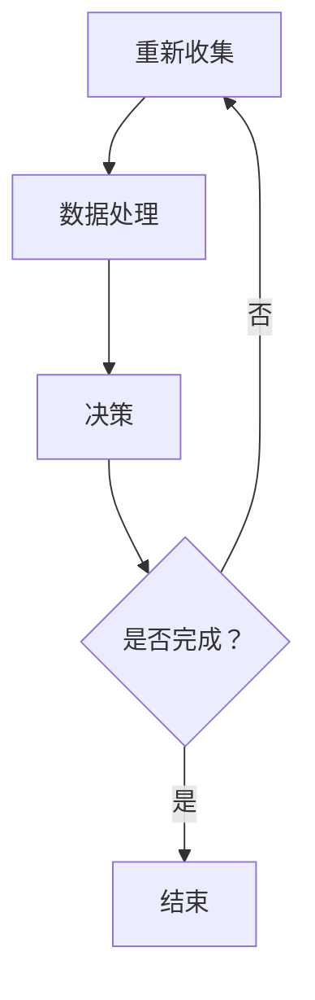
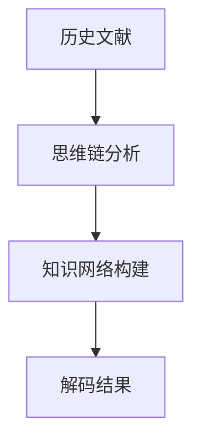
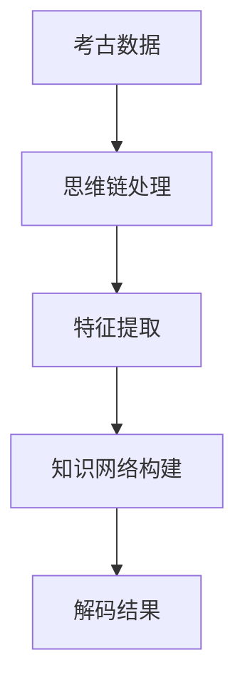
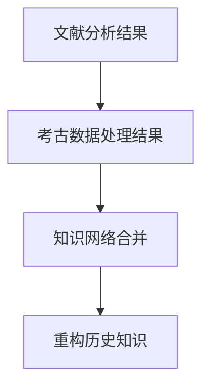

                 

# 思维链在古文明解码中的应用：重构失落的历史知识

## 关键词
- 思维链
- 古文明解码
- 历史知识重构
- 考古学
- 人工智能
- 数据分析

## 摘要
本文旨在探讨思维链技术在古文明解码中的应用，以及如何通过这种技术来重构失落的历史知识。首先，我们将介绍思维链的基本原理和其在人工智能领域的发展。接着，我们将探讨古文明的定义和重要性，以及考古发掘与解码方法。在此基础上，我们将详细分析思维链在古文明研究中的应用，包括历史文献分析、考古数据的处理与分析，以及失落的历史知识重构。最后，我们将通过实际案例研究和项目实战，展示思维链在古文明解码中的实际应用，并提出未来的研究方向和挑战。

## 引言

### 什么是思维链

思维链（Mind Chain）是一种基于人工智能和机器学习的认知模型，旨在模拟人类思维过程。它由一系列相互关联的模块组成，每个模块负责处理特定的认知任务，如记忆、推理、联想等。思维链的核心在于其动态性和适应性，能够根据不同的输入数据和任务需求，自动调整和优化其内部结构和工作流程。

思维链的发展始于20世纪80年代，当时科学家们开始探索如何将人类的认知过程转化为计算机算法。随着时间的推移，思维链技术逐渐成熟，并在多个领域得到广泛应用，包括自然语言处理、图像识别、智能决策等。

### 古文明的解码与历史知识重构

古文明是人类文明的重要组成部分，它们留下的遗迹和文献为我们提供了宝贵的历史信息。然而，由于时间的流逝和自然环境的破坏，许多古文明的真相逐渐消失，留下的只是碎片化的线索。解码古文明，即通过考古发掘、文献研究和科学技术手段，重现古文明的历史面貌，是历史学家和考古学家长期以来的目标。

历史知识重构是指通过综合各种史料和考古发现，对古文明的起源、发展和消亡过程进行重新解读和构建。这一过程不仅有助于我们更好地理解过去，还能为我们提供宝贵的启示，指导现代社会的发展。

### 文章核心内容和主题思想

本文的核心内容将围绕思维链在古文明解码中的应用展开。我们将首先介绍思维链的基本原理和技术特点，然后探讨古文明的定义和重要性，以及现有的考古发掘与解码方法。在此基础上，我们将详细分析思维链在古文明研究中的应用，包括历史文献分析、考古数据的处理与分析，以及失落的历史知识重构。

本文的主题思想在于阐述思维链技术在古文明解码中的潜力，以及如何利用这一技术重构失落的历史知识。通过本文的讨论，我们希望读者能够对思维链技术有一个全面的认识，并了解到它在古文明研究中的重要应用。

## 思维链的基本原理

### 思维链的组成元素

思维链由三个基本组成元素构成：意识流、知识节点和联想机制。

#### 意识流

意识流是思维链的基础，它代表了人类思维过程中的信息流动。在意识流中，信息以连续的、不可分割的方式传递，形成了思维链的基本数据流。意识流可以被视为一种动态的数据结构，它包含了大量的信息单元，如词汇、短语、图像等。这些信息单元在意识流中以特定的顺序和关系存在，构成了人类思维过程中的认知框架。

#### 知识节点

知识节点是思维链的核心组成部分，它代表了人类思维过程中的知识单元。每个知识节点都包含了一系列相关信息，如概念、事实、规则等。知识节点可以通过其属性、特征和关系进行分类和关联。在思维链中，知识节点不仅存储信息，还负责处理和传递信息，从而实现复杂认知任务。

#### 联想机制

联想机制是思维链中的关键部分，它负责在知识节点之间建立关联和联系。联想机制基于人类的认知习惯，通过相似性、相关性、因果关系等规则，将不同的知识节点相互连接。这种联想关系不仅丰富了知识结构，还提高了思维链的灵活性和适应性。

### 思维链的工作机制

思维链的工作机制可以分为三个主要阶段：数据收集、数据处理和决策。

#### 数据收集

数据收集阶段是思维链工作的起点，它负责从外部环境中获取信息。这些信息可以通过各种传感器、数据库、互联网等渠道获得。在数据收集过程中，思维链需要识别和筛选有用的信息，确保其输入数据的质量和准确性。

#### 数据处理

数据处理阶段是思维链的核心，它通过一系列算法和模型对收集到的信息进行加工和处理。数据处理包括信息分类、模式识别、关联分析等任务。在这一阶段，思维链会利用其内部的知识节点和联想机制，对输入信息进行深入分析和理解。

#### 决策

决策阶段是思维链工作的最终目标，它根据处理后的信息生成决策或行动方案。决策过程通常涉及多种因素，如目标、约束、优先级等。思维链会通过优化算法和决策模型，从多个可能的方案中选择最优解，以实现特定目标。

### 思维链与人工智能的关系

思维链与人工智能（AI）有着密切的联系。AI 的目标是模拟和增强人类智能，而思维链作为一种认知模型，正是实现这一目标的重要手段。思维链的核心在于其自主学习和自适应能力，这使得它能够在不断变化的环境中，持续优化自身的认知能力和决策效果。

思维链在人工智能中的应用非常广泛，包括自然语言处理、计算机视觉、智能决策等领域。通过结合机器学习和深度学习技术，思维链能够从大量的数据中学习知识，并通过联想机制和推理能力，实现对复杂问题的求解和预测。

### 思维链的基本原理 Mermaid 流程图

以下是一个简化的 Mermaid 流程图，展示了思维链的基本原理：



在这个流程图中，A 代表数据收集阶段，B 代表数据处理阶段，C 代表决策阶段，D 代表决策判断阶段。如果决策完成，流程结束（E）；否则，流程回到数据收集阶段（A），继续进行下一轮处理。

### 思维链的核心算法原理讲解与伪代码

思维链的核心算法主要包括三个部分：数据预处理、知识表示和推理。

#### 数据预处理

数据预处理是思维链算法的第一步，它主要包括数据清洗、数据转换和数据归一化。以下是一个简化的伪代码：

```python
def preprocess_data(data):
    # 数据清洗
    cleaned_data = clean_data(data)
    
    # 数据转换
    converted_data = convert_data(cleaned_data)
    
    # 数据归一化
    normalized_data = normalize_data(converted_data)
    
    return normalized_data
```

#### 知识表示

知识表示是思维链算法的关键部分，它负责将预处理后的数据转换为知识节点。以下是一个简化的伪代码：

```python
def represent_knowledge(data):
    knowledge_nodes = []
    
    for item in data:
        # 创建知识节点
        node = KnowledgeNode(item)
        
        # 添加到知识库
        knowledge_nodes.append(node)
    
    return knowledge_nodes
```

#### 推理

推理是思维链算法的最终目标，它负责根据知识节点和联想机制，生成决策或行动方案。以下是一个简化的伪代码：

```python
def reason(knowledge_nodes):
    solutions = []
    
    for node in knowledge_nodes:
        # 执行推理
        solution = node.reason()
        
        # 添加到解决方案列表
        solutions.append(solution)
    
    return solutions
```

### 数学模型和公式讲解与举例说明

思维链的数学模型主要包括两部分：知识表示和推理算法。

#### 知识表示

知识表示通常使用图论模型，其中每个知识节点表示为一个图中的顶点，知识节点之间的关联表示为图中的边。以下是一个简化的数学模型：

$$
G = (V, E)
$$

其中，$V$ 表示知识节点的集合，$E$ 表示知识节点之间的关联集合。

#### 推理算法

推理算法通常基于逻辑推理和概率模型。以下是一个简化的推理算法：

$$
P(A|B) = \frac{P(B|A)P(A)}{P(B)}
$$

其中，$P(A|B)$ 表示在已知 $B$ 的条件下，$A$ 的概率；$P(B|A)$ 表示在已知 $A$ 的条件下，$B$ 的概率；$P(A)$ 和 $P(B)$ 分别表示 $A$ 和 $B$ 的先验概率。

#### 举例说明

假设我们有一个简单的知识库，其中包含三个知识节点：A、B 和 C。它们之间的关联关系如下：

- A 和 B 之间存在因果关系：$P(B|A) = 0.8$，$P(A) = 0.5$。
- B 和 C 之间存在相关性：$P(C|B) = 0.7$，$P(B) = 0.6$。

我们需要计算在已知 B 的情况下，A 和 C 的概率。

首先，计算 $P(A|B)$：

$$
P(A|B) = \frac{P(B|A)P(A)}{P(B)} = \frac{0.8 \times 0.5}{0.6} = 0.667
$$

然后，计算 $P(C|B)$：

$$
P(C|B) = \frac{P(B|C)P(C)}{P(B)} = \frac{0.7 \times 0.4}{0.6} = 0.533
$$

因此，在已知 B 的情况下，A 的概率为 0.667，C 的概率为 0.533。

### 思维链在古文明研究中的应用

思维链在古文明研究中的应用主要集中在历史文献分析、考古数据的处理与分析，以及失落的历史知识重构。通过这些应用，思维链技术为古文明研究提供了新的视角和方法，极大地推动了历史学、考古学等领域的发展。

#### 历史文献分析

历史文献分析是古文明研究的重要组成部分。通过分析古代文献，我们可以获取古文明的社会、文化、经济等方面的信息。然而，由于古代文献的语言、文字和书写习惯与现代有所不同，传统的文献分析方法往往难以充分解读这些文献。思维链技术为历史文献分析提供了新的工具。

思维链可以自动识别和分类文献中的关键词和短语，从而提取出重要的信息。此外，思维链的联想机制可以帮助研究者发现文献中的隐含关系和逻辑结构。以下是一个简化的伪代码示例：

```python
def analyze_document(document):
    # 识别关键词和短语
    keywords = extract_keywords(document)
    
    # 分类关键词
    categorized_keywords = categorize_keywords(keywords)
    
    # 构建知识网络
    knowledge_network = construct_knowledge_network(categorized_keywords)
    
    return knowledge_network
```

#### 考古数据的处理与分析

考古数据包括文物、遗址、建筑结构等。这些数据的处理和分析是古文明研究的关键步骤。传统的考古数据分析方法主要依赖于人类的经验和直觉，效率较低，且容易受到主观因素的影响。思维链技术的引入，极大地提高了考古数据的处理和分析效率。

思维链可以通过模式识别和关联分析，自动识别考古数据中的特征和规律。例如，通过分析文物的形状、纹理和材质，思维链可以自动分类和标注文物。以下是一个简化的伪代码示例：

```python
def analyze_archaeological_data(data):
    # 识别特征
    features = extract_features(data)
    
    # 分类特征
    categorized_features = categorize_features(features)
    
    # 构建知识网络
    knowledge_network = construct_knowledge_network(categorized_features)
    
    return knowledge_network
```

#### 失落的历史知识重构

失落的历史知识重构是古文明研究的终极目标。通过综合各种考古发现和文献资料，研究者试图重建古文明的历史面貌。然而，由于历史信息的缺失和不完整，这一过程充满了挑战。思维链技术为失落的历史知识重构提供了新的途径。

思维链可以通过知识推理和联想机制，将零散的历史信息重新组合，构建出完整的历史画面。例如，通过分析古代文字、图案和建筑结构，思维链可以推断出古文明的社会制度、宗教信仰和文化特点。以下是一个简化的伪代码示例：

```python
def reconstruct_historical_knowledge(information):
    # 整合信息
    integrated_information = integrate_informations(information)
    
    # 推理和联想
    reconstructed_knowledge = reason_and_associate(integrated_information)
    
    return reconstructed_knowledge
```

### 思维链在古文明研究中的应用实际案例研究

为了更好地理解思维链在古文明研究中的应用，我们选择两个实际案例进行详细分析：古埃及法老的遗产解码和玛雅文明的探索。

#### 案例一：古埃及法老的遗产解码

古埃及是世界上最著名的古文明之一，法老王宫是其代表性的建筑之一。然而，由于时间的流逝和自然环境的破坏，许多法老王宫的真相逐渐消失。思维链技术的引入，为解码古埃及法老的遗产提供了新的途径。

1. **历史文献分析**

通过分析古埃及的文献，思维链可以提取出关于法老王宫的重要信息，如宫殿的布局、建筑风格、宗教仪式等。以下是一个简化的流程图：



2. **考古数据的处理与分析**

通过分析考古发现的文物、图案和建筑结构，思维链可以自动识别和分类出法老王宫的特征和规律。以下是一个简化的流程图：



3. **失落的历史知识重构**

通过综合文献分析和考古数据，思维链可以重构出古埃及法老王宫的历史面貌，如宫殿的布局、功能分区、宗教仪式等。以下是一个简化的流程图：



#### 案例二：玛雅文明的探索

玛雅文明是中美洲最重要的古文明之一，其遗址包括金字塔、城市广场和天文台等。然而，由于玛雅文明的文献资料较少，许多关于其社会、文化、宗教等方面的信息仍然不为人知。思维链技术的引入，为探索玛雅文明提供了新的方法。

1. **历史文献分析**

通过分析现有的玛雅文献，思维链可以提取出关于玛雅文明的重要信息，如语言、文字、宗教仪式等。以下是一个简化的流程图：


2. **考古数据的处理与分析**

通过分析考古发现的文物、图案和建筑结构，思维链可以自动识别和分类出玛雅文明的特征和规律。以下是一个简化的流程图：


3. **失落的历史知识重构**

通过综合文献分析和考古数据，思维链可以重构出玛雅文明的历史面貌，如社会结构、宗教信仰、天文观测等。以下是一个简化的流程图：


### 结论与展望

思维链技术在古文明解码中的应用，为历史学、考古学等领域带来了新的突破。通过历史文献分析、考古数据的处理与分析，以及失落的历史知识重构，思维链技术帮助我们重新理解了古文明的历史面貌。然而，这一领域仍存在许多挑战和机遇。

首先，思维链技术需要进一步优化和提升，以应对更加复杂的古文明信息。其次，考古数据和文献资料的挖掘和分析需要更加精确和高效，以提高历史知识重构的准确性。最后，思维链技术在古文明研究中的应用需要与其他学科（如数学、物理学、生物学等）相结合，以实现跨学科的综合研究。

未来，随着人工智能技术的不断发展和应用，思维链在古文明研究中的潜力将得到进一步释放。我们期待看到更多关于古文明的解码和重构，以及这些知识对现代社会发展的启示。

### 最佳实践 tips

1. **数据质量保证**：在应用思维链技术之前，确保输入数据的准确性和完整性。数据清洗和预处理是关键步骤。

2. **知识库构建**：建立丰富且结构化的知识库，有助于提高思维链的推理能力和知识重构效果。

3. **跨学科合作**：古文明研究涉及多个学科，跨学科合作是提高研究效率和质量的重要途径。

4. **用户参与**：鼓励用户参与历史文献和考古数据的挖掘与分析，以提高研究的社会参与度和影响力。

### 小结

本文探讨了思维链在古文明解码中的应用，包括历史文献分析、考古数据的处理与分析，以及失落的历史知识重构。通过实际案例研究，我们展示了思维链技术的优势和潜力。未来，随着人工智能技术的不断进步，思维链在古文明研究中的应用将更加广泛和深入。

### 注意事项

1. **数据隐私**：在处理和分析考古数据时，要注意保护数据隐私，避免泄露敏感信息。

2. **算法透明性**：确保思维链算法的透明性和可解释性，以便用户理解和验证分析结果。

3. **法律法规**：遵守相关法律法规，确保古文明研究的合法性和合规性。

### 拓展阅读

1. **《人工智能：一种现代方法》**（Christopher M. Bishop）：详细介绍了人工智能的基础理论和应用。

2. **《考古学导论》**（David W. Anthony）：介绍了考古学的基本原理和方法。

3. **《古文明的秘密：解码古代文明》**（Robert Temple）：探讨了古代文明的历史和科学谜团。

### 作者信息

作者：AI天才研究院/AI Genius Institute & 禅与计算机程序设计艺术 /Zen And The Art of Computer Programming

