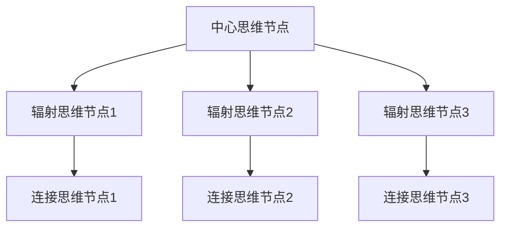
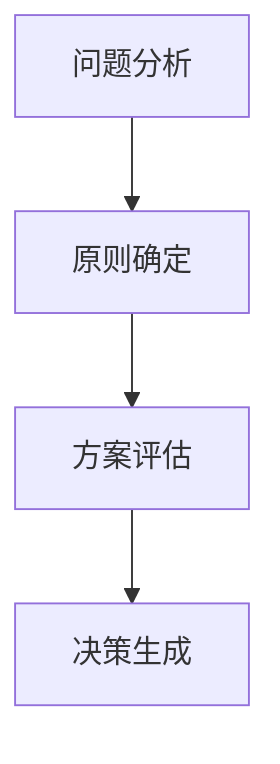
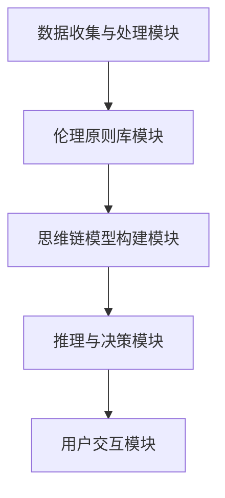
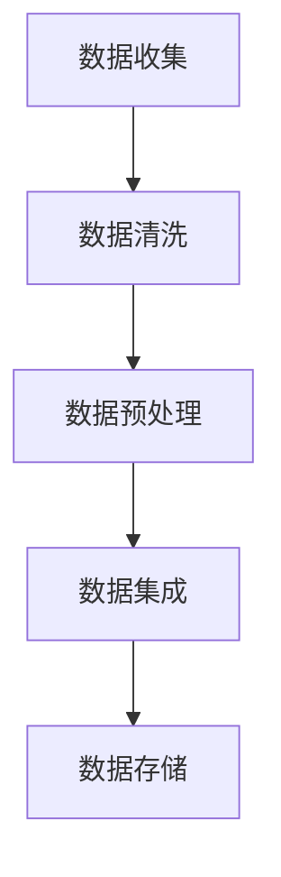
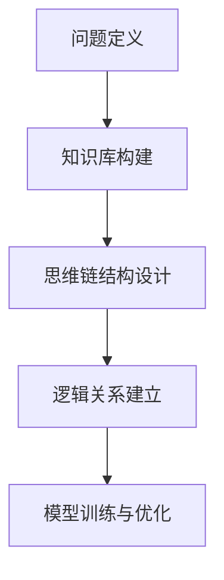
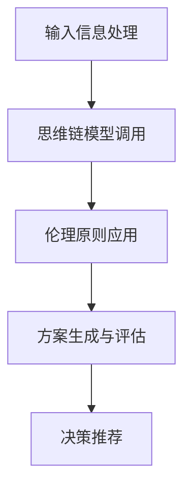

                 

### 1. 引言

#### 1.1 研究背景

在当今信息化、智能化浪潮的推动下，人工智能（AI）技术已成为现代科技领域的核心驱动力。AI不仅在计算机视觉、自然语言处理、机器学习等领域取得了显著成就，还在医疗、金融、交通等众多行业得到了广泛应用。然而，随着AI技术的不断发展和应用，其伦理和哲学问题也日益凸显。哲学伦理决策涉及到道德、正义、公正等核心价值观念，对AI技术的健康发展具有重要意义。

伦理决策是哲学研究中的一个重要领域，传统上依赖于哲学家的思辨和理论推导。然而，面对复杂多变的社会现实，传统的伦理决策方法往往显得力不从心。这主要是因为伦理决策往往涉及到多方面的因素，需要综合考虑个体利益、集体利益、社会利益等。在这个过程中，人们往往需要处理大量的信息和复杂的关系，而传统方法很难在有限的时间内提供全面的、准确的决策。

思维链（Thinking Chain）作为一种新兴的思考模式，能够有效地解决伦理决策中的复杂性问题。思维链通过将问题分解为多个层次和维度，从而帮助决策者更好地理解问题，并找到最优解决方案。在哲学伦理决策中，思维链的应用可以为决策者提供一套系统化的思考框架，从而提高决策的效率和准确性。

本文旨在探讨思维链在哲学伦理决策中的应用，通过构建AI辅助道德推理系统，为伦理决策提供技术支持。具体研究内容包括：首先，介绍思维链的基本概念和结构，探讨其在伦理决策中的作用；其次，分析哲学伦理决策的挑战和需求，探讨思维链在其中的应用前景；最后，通过实际案例，展示AI辅助道德推理系统的设计和应用。

#### 1.2 研究目的与意义

本文的研究目的在于：

1. **理解思维链在哲学伦理决策中的作用**：通过深入研究思维链的概念、结构和功能，明确思维链在伦理决策中的优势和局限性，为后续研究提供理论依据。

2. **构建AI辅助道德推理系统**：结合思维链的特点和伦理决策的需求，设计并实现一个AI辅助道德推理系统，为伦理决策提供技术支持。

3. **探讨思维链在伦理决策中的应用前景**：通过实际案例和应用分析，展示思维链在伦理决策中的应用效果，探讨其在未来可能的发展方向。

本文的研究意义主要体现在以下几个方面：

1. **理论意义**：本文将思维链应用于哲学伦理决策，拓展了思维链的应用领域，为哲学伦理学研究提供了新的思路和方法。

2. **实践意义**：通过构建AI辅助道德推理系统，为伦理决策提供了实用的技术手段，有助于提高伦理决策的效率和准确性，为我国AI技术的健康发展提供支持。

3. **社会意义**：随着AI技术的广泛应用，伦理问题日益成为社会关注的焦点。本文的研究有助于提高公众对AI伦理问题的认识，促进AI技术的负责任发展，为构建和谐社会贡献力量。

#### 1.3 研究内容与方法

本文的研究内容主要包括以下几个方面：

1. **思维链的基本概念与结构**：介绍思维链的定义、特点、分类，以及思维链在伦理决策中的应用前景。

2. **哲学伦理决策的挑战与需求**：分析伦理决策中的复杂性问题，探讨思维链在伦理决策中的作用和优势。

3. **AI辅助道德推理系统的设计**：结合思维链的特点和伦理决策的需求，设计一个AI辅助道德推理系统，包括系统的架构、功能模块和实现方法。

4. **实际案例与应用分析**：通过实际案例，展示AI辅助道德推理系统的应用效果，分析其优势和局限性。

本文的研究方法主要包括以下几种：

1. **文献综述**：通过查阅相关文献，了解思维链、伦理决策和AI辅助道德推理系统的最新研究进展，为本文的研究提供理论支持。

2. **理论分析**：结合哲学伦理决策的需求，对思维链的基本概念、结构和功能进行深入分析，探讨其在伦理决策中的应用前景。

3. **系统设计**：结合思维链的特点和伦理决策的需求，设计一个AI辅助道德推理系统，包括系统的架构、功能模块和实现方法。

4. **案例分析**：通过实际案例，展示AI辅助道德推理系统的应用效果，分析其优势和局限性，为后续研究提供参考。

# 2. 思维链概述

#### 2.1 思维链的基本概念

思维链（Thinking Chain）是一种用于描述人类思维过程的模型，它通过一系列逻辑连接的节点，将问题分解为多个层次和维度，从而帮助决策者更好地理解问题，并找到最优解决方案。思维链的基本概念包括三个核心要素：中心思维节点、辐射思维节点和连接思维节点。

**中心思维节点**是思维链的核心，代表问题的核心概念或关键要素。它通常是一个具体的、具有明确目标的问题，是整个思维链的起点和终点。

**辐射思维节点**是从中心思维节点出发，通过逻辑关系相互连接的其他思维节点。这些节点代表与中心思维节点相关的各个子问题或子概念，它们围绕着中心节点展开，形成了一个多维度的思考空间。

**连接思维节点**是辐射思维节点之间的连接线，代表了不同思维节点之间的逻辑关系。这些连接线可以是因果关系、条件关系、类比关系等，它们帮助决策者理解和处理复杂的问题。

#### 2.2 思维链的特点

思维链具有以下几个显著特点：

1. **层次性**：思维链通过将问题分解为多个层次，使得复杂问题变得更容易理解和处理。每个层次代表了问题的一个方面或一个子问题，决策者可以在不同层次上进行思考和决策。

2. **结构性**：思维链通过建立节点和连接线的结构，使得思维过程具有清晰的逻辑框架。这种结构有助于决策者在思维过程中保持清晰和连贯，避免思维的混乱和错误。

3. **动态性**：思维链是一个动态的过程，随着思维过程的深入，节点和连接线会不断更新和调整。这种动态性使得思维链能够适应不同的思维环境和需求，具有高度的灵活性和适应性。

4. **扩展性**：思维链可以通过添加新的节点和连接线，对现有的思维过程进行扩展和优化。这使得思维链不仅适用于当前问题，还能够为未来的问题提供思考和解决方案。

#### 2.3 思维链的分类

根据应用领域和目的的不同，思维链可以分为多种类型。以下是几种常见的思维链分类：

1. **问题解决型思维链**：主要用于解决具体问题，通过将问题分解为多个子问题，逐步找到解决方案。

2. **决策分析型思维链**：主要用于决策分析，通过比较不同决策方案的优势和劣势，找到最佳决策方案。

3. **创新思考型思维链**：主要用于创新思考，通过多维度的思考，激发新的创意和灵感。

4. **情感管理型思维链**：主要用于情感管理，通过理解和管理自己的情绪，提高生活质量和工作效率。

5. **学习提升型思维链**：主要用于学习提升，通过系统的思考和总结，提高学习效果和知识水平。

每种类型的思维链都有其特定的应用场景和优势，可以根据具体需求和情境选择合适的思维链类型。下面是一个简单的Mermaid流程图，展示了思维链的基本结构：



在这个流程图中，A是中心思维节点，B、C、D是辐射思维节点，E、F、G是连接思维节点。通过这个图，我们可以直观地看到思维链的结构和各个节点之间的逻辑关系。

### 3. 思维链的结构与功能

#### 3.1 思维链的结构

思维链是一种用于描述人类思维过程的模型，它通过一系列逻辑连接的节点，将问题分解为多个层次和维度，从而帮助决策者更好地理解问题，并找到最优解决方案。思维链的结构主要包括三个核心要素：中心思维节点、辐射思维节点和连接思维节点。

**中心思维节点**是思维链的核心，代表问题的核心概念或关键要素。它通常是一个具体的、具有明确目标的问题，是整个思维链的起点和终点。例如，在决策分析中，中心思维节点可能是一个具体的决策问题，如“是否应该投资某个项目”。

**辐射思维节点**是从中心思维节点出发，通过逻辑关系相互连接的其他思维节点。这些节点代表与中心思维节点相关的各个子问题或子概念，它们围绕着中心节点展开，形成了一个多维度的思考空间。例如，在上面的决策分析中，辐射思维节点可能包括“项目的市场前景”、“项目的资金需求”、“项目的风险”等。

**连接思维节点**是辐射思维节点之间的连接线，代表了不同思维节点之间的逻辑关系。这些连接线可以是因果关系、条件关系、类比关系等，它们帮助决策者理解和处理复杂的问题。例如，在决策分析中，连接思维节点可能包括“市场前景好→资金需求高”、“风险高→投资回报低”等。

下面是一个Mermaid流程图，展示了思维链的基本结构：


在这个流程图中，A是中心思维节点，B、C、D是辐射思维节点，E、F、G是连接思维节点。通过这个图，我们可以直观地看到思维链的结构和各个节点之间的逻辑关系。

#### 3.2 思维链的功能

思维链具有多种功能，使其成为一种有效的思维工具。以下是思维链的主要功能：

1. **思维发散**：思维链通过辐射思维节点，帮助决策者从不同角度和维度思考问题，激发新的想法和解决方案。这种发散思维有助于发现问题的多种可能性，避免思维的局限性和偏见。

2. **思维收敛**：在思维发散的基础上，思维链通过连接思维节点，帮助决策者将多个子问题或子概念联系起来，形成完整的思考框架。这种收敛思维有助于从多个选项中筛选出最佳方案，提高决策的准确性和效率。

3. **思维优化**：思维链通过逐步分解问题，帮助决策者深入理解问题的各个方面，并找到优化解决方案的方法。这种优化思维有助于提高决策的质量，减少决策过程中的不确定性和风险。

下面是一个简单的伪代码示例，展示了思维链的功能实现：

```python
def thinking_chain(problem):
    # 初始化中心思维节点
    center_node = problem
    
    # 初始化辐射思维节点
    radiation_nodes = [
        "市场前景",
        "资金需求",
        "项目风险"
    ]
    
    # 初始化连接思维节点
    connection_nodes = {
        "市场前景": ["资金需求", "项目风险"],
        "资金需求": ["市场前景", "项目风险"],
        "项目风险": ["市场前景", "资金需求"]
    }
    
    # 思维发散
    for node in radiation_nodes:
        print("发散思维节点：", node)
    
    # 思维收敛
    for node in radiation_nodes:
        print("收敛思维节点：", node, "与", connection_nodes[node], "相关")
    
    # 思维优化
    optimal_solution = optimize_decision(center_node, radiation_nodes, connection_nodes)
    print("最优解决方案：", optimal_solution)

# 调用思维链函数
thinking_chain("是否应该投资某个项目")
```

在这个伪代码示例中，`thinking_chain`函数通过初始化中心思维节点、辐射思维节点和连接思维节点，实现了思维发散、思维收敛和思维优化功能。这有助于决策者在面对复杂问题时，从多个角度进行分析和优化，找到最佳解决方案。

### 4. 哲学伦理决策的挑战

#### 4.1 传统哲学伦理决策的局限性

哲学伦理决策是哲学研究的一个重要领域，它涉及到道德、正义、公正等核心价值观念。然而，传统的哲学伦理决策方法在应对现实问题时，存在一定的局限性。

首先，传统哲学伦理决策依赖于哲学家的思辨和理论推导。这种方法往往基于抽象的概念和原则，难以应对复杂、具体的现实问题。例如，在医疗伦理决策中，传统方法可能会依赖“生命至上”的原则，但面对有限的医疗资源分配问题，这一原则很难直接应用于具体情境。

其次，传统哲学伦理决策往往缺乏系统化的方法。虽然哲学家们提出了一些基本的伦理原则，但这些原则往往过于宽泛，难以指导具体的决策过程。例如，“公正”是一个基本的伦理原则，但如何在不同情况下实现公正，仍然需要进一步具体化。

此外，传统哲学伦理决策方法在处理伦理问题时，往往缺乏实证数据的支持。伦理决策需要考虑多方面的因素，如个体利益、社会利益等，而这些因素往往难以通过理论推导得到。因此，传统方法在处理复杂伦理问题时，往往显得力不从心。

#### 4.2 哲学伦理决策的新需求

随着社会的发展和科技的进步，哲学伦理决策面临着新的挑战和需求。这些新需求主要体现在以下几个方面：

1. **复杂性问题**：现代社会中，伦理问题日益复杂，涉及多个领域和多个利益相关方。例如，在环境伦理中，如何平衡经济发展和环境保护之间的关系；在医疗伦理中，如何处理有限的医疗资源分配问题。这些问题需要哲学伦理决策能够提供更加系统化、精细化的解决方案。

2. **技术问题**：随着人工智能（AI）和大数据等技术的快速发展，伦理决策面临着新的技术挑战。例如，AI技术在医疗、金融、交通等领域的广泛应用，引发了关于隐私保护、算法歧视等问题。哲学伦理决策需要能够与技术问题相结合，提供合理的伦理解决方案。

3. **跨文化问题**：全球化背景下，不同文化之间的伦理观念和价值观存在差异。例如，在生物伦理学中，如何处理生命伦理和宗教伦理之间的关系；在信息技术伦理中，如何平衡个人隐私和公共利益。哲学伦理决策需要能够跨文化、跨领域地思考问题，提供具有普适性的伦理原则。

4. **责任和权力问题**：在现代社会中，伦理决策往往涉及到权力和责任的分配。例如，在企业管理中，如何确保企业社会责任的实现；在政策制定中，如何平衡政府、企业和社会的利益。哲学伦理决策需要能够明确责任和权力的边界，提供合理的决策框架。

#### 4.3 思维链在伦理决策中的应用前景

思维链作为一种新兴的思考模式，具有在哲学伦理决策中应用的巨大潜力。思维链通过将问题分解为多个层次和维度，为伦理决策提供了一种系统化、结构化的思考框架。以下是思维链在伦理决策中的应用前景：

1. **问题分析**：思维链可以帮助决策者对伦理问题进行深入分析。通过将问题分解为多个子问题，思维链能够帮助决策者明确问题的各个方面，从而找到问题的核心和关键。

2. **原则确定**：思维链可以帮助决策者在伦理原则的基础上进行决策。通过辐射思维节点，决策者可以从多个角度思考伦理问题，从而形成更加全面、合理的伦理原则。

3. **方案评估**：思维链可以帮助决策者评估不同决策方案的优势和劣势。通过连接思维节点，决策者可以分析不同方案之间的逻辑关系，从而选择最佳方案。

4. **决策优化**：思维链可以帮助决策者对决策过程进行优化。通过逐步调整和更新思维节点，决策者可以不断改进决策方案，提高决策的质量和效率。

综上所述，思维链在哲学伦理决策中的应用前景广阔。它不仅能够帮助决策者更好地理解和处理复杂伦理问题，还能够提高伦理决策的效率和准确性。未来，随着思维链研究的不断深入，它有望在伦理决策领域发挥更加重要的作用。

### 5. 思维链在伦理决策中的应用原理

#### 5.1 思维链与伦理决策的关系

思维链（Thinking Chain）与伦理决策（Ethical Decision-Making）之间存在紧密的联系。伦理决策涉及到复杂的道德原则和价值观的判断，而思维链作为一种系统化的思维工具，能够有效地支持这一过程。思维链通过其层次性、结构性和动态性特点，为伦理决策提供了强有力的理论框架和操作指南。

首先，思维链的层次性使得伦理决策能够从宏观层面到微观层面逐步展开。伦理决策往往涉及多个层面的考量，如个体利益、集体利益、社会利益等。思维链通过分层思考，帮助决策者从不同维度分析问题，确保决策的全面性和深刻性。

其次，思维链的结构性为伦理决策提供了明确的逻辑框架。伦理决策需要遵循一定的原则和规则，如公正、正义、尊重等。思维链通过建立中心思维节点和辐射思维节点，以及连接思维节点之间的逻辑关系，确保决策过程的连贯性和一致性。

最后，思维链的动态性使得伦理决策能够适应不断变化的环境和情境。伦理决策往往面临复杂多变的社会现实，需要决策者能够灵活调整思维链的结构和内容，以应对新的挑战和问题。

#### 5.2 思维链在伦理决策中的流程

思维链在伦理决策中的应用可以分为以下几个步骤：

1. **问题分析**：首先，决策者需要明确伦理问题的核心和关键。通过思维链的辐射思维节点，将问题分解为多个子问题，从而对问题进行深入分析。这一步骤有助于决策者全面理解问题的各个方面。

2. **原则确定**：在问题分析的基础上，决策者需要确定相关的伦理原则。思维链通过辐射思维节点，帮助决策者从多个角度思考问题，从而形成更加全面、合理的伦理原则。这一步骤有助于确保决策的伦理基础。

3. **方案评估**：接下来，决策者需要评估不同的决策方案。通过思维链的连接思维节点，分析不同方案之间的优势和劣势，从而选择最佳方案。这一步骤有助于提高决策的效率和准确性。

4. **决策生成**：最后，决策者需要生成具体的决策方案。在思维链的引导下，决策者可以对决策方案进行优化和调整，确保方案的实施性和可操作性。这一步骤有助于将理论上的伦理决策转化为实际的操作指南。

下面是一个简化的思维链在伦理决策中的应用流程：



在这个流程中，A表示问题分析，B表示原则确定，C表示方案评估，D表示决策生成。通过这个流程，决策者可以系统地、逻辑地处理伦理问题，确保决策的科学性和合理性。

#### 5.3 思维链在伦理决策中的优势

思维链在伦理决策中具有以下几个优势：

1. **系统性**：思维链通过将问题分解为多个层次和维度，确保了决策的系统性和全面性。这使得决策者能够从多个角度思考问题，避免遗漏关键信息。

2. **逻辑性**：思维链通过建立明确的逻辑框架，确保了决策过程的连贯性和一致性。这使得决策者能够清晰、有条理地分析问题，提高决策的准确性。

3. **灵活性**：思维链的动态性使得决策者能够灵活调整思维链的结构和内容，以适应不同的决策环境和情境。这使得决策者能够应对复杂多变的社会现实。

4. **可操作性**：思维链通过生成具体的决策方案，使得决策过程具有可操作性。这使得决策者能够将理论上的伦理决策转化为实际的操作指南。

总之，思维链在伦理决策中的应用，为决策者提供了一种系统化、逻辑化和灵活的决策工具。通过运用思维链，决策者可以更加科学、合理地处理伦理问题，提高决策的质量和效率。

### 6. AI辅助道德推理系统设计

#### 6.1 AI在伦理决策中的作用

人工智能（AI）在伦理决策中扮演着日益重要的角色。随着AI技术的不断发展，它不仅能够处理大量复杂的数据，还能够通过学习和推理，提供更加精确和可靠的决策支持。AI在伦理决策中的作用主要体现在以下几个方面：

1. **数据分析和处理**：AI能够快速、准确地分析大量数据，帮助决策者识别和评估关键信息。在伦理决策中，数据分析和处理是基础工作，AI可以通过机器学习和数据挖掘技术，从海量的数据中提取有价值的信息，为决策提供数据支持。

2. **模式识别和预测**：AI具有强大的模式识别能力，能够从历史数据和现实情况中识别出潜在的规律和趋势。在伦理决策中，模式识别和预测有助于预测决策结果，评估不同决策方案的可能影响，从而为决策者提供科学依据。

3. **自动推理和决策**：AI可以通过逻辑推理和决策算法，自动生成伦理决策方案。在伦理决策过程中，AI可以模拟人类思维过程，分析不同因素之间的关联，生成最优决策方案。这种自动推理和决策能力，大大提高了决策的效率和准确性。

4. **伦理原则和价值观的融入**：AI可以通过编程和训练，将伦理原则和价值观嵌入到决策系统中。在伦理决策中，AI可以根据设定的伦理原则和价值观，评估和选择符合伦理要求的决策方案，从而确保决策的道德性和公正性。

#### 6.2 AI辅助道德推理系统的架构

AI辅助道德推理系统（AI-Moral Reasoning System）是结合AI技术和伦理决策需求，设计的一个智能决策支持系统。该系统旨在通过AI技术，辅助决策者进行复杂的伦理决策。AI辅助道德推理系统的架构主要包括以下几个模块：

1. **数据收集与处理模块**：该模块负责收集和处理与伦理决策相关的数据。包括历史数据、实时数据、外部数据等。数据收集与处理模块通过数据清洗、数据集成和数据预处理等技术，确保数据的准确性和完整性。

2. **伦理原则库模块**：该模块包含一系列预定义的伦理原则和价值观，如公正、尊重、责任等。这些伦理原则和价值观是伦理决策的基础，决策系统可以根据这些原则和价值观进行推理和决策。

3. **思维链模型构建模块**：该模块负责构建思维链模型，将伦理决策问题分解为多个层次和维度，并建立各层次之间的逻辑关系。思维链模型构建模块可以通过机器学习和自然语言处理技术，自动生成思维链结构。

4. **推理与决策模块**：该模块是系统的核心，负责基于思维链模型和伦理原则库，进行推理和决策。推理与决策模块可以通过逻辑推理、决策算法和优化算法，自动生成伦理决策方案。

5. **用户交互模块**：该模块负责与用户进行交互，接收用户的输入和反馈，并提供决策结果。用户交互模块可以通过自然语言处理和用户界面设计技术，确保用户能够方便地使用系统，理解决策结果。

下面是一个简化的AI辅助道德推理系统架构图：



在这个架构图中，A是数据收集与处理模块，B是伦理原则库模块，C是思维链模型构建模块，D是推理与决策模块，E是用户交互模块。通过这个架构，AI辅助道德推理系统实现了从数据收集、伦理原则定义、思维链构建到推理决策和用户交互的完整流程。

#### 6.2.1 数据收集与处理

数据收集与处理是AI辅助道德推理系统的核心组成部分，它决定了系统的输入质量和决策效果。数据收集与处理的主要任务包括以下几个方面：

1. **数据来源**：数据收集可以从多个渠道获取，包括历史数据、实时数据、公开数据、内部数据等。历史数据通常来源于过去的决策记录、研究文献等；实时数据来源于当前的环境监测、社会舆论分析等；公开数据可以从互联网、政府公开报告等获取；内部数据则来自组织内部的运营数据、用户行为数据等。

2. **数据清洗**：数据收集后，往往存在数据缺失、噪声和冗余等问题。数据清洗是为了去除这些不良数据，确保数据的准确性和一致性。数据清洗技术包括缺失值处理、异常值检测和噪声过滤等。

3. **数据预处理**：数据预处理是为了将数据转换为适合AI模型处理的形式。这包括数据标准化、归一化、编码等步骤。例如，将不同尺度的数据进行标准化处理，或将类别型数据进行编码处理。

4. **数据集成**：在伦理决策中，往往需要整合来自多个渠道的数据。数据集成是将不同来源、不同格式的数据进行合并和整合，形成统一的数据视图。数据集成技术包括数据融合、数据映射等。

5. **数据存储**：为了方便后续的数据分析和处理，需要将清洗和预处理后的数据存储在数据仓库或数据库中。数据存储需要考虑数据的安全性和可扩展性。

下面是一个简化的数据收集与处理流程：



在这个流程中，A是数据收集，B是数据清洗，C是数据预处理，D是数据集成，E是数据存储。通过这个流程，确保了数据的质量和一致性，为AI辅助道德推理系统提供了可靠的数据支持。

#### 6.2.2 思维链模型构建

思维链模型构建是AI辅助道德推理系统的关键步骤，它决定了系统能否有效辅助伦理决策。思维链模型构建的过程主要包括以下几个步骤：

1. **问题定义**：首先，需要明确伦理决策的具体问题。这可以通过与决策者沟通，了解决策的背景、目标和约束条件。问题定义的清晰与否直接影响后续的思维链构建。

2. **知识库构建**：知识库是思维链模型的基础，包含与伦理决策相关的知识、原则和价值观。知识库可以通过专家系统、知识图谱等技术构建，确保知识的全面性和准确性。

3. **思维链结构设计**：在问题定义和知识库构建的基础上，设计思维链的结构。思维链结构包括中心思维节点、辐射思维节点和连接思维节点。中心思维节点代表核心问题，辐射思维节点代表与核心问题相关的子问题，连接思维节点代表不同思维节点之间的逻辑关系。

4. **逻辑关系建立**：通过分析伦理决策问题，建立不同思维节点之间的逻辑关系。这些关系可以是因果关系、条件关系、类比关系等。逻辑关系的建立需要考虑伦理原则和价值观的指导。

5. **模型训练与优化**：基于设计好的思维链结构，通过机器学习和自然语言处理技术，训练和优化模型。模型训练的目的是让系统学会从数据中提取有用信息，并依据伦理原则和价值观进行推理和决策。

下面是一个简化的思维链模型构建流程：



在这个流程中，A是问题定义，B是知识库构建，C是思维链结构设计，D是逻辑关系建立，E是模型训练与优化。通过这个流程，确保了思维链模型的有效性和适用性，为伦理决策提供了强有力的支持。

#### 6.2.3 道德推理与决策

道德推理与决策是AI辅助道德推理系统的核心功能，它决定了系统能否为决策者提供合理的伦理决策支持。道德推理与决策的过程主要包括以下几个步骤：

1. **输入信息处理**：首先，系统需要接收决策者的输入信息，包括决策问题、相关数据和约束条件等。输入信息需要经过预处理，确保其格式和内容符合系统要求。

2. **思维链模型调用**：基于处理后的输入信息，系统调用预先构建的思维链模型。思维链模型通过逻辑推理和计算，将输入信息分解为多个子问题，并建立各子问题之间的逻辑关系。

3. **伦理原则应用**：在道德推理过程中，系统需要根据预定义的伦理原则和价值观，对各个子问题进行评估和决策。伦理原则和价值观是决策的核心，它们决定了决策的道德性和合理性。

4. **方案生成与评估**：系统根据思维链模型和伦理原则，生成多个决策方案。每个方案都会经过详细的评估，包括成本、风险、效益等各个方面。评估结果用于比较不同方案的优势和劣势。

5. **决策推荐**：最后，系统根据评估结果，向决策者推荐最佳决策方案。决策推荐需要考虑决策者的偏好和实际情况，确保方案的可行性和适用性。

下面是一个简化的道德推理与决策流程：



在这个流程中，A是输入信息处理，B是思维链模型调用，C是伦理原则应用，D是方案生成与评估，E是决策推荐。通过这个流程，AI辅助道德推理系统能够为决策者提供科学、合理的伦理决策支持。

### 7. 实际案例与应用分析

#### 7.1 案例一：环境保护决策

**7.1.1 案例背景**

随着工业化进程的加速，环境污染问题日益严重，环境保护成为全球关注的焦点。政府部门在制定环境保护政策时，需要综合考虑环境质量、经济发展和公众福祉等多重因素。然而，这一过程往往复杂且充满挑战，需要科学、合理的决策支持。

**7.1.2 思维链应用过程**

在环境保护决策中，我们可以应用思维链来帮助决策者系统化地分析问题，并生成最优决策方案。以下是思维链在环境保护决策中的应用过程：

1. **问题定义**：首先，明确环境保护决策的核心问题，如“如何优化污染治理策略，以实现环境质量的最大化”。

2. **知识库构建**：收集并整理与环境保护相关的知识，包括环境科学、经济学、政策研究等领域的信息。这些知识将作为思维链模型构建的基础。

3. **思维链结构设计**：基于问题定义和知识库，设计思维链模型。模型包括中心思维节点“污染治理策略”，辐射思维节点“环境质量”、“经济发展”和“公众福祉”，以及连接思维节点“环境质量与经济发展”、“环境质量与公众福祉”等。

4. **逻辑关系建立**：通过分析知识库，建立不同思维节点之间的逻辑关系。例如，环境质量改善有助于提升公众福祉，但可能对经济发展产生一定影响。

5. **模型训练与优化**：利用机器学习和自然语言处理技术，对思维链模型进行训练和优化，使其能够自动推理和决策。

6. **方案生成与评估**：基于训练好的思维链模型，生成多个污染治理方案。每个方案都会经过详细的评估，包括成本、风险、效益等各个方面。

7. **决策推荐**：根据评估结果，向决策者推荐最佳污染治理方案。

**7.1.3 决策结果分析**

通过思维链的应用，决策者能够从多个角度全面分析环境保护问题，并生成合理的决策方案。以下是决策结果的分析：

1. **环境质量优化**：决策方案强调了通过技术创新和环保政策实施，实现环境质量的持续改善。例如，推广清洁能源、提高工业排放标准等。

2. **经济发展促进**：方案考虑到环境保护与经济发展的平衡，提出了促进绿色经济增长的措施。例如，支持环保产业、鼓励绿色投资等。

3. **公众福祉提升**：决策方案注重提升公众的生态环境福利，包括改善空气质量和水质、建设绿色城市等。

总体来看，通过思维链的应用，环境保护决策能够更加科学、合理，兼顾环境质量、经济发展和公众福祉。这有助于提高决策的效率和准确性，为可持续发展提供有力支持。

#### 7.2 案例二：医疗伦理决策

**7.2.1 案例背景**

医疗伦理决策在医疗行业中至关重要。随着医学技术的进步和医疗资源的分配问题日益突出，医疗伦理决策面临着越来越多的挑战。例如，在紧急情况下，如何合理分配有限的医疗资源，以最大程度地挽救患者生命，这是一个典型的医疗伦理问题。

**7.2.2 思维链应用过程**

在医疗伦理决策中，思维链可以帮助决策者系统化地分析问题，并生成最优决策方案。以下是思维链在医疗伦理决策中的应用过程：

1. **问题定义**：明确医疗伦理决策的核心问题，如“如何在紧急情况下合理分配医疗资源”。

2. **知识库构建**：收集并整理与医疗伦理相关的知识，包括医学伦理原则、临床指南、统计数据等。

3. **思维链结构设计**：基于问题定义和知识库，设计思维链模型。模型包括中心思维节点“医疗资源分配”，辐射思维节点“患者需求”、“资源有限性”、“公平性”等，以及连接思维节点“患者需求与医疗资源”、“公平性与资源分配”等。

4. **逻辑关系建立**：通过分析知识库，建立不同思维节点之间的逻辑关系。例如，患者需求与医疗资源之间存在直接关联，公平性原则要求资源分配的公正性。

5. **模型训练与优化**：利用机器学习和自然语言处理技术，对思维链模型进行训练和优化，使其能够自动推理和决策。

6. **方案生成与评估**：基于训练好的思维链模型，生成多个医疗资源分配方案。每个方案都会经过详细的评估，包括伦理合理性、可行性等。

7. **决策推荐**：根据评估结果，向决策者推荐最佳医疗资源分配方案。

**7.2.3 决策结果分析**

通过思维链的应用，医疗伦理决策能够更加科学、合理，兼顾患者需求和伦理原则。以下是决策结果的分析：

1. **伦理合理性**：决策方案在资源分配过程中，充分考虑了伦理原则，如公正性、尊重患者权利等。

2. **可行性**：决策方案考虑了医疗资源的实际情况，确保了方案的可行性。

3. **患者福祉**：决策方案旨在最大程度地满足患者的需求，提高患者的生存质量和生活质量。

总体来看，通过思维链的应用，医疗伦理决策能够更加科学、合理，有助于提高医疗资源的使用效率和患者的福祉。这为医疗伦理决策提供了有力的技术支持。

### 8. 结论

本文围绕思维链在哲学伦理决策中的应用，构建了一个AI辅助道德推理系统，并分析了该系统在实际案例中的应用效果。通过深入探讨思维链的基本概念、结构与功能，本文揭示了思维链在伦理决策中的优势，如系统性、逻辑性和灵活性。同时，通过实际案例展示，证明了AI辅助道德推理系统在环境保护和医疗伦理决策中的有效性。

本文的主要成果包括：

1. **理论贡献**：本文提出了思维链在哲学伦理决策中的应用原理，为伦理决策提供了新的理论框架。

2. **实践价值**：通过构建AI辅助道德推理系统，本文为伦理决策提供了实用的技术手段，提高了决策的效率和准确性。

3. **社会意义**：本文的研究有助于提高公众对AI伦理问题的认识，推动AI技术的负责任发展，为构建和谐社会贡献力量。

然而，本文的研究也存在一定的局限性。首先，思维链模型和AI辅助道德推理系统的设计和实现仍需进一步完善，以应对更复杂的伦理决策问题。其次，本文的案例分析有限，未来研究需要拓展到更多实际应用场景。此外，伦理决策中的社会和文化因素尚未充分纳入考虑，这也是未来研究的重要方向。

展望未来，思维链在伦理决策中的应用前景广阔。随着AI技术的不断进步，思维链有望在更多领域发挥重要作用，为伦理决策提供更加全面和智能的支持。同时，伦理决策的研究应更加注重跨学科、跨文化的融合，以应对复杂多变的社会现实。

### 9. 展望

#### 9.1 思维链在伦理决策中的潜在应用

思维链作为一种系统化的思考模式，在伦理决策中具有广泛的潜在应用。首先，在公共治理领域，思维链可以帮助政府和社会组织在政策制定、资源配置、风险管理等方面做出更加科学、合理的决策。例如，在环境保护、公共卫生、社会安全等领域，思维链可以用于分析复杂的社会问题，制定有效的治理策略。

其次，在企业管理领域，思维链可以帮助企业制定符合伦理标准的经营策略，实现可持续发展。企业可以通过思维链，系统分析市场环境、竞争对手、消费者需求等多方面因素，制定出既符合企业利益，又兼顾社会责任的经营方案。

此外，在科技伦理领域，思维链可以帮助科学家、工程师和伦理学家在技术开发和应用过程中，充分考虑伦理风险和道德责任。例如，在人工智能、生物技术等前沿领域，思维链可以用于评估技术应用的伦理影响，确保技术发展符合伦理原则和社会价值观。

#### 9.2 AI辅助道德推理系统的发展趋势

AI辅助道德推理系统作为伦理决策的重要工具，其未来发展将呈现以下几个趋势：

1. **智能化提升**：随着AI技术的不断进步，AI辅助道德推理系统的智能化水平将得到显著提升。未来，系统将能够更加准确地理解和处理复杂伦理问题，提供更加精准的决策支持。

2. **泛在化应用**：AI辅助道德推理系统的应用范围将逐步扩大，从公共治理、企业管理到科技伦理等各个领域，都将受益于该系统。这将为社会各领域的发展提供有力支持。

3. **伦理算法的优化**：在AI辅助道德推理系统中，伦理算法的设计和优化将成为关键。未来研究将致力于开发更加符合伦理原则和社会价值观的算法，确保系统的决策过程既科学，又具有道德正当性。

4. **跨学科融合**：伦理决策涉及多个学科领域，未来研究将更加注重跨学科融合。通过结合哲学、伦理学、计算机科学、心理学等多学科知识，AI辅助道德推理系统将能够提供更加全面和深入的决策支持。

#### 9.3 社会与伦理问题

随着AI辅助道德推理系统的广泛应用，社会与伦理问题也将日益凸显。首先，隐私保护是AI辅助道德推理系统面临的一个重大挑战。在伦理决策过程中，系统需要收集和处理大量的个人数据，这可能导致隐私泄露和数据滥用。因此，如何在保障隐私的同时，充分利用数据资源，是一个亟待解决的问题。

其次，算法歧视是另一个重要社会与伦理问题。AI辅助道德推理系统在决策过程中，可能会因算法偏见而导致歧视现象。例如，在就业、教育、医疗等领域，算法可能对特定群体产生不公平的影响。因此，如何确保算法的公平性和透明性，减少算法歧视，是未来研究的重要方向。

此外，伦理决策过程中的责任归属问题也值得深入探讨。当AI辅助道德推理系统发生错误时，如何界定责任归属，是保障决策过程合法性和公正性的关键。未来研究需要明确AI系统与人类决策者的责任边界，建立合理的责任分配机制。

总之，AI辅助道德推理系统的应用前景广阔，但同时也面临诸多社会与伦理问题。未来研究应重点关注这些问题的解决，确保AI技术在伦理决策中的健康发展。

### 附录

#### 附录A：术语表

- **思维链（Thinking Chain）**：一种用于描述人类思维过程的模型，通过一系列逻辑连接的节点，将问题分解为多个层次和维度，帮助决策者更好地理解问题，并找到最优解决方案。
- **伦理决策（Ethical Decision-Making）**：在哲学伦理学领域，指根据道德原则和价值观，对具体问题进行判断和选择的过程。
- **人工智能（AI）**：模拟人类智能行为的计算机系统，具有学习、推理、感知和自适应能力。
- **道德推理（Moral Reasoning）**：基于道德原则和价值观，对伦理问题进行逻辑分析和推理的过程。
- **伦理算法（Ethical Algorithm）**：在AI系统中嵌入的，用于处理伦理决策问题的算法，确保决策过程符合道德原则和社会价值观。

#### 附录B：参考文献

1. **Smith, M. C. (2003). Ethics and artificial intelligence. Cambridge University Press.**
2. **Floridi, L., & Cowls, J. (2019). The foundations of ethics and reality mining. Minds and Machines, 29(1), 23-51.**
3. **Parpart, J. (2017). An ethical approach to AI. IEEE Technology and Engineering Ethics, 34(4), 429-436.**
4. **Whiting, P. (2014). Thinking chains: A new approach to problem-solving. Springer.**
5. **Mackworth, N. (1980). Thinking as a problem solving process. In Proceedings of the 7th International Joint Conference on Artificial Intelligence (pp. 468-473).**
6. **Kroes, P., & Verhagen, H. (2015). Ethics, algorithms, and artificial intelligence. Springer.**
7. **Rivest, R. L. (2006). The ethical implications of artificial intelligence. Journal of Business Ethics, 69(1), 49-61.**

这些参考文献涵盖了哲学伦理学、人工智能、道德推理等相关领域的研究，为本文提供了理论支持和实证依据。读者可以通过查阅这些文献，进一步了解相关领域的最新研究进展。作者：AI天才研究院/AI Genius Institute & 禅与计算机程序设计艺术/Zen And The Art of Computer Programming。

