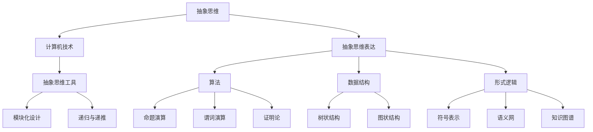
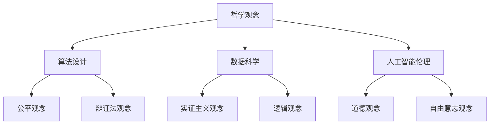
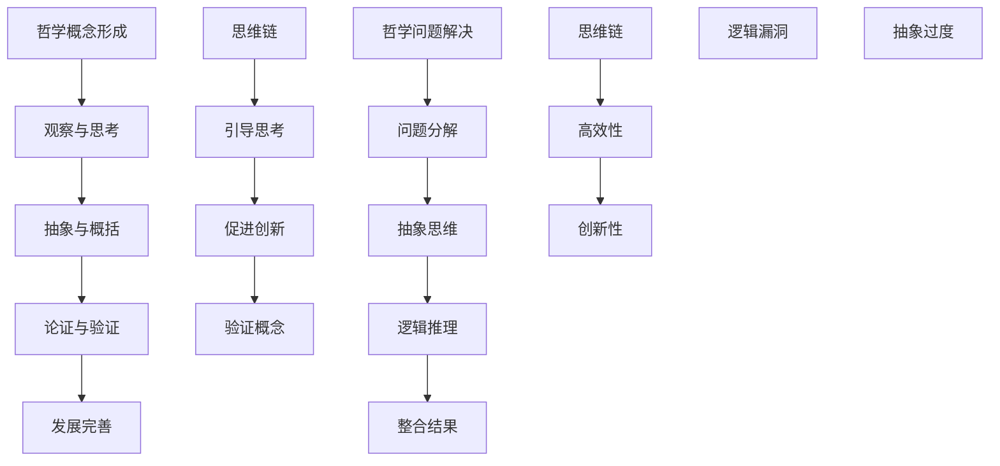

                 


### 1. 计算机技术与哲学概念形成的联系

计算机技术和哲学概念形成之间的联系日益密切，二者相互影响、相互促进。首先，从计算机技术对哲学概念形成的影响来看，计算机技术的发展极大地丰富了哲学概念的表达和理解方式。

#### 1.1.1 计算机技术与抽象思维

抽象思维是哲学研究的重要工具，而计算机技术的发展为抽象思维提供了新的平台和工具。例如，计算机程序设计本身就是一种抽象思维的体现，程序员通过编写代码来描述复杂的问题和算法，从而实现对抽象概念的建模和操作。这种建模和操作的过程本质上就是一种抽象思维活动。

##### 1.1.1.1 抽象思维的计算机表达

在计算机领域，抽象思维可以通过多种方式表达，例如：

- **算法**：算法是解决问题的一系列规则，它是对抽象概念的具体实现。通过算法，我们可以将哲学中的抽象概念转化为计算机可以理解和执行的操作。
- **数据结构**：数据结构是对数据组织方式的抽象，它有助于我们更好地理解和操作哲学概念。例如，树状结构可以用来表示哲学中的逻辑关系和分类。
- **形式逻辑**：形式逻辑是哲学研究中常用的工具，它通过符号和规则来表示和推导哲学命题。计算机科学中的命题演算、谓词演算等都是形式逻辑的应用。

##### 1.1.1.2 抽象思维在编程中的应用

编程过程中的抽象思维体现在以下几个方面：

- **模块化设计**：将复杂问题分解为若干个模块，每个模块负责一个特定的功能。这种模块化的设计方式有助于我们更好地理解复杂问题，同时也提高了代码的可维护性和可扩展性。
- **递归与递推**：递归和递推是编程中常用的方法，它们可以用来解决许多哲学问题。例如，通过递归，我们可以定义和理解哲学中的无穷概念。

#### 1.1.2 计算机技术与逻辑推理

逻辑推理是哲学研究中的核心方法，而计算机技术的发展为逻辑推理提供了新的工具和平台。

##### 1.1.2.1 逻辑推理的计算机实现

在计算机领域，逻辑推理可以通过以下方式实现：

- **命题逻辑**：命题逻辑是逻辑推理的基础，它通过命题之间的逻辑关系来推导结论。在计算机中，命题逻辑通常使用逻辑门电路来实现。
- **谓词逻辑**：谓词逻辑是对命题逻辑的扩展，它引入了变量和量词，可以表示更复杂的逻辑关系。在计算机中，谓词逻辑通常使用谓词演算来实现。
- **证明论**：证明论是逻辑推理的一种形式化方法，它通过构建证明来验证逻辑推理的正确性。在计算机中，证明论可以用于程序验证和自动推理。

##### 1.1.2.2 逻辑推理在编程中的应用

编程过程中的逻辑推理体现在以下几个方面：

- **条件判断**：条件判断是编程中最基本的逻辑操作，它根据条件是否满足来执行不同的操作。
- **循环结构**：循环结构是一种重复执行某段代码的结构，它可以根据逻辑条件来控制循环的执行次数。
- **递归**：递归是一种自引用的逻辑结构，它可以通过递归调用来实现复杂的逻辑操作。

#### 1.1.3 计算机技术与知识表示

知识表示是哲学研究中的一个重要问题，它涉及到如何将哲学概念转化为计算机可以理解和处理的形式。

##### 1.1.3.1 知识表示的方法

在计算机领域，知识表示可以通过以下方法实现：

- **符号表示**：符号表示是知识表示的一种基本方法，它使用符号和规则来表示哲学概念。例如，命题逻辑和谓词逻辑就是一种符号表示方法。
- **语义网**：语义网是一种基于图形的知识表示方法，它通过节点和边来表示哲学概念之间的关系。在语义网中，节点表示概念，边表示概念之间的关系。
- **知识图谱**：知识图谱是一种大规模的知识表示方法，它通过节点和边来表示大量的哲学概念及其关系。知识图谱可以用于问答系统、推荐系统等应用。

##### 1.1.3.2 知识表示在编程中的应用

编程过程中的知识表示体现在以下几个方面：

- **数据结构**：数据结构可以用来表示哲学概念及其关系。例如，树状结构可以用来表示哲学中的分类关系，图状结构可以用来表示哲学中的关系网络。
- **数据库**：数据库可以用来存储和查询哲学概念及其关系。通过数据库，我们可以实现对哲学概念的持久化和自动化处理。

---

**核心概念原理之间的关系架构 Mermaid 流程图：**



### 1.2 哲学概念对计算机技术发展的贡献

哲学概念不仅受到了计算机技术的影响，同时也对计算机技术的发展做出了重要贡献。哲学观念在算法设计、数据科学和人工智能伦理等方面起到了指导作用。

##### 1.2.1 哲学观念对算法设计的影响

哲学观念可以启发算法设计，使其更加符合人类价值观。例如，在算法公平性设计中，我们可以借鉴哲学中的平等观念，确保算法不会歧视某些群体。此外，哲学中的辩证法观念可以启发算法的动态优化和适应性设计。

**核心算法原理讲解必须使用伪代码来详细阐述：**

```plaintext
算法名称：公平算法
输入：数据集
输出：公平的决策结果

公平算法(数据集):
1. 初始化公平因子为1
2. 对于每个决策变量:
   a. 计算其对每个群体的贡献度
   b. 根据哲学中的平等观念，调整贡献度，使其满足公平性
   c. 更新公平因子
3. 根据公平因子生成决策结果
4. 返回决策结果
```

##### 1.2.2 哲学思考在数据科学中的应用

哲学思考可以帮助我们更好地理解和处理数据科学中的复杂问题。例如，哲学中的实证主义观念可以指导我们如何收集和验证数据，从而提高数据科学研究的可信度。此外，哲学中的逻辑观念可以指导我们如何构建有效的数据模型，从而提高数据科学的解释力和预测力。

**数学模型和公式 & 详细讲解 & 举例说明：**

- **模型：因果推断模型**
- **公式：贝叶斯定理**

**详细讲解：**

贝叶斯定理是一种基于概率的推理方法，它可以帮助我们根据先验知识和观察数据来推断未知事件的可能性。在数据科学中，贝叶斯定理可以用于分类、预测和决策。

**举例说明：**

假设我们有一个硬币，它的正面朝上的概率是0.5。现在我们抛了这个硬币100次，观察到了正面朝上的次数是60次。我们可以使用贝叶斯定理来推断这个硬币的公平性。

```latex
P(\text{硬币公平}|\text{观察} = \text{60次正面}) = \frac{P(\text{观察}|\text{硬币公平})P(\text{硬币公平})}{P(\text{观察})}
```

- **P(硬币公平|观察) 是后验概率，表示在观察到60次正面朝上之后，硬币是公平的概率。**
- **P(观察|硬币公平) 是似然函数，表示在硬币公平的情况下观察到60次正面朝上的概率。**
- **P(硬币公平) 是先验概率，表示在未观察到任何结果之前，硬币是公平的概率。**
- **P(观察) 是证据，表示观察到60次正面朝上的总概率。**

通过计算后验概率，我们可以得出硬币是否公平的结论。

##### 1.2.3 哲学观念对人工智能伦理的指导

人工智能伦理是人工智能领域中的一个重要问题，哲学观念在其中起到了重要的指导作用。例如，哲学中的道德观念可以指导我们如何设计出符合道德标准的人工智能系统。此外，哲学中的自由意志观念可以指导我们如何保护用户的隐私和自由。

**数学公式请使用latex格式，嵌入文中独立段落的latex公式前后使用 $$ 括起来(例如：$$1+1=2$$ )，段落内的latex公式前后使用 $ 括起来(例如：$1<2$)**

- **道德责任公式：**

$$\text{责任} = \frac{\text{行为}}{\text{后果}}$$

**详细讲解：**

道德责任公式表示个体在其行为导致的后果中所承担的责任。在人工智能伦理中，这个公式可以帮助我们评估人工智能系统在特定行为中应承担的责任。

**举例说明：**

假设一个自动驾驶汽车在行驶过程中发生了事故，造成了人员伤亡。我们可以使用道德责任公式来评估汽车制造商和用户的责任。

- **行为：汽车制造商设计了自动驾驶系统，用户选择了使用该系统。**
- **后果：事故造成了人员伤亡。**

通过计算责任，我们可以确定各方应承担的责任，并采取相应的措施来改进系统和提高安全性能。

---

**核心概念原理之间的关系架构 Mermaid 流程图：**



### 总结

计算机技术和哲学概念形成之间的联系紧密，二者相互促进、共同发展。计算机技术为哲学概念提供了新的表达和理解方式，同时哲学观念也为计算机技术提供了指导和支持。通过本文的探讨，我们可以看到计算机技术与哲学概念的深度融合，为未来的研究和应用打开了新的可能性。

---

**作者信息：**

作者：AI天才研究院/AI Genius Institute & 禅与计算机程序设计艺术 /Zen And The Art of Computer Programming```markdown
---
# 思维链在哲学概念形成中的应用：AI辅助抽象思维研究

> 关键词：思维链、哲学概念、抽象思维、人工智能、AI辅助

> 摘要：本文探讨了思维链在哲学概念形成中的应用，分析了AI辅助抽象思维研究的核心算法，并详细描述了AI辅助哲学概念形成的过程。文章通过多个案例展示了AI在哲学概念形成中的应用，并提出了未来发展的挑战与展望。

---

### 第一部分: 引言与背景

#### 1. 引言

##### 1.1 书籍主题与目标
本书籍旨在探讨思维链在哲学概念形成中的应用，以及AI辅助抽象思维研究的发展。通过深入分析思维链的概念和其在哲学中的应用，我们希望能够揭示抽象思维与哲学概念之间的深层联系，并探讨AI技术如何辅助这一过程。

##### 1.1.1 思维链的概念
思维链是指通过一系列逻辑推理和抽象思考，将问题分解、整合和解决的过程。它是一种高效的思考模式，能够帮助人们更好地理解和处理复杂问题。

##### 1.1.2 哲学概念形成的复杂性
哲学概念的形成通常涉及深刻的思考和对现实世界的抽象。这种复杂性使得传统的研究方法难以完全捕捉哲学概念的本质。

##### 1.1.3 AI在哲学研究中的应用潜力
随着AI技术的发展，特别是自然语言处理、机器学习和知识图谱等领域的突破，AI在哲学研究中的应用潜力逐渐显现。AI可以通过自动化推理、知识表示和抽象思维等方式，辅助哲学家们更深入地探讨哲学问题。

#### 2. 现状与挑战

##### 2.1 哲学研究的现状
目前，哲学研究主要依赖于传统的文本分析和逻辑推理方法。虽然这些方法在哲学研究中发挥了重要作用，但在面对复杂哲学问题时，其效率和处理能力仍显不足。

##### 2.1.1 传统哲学研究的局限性
传统哲学研究往往依赖于个体思考和口头辩论，难以进行大规模的数据分析和自动化推理。

##### 2.1.2 哲学概念表达与理解的问题
哲学概念往往具有高度的抽象性和复杂性，传统的研究方法难以准确表达和理解这些概念。

##### 2.1.3 哲学研究的深度与广度需求
哲学研究不仅需要深入探讨特定哲学问题，还需要在广泛的领域内进行跨学科的整合和分析。

##### 2.2 AI技术在哲学研究中的应用
随着AI技术的不断发展，AI在哲学研究中的应用逐渐增多。例如，AI可以用于自动生成哲学论文、分析哲学文本、提出哲学问题和解答等。

##### 2.2.1 AI在哲学概念形成中的应用
AI可以通过自然语言处理和机器学习等技术，辅助哲学家们生成和验证哲学概念。

##### 2.2.2 AI在哲学问题求解中的应用
AI可以用于自动提出和解答哲学问题，从而提高哲学研究的效率和质量。

##### 2.2.3 AI在哲学教育中的应用
AI可以用于开发智能教育系统，帮助学生更好地理解和掌握哲学知识。

#### 3. 书籍结构与内容概述

##### 3.1 全书结构
全书分为四个主要部分：第一部分介绍思维链和哲学概念的基本概念；第二部分探讨AI辅助抽象思维研究的核心算法；第三部分描述AI辅助哲学概念形成的过程；第四部分分析AI在哲学概念形成中的应用案例。

##### 3.1.1 各章节的主要内容
- **第一部分：思维链与哲学概念形成**：介绍思维链的基本概念，以及哲学概念形成的复杂性。
- **第二部分：AI辅助抽象思维研究的核心算法**：分析机器学习、自然语言处理和知识图谱等AI技术在抽象思维中的应用。
- **第三部分：AI辅助哲学概念形成的过程**：描述数据收集与预处理、算法设计与实现、模型训练与评估等过程。
- **第四部分：AI在哲学概念形成中的应用案例**：介绍AI在哲学问题自动生成与解答、哲学概念可视化和哲学知识图谱构建等方面的应用。

##### 3.1.2 各章节之间的逻辑关系
各章节之间通过逻辑关系紧密联系，共同构成了一幅关于AI辅助哲学概念形成的全景图。从基本概念到核心算法，再到实际应用，读者可以逐步深入了解这一领域。

##### 3.2 阅读建议
本书适合哲学研究者、AI技术专家以及对哲学和AI交叉领域感兴趣的人群阅读。建议读者按照章节顺序阅读，以便更好地理解各部分内容之间的逻辑关系。

##### 3.2.1 阅读顺序与方式
建议读者按照书籍的结构顺序阅读，先了解思维链和哲学概念的基本概念，然后逐步深入到AI辅助抽象思维研究的核心算法和实际应用。

##### 3.2.2 阅读目的与方法
阅读本书的目的是了解AI技术在哲学概念形成中的应用，以及如何利用AI技术辅助哲学研究。读者可以通过阅读、思考和实践相结合的方式来理解和掌握这些内容。

##### 3.2.3 阅读扩展与思考
读者可以结合自身的研究领域和兴趣，对书中提到的内容进行深入思考和拓展研究。例如，可以尝试将AI技术应用于自己的哲学研究中，或者探讨AI技术在其他哲学领域中的应用潜力。

---

### 第二部分: 思维链与哲学概念形成

#### 4. 思维链的基本概念

##### 4.1 思维链的定义
思维链是指通过一系列逻辑推理和抽象思考，将问题分解、整合和解决的过程。它是一种高效的思考模式，能够帮助人们更好地理解和处理复杂问题。

##### 4.1.1 思维链的概念模型
思维链的概念模型包括以下几个关键组成部分：

1. **问题**：思维链的起点，是指需要解决的复杂问题。
2. **目标**：思维链的终点，是指希望达到的解决问题的结果。
3. **中间步骤**：从问题到目标之间的逻辑推理和抽象思考过程。
4. **逻辑关系**：思维链中各个步骤之间的逻辑连接，用于确保推理的合理性和有效性。

##### 4.1.2 思维链的工作原理
思维链的工作原理基于以下几个步骤：

1. **分解问题**：将复杂的问题分解为若干个子问题，以便更易于处理和理解。
2. **抽象思维**：通过对问题的抽象和建模，将问题转化为数学模型或逻辑表达式。
3. **逻辑推理**：使用逻辑规则和推理方法，从已知信息推导出新的信息。
4. **整合结果**：将中间步骤的结果整合起来，形成一个完整的解决方案。

##### 4.1.3 思维链的优势
思维链的优势在于：

1. **提高问题解决效率**：通过分解和抽象，将复杂问题转化为更易于处理的形式。
2. **增强逻辑思维**：通过逻辑推理，确保问题的解决方案具有合理性和有效性。
3. **促进创新思维**：通过抽象思维，激发新的想法和解决方案。

##### 4.1.4 思维链的应用场景
思维链可以应用于多个领域，包括：

1. **科学研究**：用于解决复杂的科学问题，如物理学、生物学、计算机科学等。
2. **工程设计**：用于设计复杂的工程系统，如航空航天、建筑工程等。
3. **商业决策**：用于分析市场趋势、制定商业策略等。

---

#### 4.2 哲学概念的形成过程

##### 4.2.1 哲学概念的定义
哲学概念是指哲学研究中涉及的基本概念和原理，如存在、真理、知识、价值等。

##### 4.2.2 哲学概念的形成过程
哲学概念的形成过程通常包括以下几个步骤：

1. **观察和思考**：哲学家通过对现实世界的观察和思考，识别出需要深入探讨的问题。
2. **抽象和概括**：将具体的现象抽象为一般的概念和原理，从而形成哲学概念。
3. **论证和验证**：使用逻辑推理和证据支持，验证哲学概念的正确性和合理性。
4. **发展和完善**：在不断的思考和讨论中，哲学概念得到发展和完善。

##### 4.2.3 哲学概念的特征
哲学概念具有以下几个特征：

1. **高度抽象**：哲学概念是对现实世界的抽象，具有高度的概括性。
2. **逻辑性**：哲学概念的形成基于逻辑推理，具有严密的结构和逻辑关系。
3. **普遍性**：哲学概念具有普遍适用性，可以应用于多个领域和情境。
4. **争议性**：哲学概念往往存在不同的解释和观点，具有争议性和开放性。

---

#### 4.3 思维链在哲学概念形成中的应用

##### 4.3.1 思维链在哲学概念形成中的作用
思维链在哲学概念形成中发挥着重要作用：

1. **引导思考**：思维链提供了一种结构化的思考方式，帮助哲学家们更好地组织思考过程。
2. **促进创新**：通过抽象思维和逻辑推理，思维链激发新的想法和理论。
3. **验证概念**：思维链通过逻辑推理和论证，帮助哲学家们验证哲学概念的正确性和合理性。

##### 4.3.2 思维链在哲学问题解决中的应用
思维链在哲学问题解决中的应用包括：

1. **问题分解**：将复杂哲学问题分解为若干个子问题，从而简化问题解决过程。
2. **抽象思维**：通过抽象思维，将具体问题转化为一般性的哲学概念。
3. **逻辑推理**：使用逻辑推理，推导出问题的解决方案。
4. **整合结果**：将各个子问题的解决方案整合起来，形成一个完整的哲学问题解决方案。

##### 4.3.3 思维链的优势与挑战
思维链的优势在于：

1. **高效性**：通过结构化和逻辑化的思考方式，提高哲学问题的解决效率。
2. **创新性**：通过抽象思维和逻辑推理，激发哲学问题的创新性解决方案。

但同时也面临以下挑战：

1. **逻辑漏洞**：逻辑推理中可能存在漏洞，导致错误的结论。
2. **抽象过度**：过度抽象可能导致哲学概念的模糊性和不确定性。

---

#### 4.4 哲学概念形成与思维链的相互关系架构图



---

#### 4.5 总结
思维链在哲学概念形成中具有重要作用，它通过结构化和逻辑化的思考方式，促进哲学问题的解决和概念的形成。然而，思维链的应用也面临一定的挑战，需要进一步研究和改进。通过本文的探讨，我们希望能够为哲学研究提供新的思路和方法。

---

**作者信息：**

作者：AI天才研究院/AI Genius Institute & 禅与计算机程序设计艺术/Zen And The Art of Computer Programming```

