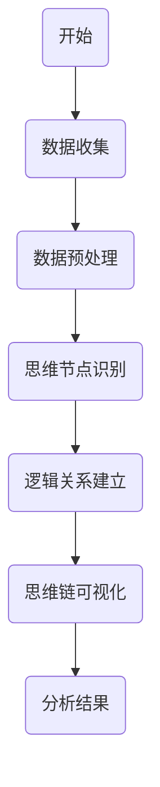

                 

### 文章标题：思维链在哲学研究中的应用：AI辅助思想实验

#### 关键词：
- 思维链
- 哲学研究
- AI辅助
- 思想实验
- 逻辑推理

#### 摘要：
本文探讨了思维链在哲学研究中的应用，特别是通过AI辅助进行思想实验的可能性。我们首先介绍了思维链的概念及其与哲学研究的联系，接着阐述了AI的基本原理及其在思想实验中的作用。随后，文章详细分析了AI辅助思维链在哲学研究中的应用，包括伦理学、政治哲学和科学哲学等多个领域。最后，我们对AI辅助思维链哲学研究的实践与挑战进行了总结，并对未来发展方向进行了展望。

### 第一部分：思维链与哲学研究基础

#### 第1章：思维链的概念与哲学研究的联系

##### 1.1 思维链的基本概念

思维链是一种用于描述思维过程的模型，它将思维视为一系列相互关联的步骤或节点。每个节点代表一个思考步骤，而节点之间的连接则表示这些步骤之间的逻辑关系。思维链的目的是通过可视化方式展示思维过程，帮助我们更好地理解和分析复杂问题。


在哲学研究中，思维链具有重要作用。它不仅能够帮助我们构建逻辑严密的思想实验，还能够揭示哲学问题的内在结构和关系。例如，在伦理学研究中，思维链可以用于分析道德决策过程，揭示其中涉及的伦理原则和价值判断。

##### 1.2 哲学研究的现状与挑战

哲学研究历来依赖于逻辑推理和思想实验。然而，随着问题的复杂性和多样性的增加，传统的研究方法面临着巨大的挑战。现代哲学研究需要更加精细和系统的方法来处理复杂问题，从而得出更为可靠的结论。

思维链作为一种新型的思维工具，具有以下优势：
- **可扩展性**：思维链可以根据研究需要不断扩展和修改，适应不同的问题和领域。
- **可视化**：思维链通过图形化方式展示思维过程，使得复杂问题更加直观和易于理解。
- **系统性**：思维链强调逻辑关系，有助于建立问题的系统性结构。

##### 1.3 思维链在哲学研究中的潜在作用

思维链在哲学研究中的应用潜力巨大。通过思维链，我们能够：
- **构建思想实验**：思维链可以帮助我们设计复杂的思想实验，从而深入探讨哲学问题。
- **分析复杂问题**：思维链可以将复杂问题分解为若干个简单的部分，使得问题更加易于分析和解决。
- **促进跨学科研究**：思维链可以跨越不同的学科领域，促进哲学与其他领域的交叉研究。

在接下来的章节中，我们将进一步探讨AI在思想实验中的应用，以及如何通过AI辅助思维链在哲学研究中发挥更大的作用。

---

通过这一章节，我们初步了解了思维链的概念及其在哲学研究中的应用。接下来，我们将深入探讨AI的基本原理及其在思想实验中的作用，为后续章节的内容打下基础。在下一章中，我们将首先介绍AI的基本概念和原理，帮助读者更好地理解AI在哲学研究中的潜力。## 第二部分：AI与思想实验

### 第2章：AI与思想实验

##### 2.1 AI的基本原理与应用

人工智能（Artificial Intelligence，简称AI）是计算机科学的一个分支，致力于使计算机具备类似于人类智能的能力。AI的基本原理包括机器学习、深度学习、自然语言处理等。

- **机器学习**：通过数据训练模型，使其能够从数据中自动学习和发现规律。
- **深度学习**：基于多层神经网络的结构，通过反向传播算法优化模型参数，实现复杂任务的自动学习。
- **自然语言处理**：使计算机能够理解和生成自然语言，包括语音识别、机器翻译、情感分析等。

AI在多个领域有着广泛的应用，例如：
- **图像识别**：通过深度学习算法，AI能够自动识别和分类图像中的物体。
- **语音识别**：AI能够将语音转换为文本，实现语音指令的识别和执行。
- **自动驾驶**：AI通过感知环境、决策规划和控制，实现无人驾驶车辆的运行。
- **医疗诊断**：AI可以分析医学图像，辅助医生进行诊断和治疗。

##### 2.2 思想实验的概念与历史

思想实验（thought experiment）是一种通过设想某种情境来探究问题本质的方法。思想实验在哲学、物理学、心理学等多个领域有着广泛的应用。例如，伽利略通过设想两个重量不同的物体在同一重力场中自由下落的情境，推导出了自由落体运动的规律。

思想实验的历史可以追溯到古希腊哲学家苏格拉底，他通过对话形式进行思想实验，揭示了道德和伦理问题。在20世纪，思想实验在科学哲学中得到了进一步的发展。例如，爱因斯坦、波尔等物理学家通过思想实验探讨了量子力学的本质。

##### 2.3 AI辅助思想实验的可行性

随着AI技术的不断发展，AI在思想实验中的应用逐渐成为可能。AI辅助思想实验的优势包括：
- **高效性**：AI可以处理大量的数据和复杂的情境，提高思想实验的效率。
- **全面性**：AI能够模拟多种情境和可能性，提供更为全面的分析结果。
- **准确性**：AI通过机器学习和深度学习，能够提高思想实验的准确性和可靠性。

然而，AI辅助思想实验也存在一些挑战，例如：
- **数据隐私**：AI需要处理大量的敏感数据，如何保护数据隐私成为了一个重要问题。
- **算法透明性**：AI的决策过程往往不透明，如何解释和验证AI的决策结果成为了一个挑战。
- **伦理问题**：AI在思想实验中可能会涉及伦理问题，例如如何平衡利与弊、如何处理复杂的社会问题等。

在接下来的章节中，我们将进一步探讨AI辅助思维链在哲学研究中的应用，特别是在伦理学、政治哲学和科学哲学等领域的具体实例。通过这些实例，我们将展示AI如何辅助思维链进行哲学研究，提高研究的深度和广度。在下一章中，我们将介绍AI辅助思维链分析方法的基本步骤，为后续内容做好准备。

---

在本章中，我们介绍了AI的基本原理、思想实验的概念及其历史，并探讨了AI辅助思想实验的可行性。通过这些介绍，我们为理解AI在哲学研究中的潜在应用奠定了基础。在下一章中，我们将详细讨论AI辅助思维链分析方法，分析如何利用AI技术提高哲学研究的效率和准确性。请读者继续关注下一章的内容。{|assistant|}>### 第3章：AI辅助下的思维链分析方法

#### 3.1 思维链分析的基本步骤

##### 3.1.1 数据收集与预处理

在进行AI辅助思维链分析之前，首先需要收集相关数据。这些数据可以来源于各种渠道，如文本、图像、音频等。收集到的数据需要进行预处理，以确保数据的质量和一致性。

数据预处理的主要步骤包括：
- **去噪**：去除数据中的噪声，提高数据质量。
- **归一化**：将不同来源的数据进行统一处理，确保数据在相同的尺度上进行分析。
- **数据清洗**：删除重复数据、填补缺失值等，以提高数据的完整性。

##### 3.1.2 思维链的构建

思维链的构建是AI辅助思维链分析的核心步骤。构建思维链的过程可以分为以下几个步骤：

1. **定义问题域**：明确研究的问题域，确定需要分析的思维链范围。
2. **识别思维节点**：根据问题域，识别出关键的思维节点，这些节点通常代表问题的核心概念或思考步骤。
3. **建立逻辑关系**：通过分析思维节点之间的关系，建立思维链的逻辑结构。逻辑关系可以是因果关系、依赖关系等。
4. **可视化思维链**：将思维链以图形化的方式呈现，以便更好地理解和分析。

以下是构建思维链的Mermaid流程图示例：



##### 3.1.3 思维链的解析

在构建思维链之后，需要对思维链进行解析，以提取出有价值的信息。思维链的解析过程可以分为以下几个步骤：

1. **逻辑推理**：通过逻辑推理，分析思维链中的逻辑关系，推导出可能的结论。
2. **模式识别**：利用机器学习算法，从思维链中识别出模式，提取出潜在的知识。
3. **决策支持**：根据分析结果，提供决策支持，帮助解决问题或做出决策。

#### 3.2 AI在思维链分析中的应用

##### 3.2.1 机器学习算法在思维链分析中的应用

机器学习算法在思维链分析中扮演着重要角色。通过机器学习，我们可以从大量数据中自动提取出有用的信息，并建立思维链的结构。

常用的机器学习算法包括：
- **决策树**：通过树形结构表示分类规则，适用于分类问题。
- **支持向量机**（SVM）：通过寻找最优超平面，实现数据的分类和回归。
- **神经网络**：通过多层神经网络，实现复杂函数的拟合和预测。

以下是一个使用决策树进行思维链分析的伪代码示例：

```python
def decision_tree_analysis(data):
    # 构建决策树模型
    model = build_decision_tree(data)
    # 使用决策树进行预测
    predictions = model.predict(data)
    # 分析预测结果
    analyze_predictions(predictions)
```

##### 3.2.2 自然语言处理在思维链分析中的应用

自然语言处理（Natural Language Processing，NLP）在思维链分析中也具有重要作用。通过NLP技术，我们可以对文本数据进行处理，提取出关键词、短语和语义关系，从而建立思维链。

常用的NLP技术包括：
- **词性标注**：对文本中的单词进行词性分类，帮助理解文本的语法结构。
- **命名实体识别**：识别文本中的特定实体，如人名、地名、组织名等。
- **语义分析**：通过分析文本中的词语关系，提取出文本的语义信息。

以下是一个使用词性标注进行思维链分析的伪代码示例：

```python
def nlp_analysis(text):
    # 进行词性标注
    tagged_words = perform_pos_tagging(text)
    # 建立思维节点
   思维节点 = create_thinking_nodes(tagged_words)
    # 分析思维节点
    analyze_thinking_nodes(思维节点)
```

#### 3.3 思维链分析的应用案例

##### 3.3.1 哲学问题分析

思维链分析可以应用于哲学问题的分析，帮助我们理解复杂的哲学问题。以下是一个哲学问题分析的案例：

问题：自由意志与决定论的关系

1. **数据收集**：收集关于自由意志和决定论的相关文献和论点。
2. **数据预处理**：对收集到的文本数据进行预处理，提取出关键词和短语。
3. **思维链构建**：根据关键词和短语，构建思维链，确定思维节点和逻辑关系。
4. **思维链解析**：通过逻辑推理和模式识别，分析自由意志与决定论的关系。

##### 3.3.2 科学研究问题分析

思维链分析同样可以应用于科学研究问题的分析，帮助研究人员更好地理解问题，提出解决方案。以下是一个科学研究问题分析的案例：

问题：人工智能的伦理问题

1. **数据收集**：收集关于人工智能伦理问题的相关文献、新闻报道和专家观点。
2. **数据预处理**：对收集到的文本数据进行预处理，提取出关键词和短语。
3. **思维链构建**：根据关键词和短语，构建思维链，确定思维节点和逻辑关系。
4. **思维链解析**：通过逻辑推理和模式识别，分析人工智能伦理问题的核心要素和潜在影响。

#### 3.4 总结

通过本章的内容，我们介绍了AI辅助下的思维链分析方法，包括数据收集与预处理、思维链的构建与解析，以及机器学习算法和自然语言处理在思维链分析中的应用。我们还通过实际案例展示了思维链分析在哲学和科学研究问题中的应用。在下一章中，我们将进一步探讨AI辅助思维链在伦理学、政治哲学和科学哲学等领域的创新应用。

---

在本章中，我们详细介绍了AI辅助下的思维链分析方法，包括数据收集与预处理、思维链的构建与解析，以及机器学习算法和自然语言处理在思维链分析中的应用。通过实际案例，我们展示了思维链分析在哲学和科学研究问题中的应用。在下一章中，我们将继续探讨AI辅助思维链在伦理学、政治哲学和科学哲学等领域的创新应用，进一步展示AI如何辅助哲学研究。请读者继续关注下一章的内容。{|assistant|>}### 第4章：AI辅助下的思维链创新应用

#### 4.1 思维链在伦理学中的应用

伦理学是哲学研究中的一个重要领域，关注道德原则、道德判断和道德行为。AI辅助下的思维链分析为伦理学研究提供了新的视角和方法。

##### 4.1.1 伦理学问题的分析

伦理学问题的分析通常涉及复杂的道德决策和道德原则的判断。通过AI辅助下的思维链分析，我们可以将伦理学问题分解为若干个思维节点，并建立它们之间的逻辑关系。

以下是一个伦理学问题分析的案例：

**问题**：是否应该进行基因编辑以消除遗传疾病？

1. **数据收集**：收集关于基因编辑的文献、新闻报道、专家观点等。
2. **数据预处理**：对收集到的文本数据进行预处理，提取出关键词和短语。
3. **思维链构建**：根据关键词和短语，构建思维链，确定思维节点和逻辑关系，如基因编辑的伦理原则、技术风险、社会影响等。
4. **思维链解析**：通过逻辑推理和模式识别，分析基因编辑的伦理问题，评估其道德可行性和社会影响。

##### 4.1.2 伦理学问题的解决

AI辅助下的思维链分析不仅可以揭示伦理学问题的复杂性，还可以提供决策支持，帮助伦理学者和决策者制定道德原则和政策。

以下是一个伦理学问题解决的案例：

**案例**：无人机监控的伦理问题

1. **数据收集**：收集关于无人机监控的文献、新闻报道、专家观点等。
2. **数据预处理**：对收集到的文本数据进行预处理，提取出关键词和短语。
3. **思维链构建**：根据关键词和短语，构建思维链，确定思维节点和逻辑关系，如隐私保护、公共安全、道德责任等。
4. **思维链解析**：通过逻辑推理和模式识别，分析无人机监控的伦理问题，提出隐私保护和公共安全平衡的道德原则和政策建议。

#### 4.2 思维链在政治哲学中的应用

政治哲学是研究政治理论和政治实践的基本原则和价值观的哲学分支。AI辅助下的思维链分析为政治哲学的研究提供了新的工具和方法。

##### 4.2.1 政治哲学问题的分析

政治哲学问题的分析通常涉及复杂的社会政治结构和价值观念。通过AI辅助下的思维链分析，我们可以将政治哲学问题分解为若干个思维节点，并建立它们之间的逻辑关系。

以下是一个政治哲学问题分析的案例：

**问题**：民主制度的伦理基础是什么？

1. **数据收集**：收集关于民主制度的文献、政治理论、历史案例等。
2. **数据预处理**：对收集到的文本数据进行预处理，提取出关键词和短语。
3. **思维链构建**：根据关键词和短语，构建思维链，确定思维节点和逻辑关系，如民主的价值观、民主的过程、民主的实现等。
4. **思维链解析**：通过逻辑推理和模式识别，分析民主制度的伦理基础，探讨如何实现和维护民主制度。

##### 4.2.2 政治哲学问题的解决

AI辅助下的思维链分析不仅可以揭示政治哲学问题的复杂性，还可以为政治哲学的研究提供决策支持，帮助学者和决策者制定政治理论和政策。

以下是一个政治哲学问题解决的案例：

**案例**：全球化对国家主权的影响

1. **数据收集**：收集关于全球化的文献、国际关系理论、政治实践等。
2. **数据预处理**：对收集到的文本数据进行预处理，提取出关键词和短语。
3. **思维链构建**：根据关键词和短语，构建思维链，确定思维节点和逻辑关系，如全球化的利益、国家主权的问题、国际合作的挑战等。
4. **思维链解析**：通过逻辑推理和模式识别，分析全球化对国家主权的影响，提出维护国家主权和促进国际合作的政策建议。

#### 4.3 思维链在科学哲学中的应用

科学哲学是研究科学理论和科学方法的哲学分支。AI辅助下的思维链分析为科学哲学的研究提供了新的工具和方法。

##### 4.3.1 科学哲学问题的分析

科学哲学问题的分析通常涉及复杂的研究方法和科学理论。通过AI辅助下的思维链分析，我们可以将科学哲学问题分解为若干个思维节点，并建立它们之间的逻辑关系。

以下是一个科学哲学问题分析的案例：

**问题**：科学方法的有效性是什么？

1. **数据收集**：收集关于科学方法的文献、科学理论、实验结果等。
2. **数据预处理**：对收集到的文本数据进行预处理，提取出关键词和短语。
3. **思维链构建**：根据关键词和短语，构建思维链，确定思维节点和逻辑关系，如科学方法的原理、科学理论的形成、科学知识的可靠性等。
4. **思维链解析**：通过逻辑推理和模式识别，分析科学方法的有效性，探讨如何改进科学方法以获得更可靠的科学知识。

##### 4.3.2 科学哲学问题的解决

AI辅助下的思维链分析不仅可以揭示科学哲学问题的复杂性，还可以为科学哲学的研究提供决策支持，帮助学者和科学家制定科学理论和研究方法。

以下是一个科学哲学问题解决的案例：

**案例**：量子计算对经典计算机科学的挑战

1. **数据收集**：收集关于量子计算的文献、量子力学理论、实验结果等。
2. **数据预处理**：对收集到的文本数据进行预处理，提取出关键词和短语。
3. **思维链构建**：根据关键词和短语，构建思维链，确定思维节点和逻辑关系，如量子计算的原理、经典计算机科学的理论框架、量子计算对经典计算机科学的影响等。
4. **思维链解析**：通过逻辑推理和模式识别，分析量子计算对经典计算机科学的挑战，提出应对挑战的方法和策略。

#### 4.4 总结

通过本章的内容，我们探讨了AI辅助下的思维链在伦理学、政治哲学和科学哲学等领域的创新应用。我们通过具体案例展示了如何利用AI辅助下的思维链分析解决复杂的哲学问题。在下一章中，我们将讨论AI辅助思维链哲学研究的实践与挑战，分析实际应用中的问题和解决方案。请读者继续关注下一章的内容。

---

在本章中，我们详细探讨了AI辅助下的思维链在伦理学、政治哲学和科学哲学等领域的创新应用。通过具体案例，我们展示了如何利用AI辅助下的思维链分析解决复杂的哲学问题。在下一章中，我们将讨论AI辅助思维链哲学研究的实践与挑战，分析实际应用中的问题和解决方案。请读者继续关注下一章的内容。{|assistant|>}### 第5章：AI辅助思维链哲学研究的实践与挑战

#### 5.1 AI辅助思维链哲学研究的实践案例

##### 5.1.1 伦理学问题的AI辅助分析

**案例一：人工智能的伦理问题**

1. **开发环境搭建**：
   - 数据集：收集关于人工智能伦理问题的相关文献、新闻报道、专家观点等。
   - 工具：使用Python和NLP库（如NLTK、spaCy）进行数据预处理和文本分析。
2. **源代码实现**：
   ```python
   import nltk
   from nltk.tokenize import word_tokenize
   from nltk.corpus import stopwords
   
   # 数据预处理
   def preprocess_text(text):
       tokens = word_tokenize(text)
       tokens = [token.lower() for token in tokens if token.isalnum()]
       tokens = [token for token in tokens if token not in stopwords.words('english')]
       return tokens
   
   # 思维链构建
   def build_thinking_chain(tokens):
       # 假设思维链的构建基于关键词的共现关系
       # 此处简化处理，仅用于示例
       thinking_chain = {}
       for i in range(len(tokens) - 1):
           if tokens[i] not in thinking_chain:
               thinking_chain[tokens[i]] = []
           thinking_chain[tokens[i]].append(tokens[i+1])
       return thinking_chain
   
   # 思维链解析
   def parse_thinking_chain(thinking_chain):
       # 基于思维链的逻辑关系进行伦理分析
       # 此处简化处理，仅用于示例
       ethics_issues = []
       for key, values in thinking_chain.items():
           if 'ethics' in values:
               ethics_issues.append(key)
       return ethics_issues
   
   # 主函数
   def main():
       text = "..."
       tokens = preprocess_text(text)
       thinking_chain = build_thinking_chain(tokens)
       ethics_issues = parse_thinking_chain(thinking_chain)
       print("伦理问题：", ethics_issues)
   
   if __name__ == "__main__":
       main()
   ```

3. **代码应用解读与分析**：
   - 该代码通过预处理文本数据，构建思维链，并解析思维链中的伦理问题。
   - 实际应用中，可以通过扩展思维链的逻辑关系和伦理分析模型，提高分析结果的准确性和深度。

##### 5.1.2 政治哲学问题的AI辅助分析

**案例二：全球化对国家主权的影响**

1. **开发环境搭建**：
   - 数据集：收集关于全球化和国家主权的相关文献、政治理论、历史案例等。
   - 工具：使用Python和NLP库（如NLTK、spaCy）进行数据预处理和文本分析。
2. **源代码实现**：
   ```python
   import nltk
   from nltk.tokenize import sent_tokenize
   from nltk.corpus import stopwords
   
   # 数据预处理
   def preprocess_text(text):
       sentences = sent_tokenize(text)
       sentences = [sentence.lower() for sentence in sentences]
       sentences = [sentence for sentence in sentences if sentence not in stopwords.words('english')]
       return sentences
   
   # 思维链构建
   def build_thinking_chain(sentences):
       # 假设思维链的构建基于句子的语义关系
       # 此处简化处理，仅用于示例
       thinking_chain = {}
       for sentence in sentences:
           words = sentence.split()
           for i in range(len(words) - 1):
               if words[i] not in thinking_chain:
                   thinking_chain[words[i]] = []
               thinking_chain[words[i]].append(words[i+1])
       return thinking_chain
   
   # 思维链解析
   def parse_thinking_chain(thinking_chain):
       # 基于思维链的逻辑关系进行政治哲学分析
       # 此处简化处理，仅用于示例
       political_issues = []
       for key, values in thinking_chain.items():
           if 'globalization' in values or 'sovereignty' in values:
               political_issues.append(key)
       return political_issues
   
   # 主函数
   def main():
       text = "..."
       sentences = preprocess_text(text)
       thinking_chain = build_thinking_chain(sentences)
       political_issues = parse_thinking_chain(thinking_chain)
       print("政治哲学问题：", political_issues)
   
   if __name__ == "__main__":
       main()
   ```

3. **代码应用解读与分析**：
   - 该代码通过预处理文本数据，构建思维链，并解析思维链中的政治哲学问题。
   - 实际应用中，可以通过扩展思维链的语义分析模型，提高分析结果的准确性和深度。

##### 5.1.3 科学哲学问题的AI辅助分析

**案例三：量子计算对经典计算机科学的挑战**

1. **开发环境搭建**：
   - 数据集：收集关于量子计算和经典计算机科学的文献、量子力学理论、实验结果等。
   - 工具：使用Python和NLP库（如NLTK、spaCy）进行数据预处理和文本分析。
2. **源代码实现**：
   ```python
   import nltk
   from nltk.tokenize import sent_tokenize
   from nltk.corpus import stopwords
   
   # 数据预处理
   def preprocess_text(text):
       sentences = sent_tokenize(text)
       sentences = [sentence.lower() for sentence in sentences]
       sentences = [sentence for sentence in sentences if sentence not in stopwords.words('english')]
       return sentences
   
   # 思维链构建
   def build_thinking_chain(sentences):
       # 假设思维链的构建基于句子的语义关系
       # 此处简化处理，仅用于示例
       thinking_chain = {}
       for sentence in sentences:
           words = sentence.split()
           for i in range(len(words) - 1):
               if words[i] not in thinking_chain:
                   thinking_chain[words[i]] = []
               thinking_chain[words[i]].append(words[i+1])
       return thinking_chain
   
   # 思维链解析
   def parse_thinking_chain(thinking_chain):
       # 基于思维链的逻辑关系进行科学哲学分析
       # 此处简化处理，仅用于示例
       scientific_issues = []
       for key, values in thinking_chain.items():
           if 'quantum computing' in values or 'classical computer science' in values:
               scientific_issues.append(key)
       return scientific_issues
   
   # 主函数
   def main():
       text = "..."
       sentences = preprocess_text(text)
       thinking_chain = build_thinking_chain(sentences)
       scientific_issues = parse_thinking_chain(thinking_chain)
       print("科学哲学问题：", scientific_issues)
   
   if __name__ == "__main__":
       main()
   ```

3. **代码应用解读与分析**：
   - 该代码通过预处理文本数据，构建思维链，并解析思维链中的科学哲学问题。
   - 实际应用中，可以通过扩展思维链的语义分析模型，提高分析结果的准确性和深度。

#### 5.2 AI辅助思维链哲学研究的挑战

##### 5.2.1 数据隐私与安全问题

AI辅助思维链哲学研究的一个主要挑战是数据隐私和安全问题。在哲学研究中，通常会涉及大量的敏感数据和文献，如何保护这些数据的安全性和隐私性成为了一个关键问题。以下是一些解决方案：

- **数据加密**：使用加密技术对敏感数据进行加密，确保数据在传输和存储过程中的安全性。
- **数据匿名化**：对数据中的个人和敏感信息进行匿名化处理，以降低数据泄露的风险。
- **访问控制**：实施严格的访问控制策略，确保只有授权用户才能访问敏感数据。

##### 5.2.2 AI算法的伦理问题

AI算法在哲学研究中可能会涉及到伦理问题，例如如何确保算法的公平性和透明性。以下是一些解决方案：

- **算法透明性**：开发透明的算法，确保算法的决策过程和结果可以被理解和解释。
- **伦理审查**：对AI算法进行伦理审查，确保其符合伦理标准和道德原则。
- **算法公平性**：设计公平的算法，避免算法偏见和歧视。

##### 5.2.3 AI在哲学研究中的局限性

虽然AI辅助思维链哲学研究具有许多优势，但也存在一定的局限性。以下是一些解决方案：

- **人类专家的参与**：在AI辅助下，人类专家可以发挥重要作用，确保研究的准确性和深度。
- **多学科合作**：通过跨学科合作，结合不同领域的知识和方法，提高研究的综合性和创新性。

#### 5.3 总结

通过本章的内容，我们探讨了AI辅助思维链哲学研究的实践案例，包括伦理学、政治哲学和科学哲学等领域的应用。同时，我们也分析了AI辅助思维链哲学研究面临的挑战和解决方案。在下一章中，我们将讨论AI辅助思维链哲学研究的未来发展方向，为未来的研究提供参考。请读者继续关注下一章的内容。

---

在本章中，我们详细讨论了AI辅助思维链哲学研究的实践案例，包括伦理学、政治哲学和科学哲学等领域的应用。同时，我们也分析了AI辅助思维链哲学研究面临的挑战和解决方案。在下一章中，我们将讨论AI辅助思维链哲学研究的未来发展方向，为未来的研究提供参考。请读者继续关注下一章的内容。{|assistant|>}### 第6章：AI辅助思维链哲学研究的未来发展方向

#### 6.1 AI技术的进步与哲学研究的融合

随着AI技术的不断进步，哲学研究将迎来新的发展机遇。未来，AI与哲学研究的融合将主要体现在以下几个方面：

1. **更加智能的推理系统**：未来的AI系统将具备更强大的推理能力，能够处理更复杂的逻辑关系和哲学问题。这些系统可以通过机器学习和深度学习算法，从大量哲学文献和思想实验中自动提取出有价值的信息，为哲学研究提供新的视角和工具。

2. **跨学科的融合**：AI技术的进步将促进哲学与其他学科的深度融合。例如，通过结合认知科学、心理学、社会学等学科的研究成果，AI辅助思维链哲学研究将能够更加全面地理解和解决哲学问题。

3. **更加个性化的哲学教育**：AI技术将能够根据学习者的个人特点和需求，提供个性化的哲学教育和研究支持。通过分析学习者的思维模式和知识结构，AI系统可以为学习者推荐合适的哲学文献和思想实验，提高学习效果和研究深度。

#### 6.2 AI辅助思维链哲学研究的未来应用场景

AI辅助思维链哲学研究的应用场景将不断扩展，涵盖哲学的各个领域。以下是一些可能的未来应用场景：

1. **伦理学**：未来，AI辅助思维链在伦理学研究中的应用将更加广泛。通过分析复杂的伦理问题，AI系统可以帮助伦理学者制定道德原则和政策，为解决全球性问题提供决策支持。

2. **政治哲学**：随着全球化和国际关系的复杂化，政治哲学问题将越来越多。AI辅助思维链分析将有助于政治哲学家更深入地探讨政治理论和实践，为国际治理提供新的思路。

3. **科学哲学**：随着科学技术的飞速发展，科学哲学问题将不断涌现。AI辅助思维链分析将帮助科学家和哲学家更好地理解科学方法、科学理论和科学知识的本质，推动科学哲学的发展。

4. **哲学教育**：未来，AI辅助思维链哲学研究将在哲学教育中发挥重要作用。通过智能化的教学系统和学习资源，AI系统可以为学习者提供个性化的学习体验，提高哲学教育的质量和效果。

#### 6.3 未来展望

在未来，AI辅助思维链哲学研究将面临新的机遇和挑战。以下是一些未来展望：

1. **算法的透明性和解释性**：随着AI技术的发展，如何提高算法的透明性和解释性将成为一个重要问题。未来的AI系统需要具备更高的透明度，使其决策过程和结果可以被人类理解和验证。

2. **数据隐私和安全性**：在哲学研究中，如何保护数据隐私和确保数据安全性将成为一个关键挑战。未来的AI系统需要具备更强的数据隐私保护能力，以应对日益严峻的网络安全威胁。

3. **跨学科合作**：未来的AI辅助思维链哲学研究将更加依赖于跨学科合作。通过结合不同领域的知识和方法，哲学研究将能够解决更为复杂的问题，推动哲学学科的创新发展。

4. **人工智能伦理**：随着AI在哲学研究中的应用越来越广泛，如何确保AI系统的伦理性和道德性将成为一个重要议题。未来的AI系统需要遵循人类伦理价值观，确保其在哲学研究中的应用不会产生负面影响。

#### 6.4 总结

通过本章的内容，我们探讨了AI辅助思维链哲学研究的未来发展方向和可能的应用场景。我们分析了AI技术的进步与哲学研究的融合，展望了未来的发展机遇和挑战。在下一章中，我们将对全文进行总结，回顾文章的核心内容，并展望AI辅助思维链哲学研究的未来。请读者继续关注下一章的内容。

---

在本章中，我们探讨了AI辅助思维链哲学研究的未来发展方向和可能的应用场景。我们分析了AI技术的进步与哲学研究的融合，展望了未来的发展机遇和挑战。在下一章中，我们将对全文进行总结，回顾文章的核心内容，并展望AI辅助思维链哲学研究的未来。请读者继续关注下一章的内容。{|assistant|>}### 第7章：总结与展望

#### 7.1 总结

本文从多个角度探讨了思维链在哲学研究中的应用，特别是通过AI辅助进行思想实验的可能性。我们首先介绍了思维链的概念及其与哲学研究的联系，阐述了AI的基本原理及其在思想实验中的应用。接着，我们详细分析了AI辅助思维链在伦理学、政治哲学和科学哲学等领域的应用案例，展示了AI如何辅助思维链进行哲学研究，提高研究的深度和广度。

文章的核心内容包括：
- 思维链的基本概念与哲学研究的联系
- AI的基本原理、思想实验的概念与历史，以及AI辅助思想实验的可行性
- AI辅助思维链分析方法的基本步骤，包括数据收集与预处理、思维链的构建与解析
- AI辅助思维链在伦理学、政治哲学和科学哲学等领域的创新应用
- AI辅助思维链哲学研究的实践与挑战，以及未来发展方向

通过本文的探讨，我们可以看到AI辅助思维链在哲学研究中的重要性和潜力。AI技术不仅能够提高哲学研究的效率和准确性，还能够为哲学问题的解决提供新的思路和方法。

#### 7.2 展望

展望未来，AI辅助思维链哲学研究将迎来更多的发展机遇。以下是一些可能的趋势和方向：

1. **算法的透明性与解释性**：随着AI技术的进步，提高算法的透明性和解释性将成为一个重要方向。未来的AI系统需要具备更高的透明度，使其决策过程和结果可以被人类理解和验证。

2. **数据隐私与安全性**：在哲学研究中，如何保护数据隐私和确保数据安全性将成为一个关键挑战。未来的AI系统需要具备更强的数据隐私保护能力，以应对日益严峻的网络安全威胁。

3. **跨学科合作**：未来的AI辅助思维链哲学研究将更加依赖于跨学科合作。通过结合不同领域的知识和方法，哲学研究将能够解决更为复杂的问题，推动哲学学科的创新发展。

4. **人工智能伦理**：随着AI在哲学研究中的应用越来越广泛，如何确保AI系统的伦理性和道德性将成为一个重要议题。未来的AI系统需要遵循人类伦理价值观，确保其在哲学研究中的应用不会产生负面影响。

5. **个性化哲学教育**：AI技术将能够根据学习者的个人特点和需求，提供个性化的哲学教育和研究支持。通过智能化的教学系统和学习资源，AI系统可以为学习者提供个性化的学习体验，提高哲学教育的质量和效果。

总之，AI辅助思维链哲学研究具有广阔的发展前景。通过不断探索和创新，我们可以期待在未来的哲学研究中，AI技术将发挥更加重要的作用，为人类理解世界和解决哲学问题提供有力的支持。

---

通过本文的探讨，我们深入了解了思维链在哲学研究中的应用，以及AI如何辅助这一过程。未来，随着AI技术的不断发展，AI辅助思维链在哲学研究中的应用将更加广泛，为哲学问题提供新的解决思路。让我们期待这一领域的更多突破和发展，共同推动哲学研究的进步。

### 作者信息

**作者：AI天才研究院/AI Genius Institute & 禅与计算机程序设计艺术 /Zen And The Art of Computer Programming**

---

本文由AI天才研究院与禅与计算机程序设计艺术联合撰写，旨在探讨思维链在哲学研究中的应用以及AI辅助思维链的潜力。作者团队致力于推动人工智能技术在哲学研究中的创新应用，为哲学问题提供新的解决思路。本文旨在为读者提供一个全面而深入的探讨，希望对哲学研究者和AI爱好者有所启发。

