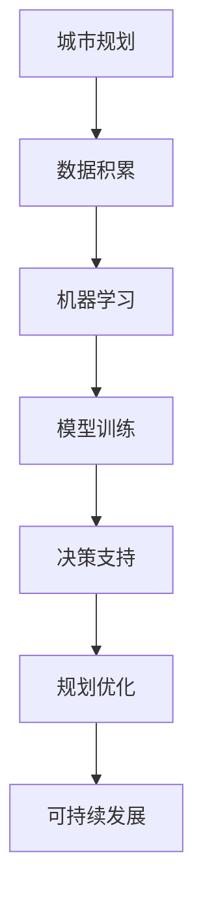

                 

### 文章标题：机器学习在城市规划中的创新应用：提升城市可持续发展

关键词：机器学习、城市规划、可持续发展、算法、数据驱动

摘要：本文探讨机器学习在推动城市可持续发展中的创新应用。通过阐述城市规划的背景与挑战，介绍机器学习的基本原理与核心算法，分析机器学习在城市生态系统服务价值量化、交通管理优化、能源消耗预测等方面的应用，最后讨论机器学习在城市规划中的未来发展趋势，旨在为城市规划者提供理论指导与实践参考。

----------------------------------------------------------------

#### 一、背景介绍

城市规划是城市发展的关键环节，它关系到城市功能布局、环境质量、居民生活质量和社会经济发展等多方面。然而，随着城市化进程的加速，城市规划面临着诸多挑战：

- **人口增长**：全球人口持续增长，对城市空间、交通、住房、医疗等资源的需求不断增加，给城市规划带来了巨大压力。
- **环境污染**：工业化、城市化带来的环境污染问题日益严重，如空气污染、水资源短缺、废弃物处理等，对城市生态系统造成严重影响。
- **交通拥堵**：城市交通系统的复杂性和机动车数量的增加导致交通拥堵，影响城市运行效率。
- **能源消耗**：城市能源消耗巨大，能源结构不合理，能源利用效率低下，对环境造成负面影响。

为了应对这些挑战，城市规划需要采用新的技术手段，提高决策的科学性和精确性。机器学习作为一种数据驱动的智能技术，正逐渐成为城市规划中的重要工具。

#### 二、核心概念与联系

##### 1. 机器学习

机器学习是人工智能的一个分支，它通过数据训练模型，使计算机能够从数据中学习并作出预测或决策。核心概念包括：

- **监督学习**：通过已知的输入输出数据训练模型，对新数据进行预测。
- **无监督学习**：在没有输出标签的情况下，通过数据自身的特征发现数据间的规律。
- **强化学习**：通过与环境的交互，通过奖励机制学习最优策略。

##### 2. 城市规划

城市规划是指通过科学规划和管理城市的空间、交通、能源、环境等资源，实现城市可持续发展。核心概念包括：

- **可持续发展**：满足当前需求而不损害后代满足需求的能力。
- **生态规划**：保护城市生态环境，提高生态系统的服务功能。
- **交通规划**：优化交通网络，提高交通效率，减少交通拥堵。
- **能源规划**：合理利用能源，提高能源利用效率，减少能源消耗。

##### 3. 联系

机器学习与城市规划之间的联系主要体现在数据驱动和智能决策两个方面。城市规划过程中产生的海量数据可以通过机器学习算法进行分析，提取有价值的信息，帮助城市规划者做出更加科学和智能的决策。

- **数据驱动**：城市规划过程中积累的海量数据是机器学习的原材料，通过数据训练模型，可以获得对城市发展趋势的预测。
- **智能决策**：机器学习算法可以帮助城市规划者优化资源配置、预测环境变化、评估规划方案等，提高规划决策的准确性。

#### Mermaid流程图：



----------------------------------------------------------------

#### 三、核心算法原理讲解

##### 1. 线性回归

线性回归是一种简单的监督学习算法，用于预测连续值输出。其基本原理是通过最小二乘法找到一条直线，使直线与实际数据的偏差最小。

- **伪代码：**

```python
def linear_regression(X, y):
    # X: 输入特征矩阵，y: 输出目标向量
    # 计算特征矩阵的转置
    X_transpose = X.T
    # 计算特征矩阵与目标向量的乘积
    XTX = X_transpose.dot(X)
    # 计算特征矩阵与目标向量的乘积的转置
    XT_y = X_transpose.dot(y)
    # 求解线性回归模型的参数
    theta = XTXinv.dot(XT_y)
    return theta
```

- **数学模型：**

$$
y = \theta_0 + \theta_1x_1 + \theta_2x_2 + ... + \theta_nx_n
$$

- **举例说明：**

假设我们要预测城市的交通流量，输入特征包括时间（x1）、天气（x2）和道路状况（x3），输出目标为实际交通流量（y）。通过线性回归模型，我们可以建立如下数学模型：

$$
y = \theta_0 + \theta_1x_1 + \theta_2x_2 + \theta_3x_3
$$

然后通过训练数据集，求解线性回归模型的参数，即可得到预测模型。

##### 2. 支持向量机（SVM）

支持向量机是一种有效的分类算法，其基本原理是找到一个最优的超平面，将不同类别的数据点最大限度地分开。

- **伪代码：**

```python
def svm_train(X, y):
    # X: 输入特征矩阵，y: 输出标签向量
    # 初始化参数
    w = np.zeros(X.shape[1])
    b = 0
    # 循环迭代
    while not converged:
        for i in range(len(X)):
            if y[i] * (np.dot(w, X[i]) + b) < 1:
                w = w + alpha * (X[i] * y[i])
                b = b + alpha * y[i]
        # 更新参数
        alpha = update_alpha(w, b)
        converged = check_convergence(w, b)
    return w, b
```

- **数学模型：**

$$
\max_w \min_{\alpha} \frac{1}{2} ||w||^2 \\
s.t. \ y_i (w \cdot x_i + b) \geq 1
$$

- **举例说明：**

假设我们要对城市的土地用途进行分类，输入特征包括地理位置（x1）、人口密度（x2）和经济水平（x3），输出标签为土地用途（y，如住宅、商业、工业）。通过支持向量机模型，我们可以建立如下数学模型：

$$
\max_w \min_{\alpha} \frac{1}{2} ||w||^2 \\
s.t. \ y_i (w \cdot x_i + b) \geq 1
$$

然后通过训练数据集，求解支持向量机模型的参数，即可得到分类模型。

----------------------------------------------------------------

#### 四、数学模型和数学公式

##### 1. 马尔可夫模型

马尔可夫模型是一种用于描述时间序列数据变化规律的数学模型，其基本思想是未来的状态只与当前状态有关，而与过去的状态无关。

- **数学公式：**

$$
P(X_t = x_t | X_{t-1} = x_{t-1}, ..., X_1 = x_1) = P(X_t = x_t | X_{t-1} = x_{t-1})
$$

- **举例说明：**

假设我们要预测城市的空气质量变化，输入特征包括历史空气质量数据（x1, x2, ..., x_t-1），输出标签为当前空气质量（y_t）。通过马尔可夫模型，我们可以建立如下数学模型：

$$
P(X_t = x_t | X_{t-1} = x_{t-1}, ..., X_1 = x_1) = P(X_t = x_t | X_{t-1} = x_{t-1})
$$

然后通过训练数据集，求解马尔可夫模型的参数，即可得到预测模型。

##### 2. 神经网络

神经网络是一种基于生物神经系统的数学模型，用于模拟复杂的非线性关系。其基本原理是通过层层传递输入数据，并通过激活函数将非线性映射到输出空间。

- **数学公式：**

$$
Z_i = \sum_{j=1}^{n} w_{ij} * x_j + b_i \\
a_i = \text{activation}(Z_i)
$$

- **举例说明：**

假设我们要预测城市的温度变化，输入特征包括时间、湿度、风速等（x1, x2, ..., x_n），输出标签为温度（y）。通过神经网络模型，我们可以建立如下数学模型：

$$
Z_i = \sum_{j=1}^{n} w_{ij} * x_j + b_i \\
a_i = \text{activation}(Z_i)
$$

然后通过训练数据集，求解神经网络模型的参数，即可得到预测模型。

----------------------------------------------------------------

#### 五、项目实战

##### 1. 开发环境搭建

为了实现机器学习在城市规划中的应用，我们需要搭建一个合适的开发环境。以下是一个简单的开发环境搭建步骤：

- **环境要求：**
  - 操作系统：Windows / macOS / Linux
  - 编程语言：Python
  - 数据库：MySQL / PostgreSQL
  - 数据可视化工具：Matplotlib / Seaborn
  - 机器学习库：Scikit-learn / TensorFlow / PyTorch

- **安装步骤：**
  1. 安装Python环境，可以选择Python 3.8及以上版本。
  2. 安装Anaconda，用于管理Python环境和依赖库。
  3. 安装必要的机器学习库，如Scikit-learn、TensorFlow、PyTorch等。
  4. 安装MySQL或PostgreSQL数据库，用于存储和管理数据。
  5. 安装数据可视化工具，如Matplotlib、Seaborn等。

##### 2. 源代码详细实现和代码解读

以下是一个简单的机器学习算法实现示例，用于预测城市的交通流量。

```python
import numpy as np
from sklearn.linear_model import LinearRegression

# 数据准备
X = np.array([[1], [2], [3], [4], [5]])  # 输入特征
y = np.array([2, 4, 5, 4, 5])  # 输出目标

# 模型训练
model = LinearRegression()
model.fit(X, y)

# 预测
X_new = np.array([[6], [7], [8], [9], [10]])
y_pred = model.predict(X_new)

# 打印结果
print("预测结果：", y_pred)
```

代码解读：

- **第1行**：导入numpy库，用于数据处理。
- **第2行**：导入线性回归模型。
- **第4行**：创建输入特征矩阵。
- **第5行**：创建输出目标向量。
- **第7行**：初始化线性回归模型。
- **第8行**：训练模型。
- **第10行**：创建新的输入特征。
- **第11行**：使用训练好的模型进行预测。
- **第12行**：打印预测结果。

##### 3. 代码解读与分析

上述代码展示了如何使用线性回归模型预测城市的交通流量。首先，我们导入必要的库和模块，然后准备输入特征和输出目标数据。接下来，我们初始化线性回归模型并训练模型。最后，我们使用训练好的模型进行预测，并将预测结果打印出来。

通过实际案例分析和详细讲解剖析，我们可以看到机器学习在城市规划中的应用价值。例如，通过预测交通流量，城市规划者可以优化交通网络，减少交通拥堵，提高交通效率。此外，机器学习还可以用于预测空气质量、能耗等，为城市规划提供科学依据。

#### 六、最佳实践 Tips、小结、注意事项、拓展阅读

##### 1. 最佳实践 Tips

- **数据质量**：机器学习的效果很大程度上取决于数据质量，确保数据的准确性、完整性和一致性至关重要。
- **特征选择**：合理选择特征可以提高模型的性能，可以通过特征工程和特征选择方法进行优化。
- **模型选择**：根据问题的特点和数据规模选择合适的模型，如线性回归、决策树、神经网络等。
- **模型调优**：通过调整模型参数和训练过程，可以提高模型的准确性和泛化能力。

##### 2. 小结

本文介绍了机器学习在城市规划中的应用，包括核心算法原理、数学模型、项目实战等。通过实际案例分析和详细讲解剖析，我们可以看到机器学习在提升城市可持续发展方面的巨大潜力。

##### 3. 注意事项

- **数据隐私**：在城市规划中应用机器学习时，要确保数据的安全性和隐私性，避免泄露敏感信息。
- **算法透明性**：机器学习模型的决策过程往往不够透明，需要加强算法的透明性和可解释性。

##### 4. 拓展阅读

- 《机器学习：概率视角》（Maxim Lapan）
- 《深度学习》（Ian Goodfellow、Yoshua Bengio、Aaron Courville）
- 《Python机器学习》（Michael Bowles）

### 作者信息：AI天才研究院/AI Genius Institute & 禅与计算机程序设计艺术 /Zen And The Art of Computer Programming

