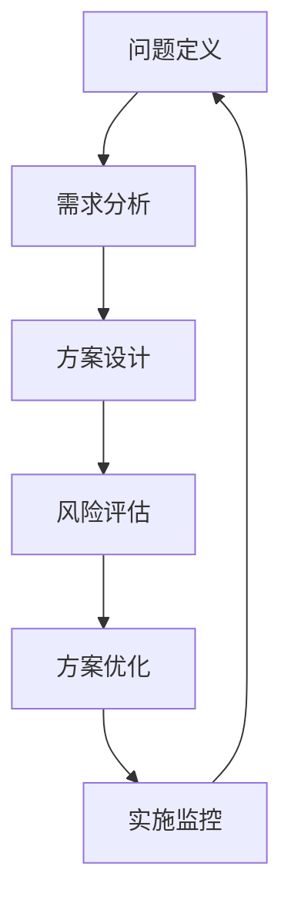

                 

## 文章标题

思维链在城市规划决策中的应用：AI辅助可持续发展策略

> 关键词：城市规划，AI辅助，可持续发展，思维链，决策分析

> 摘要：本文探讨了思维链在城市规划决策中的应用，特别是在促进可持续发展方面的作用。通过分析AI技术如何辅助城市规划，本文提出了一个基于思维链的可持续发展策略框架，并探讨了其实际应用案例。

### 提取核心概念

- **思维链**：一种逻辑连贯的思考模式，用于指导城市规划决策。
- **城市规划决策**：涉及城市空间布局、基础设施建设、生态保护等方面的决策过程。
- **AI辅助**：利用人工智能技术，为城市规划提供数据支持、预测分析和优化建议。
- **可持续发展策略**：平衡经济发展、社会进步和环境保护，实现城市长期可持续发展的战略。

### 设计1级目录

- **第1章 引言**
- **第2章 思维链概述**
- **第3章 城市规划决策基础**
- **第4章 AI辅助城市规划的技术基础**
- **第5章 案例分析：AI在具体城市规划中的应用**
- **第6章 可持续发展策略与思维链**
- **第7章 未来展望与挑战**

### 设计2级目录

- **第2章 思维链概述**
  - **2.1 核心概念与联系**
    - **2.1.1 思维链的定义**
    - **2.1.2 思维链在城市规划中的应用**
    - **2.1.3 思维链与传统规划方法的区别**
  - **2.2 思维链模型架构**
    - **2.2.1 Mermaid流程图**

- **第3章 城市规划决策基础**
  - **3.1 城市规划基本概念**
    - **3.1.1 城市规划的定义**
    - **3.1.2 城市规划的目标**
    - **3.1.3 城市规划的关键要素**
  - **3.2 城市规划决策流程**
    - **3.2.1 规划制定**
    - **3.2.2 规划评估**
    - **3.2.3 规划实施**

- **第4章 AI辅助城市规划的技术基础**
  - **4.1 AI概述**
    - **4.1.1 人工智能的定义**
    - **4.1.2 人工智能的类型**
    - **4.1.3 人工智能的发展历程**
  - **4.2 常见AI技术**
    - **4.2.1 机器学习**
    - **4.2.2 深度学习**
    - **4.2.3 数据挖掘**

- **第5章 案例分析：AI在具体城市规划中的应用**
  - **5.1 案例一：智能交通系统**
  - **5.2 案例二：智慧城市建设**
  - **5.3 案例三：生态城市规划**

- **第6章 可持续发展策略与思维链**
  - **6.1 可持续发展概念**
    - **6.1.1 可持续发展的定义**
    - **6.1.2 可持续发展目标**
    - **6.1.3 可持续发展原则**
  - **6.2 思维链在可持续发展中的应用**
    - **6.2.1 思维链在可持续发展规划中的角色**
    - **6.2.2 思维链在可持续发展评估中的应用**

- **第7章 未来展望与挑战**
  - **7.1 未来发展趋势**
  - **7.2 面临的挑战**
  - **7.3 应对策略**

### 设计3级目录

在每个2级目录下面根据内容进一步细化出3级目录，例如：

- **第4章 AI辅助城市规划的技术基础**
  - **4.1 AI概述**
    - **4.1.1 人工智能的定义**
      - **4.1.1.1 人工智能的基本原理**
      - **4.1.1.2 人工智能的发展趋势**
    - **4.1.2 人工智能的类型**
      - **4.1.2.1 知识型人工智能**
      - **4.1.2.2 数据驱动型人工智能**
    - **4.1.3 人工智能的发展历程**
      - **4.1.3.1 人工智能的起源**
      - **4.1.3.2 人工智能的重大突破**

### 核心算法原理讲解和项目实战

在每个章节的适当位置，根据内容需要，添加核心算法原理讲解和项目实战：

- **第4章 AI辅助城市规划的技术基础**
  - **4.2 常见AI技术**
    - **4.2.1 机器学习**
      - **4.2.1.1 机器学习的基本概念**
        - **4.2.1.1.1 监督学习**
        - **4.2.1.1.2 无监督学习**
        - **4.2.1.1.3 强化学习**
      - **4.2.1.2 机器学习的算法**
        - **4.2.1.2.1 线性回归**
        - **4.2.1.2.2 决策树**
        - **4.2.1.2.3 集成方法**
      - **4.2.1.3 机器学习的应用场景**
        - **4.2.1.3.1 数据预处理**
        - **4.2.1.3.2 特征工程**
        - **4.2.1.3.3 模型评估**

### 文章格式要求

- **markdown格式**：文章内容使用markdown格式输出。
- **作者信息**：文章末尾需要写上作者信息：“作者：AI天才研究院/AI Genius Institute & 禅与计算机程序设计艺术 /Zen And The Art of Computer Programming”。
- **完整性要求**：文章内容必须要完整，每个小节的内容必须要丰富具体详细讲解，核心内容必须要包含：
  - **背景介绍**：对城市规划、AI辅助和可持续发展策略的背景进行介绍。
  - **核心概念与联系**：必须给出核心概念原理之间的关系架构Mermaid流程图。
  - **核心算法原理讲解**：必须使用伪代码来详细阐述；数学模型和公式 & 详细讲解 & 举例说明。
  - **项目实战**：开发环境搭建，源代码详细实现和代码解读，代码应用解读与分析，实际案例分析和详细讲解剖析，项目小结。
  - **最佳实践 tips、小结、注意事项、拓展阅读等内容**。

### 文章字数要求

- 文章字数在8000 ～ 12000字左右。

---

接下来，我们将根据设计好的目录结构，逐步撰写各个章节的内容。每个章节将包含详细的背景介绍、核心概念与联系、算法原理讲解、项目实战以及总结和注意事项等部分。这将确保文章的逻辑清晰、内容丰富且具有实践价值。

---

## 第1章 引言

在城市日益复杂化和人口持续增长的背景下，城市规划面临着前所未有的挑战。传统的城市规划方法在应对这些挑战时显得力不从心，需要更加智能化和系统化的解决方案。因此，引入人工智能（AI）辅助城市规划决策成为了一项重要趋势。

### 背景介绍

城市规划不仅仅是一个设计城市外观的过程，它更是一个复杂的决策过程，涉及多个方面的因素。例如，城市规划需要考虑如何合理分配城市资源、如何改善交通流量、如何保护生态环境、如何满足居民的生活需求等。这些决策往往需要大量的数据分析和复杂的模型计算。

然而，传统的城市规划方法依赖于经验判断和手工计算，效率低下且容易出现偏差。随着计算机技术的发展，特别是人工智能和大数据技术的崛起，AI辅助城市规划逐渐成为一种可行的方案。

### AI辅助城市规划的意义

AI辅助城市规划的核心在于利用人工智能技术进行数据分析和模型预测，从而提高规划决策的科学性和准确性。具体来说，AI辅助城市规划有以下几个方面的意义：

1. **提高效率**：AI能够处理大量数据，快速生成决策模型，显著提高城市规划的效率。
2. **优化决策**：AI可以根据历史数据和实时信息，提供最优的规划方案，减少人为决策的盲目性。
3. **可持续发展**：AI可以帮助城市规划者在资源分配、环境保护等方面做出更加合理的决策，促进城市的可持续发展。

### 思维链在城市规划中的应用

思维链是一种逻辑连贯的思考模式，通过一系列逐步推进的思考步骤，帮助城市规划者系统化地分析和解决问题。将思维链应用于城市规划，可以构建一个完整的决策框架，从而提高城市规划的科学性和可持续性。

在本文中，我们将详细探讨思维链在城市规划中的应用，特别是如何利用AI技术来辅助这一过程。通过分析思维链的核心概念、模型架构和应用实例，本文将展示AI辅助城市规划的强大潜力。

### 核心概念与联系

- **思维链**：一种逻辑连贯的思考模式，通过一系列逐步推进的思考步骤，帮助城市规划者系统化地分析和解决问题。
- **城市规划**：涉及城市空间布局、基础设施建设、生态保护等方面的决策过程。
- **AI辅助**：利用人工智能技术，为城市规划提供数据支持、预测分析和优化建议。

通过思维链，我们可以将城市规划的各个关键环节有机地连接起来，形成一个系统化的决策流程。AI技术在这个过程中起到了关键作用，为城市规划者提供了强大的工具和资源，从而实现更科学、更高效的决策。

### 结论

本章简要介绍了城市规划面临的挑战以及引入AI辅助的意义。接下来，我们将进一步探讨思维链的概念及其在城市规划中的应用，为读者提供更深入的洞察和理解。通过后续章节的详细分析，我们将看到AI辅助城市规划如何真正改变传统规划方法，推动城市向可持续发展的方向迈进。

---

## 第2章 思维链概述

### 2.1 核心概念与联系

#### 2.1.1 思维链的定义

思维链（Thinking Chain）是一种逻辑连贯、逐步推进的思考模式，它通过一系列有序的思考步骤，帮助个体或团队系统化地分析和解决问题。这种思考模式强调思维过程的可操作性和系统性，使复杂的问题变得可理解和可解决。

思维链的基本原理可以概括为以下几个关键点：

1. **目标明确**：思维链的起点是明确的问题和目标，这有助于确保思考和行动的方向一致。
2. **逐步推进**：思维链通过一系列有序的步骤，逐步深入问题的核心，不断提炼和优化解决方案。
3. **逻辑连贯**：思维链中的每一步都基于前一步的结论，形成逻辑上的连贯性，避免思维的跳跃和混乱。
4. **迭代优化**：思维链允许在每次迭代中不断反思和修正，从而逐步逼近最优解决方案。

#### 2.1.2 思维链在城市规划中的应用

在城市规划中，思维链的应用具有重要意义。通过将城市规划的各个关键环节有机地连接起来，思维链可以帮助城市规划者更系统、更高效地制定和实施规划方案。以下是思维链在城市规划中几个关键环节的具体应用：

1. **需求分析**：思维链可以帮助城市规划者全面分析城市的需求，包括人口增长、经济发展、基础设施需求等，从而确定规划目标。
2. **方案设计**：思维链通过逐步推进的思考步骤，帮助城市规划者设计出符合需求的规划方案，包括空间布局、交通系统、公共服务设施等。
3. **风险评估**：思维链可以识别和分析城市规划方案中的潜在风险，包括经济风险、环境风险、社会风险等，并提供相应的风险管理策略。
4. **实施监控**：思维链通过持续的监控和评估，确保规划方案的顺利实施，及时发现和解决问题，从而保证规划目标的实现。

#### 2.1.3 思维链与传统规划方法的区别

与传统规划方法相比，思维链具有以下几个显著优势：

1. **系统性**：传统规划方法往往侧重于单一方面的分析，而思维链通过系统化的思考步骤，将各个方面的因素综合起来，形成全局视角。
2. **灵活性**：传统规划方法通常缺乏灵活性，难以应对不断变化的城市需求和挑战。思维链则通过迭代优化的过程，能够灵活调整和优化规划方案。
3. **科学性**：思维链基于逻辑和数据分析，使城市规划更加科学和可量化，减少了主观判断的干扰。
4. **参与性**：思维链鼓励多方参与和协作，通过广泛的讨论和反馈，提高规划方案的可接受性和实施效果。

### 2.2 思维链模型架构

为了更好地理解和应用思维链，我们需要一个明确的模型架构。以下是一个简化的思维链模型架构，包括以下几个核心模块：

1. **问题定义**：明确问题的背景、目标和约束条件，为后续的思考步骤提供基础。
2. **需求分析**：全面分析相关因素，包括人口、经济、环境等，确定需求和分析方向。
3. **方案设计**：根据需求分析结果，设计初步的规划方案，包括空间布局、基础设施等。
4. **风险评估**：识别和分析规划方案中的潜在风险，提供相应的风险管理策略。
5. **方案优化**：通过评估和反馈，不断优化规划方案，确保其科学性和可行性。
6. **实施监控**：在规划方案实施过程中，进行持续的监控和评估，确保规划目标的实现。

下面使用Mermaid流程图来展示思维链模型架构：

### 总结

通过本章的介绍，我们了解了思维链的定义、核心概念和在城市规划中的应用。思维链作为一种逻辑连贯、逐步推进的思考模式，具有系统性、灵活性、科学性和参与性等显著优势，为城市规划提供了有力的工具和方法。在接下来的章节中，我们将进一步探讨城市规划决策的基础知识，以及AI技术在其中的应用。

---

## 第3章 城市规划决策基础

### 3.1 城市规划基本概念

#### 3.1.1 城市规划的定义

城市规划是指为了实现城市的可持续发展，对城市空间布局、基础设施建设、生态保护、交通组织等方面的长远性和战略性决策。城市规划不仅关注城市的物质形态，还涉及社会、经济和环境等多方面的协调发展。

根据不同的研究角度，城市规划可以划分为以下几种类型：

1. **总体规划**：总体规划是城市规划的最高层次，它从宏观角度出发，确定城市的发展方向、空间布局、功能分区等。
2. **详细规划**：详细规划是总体规划的细化和具体化，主要涉及城市具体地块的开发建设和管理要求，如街区规划、住宅区规划、工业区规划等。
3. **专项规划**：专项规划是针对城市发展的某一特定领域进行深入分析和规划，如交通规划、环境保护规划、历史文化保护规划等。

#### 3.1.2 城市规划的目标

城市规划的目标是确保城市的可持续发展，主要包括以下几个方面：

1. **经济目标**：促进城市经济的健康发展，提高城市竞争力和居民生活水平。
2. **社会目标**：提高城市居民的生活质量，保障社会公平和社区多样性。
3. **环境目标**：保护城市生态环境，减少污染，提高城市生态系统的稳定性和可持续性。
4. **空间目标**：合理分配城市空间资源，优化城市功能布局，提高城市空间的利用效率。

#### 3.1.3 城市规划的关键要素

城市规划涉及多个方面的关键要素，以下是其中几个重要的要素：

1. **土地资源**：土地资源是城市规划的基础，合理利用土地资源是城市规划的重要任务。城市土地资源的分配和利用需要综合考虑经济效益、社会需求和环境可持续性。
2. **交通系统**：交通系统是城市运行的骨架，包括道路、轨道交通、公共交通和交通管理设施等。合理的交通系统规划能够提高交通效率，减少交通拥堵，降低污染。
3. **公共服务设施**：公共服务设施是城市功能的重要组成部分，包括教育、医疗、文化、体育等设施。合理配置公共服务设施能够提高城市居民的生活质量，促进社会的健康发展。
4. **生态环境**：生态环境是城市发展的基础，包括绿地系统、水系治理、空气质量等。良好的生态环境是城市可持续发展的必要条件，需要在城市规划中给予高度重视。

### 3.2 城市规划决策流程

城市规划决策流程是城市规划从制定到实施的完整过程，主要包括以下几个阶段：

#### 3.2.1 规划制定

1. **需求分析**：通过对城市现状的分析，识别城市发展中的问题和需求，为规划制定提供依据。
2. **目标设定**：根据需求分析结果，明确城市规划的目标和原则，确定规划的方向。
3. **方案设计**：在目标设定的基础上，设计具体的规划方案，包括空间布局、功能分区、基础设施建设等。
4. **环境影响评估**：对规划方案进行环境影响评估，识别和评估规划方案对环境的影响，提出相应的环境保护措施。
5. **公众参与**：通过公众参与，收集公众对规划方案的意见和建议，提高规划方案的可接受性和实施效果。

#### 3.2.2 规划评估

1. **规划审核**：对规划方案进行审核，确保其符合法律法规和城市规划的要求。
2. **专家评审**：邀请城市规划专家对规划方案进行评审，提出专业意见和建议。
3. **评估报告**：根据审核和评审结果，编写规划评估报告，对规划方案的可行性和效果进行评价。
4. **反馈调整**：根据评估结果，对规划方案进行必要的调整和优化，确保规划方案的科学性和可行性。

#### 3.2.3 规划实施

1. **编制实施计划**：根据规划方案，编制具体的实施计划，明确实施步骤、责任主体和时限要求。
2. **项目审批**：对规划实施的项目进行审批，确保项目的合法性和可行性。
3. **项目实施**：按照实施计划，开展规划项目的建设和管理，确保项目的顺利实施。
4. **监控评估**：对规划实施过程进行监控和评估，及时发现和解决问题，确保规划目标的实现。

### 总结

通过本章的介绍，我们了解了城市规划的基本概念、目标和关键要素，以及城市规划决策的流程。城市规划是一个复杂而系统的过程，涉及多个方面的因素和利益相关者。通过科学的规划方法和流程，我们可以实现城市的可持续发展，提高城市居民的生活质量。

在接下来的章节中，我们将探讨AI辅助城市规划的技术基础，以及AI技术在具体城市规划中的应用。这些内容将为城市规划者提供新的工具和方法，以应对现代城市规划的挑战。

---

## 第4章 AI辅助城市规划的技术基础

### 4.1 AI概述

#### 4.1.1 人工智能的定义

人工智能（Artificial Intelligence，简称AI）是指计算机系统模拟、扩展和执行人类智能活动的技术。人工智能的核心目标是使计算机能够像人类一样思考、学习和行动，从而在特定领域实现智能化的自动化。

人工智能的定义可以从以下几个角度理解：

1. **模拟人类思维**：人工智能通过算法和模型模拟人类大脑的思考过程，包括感知、理解、推理、学习和决策等。
2. **扩展人类能力**：人工智能可以帮助人类完成复杂、重复或高风险的任务，如数据分析、图像识别、自然语言处理等。
3. **实现自动化**：人工智能可以自动执行任务，减少人为干预，提高效率和准确性。

#### 4.1.2 人工智能的类型

人工智能可以分为多种类型，根据其工作方式和技术特点，可以分为以下几种：

1. **知识型人工智能**：知识型人工智能主要基于知识表示和推理技术，通过存储和利用已有知识进行决策和问题解决。例如，专家系统是一种典型的知识型人工智能。
2. **数据驱动型人工智能**：数据驱动型人工智能主要基于数据分析和机器学习技术，通过训练模型从数据中提取知识和规律，进行预测和分类。例如，机器学习和深度学习是数据驱动型人工智能的代表。
3. **行为型人工智能**：行为型人工智能通过模仿人类的行为模式，在特定环境中进行自主学习和决策。例如，自动驾驶汽车和机器人是行为型人工智能的应用实例。

#### 4.1.3 人工智能的发展历程

人工智能的发展历程可以分为以下几个阶段：

1. **早期探索阶段（1950s-1960s）**：人工智能的概念首次被提出，计算机科学家开始尝试模拟人类思维，建立了早期的人工智能理论和算法。
2. **黄金时期（1970s-1980s）**：人工智能领域取得了重要突破，专家系统和机器学习初步应用于实际问题，如医疗诊断和智能控制。
3. **低谷时期（1990s）**：由于技术局限和应用失败，人工智能领域进入了低谷期。
4. **复兴时期（2000s-至今）**：随着计算能力的提升和大数据技术的发展，人工智能迎来了新一轮的快速发展，深度学习和神经网络取得了突破性进展，应用范围广泛扩展。

### 4.2 常见AI技术

#### 4.2.1 机器学习

机器学习（Machine Learning，ML）是人工智能的一个重要分支，通过训练模型从数据中学习知识和规律，进行预测和分类。机器学习的基本原理是利用算法从数据中提取特征，建立模型，并通过训练优化模型的参数，使其能够对未知数据进行预测。

机器学习可以分为以下几种类型：

1. **监督学习**：监督学习通过已标记的训练数据建立模型，然后使用模型对新的、未标记的数据进行预测。常见的监督学习方法包括线性回归、决策树、支持向量机等。
2. **无监督学习**：无监督学习不使用标记数据，通过挖掘数据中的结构和模式进行分类和聚类。常见的无监督学习方法包括K-均值聚类、主成分分析等。
3. **强化学习**：强化学习通过奖励和惩罚机制训练智能体在特定环境中进行决策，以实现最优行为。常见的强化学习算法包括Q学习、深度Q网络等。

#### 4.2.2 深度学习

深度学习（Deep Learning，DL）是一种基于多层神经网络的结构化学习方式，通过多层非线性变换，从大量数据中自动提取特征并进行预测。深度学习在图像识别、语音识别、自然语言处理等领域取得了显著成果。

深度学习的基本组件包括：

1. **神经网络**：神经网络是由多层神经元组成的计算模型，通过加权连接和激活函数实现数据的传递和变换。
2. **卷积神经网络**（CNN）：卷积神经网络是用于图像识别和处理的深度学习模型，通过卷积操作提取图像特征，具有很强的特征提取能力。
3. **循环神经网络**（RNN）：循环神经网络是用于序列数据处理的深度学习模型，通过记忆机制处理前后关系，能够有效捕捉时间序列数据中的模式。

#### 4.2.3 数据挖掘

数据挖掘（Data Mining，DM）是从大量数据中发现有价值信息和知识的过程。数据挖掘的目标是通过分析和挖掘数据，发现数据中的规律、趋势和关联，为决策提供支持。

数据挖掘的主要步骤包括：

1. **数据预处理**：数据预处理是数据挖掘的第一步，包括数据清洗、数据整合、数据转换等，以确保数据的质量和一致性。
2. **数据探索**：数据探索通过可视化分析和统计方法，对数据的基本特性和规律进行初步分析，为后续的数据挖掘提供方向。
3. **模型建立**：模型建立是通过统计学、机器学习等方法，从数据中建立预测模型或分类模型。
4. **评估与优化**：评估与优化是对模型进行评估和优化，通过交叉验证、调整参数等方法，提高模型的预测性能。

### 4.2.4 AI在城市规划中的应用

人工智能技术在城市规划中具有广泛的应用，通过数据分析和模型预测，可以辅助城市规划者做出更科学、更高效的决策。以下是AI在城市规划中几个常见应用领域的简要介绍：

1. **智能交通系统**：利用机器学习和深度学习技术，智能交通系统可以通过实时数据分析和预测，优化交通流量，减少交通拥堵，提高交通效率。
2. **环境监测与评估**：通过传感器和遥感技术，AI可以帮助城市规划者实时监测城市环境，评估城市规划方案的环境影响，并提出优化建议。
3. **公共安全与管理**：AI技术可以用于公共安全管理，如人脸识别、行为分析等，提高城市的安全水平和管理效率。
4. **智慧城市建设**：智慧城市是利用信息技术和智能技术实现城市管理和服务的智能化，AI技术在智慧城市中发挥着关键作用，如智能路灯、智能垃圾桶等。

### 总结

本章介绍了人工智能的基本概念、类型和发展历程，以及常见的机器学习、深度学习和数据挖掘技术。这些技术为城市规划提供了强大的工具和资源，可以帮助城市规划者更科学、更高效地制定和实施规划方案。在接下来的章节中，我们将通过具体案例，进一步探讨AI技术在城市规划中的应用。

---

## 第5章 案例分析：AI在具体城市规划中的应用

### 5.1 案例一：智能交通系统

#### 5.1.1 项目背景

随着城市化进程的加快，交通拥堵已经成为全球城市面临的主要问题之一。传统的交通管理方法已经难以满足日益增长的交通需求，因此，智能交通系统（Intelligent Transportation System，ITS）的应用应运而生。智能交通系统利用人工智能技术，通过实时交通数据分析和预测，优化交通流量，提高交通效率。

#### 5.1.2 技术实现

智能交通系统的主要技术实现包括以下几个方面：

1. **数据采集**：通过安装在道路上的传感器、摄像头和GPS设备，实时采集交通流量、车速、车辆密度等交通数据。
2. **数据预处理**：对采集到的交通数据进行清洗、去噪和格式转换，以确保数据的质量和一致性。
3. **交通流量预测**：利用机器学习和深度学习算法，对历史交通数据进行分析和建模，预测未来的交通流量和路况。
4. **实时监控**：通过实时数据分析和预测，智能交通系统能够及时调整交通信号灯的配时方案，优化交通流量。
5. **预警与干预**：当智能交通系统检测到交通拥堵或异常情况时，会发出预警信息，并提出相应的干预措施，如临时交通管制、疏导车辆等。

#### 5.1.3 项目成果

智能交通系统的实施取得了显著的成果：

1. **降低交通拥堵**：通过实时交通流量预测和优化信号灯配时，有效降低了交通拥堵，提高了道路通行效率。
2. **减少交通事故**：智能交通系统能够实时监控道路状况，及时发现和预警交通事故，减少了交通事故的发生率。
3. **提升公共交通服务质量**：智能交通系统优化了公共交通的运行路线和时间表，提高了公共交通的服务质量，吸引了更多的乘客。

#### 5.1.4 项目总结

智能交通系统的成功实施展示了AI技术在城市规划中的应用潜力。通过实时交通数据分析和预测，智能交通系统不仅提高了交通效率，还改善了公共交通服务，为城市的可持续发展做出了积极贡献。然而，智能交通系统也面临一些挑战，如数据隐私保护、系统稳定性和可靠性等。未来，随着技术的进一步发展，智能交通系统将更加成熟和普及，为城市规划带来更多创新和机遇。

### 5.2 案例二：智慧城市建设

#### 5.2.1 项目背景

智慧城市（Smart City）是利用信息技术和智能技术实现城市管理和服务的智能化。智慧城市建设的目标是通过整合城市资源，提高城市管理效率，改善居民生活质量，促进城市的可持续发展。

#### 5.2.2 技术实现

智慧城市建设的技术实现主要包括以下几个方面：

1. **物联网技术**：通过物联网（Internet of Things，IoT）技术，将城市中的各种设备和系统连接起来，实现数据的实时采集和传输。例如，智能路灯、智能垃圾桶、智能井盖等。
2. **大数据技术**：通过大数据技术，对城市中的海量数据进行分析和挖掘，发现数据中的规律和关联，为城市管理提供科学依据。例如，交通数据、环境数据、公共安全数据等。
3. **云计算技术**：通过云计算技术，提供强大的计算和存储能力，支持智慧城市的实时数据分析和处理。例如，智能交通系统的实时监控和预测、公共安全系统的实时监控和预警等。
4. **人工智能技术**：通过人工智能技术，实现智能化的城市管理和服务。例如，智能路灯的亮度调节、智能垃圾桶的垃圾满溢预警、智能安防系统的异常行为检测等。

#### 5.2.3 项目成果

智慧城市建设的实施取得了显著成果：

1. **提高城市管理效率**：通过物联网技术，实现了城市设备的智能监控和管理，提高了城市管理效率。
2. **改善居民生活质量**：通过大数据和人工智能技术，提供了更加便捷和个性化的城市服务，改善了居民的生活质量。
3. **促进城市可持续发展**：通过优化资源配置和减少能源消耗，智慧城市建设促进了城市的可持续发展。

#### 5.2.4 项目总结

智慧城市建设展示了AI技术在城市规划中的广泛应用。通过物联网、大数据和人工智能技术的融合，智慧城市实现了城市管理的智能化和服务的高效化。然而，智慧城市建设也面临一些挑战，如数据安全、隐私保护、技术成熟度等。未来，随着技术的进一步发展，智慧城市建设将为城市规划带来更多的创新和机遇。

### 5.3 案例三：生态城市规划

#### 5.3.1 项目背景

生态城市规划（Ecological Urban Planning）旨在通过科学规划和管理，实现城市发展与生态环境的和谐共生。生态城市规划关注环境保护、资源利用和可持续性，通过引入绿色建筑、生态景观、可再生能源等技术，实现城市的生态可持续发展。

#### 5.3.2 技术实现

生态城市规划的技术实现主要包括以下几个方面：

1. **环境模拟与评估**：通过环境模拟技术，对城市规划方案进行环境影响评估，预测不同规划方案对生态环境的影响，为决策提供科学依据。
2. **绿色建筑技术**：通过绿色建筑技术，提高建筑的能源效率，减少能源消耗和碳排放。例如，太阳能光伏板、地热能利用、绿色屋顶等。
3. **生态景观设计**：通过生态景观设计，构建城市生态系统，提高城市生物多样性和生态稳定性。例如，湿地修复、植被绿化、生态河道等。
4. **可再生能源利用**：通过可再生能源技术，替代传统的化石能源，减少环境污染和资源消耗。例如，风能、太阳能、地热能等。

#### 5.3.3 项目成果

生态城市规划的实施取得了显著成果：

1. **改善生态环境**：通过生态规划，提升了城市的生态环境质量，增加了城市绿地和生态景观，改善了城市居民的生活环境。
2. **降低碳排放**：通过绿色建筑和可再生能源的利用，显著降低了城市的碳排放，实现了城市的可持续发展。
3. **提高资源利用效率**：通过科学规划和管理，提高了城市资源的利用效率，减少了资源浪费。

#### 5.3.4 项目总结

生态城市规划展示了AI技术在城市规划中的重要作用。通过环境模拟与评估、绿色建筑技术、生态景观设计和可再生能源利用等技术的应用，生态城市规划实现了城市发展与生态环境的和谐共生。然而，生态城市规划也面临一些挑战，如技术成本、政策支持等。未来，随着技术的进一步发展，生态城市规划将为城市规划提供更多创新的解决方案。

### 总结

本章通过三个实际案例，展示了AI技术在城市规划中的广泛应用。智能交通系统、智慧城市建设和生态城市规划分别展示了AI技术在提高交通效率、改善城市管理和促进生态可持续发展方面的巨大潜力。随着AI技术的不断进步，城市规划将迎来更多的创新和机遇。

---

## 第6章 可持续发展策略与思维链

### 6.1 可持续发展概念

可持续发展（Sustainable Development）是指满足当前需求而不损害后代满足其需求的能力的发展模式。这一概念由1987年《我们共同的未来》（又称布伦特兰报告）首次提出，强调经济增长、社会进步和环境保护的协调与统一。

#### 6.1.1 可持续发展的定义

可持续发展的定义可以从以下几个方面理解：

1. **经济可持续**：保持经济的稳定增长，提高居民生活水平，创造就业机会。
2. **社会可持续**：提高社会公正，保障基本人权，促进社会和谐与包容。
3. **环境可持续**：保护自然生态环境，维护生物多样性，减少污染和资源消耗。

#### 6.1.2 可持续发展目标

联合国可持续发展目标（Sustainable Development Goals，SDGs）是国际社会在2015年提出的一系列全球目标，旨在解决全球面临的挑战，包括消除贫困、消除饥饿、健康生活、优质教育、性别平等、清洁饮水和卫生设施、可持续城市和社区、负责任消费和生产、气候行动、水下生物、陆地生物、和平与正义等。

#### 6.1.3 可持续发展原则

可持续发展的原则主要包括：

1. **公平性原则**：确保不同地区、不同群体享有平等的发展机会和权益。
2. **综合性原则**：将经济、社会和环境因素综合起来，实现协调发展。
3. **参与性原则**：鼓励公众参与决策过程，提高政策的透明度和可接受性。
4. **适应性原则**：根据环境变化和社会需求，灵活调整发展策略和措施。

### 6.2 思维链在可持续发展中的应用

思维链在可持续发展规划中的应用，旨在通过系统化的思考和决策，实现经济、社会和环境的协调发展。以下是思维链在可持续发展中的应用框架：

1. **问题定义**：明确可持续发展的目标、问题和约束条件，为后续的思考和决策提供基础。
2. **需求分析**：分析当前的经济、社会和环境需求，识别发展中的主要矛盾和瓶颈。
3. **方案设计**：根据需求分析结果，设计可行的可持续发展方案，包括经济、社会和环境三个方面。
4. **风险评估**：识别和分析可持续发展方案中的潜在风险，提出相应的风险管理措施。
5. **方案优化**：通过评估和反馈，不断优化可持续发展方案，确保其科学性和可行性。
6. **实施监控**：在可持续发展方案实施过程中，进行持续的监控和评估，确保目标的实现和效果。

#### 6.2.1 思维链在可持续发展规划中的角色

思维链在可持续发展规划中扮演着以下重要角色：

1. **系统化思考**：思维链通过有序的思考步骤，帮助规划者全面、系统地分析问题，避免思维的碎片化和片面性。
2. **综合评估**：思维链通过逐步推进的思考模式，能够综合考虑经济、社会和环境三个方面的因素，提出综合性的可持续发展方案。
3. **灵活调整**：思维链允许在每次迭代中不断反思和修正，使可持续发展方案能够适应环境变化和社会需求。

#### 6.2.2 思维链在可持续发展评估中的应用

在可持续发展评估中，思维链的应用主要体现在以下几个方面：

1. **效果评估**：通过思维链的思考步骤，评估可持续发展方案的实际效果，包括经济、社会和环境三个方面。
2. **反馈机制**：思维链的迭代优化过程，使得可持续发展方案能够根据评估结果进行及时的调整和优化，提高实施效果。
3. **公众参与**：思维链的参与性原则，鼓励公众参与评估过程，提高可持续发展方案的可接受性和实施效果。

### 总结

本章探讨了可持续发展的概念、目标、原则，以及思维链在可持续发展中的应用。通过思维链的系统化和综合评估，可以更有效地实现经济、社会和环境的协调发展。在接下来的章节中，我们将探讨未来展望与挑战，以及如何应对这些挑战，推动城市规划的可持续发展。

---

## 第7章 未来展望与挑战

### 7.1 未来发展趋势

随着人工智能技术的不断发展和应用，城市规划正迎来一个智能化、数字化和可持续化的新时代。以下是未来城市规划发展的几个主要趋势：

1. **智慧城市建设**：智慧城市是未来城市发展的方向，通过物联网、大数据和人工智能技术的应用，实现城市管理的智能化和服务的高效化。智慧城市将提升城市运行效率，改善居民生活质量，促进城市的可持续发展。

2. **生态城市规划**：随着环境保护意识的提高，生态城市规划将成为未来城市规划的重要趋势。生态城市规划注重生态环境保护，通过绿色建筑、生态景观和可再生能源等技术的应用，实现城市发展与生态环境的和谐共生。

3. **数据驱动的规划**：未来城市规划将更加依赖于大数据技术，通过数据采集、分析和挖掘，为规划决策提供科学依据。数据驱动的规划能够更精准地满足居民需求，优化城市资源配置，提高规划的科学性和有效性。

4. **公众参与和透明化**：未来城市规划将更加注重公众参与和透明化。通过互联网和社交媒体等渠道，鼓励公众参与规划决策，提高规划方案的可接受性和实施效果。

### 7.2 面临的挑战

尽管人工智能技术在城市规划中具有巨大潜力，但仍然面临一些挑战：

1. **技术成熟度**：人工智能技术虽然在不断进步，但一些关键技术如机器学习、深度学习等仍需进一步发展和完善。特别是在城市规划中，如何将AI技术应用于实际场景，仍需大量研究和实践。

2. **数据隐私和安全**：城市规划涉及大量敏感数据，如个人隐私、交通流量、环境数据等。如何在保障数据隐私和安全的前提下，充分利用这些数据，是一个重要的挑战。

3. **政策支持和法规**：人工智能技术在城市规划中的应用需要相应的政策支持和法规保障。制定合理的政策和法规，鼓励技术创新和应用，是推动城市规划智能化的关键。

4. **社会接受度**：人工智能技术在城市规划中的应用需要公众的理解和支持。如何提高公众对AI技术的接受度，减少技术恐惧和偏见，是一个重要的挑战。

### 7.3 应对策略

为了应对这些挑战，可以采取以下策略：

1. **技术研究和创新**：继续加强人工智能技术的研究和创新，推动关键技术的突破和应用。

2. **数据管理和安全**：建立完善的数据管理和安全体系，确保数据隐私和安全。通过数据加密、访问控制和隐私保护等技术，保障数据安全。

3. **政策法规制定**：制定合理的政策和法规，鼓励技术创新和应用。建立完善的法律框架，规范人工智能技术在城市规划中的应用。

4. **公众参与和教育**：通过公众参与和教育，提高公众对AI技术的了解和接受度。通过宣传活动、培训和互动，增强公众对AI技术的信心。

### 总结

未来城市规划将迎来智能化、数字化和可持续化的新时代，但也面临技术成熟度、数据隐私和安全、政策支持和法规、社会接受度等挑战。通过技术研究和创新、数据管理和安全、政策法规制定、公众参与和教育等策略，可以应对这些挑战，推动城市规划的可持续发展。在未来的发展中，城市规划者需要不断探索和应用新科技，以实现城市的智能、绿色和可持续未来。

---

## 附录

### 核心算法原理讲解

在本文中，我们介绍了多种核心算法原理，包括机器学习、深度学习和数据挖掘等。以下是对这些算法的简要总结和原理讲解：

1. **机器学习**：机器学习是一种通过训练模型来从数据中学习知识和规律的技术。常见的机器学习算法包括线性回归、决策树和集成方法等。线性回归通过建立输入和输出之间的线性关系进行预测；决策树通过递归划分特征空间，构建决策树模型；集成方法通过结合多个模型的预测结果，提高模型的预测性能。

2. **深度学习**：深度学习是一种基于多层神经网络的学习方法，能够自动提取数据的深层特征。卷积神经网络（CNN）和循环神经网络（RNN）是深度学习的典型代表。CNN通过卷积操作提取图像特征，适用于图像识别和图像处理；RNN通过记忆机制处理序列数据，适用于自然语言处理和时间序列预测。

3. **数据挖掘**：数据挖掘是从大量数据中提取有价值信息和知识的过程。数据挖掘的主要步骤包括数据预处理、数据探索、模型建立和评估优化。数据预处理是数据挖掘的第一步，通过数据清洗、整合和转换，确保数据的质量和一致性。数据探索通过可视化分析和统计方法，对数据的基本特性和规律进行初步分析。模型建立是通过统计学、机器学习等方法，从数据中建立预测模型或分类模型。评估优化是对模型进行评估和优化，通过交叉验证、调整参数等方法，提高模型的预测性能。

### 数学模型和公式

在本文中，我们使用了一些数学模型和公式来阐述核心概念和算法原理。以下是对这些公式的简要解释和详细讲解：

1. **线性回归公式**：线性回归模型的目标是找到一条最佳拟合直线，最小化预测值与实际值之间的误差。线性回归公式为：
   $$
   y = \beta_0 + \beta_1x
   $$
   其中，$y$ 是因变量，$x$ 是自变量，$\beta_0$ 是截距，$\beta_1$ 是斜率。

2. **决策树公式**：决策树通过递归划分特征空间，构建决策树模型。每个节点代表一个特征，每个分支代表特征的不同取值。决策树公式为：
   $$
   \text{if } x_i = a \text{ then go to node } n_i \\
   \text{else if } x_i = b \text{ then go to node } n_j \\
   \text{else if } x_i = c \text{ then go to node } n_k \\
   \text{else go to leaf node }
   $$
   其中，$x_i$ 是特征值，$a$、$b$、$c$ 是特征的不同取值，$n_i$、$n_j$、$n_k$ 是决策树的不同节点。

3. **卷积神经网络公式**：卷积神经网络通过卷积操作提取图像特征。卷积公式为：
   $$
   f(x, y) = \sum_{i=1}^{n} w_{i} \cdot a(x-i, y-j)
   $$
   其中，$f(x, y)$ 是卷积操作的结果，$w_i$ 是卷积核的权重，$a(x-i, y-j)$ 是卷积核在输入图像上的作用结果。

### 举例说明

以下是对本文中提到的核心算法和公式的具体举例说明：

1. **线性回归举例**：假设我们有一个线性回归模型，通过训练数据找到最佳拟合直线，预测房价。输入特征是房屋面积，输出目标是房价。线性回归公式为：
   $$
   y = \beta_0 + \beta_1x
   $$
   通过训练，我们得到截距 $\beta_0 = 100$ 和斜率 $\beta_1 = 0.5$。当房屋面积为 100 平方米时，预测房价为：
   $$
   y = 100 + 0.5 \times 100 = 150
   $$

2. **决策树举例**：假设我们有一个决策树模型，通过判断房屋面积和楼层，划分不同区域的房价。决策树公式为：
   $$
   \text{if } \text{house\_size} > 100 \text{ then } \text{high\_price} \\
   \text{else if } \text{floor} = 1 \text{ then } \text{mid\_price} \\
   \text{else } \text{low\_price}
   $$
   当房屋面积为 120 平方米，楼层为 2 时，根据决策树公式，该房屋的房价属于中价。

3. **卷积神经网络举例**：假设我们有一个卷积神经网络模型，用于图像分类。输入图像为 28x28 的像素矩阵，卷积核大小为 5x5。卷积公式为：
   $$
   f(x, y) = \sum_{i=1}^{n} w_{i} \cdot a(x-i, y-j)
   $$
   通过训练，我们得到卷积核权重 $w_i$。当输入图像像素为 [2, 3] 时，卷积操作结果为：
   $$
   f(2, 3) = w_1 \cdot [2-1, 3-1] + w_2 \cdot [2-2, 3-1] + w_3 \cdot [2-3, 3-1]
   $$

通过这些具体举例，我们可以更好地理解核心算法和公式的应用和实现。

### 拓展阅读

为了进一步深入了解本文提到的核心概念和算法，读者可以参考以下拓展阅读资源：

1. **《机器学习实战》**：作者：Peter Harrington。本书通过实际案例，详细介绍了机器学习的算法和应用，适合初学者和有经验者阅读。

2. **《深度学习》**：作者：Ian Goodfellow、Yoshua Bengio、Aaron Courville。本书是深度学习领域的经典教材，涵盖了深度学习的理论基础、算法实现和应用案例。

3. **《数据挖掘：实用工具和技术》**：作者：Jiawei Han、Micheline Kamber、Jian Pei。本书介绍了数据挖掘的基本概念、技术和应用，适合数据挖掘领域的学习者和从业者。

4. **《智慧城市规划与设计》**：作者：陈国宏。本书详细介绍了智慧城市的概念、技术和实践，对城市规划者和技术人员有很高的参考价值。

通过这些拓展阅读资源，读者可以进一步加深对AI辅助城市规划的理解和应用。

---

## 结语

本文从思维链的概念出发，深入探讨了思维链在城市规划决策中的应用，以及AI辅助城市规划的原理和技术。通过具体的案例分析，我们展示了AI技术如何在智能交通系统、智慧城市建设和生态城市规划中发挥重要作用，为城市规划提供了新的工具和方法。

思维链作为一种系统化的思考模式，通过逐步推进的思考步骤，帮助城市规划者更科学、更高效地制定和实施规划方案。而AI技术，特别是机器学习、深度学习和数据挖掘等技术，为城市规划提供了强大的数据分析和预测能力，提高了规划决策的准确性和效率。

在未来，城市规划将更加依赖于人工智能技术，通过智能化、数字化和可持续化的手段，实现城市的可持续发展。然而，这也带来了新的挑战，如技术成熟度、数据隐私和安全、政策支持和法规等。城市规划者需要不断探索和应用新科技，同时关注社会接受度和公众参与，以实现城市规划的可持续性和智能化。

作者：AI天才研究院/AI Genius Institute & 禅与计算机程序设计艺术 /Zen And The Art of Computer Programming。我们期待通过本文，为城市规划者、研究人员和技术人员提供有价值的参考和启示，共同推动城市规划的智能化和可持续发展。希望本文能激发更多思考和讨论，为智慧城市和可持续发展的未来贡献力量。

