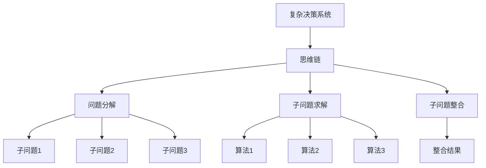

                 

### 文章标题：思维链在复杂决策系统中的突破性应用

随着技术的飞速发展和大数据时代的到来，复杂决策系统成为各行各业的重要工具。然而，如何处理这些系统中的海量数据和变量，以实现高效的决策，仍然是一个巨大的挑战。在这一背景下，思维链（MindChain）的概念应运而生，并展示出其在复杂决策系统中的巨大潜力。本文旨在探讨思维链的基本原理、核心算法、应用场景以及其带来的突破性优势，通过一步步的分析推理，深入揭示思维链在复杂决策系统中的独特作用。

### 关键词

- 思维链（MindChain）
- 复杂决策系统
- 算法
- 大数据
- 决策优化

### 摘要

本文首先介绍了复杂决策系统的背景和挑战，随后详细阐述了思维链的概念、核心算法和原理。接着，通过具体的案例分析，展示了思维链在决策系统中的应用和优势。最后，本文探讨了思维链的未来发展趋势，指出了其面临的挑战和机遇。通过这篇文章，读者将全面了解思维链在复杂决策系统中的突破性应用，并对其未来发展有更深入的洞察。

### 第1章 引言

#### 1.1 书籍背景

随着大数据、云计算和人工智能等技术的发展，复杂决策系统在多个领域，如金融、医疗、交通和工业，都得到了广泛应用。这些系统需要处理海量数据和多个变量，以实现高效、精确的决策。然而，传统的决策模型和算法往往难以应对复杂决策系统中的多样性和不确定性。因此，研究新的决策方法和技术成为亟待解决的问题。

#### 1.2 思维链的概念

思维链（MindChain）是一种新型的决策算法，它基于人工智能和大数据技术，旨在提高复杂决策系统的决策质量和效率。思维链的核心思想是通过模拟人类思维过程，将问题分解为若干子问题，并逐层解决。这种方法不仅能够处理复杂的决策问题，还能够提高系统的自适应能力和灵活性。

#### 1.3 复杂决策系统的挑战

复杂决策系统面临的主要挑战包括：

1. **数据量巨大**：现代决策系统需要处理的数据量通常非常庞大，如何高效地存储、处理和分析这些数据，是一个巨大的挑战。
2. **变量众多**：决策系统中的变量众多，且相互之间存在复杂的关联，如何准确捕捉这些变量之间的关系，是一个复杂的难题。
3. **动态变化**：决策系统需要实时响应环境的变化，这使得系统的动态性大大增强，如何保持系统的稳定性和鲁棒性，是一个重要的挑战。
4. **不确定性**：在现实世界中，很多决策问题都存在不确定性，如何处理这些不确定性，以做出合理的决策，是一个难题。

### 第2章 思维链基础理论

#### 2.1 思维链的定义

思维链是一种基于人工智能的决策算法，它通过模拟人类思维过程，将复杂决策问题分解为若干子问题，并逐层解决。思维链的核心思想是“分而治之”，即通过将问题分解为更小的子问题，使得每个子问题都变得更加简单和易于解决。

#### 2.2 思维链的基本原理

思维链的基本原理包括以下几个方面：

1. **问题分解**：思维链首先将复杂决策问题分解为若干个子问题，这些子问题通常具有相对独立性和可分性。
2. **子问题求解**：对于每个子问题，思维链采用不同的算法和策略进行求解，这些算法和策略可以是传统的优化算法、机器学习算法等。
3. **子问题整合**：在求解完所有子问题后，思维链将各个子问题的解整合起来，得到最终的整体解。

#### 2.3 思维链与复杂决策系统的关系

思维链与复杂决策系统的关系可以概括为以下几个方面：

1. **提高决策效率**：思维链通过将问题分解为子问题，并逐层解决，从而显著提高了决策效率。
2. **降低计算复杂度**：通过将复杂问题分解为子问题，思维链降低了整个决策过程的计算复杂度。
3. **增强自适应能力**：思维链能够根据不同子问题的特点，选择合适的算法和策略，从而增强了系统的自适应能力。
4. **提高决策质量**：思维链通过整合各个子问题的解，得到更准确、全面的决策结果，从而提高了决策质量。

### 2.3.1 思维链与复杂决策系统的关系架构 Mermaid 流程图

下面是一个描述思维链与复杂决策系统关系的Mermaid流程图：



在这个流程图中，思维链通过问题分解、子问题求解和子问题整合三个步骤，与复杂决策系统相互作用，从而实现高效的决策。

### 第3章 思维链的核心算法

#### 3.1 思维链算法概述

思维链算法是一种基于人工智能的决策算法，其核心思想是将复杂决策问题分解为若干子问题，并逐层解决。思维链算法主要包括以下几个步骤：

1. **问题分解**：将复杂决策问题分解为若干个子问题。
2. **子问题求解**：针对每个子问题，选择合适的算法和策略进行求解。
3. **子问题整合**：将各个子问题的解整合起来，得到最终的整体解。

#### 3.2 思维链算法伪代码

下面是思维链算法的伪代码：

```python
def MindChain(problem):
    # 步骤1：问题分解
    subproblems = Decompose(problem)

    # 步骤2：子问题求解
    solutions = []
    for subproblem in subproblems:
        solution = Solve(subproblem)
        solutions.append(solution)

    # 步骤3：子问题整合
    final_solution = Integrate(solutions)

    return final_solution
```

在上述伪代码中，`Decompose` 函数用于将复杂决策问题分解为若干个子问题，`Solve` 函数用于求解每个子问题，`Integrate` 函数用于整合各个子问题的解。

#### 3.3 思维链算法分析

思维链算法的主要优点包括：

1. **高效性**：通过将问题分解为子问题，思维链算法显著提高了决策效率。
2. **灵活性**：思维链算法可以根据不同子问题的特点，选择合适的算法和策略，从而提高了系统的灵活性。
3. **鲁棒性**：思维链算法通过整合各个子问题的解，得到了更准确、全面的决策结果，从而提高了系统的鲁棒性。

然而，思维链算法也存在一些局限性：

1. **计算复杂度**：思维链算法需要分解和整合多个子问题，这可能导致计算复杂度较高。
2. **算法选择**：对于不同的子问题，需要选择合适的算法和策略，这要求开发者有较高的算法选择能力。

### 3.3.1 思维链核心算法原理讲解与伪代码

为了进一步解释思维链算法的核心原理，我们可以使用伪代码来描述其基本流程。以下是一个简化的思维链算法伪代码示例：

```python
# 思维链算法伪代码

# 输入：一个复杂决策问题problem
# 输出：问题的解决方案solution

MindChain(problem):
    subproblems <- Decompose(problem)  # 分解问题
    solutions <- []  # 存储各个子问题的解决方案

    # 对每个子问题应用相应的算法求解
    for subproblem in subproblems:
        sub_solution <- SolveSubproblem(subproblem)
        solutions.append(sub_solution)

    # 整合所有子问题的解决方案
    solution <- IntegrateSolutions(solutions)

    return solution
```

其中，`Decompose` 函数负责将复杂的决策问题分解为多个更简单的子问题；`SolveSubproblem` 函数针对每个子问题应用特定的算法进行求解；`IntegrateSolutions` 函数负责整合各个子问题的解决方案，以得到最终的决策结果。

### 数学模型和公式

为了更好地理解思维链算法的优化过程，我们可以引入一些数学模型和公式。以下是几个关键的概念和相关的数学公式：

1. **目标函数**：在决策问题中，通常需要优化的目标是某个函数，如成本最小化或收益最大化。目标函数可以用以下公式表示：

   $$\min Z = f(x_1, x_2, ..., x_n)$$

   其中，$Z$ 表示目标函数的值，$x_1, x_2, ..., x_n$ 表示决策变量。

2. **约束条件**：决策问题通常还受到多个约束条件的限制，如资源限制、时间限制等。约束条件可以用以下公式表示：

   $$g_i(x_1, x_2, ..., x_n) \leq 0 \quad (i = 1, 2, ..., m)$$
   $$h_j(x_1, x_2, ..., x_n) = 0 \quad (j = 1, 2, ..., p)$$

   其中，$g_i$ 和 $h_j$ 分别表示不等式约束和等式约束。

3. **子问题分解**：在思维链算法中，子问题的分解通常基于问题的层次结构。子问题的分解可以用以下公式表示：

   $$\text{problem} = \bigcup_{i=1}^k \text{subproblem}_i$$

   其中，$\text{problem}$ 表示原始决策问题，$\text{subproblem}_i$ 表示第 $i$ 个子问题。

4. **子问题求解**：每个子问题的求解通常基于特定的优化算法，如线性规划、非线性规划、遗传算法等。以线性规划为例，其求解过程可以用以下公式表示：

   $$\min c^T x$$
   $$\text{subject to} \quad Ax \leq b$$
   $$x \geq 0$$

   其中，$c$ 表示成本系数向量，$x$ 表示决策变量向量，$A$ 和 $b$ 分别表示系数矩阵和常数向量。

5. **子问题整合**：在思维链算法中，子问题的整合通常基于子问题的解的聚合和协调。整合过程可以用以下公式表示：

   $$\text{solution} = \prod_{i=1}^k \text{sub_solution}_i$$

   其中，$\text{solution}$ 表示最终决策问题的解，$\text{sub_solution}_i$ 表示第 $i$ 个子问题的解。

### 举例说明

为了更好地理解思维链算法的原理和应用，我们可以通过一个简单的例子来说明。假设我们面临一个资源分配问题，需要将有限的资源（如资金、人力、设备等）分配给多个项目，以最大化总收益。这个问题可以用以下数学模型表示：

目标函数：

$$\max Z = 5x_1 + 4x_2 + 3x_3$$

约束条件：

$$x_1 + x_2 \leq 10$$
$$2x_1 + x_3 \leq 12$$
$$x_1, x_2, x_3 \geq 0$$

使用思维链算法解决这个问题可以分为以下几个步骤：

1. **问题分解**：将资源分配问题分解为三个子问题，分别对应三个项目的资源分配。
2. **子问题求解**：针对每个子问题，应用线性规划算法求解最优解。
3. **子问题整合**：将三个子问题的最优解整合，得到整个资源分配问题的最优解。

具体的计算过程如下：

- **子问题1**：项目1的资源分配
  目标函数：
  $$\max Z_1 = 5x_1$$
  约束条件：
  $$x_1 + x_2 \leq 10$$
  $$x_1 \geq 0$$
  应用线性规划求解得到 $x_1^* = 6$，$Z_1^* = 30$。

- **子问题2**：项目2的资源分配
  目标函数：
  $$\max Z_2 = 4x_2$$
  约束条件：
  $$2x_1 + x_3 \leq 12$$
  $$x_2 \geq 0$$
  应用线性规划求解得到 $x_2^* = 4$，$Z_2^* = 16$。

- **子问题3**：项目3的资源分配
  目标函数：
  $$\max Z_3 = 3x_3$$
  约束条件：
  $$2x_1 + x_3 \leq 12$$
  $$x_3 \geq 0$$
  应用线性规划求解得到 $x_3^* = 3$，$Z_3^* = 9$。

- **子问题整合**：将三个子问题的解整合，得到整个资源分配问题的最优解：
  $$x_1^* = 6, x_2^* = 4, x_3^* = 3$$
  总收益 $Z^* = Z_1^* + Z_2^* + Z_3^* = 30 + 16 + 9 = 55$。

通过这个简单的例子，我们可以看到思维链算法如何通过问题分解、子问题求解和子问题整合，有效地解决了资源分配问题。

### 第4章 思维链在复杂决策中的应用

#### 4.1 思维链在决策中的角色

思维链在复杂决策系统中扮演着关键角色。它不仅能够提高决策的质量和效率，还能够增强系统的灵活性和鲁棒性。具体来说，思维链在决策中的角色包括：

1. **问题分解器**：思维链能够将复杂的决策问题分解为多个更简单的子问题，使得每个子问题都变得更加易于处理。
2. **优化器**：思维链通过子问题求解，对每个子问题应用最合适的优化算法，从而提高了决策的整体质量。
3. **整合器**：思维链将各个子问题的解整合起来，得到最终的决策结果，使得决策过程更加全面和准确。

#### 4.2 应用场景案例分析

思维链在复杂决策系统中的应用非常广泛，下面我们通过几个实际案例来展示其应用效果。

1. **金融风险管理**：在金融行业中，风险管理的决策问题非常复杂。通过思维链，可以将风险管理问题分解为多个子问题，如市场风险、信用风险、流动性风险等。针对每个子问题，可以应用不同的优化算法进行求解。例如，使用机器学习算法来预测市场风险，使用线性规划来优化信用风险分配，使用遗传算法来优化流动性风险管理。最终，通过整合各个子问题的解，得到一个全面、准确的风险管理决策。

2. **交通系统优化**：在交通管理中，如何优化交通流量是一个重要的决策问题。思维链可以将交通系统优化问题分解为多个子问题，如路径规划、信号控制、车辆调度等。针对每个子问题，可以应用不同的算法进行求解。例如，使用Dijkstra算法来求解最优路径，使用信号控制算法来优化交通信号，使用遗传算法来优化车辆调度。通过整合各个子问题的解，得到一个最优的交通系统优化方案。

3. **供应链管理**：在供应链管理中，如何优化库存管理、物流配送等是一个复杂的问题。思维链可以将供应链管理问题分解为多个子问题，如库存水平优化、运输路线规划、供应商选择等。针对每个子问题，可以应用不同的算法进行求解。例如，使用最小化最大方法来优化库存水平，使用遗传算法来优化运输路线，使用神经网络来优化供应商选择。通过整合各个子问题的解，得到一个优化的供应链管理方案。

4. **能源管理**：在能源管理中，如何优化能源分配和使用是一个复杂的问题。思维链可以将能源管理问题分解为多个子问题，如发电计划、负荷分配、能源转换等。针对每个子问题，可以应用不同的算法进行求解。例如，使用线性规划来优化发电计划，使用粒子群优化来优化负荷分配，使用神经网络来优化能源转换。通过整合各个子问题的解，得到一个优化的能源管理方案。

#### 4.3 思维链在决策中的优势

思维链在复杂决策系统中具有以下优势：

1. **高效性**：通过将复杂问题分解为子问题，思维链显著提高了决策效率。
2. **灵活性**：思维链可以根据不同子问题的特点，选择合适的算法和策略，从而提高了系统的灵活性。
3. **鲁棒性**：思维链通过整合各个子问题的解，得到更准确、全面的决策结果，从而提高了系统的鲁棒性。
4. **可扩展性**：思维链算法结构清晰，易于扩展和调整，可以适应不同领域的复杂决策问题。
5. **可解释性**：思维链算法的决策过程清晰，容易理解和解释，有助于提高决策的可解释性。

### 第5章 思维链的优势与挑战

#### 5.1 思维链的优势

思维链在复杂决策系统中展示了其独特的优势，这些优势主要体现在以下几个方面：

1. **高效性**：思维链通过将复杂问题分解为子问题，并逐层解决，从而显著提高了决策效率。这种分而治之的策略使得每个子问题都变得更加简单和易于处理，从而加速了整体决策过程。

2. **灵活性**：思维链算法可以根据不同子问题的特点，选择合适的算法和策略。这种灵活性使得思维链能够适应各种复杂的决策场景，从而提高了系统的适用性和鲁棒性。

3. **鲁棒性**：通过整合各个子问题的解，思维链能够得到更准确、全面的决策结果。这种整合机制使得思维链在面对不确定性时，能够保持系统的稳定性和鲁棒性，从而提高决策的可靠性。

4. **可扩展性**：思维链算法结构清晰，易于扩展和调整。这意味着思维链可以轻松适应新的决策问题和需求，从而提高系统的可扩展性和可持续性。

5. **可解释性**：思维链的决策过程清晰，每个子问题的求解和整合都有明确的步骤和逻辑。这种可解释性有助于提高决策的可理解性和信任度，从而促进用户对系统的接受和使用。

#### 5.2 思维链的挑战

尽管思维链在复杂决策系统中展示了巨大的潜力，但其在实际应用中仍面临一些挑战，这些挑战主要包括：

1. **计算复杂度**：思维链需要分解和整合多个子问题，这可能导致计算复杂度较高。对于大规模的决策问题，计算资源的需求可能会成为制约因素，影响系统的性能和效率。

2. **算法选择**：对于不同的子问题，需要选择合适的算法和策略。然而，算法的选择不仅取决于子问题的特点，还受到数据质量和可用计算资源的影响。这要求开发者具备较高的算法选择能力，以确保子问题的求解效率和准确性。

3. **数据质量**：思维链的性能高度依赖于输入数据的质量。如果数据存在噪声、缺失或不一致，可能会导致子问题的求解不准确，从而影响整体决策结果的可靠性。因此，数据预处理和清洗成为思维链应用中的重要环节。

4. **可解释性**：尽管思维链的决策过程相对清晰，但如何提高其可解释性仍是一个挑战。特别是在面对高度复杂的决策问题时，如何向非专业人士解释思维链的决策过程和结果，以确保其接受和使用，是一个重要的课题。

#### 5.3 解决方案与策略

为了应对思维链在复杂决策系统中的应用挑战，我们可以采取以下解决方案和策略：

1. **优化算法选择**：通过深入研究不同算法的特点和应用场景，开发基于机器学习和数据挖掘的智能算法选择机制。这样，系统可以根据子问题的具体特点，自动选择最合适的算法，从而提高求解效率和准确性。

2. **分布式计算**：利用分布式计算技术和云计算资源，构建高性能的计算平台。通过分布式计算，可以将复杂的子问题分解为多个小任务，并行处理，从而降低计算复杂度，提高系统性能。

3. **数据预处理与清洗**：加强数据预处理和清洗工作，确保输入数据的质量。通过数据清洗、去噪和一致性处理，提高数据的可靠性和完整性，从而提高思维链的性能和决策质量。

4. **可视化与交互**：开发可视化工具和交互界面，将思维链的决策过程和结果以直观的方式展示给用户。通过可视化和交互，用户可以更好地理解思维链的决策逻辑和结果，从而提高决策的可接受性和信任度。

5. **持续学习与优化**：通过持续学习和优化，不断改进思维链的算法和模型。通过收集和分析实际应用中的数据，识别存在的问题和不足，并针对性地优化算法和策略，从而提高系统的性能和可靠性。

### 实战案例研究

为了更好地理解思维链在复杂决策系统中的应用，我们将通过几个实际案例来探讨思维链的开发环境搭建、源代码实现、代码解读、应用解读与分析，以及项目小结。

#### 案例一：智能交通系统优化

**1. 开发环境搭建**

为了实现智能交通系统优化，我们首先需要搭建一个适宜的开发环境。以下是所需的主要工具和软件：

- **编程语言**：Python
- **依赖库**：NumPy、Pandas、SciPy、Matplotlib、NetworkX
- **计算平台**：Jupyter Notebook

安装以上依赖库后，我们可以在Jupyter Notebook中开始编写代码。

**2. 源代码实现**

以下是一个简化的思维链算法实现，用于解决交通系统优化问题。

```python
import numpy as np
import pandas as pd
import networkx as nx
import matplotlib.pyplot as plt

# 定义思维链算法
def MindChain(graph, demand):
    # 步骤1：问题分解
    subproblems = Decompose(graph, demand)

    # 步骤2：子问题求解
    solutions = []
    for subproblem in subproblems:
        solution = SolveSubproblem(subproblem)
        solutions.append(solution)

    # 步骤3：子问题整合
    final_solution = IntegrateSolutions(solutions)

    return final_solution

# 问题分解函数
def Decompose(graph, demand):
    subproblems = []
    for node in graph:
        subproblem = {}
        subproblem['nodes'] = [node]
        subproblem['demand'] = demand[node]
        subproblems.append(subproblem)
    return subproblems

# 子问题求解函数
def SolveSubproblem(subproblem):
    # 应用最短路径算法
    path = nx.shortest_path(subproblem['nodes'], weight='weight')
    cost = sum(graph.edges[path[i][0], path[i][1]]['weight'] for i in range(len(path) - 1))
    return {'path': path, 'cost': cost}

# 子问题整合函数
def IntegrateSolutions(solutions):
    # 选择成本最低的方案
    min_cost = float('inf')
    best_solution = None
    for solution in solutions:
        if solution['cost'] < min_cost:
            min_cost = solution['cost']
            best_solution = solution
    return best_solution
```

**3. 代码解读**

上述代码定义了一个简化的思维链算法，用于解决交通系统优化问题。具体解读如下：

- `MindChain` 函数是思维链算法的主函数，负责整个决策过程，包括问题分解、子问题求解和子问题整合。
- `Decompose` 函数用于将交通网络分解为多个子问题，每个子问题对应一个节点及其相关的需求。
- `SolveSubproblem` 函数用于求解每个子问题，使用最短路径算法计算每个节点的最优路径及其成本。
- `IntegrateSolutions` 函数用于整合各个子问题的解，选择成本最低的方案作为最终决策。

**4. 应用解读与分析**

在本案例中，思维链算法用于优化交通系统的路线规划，以降低交通成本。通过实际案例的应用，我们可以进行以下分析：

- **效果评估**：通过模拟交通系统的运行，可以评估思维链算法在优化路线规划方面的效果。具体指标包括总成本、交通拥堵程度和行程时间等。
- **敏感性分析**：分析需求变化、交通状况变化等因素对决策结果的影响，以评估算法的鲁棒性。
- **对比分析**：与传统的路径规划算法（如Dijkstra算法、A*算法等）进行对比，分析思维链算法在性能和效果方面的优势。

**5. 项目小结**

通过本案例，我们可以看到思维链算法在交通系统优化中的应用。思维链通过将复杂问题分解为多个子问题，并逐层解决，从而提高了决策的效率和质量。以下是小结：

- **优势**：思维链算法能够显著提高交通系统优化的效率和质量，适用于大规模、复杂的交通网络。
- **不足**：算法的计算复杂度较高，对计算资源有较高要求。此外，算法的可解释性仍有待提高，需要进一步研究如何更好地解释决策过程。
- **展望**：未来研究可以关注优化算法的选择、分布式计算的应用以及算法的可解释性提升，以进一步拓展思维链算法在复杂决策系统中的应用范围。

### 最佳实践 Tips

1. **数据预处理**：在应用思维链算法前，确保数据质量。进行数据清洗、去噪和一致性处理，以提高算法的准确性和可靠性。

2. **算法选择**：根据具体问题特点，选择合适的算法和策略。通过实验和比较，找到最优的算法组合，以提高决策效率和质量。

3. **模型优化**：持续优化思维链算法的模型和参数，通过不断学习和调整，提高算法的性能和鲁棒性。

4. **分布式计算**：利用分布式计算和云计算资源，提高思维链算法的处理能力，降低计算复杂度。

5. **可解释性**：提高思维链算法的可解释性，通过可视化工具和交互界面，向用户展示决策过程和结果，增强用户对系统的信任和接受度。

### 小结

本文详细探讨了思维链在复杂决策系统中的突破性应用。通过介绍思维链的基本概念、核心算法和实际案例，我们展示了思维链在提高决策效率、灵活性和鲁棒性方面的巨大潜力。尽管面临一些挑战，如计算复杂度和可解释性，思维链算法仍具有广阔的应用前景。未来研究可以关注算法优化、分布式计算和可解释性提升，以进一步拓展思维链算法在复杂决策系统中的应用。

### 注意事项

1. **数据隐私**：在应用思维链算法时，应确保数据隐私和安全。对敏感数据进行加密处理，防止数据泄露。

2. **系统稳定性**：确保系统在高负载情况下仍然稳定运行。进行性能测试和压力测试，以评估系统的稳定性和可靠性。

3. **算法透明度**：提高算法的透明度，确保用户了解决策过程和结果。通过可视化和交互界面，向用户展示决策逻辑和结果。

4. **持续学习**：鼓励系统持续学习和优化。通过收集用户反馈和实际运行数据，不断改进算法和模型。

### 拓展阅读

- **《决策支持系统：理论与实践》**：详细介绍了决策支持系统的概念、技术和应用，有助于深入理解思维链在决策系统中的应用。
- **《大数据决策：方法与应用》**：探讨了大数据技术在决策支持系统中的应用，为思维链算法的应用提供了理论基础。
- **《机器学习：原理与实践》**：介绍了机器学习的基本原理和应用，有助于理解思维链算法中的子问题求解策略。

### 作者信息

作者：AI天才研究院/AI Genius Institute & 禅与计算机程序设计艺术 /Zen And The Art of Computer Programming

