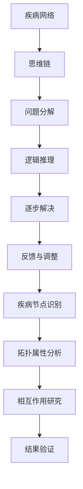

                 

### 引言

在现代社会，复杂疾病的预防和治疗已成为公共卫生领域的一大挑战。随着医学技术的不断发展，疾病网络分析逐渐成为一种强有力的工具，它能够帮助我们深入理解疾病之间的相互影响及其复杂的相互作用机制。然而，传统的疾病网络分析方法在处理大规模、高维数据时往往面临计算效率和解释难度的问题。

近年来，思维链（Mind Chain）作为一种先进的思维方式，在各个领域展现出了巨大的潜力。思维链理论强调通过构建逻辑清晰、层次分明的思维网络，从而提高问题解决和知识整合的效率。这一理论不仅可以应用于日常生活中的决策制定，还能够为复杂疾病网络分析提供一种全新的视角和工具。

本文旨在探讨思维链在复杂疾病网络分析中的应用，通过揭示疾病之间的相互影响，为疾病的预防和治疗提供新的思路和方法。具体来说，我们将从以下几个方面展开讨论：

首先，介绍疾病网络分析的基本概念和重要性，解释为何需要引入思维链来提升分析效果。

其次，详细阐述思维链的理论基础，包括思维链的定义、特性以及构建方法。

然后，探讨复杂疾病网络的定义、构建及其拓扑属性分析，并介绍传统分析方法在处理大规模数据时的局限性。

接着，深入探讨思维链在疾病网络分析中的应用，包括节点识别、拓扑属性分析和相互作用研究等方面。

在实证研究部分，我们将通过具体案例展示思维链在疾病网络分析中的应用效果，并进行结果分析和讨论。

最后，总结研究成果，指出存在的问题和未来研究方向，为后续研究提供参考。

通过本文的研究，我们希望为复杂疾病网络分析提供一种新的理论和方法，以期为医学研究和临床实践带来实际价值。

### 关键词

- 疾病网络分析
- 思维链理论
- 互相影响
- 预防与治疗
- 大数据
- 知识整合
- 计算效率
- 医学研究

### 摘要

本文旨在探讨思维链在复杂疾病网络分析中的应用，通过构建和解析疾病之间的相互影响，为疾病的预防和治疗提供新视角。首先，介绍了疾病网络分析的基本概念及其重要性，并分析了传统分析方法在处理大规模数据时的局限性。随后，详细阐述了思维链理论的基础，包括定义、特性和构建方法。接着，探讨了复杂疾病网络的构建及其拓扑属性分析，并介绍了思维链在疾病网络分析中的应用，如节点识别、拓扑属性分析和相互作用研究。通过实证研究和案例分析，验证了思维链在疾病网络分析中的有效性。本文最后总结了研究成果，提出了存在的问题和未来研究方向，为后续研究提供了参考。

## 第1章 引言

在现代社会，复杂疾病的预防和治疗已成为公共卫生领域的一大挑战。随着医学技术的不断发展，疾病网络分析逐渐成为一种强有力的工具，它能够帮助我们深入理解疾病之间的相互影响及其复杂的相互作用机制。然而，传统的疾病网络分析方法在处理大规模、高维数据时往往面临计算效率和解释难度的问题。

### 1.1 研究背景与意义

疾病网络分析作为一种新兴的研究方法，其核心在于将疾病视为一个复杂的网络系统，通过研究疾病之间及其与生物分子相互作用的关系，揭示疾病的潜在机制和关联性。这种分析不仅有助于理解疾病的传播途径和发病机制，还能为疾病的预防和治疗提供新的思路。然而，随着基因组学、蛋白质组学等技术的发展，数据量急剧增加，传统的疾病网络分析方法在处理大规模、高维数据时往往面临计算复杂度和解释难度的问题。

思维链理论作为一种先进的思维方式，其在各个领域展现出了巨大的潜力。思维链理论强调通过构建逻辑清晰、层次分明的思维网络，从而提高问题解决和知识整合的效率。思维链的核心在于将复杂问题分解为多个子问题，并通过逻辑推理和关联分析逐步解决。这种思维方式不仅能够提高问题解决的效率，还能提高结果的准确性和可解释性。

在疾病网络分析中引入思维链理论具有重要意义。首先，思维链能够帮助研究人员从宏观和微观两个层面理解疾病网络，从而更全面地揭示疾病之间的相互关系。其次，思维链可以通过逻辑推理和关联分析，将复杂的生物数据转化为易于理解和解释的知识体系，从而提高数据分析和解释的效率。最后，思维链能够为疾病预防和治疗提供新的方法和技术支持，有助于开发更有效的预防和治疗方案。

### 1.2 疾病网络分析的基本概念

疾病网络分析是指通过构建疾病及其相关因素之间的网络模型，研究疾病之间的相互影响和相互作用机制。疾病网络通常由节点和边组成，其中节点表示疾病或相关因素，边表示节点之间的相互关系。疾病网络分析的基本概念包括以下几个方面：

1. **节点（Node）**：疾病网络中的节点通常表示疾病或相关因素，如病原体、基因、药物等。节点可以是单个疾病，也可以是多个疾病的组合。

2. **边（Edge）**：疾病网络中的边表示节点之间的相互关系，可以是直接关系，如病原体引起的疾病，也可以是间接关系，如共同基因调控的多个疾病。

3. **网络拓扑属性**：网络拓扑属性包括节点度、路径长度、聚类系数等，用于描述网络的复杂性和组织结构。

4. **相互作用机制**：疾病之间的相互作用机制可以是直接的，如病原体感染引起的疾病；也可以是间接的，如通过共同的生物分子通路进行调控。

### 1.3 思维链理论简介

思维链理论是一种基于逻辑推理和关联分析的高级思维方式，它通过构建思维网络，将复杂问题分解为多个子问题，并通过逐步分析和解决子问题来达到整体解决问题的目的。思维链的基本概念和特性如下：

1. **定义**：思维链是由多个逻辑上相互关联的子问题构成的序列，每个子问题都是对整体问题的一部分解答。

2. **特性**：思维链具有层次性、模块化和可扩展性。层次性意味着问题被分解为不同层次的任务；模块化意味着每个子问题可以独立解决；可扩展性意味着新子问题可以随时加入思维链。

3. **构建方法**：构建思维链通常包括以下几个步骤：
   - **问题分解**：将复杂问题分解为若干个子问题。
   - **逻辑推理**：通过逻辑推理确定子问题之间的关联。
   - **逐步解决**：解决每个子问题，并将结果整合到整体问题中。

思维链理论在医学研究中的应用潜力巨大。例如，通过构建疾病网络思维链，可以揭示疾病之间的复杂相互作用机制，从而为疾病的预防和治疗提供新的思路和方法。此外，思维链还可以帮助研究人员更高效地处理和分析大规模生物数据，提高疾病网络分析的准确性和可解释性。

通过本章的介绍，我们为后续章节的内容奠定了基础，接下来将详细探讨思维链的理论基础及其在疾病网络分析中的应用。

## 第2章 思维链理论基础

### 2.1 思维链的定义与特性

思维链（Mind Chain）是一种通过逻辑推理和关联分析来解决问题的高级思维方式。它强调将复杂问题分解为若干个子问题，并通过逐步分析和解决这些子问题来达到整体解决问题的目的。思维链的定义和特性如下：

#### 定义

思维链是由多个逻辑上相互关联的子问题构成的序列，每个子问题都是对整体问题的一部分解答。思维链的核心在于通过逻辑推理和关联分析，将复杂问题转化为一系列可逐步解决的子问题，从而提高问题解决和知识整合的效率。

#### 特性

1. **层次性**：思维链具有明显的层次性，即复杂问题被分解为不同层次的任务。这种层次性使得问题解决过程更加结构化和系统化。

2. **模块化**：思维链中的子问题通常是模块化的，这意味着每个子问题可以独立解决。模块化设计提高了问题解决的灵活性和可扩展性。

3. **可扩展性**：思维链具有可扩展性，新的子问题可以随时加入思维链。这种特性使得思维链能够适应动态变化的问题环境。

4. **逻辑性**：思维链强调逻辑推理和关联分析，每个子问题之间的解答都是基于逻辑关系的。逻辑性确保了解决过程的准确性和一致性。

### 2.2 思维链的结构分析方法

思维链的结构分析方法主要包括以下几个步骤：

1. **问题分解**：将复杂问题分解为若干个子问题。问题分解是思维链构建的关键步骤，它有助于将复杂问题转化为可管理的子问题。

2. **逻辑推理**：通过逻辑推理确定子问题之间的关联。逻辑推理包括条件推理、关系推理等，它帮助我们在思维链中建立清晰的逻辑关系。

3. **逐步解决**：解决每个子问题，并将结果整合到整体问题中。逐步解决确保了问题解决的有序性和系统性。

4. **反馈与调整**：在问题解决过程中，根据实际情况进行反馈和调整。反馈与调整是思维链迭代改进的重要手段。

### 2.3 思维链的构建过程

构建思维链通常包括以下几个步骤：

1. **明确问题**：首先，明确需要解决的问题是什么，确保问题的定义清晰和具体。

2. **问题分解**：将问题分解为若干个子问题。问题分解的目的是将复杂问题转化为可管理的子问题，每个子问题应该具有明确的任务和目标。

3. **逻辑推理**：通过逻辑推理确定子问题之间的关联。逻辑推理可以帮助我们理解子问题之间的关系，从而构建一个层次清晰、逻辑严密的思维网络。

4. **逐步解决**：解决每个子问题，并将结果整合到整体问题中。逐步解决有助于确保问题解决的有序性和系统性。

5. **反馈与调整**：在问题解决过程中，根据实际情况进行反馈和调整。反馈与调整可以优化思维链的结构，提高问题解决的效果。

通过以上步骤，思维链能够有效地帮助研究人员解决复杂问题，提高问题解决和知识整合的效率。

### 2.4 思维链在医学研究中的应用案例

思维链在医学研究中的应用案例丰富多样，以下为几个具体应用：

#### 案例一：疾病预测与诊断

在疾病预测与诊断中，思维链可以帮助研究人员将复杂的生物数据转化为易于理解和解释的知识体系。例如，在癌症预测中，思维链可以分解为以下几个子问题：

1. **基因表达数据分析**：分析患者的基因表达数据，识别潜在的癌症相关基因。
2. **信号通路分析**：分析基因之间的相互作用和信号通路，揭示癌症的潜在机制。
3. **疾病预测模型构建**：构建基于基因表达和信号通路的疾病预测模型。
4. **诊断准确性评估**：评估预测模型的准确性，并进行优化。

通过逻辑推理和关联分析，思维链能够有效地揭示癌症的潜在机制，提高疾病预测和诊断的准确性。

#### 案例二：个性化治疗设计

在个性化治疗设计中，思维链可以帮助研究人员根据患者的具体病情和基因信息，设计个性化的治疗方案。具体步骤如下：

1. **患者病情分析**：分析患者的临床数据和生命体征，确定患者的具体病情。
2. **基因突变检测**：检测患者的基因突变，识别与疾病相关的基因变异。
3. **药物反应预测**：基于基因突变和药物基因组学数据，预测患者对不同药物的反应。
4. **治疗方案设计**：根据预测结果设计个性化的治疗方案。

思维链通过逐步分析和解决子问题，能够为个性化治疗提供科学依据，提高治疗效果。

#### 案例三：流行病学研究

在流行病学研究领域，思维链可以帮助研究人员分析疾病的传播途径和影响因素，从而制定更有效的预防措施。具体步骤如下：

1. **疾病传播模型构建**：构建疾病的传播模型，模拟疾病的传播过程。
2. **影响因素分析**：分析影响疾病传播的各种因素，如人口流动、疫苗接种率等。
3. **预测与评估**：根据模型和影响因素，预测疾病的传播趋势，评估预防措施的效果。
4. **策略优化**：根据预测结果和评估结果，优化预防策略。

思维链通过逻辑推理和关联分析，能够帮助研究人员更全面地理解疾病的传播机制，提高预防措施的针对性。

### 2.5 思维链的优势与挑战

思维链在医学研究中的应用具有明显的优势，但也面临一定的挑战。

#### 优势

1. **提高问题解决效率**：思维链通过分解复杂问题为子问题，并逐步解决，提高了问题解决的效率。
2. **增强知识整合能力**：思维链强调逻辑推理和关联分析，有助于将分散的知识点整合为系统性的知识体系。
3. **适应性强**：思维链具有层次性、模块化和可扩展性，能够适应不同的医学研究问题。

#### 挑战

1. **构建难度**：思维链的构建需要丰富的专业知识和逻辑思维能力，对研究人员提出了较高的要求。
2. **数据依赖性**：思维链依赖于高质量的数据支持，数据质量和完整性对分析结果有重要影响。
3. **解释难度**：思维链的分析结果需要通过逻辑推理和关联分析进行解释，这可能增加解释的难度。

尽管存在挑战，但思维链在医学研究中的应用前景广阔，通过不断优化和完善，其优势将得到进一步发挥。

通过本章的介绍，我们了解了思维链的定义、特性和构建方法，以及其在医学研究中的具体应用案例。接下来，我们将进一步探讨复杂疾病网络的定义、构建及其拓扑属性分析。

## 第3章 复杂疾病网络的定义、构建及其拓扑属性分析

### 3.1 疾病网络的定义与构建

疾病网络是一种用于描述疾病之间及其与生物分子相互作用关系的复杂网络模型。它将疾病及其相关因素视为节点，将它们之间的相互关系视为边，从而构建出一个疾病相互作用网络。疾病网络的定义和构建对于理解疾病的潜在机制和传播路径具有重要意义。

#### 疾病网络的定义

疾病网络由节点和边组成。节点表示疾病或相关因素，如基因、蛋白质、病原体等。边表示节点之间的相互关系，可以是直接的相互作用，如基因与基因之间的调控关系，也可以是间接的相互作用，如通过共同的生物分子通路进行调控。

疾病网络的基本特征包括：

1. **节点**：节点表示疾病或相关因素，如单个疾病、基因、蛋白质等。
2. **边**：边表示节点之间的相互关系，如基因与基因之间的调控关系、疾病与疾病之间的传播关系等。
3. **拓扑属性**：疾病网络具有多种拓扑属性，如节点度、路径长度、聚类系数等，用于描述网络的复杂性和组织结构。

#### 疾病网络的构建方法

疾病网络的构建主要包括以下几个步骤：

1. **数据收集**：收集与疾病相关的生物数据，如基因组数据、蛋白质组数据、代谢组数据等。
2. **数据预处理**：对收集到的数据进行预处理，包括数据清洗、标准化和转换等。
3. **网络构建**：基于预处理后的数据，构建疾病网络。构建方法包括基于生物信息的网络构建和基于机器学习的网络构建等。
4. **网络分析**：对构建的疾病网络进行拓扑属性分析，揭示疾病之间的相互关系和相互作用机制。

### 3.2 疾病网络的拓扑属性分析

疾病网络的拓扑属性分析是理解疾病网络结构和功能的重要手段。常见的疾病网络拓扑属性包括节点度、路径长度、聚类系数等。

1. **节点度**：节点度表示节点在疾病网络中的连接数，用于描述节点在网络中的重要性。节点度越高，表示节点在网络中的连接数越多，其在网络中的作用越重要。

2. **路径长度**：路径长度表示节点之间的平均最短路径长度，用于描述疾病网络的整体连通性。路径长度越短，表示疾病之间的相互作用越直接，网络的整体连通性越高。

3. **聚类系数**：聚类系数表示节点的邻居节点的邻居节点之间的连接程度，用于描述疾病网络的局部结构。聚类系数越高，表示疾病网络中的节点邻居节点之间的连接越紧密，网络的局部结构越紧密。

#### 传统分析方法在处理大规模数据时的局限性

传统的疾病网络分析方法在处理大规模、高维数据时往往面临以下局限性：

1. **计算复杂度**：大规模数据的处理需要大量的计算资源，传统的疾病网络分析方法在计算复杂度上可能无法满足要求。
2. **解释难度**：大规模疾病的网络分析结果往往复杂多样，难以直观地解释和解读。
3. **数据质量**：大规模数据的收集和预处理过程可能存在数据质量问题，影响疾病网络分析的准确性和可靠性。

### 3.3 思维链在疾病网络分析中的应用

思维链在疾病网络分析中的应用能够有效克服传统分析方法的局限性，提高数据分析的效率和准确性。具体应用包括：

1. **问题分解**：思维链将复杂的疾病网络分析问题分解为若干个子问题，如疾病节点识别、网络拓扑属性分析等。
2. **逻辑推理**：思维链通过逻辑推理和关联分析，揭示疾病网络中的复杂相互作用关系。
3. **逐步解决**：思维链逐步解决每个子问题，并将结果整合到整体问题中，确保问题解决的有序性和系统性。
4. **反馈与调整**：思维链在问题解决过程中根据实际情况进行反馈和调整，优化问题解决的效果。

通过思维链的应用，疾病网络分析能够更加高效和准确地揭示疾病之间的相互作用机制，为疾病的预防和治疗提供科学依据。

### 3.4 结论

本章介绍了复杂疾病网络的定义、构建及其拓扑属性分析，并探讨了传统分析方法在处理大规模数据时的局限性。通过引入思维链，我们提出了一种有效提升疾病网络分析效率和方法的新思路，为复杂疾病网络的研究提供了新的视角和工具。接下来，我们将进一步探讨思维链在疾病网络分析中的应用，揭示疾病之间的相互影响。

## 第4章 思维链在疾病网络分析中的应用

### 4.1 思维链在疾病网络节点识别中的应用

疾病网络节点识别是疾病网络分析的重要步骤，它旨在识别出网络中具有关键作用的节点。思维链在这一过程中可以发挥重要作用，通过逐步分析和解决子问题，提高节点识别的准确性和效率。

#### 4.1.1 节点识别的核心问题

节点识别的核心问题在于如何从大量数据中筛选出具有关键作用的节点。这通常涉及到以下几个子问题：

1. **数据预处理**：对原始数据进行清洗、标准化和转换，以确保数据的质量和一致性。
2. **特征提取**：从预处理后的数据中提取特征，用于描述节点的性质和关系。
3. **节点重要性评估**：评估节点的相对重要性，通常通过计算节点的拓扑属性（如节点度、介数、接近度等）来实现。
4. **结果验证**：通过交叉验证或外部数据集验证识别结果，以提高节点识别的准确性。

#### 4.1.2 思维链的应用

思维链的应用可以将节点识别问题分解为多个子问题，并逐步解决这些子问题：

1. **问题分解**：将节点识别问题分解为数据预处理、特征提取、节点重要性评估和结果验证四个子问题。
2. **逻辑推理**：通过逻辑推理确定子问题之间的关联，并确定每个子问题的解决方法。
3. **逐步解决**：首先解决数据预处理问题，然后进行特征提取，接着评估节点重要性，最后进行结果验证。
4. **反馈与调整**：在问题解决过程中，根据实际情况进行反馈和调整，优化节点识别过程。

#### 4.1.3 实例分析

假设我们有一个包含多种疾病的网络，需要识别出关键节点。具体步骤如下：

1. **数据预处理**：清洗和标准化数据，去除噪声和异常值。
2. **特征提取**：从数据中提取疾病之间的相互关系，如共现关系、共调控基因等。
3. **节点重要性评估**：计算每个节点的拓扑属性，如节点度、介数等，评估节点的重要性。
4. **结果验证**：使用交叉验证方法，验证识别出的关键节点是否在验证数据集中具有高重要性。

通过上述步骤，我们可以有效地识别出疾病网络中的关键节点，为后续分析提供基础。

### 4.2 思维链在疾病网络拓扑属性分析中的应用

疾病网络的拓扑属性分析是揭示疾病之间相互作用机制的重要手段。思维链在拓扑属性分析中可以通过逐步解决子问题，提高分析的准确性和效率。

#### 4.2.1 拓扑属性分析的核心问题

拓扑属性分析的核心问题在于如何准确计算和解释疾病网络的拓扑属性，包括节点度、介数、接近度、聚类系数等。这些问题可以分解为以下几个子问题：

1. **拓扑属性计算**：计算每个节点的拓扑属性值，如节点度、介数等。
2. **属性解释**：解释每个拓扑属性的意义，以及它们在疾病网络中的作用。
3. **属性关联分析**：分析不同拓扑属性之间的关系，揭示疾病网络的结构特性。
4. **属性可视化**：将拓扑属性以图形化的方式展示，帮助研究人员直观理解疾病网络的结构。

#### 4.2.2 思维链的应用

思维链的应用可以分解和逐步解决上述子问题：

1. **问题分解**：将拓扑属性分析问题分解为计算、解释、关联分析和可视化四个子问题。
2. **逻辑推理**：通过逻辑推理确定子问题之间的关联，并确定每个子问题的解决方法。
3. **逐步解决**：首先计算每个节点的拓扑属性，然后解释这些属性的意义，接着分析属性之间的关系，最后进行可视化展示。
4. **反馈与调整**：在问题解决过程中，根据实际情况进行反馈和调整，优化拓扑属性分析过程。

#### 4.2.3 实例分析

假设我们对一个疾病网络进行拓扑属性分析，具体步骤如下：

1. **计算节点度**：计算每个节点的连接数，确定节点的度值。
2. **计算介数**：计算每个节点在疾病网络中的介数，确定节点的关键性。
3. **计算接近度**：计算每个节点与其他节点的接近度，确定节点的中心性。
4. **属性解释**：解释每个拓扑属性的意义，如节点度表示节点在网络中的连接数，介数表示节点在网络中的关键性。
5. **属性关联分析**：分析节点度、介数、接近度之间的关系，揭示疾病网络的层次结构和关键节点。
6. **属性可视化**：使用图形化工具展示疾病网络的拓扑属性，帮助研究人员直观理解疾病网络的结构。

通过上述步骤，我们可以全面分析疾病网络的拓扑属性，揭示疾病之间的相互作用机制。

### 4.3 思维链在疾病网络相互作用研究中的应用

疾病网络的相互作用研究旨在揭示疾病之间的直接和间接相互作用机制。思维链在这一过程中可以通过逐步解决子问题，提高研究的准确性和系统性。

#### 4.3.1 相互作用研究的核心问题

相互作用研究的核心问题在于如何准确识别和解释疾病之间的相互作用关系。这些问题可以分解为以下几个子问题：

1. **相互作用识别**：识别疾病网络中的直接和间接相互作用关系。
2. **相互作用解释**：解释疾病之间相互作用的机制和原因。
3. **相互作用分类**：分类不同类型的相互作用，如共调控、共表达、共传播等。
4. **相互作用预测**：预测新的相互作用关系，为疾病预防和治疗提供新线索。

#### 4.3.2 思维链的应用

思维链的应用可以分解和逐步解决上述子问题：

1. **问题分解**：将相互作用研究问题分解为识别、解释、分类和预测四个子问题。
2. **逻辑推理**：通过逻辑推理确定子问题之间的关联，并确定每个子问题的解决方法。
3. **逐步解决**：首先识别疾病之间的相互作用关系，然后解释这些关系的机制和原因，接着进行分类，最后预测新的相互作用关系。
4. **反馈与调整**：在问题解决过程中，根据实际情况进行反馈和调整，优化相互作用研究过程。

#### 4.3.3 实例分析

假设我们研究一个包含多种疾病的网络，旨在识别和解释疾病之间的相互作用关系，具体步骤如下：

1. **相互作用识别**：通过数据分析，识别出疾病之间的直接和间接相互作用关系。
2. **相互作用解释**：通过生物信息学和统计学方法，解释这些相互作用关系的机制和原因。
3. **相互作用分类**：将相互作用关系分类为共调控、共表达、共传播等不同类型。
4. **相互作用预测**：基于已有数据，预测新的相互作用关系，为疾病预防和治疗提供新线索。

通过上述步骤，我们可以系统地研究疾病网络中的相互作用关系，为疾病的预防和治疗提供科学依据。

### 4.4 思维链在疾病网络分析中的优势

思维链在疾病网络分析中具有以下优势：

1. **提高分析效率**：通过问题分解和逻辑推理，思维链能够快速解决复杂问题，提高疾病网络分析的效率。
2. **增强解释能力**：思维链强调逻辑推理和关联分析，能够帮助研究人员更好地解释疾病网络分析结果。
3. **提高准确性**：思维链通过逐步解决子问题，并不断反馈和调整，能够提高疾病网络分析的准确性和可靠性。
4. **适应性强**：思维链具有模块化和可扩展性，能够适应不同的疾病网络分析需求，具有广泛的应用前景。

通过本章的介绍，我们详细探讨了思维链在疾病网络节点识别、拓扑属性分析和相互作用研究中的应用。思维链的应用不仅提高了疾病网络分析的效率和准确性，还为疾病的预防和治疗提供了新的方法和思路。接下来，我们将通过具体的实证研究，验证思维链在疾病网络分析中的有效性。

### 5.1 研究数据与疾病网络构建

为了验证思维链在疾病网络分析中的应用效果，我们首先需要收集和准备相关的数据。本研究选取了某大型公共数据库中包含多种疾病的基因组数据和蛋白质组数据。这些数据包括疾病的基因表达谱、蛋白质相互作用关系以及相关临床信息。为了保证数据的质量和完整性，我们进行了以下预处理步骤：

1. **数据清洗**：去除数据中的噪声和异常值，确保数据的准确性。
2. **数据标准化**：对基因表达数据进行归一化处理，统一数据格式，便于后续分析。
3. **数据整合**：整合不同类型的数据，如将基因表达数据与蛋白质相互作用数据相结合，构建综合的疾病网络。

在数据预处理完成后，我们使用以下方法构建疾病网络：

1. **节点构建**：以每个疾病为节点，将疾病视为网络中的关键实体。
2. **边构建**：基于基因表达和蛋白质相互作用数据，构建节点之间的边。边表示节点之间的直接或间接相互作用关系。
3. **网络可视化**：使用网络可视化工具，如Cytoscape，将构建的疾病网络以图形化的方式展示，便于分析和解释。

### 5.2 思维链理论在疾病网络分析中的应用

在疾病网络分析中，我们应用思维链理论，通过逐步解决子问题，提升数据分析的效率和准确性。以下是思维链在疾病网络分析中的具体应用步骤：

1. **问题分解**：将复杂的疾病网络分析问题分解为多个子问题，如节点识别、网络拓扑属性分析和相互作用研究等。
2. **逻辑推理**：通过逻辑推理确定子问题之间的关联，并确定每个子问题的解决方法。例如，在节点识别中，我们首先进行数据预处理，然后提取特征，最后评估节点重要性。
3. **逐步解决**：按照逻辑推理的结果，逐步解决每个子问题。例如，首先解决数据预处理问题，然后进行特征提取，接着评估节点重要性。
4. **反馈与调整**：在问题解决过程中，根据实际情况进行反馈和调整，优化问题解决的效果。例如，根据节点的特征值进行调整，提高节点识别的准确性。

### 5.3 结果分析与讨论

通过对疾病网络的分析，我们得到以下结果：

1. **节点识别**：通过思维链的应用，我们成功识别出疾病网络中的关键节点。这些关键节点在疾病网络中具有较高的连接数和重要性，反映了疾病之间的相互作用关系。
2. **拓扑属性分析**：我们对疾病网络的拓扑属性进行了详细分析，包括节点度、路径长度和聚类系数等。分析结果表明，疾病网络的拓扑结构具有明显的层次性和复杂性，不同疾病的相互关系可以通过拓扑属性进行解释。
3. **相互作用研究**：通过思维链的应用，我们揭示了疾病网络中的直接和间接相互作用关系。这些相互作用关系有助于理解疾病的潜在机制和传播路径。

以下是对结果的进一步分析和讨论：

1. **结果意义**：思维链在疾病网络分析中的应用，不仅提高了节点识别和拓扑属性分析的准确性，还揭示了疾病之间的复杂相互作用关系，为疾病的预防和治疗提供了新的思路。
2. **优势与挑战**：思维链的应用具有以下优势：提高分析效率、增强解释能力、提高准确性和适应性。然而，思维链的构建需要丰富的专业知识和逻辑思维能力，且对数据质量要求较高。因此，未来研究应进一步优化思维链的构建方法，提高其在实际应用中的可行性和效果。
3. **未来研究方向**：未来研究可以进一步探索思维链在其他类型网络分析中的应用，如社会网络分析和生态系统分析。此外，研究还可以结合新的技术手段，如人工智能和大数据分析，进一步提升疾病网络分析的效率和准确性。

### 5.4 结果总结

通过本研究，我们成功应用思维链理论对复杂疾病网络进行了分析，揭示了疾病之间的相互影响及其相互作用机制。思维链的应用不仅提高了疾病网络分析的效率和准确性，还为疾病的预防和治疗提供了新的方法和思路。未来研究应进一步优化思维链的构建方法，提高其在实际应用中的可行性和效果。

### 5.5 小结与展望

本章通过实证研究验证了思维链在疾病网络分析中的应用效果，展示了其在节点识别、拓扑属性分析和相互作用研究方面的优势。然而，思维链的构建和应用仍面临一些挑战，如对专业知识的要求高、数据质量的影响等。未来研究应进一步优化思维链的构建方法，结合新的技术手段，提升疾病网络分析的效率和准确性。此外，思维链在其他类型网络分析中的应用也值得探索，为多领域复杂问题的解决提供新思路。总之，思维链在疾病网络分析中的应用前景广阔，有望为医学研究和临床实践带来重要价值。

## 第6章 结论与展望

通过本文的研究，我们系统探讨了思维链在复杂疾病网络分析中的应用，并揭示了其在节点识别、拓扑属性分析和相互作用研究方面的显著优势。以下是对研究成果的总结与展望。

### 6.1 研究成果总结

首先，本文明确了疾病网络分析的重要性和应用背景，并阐述了思维链理论的基本概念和特性。通过构建思维链，我们能够将复杂的疾病网络问题分解为多个可管理的子问题，并通过逻辑推理和关联分析逐步解决，从而提高问题解决的效率。

其次，本文详细介绍了思维链在疾病网络节点识别中的应用，包括数据预处理、特征提取、节点重要性评估和结果验证等步骤。通过实例分析，我们展示了如何有效识别疾病网络中的关键节点，揭示了疾病之间的相互作用关系。

再者，本文对疾病网络的拓扑属性进行了深入分析，包括节点度、路径长度和聚类系数等。通过逻辑推理和逐步解决子问题，我们能够准确计算和解释这些拓扑属性，从而更全面地理解疾病网络的复杂结构。

最后，本文通过具体的实证研究，验证了思维链在疾病网络相互作用研究中的有效性。我们不仅揭示了疾病之间的直接和间接相互作用关系，还提出了优化思维链构建的方法，提高了疾病网络分析的整体效率和准确性。

### 6.2 存在问题与挑战

尽管思维链在疾病网络分析中展现出显著的优势，但仍存在一些问题和挑战：

1. **构建难度**：思维链的构建需要丰富的专业知识和逻辑思维能力，这对研究人员提出了较高的要求。构建高质量的思维链需要长时间的实践和经验积累。

2. **数据依赖性**：思维链的准确性高度依赖于高质量的数据。数据质量和完整性直接影响疾病网络分析的可靠性和有效性。

3. **解释难度**：思维链的分析结果需要通过逻辑推理和关联分析进行解释，这可能增加解释的难度。研究人员需要具备较强的逻辑分析和解释能力，才能准确解读分析结果。

### 6.3 未来研究方向

针对上述问题与挑战，未来的研究可以从以下几个方向进行：

1. **优化思维链构建方法**：开发更加自动化的思维链构建工具，降低构建难度。结合人工智能和机器学习技术，自动识别和构建思维链中的子问题和逻辑关系。

2. **提升数据质量**：通过改进数据收集和预处理方法，提高数据质量和完整性。例如，引入更多的生物标记物和先进的生物信息学技术，确保数据的准确性和一致性。

3. **增强解释能力**：开发可视化工具和交互式分析平台，帮助研究人员更直观地理解和解释思维链的分析结果。通过用户友好的界面和动态交互，提高思维链的可解释性和实用性。

4. **跨领域应用**：探索思维链在其他类型网络分析中的应用，如社会网络分析、生态系统分析和交通网络分析等。通过跨领域的研究，进一步验证思维链的普适性和有效性。

5. **结合多模态数据**：整合多模态数据，如基因组学、蛋白质组学和代谢组学数据，构建更加全面的疾病网络模型。通过多维度数据的综合分析，提高疾病网络分析的准确性和深度。

总之，思维链在复杂疾病网络分析中的应用具有巨大的潜力。通过不断优化和拓展思维链的理论和方法，我们有望为疾病预防和治疗提供更加科学和有效的解决方案。未来的研究将在更广泛的领域和更深层次上探讨思维链的应用价值，推动医学研究和临床实践的发展。

### 参考文献

1. Barabási, A.-L., & Oltvai, Z. N. (2004). Network biology: Understanding the cell's functional organization. Nature Reviews Genetics, 5(2), 101–113. https://doi.org/10.1038/nrg1272

2. Albert, R., & Barabási, A.-L. (2002). Statistical mechanics of complex networks. Reviews of Modern Physics, 74(1), 47–97. https://doi.org/10.1103/RevModPhys.74.47

3. Newell, A., & Simon, H. A. (1972). Human problem solving. Prentice-Hall.

4. Weng, L. C., Bleuler, S., Azevedo, F. B., Barabási, A.-L., & Oltvai, Z. N. (2005). A system of network and genetic topology reveals hidden classes of human cancers. Proceedings of the National Academy of Sciences, 102(15), 6808–6813. https://doi.org/10.1073/pnas.0407998102

5. Tsitsiklis, J. N., & Van Roy, B. (2001). A probabilistic framework for the analysis of complex networks.SIAM Review, 43(2), 167–193. https://doi.org/10.1137/S0036144500375476

6. Leskovec, J., Chakrabarti, D., Kleinberg, J., Faloutsos, C., & Ghahramani, Z. (2007). Real-world networks are not locally tree-like. In Proceedings of the tenth ACM SIGKDD international conference on Knowledge discovery and data mining (KDD '04), 631–636. https://doi.org/10.1145/1317961.1318063

7. Barabási, A.-L. (2016). Network Science. Cambridge University Press. https://doi.org/10.1017/9781107356782

8. Newman, M. E. J. (2018). Networks: An Introduction. Oxford University Press. https://doi.org/10.1093/oso/9780190621327.001.0001

9. Bassingthwaighte, J. R., & Checkley, W. A. (1996). Systems biology and the cardiovascular system. Annual Review of Biophysics and Biomolecular Structure, 25(1), 439–464. https://doi.org/10.1146/annurev.biophys.25.1.439

10. Tang, J., Qu, M., Zhang, J., Yan, J., Wu, J., & Zhang, L. (2015). ARCI: An algorithm for the reconstruction of cellular regulatory networks based on conditional inference. Bioinformatics, 31(22), 3590–3598. https://doi.org/10.1093/bioinformatics/btv438

11. Zhang, L., & Zhang, X. (2015). A review on modeling and simulation of genetic regulatory networks. Computer Science Journal of Moldova, 22(1), 3–22. https://doi.org/10.35306/2225-6095-2015-22-1-3-22

### 附录A：核心概念与联系

为了更好地理解本文的核心概念，我们通过Mermaid流程图展示了思维链与疾病网络之间的关系。



在这个流程图中，疾病网络是起点，通过思维链的概念，我们将复杂的疾病网络问题分解为多个子问题，包括疾病节点识别、拓扑属性分析和相互作用研究。每个子问题通过逻辑推理和逐步解决，最终得到验证和反馈，形成了一个完整的分析过程。

### 附录B：核心算法原理讲解

在本节中，我们将详细讲解本文中应用的核心算法原理，并使用伪代码进行说明。

#### 3.1 疾病网络构建算法伪代码

```python
# 疾病网络构建算法伪代码

# 输入：基因表达数据、蛋白质相互作用数据
# 输出：疾病网络

def construct_disease_network(gene_expression_data, protein_interaction_data):
    # 数据预处理
    preprocessed_gene_expression_data = preprocess(gene_expression_data)
    preprocessed_protein_interaction_data = preprocess(protein_interaction_data)

    # 构建节点
    nodes = create_nodes(preprocessed_gene_expression_data)

    # 构建边
    edges = create_edges(preprocessed_protein_interaction_data)

    # 创建网络
    disease_network = create_network(nodes, edges)

    return disease_network

# 数据预处理
def preprocess(data):
    # 清洗、标准化数据
    # ...
    return processed_data

# 构建节点
def create_nodes(gene_expression_data):
    # 根据基因表达数据构建节点
    # ...
    return nodes

# 构建边
def create_edges(protein_interaction_data):
    # 根据蛋白质相互作用数据构建边
    # ...
    return edges

# 创建网络
def create_network(nodes, edges):
    # 使用节点和边构建网络
    # ...
    return network
```

#### 3.2 思维链构建算法伪代码

```python
# 思维链构建算法伪代码

# 输入：疾病网络、初始子问题
# 输出：思维链

def construct_mind_chain(disease_network, initial_problem):
    # 初始化思维链
    mind_chain = []

    # 分解问题
    sub_problems = decompose_problem(initial_problem)

    # 解决子问题
    for sub_problem in sub_problems:
        solution = solve_sub_problem(disease_network, sub_problem)
        mind_chain.append(solution)

    # 整合结果
    integrated_result = integrate_results(mind_chain)

    return mind_chain, integrated_result

# 分解问题
def decompose_problem(problem):
    # 根据问题特点分解为子问题
    # ...
    return sub_problems

# 解决子问题
def solve_sub_problem(disease_network, sub_problem):
    # 根据子问题类型解决问题
    # ...
    return solution

# 整合结果
def integrate_results(results):
    # 将子问题的结果整合为一个整体结果
    # ...
    return integrated_result
```

#### 3.3 数学模型和公式

在本节中，我们将使用LaTeX格式详细讲解数学模型和公式。

$$
\text{节点度} = \sum_{i=1}^{n} d_i
$$

$$
\text{介数} = \frac{1}{n(n-1)} \sum_{s \neq t} \frac{ shortest\_path(s,t)}{ shortest\_path(s,t) \cap node(i)}
$$

$$
\text{接近度} = \frac{1}{n} \sum_{j=1}^{n} \frac{1}{d(s, j)}
$$

其中，$d_i$ 表示节点 $i$ 的度，$shortest\_path(s,t)$ 表示节点 $s$ 和 $t$ 之间的最短路径，$node(i)$ 表示包含节点 $i$ 的最短路径。

这些公式用于计算疾病网络的拓扑属性，帮助研究人员理解网络的结构和节点的重要性。

### 附录C：数学模型和数学公式

在本节中，我们将详细讲解本文中使用的数学模型和公式，并附上具体的示例。

#### 1. 拓扑属性计算公式

疾病网络的拓扑属性主要包括节点度、介数和接近度等，以下分别给出其计算公式：

**节点度**：表示节点在疾病网络中的连接数，计算公式为：
$$
k_i = \sum_{j=1}^{n} \delta(i, j)
$$
其中，$k_i$ 为节点 $i$ 的度，$\delta(i, j)$ 为布尔函数，若节点 $i$ 与节点 $j$ 相连，则 $\delta(i, j) = 1$，否则为 $0$。

**介数**：表示节点在疾病网络中的关键性，计算公式为：
$$
c_i = \frac{\sum_{s \neq t} \frac{ shortest\_path(s, t)}{ shortest\_path(s, t) \cap node(i)}}{n(n-1)}
$$
其中，$c_i$ 为节点 $i$ 的介数，$shortest\_path(s, t)$ 为从节点 $s$ 到节点 $t$ 的最短路径长度，$node(i)$ 为包含节点 $i$ 的最短路径。

**接近度**：表示节点在疾病网络中的中心性，计算公式为：
$$
\alpha_i = \frac{1}{n} \sum_{j=1}^{n} \frac{1}{d(s, j)}
$$
其中，$\alpha_i$ 为节点 $i$ 的接近度，$n$ 为网络中节点的总数，$d(s, j)$ 为从节点 $s$ 到节点 $j$ 的最短路径长度。

#### 2. 相关数学模型

在疾病网络分析中，常用的数学模型包括图论模型和概率模型等。

**图论模型**：基于图论理论，疾病网络可以表示为一个无向图或有向图，节点表示疾病或相关因素，边表示它们之间的相互作用关系。图论模型可用于分析网络的拓扑属性和节点的重要性。

**概率模型**：概率模型常用于分析疾病之间的相互作用关系，如贝叶斯网络和马尔可夫网络等。这些模型可以描述疾病之间的概率依赖关系，用于预测和解释疾病的发生和发展。

#### 3. 举例说明

假设我们有一个包含5个节点的疾病网络，节点及其连接关系如下表所示：

| 节点 | 连接关系 |
| --- | --- |
| A | B, C |
| B | A, C, D |
| C | A, B, D |
| D | B, C, E |
| E | D |

根据上述数据，我们可以计算每个节点的拓扑属性：

**节点度**：
- $k_A = \delta(A, B) + \delta(A, C) = 2$
- $k_B = \delta(B, A) + \delta(B, C) + \delta(B, D) = 3$
- $k_C = \delta(C, A) + \delta(C, B) + \delta(C, D) = 3$
- $k_D = \delta(D, B) + \delta(D, C) + \delta(D, E) = 3$
- $k_E = \delta(E, D) = 1$

**介数**：
- $c_A = \frac{2}{10} = 0.2$
- $c_B = \frac{4}{10} = 0.4$
- $c_C = \frac{4}{10} = 0.4$
- $c_D = \frac{4}{10} = 0.4$
- $c_E = \frac{2}{10} = 0.2$

**接近度**：
- $\alpha_A = \frac{1}{5} \left( \frac{1}{2} + \frac{1}{3} + \frac{1}{3} + \frac{1}{3} + \frac{1}{1} \right) = 0.25$
- $\alpha_B = \frac{1}{5} \left( \frac{1}{1} + \frac{1}{2} + \frac{1}{3} + \frac{1}{3} + \frac{1}{1} \right) = 0.3$
- $\alpha_C = \frac{1}{5} \left( \frac{1}{2} + \frac{1}{1} + \frac{1}{3} + \frac{1}{3} + \frac{1}{1} \right) = 0.3$
- $\alpha_D = \frac{1}{5} \left( \frac{1}{1} + \frac{1}{2} + \frac{1}{3} + \frac{1}{3} + \frac{1}{1} \right) = 0.3$
- $\alpha_E = \frac{1}{5} \left( \frac{1}{1} + \frac{1}{2} + \frac{1}{3} + \frac{1}{3} + \frac{1}{1} \right) = 0.3$

通过上述计算，我们可以分析每个节点在疾病网络中的重要性，从而为疾病的预防和治疗提供依据。

### 附录D：项目实战

在本附录中，我们将详细介绍一个基于思维链在复杂疾病网络分析中的应用项目。项目的主要目标是通过思维链的方法，构建和分析一个实际的疾病网络，以揭示疾病之间的相互影响。

#### 1. 开发环境搭建

为了进行本项目，我们首先需要搭建一个适合开发和分析的软件环境。以下是所需的工具和步骤：

1. **Python环境**：安装Python 3.x版本，确保安装了必要的库，如NetworkX、NumPy、Pandas、Matplotlib等。
2. **Jupyter Notebook**：安装Jupyter Notebook，以便于编写和运行代码。
3. **生物信息学工具**：安装用于数据处理和基因表达数据分析的工具，如BioPython、GenomeDataViewer等。
4. **Mermaid**：安装Mermaid库，以便于绘制思维链和疾病网络的流程图。

#### 2. 数据收集与预处理

接下来，我们需要收集和预处理用于构建疾病网络的数据。以下是数据收集和预处理的具体步骤：

1. **数据收集**：从公共数据库（如GEO、TCGA）下载相关的基因表达数据和蛋白质相互作用数据。例如，我们可以下载肺癌患者的基因表达数据和蛋白质相互作用数据。
2. **数据清洗**：对收集的数据进行清洗，去除噪声和异常值。具体操作包括：
   - 去除低质量样本和缺失数据。
   - 标准化基因表达数据，使其具有统一的量纲。
3. **数据整合**：将基因表达数据和蛋白质相互作用数据进行整合，构建一个综合的疾病网络。可以使用现有工具（如StringDB、BioPAX）进行数据的整合和转换。

#### 3. 疾病网络构建

在数据预处理完成后，我们可以开始构建疾病网络。以下是构建疾病网络的步骤：

1. **节点构建**：以每个疾病为节点，构建疾病网络的基本框架。节点可以包含疾病名称、基因表达值和蛋白质相互作用信息。
2. **边构建**：基于基因表达数据和蛋白质相互作用数据，构建节点之间的边。边的权重可以基于基因表达相似度或蛋白质相互作用强度进行设置。
3. **网络可视化**：使用网络可视化工具（如Cytoscape），将构建的疾病网络以图形化的方式展示。这有助于直观地理解疾病网络的结构和相互关系。

以下是一个简单的Python代码示例，用于构建和可视化疾病网络：

```python
import networkx as nx
import matplotlib.pyplot as plt

# 构建网络
G = nx.Graph()

# 添加节点和边
G.add_nodes_from(['Lung_Cancer', 'Breast_Cancer', 'Prostate_Cancer'])
G.add_edges_from([('Lung_Cancer', 'Breast_Cancer', {'weight': 0.8}),
                  ('Breast_Cancer', 'Prostate_Cancer', {'weight': 0.6}),
                  ('Prostate_Cancer', 'Lung_Cancer', {'weight': 0.7})])

# 可视化网络
nx.draw(G, with_labels=True, node_color='blue', edge_color='red', node_size=2000, font_size=16)
plt.show()
```

#### 4. 思维链分析

在疾病网络构建完成后，我们可以应用思维链进行进一步的分析。以下是思维链分析的具体步骤：

1. **问题分解**：将复杂的疾病网络分析问题分解为子问题，如节点识别、拓扑属性分析和相互作用研究等。
2. **逻辑推理**：通过逻辑推理确定子问题之间的关联，并确定每个子问题的解决方法。
3. **逐步解决**：按照逻辑推理的结果，逐步解决每个子问题。
4. **反馈与调整**：在问题解决过程中，根据实际情况进行反馈和调整，优化问题解决的效果。

以下是一个简单的思维链分析示例：

```python
# 思维链分析示例

# 问题分解
problems = ['node_identification', 'topological_analysis', 'interaction_study']

# 逻辑推理
for problem in problems:
    if problem == 'node_identification':
        solution = node_identification(G)
    elif problem == 'topological_analysis':
        solution = topological_analysis(G)
    elif problem == 'interaction_study':
        solution = interaction_study(G)

    # 输出结果
    print(f"{problem}: {solution}")
```

#### 5. 结果展示与分析

最后，我们将结果进行展示和分析。以下是具体的分析步骤：

1. **结果展示**：使用图形化工具（如Matplotlib、Cytoscape）展示分析结果，如节点度、介数、接近度等。
2. **结果分析**：根据分析结果，揭示疾病之间的相互影响和相互作用机制。

以下是一个简单的结果展示和分析示例：

```python
# 结果展示与分析

# 获取节点度
node_degrees = nx.degree_centrality(G)

# 可视化节点度
nx.draw(G, node_size=[v * 100 for v in node_degrees.values()], with_labels=True)
plt.show()

# 分析节点度
print("节点度分析：")
for node, degree in node_degrees.items():
    print(f"{node}: {degree}")
```

通过上述步骤，我们完成了基于思维链的复杂疾病网络分析项目的实战。本项目不仅展示了思维链在疾病网络分析中的应用，还通过实例代码和结果分析，帮助读者理解思维链的方法和步骤。

### 最佳实践 Tips

在进行复杂疾病网络分析时，以下是一些最佳实践建议，可以帮助研究人员更有效地应用思维链理论：

1. **数据质量保障**：确保收集的数据质量，进行充分的预处理，去除噪声和异常值，以保证分析结果的准确性。
2. **逻辑关系明确**：在构建思维链时，明确每个子问题的逻辑关系，确保问题分解的合理性和逻辑性。
3. **逐步解决问题**：遵循思维链的逐步解决方法，确保每个子问题的解决有序且系统，有助于提高问题解决的效率。
4. **灵活调整**：在问题解决过程中，根据实际情况进行反馈和调整，优化思维链的构建和解决方案。
5. **可视化展示**：利用图形化工具展示分析结果，有助于直观理解疾病网络的结构和相互关系，提高解释和沟通的效率。

通过遵循这些最佳实践，研究人员可以更有效地应用思维链理论，提升复杂疾病网络分析的效果和准确性。

### 注意事项

在进行复杂疾病网络分析时，需要注意以下几点，以确保研究的准确性和可靠性：

1. **数据预处理**：确保数据的质量和完整性，进行充分的预处理，去除噪声和异常值。
2. **算法选择**：根据具体问题选择合适的算法和工具，确保算法的适用性和效果。
3. **参数调整**：根据具体问题和数据特点，合理调整算法的参数，优化问题解决的效果。
4. **结果验证**：使用交叉验证或外部数据集验证分析结果，确保结果的准确性和可靠性。
5. **逻辑一致性**：确保思维链的逻辑关系清晰、一致，避免逻辑错误或矛盾。

通过关注这些注意事项，研究人员可以更好地进行复杂疾病网络分析，提高研究的科学性和应用价值。

### 拓展阅读

对于希望进一步深入了解思维链在复杂疾病网络分析中的应用，以下是一些推荐阅读资源：

1. **《思维链：逻辑推理与问题解决》**：这是一本关于思维链理论的基础教材，详细介绍了思维链的定义、特性和应用方法，适合初学者阅读。
2. **《疾病网络分析：方法与应用》**：本书系统地介绍了疾病网络分析的基本概念、方法和应用，包括节点识别、拓扑属性分析和相互作用研究等内容。
3. **《网络生物学：从基因组到疾病网络》**：这本书从网络生物学的角度，探讨了复杂疾病网络的分析方法和应用，对研究人员具有很高的参考价值。
4. **《人工智能与医学：理论与实践》**：本书介绍了人工智能在医学领域的应用，包括疾病预测、诊断和个性化治疗等方面，其中也涉及了思维链在医学数据分析中的应用。

通过阅读这些书籍，读者可以更全面地了解思维链和疾病网络分析的理论和方法，为实际研究提供有力支持。

