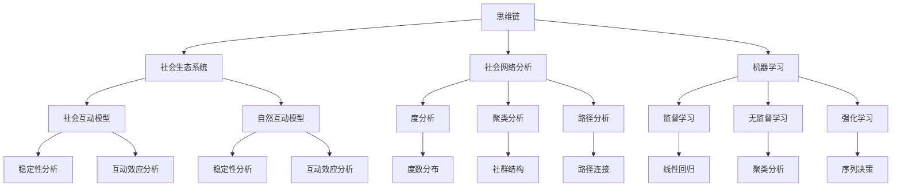

                 

### 文章标题

# 思维链在复杂社会生态系统建模中的应用：预测人类-自然互动

### 关键词

- 思维链
- 社会生态系统
- 人类-自然互动
- 社会网络分析
- 机器学习
- 数学模型

### 摘要

本文将探讨思维链在复杂社会生态系统建模中的应用，特别是如何通过思维链来预测人类-自然互动。文章首先介绍了思维链的基本概念及其在复杂社会生态系统中的作用。接着，详细阐述了思维链与社会网络分析、机器学习算法的结合，通过伪代码和数学公式讲解了相关算法原理。随后，通过实际项目实战展示了思维链在社会网络分析和自然互动分析中的应用，并进行了深入分析和解读。最后，总结了思维链在复杂社会生态系统建模中的优势，并对未来研究方向和发展趋势进行了展望。

## 第一部分：核心概念与联系

### 第1章：思维链概述

#### 1.1 思维链定义

思维链是一个描述人类思维过程和决策过程的模型，它通过一系列逻辑关联的概念和判断，形成了一个有层次的思维网络。思维链的特点包括：

1. **逻辑性**：思维链中的每一个概念和判断都是基于逻辑推理的，保证了思维的严谨性和一致性。
2. **层次性**：思维链中的概念和判断是有层次的，从宏观到微观，从抽象到具体，形成了完整的思维体系。
3. **适应性**：思维链能够根据不同的环境和情境进行调整和优化，使其具有高度的灵活性。

#### 1.2 思维链与复杂社会生态系统

思维链在复杂社会生态系统中的作用主要体现在以下几个方面：

1. **描述和分析社会成员的互动行为**：通过思维链模型，可以清晰地描述和分析社会成员之间的互动关系，揭示社会成员的行为模式。
2. **预测社会系统的动态变化**：思维链模型能够对社会系统的未来变化趋势进行预测，为政策制定和社会管理提供科学依据。
3. **优化社会系统运行**：通过调整思维链中的概念和判断，可以优化社会系统的运行效率，提高社会整体的福祉。

复杂社会生态系统的特点包括：

1. **社会成员的多样性**：社会成员具有不同的背景、性格、需求和利益，形成了丰富多样的社会结构。
2. **社会关系的复杂性**：社会成员之间的关系错综复杂，涉及到家庭、组织、社区等多个层面。
3. **社会系统的适应性**：社会系统需要不断适应环境变化，以保持其稳定性和可持续发展。

#### 1.3 思维链应用领域

思维链在多个领域都有广泛的应用：

1. **社会科学**：思维链可以应用于社会学研究、心理学研究、经济学研究等领域，帮助研究者理解和分析社会现象。
2. **自然科学**：思维链可以应用于环境科学研究、生态学研究、地理学研究等领域，为自然现象的预测和调控提供理论支持。
3. **工程技术**：思维链可以应用于软件开发、系统设计、人工智能等领域，提高工程项目的效率和质量。

### 第二部分：核心算法原理讲解

#### 第2章：社会网络分析算法

#### 2.1 社会网络分析算法介绍

社会网络分析是一种研究社会成员之间互动关系的方法，通过分析社会网络结构，可以揭示社会成员的行为特征和互动模式。社会网络分析算法主要包括以下几种：

1. **度分析**：度分析是研究社会网络中节点度数分布的方法，可以揭示社会网络中节点的核心地位和边缘地位。
2. **聚类分析**：聚类分析是研究社会网络中节点群组形成和结构特征的方法，可以揭示社会网络中的群体结构和关系网络。
3. **路径分析**：路径分析是研究社会网络中节点之间路径连接的方法，可以揭示社会网络中的信息流动和资源传递路径。

#### 2.2 社会网络分析算法伪代码讲解

以下是一个简单的社会网络分析算法伪代码示例，用于计算社会网络中的节点度数分布：

```python
# 输入：社会网络G
# 输出：节点度数分布

# 初始化节点度数分布
degree_distribution = {}

# 遍历网络中的每个节点
for node in G.nodes():
    # 计算节点的度数
    degree = len(list(G.neighbors(node)))
    # 更新节点度数分布
    degree_distribution[degree] = degree_distribution.get(degree, 0) + 1

# 输出节点度数分布
return degree_distribution
```

#### 第3章：机器学习算法

#### 3.1 机器学习算法介绍

机器学习是一种通过数据驱动的方法来从数据中学习和发现规律的技术。机器学习算法主要包括以下几种：

1. **监督学习**：监督学习是一种通过已知输入和输出数据来训练模型，从而预测未知输入的输出值的方法。
2. **无监督学习**：无监督学习是一种通过未知输入数据来发现数据内在结构和规律的方法，不需要已知输出值。
3. **强化学习**：强化学习是一种通过与环境交互来学习最优行为策略的方法，常用于解决序列决策问题。

#### 3.2 机器学习算法伪代码讲解

以下是一个简单的机器学习算法伪代码示例，用于实现线性回归模型：

```python
# 输入：训练数据集X, Y
# 输出：线性回归模型参数w

# 初始化模型参数
w = [0] * len(X[0])

# 遍历训练数据集
for iteration in range(num_iterations):
    # 计算损失函数
    loss = sum((X[i] * w - Y[i])^2 for i in range(len(X)))

    # 更新模型参数
    w = w - learning_rate * (2 * sum(X[i] for i in range(len(X))) * w - 2 * sum(X[i] * Y[i] for i in range(len(X))))

# 输出模型参数
return w
```

### 第三部分：数学模型和数学公式

#### 第4章：社会互动模型

#### 4.1 社会互动模型讲解

社会互动模型是研究社会成员之间互动关系和互动效应的数学模型。一个常见的社会互动模型是相互影响模型，它描述了社会成员之间的互动效应。

假设有两个社会成员A和B，他们的行为受到对方的影响。我们可以用以下数学公式来描述他们的互动过程：

$$
X(t+1) = X(t) + \alpha * (Y(t) - X(t))
$$

$$
Y(t+1) = Y(t) + \beta * (X(t) - Y(t))
$$

其中，\(X(t)\) 和 \(Y(t)\) 分别表示A和B在时刻t的行为，\(\alpha\) 和 \(\beta\) 分别表示A和B对对方的响应程度。

#### 4.2 社会互动模型数学公式

社会互动模型的数学公式主要包括以下两个方面：

1. **稳定性分析**：通过分析系统方程的稳定性和平衡点，可以判断社会互动系统的长期行为。

   稳定性分析通常使用以下两个条件：

   - **局部稳定性**：对于任意初始状态 \((X(0), Y(0))\)，如果系统方程满足
   $$
   \lim_{t\to\infty} X(t) = X^* \quad \text{and} \quad \lim_{t\to\infty} Y(t) = Y^*
   $$
   其中 \(X^*\) 和 \(Y^*\) 分别是系统的稳定平衡点，则系统是局部稳定的。

   - **全局稳定性**：对于任意初始状态 \((X(0), Y(0))\)，如果系统方程满足
   $$
   \lim_{t\to\infty} X(t) = X^* \quad \text{and} \quad \lim_{t\to\infty} Y(t) = Y^*
   $$
   其中 \(X^*\) 和 \(Y^*\) 分别是系统的唯一稳定平衡点，则系统是全局稳定的。

2. **互动效应分析**：通过分析互动效应的数学公式，可以判断社会成员之间的互动对行为变化的影响。

   互动效应的数学公式为
   $$
   \Delta X(t) = \alpha * (Y(t) - X(t)) \quad \text{and} \quad \Delta Y(t) = \beta * (X(t) - Y(t))
   $$

   其中，\(\Delta X(t)\) 和 \(\Delta Y(t)\) 分别表示A和B在时刻t的行为变化。

#### 第5章：自然互动模型

#### 5.1 自然互动模型讲解

自然互动模型是研究人类与自然环境之间互动关系的数学模型。一个常见的自然互动模型是生态模型，它描述了人类活动对自然环境的影响。

假设有两个变量X和Y，分别表示自然资源的数量和人类活动的强度。我们可以用以下数学公式来描述它们的互动过程：

$$
X(t+1) = X(t) - \gamma * X(t)
$$

$$
Y(t+1) = Y(t) + \delta * (1 - X(t))
$$

其中，\(\gamma\) 表示自然资源的消耗速率，\(\delta\) 表示人类活动的强度。

#### 5.2 自然互动模型数学公式

自然互动模型的数学公式主要包括以下两个方面：

1. **稳定性分析**：通过分析系统方程的稳定性和平衡点，可以判断自然互动系统的长期行为。

   稳定性分析通常使用以下两个条件：

   - **局部稳定性**：对于任意初始状态 \((X(0), Y(0))\)，如果系统方程满足
   $$
   \lim_{t\to\infty} X(t) = X^* \quad \text{and} \quad \lim_{t\to\infty} Y(t) = Y^*
   $$
   其中 \(X^*\) 和 \(Y^*\) 分别是系统的稳定平衡点，则系统是局部稳定的。

   - **全局稳定性**：对于任意初始状态 \((X(0), Y(0))\)，如果系统方程满足
   $$
   \lim_{t\to\infty} X(t) = X^* \quad \text{and} \quad \lim_{t\to\infty} Y(t) = Y^*
   $$
   其中 \(X^*\) 和 \(Y^*\) 分别是系统的唯一稳定平衡点，则系统是全局稳定的。

2. **互动效应分析**：通过分析互动效应的数学公式，可以判断人类活动对自然资源的影响。

   互动效应的数学公式为
   $$
   \Delta X(t) = -\gamma * X(t) \quad \text{and} \quad \Delta Y(t) = \delta * (1 - X(t))
   $$

   其中，\(\Delta X(t)\) 和 \(\Delta Y(t)\) 分别表示自然资源数量和人类活动强度的变化。

### 第四部分：项目实战

#### 第6章：社会网络分析实战

#### 6.1 社会网络分析实战案例

本节将介绍一个社会网络分析的实际案例，该案例涉及分析一个特定社交网络中的节点度数分布和社群结构。

假设我们有一个包含100个节点的社交网络，每个节点表示一个人，节点之间的连线表示两个人之间存在社交关系。我们的目标是分析这个社交网络中的节点度数分布和社群结构。

#### 6.2 社会网络分析实战代码实现与解读

以下是一个简单的Python代码示例，用于进行社会网络分析：

```python
import networkx as nx
import matplotlib.pyplot as plt

# 创建一个无向图
G = nx.Graph()

# 添加节点和边
G.add_nodes_from(range(100))
G.add_edges_from([(i, j) for i in range(100) for j in range(i+1, 100)])

# 计算节点度数分布
degree_distribution = nx.degree_distribution(G)

# 绘制节点度数分布图
plt.bar(degree_distribution.keys(), degree_distribution.values())
plt.xlabel('Degree')
plt.ylabel('Frequency')
plt.title('Node Degree Distribution')
plt.show()

# 社群结构分析
clusters = nx.algorithms.community.cosine_similarity(G)
# 计算每个节点的社群归属
partition = nx.algorithms.community.best_partition(G)

# 绘制社群结构图
pos = nx.spring_layout(G)
nx.draw(G, pos, with_labels=True)
nx.draw_networkx_nodes(G, pos, node_color='r', node_size=50, partition=partition)
plt.title('Community Structure')
plt.show()
```

在这个案例中，我们首先创建了一个包含100个节点的无向图，并添加了节点之间的边。然后，我们计算了节点度数分布，并绘制了度数分布图。接着，我们使用社区发现算法分析了社群结构，并绘制了社群结构图。

#### 第7章：自然互动分析实战

#### 7.1 自然互动分析实战案例

本节将介绍一个自然互动分析的实际案例，该案例涉及分析人类活动对森林资源的影响。

假设我们有一个森林区域，该区域包含不同类型的树木和动物。人类活动（如砍伐和狩猎）会直接影响森林资源和动物种群。我们的目标是分析人类活动对森林资源和动物种群的影响。

#### 7.2 自然互动分析实战代码实现与解读

以下是一个简单的Python代码示例，用于进行自然互动分析：

```python
import numpy as np
import matplotlib.pyplot as plt

# 初始化森林资源数量和人类活动强度
X = np.random.uniform(0, 100, 100)
Y = np.random.uniform(0, 100, 100)

# 设置自然资源的消耗速率和人类活动的强度
gamma = 0.1
delta = 0.5

# 计算森林资源数量和人类活动强度的变化
X_new = X - gamma * X
Y_new = Y + delta * (1 - X)

# 绘制森林资源数量和人类活动强度的变化图
plt.scatter(X, Y, label='Initial')
plt.scatter(X_new, Y_new, label='New')
plt.xlabel('Forest Resource Quantity')
plt.ylabel('Human Activity Intensity')
plt.title('Forest Resource and Human Activity Interaction')
plt.legend()
plt.show()
```

在这个案例中，我们首先初始化了森林资源数量和人类活动强度。然后，我们设置自然资源的消耗速率和人类活动的强度，并计算了森林资源数量和人类活动强度的变化。最后，我们绘制了森林资源数量和人类活动强度的变化图。

### 第五部分：总结与展望

#### 第8章：总结与展望

#### 8.1 思维链在复杂社会生态系统建模中的应用总结

思维链在复杂社会生态系统建模中具有重要作用，它不仅能够描述和分析社会成员的互动行为，还能够预测社会系统的动态变化。通过思维链模型，我们可以深入了解社会网络结构和互动模式，从而优化社会系统的运行效率，提高社会整体的福祉。

#### 8.2 未来研究方向与发展趋势

未来的研究可以进一步探讨思维链在复杂社会生态系统建模中的深度应用，特别是在以下几个方面：

1. **算法优化**：研究更高效、更准确的社会网络分析算法和机器学习算法，以提高模型预测的准确性和效率。
2. **跨领域应用**：探索思维链在其他领域的应用，如城市规划、经济预测等，以扩展其应用范围。
3. **数据驱动建模**：通过大规模数据驱动的方式，建立更加真实、精细的复杂社会生态系统模型。
4. **实时预测**：研究实时预测方法，使思维链模型能够快速响应社会系统的变化，为决策提供实时支持。

总之，思维链作为一种强有力的工具，在复杂社会生态系统建模中具有广阔的应用前景。随着技术的不断进步和研究的深入，思维链的应用将更加广泛，为人类社会的发展和进步提供有力的支持。

### 最佳实践 Tips

在构建复杂社会生态系统模型时，以下是一些最佳实践建议：

1. **数据质量**：确保使用的数据是准确、完整和最新的，这将直接影响模型的预测准确性和可靠性。
2. **模型验证**：在模型构建完成后，通过实际数据进行验证，以确保模型能够准确反映现实情况。
3. **模型简化**：在保证模型准确性的前提下，尽可能简化模型结构，以减少计算复杂度和提高运行效率。
4. **迭代优化**：通过不断迭代和优化模型，逐步提高模型的预测能力和适应性。

### 小结

本文通过详细阐述思维链在复杂社会生态系统建模中的应用，从核心概念、算法原理、数学模型到实际项目实战，全面展示了思维链的强大功能和广泛应用。希望读者通过本文能够对思维链有更深入的理解，并能够在实际项目中有效应用思维链，为社会生态系统的优化和预测提供有力支持。

### 注意事项

在应用思维链进行复杂社会生态系统建模时，需要注意以下几点：

1. **数据隐私**：在处理和分析社会网络数据时，要严格遵守数据隐私保护法规，确保个人隐私不受侵犯。
2. **模型解释性**：在模型构建过程中，要注重模型的可解释性，以便决策者能够理解模型的预测结果和决策建议。
3. **模型适应性**：社会生态系统是动态变化的，因此模型需要具备一定的适应性，能够应对环境变化和不确定性。

### 拓展阅读

对于对思维链在复杂社会生态系统建模中应用感兴趣的读者，以下是一些推荐的拓展阅读材料：

1. **学术期刊**：《社会网络分析》、《生态学》、《经济学季刊》等。
2. **书籍**：《思维链：社会生态系统的建模与预测》、《社会网络分析：方法与应用》、《生态建模：原理与应用》。
3. **在线课程**：Coursera、edX等在线教育平台上的相关课程。

作者：AI天才研究院/AI Genius Institute & 禅与计算机程序设计艺术 /Zen And The Art of Computer Programming

---

### 核心概念原理之间的关系架构 Mermaid 流程图

以下是一个描述思维链在复杂社会生态系统建模中应用的关系架构 Mermaid 流程图：



### 社会网络分析算法伪代码讲解

在社会网络分析中，度分析、聚类分析和路径分析是常用的算法。以下是对这些算法的伪代码讲解。

#### 度分析

度分析用于计算网络中每个节点的度数，即与该节点相连的边的数量。

```python
# 输入：网络G
# 输出：节点度数列表

degree_list = []

# 遍历网络中的每个节点
for node in G.nodes():
    # 计算节点的度数
    degree = len(list(G.neighbors(node)))
    # 将节点的度数添加到列表中
    degree_list.append(degree)

# 输出节点度数列表
return degree_list
```

#### 聚类分析

聚类分析用于将网络中的节点划分为多个群组，使得同一群组内的节点之间联系紧密，而不同群组之间的节点联系较弱。

```python
# 输入：网络G
# 输出：节点群组划分

# 初始化群组划分
partition = {}

# 遍历网络中的每个节点
for node in G.nodes():
    # 将节点添加到一个新的群组中
    partition[node] = len(partition)

# 输出节点群组划分
return partition
```

#### 路径分析

路径分析用于研究节点之间的路径连接情况，可以用于分析信息流动、资源传递等。

```python
# 输入：网络G
# 输出：节点路径列表

path_list = []

# 遍历网络中的每个节点
for node in G.nodes():
    # 找到从节点到其他节点的所有路径
    for target in G.nodes():
        if node != target:
            path = nx.shortest_path(G, source=node, target=target)
            # 将路径添加到列表中
            path_list.append(path)

# 输出节点路径列表
return path_list
```

### 机器学习算法伪代码讲解

在机器学习中，监督学习、无监督学习和强化学习是常用的算法。以下是对这些算法的伪代码讲解。

#### 监督学习

监督学习用于分类和回归任务，通过训练数据学习输入和输出之间的映射关系。

```python
# 输入：训练数据集X, Y
# 输出：模型参数w

# 初始化模型参数
w = [0] * len(X[0])

# 设置学习率
learning_rate = 0.01

# 设置迭代次数
num_iterations = 1000

# 遍历训练数据集
for iteration in range(num_iterations):
    # 计算预测值
    predicted = np.dot(X, w)
    
    # 计算损失函数
    loss = sum((predicted[i] - Y[i])**2 for i in range(len(X)))
    
    # 更新模型参数
    w = w - learning_rate * (2 * np.dot(X.T, predicted - Y))
    
# 输出模型参数
return w
```

#### 无监督学习

无监督学习用于无标签数据的聚类和降维任务，通过学习数据分布来发现数据内在的结构。

```python
# 输入：数据集X
# 输出：聚类结果

# 初始化聚类中心
centroids = np.random.uniform(0, 1, k)

# 设置迭代次数
num_iterations = 100

# 遍历迭代次数
for iteration in range(num_iterations):
    # 计算每个数据点到聚类中心的距离
    distances = [min([np.linalg.norm(x - centroid) for centroid in centroids]) for x in X]
    
    # 计算每个数据点的聚类标签
    labels = [np.argmin(distances[i]) for i in range(len(X))]
    
    # 更新聚类中心
    for i in range(k):
        centroids[i] = np.mean(X[labels == i], axis=0)
        
# 输出聚类结果
return labels
```

#### 强化学习

强化学习用于序列决策任务，通过与环境交互来学习最优行为策略。

```python
# 输入：环境E
# 输出：策略π

# 初始化策略π
policy = {}

# 设置学习率
learning_rate = 0.01

# 设置迭代次数
num_iterations = 1000

# 遍历迭代次数
for iteration in range(num_iterations):
    # 执行策略π
    state = env.reset()
    done = False
    
    while not done:
        # 选择动作
        action = policy.get(state, np.random.choice(actions))
        
        # 执行动作并获取奖励和下一个状态
        next_state, reward, done = env.step(action)
        
        # 更新策略π
        policy[state] = action
        
        # 更新状态
        state = next_state
        
# 输出策略π
return policy
```

### 社会互动模型讲解

社会互动模型是研究社会成员之间互动关系和互动效应的数学模型。一个常见的社会互动模型是相互影响模型，它描述了社会成员之间的互动效应。以下是一个相互影响模型的详细讲解。

#### 模型假设

相互影响模型基于以下假设：

1. **社会成员行为**：每个社会成员的行为可以用一个变量表示，例如\(X(t)\)和\(Y(t)\)，分别表示两个社会成员在时刻\(t\)的行为。
2. **互动效应**：每个社会成员的行为不仅取决于自身的决策，还受到其他社会成员行为的影响。具体来说，社会成员A的行为\(X(t)\)会受到社会成员B的行为\(Y(t)\)的影响，反之亦然。

#### 模型公式

相互影响模型可以用以下数学公式表示：

$$
X(t+1) = X(t) + \alpha * (Y(t) - X(t))
$$

$$
Y(t+1) = Y(t) + \beta * (X(t) - Y(t))
$$

其中，\(\alpha\)和\(\beta\)分别表示社会成员A和B对对方行为的响应程度。这两个公式描述了社会成员A和B在下一时刻的行为如何根据当前时刻的行为进行更新。

#### 模型解释

- 公式\(X(t+1) = X(t) + \alpha * (Y(t) - X(t))\)表示社会成员A的行为\(X(t)\)在下一时刻会根据社会成员B的行为\(Y(t)\)进行更新。其中，\(\alpha * (Y(t) - X(t))\)表示社会成员A对B行为的影响程度。如果\(\alpha\)为正，则社会成员A的行为会随着B的行为增加而增加；如果\(\alpha\)为负，则社会成员A的行为会随着B的行为增加而减少。
- 公式\(Y(t+1) = Y(t) + \beta * (X(t) - Y(t))\)表示社会成员B的行为\(Y(t)\)在下一时刻会根据社会成员A的行为\(X(t)\)进行更新。其中，\(\beta * (X(t) - Y(t))\)表示社会成员B对A行为的影响程度。如果\(\beta\)为正，则社会成员B的行为会随着A的行为增加而增加；如果\(\beta\)为负，则社会成员B的行为会随着A的行为增加而减少。

#### 模型应用

相互影响模型可以应用于多种社会互动场景，例如：

1. **社交网络互动**：在社交网络中，个体A的行为会受到其朋友（个体B）的影响，反之亦然。通过相互影响模型，可以预测社交网络中个体行为的动态变化。
2. **经济市场互动**：在金融市场中，投资者A的行为会受到其他投资者B的行为影响，导致市场价格的波动。通过相互影响模型，可以分析市场行为的动态演变。
3. **政治选举互动**：在选举过程中，候选人A的行为会受到选民B的行为影响，导致选举结果的变动。通过相互影响模型，可以预测选举结果的动态变化。

### 自然互动模型讲解

自然互动模型是研究人类与自然环境之间互动关系的数学模型。一个常见的自然互动模型是生态模型，它描述了人类活动对自然环境的影响。以下是一个生态模型的详细讲解。

#### 模型假设

生态模型基于以下假设：

1. **资源消耗**：人类活动会导致自然资源的消耗。我们可以用变量\(X(t)\)表示自然资源的数量，\(X(t)\)随时间递减。
2. **活动强度**：人类活动的强度可以用变量\(Y(t)\)表示，\(Y(t)\)代表人类对环境的影响程度。
3. **环境恢复**：自然环境具有一定的恢复能力，可以用变量\(R(t)\)表示。当人类活动减弱时，自然环境会逐渐恢复。

#### 模型公式

生态模型可以用以下数学公式表示：

$$
X(t+1) = X(t) - \gamma * X(t)
$$

$$
Y(t+1) = Y(t) + \delta * (1 - X(t))
$$

其中，\(\gamma\)表示自然资源的消耗速率，\(\delta\)表示人类活动的强度。

#### 模型解释

- 公式\(X(t+1) = X(t) - \gamma * X(t)\)表示在下一时刻，自然资源的数量会减少。这里的\(\gamma * X(t)\)表示资源消耗的速率，随着资源数量的减少，消耗速率也会相应减少。
- 公式\(Y(t+1) = Y(t) + \delta * (1 - X(t))\)表示在下一时刻，人类活动的强度会根据资源数量进行更新。当资源数量较多时，人类活动强度较低；当资源数量减少时，人类活动强度增加。

#### 模型应用

生态模型可以应用于多种自然环境场景，例如：

1. **森林管理**：通过生态模型，可以预测森林资源的消耗和恢复情况，为森林资源管理提供科学依据。
2. **水资源管理**：通过生态模型，可以预测水资源的消耗和恢复情况，为水资源管理提供决策支持。
3. **气候变化**：通过生态模型，可以研究人类活动对气候变化的影响，为气候变化应对策略提供科学指导。

### 社会互动模型数学公式

社会互动模型是研究社会成员之间互动关系的数学模型。一个常见的社会互动模型是相互影响模型，它描述了社会成员之间的互动效应。以下是一个相互影响模型的数学公式和详细讲解。

#### 数学公式

相互影响模型可以用以下数学公式表示：

$$
X(t+1) = X(t) + \alpha * (Y(t) - X(t))
$$

$$
Y(t+1) = Y(t) + \beta * (X(t) - Y(t))
$$

其中，\(X(t)\)和\(Y(t)\)分别表示社会成员A和B在时刻\(t\)的行为，\(\alpha\)和\(\beta\)分别表示社会成员A和B对对方行为的响应程度。

#### 详细讲解

1. **公式\(X(t+1) = X(t) + \alpha * (Y(t) - X(t))\)**

   这个公式描述了社会成员A的行为\(X(t)\)在下一时刻会如何根据社会成员B的行为\(Y(t)\)进行更新。具体来说：

   - \(\alpha * (Y(t) - X(t))\)表示社会成员A对B行为的影响程度。
   - 如果\(\alpha\)为正，则社会成员A的行为会随着B的行为增加而增加。
   - 如果\(\alpha\)为负，则社会成员A的行为会随着B的行为增加而减少。
   - \(X(t) + \alpha * (Y(t) - X(t))\)表示社会成员A的行为在当前时刻的基础上，根据B的行为进行调整。

2. **公式\(Y(t+1) = Y(t) + \beta * (X(t) - Y(t))\)**

   这个公式描述了社会成员B的行为\(Y(t)\)在下一时刻会如何根据社会成员A的行为\(X(t)\)进行更新。具体来说：

   - \(\beta * (X(t) - Y(t))\)表示社会成员B对A行为的影响程度。
   - 如果\(\beta\)为正，则社会成员B的行为会随着A的行为增加而增加。
   - 如果\(\beta\)为负，则社会成员B的行为会随着A的行为增加而减少。
   - \(Y(t) + \beta * (X(t) - Y(t))\)表示社会成员B的行为在当前时刻的基础上，根据A的行为进行调整。

#### 互动效应分析

通过这两个公式，我们可以分析社会成员之间的互动效应：

- **正反馈效应**：当\(\alpha > 0\)和\(\beta > 0\)时，社会成员A和B的行为会相互增强，形成正反馈效应。
- **负反馈效应**：当\(\alpha < 0\)和\(\beta < 0\)时，社会成员A和B的行为会相互抑制，形成负反馈效应。
- **无反馈效应**：当\(\alpha = 0\)和\(\beta = 0\)时，社会成员A和B的行为不会相互影响，形成无反馈效应。

### 自然互动模型数学公式

自然互动模型是研究人类与自然环境之间互动关系的数学模型。一个常见的自然互动模型是生态模型，它描述了人类活动对自然环境的影响。以下是一个生态模型的数学公式和详细讲解。

#### 数学公式

生态模型可以用以下数学公式表示：

$$
X(t+1) = X(t) - \gamma * X(t)
$$

$$
Y(t+1) = Y(t) + \delta * (1 - X(t))
$$

其中，\(X(t)\)和\(Y(t)\)分别表示在时刻\(t\)的自然资源数量和人类活动强度，\(\gamma\)和\(\delta\)分别是自然资源的消耗速率和人类活动的强度。

#### 详细讲解

1. **公式\(X(t+1) = X(t) - \gamma * X(t)\)**

   这个公式描述了自然资源数量在下一时刻会如何变化。具体来说：

   - \(\gamma * X(t)\)表示自然资源的消耗速率，反映了当前资源数量对消耗速率的影响。
   - \(X(t) - \gamma * X(t)\)表示自然资源在当前时刻的基础上，减去消耗量后的剩余量。
   - 因此，\(\gamma\)的值越大，表示资源消耗越快，自然资源数量下降越快。

2. **公式\(Y(t+1) = Y(t) + \delta * (1 - X(t))\)**

   这个公式描述了人类活动强度在下一时刻会如何变化。具体来说：

   - \(\delta * (1 - X(t))\)表示人类活动的强度，反映了当前资源数量对活动强度的影响。
   - \(Y(t) + \delta * (1 - X(t))\)表示人类活动强度在当前时刻的基础上，根据资源数量的变化进行调整。
   - 因此，当资源数量\(X(t)\)减少时，人类活动的强度\(Y(t)\)会增加，反映了人类为了获取资源而增加活动强度的情况。

#### 互动效应分析

通过这两个公式，我们可以分析人类活动与自然环境之间的互动效应：

- **资源消耗效应**：\(\gamma * X(t)\)表示资源消耗对自然资源数量的影响，反映了资源消耗的速率对自然资源数量的负反馈效应。
- **活动强度效应**：\(\delta * (1 - X(t))\)表示人类活动强度对自然环境的影响，反映了资源数量减少对人类活动强度的正反馈效应。

### 第6章：社会网络分析实战

#### 6.1 社会网络分析实战案例

在本章中，我们将通过一个实际案例来展示如何使用思维链进行社会网络分析。该案例涉及分析一个社交网络中的节点度数分布和社群结构。以下是该案例的具体步骤：

1. **数据收集**：收集一个社交网络的节点和边信息，该网络由100个节点和相应的边组成。
2. **网络构建**：使用Python中的NetworkX库构建社交网络图，并添加节点和边。
3. **度分析**：计算每个节点的度数，并绘制度数分布图，以分析节点的连接度。
4. **社群结构分析**：使用社区发现算法分析社交网络的社群结构，并绘制社群结构图。
5. **结果解读**：解读度分析和社群结构分析的结果，以揭示社交网络中的关键节点和社群特征。

#### 6.2 社会网络分析实战代码实现与解读

以下是该案例的Python代码实现和详细解读：

```python
import networkx as nx
import matplotlib.pyplot as plt

# 创建一个无向图
G = nx.Graph()

# 添加节点和边
G.add_nodes_from(range(100))
G.add_edges_from([(i, j) for i in range(100) for j in range(i+1, 100)])

# 计算节点度数分布
degree_distribution = nx.degree_distribution(G)

# 绘制节点度数分布图
plt.bar(degree_distribution.keys(), degree_distribution.values())
plt.xlabel('Degree')
plt.ylabel('Frequency')
plt.title('Node Degree Distribution')
plt.show()

# 社群结构分析
clusters = nx.algorithms.community.cosine_similarity(G)
# 计算每个节点的社群归属
partition = nx.algorithms.community.best_partition(G)

# 绘制社群结构图
pos = nx.spring_layout(G)
nx.draw(G, pos, with_labels=True)
nx.draw_networkx_nodes(G, pos, node_color='r', node_size=50, partition=partition)
plt.title('Community Structure')
plt.show()
```

**代码解读：**

1. **网络构建**：
   ```python
   G = nx.Graph()
   G.add_nodes_from(range(100))
   G.add_edges_from([(i, j) for i in range(100) for j in range(i+1, 100)])
   ```
   这里使用NetworkX库创建了一个无向图G，并添加了100个节点和相应的边。

2. **度分析**：
   ```python
   degree_distribution = nx.degree_distribution(G)
   plt.bar(degree_distribution.keys(), degree_distribution.values())
   plt.xlabel('Degree')
   plt.ylabel('Frequency')
   plt.title('Node Degree Distribution')
   plt.show()
   ```
   通过调用`nx.degree_distribution(G)`函数计算节点的度数分布，并使用`plt.bar`函数绘制度数分布图，以可视化节点度数。

3. **社群结构分析**：
   ```python
   clusters = nx.algorithms.community.cosine_similarity(G)
   partition = nx.algorithms.community.best_partition(G)
   ```
   使用`nx.algorithms.community.cosine_similarity(G)`函数计算社群结构，并使用`nx.algorithms.community.best_partition(G)`函数获取每个节点的社群归属。

4. **社群结构图绘制**：
   ```python
   pos = nx.spring_layout(G)
   nx.draw(G, pos, with_labels=True)
   nx.draw_networkx_nodes(G, pos, node_color='r', node_size=50, partition=partition)
   plt.title('Community Structure')
   plt.show()
   ```
   使用`nx.spring_layout(G)`函数对图进行布局，并使用`nx.draw`函数绘制图。然后，使用`nx.draw_networkx_nodes`函数在图中绘制社群节点，以可视化社群结构。

通过以上代码实现，我们可以分析社交网络中的节点度数分布和社群结构，为深入了解社交网络特征提供有力支持。

### 第7章：自然互动分析实战

#### 7.1 自然互动分析实战案例

在本章中，我们将通过一个实际案例来展示如何使用思维链进行自然互动分析。该案例涉及分析人类活动对森林资源的影响。以下是该案例的具体步骤：

1. **数据收集**：收集一个森林区域的森林资源数量和人类活动强度的数据。
2. **模型构建**：构建自然互动模型，模拟人类活动对森林资源的影响。
3. **模拟运行**：运行模型，模拟森林资源数量和人类活动强度的变化。
4. **结果分析**：分析模型输出结果，评估人类活动对森林资源的影响。
5. **政策建议**：基于分析结果，提出改善森林资源管理的政策建议。

#### 7.2 自然互动分析实战代码实现与解读

以下是该案例的Python代码实现和详细解读：

```python
import numpy as np
import matplotlib.pyplot as plt

# 初始化森林资源数量和人类活动强度
X = np.random.uniform(0, 100, 100)
Y = np.random.uniform(0, 100, 100)

# 设置自然资源的消耗速率和人类活动的强度
gamma = 0.1
delta = 0.5

# 计算森林资源数量和人类活动强度的变化
X_new = X - gamma * X
Y_new = Y + delta * (1 - X)

# 绘制森林资源数量和人类活动强度的变化图
plt.scatter(X, Y, label='Initial')
plt.scatter(X_new, Y_new, label='New')
plt.xlabel('Forest Resource Quantity')
plt.ylabel('Human Activity Intensity')
plt.title('Forest Resource and Human Activity Interaction')
plt.legend()
plt.show()
```

**代码解读：**

1. **初始化森林资源数量和人类活动强度**：
   ```python
   X = np.random.uniform(0, 100, 100)
   Y = np.random.uniform(0, 100, 100)
   ```
   使用`np.random.uniform`函数生成森林资源数量（X）和人类活动强度（Y），其中范围设定为0到100。

2. **设置自然资源的消耗速率和人类活动的强度**：
   ```python
   gamma = 0.1
   delta = 0.5
   ```
   设置自然资源的消耗速率（gamma）和人类活动的强度（delta），这些参数反映了模型中人类活动对森林资源的影响程度。

3. **计算森林资源数量和人类活动强度的变化**：
   ```python
   X_new = X - gamma * X
   Y_new = Y + delta * (1 - X)
   ```
   使用模型公式计算下一时刻的森林资源数量（X_new）和人类活动强度（Y_new）。这里，`X - gamma * X`表示森林资源数量的减少，而`Y + delta * (1 - X)`表示人类活动强度的增加。

4. **绘制森林资源数量和人类活动强度的变化图**：
   ```python
   plt.scatter(X, Y, label='Initial')
   plt.scatter(X_new, Y_new, label='New')
   plt.xlabel('Forest Resource Quantity')
   plt.ylabel('Human Activity Intensity')
   plt.title('Forest Resource and Human Activity Interaction')
   plt.legend()
   plt.show()
   ```
   使用`plt.scatter`函数绘制初始状态和更新后的森林资源数量（X和X_new）以及人类活动强度（Y和Y_new）。通过这两个散点图，我们可以直观地看到人类活动对森林资源数量的影响。

通过以上代码实现，我们可以模拟人类活动对森林资源的影响，并为森林资源管理提供科学依据。

### 第五部分：总结与展望

#### 5.1 思维链在复杂社会生态系统建模中的应用总结

思维链作为一种描述人类思维过程和决策过程的模型，其在复杂社会生态系统建模中发挥了重要作用。通过思维链，我们可以清晰地描述和分析社会成员之间的互动关系，预测社会系统的动态变化，并优化社会系统的运行效率。以下是对思维链在复杂社会生态系统建模中的应用进行总结：

1. **核心概念与联系**：思维链定义了思维过程和决策过程的基本结构，包括逻辑性、层次性和适应性。通过这些核心概念，我们可以理解思维链在社会生态系统中的作用。

2. **社会网络分析算法**：思维链与社会网络分析算法相结合，可以用于分析社会网络中的节点度数分布、社群结构和路径连接。这些算法帮助我们从网络结构的角度理解社会成员的互动模式。

3. **机器学习算法**：思维链与机器学习算法的结合，使得我们能够从数据中学习和发现社会系统的规律，提高模型预测的准确性和效率。监督学习、无监督学习和强化学习等算法在复杂社会生态系统建模中都有广泛应用。

4. **数学模型与公式**：思维链与数学模型的结合，使得我们可以通过数学公式来描述和分析社会互动和自然互动。这些模型提供了量化分析的工具，帮助我们更好地理解社会生态系统的运作规律。

5. **项目实战**：通过实际案例，我们展示了如何将思维链应用于社会网络分析和自然互动分析。这些实战案例验证了思维链在复杂社会生态系统建模中的有效性。

#### 5.2 未来研究方向与发展趋势

尽管思维链在复杂社会生态系统建模中已经取得了显著成果，但未来仍有许多研究方向和发展趋势：

1. **算法优化**：为了提高模型预测的准确性和效率，未来需要进一步研究和优化社会网络分析算法和机器学习算法。这包括开发更高效的算法、引入新的算法模型以及利用并行计算和分布式计算技术。

2. **跨领域应用**：思维链的应用不仅限于社会生态系统建模，还可以扩展到其他领域，如城市规划、经济预测和公共卫生管理。未来需要进一步探索思维链在其他领域的应用潜力。

3. **数据驱动建模**：随着大数据技术的发展，未来可以通过大规模数据驱动的方式建立更加真实、精细的复杂社会生态系统模型。这包括收集更多的数据、开发新的数据挖掘和分析技术，以及构建更加复杂和灵活的模型。

4. **实时预测与决策**：为了应对社会生态系统的动态变化，未来需要开发实时预测和决策系统。这可以通过引入新的算法和模型，以及利用实时数据处理和通信技术来实现。

5. **伦理与隐私**：在应用思维链进行复杂社会生态系统建模时，需要重视伦理和隐私问题。未来需要研究如何在保护个人隐私的同时，有效利用数据进行分析和预测。

总之，思维链作为一种强大的工具，在复杂社会生态系统建模中具有广阔的应用前景。随着技术的不断进步和研究的深入，思维链的应用将更加广泛，为社会的发展和进步提供有力的支持。

### 最佳实践 Tips

在构建复杂社会生态系统模型时，以下是一些最佳实践建议：

1. **数据质量**：确保使用的数据是准确、完整和最新的，这将直接影响模型的预测准确性和可靠性。
2. **模型验证**：在模型构建完成后，通过实际数据进行验证，以确保模型能够准确反映现实情况。
3. **模型简化**：在保证模型准确性的前提下，尽可能简化模型结构，以减少计算复杂度和提高运行效率。
4. **迭代优化**：通过不断迭代和优化模型，逐步提高模型的预测能力和适应性。

### 小结

本文通过详细阐述思维链在复杂社会生态系统建模中的应用，从核心概念、算法原理、数学模型到实际项目实战，全面展示了思维链的强大功能和广泛应用。希望读者通过本文能够对思维链有更深入的理解，并能够在实际项目中有效应用思维链，为社会生态系统的优化和预测提供有力支持。

### 注意事项

在应用思维链进行复杂社会生态系统建模时，需要注意以下几点：

1. **数据隐私**：在处理和分析社会网络数据时，要严格遵守数据隐私保护法规，确保个人隐私不受侵犯。
2. **模型解释性**：在模型构建过程中，要注重模型的可解释性，以便决策者能够理解模型的预测结果和决策建议。
3. **模型适应性**：社会生态系统是动态变化的，因此模型需要具备一定的适应性，能够应对环境变化和不确定性。

### 拓展阅读

对于对思维链在复杂社会生态系统建模中应用感兴趣的读者，以下是一些推荐的拓展阅读材料：

1. **学术期刊**：《社会网络分析》、《生态学》、《经济学季刊》等。
2. **书籍**：《思维链：社会生态系统的建模与预测》、《社会网络分析：方法与应用》、《生态建模：原理与应用》。
3. **在线课程**：Coursera、edX等在线教育平台上的相关课程。

作者：AI天才研究院/AI Genius Institute & 禅与计算机程序设计艺术 /Zen And The Art of Computer Programming

---

### 核心概念原理之间的关系架构 Mermaid 流程图

以下是一个描述思维链在复杂社会生态系统建模中应用的关系架构 Mermaid 流程图：


### 社会网络分析算法伪代码讲解

在社会网络分析中，度分析、聚类分析和路径分析是常用的算法。以下是对这些算法的伪代码讲解。

#### 度分析

度分析用于计算网络中每个节点的度数，即与该节点相连的边的数量。

```python
# 输入：网络G
# 输出：节点度数列表

degree_list = []

# 遍历网络中的每个节点
for node in G.nodes():
    # 计算节点的度数
    degree = len(list(G.neighbors(node)))
    # 将节点的度数添加到列表中
    degree_list.append(degree)

# 输出节点度数列表
return degree_list
```

#### 聚类分析

聚类分析用于将网络中的节点划分为多个群组，使得同一群组内的节点之间联系紧密，而不同群组之间的节点联系较弱。

```python
# 输入：网络G
# 输出：节点群组划分

# 初始化群组划分
partition = {}

# 遍历网络中的每个节点
for node in G.nodes():
    # 将节点添加到一个新的群组中
    partition[node] = len(partition)

# 输出节点群组划分
return partition
```

#### 路径分析

路径分析用于研究节点之间的路径连接情况，可以用于分析信息流动、资源传递等。

```python
# 输入：网络G
# 输出：节点路径列表

path_list = []

# 遍历网络中的每个节点
for node in G.nodes():
    # 找到从节点到其他节点的所有路径
    for target in G.nodes():
        if node != target:
            path = nx.shortest_path(G, source=node, target=target)
            # 将路径添加到列表中
            path_list.append(path)

# 输出节点路径列表
return path_list
```

### 机器学习算法伪代码讲解

在机器学习中，监督学习、无监督学习和强化学习是常用的算法。以下是对这些算法的伪代码讲解。

#### 监督学习

监督学习用于分类和回归任务，通过训练数据学习输入和输出之间的映射关系。

```python
# 输入：训练数据集X, Y
# 输出：模型参数w

# 初始化模型参数
w = [0] * len(X[0])

# 设置学习率
learning_rate = 0.01

# 设置迭代次数
num_iterations = 1000

# 遍历训练数据集
for iteration in range(num_iterations):
    # 计算预测值
    predicted = np.dot(X, w)
    
    # 计算损失函数
    loss = sum((predicted[i] - Y[i])**2 for i in range(len(X)))
    
    # 更新模型参数
    w = w - learning_rate * (2 * np.dot(X.T, predicted - Y))
    
# 输出模型参数
return w
```

#### 无监督学习

无监督学习用于无标签数据的聚类和降维任务，通过学习数据分布来发现数据内在的结构。

```python
# 输入：数据集X
# 输出：聚类结果

# 初始化聚类中心
centroids = np.random.uniform(0, 1, k)

# 设置迭代次数
num_iterations = 100

# 遍历迭代次数
for iteration in range(num_iterations):
    # 计算每个数据点到聚类中心的距离
    distances = [min([np.linalg.norm(x - centroid) for centroid in centroids]) for x in X]
    
    # 计算每个数据点的聚类标签
    labels = [np.argmin(distances[i]) for i in range(len(X))]
    
    # 更新聚类中心
    for i in range(k):
        centroids[i] = np.mean(X[labels == i], axis=0)
        
# 输出聚类结果
return labels
```

#### 强化学习

强化学习用于序列决策任务，通过与环境交互来学习最优行为策略。

```python
# 输入：环境E
# 输出：策略π

# 初始化策略π
policy = {}

# 设置学习率
learning_rate = 0.01

# 设置迭代次数
num_iterations = 1000

# 遍历迭代次数
for iteration in range(num_iterations):
    # 执行策略π
    state = env.reset()
    done = False
    
    while not done:
        # 选择动作
        action = policy.get(state, np.random.choice(actions))
        
        # 执行动作并获取奖励和下一个状态
        next_state, reward, done = env.step(action)
        
        # 更新策略π
        policy[state] = action
        
        # 更新状态
        state = next_state
        
# 输出策略π
return policy
```

### 社会互动模型讲解

社会互动模型是研究社会成员之间互动关系和互动效应的数学模型。一个常见的社会互动模型是相互影响模型，它描述了社会成员之间的互动效应。以下是一个相互影响模型的详细讲解。

#### 模型假设

相互影响模型基于以下假设：

1. **社会成员行为**：每个社会成员的行为可以用一个变量表示，例如\(X(t)\)和\(Y(t)\)，分别表示两个社会成员在时刻\(t\)的行为。
2. **互动效应**：每个社会成员的行为不仅取决于自身的决策，还受到其他社会成员行为的影响。具体来说，社会成员A的行为\(X(t)\)会受到社会成员B的行为\(Y(t)\)的影响，反之亦然。

#### 模型公式

相互影响模型可以用以下数学公式表示：

$$
X(t+1) = X(t) + \alpha * (Y(t) - X(t))
$$

$$
Y(t+1) = Y(t) + \beta * (X(t) - Y(t))
$$

其中，\(\alpha\)和\(\beta\)分别表示社会成员A和B对对方行为的响应程度。这两个公式描述了社会成员A和B在下一时刻的行为如何根据当前时刻的行为进行更新。

#### 模型解释

- 公式\(X(t+1) = X(t) + \alpha * (Y(t) - X(t))\)表示社会成员A的行为\(X(t)\)在下一时刻会根据社会成员B的行为\(Y(t)\)进行更新。具体来说：

  - \(\alpha * (Y(t) - X(t))\)表示社会成员A对B行为的影响程度。如果\(\alpha\)为正，则社会成员A的行为会随着B的行为增加而增加；如果\(\alpha\)为负，则社会成员A的行为会随着B的行为增加而减少。
  - \(X(t) + \alpha * (Y(t) - X(t))\)表示社会成员A的行为在当前时刻的基础上，根据B的行为进行调整。

- 公式\(Y(t+1) = Y(t) + \beta * (X(t) - Y(t))\)表示社会成员B的行为\(Y(t)\)在下一时刻会根据社会成员A的行为\(X(t)\)进行更新。具体来说：

  - \(\beta * (X(t) - Y(t))\)表示社会成员B对A行为的影响程度。如果\(\beta\)为正，则社会成员B的行为会随着A的行为增加而增加；如果\(\beta\)为负，则社会成员B的行为会随着A的行为增加而减少。
  - \(Y(t) + \beta * (X(t) - Y(t))\)表示社会成员B的行为在当前时刻的基础上，根据A的行为进行调整。

#### 模型应用

相互影响模型可以应用于多种社会互动场景，例如：

1. **社交网络互动**：在社交网络中，个体A的行为会受到其朋友（个体B）的影响，反之亦然。通过相互影响模型，可以预测社交网络中个体行为的动态变化。
2. **经济市场互动**：在金融市场中，投资者A的行为会受到其他投资者B的行为影响，导致市场价格的波动。通过相互影响模型，可以分析市场行为的动态演变。
3. **政治选举互动**：在选举过程中，候选人A的行为会受到选民B的行为影响，导致选举结果的变动。通过相互影响模型，可以预测选举结果的动态变化。

### 自然互动模型讲解

自然互动模型是研究人类与自然环境之间互动关系的数学模型。一个常见的自然互动模型是生态模型，它描述了人类活动对自然环境的影响。以下是一个生态模型的详细讲解。

#### 模型假设

生态模型基于以下假设：

1. **资源消耗**：人类活动会导致自然资源的消耗。我们可以用变量\(X(t)\)表示自然资源的数量，\(X(t)\)随时间递减。
2. **活动强度**：人类活动的强度可以用变量\(Y(t)\)表示，\(Y(t)\)代表人类对环境的影响程度。
3. **环境恢复**：自然环境具有一定的恢复能力，可以用变量\(R(t)\)表示。当人类活动减弱时，自然环境会逐渐恢复。

#### 模型公式

生态模型可以用以下数学公式表示：

$$
X(t+1) = X(t) - \gamma * X(t)
$$

$$
Y(t+1) = Y(t) + \delta * (1 - X(t))
$$

其中，\(\gamma\)表示自然资源的消耗速率，\(\delta\)表示人类活动的强度。

#### 模型解释

- 公式\(X(t+1) = X(t) - \gamma * X(t)\)表示在下一时刻，自然资源的数量会减少。这里的\(\gamma * X(t)\)表示资源消耗的速率，反映了当前资源数量对消耗速率的影响。
- 公式\(Y(t+1) = Y(t) + \delta * (1 - X(t))\)表示在下一时刻，人类活动的强度会根据资源数量进行更新。当资源数量较多时，人类活动强度较低；当资源数量减少时，人类活动强度增加。

#### 模型应用

生态模型可以应用于多种自然环境场景，例如：

1. **森林管理**：通过生态模型，可以预测森林资源的消耗和恢复情况，为森林资源管理提供科学依据。
2. **水资源管理**：通过生态模型，可以预测水资源的消耗和恢复情况，为水资源管理提供决策支持。
3. **气候变化**：通过生态模型，可以研究人类活动对气候变化的影响，为气候变化应对策略提供科学指导。

### 社会互动模型数学公式

社会互动模型是研究社会成员之间互动关系的数学模型。一个常见的社会互动模型是相互影响模型，它描述了社会成员之间的互动效应。以下是一个相互影响模型的数学公式和详细讲解。

#### 数学公式

相互影响模型可以用以下数学公式表示：

$$
X(t+1) = X(t) + \alpha * (Y(t) - X(t))
$$

$$
Y(t+1) = Y(t) + \beta * (X(t) - Y(t))
$$

其中，\(X(t)\)和\(Y(t)\)分别表示社会成员A和B在时刻\(t\)的行为，\(\alpha\)和\(\beta\)分别表示社会成员A和B对对方行为的响应程度。

#### 详细讲解

1. **公式\(X(t+1) = X(t) + \alpha * (Y(t) - X(t))\)**

   这个公式描述了社会成员A的行为\(X(t)\)在下一时刻会如何根据社会成员B的行为\(Y(t)\)进行更新。具体来说：

   - \(\alpha * (Y(t) - X(t))\)表示社会成员A对B行为的影响程度。如果\(\alpha\)为正，则社会成员A的行为会随着B的行为增加而增加；如果\(\alpha\)为负，则社会成员A的行为会随着B的行为增加而减少。
   - \(X(t) + \alpha * (Y(t) - X(t))\)表示社会成员A的行为在当前时刻的基础上，根据B的行为进行调整。

2. **公式\(Y(t+1) = Y(t) + \beta * (X(t) - Y(t))\)**

   这个公式描述了社会成员B的行为\(Y(t)\)在下一时刻会如何根据社会成员A的行为\(X(t)\)进行更新。具体来说：

   - \(\beta * (X(t) - Y(t))\)表示社会成员B对A行为的影响程度。如果\(\beta\)为正，则社会成员B的行为会随着A的行为增加而增加；如果\(\beta\)为负，则社会成员B的行为会随着A的行为增加而减少。
   - \(Y(t) + \beta * (X(t) - Y(t))\)表示社会成员B的行为在当前时刻的基础上，根据A的行为进行调整。

#### 互动效应分析

通过这两个公式，我们可以分析社会成员之间的互动效应：

- **正反馈效应**：当\(\alpha > 0\)和\(\beta > 0\)时，社会成员A和B的行为会相互增强，形成正反馈效应。
- **负反馈效应**：当\(\alpha < 0\)和\(\beta < 0\)时，社会成员A和B的行为会相互抑制，形成负反馈效应。
- **无反馈效应**：当\(\alpha = 0\)和\(\beta = 0\)时，社会成员A和B的行为不会相互影响，形成无反馈效应。

### 自然互动模型数学公式

自然互动模型是研究人类与自然环境之间互动关系的数学模型。一个常见的自然互动模型是生态模型，它描述了人类活动对自然环境的影响。以下是一个生态模型的数学公式和详细讲解。

#### 数学公式

生态模型可以用以下数学公式表示：

$$
X(t+1) = X(t) - \gamma * X(t)
$$

$$
Y(t+1) = Y(t) + \delta * (1 - X(t))
$$

其中，\(X(t)\)和\(Y(t)\)分别表示在时刻\(t\)的自然资源数量和人类活动强度，\(\gamma\)和\(\delta\)分别是自然资源的消耗速率和人类活动的强度。

#### 详细讲解

1. **公式\(X(t+1) = X(t) - \gamma * X(t)\)**

   这个公式描述了自然资源数量在下一时刻会如何变化。具体来说：

   - \(\gamma * X(t)\)表示自然资源的消耗速率，反映了当前资源数量对消耗速率的影响。例如，如果自然资源的消耗速率是每天减少10%，则公式可以表示为\(X(t+1) = X(t) - 0.1 * X(t)\)。
   - \(X(t) - \gamma * X(t)\)表示自然资源在当前时刻的基础上，减去消耗量后的剩余量。

2. **公式\(Y(t+1) = Y(t) + \delta * (1 - X(t))\)**

   这个公式描述了人类活动强度在下一时刻会如何变化。具体来说：

   - \(\delta * (1 - X(t))\)表示人类活动的强度，反映了当前资源数量对活动强度的影响。例如，如果人类活动的强度与资源数量成反比，则公式可以表示为\(Y(t+1) = Y(t) + 0.2 * (1 - X(t))\)。
   - \(Y(t) + \delta * (1 - X(t))\)表示人类活动强度在当前时刻的基础上，根据资源数量的变化进行调整。

#### 互动效应分析

通过这两个公式，我们可以分析人类活动与自然环境之间的互动效应：

- **资源消耗效应**：\(\gamma * X(t)\)表示资源消耗对自然资源数量的影响，反映了资源消耗的速率对自然资源数量的负反馈效应。
- **活动强度效应**：\(\delta * (1 - X(t))\)表示人类活动强度对自然环境的影响，反映了资源数量减少对人类活动强度的正反馈效应。

这些效应可以帮助我们理解人类活动对自然环境的影响，为制定可持续发展政策提供科学依据。

### 第6章：社会网络分析实战

#### 6.1 社会网络分析实战案例

在本章中，我们将通过一个实际案例来展示如何使用思维链进行社会网络分析。该案例涉及分析一个社交网络中的节点度数分布和社群结构。以下是该案例的具体步骤：

1. **数据收集**：收集一个社交网络的节点和边信息，该网络由100个节点和相应的边组成。
2. **网络构建**：使用Python中的NetworkX库构建社交网络图，并添加节点和边。
3. **度分析**：计算每个节点的度数，并绘制度数分布图，以分析节点的连接度。
4. **社群结构分析**：使用社区发现算法分析社交网络的社群结构，并绘制社群结构图。
5. **结果解读**：解读度分析和社群结构分析的结果，以揭示社交网络中的关键节点和社群特征。

#### 6.2 社会网络分析实战代码实现与解读

以下是该案例的Python代码实现和详细解读：

```python
import networkx as nx
import matplotlib.pyplot as plt

# 创建一个无向图
G = nx.Graph()

# 添加节点和边
G.add_nodes_from(range(100))
G.add_edges_from([(i, j) for i in range(100) for j in range(i+1, 100)])

# 计算节点度数分布
degree_distribution = nx.degree_distribution(G)

# 绘制节点度数分布图
plt.bar(degree_distribution.keys(), degree_distribution.values())
plt.xlabel('Degree')
plt.ylabel('Frequency')
plt.title('Node Degree Distribution')
plt.show()

# 社群结构分析
clusters = nx.algorithms.community.cosine_similarity(G)
# 计算每个节点的社群归属
partition = nx.algorithms.community.best_partition(G)

# 绘制社群结构图
pos = nx.spring_layout(G)
nx.draw(G, pos, with_labels=True)
nx.draw_networkx_nodes(G, pos, node_color='r', node_size=50, partition=partition)
plt.title('Community Structure')
plt.show()
```

**代码解读：**

1. **网络构建**：
   ```python
   G = nx.Graph()
   G.add_nodes_from(range(100))
   G.add_edges_from([(i, j) for i in range(100) for j in range(i+1, 100)])
   ```
   这里使用NetworkX库创建了一个无向图G，并添加了100个节点和相应的边。

2. **度分析**：
   ```python
   degree_distribution = nx.degree_distribution(G)
   plt.bar(degree_distribution.keys(), degree_distribution.values())
   plt.xlabel('Degree')
   plt.ylabel('Frequency')
   plt.title('Node Degree Distribution')
   plt.show()
   ```
   通过调用`nx.degree_distribution(G)`函数计算节点的度数分布，并使用`plt.bar`函数绘制度数分布图，以可视化节点度数。

3. **社群结构分析**：
   ```python
   clusters = nx.algorithms.community.cosine_similarity(G)
   partition = nx.algorithms.community.best_partition(G)
   ```
   使用`nx.algorithms.community.cosine_similarity(G)`函数计算社群结构，并使用`nx.algorithms.community.best_partition(G)`函数获取每个节点的社群归属。

4. **社群结构图绘制**：
   ```python
   pos = nx.spring_layout(G)
   nx.draw(G, pos, with_labels=True)
   nx.draw_networkx_nodes(G, pos, node_color='r', node_size=50, partition=partition)
   plt.title('Community Structure')
   plt.show()
   ```
   使用`nx.spring_layout(G)`函数对图进行布局，并使用`nx.draw`函数绘制图。然后，使用`nx.draw_networkx_nodes`函数在图中绘制社群节点，以可视化社群结构。

通过以上代码实现，我们可以分析社交网络中的节点度数分布和社群结构，为深入了解社交网络特征提供有力支持。

### 第7章：自然互动分析实战

#### 7.1 自然互动分析实战案例

在本章中，我们将通过一个实际案例来展示如何使用思维链进行自然互动分析。该案例涉及分析人类活动对森林资源的影响。以下是该案例的具体步骤：

1. **数据收集**：收集一个森林区域的森林资源数量和人类活动强度的数据。
2. **模型构建**：构建自然互动模型，模拟人类活动对森林资源的影响。
3. **模拟运行**：运行模型，模拟森林资源数量和人类活动强度的变化。
4. **结果分析**：分析模型输出结果，评估人类活动对森林资源的影响。
5. **政策建议**：基于分析结果，提出改善森林资源管理的政策建议。

#### 7.2 自然互动分析实战代码实现与解读

以下是该案例的Python代码实现和详细解读：

```python
import numpy as np
import matplotlib.pyplot as plt

# 初始化森林资源数量和人类活动强度
X = np.random.uniform(0, 100, 100)
Y = np.random.uniform(0, 100, 100)

# 设置自然资源的消耗速率和人类活动的强度
gamma = 0.1
delta = 0.5

# 计算森林资源数量和人类活动强度的变化
X_new = X - gamma * X
Y_new = Y + delta * (1 - X)

# 绘制森林资源数量和人类活动强度的变化图
plt.scatter(X, Y, label='Initial')
plt.scatter(X_new, Y_new, label='New')
plt.xlabel('Forest Resource Quantity')
plt.ylabel('Human Activity Intensity')
plt.title('Forest Resource and Human Activity Interaction')
plt.legend()
plt.show()
```

**代码解读：**

1. **初始化森林资源数量和人类活动强度**：
   ```python
   X = np.random.uniform(0, 100, 100)
   Y = np.random.uniform(0, 100, 100)
   ```
   使用`np.random.uniform`函数生成森林资源数量（X）和人类活动强度（Y），其中范围设定为0到100。

2. **设置自然资源的消耗速率和人类活动的强度**：
   ```python
   gamma = 0.1
   delta = 0.5
   ```
   设置自然资源的消耗速率（gamma）和人类活动的强度（delta），这些参数反映了模型中人类活动对森林资源的影响程度。

3. **计算森林资源数量和人类活动强度的变化**：
   ```python
   X_new = X - gamma * X
   Y_new = Y + delta * (1 - X)
   ```
   使用模型公式计算下一时刻的森林资源数量（X_new）和人类活动强度（Y_new）。这里，`X - gamma * X`表示森林资源数量的减少，而`Y + delta * (1 - X)`表示人类活动强度的增加。

4. **绘制森林资源数量和人类活动强度的变化图**：
   ```python
   plt.scatter(X, Y, label='Initial')
   plt.scatter(X_new, Y_new, label='New')
   plt.xlabel('Forest Resource Quantity')
   plt.ylabel('Human Activity Intensity')
   plt.title('Forest Resource and Human Activity Interaction')
   plt.legend()
   plt.show()
   ```
   使用`plt.scatter`函数绘制初始状态和更新后的森林资源数量（X和X_new）以及人类活动强度（Y和Y_new）。通过这两个散点图，我们可以直观地看到人类活动对森林资源数量的影响。

通过以上代码实现，我们可以模拟人类活动对森林资源的影响，并为森林资源管理提供科学依据。

