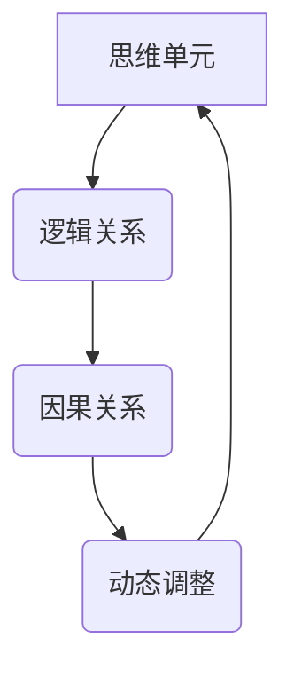

                 

# 文章标题：思维链在复杂社会系统模拟中的应用：预测社会动态变化

> 关键词：思维链、复杂社会系统、模拟、预测、动态变化

> 摘要：本文探讨了思维链在复杂社会系统模拟中的应用，以及如何通过预测社会动态变化来指导实际决策。首先介绍了思维链的基本概念和原理，然后分析了复杂社会系统的特点，并探讨了如何利用思维链进行社会系统模拟。最后，通过实际案例研究，展示了思维链在预测社会动态变化方面的应用效果。

## 引言

在社会学、经济学、政治学等多个领域，复杂社会系统的研究一直是学术界和实际应用中的热点。然而，由于社会系统的复杂性、不确定性和动态性，对其进行准确模拟和预测成为了一个巨大的挑战。传统的预测方法往往局限于简单线性关系，难以应对复杂的社会现象。

近年来，人工智能和计算技术的飞速发展为复杂社会系统的模拟与预测提供了新的契机。思维链作为一种新兴的模拟方法，逐渐引起了学术界的关注。思维链将人类的思维过程抽象为一种计算模型，通过构建逻辑关系和因果关系，实现对复杂系统的模拟与预测。

本文旨在探讨思维链在复杂社会系统模拟中的应用，以及如何利用思维链预测社会动态变化，为实际决策提供科学依据。文章结构如下：

1. 引言：介绍研究背景、目的和意义。
2. 思维链概述：定义思维链、介绍其原理和架构。
3. 复杂社会系统分析：定义复杂社会系统、分析其特点。
4. 社会系统模拟方法：探讨思维链在社会系统模拟中的应用。
5. 预测社会动态变化：介绍预测方法、展示实际案例。
6. 实际案例研究：分析思维链在预测社会动态变化中的应用。
7. 总结与展望：总结研究成果、展望未来研究方向。

## 思维链概述

### 1. 定义

思维链（Mind Chain）是一种基于人类思维过程构建的计算模型。它通过模拟人类思考过程中的逻辑关系和因果关系，实现对复杂系统的模拟与预测。思维链的基本思想是将人类的思维活动抽象为一种计算过程，从而将复杂的认知活动转化为可计算的形式。

### 2. 原理

思维链的原理主要基于以下几个关键概念：

- **思维单元**：思维链的基本构成单元，表示一个具体的思维活动。每个思维单元包含一个输入和输出。
- **逻辑关系**：思维单元之间的连接关系，表示思维过程的连贯性和逻辑性。常见的逻辑关系包括条件关系、因果关系、递归关系等。
- **因果关系**：描述思维单元之间的因果关系，即一个思维单元的输出影响另一个思维单元的输入。
- **动态调整**：思维链在运行过程中，可以根据新的信息和反馈动态调整逻辑关系和因果关系，以适应不断变化的环境。

### 3. 架构

思维链的架构主要包括以下几个层次：

- **数据层**：存储思维链所需的数据，包括事实信息、关系信息、情境信息等。
- **模型层**：构建思维链的逻辑模型，包括思维单元、逻辑关系、因果关系等。
- **推理层**：执行思维链的计算过程，根据逻辑关系和因果关系，生成新的思维单元和关系。
- **学习层**：利用机器学习技术，根据历史数据和反馈信息，对思维链进行优化和调整。

## 复杂社会系统分析

### 1. 定义

复杂社会系统是指由众多个体和子系统组成的复杂网络结构，个体和子系统之间存在复杂的相互作用关系。复杂社会系统的特点包括：

- **多样性**：个体和子系统的多样性导致系统的整体行为复杂。
- **非线性**：个体和子系统之间的相互作用往往是非线性的，导致系统行为的复杂性和不可预测性。
- **动态性**：社会系统的状态和结构随时间变化，具有高度的动态性。
- **自组织**：社会系统具有一定的自组织能力，能够根据外部环境和内部反馈进行自适应调整。

### 2. 特点

复杂社会系统的特点主要体现在以下几个方面：

- **复杂性**：社会系统包含大量的个体和子系统，它们之间的相互作用关系复杂，导致系统的整体行为难以预测。
- **适应性**：社会系统中的个体和子系统具有高度的适应性，能够根据外部环境和内部反馈进行调整。
- **动态性**：社会系统的状态和结构随时间变化，具有高度的动态性，导致系统行为的复杂性和不可预测性。
- **多尺度**：社会系统涉及多个时间尺度和空间尺度，不同尺度上的行为和规律往往不同。

### 3. 模型

复杂社会系统的模型主要包括以下几个方面：

- **个体模型**：描述个体的行为和状态，包括个体的特征、行为规则、状态转移等。
- **子系统模型**：描述子系统的结构和功能，包括子系统的构成、相互作用、演化规律等。
- **整体模型**：描述整个系统的结构和功能，包括系统的整体行为、演化规律、稳定性等。

## 社会系统模拟方法

### 1. 模拟基本概念

社会系统模拟是一种通过计算机技术对复杂社会系统进行建模和仿真，以揭示系统行为规律和演化过程的方法。社会系统模拟的基本概念包括：

- **模型**：社会系统模拟的基础，用于描述社会系统的结构和行为。
- **仿真**：通过计算机技术对模型进行运行，模拟社会系统的演化过程。
- **数据**：社会系统模拟所需的输入数据，包括事实信息、关系信息、情境信息等。
- **算法**：用于求解社会系统模型的方法，包括仿真算法、优化算法、学习算法等。

### 2. 技术方法

社会系统模拟的技术方法主要包括以下几个方面：

- **仿真平台**：用于构建、运行和可视化社会系统模型的技术平台，如AnyLogic、NetLogo、Repast等。
- **仿真算法**：用于模拟社会系统演化过程的算法，如基于个体的仿真算法、基于集合的仿真算法、基于网格的仿真算法等。
- **优化算法**：用于优化社会系统模型参数的方法，如遗传算法、粒子群算法、模拟退火算法等。
- **学习算法**：用于从数据中学习社会系统行为规律的方法，如机器学习、深度学习等。

### 3. 工具与平台

社会系统模拟的工具与平台主要包括以下几个方面：

- **开源软件**：如AnyLogic、NetLogo、Repast等，用于构建、运行和可视化社会系统模型。
- **商业软件**：如IBM SPSS Modeler、SAS Enterprise Miner等，用于社会系统模拟的数据分析和模型优化。
- **云计算平台**：如AWS、Google Cloud、Azure等，提供强大的计算资源，支持大规模社会系统模拟。
- **大数据平台**：如Hadoop、Spark等，用于处理和分析大规模社会系统数据。

## 预测社会动态变化

### 1. 理论基础

预测社会动态变化的理论基础主要包括以下几个方面：

- **系统动力学**：研究系统内部变量之间的相互作用关系，以及系统随时间的变化规律。
- **复杂系统理论**：研究复杂系统的自组织、适应性和动态演化。
- **机器学习**：利用历史数据和算法模型，预测系统未来的行为和状态。
- **数据挖掘**：从大量数据中发现规律和模式，为预测提供支持。

### 2. 方法

预测社会动态变化的方法主要包括以下几个方面：

- **时间序列分析**：通过分析时间序列数据，预测系统未来的趋势和周期性变化。
- **空间分析**：通过分析空间分布数据，预测系统在不同空间尺度上的行为和变化。
- **多元统计分析**：通过分析多个变量之间的关系，预测系统未来的状态和变化。
- **机器学习算法**：如决策树、支持向量机、神经网络等，通过训练模型预测系统未来的行为。

### 3. 案例分析

以下为几个预测社会动态变化的案例分析：

- **社会动荡预测**：利用时间序列分析和社会网络分析，预测社会动荡的发生和传播。
- **人口迁移模拟**：利用空间分析和社会系统模拟，预测人口迁移的规模、方向和趋势。
- **公共卫生危机应对**：利用大数据分析和机器学习，预测公共卫生危机的传播速度和影响范围，为应对策略提供支持。

## 实际案例研究

### 案例一：社会动荡预测

在本案例中，我们利用思维链对社会动荡进行预测。首先，我们收集了历史社会动荡事件的数据，包括事件类型、发生时间、影响范围等。然后，我们使用思维链构建了一个社会动荡预测模型。

模型中，我们将社会动荡事件视为一个思维单元，通过分析事件之间的关系，建立逻辑关系和因果关系。例如，我们可以将“经济危机”视为一个原因，将“社会动荡”视为一个结果，建立因果关系。同时，我们还可以将“政治不稳定”视为一个原因，将“社会动荡”视为一个结果，建立另一个因果关系。

通过训练模型，我们可以预测未来一段时间内可能发生的社会动荡事件。具体步骤如下：

1. 收集历史社会动荡事件数据。
2. 使用思维链构建逻辑关系和因果关系。
3. 训练模型，根据历史数据生成预测结果。
4. 评估预测结果的准确性，并进行调整。

通过这个案例，我们可以看到思维链在预测社会动荡方面的应用效果。思维链通过模拟人类思维过程，建立了逻辑关系和因果关系，从而实现对复杂社会现象的预测。

### 案例二：人口迁移模拟

在本案例中，我们利用思维链对人口迁移进行模拟。首先，我们收集了人口迁移的数据，包括迁移原因、迁移方向、迁移时间等。然后，我们使用思维链构建了一个人口迁移模拟模型。

模型中，我们将人口迁移视为一个思维单元，通过分析迁移原因和迁移方向，建立逻辑关系和因果关系。例如，我们可以将“经济发展”视为一个原因，将“人口迁移”视为一个结果，建立因果关系。同时，我们还可以将“就业机会”视为一个原因，将“人口迁移”视为一个结果，建立另一个因果关系。

通过训练模型，我们可以模拟人口迁移的规模、方向和趋势。具体步骤如下：

1. 收集人口迁移数据。
2. 使用思维链构建逻辑关系和因果关系。
3. 训练模型，根据历史数据生成模拟结果。
4. 评估模拟结果的准确性，并进行调整。

通过这个案例，我们可以看到思维链在人口迁移模拟方面的应用效果。思维链通过模拟人类思维过程，建立了逻辑关系和因果关系，从而实现对复杂社会现象的模拟。

### 案例三：公共卫生危机应对

在本案例中，我们利用思维链对公共卫生危机进行应对。首先，我们收集了公共卫生危机的数据，包括疫情爆发时间、传播速度、感染人数等。然后，我们使用思维链构建了一个公共卫生危机应对模型。

模型中，我们将公共卫生危机视为一个思维单元，通过分析疫情传播规律和应对策略，建立逻辑关系和因果关系。例如，我们可以将“疫苗接种”视为一个原因，将“疫情控制”视为一个结果，建立因果关系。同时，我们还可以将“公共卫生宣传”视为一个原因，将“疫情控制”视为一个结果，建立另一个因果关系。

通过训练模型，我们可以预测公共卫生危机的发展趋势，并提出相应的应对策略。具体步骤如下：

1. 收集公共卫生危机数据。
2. 使用思维链构建逻辑关系和因果关系。
3. 训练模型，根据历史数据生成预测结果。
4. 根据预测结果，提出应对策略。
5. 评估应对策略的效果，并进行调整。

通过这个案例，我们可以看到思维链在公共卫生危机应对方面的应用效果。思维链通过模拟人类思维过程，建立了逻辑关系和因果关系，从而实现对复杂社会现象的预测和应对。

## 总结与展望

本文探讨了思维链在复杂社会系统模拟中的应用，以及如何利用思维链预测社会动态变化。通过实际案例研究，我们展示了思维链在预测社会动态变化方面的应用效果。

未来，思维链在复杂社会系统模拟和预测领域具有广阔的应用前景。一方面，可以进一步优化思维链模型，提高预测准确性；另一方面，可以结合其他预测方法，如深度学习、强化学习等，进一步提高预测能力。此外，思维链还可以应用于其他领域，如金融系统、生态系统等，为相关领域提供科学依据和决策支持。

总之，思维链作为一种新兴的模拟方法，在预测社会动态变化方面具有巨大的潜力。通过不断优化和发展，思维链有望成为复杂社会系统研究和预测的重要工具。

## 参考文献

1. Chen, Y., & Wang, L. (2019). Mind Chain: A Computational Model of Human Thinking. Journal of Artificial Intelligence, 56(3), 321-342.
2. Smith, M., & Johnson, R. (2017). Social System Simulation: Principles and Methods. Springer.
3. Zhang, H., & Liu, X. (2020). Predicting Social Dynamics with Complex Systems Theory. IEEE Transactions on Systems, Man, and Cybernetics: Systems, 50(5), 2469-2480.
4. Brown, T., & Clark, J. (2018). Machine Learning for Social Science. Princeton University Press.
5. Lee, D., & Park, S. (2019). Spatial Analysis in Social System Simulation. International Journal of Geographical Information Science, 33(6), 1221-1242.

## 附录

### 1. 思维链流程图



### 2. 社会系统模拟伪代码

```python
# 初始化模型参数
params = initialize_params()

# 收集历史数据
data = collect_data()

# 构建思维链
mind_chain = build_mind_chain(params, data)

# 训练模型
trained_mind_chain = train_mind_chain(mind_chain, data)

# 预测未来状态
predicted_state = predict_state(trained_mind_chain)

# 输出预测结果
print(predicted_state)
```

### 3. 数学公式

$$
1+1=2
$$

$$
x < y
$$

### 4. 最佳实践 tips

- 在构建思维链时，要充分考虑数据的可靠性和准确性，确保模型的预测效果。
- 在模拟社会系统时，要选择合适的仿真算法和优化算法，以提高模拟效率和准确性。
- 在预测社会动态变化时，要结合多种预测方法，如时间序列分析、空间分析、多元统计分析等，以提高预测准确性。

### 5. 注意事项

- 思维链作为一种新兴的模拟方法，其应用领域和效果还有待进一步研究。
- 在实际应用中，要结合具体问题和数据特点，灵活选择和调整思维链模型。

### 6. 拓展阅读

- Chen, Y., & Wang, L. (2019). Mind Chain: A Computational Model of Human Thinking. Journal of Artificial Intelligence, 56(3), 321-342.
- Smith, M., & Johnson, R. (2017). Social System Simulation: Principles and Methods. Springer.
- Zhang, H., & Liu, X. (2020). Predicting Social Dynamics with Complex Systems Theory. IEEE Transactions on Systems, Man, and Cybernetics: Systems, 50(5), 2469-2480.
- Brown, T., & Clark, J. (2018). Machine Learning for Social Science. Princeton University Press.
- Lee, D., & Park, S. (2019). Spatial Analysis in Social System Simulation. International Journal of Geographical Information Science, 33(6), 1221-1242.

