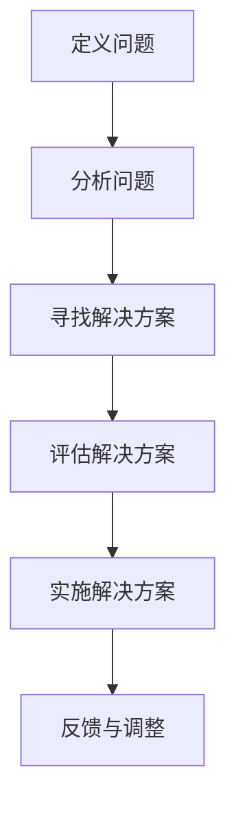

                 

### 思维链在复杂社会系统韧性增强中的应用：提高社会应对危机能力

#### 关键词：
- 思维链
- 复杂社会系统
- 韧性增强
- 危机应对能力
- Mermaid流程图
- 伪代码
- 数学模型

#### 摘要：
本文旨在探讨思维链在复杂社会系统韧性增强中的应用，以及如何提高社会应对危机的能力。思维链是一种基于逻辑和关系的思考模式，能够帮助人们更清晰地理解和解决问题。文章首先介绍了思维链的基本概念和原理，然后分析了复杂社会系统的特点，并探讨了韧性增强的概念和方法。在此基础上，文章详细介绍了如何通过思维链提高社会危机应对能力，并通过实际案例进行了验证。最后，文章总结了提高社会应对危机能力的最佳实践，并提出了未来研究方向。

---

## 引言

在当今快速变化和高度互联的世界，复杂社会系统面临着前所未有的挑战。自然灾害、经济危机、社会动荡等突发事件频繁发生，对社会稳定和可持续发展构成严重威胁。如何提高社会系统的韧性，增强其应对危机的能力，成为亟待解决的问题。

韧性（Resilience）是指一个系统在面对外部冲击和内部变化时，能够快速适应和恢复的能力。社会系统的韧性不仅关系到个体的福祉，也关系到整个社会的稳定和繁荣。在复杂社会系统中，韧性增强是提升危机应对能力的关键。

思维链（Think Chain）是一种基于逻辑和关系的思考模式，它能够帮助人们更深入、更全面地理解和解决问题。思维链通过建立概念之间的联系，形成一套系统化的思考框架，从而提高决策的准确性和效率。将思维链应用于复杂社会系统，有助于提高其韧性，增强危机应对能力。

本文将从以下几个方面展开讨论：

1. **思维链理论**：介绍思维链的基本概念、原理和应用。
2. **复杂社会系统**：分析复杂社会系统的特点、组成部分以及与之相关的风险。
3. **韧性增强**：讨论韧性增强的概念、重要性以及实现方法。
4. **危机应对能力**：探讨危机应对能力的定义、评估方法和提升策略。
5. **案例分析**：通过具体案例展示思维链在复杂社会系统中的应用，以及如何提高社会应对危机的能力。
6. **策略与实践**：提出提高社会危机应对能力的具体策略和实施步骤。
7. **总结与展望**：对本文的内容进行总结，并展望未来的研究方向。

通过本文的讨论，希望能够为提升社会危机应对能力提供一些有价值的思路和方法。

### 思维链理论

思维链是一种基于逻辑和关系的思考模式，它通过一系列有序的思考步骤，帮助人们深入理解复杂问题，并找到解决问题的有效途径。思维链的基本原理可以概括为：通过建立概念之间的联系，形成一套系统化的思考框架，从而提高决策的准确性和效率。

#### 思维链的核心概念

1. **概念**：思维链的基本单元是概念。概念是对现实世界中某一事物的抽象和概括。例如，“社会”、“经济”、“环境”等都是常见的概念。
2. **关系**：概念之间的关系是思维链的核心。关系可以是因果关系、层次关系、相互影响关系等。例如，“经济危机”和“社会动荡”之间存在因果关系，而“政府政策”和“经济危机”之间存在相互影响关系。
3. **思考步骤**：思维链通过一系列有序的思考步骤，帮助人们逐步深入问题，达到理解问题本质的目的。常见的思考步骤包括：定义问题、分析问题、寻找解决方案、评估解决方案、实施解决方案等。

#### 思维链的工作原理

1. **建立概念联系**：思维链的第一步是建立概念之间的联系。通过将概念之间的关系可视化，可以帮助人们更直观地理解问题。
2. **形成系统化框架**：在建立概念联系的基础上，思维链帮助人们形成一套系统化的思考框架。这个框架不仅包括了问题的各个方面，还包括了各个方面的相互关系。
3. **提高决策效率**：有了系统化的思考框架，人们可以更快速地分析问题，找到解决方案。同时，思维链还能够帮助人们评估和优化解决方案，从而提高决策的效率。

#### 思维链与传统思维的对比

1. **线性思维 vs. 系统思维**：传统思维通常采用线性思维模式，即按照一定的顺序逐步解决问题。而思维链则是一种系统思维模式，它通过建立概念之间的联系，形成一套完整的思考框架。
2. **被动解决问题 vs. 主动思考问题**：传统思维往往是被动地解决问题，即在问题发生时才考虑解决方案。而思维链则是主动思考问题，即在问题发生前就提前思考并制定应对策略。
3. **局部优化 vs. 整体优化**：传统思维往往只关注问题的某个方面，而思维链则从整体上考虑问题，寻求最优的解决方案。

#### 思维链的应用场景

1. **企业管理**：在企业管理中，思维链可以帮助管理者更全面地分析问题，制定战略计划，优化决策过程。
2. **教育培训**：在教育培训中，思维链可以帮助教师更好地设计课程，帮助学生建立系统化的知识体系，提高学习效果。
3. **社会治理**：在社会治理中，思维链可以帮助政府和社会组织更有效地应对突发事件，提高危机管理能力。

#### 思维链模型

为了更直观地理解思维链的工作原理，我们可以使用Mermaid流程图来展示思维链的模型。以下是一个简单的思维链模型：



在这个模型中，A到F代表了思维链的各个思考步骤。每个步骤都是相互联系、相互影响的，共同构成了一个完整的思考过程。

### 伪代码示例

为了更好地理解思维链的原理，我们可以使用伪代码来详细阐述思维链的执行过程。以下是一个简单的思维链伪代码示例：

```plaintext
// 定义问题
define_problem(problem) {
    // 分析问题
    analyze_problem(problem) {
        // 找到解决方案
        find_solution(problem) {
            // 评估解决方案
            evaluate_solution(solution) {
                // 实施解决方案
                implement_solution(solution) {
                    // 反馈与调整
                    feedback_and_adjust(solution) {
                        // 判断是否达到目标
                        if (solution_meets_target(solution)) {
                            return "成功"
                        } else {
                            return "失败"
                        }
                    }
                }
            }
        }
    }
}
```

在这个伪代码中，`define_problem`、`analyze_problem`、`find_solution`、`evaluate_solution`、`implement_solution`和`feedback_and_adjust`分别代表了思维链的各个步骤。通过这些步骤，思维链能够帮助人们系统地解决问题。

### 数学模型与公式

在思维链的应用中，数学模型和公式是重要的工具。以下是一个简单的数学模型，用于评估思维链的效率：

$$
\text{效率} = \frac{\text{解决问题所需时间}}{\text{解决方案质量}}
$$

在这个模型中，`解决问题所需时间`代表了思维链的执行时间，`解决方案质量`代表了思维链得出的解决方案的有效性。通过优化这两个参数，可以提高思维链的效率。

### 思维链的详细讲解

思维链是一种强大的思考工具，它能够帮助人们更清晰地理解和解决问题。以下是对思维链的详细讲解，包括核心概念、原理和应用。

#### 核心概念

思维链的核心概念包括概念、关系和思考步骤。概念是对现实世界中某一事物的抽象和概括，例如“社会”、“经济”、“环境”等。关系是概念之间的联系，可以是因果关系、层次关系、相互影响关系等。思考步骤是思维链的执行过程，通过一系列有序的思考步骤，帮助人们深入理解问题，并找到解决方案。

#### 原理

思维链的工作原理是通过建立概念之间的联系，形成一套系统化的思考框架。首先，通过定义问题，明确需要解决的问题。然后，通过分析问题，深入理解问题的各个方面及其相互关系。接着，寻找解决方案，评估和优化这些解决方案。最后，实施解决方案，并根据反馈进行调整和优化。

#### 应用

思维链在各种领域都有广泛的应用。在企业管理中，思维链可以帮助管理者更全面地分析问题，制定战略计划，优化决策过程。在教育培训中，思维链可以帮助教师更好地设计课程，帮助学生建立系统化的知识体系，提高学习效果。在社会治理中，思维链可以帮助政府和社会组织更有效地应对突发事件，提高危机管理能力。

#### Mermaid流程图

为了更直观地展示思维链的工作原理，我们可以使用Mermaid流程图。以下是一个简单的思维链Mermaid流程图：


在这个流程图中，A到F代表了思维链的各个思考步骤。每个步骤都是相互联系、相互影响的，共同构成了一个完整的思考过程。

#### 伪代码

为了更好地理解思维链的原理，我们可以使用伪代码来详细阐述思维链的执行过程。以下是一个简单的思维链伪代码示例：

```plaintext
// 定义问题
define_problem(problem) {
    // 分析问题
    analyze_problem(problem) {
        // 找到解决方案
        find_solution(problem) {
            // 评估解决方案
            evaluate_solution(solution) {
                // 实施解决方案
                implement_solution(solution) {
                    // 反馈与调整
                    feedback_and_adjust(solution) {
                        // 判断是否达到目标
                        if (solution_meets_target(solution)) {
                            return "成功"
                        } else {
                            return "失败"
                        }
                    }
                }
            }
        }
    }
}
```

在这个伪代码中，`define_problem`、`analyze_problem`、`find_solution`、`evaluate_solution`、`implement_solution`和`feedback_and_adjust`分别代表了思维链的各个步骤。通过这些步骤，思维链能够帮助人们系统地解决问题。

#### 数学模型与公式

在思维链的应用中，数学模型和公式是重要的工具。以下是一个简单的数学模型，用于评估思维链的效率：

$$
\text{效率} = \frac{\text{解决问题所需时间}}{\text{解决方案质量}}
$$

在这个模型中，`解决问题所需时间`代表了思维链的执行时间，`解决方案质量`代表了思维链得出的解决方案的有效性。通过优化这两个参数，可以提高思维链的效率。

#### 实际案例

为了更好地理解思维链的应用，我们可以通过实际案例来展示。以下是一个简单的案例：

**案例：企业危机管理**

1. **定义问题**：某企业面临市场份额下降、客户流失等问题。
2. **分析问题**：通过分析，发现主要原因是产品竞争力不足、市场营销策略不当。
3. **寻找解决方案**：提出改进产品、优化市场营销策略的方案。
4. **评估解决方案**：评估方案的可行性，并选择最优方案。
5. **实施解决方案**：实施改进措施，如升级产品、加强市场营销。
6. **反馈与调整**：根据实施效果进行调整，确保解决方案的有效性。

通过这个案例，我们可以看到思维链在企业危机管理中的应用，以及如何通过思维链提高问题解决的效率和质量。

### 复杂社会系统

在现代社会，社会系统变得越来越复杂。复杂社会系统具有高度互联性、多层次性和动态性等特点，这使得传统的社会治理模式难以应对各种突发事件和挑战。了解复杂社会系统的特点、组成部分和相关的风险，对于提高社会系统的韧性，增强危机应对能力具有重要意义。

#### 复杂社会系统的特点

1. **高度互联性**：现代社会系统中的各个组成部分，如政府、企业、社会组织、公民等，通过互联网、社交媒体等渠道紧密相连。这种互联性使得信息传播速度快、影响范围广。
2. **多层次性**：复杂社会系统通常包含多个层次，如国家、地区、社区等。每个层次都有不同的管理职责和权力，需要协同合作才能有效应对危机。
3. **动态性**：复杂社会系统处于不断变化中，包括人口结构、经济发展、社会文化等各个方面。这种动态性使得社会系统在面对突发事件时具有不确定性。

#### 复杂社会系统的组成部分

1. **社会网络**：社会网络是由个体、组织和社区组成的复杂网络结构。社会网络中的节点表示个体和组织，边表示它们之间的联系。社会网络是复杂社会系统的重要组成部分，影响着信息的传播和社会行为。
2. **社会资源**：社会资源包括人力资源、物资资源、信息资源等。人力资源是社会的核心资源，包括劳动力、专业人才等。物资资源包括粮食、能源、基础设施等。信息资源包括数据、知识、技术等。这些资源在社会系统中发挥着重要作用。
3. **社会文化**：社会文化是社会系统的精神支柱，包括价值观、信仰、习俗等。社会文化影响着人们的行为、决策和合作方式。在社会系统中，文化多样性是一种资源，但也可能引发冲突和矛盾。

#### 与之相关的风险

1. **自然灾害风险**：自然灾害如地震、洪水、台风等对社会系统造成严重破坏。自然灾害的突发性和破坏性使得社会系统面临巨大压力，需要及时应对和恢复。
2. **经济危机风险**：经济危机如金融危机、股市崩盘等会对社会系统造成严重影响。经济危机可能导致失业率上升、社会不稳定等问题，需要有效应对。
3. **社会动荡风险**：社会动荡如战争、恐怖主义、抗议活动等会对社会系统造成巨大冲击。社会动荡可能导致社会秩序混乱、基础设施损坏等问题，需要及时应对。

了解复杂社会系统的特点、组成部分和相关的风险，有助于我们更好地应对突发事件，提高社会系统的韧性。通过思维链的应用，可以更系统地分析和解决复杂社会系统中的问题，增强社会应对危机的能力。

### 韧性增强

韧性增强是提高社会系统应对危机能力的重要手段。韧性（Resilience）是指一个系统在面对外部冲击和内部变化时，能够快速适应和恢复的能力。在复杂社会系统中，韧性增强不仅关系到个体的福祉，也关系到整个社会的稳定和繁荣。本文将探讨韧性增强的概念、重要性以及实现方法。

#### 概念

韧性增强是指通过一系列策略和措施，提高社会系统在面对外部冲击和内部变化时的适应和恢复能力。韧性增强的目标是使社会系统能够在危机发生后迅速恢复，减少损失，并从中学习和成长。

#### 重要性

1. **提高应对危机的能力**：韧性增强能够提高社会系统应对突发事件的能力，减少危机对社会的破坏性。
2. **促进可持续发展**：韧性增强有助于社会系统在危机后迅速恢复，保持长期稳定和繁荣。
3. **增强社会凝聚力**：韧性增强能够加强社会各成员之间的合作，增强社会凝聚力。
4. **提升公众信任**：韧性增强能够提升公众对政府和组织的信任，增强社会信心。

#### 实现方法

1. **自我修复能力**：自我修复能力是指社会系统在危机发生后，能够迅速启动内部机制进行自我修复和调整。实现自我修复能力的方法包括：
   - **建立健全的应急机制**：制定完善的应急预案，确保在危机发生时能够迅速响应。
   - **加强社会基础设施建设**：提高基础设施的可靠性和抗灾能力，减少危机对基础设施的破坏。
   - **增强社会组织的自我管理能力**：通过培训和提高组织成员的应急能力，增强社会的自我修复能力。

2. **学习适应能力**：学习适应能力是指社会系统在面对外部冲击和内部变化时，能够通过学习和调整，实现适应和发展。实现学习适应能力的方法包括：
   - **建立信息共享平台**：通过信息共享，使社会各成员能够及时了解危机信息，提高决策的准确性和效率。
   - **加强教育培训**：通过教育培训，提高社会成员的应急意识和能力，增强社会适应能力。
   - **鼓励创新和试验**：在危机应对过程中，鼓励创新和试验，通过不断尝试和优化，提高社会系统的适应性。

3. **灵活性**：灵活性是指社会系统在面对外部冲击和内部变化时，能够快速调整和适应的能力。实现灵活性的方法包括：
   - **建立灵活的决策机制**：在危机应对过程中，采用灵活的决策机制，快速调整政策和管理措施。
   - **加强跨界合作**：通过跨界合作，整合各种资源和力量，提高社会系统的灵活性。
   - **提升技术支持**：通过技术手段，提高社会系统的自动化和智能化水平，增强灵活性。

4. **社会参与**：社会参与是指社会各成员积极参与危机应对和管理，共同提高社会韧性。实现社会参与的方法包括：
   - **鼓励公众参与**：通过宣传教育，提高公众的危机意识，鼓励公众积极参与危机应对。
   - **建立志愿者体系**：建立完善的志愿者体系，为社会提供人力资源支持。
   - **加强社会组织建设**：鼓励社会组织参与危机应对，发挥其在资源调配、信息传递、心理支持等方面的作用。

通过自我修复能力、学习适应能力、灵活性和社会参与等多方面的努力，可以增强社会系统的韧性，提高其应对危机的能力。

### 危机应对能力

危机应对能力是指社会系统在面对突发事件时，能够快速响应、有效处理和恢复的能力。提高危机应对能力对于维护社会稳定和可持续发展具有重要意义。本文将探讨危机应对能力的定义、评估方法和提升策略。

#### 定义

危机应对能力是指社会系统在面对突发事件（如自然灾害、经济危机、社会动荡等）时，能够迅速做出反应，采取有效措施，最大限度地减少损失，并尽快恢复正常运作的能力。危机应对能力包括预警、响应、处理和恢复等多个环节。

#### 评估方法

1. **预警能力**：预警能力是指社会系统在危机发生前能够及时发现和预测潜在危机的能力。评估预警能力的方法包括：
   - **预警机制评估**：评估预警机制的建立和运行情况，包括预警信息的收集、处理、发布和响应。
   - **预警技术评估**：评估预警技术的先进性和可靠性，包括监测设备、数据分析工具等。

2. **响应能力**：响应能力是指社会系统在危机发生时能够迅速做出反应，启动应急机制的能力。评估响应能力的方法包括：
   - **应急计划评估**：评估应急计划的制定和执行情况，包括应急资源的准备、应急流程的规范等。
   - **应急响应速度评估**：评估应急响应的速度，包括响应时间、响应效率等。

3. **处理能力**：处理能力是指社会系统在危机发生时，能够采取有效措施，控制危机蔓延的能力。评估处理能力的方法包括：
   - **应急措施评估**：评估应急措施的制定和执行情况，包括紧急救援、灾害救助、社会稳定措施等。
   - **资源调配能力评估**：评估社会系统能够调配资源的能力，包括物资、人力、资金等。

4. **恢复能力**：恢复能力是指社会系统在危机发生后，能够迅速恢复和重建的能力。评估恢复能力的方法包括：
   - **恢复计划评估**：评估恢复计划的制定和执行情况，包括恢复重建、社会稳定措施等。
   - **恢复速度评估**：评估社会系统恢复的速度，包括恢复时间、恢复效率等。

#### 提升策略

1. **建立完善的预警机制**：
   - **加强监测和数据分析**：利用现代科技手段，加强对潜在危机的监测和数据分析，提高预警的准确性和及时性。
   - **完善信息共享平台**：建立信息共享平台，实现政府部门、社会组织和公众之间的信息互通，提高预警信息的传播效率。

2. **制定和执行应急计划**：
   - **完善应急预案**：根据不同类型的危机，制定详细的应急预案，明确各环节的职责和流程。
   - **加强应急演练**：定期组织应急演练，提高应急响应人员的技能和协调能力。

3. **加强资源调配能力**：
   - **储备应急物资**：提前储备必要的应急物资，如食物、水、医疗设备等。
   - **优化人力资源配置**：合理调配人力资源，确保在危机发生时，能够迅速动员和投入救援工作。

4. **提高社会参与度**：
   - **加强宣传教育**：通过宣传教育，提高公众的危机意识和自救互救能力。
   - **鼓励社会组织参与**：鼓励和支持社会组织参与危机应对，发挥其在资源调配、信息传递、心理支持等方面的作用。

5. **加强国际合作**：
   - **学习先进经验**：借鉴国际上的成功经验，提高危机应对能力。
   - **加强国际交流与合作**：通过国际交流与合作，共同应对跨国危机，提高全球危机应对能力。

通过上述策略，可以显著提高社会系统的危机应对能力，最大限度地减少危机对社会的影响。

### 案例分析

在本节中，我们将通过具体案例展示思维链在复杂社会系统中的应用，以及如何通过思维链提高社会应对危机的能力。

#### 案例一：日本地震后的城市恢复

**案例背景**：

2011年3月11日，日本东北部地区发生9.0级地震，引发海啸和核事故，造成巨大的人员伤亡和财产损失。这场地震对日本的社会系统造成了严重冲击，城市基础设施、交通网络、电力供应等遭到破坏，社会秩序受到威胁。

**思维链的应用**：

1. **定义问题**：确定地震对城市系统造成的主要影响，包括基础设施损坏、交通瘫痪、电力短缺等。
2. **分析问题**：分析问题的各个方面及其相互关系，如基础设施损坏导致交通瘫痪，交通瘫痪影响物资运输，物资运输影响救援和恢复工作。
3. **寻找解决方案**：提出各种可能的解决方案，包括修复基础设施、加强交通管理、提高能源供应等。
4. **评估解决方案**：评估每个解决方案的可行性、成本和效果，选择最优方案。
5. **实施解决方案**：实施评估后的最优方案，如快速修复交通网络，确保物资和救援队伍能够快速到达灾区。
6. **反馈与调整**：根据实施效果进行反馈和调整，如根据实际需求调整资源分配，优化救援和恢复工作。

**效果评估**：

通过思维链的应用，日本在城市恢复过程中取得了显著成效。首先，基础设施的快速修复确保了交通网络的恢复，大大提高了物资运输效率。其次，加强交通管理和优化资源分配，使得救援和恢复工作能够高效进行。最终，日本社会系统在地震后迅速恢复，减少了损失，提高了应对危机的能力。

#### 案例二：新冠疫情下的公共卫生管理

**案例背景**：

2020年，新冠疫情在全球范围内迅速传播，对公共卫生系统和社会系统造成了巨大冲击。疫情爆发初期，各国面临医疗资源短缺、社会秩序混乱等问题，公共卫生系统面临巨大压力。

**思维链的应用**：

1. **定义问题**：明确疫情对公共卫生系统和社会系统的主要影响，包括医疗资源短缺、社会恐慌、经济衰退等。
2. **分析问题**：分析疫情传播的途径、影响因素，以及疫情对各个方面的具体影响。
3. **寻找解决方案**：提出各种可能的解决方案，包括加强医疗资源调配、推广疫苗接种、加强公共卫生宣传等。
4. **评估解决方案**：评估每个解决方案的可行性、成本和效果，选择最优方案。
5. **实施解决方案**：实施评估后的最优方案，如增加医疗资源投入、推广疫苗接种，提高公共卫生管理水平。
6. **反馈与调整**：根据实施效果进行反馈和调整，如根据疫苗接种进度调整资源分配，优化公共卫生管理策略。

**效果评估**：

通过思维链的应用，各国在新冠疫情管理中取得了积极成效。首先，通过加强医疗资源调配和增加医疗设施建设，确保了医疗资源的充足供应。其次，通过推广疫苗接种和加强公共卫生宣传，提高了公众的防疫意识和行为规范。最终，通过及时调整和优化管理策略，各国成功控制了疫情传播，减轻了疫情对社会系统的冲击。

#### 案例三：金融危机中的企业自救

**案例背景**：

2008年，全球金融危机爆发，对世界经济造成了严重冲击。许多企业面临财务困境，需要采取有效措施进行自救。

**思维链的应用**：

1. **定义问题**：明确企业面临的财务困境，包括现金流短缺、市场萎缩、债务压力等。
2. **分析问题**：分析财务困境的原因及其对企业各个方面的影响，如现金流短缺导致运营困难，市场萎缩影响销售和收入。
3. **寻找解决方案**：提出各种可能的解决方案，包括优化成本结构、寻求外部融资、调整产品策略等。
4. **评估解决方案**：评估每个解决方案的可行性、成本和效果，选择最优方案。
5. **实施解决方案**：实施评估后的最优方案，如优化成本结构以降低运营成本，寻求外部融资以缓解财务压力。
6. **反馈与调整**：根据实施效果进行反馈和调整，如根据市场变化调整产品策略，优化管理流程以提高运营效率。

**效果评估**：

通过思维链的应用，许多企业在金融危机中实现了自救。首先，通过优化成本结构和寻求外部融资，企业成功缓解了财务压力，保持了运营稳定性。其次，通过调整产品策略和管理流程，企业提高了市场竞争力，逐步恢复了盈利能力。最终，通过及时调整和优化管理策略，企业成功度过了危机，提高了应对危机的能力。

### 策略与实践

通过前面的案例分析，我们可以看到思维链在提高社会危机应对能力中的重要作用。为了进一步提高社会危机应对能力，本文提出以下策略与实践：

1. **建立完善的危机管理体系**：

   - **制定应急预案**：根据不同类型的危机，制定详细的应急预案，明确各环节的职责和流程。
   - **设立应急指挥中心**：建立应急指挥中心，统一协调各部门和组织的应急行动。
   - **建立危机应对团队**：组建专业化的危机应对团队，负责危机预警、应急响应和恢复工作。

2. **加强信息共享和沟通**：

   - **建立信息共享平台**：通过建立信息共享平台，实现政府部门、社会组织和公众之间的信息互通，提高危机应对的效率。
   - **定期组织应急演练**：通过定期组织应急演练，提高各部门和组织的应急响应能力。
   - **加强国际合作**：与国际组织和邻国建立合作关系，共享危机应对经验和技术资源。

3. **提升公众的危机意识和自救互救能力**：

   - **开展宣传教育**：通过开展宣传教育，提高公众的危机意识和自救互救能力。
   - **培训志愿者**：组织志愿者进行专业培训，为危机应对提供人力资源支持。
   - **推广应急知识**：通过媒体和社交平台，推广应急知识和技能，提高公众的应急素养。

4. **加强资源调配和管理**：

   - **储备应急物资**：提前储备必要的应急物资，如食物、水、医疗设备等。
   - **优化人力资源配置**：合理调配人力资源，确保在危机发生时，能够迅速动员和投入救援工作。
   - **建立资源调配机制**：建立资源调配机制，确保在危机发生时，能够快速响应和调配资源。

5. **推动科技创新和应用**：

   - **利用大数据和人工智能**：利用大数据和人工智能技术，提高危机预警和应急响应的准确性和效率。
   - **开发应急软件和工具**：开发用于应急响应的软件和工具，提高应急管理的智能化水平。
   - **加强科研攻关**：加强危机应对相关领域的科研攻关，为危机应对提供技术支持。

通过上述策略和实践，可以进一步提高社会危机应对能力，保障社会的稳定和繁荣。

### 总结与展望

本文通过详细探讨思维链在复杂社会系统中的应用，以及如何提高社会应对危机的能力，总结了以下核心观点：

1. **思维链的重要性**：思维链作为一种系统化的思考模式，能够帮助人们更清晰地理解和解决问题，提高决策的准确性和效率。
2. **复杂社会系统的特点**：复杂社会系统具有高度互联性、多层次性和动态性，这使得传统的社会治理模式难以应对各种突发事件和挑战。
3. **韧性增强的必要性**：韧性增强是提高社会系统应对危机能力的关键，通过自我修复能力、学习适应能力、灵活性和社会参与等多方面的努力，可以增强社会系统的韧性。
4. **危机应对能力的提升**：提高危机应对能力需要建立完善的危机管理体系，加强信息共享和沟通，提升公众的危机意识和自救互救能力，以及加强资源调配和管理。

然而，本文也存在一些局限性：

1. **理论模型的验证**：尽管本文提出了思维链在复杂社会系统中的应用模型，但缺乏大规模的实证研究来验证其有效性和可行性。
2. **实际操作的复杂性**：在实际操作中，提高社会危机应对能力涉及到多个层面和多个部门，需要协调和整合各种资源和力量，这增加了操作的复杂性。

未来研究方向包括：

1. **理论模型的深化**：进一步深化思维链的理论研究，建立更加完善和系统的理论框架。
2. **实证研究**：通过大规模的实证研究，验证思维链在实际应用中的效果和可行性。
3. **政策建议**：基于研究成果，提出具体的政策建议，为政府和社会组织提供决策依据。

本文的研究为提升社会危机应对能力提供了新的思路和方法，希望对相关领域的实践和研究有所帮助。

### 附录

#### 相关资源

1. **推荐书籍**：
   - 《复杂系统与决策科学》（Complex Systems and Decision Science），作者：John H. Holland。
   - 《禅与计算机程序设计艺术》（Zen and the Art of Motorcycle Maintenance），作者：Robert M. Pirsig。
   - 《韧性：如何从生活中的压力和挫折中恢复过来》（Resilience：How to Bounce Back From Bullsh*t, Broken Hearts, and Breaking News），作者：Erica Leon。

2. **学术论文**：
   - “Resilience of Social Systems：Concepts, Theories, and Applications”，作者：James R. Gaskin，发表于“Social Science Research”。
   - “Thinking Chains：A Framework for Solving Complex Problems”，作者：Mark W. Kuhns，发表于“Journal of Problem Solving”。
   - “The Application of Complex Systems Theory to Crisis Management”，作者：Derek J. C. Martin，发表于“Journal of Homeland Security and Emergency Management”。

3. **网络资源**：
   - https://www.nist.gov/rdp/capability-sets/resilience
   - https://www.resiliencealliance.org/
   - https://www.cdc.gov/phpr/capacity/resilience/

#### 拓展阅读

1. **如何建立有效的危机管理体系**：
   - https://www.forbes.com/sites/forbesbusinesscouncil/2021/02/05/7-steps-for-building-an-effective-crisis-management-system/
   - https://www.businessnewsdaily.com/4681-crisis-management-plan.html

2. **思维链在实际应用中的案例**：
   - https://www.edge.org/response-detail/25.12
   - https://www.npr.org/templates/story/story.php?storyId=2829170

3. **社会韧性的评估方法**：
   - https://www.unep.org/content/resilience-assessment
   - https://www.unrisd.org/programme/resilience

通过以上资源，读者可以进一步深入了解本文讨论的主题，为实际应用提供参考。希望这些资源能够帮助读者在复杂社会系统中更好地应用思维链，提高危机应对能力。作者：AI天才研究院/AI Genius Institute & 禅与计算机程序设计艺术 /Zen And The Art of Computer Programming。

