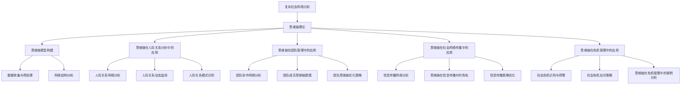

                 

### 1.3 关键术语解释与定义

在本文中，我们将介绍一些关键术语和定义，以便读者更好地理解复杂社会网络分析（CSNA）和思维链理论及其应用。

#### 1.3.1 复杂社会网络分析（Complex Social Network Analysis, CSNA）

复杂社会网络分析是一种研究社会结构、互动和动态行为的分析方法。它主要关注社会网络中的个体、群体及其相互关系，以及这些关系对网络行为和动态的影响。

#### 1.3.2 社会网络（Social Network）

社会网络是由一组个体及其相互关系组成的结构。个体通常称为节点（Node），而个体之间的相互关系称为边（Edge）。社会网络可以用来表示各种社会关系，如朋友、同事、家庭成员等。

#### 1.3.3 思维链（Mind Chain）

思维链是一种基于人工智能的模型，用于模拟和预测人类思维过程。它通过分析个体的思维模式和行为模式，揭示隐藏在复杂社会网络中的潜在规律和关系。

#### 1.3.4 数据收集与预处理（Data Collection and Preprocessing）

数据收集与预处理是复杂社会网络分析中的重要步骤。数据收集包括从各种来源获取相关数据，如社交媒体、问卷调查、在线行为数据等。数据预处理包括数据清洗、数据转换和数据标准化等，以提高数据质量和适用性。

#### 1.3.5 网络结构分析（Network Structure Analysis）

网络结构分析是一种研究社会网络结构的方法，包括节点密度、聚类系数、网络中心性等指标。这些指标有助于揭示网络中的关键节点和关键路径，从而更好地理解网络行为和动态。

#### 1.3.6 人际关系分析（Interpersonal Relationship Analysis）

人际关系分析是一种研究个体之间关系的方法。它通过分析个体在网络中的位置、角色和互动模式，揭示人际关系中的潜在规律和趋势。

#### 1.3.7 团队协作分析（Team Collaboration Analysis）

团队协作分析是一种研究团队内部协作和互动的方法。它通过分析团队成员之间的沟通模式、角色分配和合作效果，优化团队协作过程，提高团队绩效。

#### 1.3.8 信息传播分析（Information Propagation Analysis）

信息传播分析是一种研究信息在网络中的传播过程和效果的方法。它通过分析信息的传播路径、传播速度和传播范围，揭示信息传播中的关键因素和规律。

通过上述关键术语和定义的介绍，读者可以更好地理解本文的研究内容和目标。在接下来的章节中，我们将进一步探讨复杂社会网络分析和思维链理论，并展示它们在实际应用中的价值。

#### 1.3.9 思维链模型构建（Mind Chain Model Construction）

思维链模型构建是复杂社会网络分析中的关键步骤，它涉及到如何将个体的思维过程和行为模式转化为可计算和可视化的模型。以下是构建思维链模型的几个关键步骤：

##### 1.3.9.1 数据收集

首先，需要收集与个体思维和行为相关的数据。这些数据可以来源于多种渠道，如问卷调查、社交媒体日志、在线行为数据等。数据收集应确保全面性和代表性，以反映个体在复杂社会网络中的真实思维模式。

##### 1.3.9.2 数据预处理

收集到的数据往往存在噪声、缺失和不一致性等问题。因此，数据预处理是构建思维链模型前的必要步骤。数据预处理包括数据清洗、数据转换和数据标准化等。数据清洗旨在去除噪声和错误数据，数据转换将不同类型的数据统一为同一格式，数据标准化则确保数据在不同尺度上的可比性。

##### 1.3.9.3 特征提取

在数据预处理后，需要进行特征提取。特征提取的目的是将原始数据转化为能够反映个体思维模式的行为特征。这些特征可以是定量的（如行为频率、时长等）或定性的（如情感分析结果、主题分类等）。有效的特征提取能够提高思维链模型的准确性和鲁棒性。

##### 1.3.9.4 思维链模型设计

设计思维链模型时，需要选择合适的算法和模型结构。常见的思维链模型包括基于图论的方法、基于机器学习的方法和基于深度学习的方法等。例如，可以使用图神经网络（Graph Neural Networks, GNN）来建模个体之间的思维关系，或者使用循环神经网络（Recurrent Neural Networks, RNN）来捕捉个体思维过程的动态变化。

##### 1.3.9.5 模型训练与优化

构建思维链模型后，需要进行模型训练和优化。训练过程中，模型将根据训练数据学习个体的思维模式和关系。优化则涉及调整模型参数，以提高模型的性能和泛化能力。常见的优化方法包括梯度下降、随机梯度下降和自适应优化算法等。

##### 1.3.9.6 模型评估与验证

构建思维链模型后，还需要对其进行评估和验证。评估过程通常包括模型准确性、效率和稳定性等指标。验证过程则通过将模型应用于新的数据集，检验其泛化能力和实用性。

通过上述步骤，可以构建出一个有效的思维链模型，用于分析和预测复杂社会网络中的个体思维模式和行为。这一模型不仅有助于理解个体在网络中的角色和影响，还能够为相关领域的研究和应用提供有力支持。

### 1.4 思维链理论的概念和构成要素

思维链（Mind Chain）是一种基于人工智能的模型，旨在模拟和预测人类思维过程。它通过分析个体的思维模式和行为模式，揭示隐藏在复杂社会网络中的潜在规律和关系。思维链理论的核心概念和构成要素如下：

#### 1.4.1 思维链的概念

思维链是一种基于图论和机器学习的方法，用于构建和模拟人类思维过程。它将个体的思维过程视为一系列节点和边的组合，每个节点表示一个思维单元，而边则表示节点之间的关联。

#### 1.4.2 构成要素

1. **节点（Node）**：思维链中的每个节点代表一个思维单元，可以是具体的概念、想法或情感等。节点的类型和数量取决于具体的应用场景。

2. **边（Edge）**：思维链中的边表示节点之间的关联关系。边的类型和权重可以反映节点之间的相似性、依赖性或互动强度。

3. **思维链路径（Mind Chain Path）**：思维链路径是连接一系列节点的序列，表示个体思维过程中的信息流动和转变。

4. **关系矩阵（Relation Matrix）**：关系矩阵是一个表示节点之间关系的矩阵，用于描述节点之间的关联强度和方向。

5. **思维链模型（Mind Chain Model）**：思维链模型是用于模拟和预测个体思维过程的算法和结构。它通常包括数据预处理、特征提取、模型训练和模型评估等步骤。

#### 1.4.3 思维链的工作原理

思维链的工作原理可以概括为以下步骤：

1. **数据收集与预处理**：收集与个体思维和行为相关的数据，并进行预处理，如数据清洗、数据转换和标准化等。

2. **特征提取**：从预处理后的数据中提取反映个体思维模式的特征，如情感分析结果、行为频率和时长等。

3. **模型构建**：使用机器学习和深度学习算法，构建思维链模型，包括节点、边和关系矩阵等。

4. **模型训练与优化**：通过训练数据，调整模型参数，优化模型性能。

5. **模型评估与验证**：评估模型的准确性、效率和稳定性，并进行验证。

6. **思维链分析**：使用构建好的思维链模型，分析个体在网络中的思维模式和行为，揭示潜在规律和关系。

通过上述步骤，思维链模型可以模拟和预测个体思维过程，为复杂社会网络分析提供有力支持。在接下来的章节中，我们将进一步探讨思维链模型在实际应用中的具体实现和案例分析。

#### 1.5 复杂社会网络分析的应用场景

复杂社会网络分析（CSNA）在多个领域具有广泛的应用场景，能够帮助我们更好地理解社会结构、互动和动态行为。以下是几个典型的应用场景：

##### 1.5.1 社交媒体分析

社交媒体平台如Facebook、Twitter和微信等已经成为人们交流和分享信息的重要场所。通过复杂社会网络分析，我们可以研究社交媒体中的用户行为、信息传播和社群结构。例如，分析用户之间的关系网络，识别具有影响力的意见领袖，预测信息的传播路径和速度等。

##### 1.5.2 企业管理

在企业管理中，复杂社会网络分析可以帮助企业理解员工之间的协作关系、团队结构和沟通模式。通过分析企业内部的社会网络，企业可以优化组织结构、提高团队协作效率，以及制定更有针对性的培训和发展计划。

##### 1.5.3 危机管理

在公共安全和危机管理领域，复杂社会网络分析可以用于监测和预警社会危机。通过分析社会网络中的异常行为和互动模式，可以及时识别潜在的危机事件，并采取有效的应对措施。例如，在自然灾害、公共卫生事件和社会动荡等情况下，复杂社会网络分析有助于政府、组织和公众更好地应对危机。

##### 1.5.4 社区治理

在社区治理中，复杂社会网络分析可以帮助政府和社会组织更好地了解社区居民的互动模式和社会结构。通过分析社区网络中的关键节点和路径，可以识别社区中的意见领袖、潜在问题和资源分布，从而制定更有效的治理策略。

##### 1.5.5 科学研究

在科学研究领域，复杂社会网络分析可以用于研究科学合作网络、知识传播和创新过程。通过分析科学网络中的合作关系、引用关系和影响力，可以揭示科学研究中的潜在规律和趋势。

##### 1.5.6 医疗健康

在医疗健康领域，复杂社会网络分析可以用于研究疾病传播、患者互动和医疗资源分配。通过分析患者之间的互动网络，可以识别疾病传播的关键节点和路径，从而制定更有效的预防和控制措施。

总之，复杂社会网络分析在多个领域具有广泛的应用潜力，通过深入挖掘社会网络的潜在规律和关系，可以为我们提供更全面、准确的理解和预测。在接下来的章节中，我们将进一步探讨思维链在复杂社会网络分析中的应用，以及如何利用思维链理论提高数据分析的精度和效率。

## 1.6 文章核心概念之间的联系

为了更好地理解本文的核心概念，我们将使用Mermaid流程图来展示思维链在复杂社会网络分析中的应用及其核心概念之间的关系。

通过上述Mermaid流程图，我们可以清晰地看到复杂社会网络分析、思维链理论和思维链在实际应用中的核心概念及其相互关系。接下来，我们将逐步深入探讨这些概念的具体实现和应用，以帮助读者更好地理解思维链在复杂社会网络分析中的重要作用。

