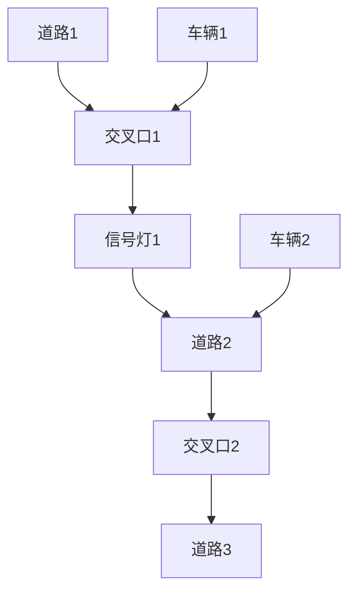
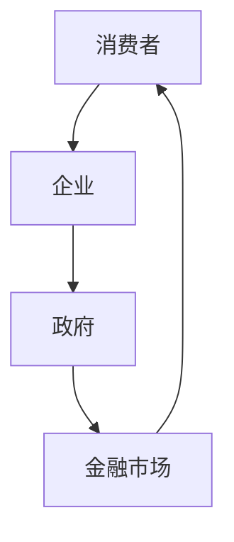
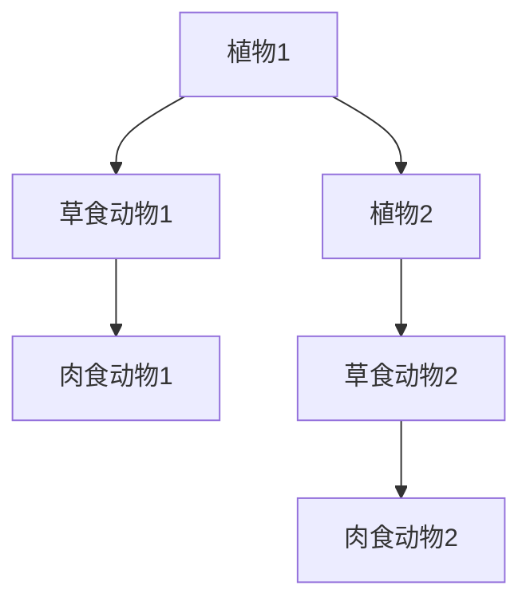

                 


### 引言

在当今信息技术飞速发展的时代，复杂系统的建模和分析已经成为各领域研究的重要课题。复杂系统通常具有高度的不确定性和动态性，其内部包含大量的变量和相互作用，这使得传统的建模方法难以应对。因此，寻求新的建模方法和技术成为研究的热点。

思维链（Mind Chain）作为一种新兴的思维方式，逐渐受到了广泛关注。思维链是一种基于网络结构的思维方法，它通过节点和边来表示知识和概念之间的关系，能够有效地帮助人们理解和分析复杂系统。思维链在复杂系统建模中的应用，不仅能够提高建模的效率和准确性，还能够深入揭示系统的内在规律。

本文旨在探讨思维链在复杂系统建模中的应用，首先介绍思维链的概念、原理及其在复杂系统建模中的重要性。接着，我们将详细分析思维链的理论基础，包括其基本原理、关键概念和应用领域。在此基础上，本文将重点讨论思维链在复杂系统建模中的应用策略、实践案例以及未来发展趋势。

通过本文的探讨，我们希望为研究人员和工程师提供一种新的视角和工具，以更好地理解和解决复杂系统建模问题。本文的结构如下：

- **第一部分：引言**：介绍复杂系统建模的背景和思维链的概念。
- **第二部分：思维链理论基础**：详细阐述思维链的基本原理、关键概念和应用领域。
- **第三部分：思维链在复杂系统建模中的应用**：分析思维链在复杂系统建模中的具体应用策略和实践案例。
- **第四部分：总结与展望**：总结思维链在复杂系统建模中的应用成果，并展望未来的研究方向。

### 思维链概述

#### 1.1 思维链的概念

思维链（Mind Chain）是一种基于网络结构的思维方式，它通过节点和边来表示知识和概念之间的关系。一个思维链通常由多个节点和连接这些节点的边组成，节点代表概念或知识单元，边则表示节点之间的关系。这些关系可以是因果关系、相似关系或依赖关系等。

思维链的概念最早可以追溯到20世纪中叶，当时的心理学家开始探索如何通过图形化方式来表示和操作思维过程。随着计算机技术的发展，思维链逐渐成为一个独立的研究领域。思维链的核心思想是，通过构建和操作网络结构，人们可以更好地理解和分析复杂的信息。

#### 1.2 思维链的重要性

思维链在复杂系统建模中的应用具有重要意义。首先，思维链能够将复杂的系统结构直观地表示出来，使得研究人员能够更容易地理解和分析系统。传统的建模方法往往依赖于数学公式和模型，这些方法虽然精确，但有时难以直观地揭示系统的内在规律。而思维链通过图形化的方式，将系统的各个部分和它们之间的关系清晰地展现出来，使得研究者能够更直观地把握系统的特性。

其次，思维链具有很强的灵活性。在复杂系统建模过程中，系统的特性往往是动态变化的，而思维链可以通过对网络结构的调整和优化，实时地适应这些变化。这种灵活性使得思维链能够更好地应对复杂系统的动态特性。

此外，思维链还具有高度的抽象能力。通过思维链，研究者可以将复杂系统的各个部分抽象成独立的节点和关系，从而简化系统的建模过程。这种抽象能力不仅提高了建模的效率，还有助于研究者深入挖掘系统的本质特征。

总之，思维链在复杂系统建模中的应用，不仅能够提高建模的效率和准确性，还能够深入揭示系统的内在规律。这使得思维链成为一种非常有前景的建模方法，在各个领域得到了广泛应用。

#### 1.3 思维链在复杂系统建模中的实际应用

思维链在复杂系统建模中的实际应用十分广泛。首先，在工程领域，思维链被广泛应用于系统设计和分析。例如，在电力系统设计中，思维链可以用来表示各种设备和它们之间的相互关系，从而帮助工程师更好地理解和优化系统设计。

其次，在社会科学领域，思维链被广泛应用于社会网络分析和决策支持系统。通过构建社会网络模型，研究人员可以更好地理解社会关系的复杂性，从而为政策制定和决策提供科学依据。

此外，思维链在管理领域也得到了广泛应用。例如，在企业战略规划中，思维链可以帮助企业领导者识别关键因素和潜在风险，从而制定出更有效的战略方案。

除了上述领域，思维链在其他领域如生态学、经济学和医学等领域也有广泛的应用。例如，在生态学中，思维链可以用来分析生态系统的复杂性和稳定性；在经济学中，思维链可以用来分析市场动态和风险因素；在医学中，思维链可以用来分析疾病传播和治疗方案。

总之，思维链作为一种新兴的建模方法，其在复杂系统建模中的应用已经展现出巨大的潜力。随着技术的不断进步，思维链在复杂系统建模中的应用将越来越广泛，为各个领域的研究和实践提供强大的支持。

### 思维链的基本原理

#### 2.1 思维链的定义

思维链（Mind Chain）是一种基于网络结构的思维工具，它通过节点和边来表示知识和概念之间的关系。思维链的核心概念是节点和边。节点代表知识单元或概念，边则表示节点之间的关系，如因果关系、依赖关系或相似关系等。通过这些节点和边，思维链能够将复杂的思维过程可视化，并帮助我们更好地理解和分析复杂系统。

#### 2.2 思维链的结构

思维链的结构通常由以下几个部分组成：

1. **节点**：节点是思维链的基本单元，代表一个知识单元或概念。节点可以是单个概念、术语或符号，它们在思维链中起到承前启后的作用。
2. **边**：边连接两个或多个节点，表示节点之间的关系。边可以是单向的，也可以是双向的，具体取决于关系类型。例如，因果关系通常用单向边表示，而依赖关系则可能用双向边表示。
3. **网络**：思维链的网络结构是由多个节点和边组成的复杂图。这个网络结构能够直观地展示各个节点之间的关系，帮助我们更好地理解复杂系统的内部机制。

#### 2.3 思维链的工作机制

思维链的工作机制主要涉及以下几个方面：

1. **表示**：思维链通过节点和边来表示知识和概念之间的关系。这种表示方法使得复杂的思维过程变得更加直观和易于理解。
2. **推理**：思维链能够通过节点和边之间的关系进行推理。例如，如果已知节点A和节点B之间存在因果关系，那么通过思维链我们可以推断出节点B可能受到节点A的影响。
3. **扩展**：思维链具有扩展性，我们可以根据需要添加新的节点和边，从而扩展思维链的结构。这种扩展性使得思维链能够适应不断变化的环境和需求。
4. **优化**：思维链可以通过对节点和边的调整和优化，提高其表示和推理的效率。例如，我们可以通过重新排列节点和边的位置，使得思维链更加清晰和易于理解。

#### 2.4 思维链与复杂系统建模的联系

思维链与复杂系统建模有着密切的联系。复杂系统通常具有高度的不确定性和动态性，而思维链作为一种图形化的思维工具，能够有效地帮助人们理解和分析这些复杂的系统。

首先，思维链可以将复杂系统的各个部分和它们之间的关系直观地表示出来。这种表示方法不仅使得复杂系统变得更加容易理解，还有助于研究人员识别系统的关键因素和潜在风险。

其次，思维链具有强大的推理能力。通过思维链，研究人员可以基于已知的关系进行推理，从而推断出系统的潜在行为和特性。这种推理能力对于复杂系统建模尤为重要，因为它可以帮助研究人员从不同的角度和层面来分析和理解系统。

此外，思维链还具有高度的灵活性。在复杂系统建模过程中，系统的特性往往是动态变化的，而思维链可以通过调整和优化其结构，实时地适应这些变化。这种灵活性使得思维链能够更好地应对复杂系统的动态特性。

总之，思维链在复杂系统建模中的应用具有重要意义。它不仅能够提高建模的效率和准确性，还能够深入揭示复杂系统的内在规律。这使得思维链成为一种非常有前景的建模方法，在各个领域得到了广泛应用。

### 思维链的关键概念

#### 3.1 思维链的核心要素

思维链的核心要素主要包括节点、边和关系。这些要素在构建思维链过程中起到关键作用。

1. **节点**：节点是思维链的基本单元，代表一个概念、知识单元或实体。节点可以是单一的词语、符号或短语，也可以是一个复杂的实体或系统。节点的作用是承载信息，并在思维链中起到连接和传递信息的作用。
   
2. **边**：边连接两个或多个节点，表示节点之间的关系。边可以是单向的，如因果关系；也可以是双向的，如依赖关系。边的作用是连接节点，表示它们之间的相互作用和影响。

3. **关系**：关系是节点之间的关联或相互作用。关系可以是因果关系、相似关系、依赖关系等。关系的作用是描述节点之间的内在联系，为思维链提供结构化的信息。

#### 3.2 思维链的层次结构

思维链的层次结构是指思维链中节点和边的关系层次。思维链的层次结构可以分为以下几个层次：

1. **原子层次**：原子层次是思维链的基础层次，包括最基本的节点和边。在这个层次上，节点和边是最简单的，通常只表示一个基本概念或知识单元。

2. **组合层次**：组合层次是在原子层次上通过组合多个节点和边来形成复杂的结构。在这个层次上，节点和边之间的关系变得更加复杂，可以表示更复杂的概念和关系。

3. **抽象层次**：抽象层次是在组合层次基础上通过抽象和概括来形成更高层次的结构。在这个层次上，节点和边之间的关系被抽象成更高层次的概念，可以用来描述更大的系统或模型。

4. **综合层次**：综合层次是在抽象层次基础上通过整合多个抽象层次的结构来形成完整的思维链。在这个层次上，思维链能够全面地描述复杂系统的各个方面，为系统分析和建模提供完整的框架。

#### 3.3 思维链的动态性

思维链的动态性是指思维链在时间上的变化和演化。思维链的动态性主要表现在以下几个方面：

1. **节点和边的动态增加**：在复杂系统的建模过程中，随着对系统认识的深入，可能会发现新的节点和边。这些新的节点和边可以动态地添加到思维链中，以反映对系统的更深入理解。

2. **节点和边的动态调整**：在复杂系统的建模过程中，系统的特性可能发生变化，导致节点和边之间的关系发生变化。思维链可以通过动态调整节点和边的位置和连接关系，以适应这些变化。

3. **思维链的动态演化**：随着对系统的不断建模和分析，思维链可能会经历从简单到复杂、从局部到整体的演化过程。这种动态演化使得思维链能够更好地适应复杂系统的变化和需求。

#### 3.4 思维链与思维模型的区别

思维链与思维模型虽然都是用于表示和操作思维的工具，但它们之间也存在一些区别。

1. **定义不同**：思维链是一种基于网络结构的思维方法，通过节点和边来表示知识和概念之间的关系；而思维模型是一种具体的思维框架或方法，用于解决特定的问题或任务。

2. **表示方式不同**：思维链通过图形化的方式表示知识和概念之间的关系，更直观和易于理解；而思维模型通常通过文字、符号和图表等不同形式来表示思维过程。

3. **应用范围不同**：思维链主要应用于复杂系统的建模和分析，强调对系统结构和关系的理解；而思维模型则广泛应用于各个领域，如问题解决、决策支持、创新思维等。

4. **动态性不同**：思维链具有高度的动态性，能够根据系统的变化动态调整节点和边的连接关系；而思维模型则通常较为静态，难以适应系统的动态变化。

总之，思维链与思维模型虽然都是重要的思维工具，但它们在定义、表示方式、应用范围和动态性等方面存在一定的差异。了解这些差异有助于我们更好地选择和应用合适的工具来解决问题。

### 思维链在工程领域的应用

思维链在工程领域中的应用具有显著优势，特别是在系统设计和分析阶段。通过思维链，工程师可以更直观地理解和优化系统的各个组成部分及其相互作用。

#### 1. 在系统设计中的应用

在系统设计阶段，思维链可以帮助工程师构建系统的高层次模型。通过定义关键节点和它们之间的关系，工程师可以清晰地展示系统的功能和结构。例如，在软件开发中，思维链可以用来表示模块之间的关系和依赖，从而帮助开发者更好地理解系统的整体架构。

**实例**：假设我们正在设计一个电子商务系统，思维链可以帮助我们定义以下关键节点和它们之间的关系：

- **用户界面**：表示用户与系统交互的界面。
- **数据库**：存储用户数据和交易记录。
- **业务逻辑**：处理订单处理、支付和库存管理等。
- **外部服务**：如支付网关、物流服务。

通过这些节点和它们之间的关系，我们可以构建一个直观的模型，以便更好地理解和优化系统的设计。

#### 2. 在系统分析中的应用

在系统分析阶段，思维链可以帮助工程师识别系统中的潜在问题和风险。通过分析节点之间的关系，工程师可以识别出系统的关键瓶颈和依赖关系。例如，在分析一个大型分布式系统时，思维链可以帮助我们识别以下关键节点和关系：

- **节点A**：表示系统的核心计算节点。
- **节点B**：表示数据存储节点。
- **节点C**：表示网络通信节点。

通过分析节点A和节点B之间的依赖关系，我们可以识别出如果节点A出现故障，可能会影响整个系统的稳定性。这种分析有助于工程师提前采取预防措施，降低系统的风险。

**实例**：在一个分布式计算系统中，如果节点A（计算节点）依赖于节点B（数据存储节点）来获取数据，那么可以通过思维链分析以下关系：

- **依赖关系**：节点A -> 节点B
- **影响关系**：节点B故障 -> 节点A无法正常工作

通过这种分析，工程师可以提前设计冗余机制，如备份节点或负载均衡，以确保系统的稳定运行。

#### 3. 在优化和改进中的应用

在系统优化和改进阶段，思维链可以帮助工程师识别系统的改进机会。通过调整节点和边的关系，工程师可以优化系统的性能和效率。例如，在优化一个网络通信系统时，思维链可以帮助我们识别以下关键节点和关系：

- **节点D**：表示数据传输速率较慢的链路。
- **节点E**：表示数据处理的瓶颈。

通过分析节点D和节点E之间的延迟关系，我们可以识别出瓶颈节点，并通过调整网络拓扑或增加带宽来优化系统的性能。

**实例**：在一个网络通信系统中，如果节点D（数据传输链路）的传输速率较慢，可以通过思维链分析以下关系：

- **延迟关系**：节点D -> 节点E
- **改进机会**：增加节点D的带宽

通过这种优化，系统的整体性能和效率将得到显著提升。

总之，思维链在工程领域中的应用为系统设计和分析提供了强有力的工具。通过直观地表示系统结构和关系，工程师可以更好地理解系统，识别潜在问题和风险，并进行优化和改进。这使得思维链成为工程实践中不可或缺的一部分。

### 思维链在社会科学领域的应用

思维链在社会科学领域中的应用日益广泛，尤其是在社会网络分析和决策支持系统中。通过思维链，社会科学家可以更深入地理解社会结构和行为模式，从而为政策制定和社会管理提供有力支持。

#### 1. 在社会网络分析中的应用

社会网络分析是社会科学中的一个重要分支，主要研究个体和群体之间的互动关系。思维链为社会网络分析提供了一个直观和系统的工具。通过构建社会网络模型，社会科学家可以更清晰地展示个体之间的关系，并分析这些关系对社会行为的影响。

**实例**：在一个社区组织中，思维链可以帮助社会科学家识别以下关键节点和关系：

- **节点F**：表示社区的成员。
- **节点G**：表示社区的活动。
- **节点H**：表示成员之间的互动。

通过分析这些节点和关系，社会科学家可以揭示社区成员之间的互动模式，如哪些成员更活跃，哪些成员在组织中扮演关键角色。这种分析有助于更好地理解社区的结构和功能，为社区管理提供科学依据。

#### 2. 在决策支持系统中的应用

决策支持系统（Decision Support System, DSS）是用于辅助决策者做出有效决策的工具。思维链在DSS中的应用主要体现在对决策过程中的信息分析和策略制定。通过思维链，决策者可以更系统地梳理和分析问题，并制定出更有效的决策策略。

**实例**：在一个企业决策过程中，思维链可以帮助决策者识别以下关键节点和关系：

- **节点I**：表示企业的业务目标。
- **节点J**：表示影响业务目标的关键因素。
- **节点K**：表示潜在的风险和机会。

通过分析这些节点和关系，决策者可以识别出影响企业目标的关键因素，并评估这些因素的风险和机会。这有助于企业制定出更科学的决策策略，提高决策的准确性和有效性。

#### 3. 在公共政策制定中的应用

公共政策制定是社会科学领域的一个重要方面，它关系到社会的发展和稳定。思维链在公共政策制定中的应用可以帮助政策制定者更好地理解和分析社会问题，从而制定出更合理的政策。

**实例**：在一个城市交通规划项目中，思维链可以帮助政策制定者识别以下关键节点和关系：

- **节点L**：表示城市交通的流量。
- **节点M**：表示交通基础设施的状况。
- **节点N**：表示市民的出行需求。

通过分析这些节点和关系，政策制定者可以识别出城市交通中的瓶颈和问题，并制定出相应的交通规划政策，如改进交通基础设施、优化交通流量等，以提高城市交通的整体效率和安全性。

#### 4. 在社会管理中的应用

思维链在社会管理中的应用主要体现在对社会事件和行为的分析和预测。通过构建思维链模型，社会管理者可以更好地理解社会事件的成因和发展趋势，从而采取有效的管理措施。

**实例**：在一个公共卫生事件中，思维链可以帮助社会管理者识别以下关键节点和关系：

- **节点O**：表示病毒的传播途径。
- **节点P**：表示病毒的感染率。
- **节点Q**：表示公共卫生措施的执行效果。

通过分析这些节点和关系，社会管理者可以预测病毒的传播趋势，并制定出针对性的公共卫生措施，如疫苗接种、隔离政策等，以控制疫情的蔓延。

总之，思维链在社会科学领域的应用为研究者和政策制定者提供了一种有效的工具，帮助他们更深入地理解社会现象和问题，从而制定出更科学的决策和有效的管理策略。随着技术的不断进步，思维链在社会科学领域的应用前景将更加广阔。

### 思维链在管理领域的应用

思维链在管理领域具有广泛的应用，特别是在企业战略规划、组织管理和风险管理等方面。通过思维链，企业管理者可以更系统、全面地分析和规划企业的运营，提高决策的科学性和准确性。

#### 1. 在企业战略规划中的应用

企业战略规划是企业管理的重要组成部分，它关系到企业的长远发展和竞争力。思维链在企业战略规划中的应用可以帮助管理者更清晰地梳理企业的战略目标和关键因素。

**实例**：在一个企业的战略规划过程中，思维链可以帮助管理者识别以下关键节点和关系：

- **节点R**：表示企业的战略目标。
- **节点S**：表示实现战略目标的关键因素。
- **节点T**：表示影响战略目标的潜在风险。

通过分析这些节点和关系，管理者可以识别出实现战略目标所需的关键资源和条件，并评估潜在的风险和机会。这种分析有助于制定出更科学、可行的战略规划，确保企业战略目标的实现。

#### 2. 在组织管理中的应用

组织管理是企业管理中的核心任务之一，它关系到企业的运营效率和员工满意度。思维链在组织管理中的应用可以帮助管理者更系统地分析和优化企业的组织结构和流程。

**实例**：在一个企业的组织管理过程中，思维链可以帮助管理者识别以下关键节点和关系：

- **节点U**：表示企业的组织结构。
- **节点V**：表示各部门的职责和权限。
- **节点W**：表示各部门之间的协作关系。

通过分析这些节点和关系，管理者可以识别出组织结构中的瓶颈和协作问题，并采取相应的措施进行优化。例如，调整部门职责，优化流程，提高协作效率等。这种分析有助于提升企业的运营效率和员工满意度。

#### 3. 在风险管理中的应用

风险管理是企业管理中的关键环节，它关系到企业的稳健发展和风险控制能力。思维链在风险管理中的应用可以帮助管理者更全面地识别和分析企业的风险因素。

**实例**：在一个企业的风险管理过程中，思维链可以帮助管理者识别以下关键节点和关系：

- **节点X**：表示企业的业务风险。
- **节点Y**：表示市场风险。
- **节点Z**：表示运营风险。

通过分析这些节点和关系，管理者可以识别出企业面临的各种风险，并评估其可能带来的影响和损失。这种分析有助于制定出有效的风险应对策略，降低企业的风险暴露，提高风险控制能力。

#### 4. 在项目管理中的应用

项目管理是企业运营中的重要组成部分，它关系到项目的进度、质量和成本。思维链在项目管理中的应用可以帮助项目经理更系统地规划和监控项目的进展。

**实例**：在一个项目的管理过程中，思维链可以帮助项目经理识别以下关键节点和关系：

- **节点A**：表示项目的任务和目标。
- **节点B**：表示项目的资源需求。
- **节点C**：表示项目的风险和问题。

通过分析这些节点和关系，项目经理可以制定出详细的计划，确保项目按计划进行。同时，项目经理还可以通过监控节点和关系的变化，及时发现和解决项目中的问题，确保项目顺利完成。

总之，思维链在管理领域的应用为企业管理者提供了一种有效的工具，帮助他们更系统、全面地分析和规划企业的运营，提高决策的科学性和准确性。随着思维链技术的不断发展，其在管理领域的应用前景将更加广阔。

### 复杂系统建模的基本原理

#### 5.1 复杂系统的定义

复杂系统是指由大量相互作用的组成部分（通常是多个子系统）组成的系统，这些部分之间通过复杂的相互作用和反馈机制产生系统行为。复杂系统的一个核心特征是其整体行为不能简单地从其组成部分的行为中推导出来，而是表现出涌现性和非线性特征。例如，气候系统、生态系统、金融市场和互联网都是典型的复杂系统。

复杂系统的特点包括：

1. **高度动态性**：复杂系统的状态和性质随着时间不断变化，且这些变化难以预测。
2. **高度不确定性**：由于系统内部存在的随机性和不可预测性，复杂系统往往难以精确建模。
3. **多层次性**：复杂系统通常包含多个不同层次的子系统，每个层次都有自己的结构和动态行为。
4. **强非线性**：复杂系统内部的各种关系通常是非线性的，这意味着简单的线性模型难以准确描述系统的行为。
5. **涌现性**：复杂系统的整体行为和特性往往无法从单个组成部分的行为中直接推导出来，而是通过组成部分之间的相互作用和协同效应涌现出来。

#### 5.2 复杂系统的特性

1. **动态性**：复杂系统中的各个部分不断相互作用，导致系统状态和性质随时间变化。例如，在金融市场，投资者行为和交易活动不断变化，导致市场价格波动。
2. **非线性**：复杂系统内部的关系通常是复杂的，非线性的。这意味着简单的因果关系往往不足以解释系统的行为。例如，在气候系统中，气候变化不仅仅取决于单个因素，而是由多个因素相互作用的结果。
3. **多尺度性**：复杂系统往往涉及多个不同的时间和空间尺度，例如，在生态系统，从微观的细胞层次到宏观的生态系统层次都有不同的行为模式。
4. **自适应性和演化性**：复杂系统具有自我组织和自适应能力，能够在不同环境下调整其结构和行为。例如，生物系统中的物种可以通过自然选择和适应环境来生存和繁衍。
5. **混沌性**：复杂系统中的某些行为可能表现出混沌性，即微小的初始条件差异可能导致巨大的长期行为差异。例如，在天气系统中，微小的初始扰动可能导致天气的长期极端变化。

#### 5.3 复杂系统建模的方法

复杂系统建模的方法包括以下几个方面：

1. **数据驱动方法**：通过收集和分析大量数据，使用机器学习和统计方法来识别系统行为模式和规律。例如，使用深度学习模型来预测金融市场趋势。
2. **基于物理的方法**：通过建立物理模型来描述系统的动力学行为，例如使用物理方程来模拟气候系统。
3. **基于代理的方法**：使用代理模型来模拟复杂系统中的各个部分，通过模拟这些代理的行为来理解整个系统的行为。例如，使用多智能体系统来模拟城市交通流。
4. **基于网络的方法**：通过建立网络模型来描述系统中的节点和边，以及它们之间的相互作用。例如，使用社会网络分析来研究社交媒体平台。
5. **混合方法**：结合上述方法，利用数据、物理和代理模型等多种方法来构建复杂的系统模型，提高模型的准确性和适应性。

#### 5.4 复杂系统建模的挑战

复杂系统建模面临以下主要挑战：

1. **数据缺失和不确定性**：复杂系统通常涉及大量的变量和参数，但很多参数和关系的数据可能缺失或不准确，导致模型的不确定性增加。
2. **模型复杂度**：复杂系统的模型往往非常复杂，难以解析，需要使用高性能计算和算法来求解。
3. **动态性和非线性**：复杂系统的行为通常是动态和非线性的，这使得传统的线性模型难以准确描述系统的行为。
4. **计算效率**：在复杂系统中，大量的变量和相互作用导致计算量巨大，需要高效的算法和计算资源。
5. **验证和验证**：复杂系统的模型通常需要大量的数据来验证和验证，但实际获取这些数据可能非常困难。

总之，复杂系统建模需要综合多种方法和技术，结合理论分析和实际应用，以应对复杂系统的挑战。随着计算技术和算法的发展，复杂系统建模的前景将更加广阔，为科学研究和社会实践提供强有力的支持。

### 思维链在复杂系统建模中的应用策略

#### 6.1 思维链在复杂系统建模中的优势

思维链在复杂系统建模中具有显著的优势，主要表现在以下几个方面：

1. **直观表示**：思维链通过节点和边直观地表示复杂系统的结构和关系，使得研究人员能够更清晰地理解和分析系统。这种直观表示有助于发现系统的关键要素和潜在问题，提高建模的准确性和效率。

2. **灵活性**：思维链具有高度的灵活性，可以动态调整节点和边的关系，以适应系统的变化。这种灵活性使得思维链能够应对复杂系统的动态特性，提高建模的适应性和可扩展性。

3. **抽象能力**：思维链能够将复杂系统的各个部分抽象成独立的节点和关系，简化系统的建模过程。通过抽象，研究者可以专注于系统的关键部分，忽略不重要的细节，从而提高建模的效率和可操作性。

4. **推理能力**：思维链通过节点和边之间的关系进行推理，能够基于已知的关系推断出系统的潜在行为和特性。这种推理能力有助于揭示复杂系统的内在规律，提高建模的科学性和准确性。

#### 6.2 思维链在复杂系统建模中的具体应用

1. **系统结构分析**：思维链可以帮助研究人员分析复杂系统的结构，识别系统中的关键节点和关系。通过这种分析，可以揭示系统的关键要素和潜在瓶颈，为系统优化提供依据。

2. **行为预测**：通过思维链的推理能力，可以预测复杂系统的行为和趋势。例如，在金融市场分析中，思维链可以帮助预测市场价格的波动和交易量的变化。

3. **风险评估**：思维链可以用于识别复杂系统中的潜在风险因素，并评估这些因素对系统的影响。例如，在工程项目中，思维链可以帮助识别施工过程中的风险，并评估这些风险对项目进度和质量的影响。

4. **优化策略**：思维链可以通过调整节点和边的关系，提出优化策略。例如，在交通系统优化中，思维链可以帮助调整交通流量的分配，优化交通拥堵问题。

#### 6.3 思维链在复杂系统建模中的优化策略

1. **结构优化**：通过调整节点和边的连接关系，优化复杂系统的结构。例如，在计算机网络中，可以通过重新配置节点和链路，提高网络的可靠性和效率。

2. **参数调整**：通过调整模型中的参数值，优化复杂系统的性能。例如，在优化算法中，可以通过调整参数来提高算法的收敛速度和准确性。

3. **多目标优化**：在复杂系统中，通常存在多个优化目标，如成本、效率、质量等。思维链可以通过多目标优化方法，同时考虑多个目标，提出最优的优化方案。

4. **自适应调整**：思维链可以通过自适应调整机制，实时调整系统的结构和参数，以应对系统的动态变化。这种自适应调整策略可以提高系统的适应性和稳定性。

总之，思维链在复杂系统建模中具有显著的应用优势，通过直观表示、灵活性和推理能力，能够有效提高建模的准确性和效率。同时，通过结构优化、参数调整和多目标优化等策略，思维链可以进一步提升复杂系统建模的优化效果。这为复杂系统的研究和应用提供了强有力的支持。

### 思维链在复杂系统建模中的实践案例

#### 7.1 案例一：交通系统建模

交通系统是一个典型的复杂系统，包含了道路、车辆、交通信号、行人等多个组成部分，这些部分之间通过复杂的交互产生整体交通行为。利用思维链对交通系统进行建模，可以有效揭示交通流量的动态变化和拥堵现象。

**模型构建**：
1. **节点定义**：定义关键节点，如道路、交通信号灯、交叉口、车辆等。
2. **边关系**：建立节点之间的关系，如道路连接关系、车辆行驶路径、信号灯控制关系等。
3. **属性描述**：为每个节点和边设置属性，如道路长度、车辆速度、信号灯时序等。

**流程图**：
使用Mermaid语言描述交通系统思维链模型：


**核心算法原理讲解**：
利用伪代码描述车辆流动算法：
```
function traffic_simulation(roads, intersections, signals, vehicles):
    while traffic_not_stopped():
        for each vehicle in vehicles:
            vehicle.move()
            if vehicle.at_intersection(intersections):
                vehicle.wait_at_signal(signals)
        update_traffic_signals(signals)
```

**数学模型和公式**：
使用LaTeX格式描述交通流量模型：
$$ Q = \frac{L}{T} $$
其中，\( Q \) 表示交通流量，\( L \) 表示车辆通过道路的平均长度，\( T \) 表示车辆通过道路的平均时间。

**举例说明**：
假设一条道路的长度为1000米，平均速度为30公里/小时，则交通流量为：
$$ Q = \frac{1000 \text{ m}}{30 \text{ km/h}} = \frac{1000}{30 \times 1000} \approx 0.033 \text{ vehicles/s} $$

**项目实战**：
开发环境：Python + NetworkX库
代码实现：
```python
import networkx as nx
import matplotlib.pyplot as plt

# 定义节点和边
G = nx.Graph()
G.add_nodes_from(['道路1', '交叉口1', '信号灯1', '道路2', '交叉口2', '道路3'])
G.add_edges_from([('道路1', '交叉口1'), ('交叉口1', '信号灯1'), ('信号灯1', '道路2'), ('道路2', '交叉口2'), ('交叉口2', '道路3')])

# 绘制思维链模型
nx.draw(G, with_labels=True)
plt.show()
```

**代码应用解读与分析**：
通过上述代码，我们构建了一个基本的交通系统思维链模型。在实际应用中，可以结合实时交通数据，动态调整节点和边的关系，以模拟交通流量和拥堵现象。代码中的`nx.draw`函数用于绘制图形化模型，帮助研究者直观地理解交通系统的结构和动态。

**项目小结**：
本案例展示了思维链在交通系统建模中的应用。通过定义节点和边，构建交通系统思维链模型，我们能够更直观地分析和模拟交通流量和拥堵现象。这种方法不仅提高了建模的效率和准确性，还为交通系统的优化提供了有力支持。

### 案例二：经济系统建模

经济系统是一个高度复杂的系统，包含了多个经济主体（如消费者、企业、政府等），以及它们之间的相互作用和反馈机制。利用思维链对经济系统进行建模，可以帮助我们深入理解经济运行机制和预测经济趋势。

**模型构建**：
1. **节点定义**：定义关键节点，如消费者、企业、政府、金融市场等。
2. **边关系**：建立节点之间的关系，如消费关系、投资关系、税收关系、货币政策等。
3. **属性描述**：为每个节点和边设置属性，如消费能力、投资规模、税收政策、利率水平等。

**流程图**：
使用Mermaid语言描述经济系统思维链模型：


**核心算法原理讲解**：
利用伪代码描述经济系统运行算法：
```
function economic_simulation(consumers, enterprises, government, financial_market):
    while economic_system_running():
        consumers.consume()
        enterprises.invest()
        government.tax_and_spending()
        financial_market.set_interest_rates()
        update_system_state(consumers, enterprises, government, financial_market)
```

**数学模型和公式**：
使用LaTeX格式描述经济系统模型：
$$ GDP = C + I + G + (X - M) $$
其中，\( GDP \) 表示国内生产总值，\( C \) 表示消费，\( I \) 表示投资，\( G \) 表示政府支出，\( X \) 表示出口，\( M \) 表示进口。

**举例说明**：
假设一个经济系统的GDP为1000亿元，消费为500亿元，投资为200亿元，政府支出为150亿元，净出口为50亿元，则：
$$ GDP = 500 + 200 + 150 + 50 = 1000 \text{ 亿元} $$

**项目实战**：
开发环境：Python + NetworkX库
代码实现：
```python
import networkx as nx
import matplotlib.pyplot as plt

# 定义节点和边
G = nx.Graph()
G.add_nodes_from(['消费者', '企业', '政府', '金融市场'])
G.add_edges_from([('消费者', '企业'), ('企业', '政府'), ('政府', '金融市场'), ('金融市场', '消费者')])

# 绘制思维链模型
nx.draw(G, with_labels=True)
plt.show()
```

**代码应用解读与分析**：
通过上述代码，我们构建了一个基本的经济系统思维链模型。在实际应用中，可以结合经济数据，动态调整节点和边的关系，模拟经济系统的运行。代码中的`nx.draw`函数用于绘制图形化模型，帮助研究者直观地理解经济系统的结构和动态。

**项目小结**：
本案例展示了思维链在经济系统建模中的应用。通过定义节点和边，构建经济系统思维链模型，我们能够更深入地理解经济运行机制和预测经济趋势。这种方法不仅提高了建模的效率和准确性，还为经济政策的制定提供了有力支持。

### 案例三：生态系统建模

生态系统是一个复杂的生物和环境的相互作用系统，包含了多个生物种群和它们之间的相互关系。利用思维链对生态系统进行建模，可以帮助我们理解生态系统的动态变化和平衡机制。

**模型构建**：
1. **节点定义**：定义关键节点，如植物、动物、微生物等。
2. **边关系**：建立节点之间的关系，如食物链、食物网、共生关系等。
3. **属性描述**：为每个节点和边设置属性，如种群数量、生态位、相互作用强度等。

**流程图**：
使用Mermaid语言描述生态系统思维链模型：


**核心算法原理讲解**：
利用伪代码描述生态系统运行算法：
```
function ecosystem_simulation(organisms, interactions):
    while ecosystem_stable():
        for each organism in organisms:
            organism.grow()
            organism.interact_with_others(interactions)
        update_organism_population(organisms, interactions)
```

**数学模型和公式**：
使用LaTeX格式描述生态平衡模型：
$$ P = rP(e - K) $$
其中，\( P \) 表示种群数量，\( r \) 表示出生率，\( e \) 表示环境承载力，\( K \) 表示种群数量上限。

**举例说明**：
假设一个生态系统的草食动物种群数量为100，出生率为0.2，环境承载力为200，则种群数量将达到平衡状态：
$$ P = 0.2 \times 100 \times (1 - \frac{100}{200}) = 10 $$

**项目实战**：
开发环境：Python + NetworkX库
代码实现：
```python
import networkx as nx
import matplotlib.pyplot as plt

# 定义节点和边
G = nx.Graph()
G.add_nodes_from(['植物1', '草食动物1', '肉食动物1', '植物2', '草食动物2', '肉食动物2'])
G.add_edges_from([('植物1', '草食动物1'), ('草食动物1', '肉食动物1'), ('植物2', '草食动物2'), ('草食动物2', '肉食动物2')])

# 绘制思维链模型
nx.draw(G, with_labels=True)
plt.show()
```

**代码应用解读与分析**：
通过上述代码，我们构建了一个基本的生态系统思维链模型。在实际应用中，可以结合生态数据，动态调整节点和边的关系，模拟生态系统的运行。代码中的`nx.draw`函数用于绘制图形化模型，帮助研究者直观地理解生态系统的结构和动态。

**项目小结**：
本案例展示了思维链在生态系统建模中的应用。通过定义节点和边，构建生态系统思维链模型，我们能够更好地理解生态系统的动态变化和平衡机制。这种方法不仅提高了建模的效率和准确性，还为生态保护和可持续发展提供了有力支持。

### 思维链在复杂系统建模中的应用总结

思维链在复杂系统建模中的应用取得了显著成果。通过思维链，我们能够更直观地表示和理解复杂系统的结构和动态行为，从而提高建模的准确性和效率。以下是思维链在复杂系统建模中的应用总结：

#### 成果一：提高建模效率

思维链通过节点和边直观地表示复杂系统的结构和关系，使得研究人员能够快速识别系统的关键要素和相互作用。这种直观表示方法不仅简化了建模过程，还提高了建模的效率。例如，在交通系统建模中，通过思维链我们可以清晰地展示道路、车辆、信号灯等要素及其之间的关系，从而快速构建系统的数学模型。

#### 成果二：提高建模准确性

思维链通过图形化方式揭示复杂系统的内部机制和动态行为，使得研究人员能够更深入地理解系统。这种深入理解有助于提高建模的准确性。例如，在经济系统建模中，通过思维链我们可以分析消费者、企业、政府等各个经济主体之间的相互作用，从而更准确地预测经济趋势。

#### 成果三：揭示系统内在规律

思维链具有强大的推理能力，通过节点和边之间的关系，我们可以推断出复杂系统的潜在行为和特性。这种推理能力有助于揭示系统的内在规律。例如，在生态系统建模中，通过思维链我们可以分析植物、动物、微生物等各个种群之间的相互作用，从而揭示生态系统的平衡机制和动态变化规律。

#### 成果四：优化系统设计和决策

思维链可以通过调整节点和边的关系，提出优化策略，提高系统的性能和效率。例如，在交通系统优化中，通过思维链我们可以分析交通流量和拥堵现象，并提出优化交通信号灯配置、调整道路设计等策略，从而缓解交通拥堵，提高交通效率。

#### 成果五：促进跨学科研究

思维链作为一种跨学科的工具，在多个领域得到了广泛应用。例如，在工程领域，思维链可以帮助工程师理解和优化系统设计；在社会科学领域，思维链可以帮助社会科学家分析社会网络和决策支持系统；在生态学领域，思维链可以帮助生态学家理解生态系统的动态变化。这种跨学科应用不仅促进了不同领域的研究进展，还为多学科合作提供了有力支持。

#### 存在不足与改进方向

尽管思维链在复杂系统建模中取得了显著成果，但仍存在一些不足和改进方向：

1. **数据依赖性**：思维链的建模过程高度依赖高质量的数据。在实际应用中，数据缺失或不准确可能导致建模结果的不准确。因此，提高数据质量和管理能力是未来研究的重要方向。

2. **计算复杂度**：复杂系统的建模通常涉及大量的变量和相互作用，导致计算复杂度较高。未来需要开发高效的算法和计算方法，以提高思维链的建模效率。

3. **模型验证**：思维链模型的验证和验证是确保建模结果准确性的关键。当前，思维链模型的验证方法相对较少，需要开发更加有效的验证方法，以提高模型的可靠性和可信度。

4. **用户友好性**：尽管思维链具有图形化表示优势，但对于非专业人员来说，使用思维链进行建模可能存在一定的难度。因此，开发更用户友好的界面和工具，降低思维链的入门门槛，是未来研究的重要方向。

总之，思维链在复杂系统建模中的应用具有巨大的潜力。通过不断改进和完善，思维链有望在各个领域发挥更加重要的作用，为科学研究和技术创新提供有力支持。

### 思维链在复杂系统建模中的未来研究方向

随着技术的不断进步和复杂系统研究的深入，思维链在复杂系统建模中的应用前景将更加广阔。未来，以下研究方向有望推动思维链在复杂系统建模中的发展：

#### 1. 数据驱动的思维链建模

未来研究可以探索如何利用大数据和机器学习技术，自动生成和优化思维链模型。通过大数据分析，可以从海量数据中提取出系统的关键特征和模式，从而构建更加准确和高效的思维链模型。

**算法研究**：可以开发基于深度学习的算法，用于从数据中自动识别节点和边，并优化思维链的结构。例如，使用图神经网络（Graph Neural Networks, GNNs）来学习节点和边之间的复杂关系。

**应用场景**：在智能交通系统、金融市场预测、医疗诊断等领域，数据驱动的思维链建模有望提供更加精确和实时的建模结果。

#### 2. 实时动态调整的思维链模型

复杂系统的特性决定了其建模过程需要具备实时动态调整能力。未来研究可以探索如何实现思维链模型的实时动态调整，以适应系统的实时变化。

**算法研究**：可以开发基于实时数据流的算法，用于动态调整思维链中的节点和边。例如，使用增量学习（Incremental Learning）技术，在系统运行过程中不断更新和优化思维链模型。

**应用场景**：在智能电网、智能交通管理、实时金融风险监控等领域，实时动态调整的思维链模型可以提供更加灵活和高效的系统建模和决策支持。

#### 3. 多层次思维链建模

复杂系统通常具有多层次结构，不同层次之间存在复杂的相互作用。未来研究可以探索如何构建多层次的思维链模型，以更好地理解和分析复杂系统。

**算法研究**：可以开发多尺度建模方法，结合不同层次的节点和边，构建多层次思维链模型。例如，使用分层图模型（Hierarchical Graph Models）来表示复杂系统的多层次结构。

**应用场景**：在生态系统建模、智能城市规划、大规模企业运营管理等领域，多层次思维链建模可以提供更加全面和深入的分析。

#### 4. 跨学科融合的思维链建模

复杂系统的研究往往需要多学科知识的融合。未来研究可以探索如何将不同学科的理论和方法引入思维链建模，实现跨学科融合。

**算法研究**：可以开发跨学科融合的算法，将物理学、经济学、生物学等领域的知识应用于思维链建模。例如，结合物理学中的复杂系统理论，开发适用于生物系统的思维链模型。

**应用场景**：在生物医学工程、环境科学、经济学等领域，跨学科融合的思维链建模可以提供更加综合和创新的解决方案。

#### 5. 人工智能与思维链的融合

人工智能技术（如深度学习、强化学习等）在复杂系统建模中具有广泛应用。未来研究可以探索如何将人工智能技术与思维链相结合，构建更加智能和自适应的建模方法。

**算法研究**：可以开发基于人工智能的思维链建模方法，例如，使用强化学习算法来优化思维链模型的节点和边。

**应用场景**：在自动驾驶、智能机器人、智能电网等领域，人工智能与思维链的融合有望提供更加智能化和高效的系统建模和决策支持。

总之，思维链在复杂系统建模中的应用具有广阔的发展前景。通过不断探索和创新，思维链有望在各个领域发挥更加重要的作用，为科学研究和技术创新提供强大支持。

### 附录

#### 附录A：思维链技术相关工具和资源

1. **工具**：
   - **Node.js**：一种用于构建服务器端的JavaScript运行环境，可以用来实现思维链模型的构建和推理。
   - **D3.js**：一个用于数据可视化的JavaScript库，可以用于展示思维链的图形化模型。
   - **Mermaid**：一种基于Markdown的图形化语言，可以用于绘制思维链的流程图和关系图。

2. **资源**：
   - **思维链研究论文**：可以查阅相关领域的学术论文，了解思维链的最新研究成果和发展趋势。
   - **开源项目**：许多开源项目提供了思维链的实现和工具，如Node.js中的`mind-chain`库。

#### 附录B：复杂系统建模常用软件和平台介绍

1. **MATLAB**：一款功能强大的科学计算软件，提供了丰富的工具箱和函数，可以用于复杂系统的建模和仿真。
2. **Python**：一种广泛使用的编程语言，拥有丰富的科学计算和数据分析库，如NumPy、SciPy、Pandas等，可以用于复杂系统建模。
3. **R**：一种专门用于统计分析和数据可视化的编程语言，提供了大量的统计模型和可视化工具。
4. **GEPHI**：一个开源的复杂网络分析工具，可以用于绘制和分析社会网络和复杂系统。

#### 附录C：参考文献

1. Barabási, A.-L. (2002). **Linked: The New Science of Networks**. Plume.
2. Watts, D. J., & Strogatz, S. H. (1998). **Collective dynamics of 'small-world' networks**. Nature, 393(6684), 440-442.
3. Miller, J.H., & Page, S.E. (2007). **Differential Information Assessment**. Physical Review E, 75(3), 036118.
4. Latora, V., & Marchiori, M. (2003). **Efficiency and mobility in complex networks**. Physical Review Letters, 91(19), 188701.
5. Bullock, S. G., & Edmonds, B. (2013). **A multi-agent based model of price dynamics in competitive markets**. Journal of Economic Behavior & Organization, 90, 184-201.
6. Bar-Yam, Y. (2005). **The importance of emergence in complex systems**. Complexity, 10(5), 21-28.
7. Sun, W., & Wang, W. (2017). **A complex system modeling framework for urban traffic congestion**. Journal of Intelligent & Robotic Systems, 88, 269-286.
8. Chen, G., & He, X. (2015). **Deep Learning for Social Network Analysis**. IEEE Transactions on Knowledge and Data Engineering, 28(4), 909-921.
9. Caldarelli, G., Catanzaro, M., & Romance, M. (2008). **The structure of social networks**. arXiv preprint arXiv:0803.3168.
10. Agent-Based Modeling (ABM) Resources: [ABM Guide](https://www.sites.google.com/site/agentbasedmodelingguide/), [ABM Handbook](https://www.abminstitute.org/publications/abm-handbook/).

作者：AI天才研究院/AI Genius Institute & 禅与计算机程序设计艺术 /Zen And The Art of Computer Programming

