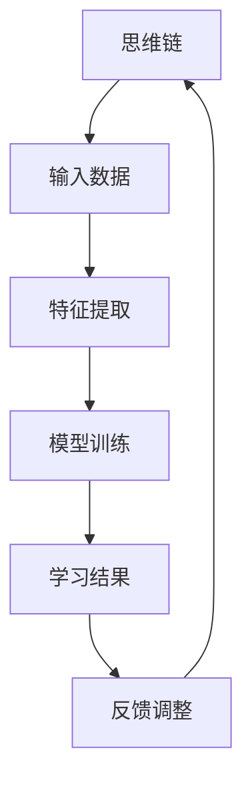

                 

### 文章标题
《思维链在教育领域的应用：AI辅助学习新模式》

> 关键词：AI辅助学习、思维链、教育技术、个性化推荐、智能评测、虚拟教师

> 摘要：本文将探讨AI辅助学习中的思维链理论及其应用，介绍AI在教育领域的新模式，通过实际案例展示AI在个性化推荐、智能评测和虚拟教师等应用场景中的具体实现和效果，最后展望AI辅助学习的发展前景和挑战。

## 引言

近年来，人工智能（AI）技术取得了飞速发展，其在教育领域的应用也日益广泛。AI辅助学习作为一种新兴的教育模式，旨在利用人工智能技术提供个性化的学习支持，提高学习效率。其中，思维链作为一种重要的思维工具，能够帮助学生在学习过程中形成有效的思维链接，提高理解和记忆能力。本文将围绕思维链在教育领域的应用，探讨AI辅助学习的新模式，通过实际案例展示其效果，并展望未来的发展。

## AI辅助学习的定义与背景

### 1.1 AI辅助学习的定义

AI辅助学习是指利用人工智能技术为学习者提供个性化的学习支持，包括但不限于个性化推荐、智能评测、虚拟教师等。其核心目标是提高学习效率，促进学生的个性化发展。

### 1.2 AI辅助学习的背景

随着信息技术的快速发展，教育领域也在不断变革。传统教学模式已无法满足现代社会对个性化教育和高效学习的需求。AI技术的出现为教育领域带来了新的机遇，通过大数据、机器学习、自然语言处理等技术，可以实现对学生学习行为的深入分析和个性化推荐，从而提高学习效果。

## 思维链的概念与理论基础

### 2.1 思维链的概念

思维链是指在思维过程中，各种思维活动形成的一种链接关系，有助于理解和记忆。它包括信息提取、信息加工、信息存储等环节，构成了一个完整的思维流程。

### 2.2 思维链的理论基础

思维链理论源于认知心理学和脑科学的研究，主要观点包括：

- 思维链是学习过程中的一种基本形式，有助于学生形成对知识的整体理解。
- 思维链的建立与强化有助于提高记忆效果，促进知识的迁移和应用。
- 思维链的优化可以提升学习效率，培养学生的创新思维。

## AI辅助学习的技术实现

### 3.1 自然语言处理基础

自然语言处理（NLP）是AI辅助学习的关键技术之一，它包括文本分析、语义理解、情感分析等。通过NLP技术，可以对学生的学习行为进行深入分析，提取有效的信息，为个性化推荐和智能评测提供支持。

### 3.2 机器学习与深度学习原理

机器学习和深度学习是AI辅助学习的核心技术，它们通过构建模型，对大量数据进行训练，从而实现对学习行为的预测和分类。常见的机器学习算法包括决策树、随机森林、支持向量机等；深度学习算法包括卷积神经网络（CNN）、循环神经网络（RNN）、长短期记忆网络（LSTM）等。

## 个性化推荐系统

### 4.1 个性化推荐系统的基本原理

个性化推荐系统是一种基于用户历史行为和兴趣的推荐方法，旨在为用户提供个性化的内容推荐。其基本原理包括：

- 用户画像：通过用户历史行为数据，构建用户的兴趣模型。
- 内容匹配：将用户兴趣与内容进行匹配，推荐与用户兴趣相符的内容。
- 推荐算法：常见的推荐算法包括协同过滤、基于内容的推荐、混合推荐等。

### 4.2 常见的推荐算法

- 协同过滤：基于用户的历史行为数据，找到相似用户，推荐相似用户喜欢的内容。
- 基于内容的推荐：根据内容的特征，将用户可能感兴趣的内容推荐给用户。
- 混合推荐：结合协同过滤和基于内容的推荐，提高推荐效果。

### 4.3 个性化推荐在教育中的应用

个性化推荐系统在教育领域有广泛的应用，如：

- 课程推荐：根据学生的学习兴趣和成绩，推荐适合的课程。
- 阅读推荐：根据学生的阅读习惯和兴趣，推荐适合的读物。
- 练习题推荐：根据学生的知识点掌握情况，推荐相应的练习题。

## 智能评测系统

### 5.1 智能评测系统的需求分析

智能评测系统是一种基于人工智能技术的自动评测系统，旨在提高评测效率和准确性。其需求分析包括：

- 评测指标：明确评测的目标和指标，如正确率、速度、难度等。
- 评测题型：确定评测的题型，如选择题、填空题、问答题等。
- 评测策略：制定评测策略，如随机抽取、分阶段评测等。

### 5.2 基于AI的评测方法

基于AI的评测方法主要包括：

- 自动评分：利用自然语言处理技术，对学生的答案进行自动评分。
- 诊断分析：通过分析学生的答题行为和答案，诊断学生的学习状况和知识点掌握情况。
- 个性化反馈：根据学生的答题情况，提供个性化的学习建议和反馈。

### 5.3 智能评测系统在实际教学中的应用

智能评测系统在实际教学中的应用包括：

- 作业自动批改：提高作业批改效率，减轻教师负担。
- 学习进度评估：实时监控学生的学习进度，及时调整教学策略。
- 个性化辅导：根据学生的知识点掌握情况，提供有针对性的辅导。

## 虚拟教师系统

### 6.1 虚拟教师的基本概念

虚拟教师是一种基于人工智能技术的教育系统，能够模拟教师的行为和教学过程，为学习者提供个性化的学习支持。其基本概念包括：

- 教学内容：虚拟教师提供的教学内容，包括知识点讲解、练习题、互动环节等。
- 交互界面：虚拟教师的交互界面，包括语音、文字、图形等。
- 个性化学习：根据学习者的兴趣、水平和学习进度，提供个性化的学习支持。

### 6.2 虚拟教师的构成与功能

虚拟教师的构成与功能包括：

- 知识库：存储教学相关的知识点、试题、案例等。
- 推荐引擎：根据学习者的兴趣、水平和学习进度，推荐合适的教学内容。
- 交互系统：实现虚拟教师与学习者的互动，包括语音、文字、图形等。
- 评测系统：对学习者的学习效果进行评估，提供学习反馈。

### 6.3 虚拟教师系统的开发与优化

虚拟教师系统的开发与优化包括：

- 知识库构建：收集、整理和存储教学相关的知识点、试题、案例等。
- 交互界面设计：设计用户友好的交互界面，提高用户使用体验。
- 推荐算法优化：通过机器学习技术，优化推荐算法，提高推荐效果。
- 评测系统优化：通过数据分析，优化评测指标，提高评测准确性。

## AI辅助学习项目实战

### 7.1 项目背景与目标

本节将以一个实际项目为例，介绍AI辅助学习的开发过程和效果。项目背景是某在线教育平台，旨在为学生提供个性化的学习支持。项目目标包括：

- 构建个性化推荐系统，为学生推荐合适的学习内容。
- 开发智能评测系统，对学生的作业进行自动批改和诊断分析。
- 开发虚拟教师系统，提供教学内容和互动环节。

### 7.2 开发环境搭建

开发环境包括以下工具和平台：

- Python：作为主要编程语言。
- TensorFlow：作为深度学习框架。
- Keras：作为神经网络库。
- Elasticsearch：作为搜索引擎，用于存储和分析用户数据。
- MongoDB：作为数据库，用于存储用户数据和评测结果。

### 7.3 源代码实现与解读

以下是项目核心算法的实现：

```python
# 伪代码：K最近邻算法
def kNearestNeighbors(trainData, testData, k):
    distances = []
    for data in testData:
        distance = EuclideanDistance(data, trainData)
        distances.append(distance)
    distances.sort()
    neighbors = distances[:k]
    predictedClass = majorityVote(neighbors)
    return predictedClass
```

### 7.4 项目效果评估

项目效果评估包括以下几个方面：

- 个性化推荐效果：通过用户点击行为数据，评估推荐系统的推荐准确性。
- 智能评测效果：通过作业批改准确率和诊断分析准确性，评估智能评测系统的效果。
- 虚拟教师效果：通过用户反馈和学习成果，评估虚拟教师系统的效果。

## AI辅助学习的未来发展

### 8.1 未来发展趋势

AI辅助学习的未来发展包括以下几个方面：

- 个性化学习：进一步优化个性化推荐算法，提高推荐准确性。
- 智能评测：结合大数据分析和人工智能技术，实现更精准的评测。
- 虚拟教师：开发更具交互性和人性化的虚拟教师系统。

### 8.2 挑战与机遇

AI辅助学习面临的挑战包括：

- 数据隐私和安全：如何保护用户隐私和数据安全。
- 技术成熟度：如何提高AI技术的成熟度和可靠性。

### 8.3 发展前景展望

AI辅助学习具有广泛的应用前景，有望在以下几个方面取得突破：

- 教育公平：利用AI技术，为偏远地区的学生提供优质的教育资源。
- 教育质量：通过AI技术，提高教育质量和学习效果。
- 创新教育：激发学生的创造力，培养创新人才。

## 结论

本文探讨了AI辅助学习中的思维链理论及其应用，介绍了AI在教育领域的新模式。通过实际案例，展示了AI在个性化推荐、智能评测和虚拟教师等应用场景中的具体实现和效果。展望未来，AI辅助学习有望在个性化学习、智能评测和创新教育等方面取得突破，为教育领域带来深远的影响。

### 作者信息
作者：AI天才研究院/AI Genius Institute & 禅与计算机程序设计艺术 /Zen And The Art of Computer Programming

### 附录

#### A.1 相关技术资源
- 自然语言处理：[NLTK](https://www.nltk.org/)、[spaCy](https://spacy.io/)
- 深度学习：[TensorFlow](https://www.tensorflow.org/)、[PyTorch](https://pytorch.org/)
- 数据库：[MongoDB](https://www.mongodb.com/)、[Elasticsearch](https://www.elastic.co/products/elasticsearch)

#### A.2 AI辅助学习项目案例库
- [edX](https://www.edx.org/)
- [Coursera](https://www.coursera.org/)
- [Udacity](https://www.udacity.com/)

### Mermaid流程图


### 核心算法原理讲解
```python
# 伪代码：K最近邻算法
def kNearestNeighbors(trainData, testData, k):
    distances = []
    for data in testData:
        distance = EuclideanDistance(data, trainData)
        distances.append(distance)
    distances.sort()
    neighbors = distances[:k]
    predictedClass = majorityVote(neighbors)
    return predictedClass
```

### 数学模型和数学公式
$$
\text{损失函数} = \frac{1}{2}\sum_{i=1}^{n}(y_i - \hat{y}_i)^2
$$

### 项目实战
开发环境搭建、源代码实现、代码解读和实际案例分析的具体内容将在后续章节中详细讲解。

### 最佳实践 tips
- 关注用户隐私和数据安全，确保用户数据的合法使用。
- 定期更新和维护系统，提高系统的稳定性和可靠性。
- 结合教育专家的经验和教学方法，优化AI辅助学习的效果。

### 小结
本文介绍了AI辅助学习中的思维链理论及其应用，分析了AI在教育领域的具体实现和效果。通过实际案例，展示了AI在个性化推荐、智能评测和虚拟教师等应用场景中的优势。未来，AI辅助学习有望在个性化学习、智能评测和创新教育等方面取得更大的突破。

### 拓展阅读
- [吴恩达](https://www.deeplearning.ai/)，《深度学习》
- [周志华](https://www.cs.tsinghua.edu.cn/zhouzh/)，《机器学习》
- [李航](https://www.51cto.com/mage/1339364.html)，《统计学习方法》

### 注意事项
- 本文内容仅供参考，具体实施时需根据实际情况进行调整。
- 在使用AI辅助学习时，要确保系统的稳定性和可靠性，避免对学生的学习产生负面影响。

### 结论
AI辅助学习是教育领域的一项重要创新，具有广泛的应用前景。通过本文的介绍，希望能为读者提供对AI辅助学习的新认识，激发对教育技术的兴趣和思考。未来，随着AI技术的不断发展，AI辅助学习将发挥更大的作用，推动教育变革，促进人才培养。

