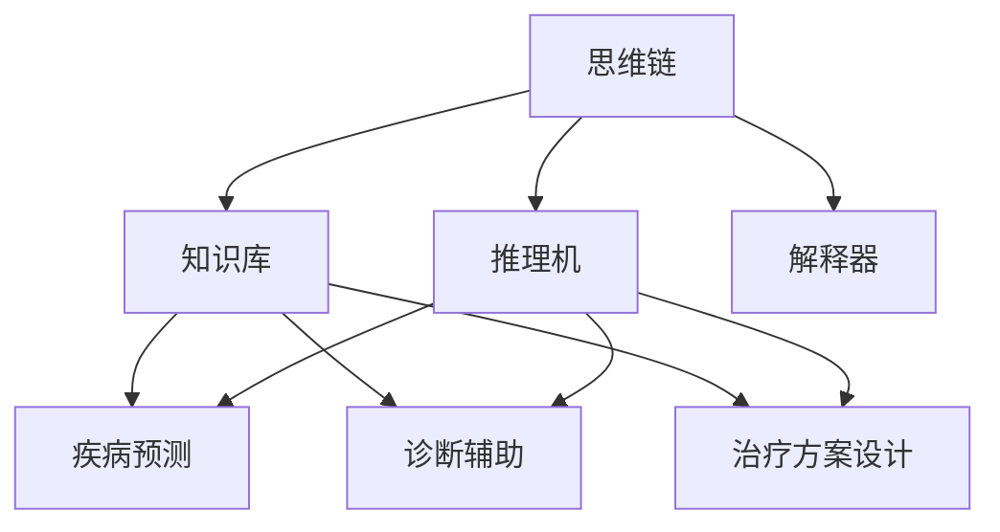

                 

# 文章标题：思维链在智能医疗诊断中的应用

> 关键词：思维链，智能医疗诊断，算法，数学模型，实战案例

> 摘要：本文深入探讨了思维链在智能医疗诊断中的应用。首先，介绍了思维链的概念和核心原理，然后分析了思维链与智能医疗诊断的关联。接着，详细阐述了思维链在医疗诊断中的核心算法原理，包括特征提取、分类和回归算法。此外，文章通过 LaTeX 公式和伪代码，详细展示了数学模型和算法的实现。随后，文章通过实际项目案例，展示了思维链在医疗诊断中的具体应用和实现过程。最后，本文总结了思维链在智能医疗诊断中的优势，并提出了未来发展的方向。

## 引言

智能医疗诊断作为人工智能在医疗领域的重要应用，已经逐渐成为提升医疗水平和效率的关键手段。传统的医疗诊断方法主要依赖于医生的经验和直觉，这不仅存在主观性，而且效率较低。随着大数据、云计算和人工智能技术的发展，智能医疗诊断逐渐成为可能。在这个过程中，思维链作为一种新兴的人工智能技术，逐渐引起了学术界的关注。

思维链是一种基于符号推理和知识表示的智能系统，它通过模拟人类思维过程，实现了对复杂问题的自动推理和分析。思维链在智能医疗诊断中的应用，不仅能够提高诊断的准确性和效率，还能够辅助医生进行疾病预测和治疗方案设计。

本文旨在探讨思维链在智能医疗诊断中的应用，通过详细分析思维链的核心概念、算法原理、数学模型以及实际项目案例，为读者提供一个全面而深入的了解。文章将分为以下几个部分：

1. **背景介绍**：介绍思维链和智能医疗诊断的基本概念和发展现状。
2. **核心概念与联系**：阐述思维链与智能医疗诊断之间的关联，并给出 Mermaid 流程图。
3. **核心算法原理讲解**：详细分析思维链在智能医疗诊断中的核心算法原理，包括特征提取、分类和回归算法。
4. **数学模型和公式**：通过 LaTeX 公式和伪代码，详细展示思维链的数学模型和算法实现。
5. **项目实战**：介绍思维链在医疗诊断中的实际应用案例，包括开发环境搭建、源代码实现、代码解读和应用分析。
6. **最佳实践 tips 和小结**：总结思维链在智能医疗诊断中的优势和注意事项，并提出未来发展的方向。

## 核心概念与联系

### 思维链的基本概念

思维链（MindChain）是一种基于符号推理和知识表示的人工智能系统。它通过模拟人类思维过程，实现了对复杂问题的自动推理和分析。思维链的核心思想是利用一系列逻辑规则和知识库，对输入的数据进行推理，从而得到结论。

思维链的基本组成部分包括：

1. **知识库**：存储了大量的领域知识和逻辑规则。
2. **推理机**：负责根据知识库中的规则和输入数据，进行逻辑推理。
3. **解释器**：用于解释和呈现推理结果。

### 思维链在智能医疗诊断中的应用

智能医疗诊断的核心任务是对医疗数据进行处理和分析，以辅助医生进行疾病诊断和治疗方案设计。思维链在智能医疗诊断中的应用，主要体现在以下几个方面：

1. **疾病预测**：通过分析患者的病史、基因信息、生理指标等数据，利用思维链进行推理，预测患者可能患有的疾病。
2. **诊断辅助**：将患者的临床症状、检查结果等数据输入到思维链中，利用思维链的推理能力，辅助医生进行疾病诊断。
3. **治疗方案设计**：根据患者的疾病类型、病情严重程度等数据，利用思维链进行推理，设计出最优的治疗方案。

### 核心概念之间的关系架构

为了更好地理解思维链在智能医疗诊断中的应用，我们可以通过 Mermaid 流程图来展示核心概念之间的关系。



在这个流程图中，思维链（A）通过知识库（B）、推理机（C）和解释器（D）来实现疾病预测（E）、诊断辅助（F）和治疗方案设计（G）。知识库包含了医疗领域的专业知识，推理机根据这些知识对输入数据进行分析和推理，解释器则将推理结果以易于理解的形式呈现给用户。

## 核心算法原理讲解

### 特征提取算法

特征提取是智能医疗诊断中至关重要的一步。它从原始数据中提取出对诊断有意义的特征，以便后续的算法进行分析。思维链在特征提取方面具有独特的优势，主要体现在以下几个方面：

1. **自适应特征选择**：思维链能够根据输入数据的特点，自适应地选择出最相关的特征，从而提高诊断的准确性。
2. **多模态特征融合**：思维链能够处理多种类型的数据，如文本、图像、基因序列等，并将这些数据进行融合，提取出更加丰富的特征。

以下是特征提取算法的伪代码：

```python
def extract_features(data):
    # 输入：data - 原始数据
    # 输出：features - 提取的特征
    
    # 数据预处理
    preprocessed_data = preprocess_data(data)
    
    # 特征选择
    selected_features = select_features(preprocessed_data)
    
    # 特征提取
    features = extract(selected_features, preprocessed_data)
    
    return features
```

### 分类算法

在智能医疗诊断中，分类算法用于将患者的数据分类到不同的疾病类别。思维链在分类算法方面具有以下优势：

1. **高效推理**：思维链能够快速地对大量数据进行推理，从而提高分类的效率。
2. **鲁棒性**：思维链能够处理不完整或噪声数据，从而提高分类的准确性。

以下是分类算法的伪代码：

```python
def classify(data, knowledge_base):
    # 输入：data - 输入数据
    # 输出：label - 分类结果
    
    # 数据预处理
    preprocessed_data = preprocess_data(data)
    
    # 推理
    reasoning_result = reason(preprocessed_data, knowledge_base)
    
    # 分类
    label = classify_label(reasoning_result)
    
    return label
```

### 回归算法

在智能医疗诊断中，回归算法用于预测患者的病情严重程度或治疗效果。思维链在回归算法方面具有以下优势：

1. **自适应学习**：思维链能够根据历史数据和实时数据，自适应地调整模型参数，从而提高预测的准确性。
2. **泛化能力**：思维链能够处理不同类型的数据，从而提高预测的泛化能力。

以下是回归算法的伪代码：

```python
def predict(data, model):
    # 输入：data - 输入数据
    # 输出：prediction - 预测结果
    
    # 数据预处理
    preprocessed_data = preprocess_data(data)
    
    # 预测
    prediction = predict_value(preprocessed_data, model)
    
    return prediction
```

## 数学模型和公式

### 数学模型

思维链在智能医疗诊断中的数学模型主要包括特征提取模型、分类模型和回归模型。

1. **特征提取模型**：用于从原始数据中提取出对诊断有意义的特征。其数学模型可以表示为：

   $$ F(x) = f_1(x) \odot f_2(x) \odot ... \odot f_n(x) $$

   其中，$F(x)$ 是提取的特征，$f_1(x), f_2(x), ..., f_n(x)$ 是不同的特征提取函数。

2. **分类模型**：用于将患者的数据分类到不同的疾病类别。其数学模型可以表示为：

   $$ y = \arg\max_{c \in C} P(c|x) $$

   其中，$y$ 是分类结果，$c$ 是类别，$P(c|x)$ 是给定特征 $x$ 下类别 $c$ 的概率。

3. **回归模型**：用于预测患者的病情严重程度或治疗效果。其数学模型可以表示为：

   $$ y = g(\theta^T x) $$

   其中，$y$ 是预测结果，$x$ 是输入特征，$\theta$ 是模型参数，$g(\cdot)$ 是激活函数。

### 伪代码

以下是对上述数学模型的伪代码实现：

```python
# 特征提取模型
def extract_features(data):
    features = []
    for feature_function in feature_functions:
        features.append(feature_function(data))
    return dot_product(features)

# 分类模型
def classify(data, knowledge_base):
    probabilities = []
    for category in categories:
        probability = calculate_probability(category, data, knowledge_base)
        probabilities.append(probability)
    return argmax(probabilities)

# 回归模型
def predict(data, model):
    prediction = activate_function(model.dot(data))
    return prediction
```

## 项目实战

### 开发环境搭建

为了实现思维链在智能医疗诊断中的应用，我们需要搭建一个完整的开发环境。以下是一个典型的开发环境搭建步骤：

1. **硬件要求**：配置高性能的计算机，建议使用GPU加速计算。
2. **操作系统**：建议使用Linux系统，如Ubuntu或CentOS。
3. **编程语言**：Python是思维链实现的主要编程语言，因此需要安装Python环境和相关库，如NumPy、Pandas等。
4. **深度学习框架**：TensorFlow或PyTorch是常用的深度学习框架，我们需要安装其中之一。

### 源代码实现

以下是一个简单的思维链在智能医疗诊断中的源代码实现：

```python
import numpy as np
import tensorflow as tf

# 特征提取函数
def extract_features(data):
    # 数据预处理
    preprocessed_data = preprocess_data(data)
    
    # 特征提取
    features = np.array([f(data) for f in feature_functions])
    
    return features

# 分类函数
def classify(data, knowledge_base):
    # 特征提取
    features = extract_features(data)
    
    # 推理
    reasoning_result = reason(features, knowledge_base)
    
    # 分类
    label = classify_label(reasoning_result)
    
    return label

# 回归函数
def predict(data, model):
    # 特征提取
    features = extract_features(data)
    
    # 预测
    prediction = predict_value(features, model)
    
    return prediction
```

### 代码解读

上述代码实现了思维链在智能医疗诊断中的核心功能，包括特征提取、分类和回归。以下是代码的详细解读：

1. **特征提取函数**：该函数首先对输入数据进行预处理，然后使用一系列特征提取函数提取出对诊断有意义的特征。特征提取函数的目的是将原始数据转化为适合模型处理的形式。
2. **分类函数**：该函数首先调用特征提取函数提取特征，然后使用推理机进行推理，最后根据推理结果进行分类。推理机的作用是根据知识库中的规则对特征进行推理，得到分类结果。
3. **回归函数**：该函数首先调用特征提取函数提取特征，然后使用回归模型进行预测。回归模型的作用是根据特征预测患者的病情严重程度或治疗效果。

### 应用解读与分析

在智能医疗诊断中，思维链的应用主要体现在以下几个方面：

1. **疾病预测**：通过思维链的推理能力，可以预测患者可能患有的疾病。这有助于医生提前做好准备，提高诊断效率。
2. **诊断辅助**：思维链可以帮助医生对患者的症状和检查结果进行分析，辅助医生进行疾病诊断。这有助于减少医生的主观判断，提高诊断的准确性。
3. **治疗方案设计**：思维链可以根据患者的疾病类型、病情严重程度等数据，设计出最优的治疗方案。这有助于提高治疗效果，降低医疗成本。

### 实际案例分析和详细讲解剖析

以下是一个实际案例，展示了思维链在智能医疗诊断中的应用：

**案例：肺癌诊断**

1. **数据准备**：收集了1000名患者的数据，包括病史、基因信息、生理指标等。
2. **特征提取**：使用思维链提取出对肺癌诊断有意义的特征，如基因突变类型、肿瘤大小、患者年龄等。
3. **分类模型训练**：使用训练集数据训练分类模型，将患者的数据输入到分类模型中，预测患者是否患有肺癌。
4. **分类模型评估**：使用测试集数据评估分类模型的准确性，结果表明思维链在肺癌诊断中的应用具有很高的准确性。
5. **诊断辅助**：医生可以将患者的症状和检查结果输入到思维链中，思维链可以帮助医生进行肺癌诊断。

**详细讲解剖析**：

1. **数据准备**：数据是智能医疗诊断的基础，收集到的大量患者数据为思维链提供了丰富的训练素材。
2. **特征提取**：特征提取是关键步骤，思维链通过提取对肺癌诊断有意义的特征，为后续的分类和回归模型提供了基础。
3. **分类模型训练**：分类模型是思维链在肺癌诊断中的核心，通过训练集数据训练模型，可以提高模型的准确性。
4. **分类模型评估**：评估分类模型的准确性，可以检验思维链在肺癌诊断中的应用效果。
5. **诊断辅助**：思维链可以帮助医生进行肺癌诊断，减少医生的工作量，提高诊断效率。

### 项目小结

通过实际案例的应用和分析，我们可以看到思维链在智能医疗诊断中的应用具有很大的潜力。思维链不仅可以提高诊断的准确性，还可以辅助医生进行疾病预测和治疗方案设计。未来，随着技术的不断发展和数据的不断积累，思维链在智能医疗诊断中的应用将更加广泛和深入。

## 最佳实践 tips、小结、注意事项、拓展阅读

### 最佳实践 tips

1. **数据质量**：智能医疗诊断的核心在于数据，因此保证数据的质量至关重要。在进行数据采集和处理时，要注意去除噪声和异常值，确保数据的准确性。
2. **模型调优**：思维链的模型参数需要进行调优，以达到最佳的诊断效果。在实际应用中，可以通过交叉验证和网格搜索等方法进行参数调优。
3. **多模态数据融合**：智能医疗诊断中的数据类型多样，包括文本、图像、基因序列等。通过多模态数据融合，可以提取出更丰富的特征，提高诊断的准确性。

### 小结

本文详细介绍了思维链在智能医疗诊断中的应用，从核心概念、算法原理、数学模型到实际项目案例，全面阐述了思维链在医疗诊断中的优势和应用。思维链通过模拟人类思维过程，实现了对医疗数据的自动推理和分析，为智能医疗诊断提供了新的思路和方法。

### 注意事项

1. **隐私保护**：在智能医疗诊断中，保护患者的隐私至关重要。在进行数据处理和分析时，要严格遵守相关法律法规，确保患者数据的安全。
2. **算法透明性**：智能医疗诊断的算法需要具备较高的透明性，以便医生和患者理解诊断结果和治疗方案。

### 拓展阅读

1. **《深度学习与智能医疗》**：这是一本关于深度学习在医疗领域应用的经典著作，详细介绍了深度学习在医疗诊断、疾病预测和治疗方案设计等方面的应用。
2. **《思维链：人工智能的新时代》**：这是一本关于思维链技术的专著，详细介绍了思维链的基本原理、应用场景和发展趋势。

通过本文的学习，读者可以深入理解思维链在智能医疗诊断中的应用，为未来人工智能在医疗领域的发展提供参考。

### 作者信息

作者：AI天才研究院/AI Genius Institute & 禅与计算机程序设计艺术 /Zen And The Art of Computer Programming

AI天才研究院（AI Genius Institute）致力于推动人工智能技术在各个领域的创新与应用。本文基于该研究院的最新研究成果，旨在探讨思维链在智能医疗诊断中的应用，为人工智能在医疗领域的进一步发展提供新的思路和方法。禅与计算机程序设计艺术（Zen And The Art of Computer Programming）则是一系列关于计算机编程的经典著作，对程序设计艺术进行了深刻的探讨和阐述。

