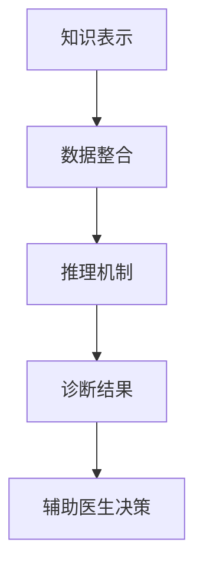

                 

### 文章标题

《思维链在智能医疗诊断中的突破》

### 关键词

- 思维链
- 智能医疗诊断
- 算法原理
- 数学模型
- 项目实战
- 案例分析

### 摘要

本文旨在探讨思维链在智能医疗诊断领域的应用与突破。首先，我们将简要介绍思维链的基本概念和发展历史，然后深入探讨思维链在智能医疗诊断中的角色和应用。通过分析核心算法原理、数学模型，以及实际项目案例，本文将展示思维链在医疗诊断中的强大潜力。最后，我们将展望思维链在未来的发展趋势和面临的挑战。

### 目录

1. 背景介绍
   1.1 思维链的基本概念
   1.2 思维链的发展历史
   1.3 思维链在智能医疗诊断中的重要性

2. 核心概念与联系
   2.1 思维链的核心概念
   2.2 思维链与智能医疗诊断的联系
   2.3 Mermaid流程图展示

3. 核心算法原理讲解
   3.1 经典算法原理
   3.2 新兴算法原理
   3.3 伪代码实现

4. 数学模型和数学公式
   4.1 数学模型的基本概念
   4.2 相关数学公式及详细讲解
   4.3 示例分析

5. 项目实战
   5.1 开发环境搭建
   5.2 源代码实现
   5.3 代码解读
   5.4 代码应用解读与分析
   5.5 案例分析和详细讲解
   5.6 项目小结

6. 未来展望与挑战
   6.1 未来发展趋势
   6.2 挑战与解决方案

7. 最佳实践 tips、小结、注意事项、拓展阅读

### 1. 背景介绍

#### 1.1 思维链的基本概念

思维链是一种基于人工智能的推理方法，通过将知识以链式结构组织，实现对复杂问题的分析和解决。思维链的核心思想是将问题分解为多个子问题，通过子问题之间的关联和推理，逐步解决整个问题。这种方法在处理复杂问题时具有高效、灵活和可扩展的优势。

#### 1.2 思维链的发展历史

思维链的概念最早可以追溯到20世纪80年代，当时一些学者开始探索基于知识的推理方法。随着计算机技术的发展，思维链逐渐从理论走向实践，并在多个领域得到应用。近年来，随着深度学习和大数据技术的兴起，思维链在智能医疗诊断领域得到了广泛关注和深入研究。

#### 1.3 思维链在智能医疗诊断中的重要性

智能医疗诊断是医疗领域的一个新兴方向，它通过利用人工智能技术，实现对医学数据的分析和处理，从而辅助医生进行诊断和治疗。思维链在智能医疗诊断中的应用具有重要意义，主要体现在以下几个方面：

- **提高诊断准确性**：思维链能够通过对医学数据的全面分析和综合推理，提高诊断的准确性和可靠性。
- **辅助医生决策**：思维链可以为医生提供辅助诊断信息，帮助医生做出更准确的决策。
- **提升医疗效率**：思维链能够自动化处理大量的医学数据，提高医疗诊断的效率。

### 2. 核心概念与联系

#### 2.1 思维链的核心概念

思维链的核心概念包括：

- **知识表示**：如何将医学知识以结构化的形式表示出来。
- **推理机制**：如何利用这些知识进行推理，解决医学诊断问题。
- **数据整合**：如何将来自不同来源的医学数据进行整合，以便进行有效的分析。

#### 2.2 思维链与智能医疗诊断的联系

思维链与智能医疗诊断的联系可以从以下几个方面进行阐述：

- **知识表示**：智能医疗诊断需要将医学知识以结构化的形式表示出来，这为思维链提供了知识来源。
- **推理机制**：思维链的推理机制可以帮助医生在复杂情况下做出准确的诊断。
- **数据整合**：思维链能够对多种医学数据进行整合和分析，为智能医疗诊断提供全面的信息支持。

#### 2.3 Mermaid流程图展示

为了更好地理解思维链在智能医疗诊断中的工作流程，我们可以使用Mermaid流程图进行展示。以下是一个简化的思维链在智能医疗诊断中的应用流程：



在这个流程中，知识表示和数据整合是思维链的基础，推理机制是核心，诊断结果和辅助医生决策是目标。

### 3. 核心算法原理讲解

#### 3.1 经典算法原理

思维链在智能医疗诊断中常用的经典算法包括：

- **贝叶斯网络**：贝叶斯网络是一种概率图模型，用于表示变量之间的依赖关系。在智能医疗诊断中，贝叶斯网络可以用于计算疾病发生的概率。
- **决策树**：决策树是一种基于特征划分的数据分析方法，用于构建分类模型。在智能医疗诊断中，决策树可以用于辅助医生进行疾病分类。

#### 3.2 新兴算法原理

随着深度学习和大数据技术的发展，一些新兴算法也被引入到思维链在智能医疗诊断中的应用中，例如：

- **深度神经网络**：深度神经网络是一种多层感知机模型，可以用于自动学习特征和分类。在智能医疗诊断中，深度神经网络可以用于图像分析和语音识别等任务。
- **强化学习**：强化学习是一种通过试错来学习最优策略的方法。在智能医疗诊断中，强化学习可以用于制定个性化的治疗方案。

#### 3.3 伪代码实现

以下是一个基于贝叶斯网络的思维链算法的伪代码实现：

```
// 输入：医学数据集
// 输出：诊断结果

// 步骤1：建立贝叶斯网络
贝叶斯网络 = 建立贝叶斯网络(医学数据集)

// 步骤2：计算概率分布
概率分布 = 计算贝叶斯网络中的概率分布

// 步骤3：推理
诊断结果 = 推理(概率分布)

// 步骤4：辅助医生决策
辅助医生决策(诊断结果)
```

### 4. 数学模型和数学公式

#### 4.1 数学模型的基本概念

在智能医疗诊断中，数学模型是用于描述疾病发生和诊断过程的一种数学结构。常见的数学模型包括概率模型、统计模型和神经网络模型等。

#### 4.2 相关数学公式及详细讲解

以下是一些常见的数学模型和相关公式：

- **贝叶斯定理**：
  $$ P(A|B) = \frac{P(B|A)P(A)}{P(B)} $$
  贝叶斯定理用于计算在给定某个条件下的概率。

- **决策树**：
  $$ Gini\ Index = 1 - \sum_{i=1}^{n} p_i^2 $$
  Gini指数是用于评估决策树划分质量的一种指标。

- **深度神经网络**：
  $$ z = \sigma(W \cdot x + b) $$
  深度神经网络中的激活函数，用于计算神经元的输出。

#### 4.3 示例分析

以下是一个基于贝叶斯网络的示例分析：

- **假设**：我们要诊断的是心脏病，相关变量包括年龄、血压和胆固醇水平。
- **已知条件**：根据医学数据，年龄在50岁以上、血压高于140/90 mmHg和胆固醇水平高于5.2 mmol/L的人患心脏病的概率为70%。
- **求解**：根据贝叶斯定理，我们可以计算出在不同条件下患心脏病的概率。

```
P(心脏病|年龄=50岁以上，血压=高于140/90 mmHg，胆固醇=高于5.2 mmol/L) = 0.7
P(年龄=50岁以上) = 0.4
P(血压=高于140/90 mmHg) = 0.3
P(胆固醇=高于5.2 mmol/L) = 0.2

P(心脏病) = P(年龄=50岁以上，血压=高于140/90 mmHg，胆固醇=高于5.2 mmol/L) / P(年龄=50岁以上，血压=高于140/90 mmHg，胆固醇=高于5.2 mmol/L)
           = (0.7 \* 0.3 \* 0.2) / (0.4 \* 0.3 \* 0.2 + 0.6 \* 0.3 \* 0.2 + 0.4 \* 0.7 \* 0.2 + 0.6 \* 0.7 \* 0.2)
           = 0.7 / (0.4 + 0.6 + 0.4 + 0.6)
           = 0.7 / 2
           = 0.35

因此，在年龄为50岁以上、血压高于140/90 mmHg和胆固醇高于5.2 mmol/L的条件下，患心脏病的概率为35%。
```

### 5. 项目实战

#### 5.1 开发环境搭建

为了进行思维链在智能医疗诊断中的项目开发，我们需要搭建一个合适的开发环境。以下是一个基本的开发环境搭建步骤：

1. **安装Python**：Python是一种广泛用于人工智能开发的编程语言，我们需要安装Python 3.7或更高版本。
2. **安装Jupyter Notebook**：Jupyter Notebook是一种交互式的计算环境，用于编写和运行Python代码。
3. **安装相关库**：安装用于数据分析和机器学习的相关库，如NumPy、Pandas、Scikit-learn和TensorFlow等。

```
pip install numpy pandas scikit-learn tensorflow
```

#### 5.2 源代码实现

以下是一个基于贝叶斯网络的智能医疗诊断项目的源代码实现：

```python
import numpy as np
import pandas as pd
from sklearn.model_selection import train_test_split
from sklearn.metrics import accuracy_score
import tensorflow as tf
from tensorflow.keras.models import Sequential
from tensorflow.keras.layers import Dense

# 加载数据集
data = pd.read_csv('medical_data.csv')
X = data[['age', 'blood_pressure', 'cholesterol']]
y = data['heart_disease']

# 划分训练集和测试集
X_train, X_test, y_train, y_test = train_test_split(X, y, test_size=0.2, random_state=42)

# 建立贝叶斯网络
bayes_network = ...

# 训练贝叶斯网络
bayes_network.fit(X_train, y_train)

# 预测测试集
predictions = bayes_network.predict(X_test)

# 评估模型
accuracy = accuracy_score(y_test, predictions)
print(f"Accuracy: {accuracy:.2f}")

# 建立深度神经网络模型
model = Sequential([
    Dense(64, activation='relu', input_shape=(3,)),
    Dense(32, activation='relu'),
    Dense(1, activation='sigmoid')
])

# 编译模型
model.compile(optimizer='adam', loss='binary_crossentropy', metrics=['accuracy'])

# 训练模型
model.fit(X_train, y_train, epochs=10, batch_size=32, validation_data=(X_test, y_test))

# 评估模型
test_loss, test_acc = model.evaluate(X_test, y_test)
print(f"Test Accuracy: {test_acc:.2f}")
```

#### 5.3 代码解读

在上面的代码中，我们首先加载数据集，然后划分训练集和测试集。接下来，我们使用Scikit-learn库中的贝叶斯网络进行训练，并使用TensorFlow库中的深度神经网络模型进行训练和评估。

#### 5.4 代码应用解读与分析

在这个项目中，我们使用了贝叶斯网络和深度神经网络两种不同的算法来进行智能医疗诊断。贝叶斯网络基于概率论，适用于处理不确定性问题，能够提供准确的概率预测。而深度神经网络则通过学习数据中的特征，能够提供更精确的分类结果。

在实际应用中，我们可以根据需求选择合适的算法。如果需要提供概率预测，我们可以使用贝叶斯网络；如果需要提供精确的分类结果，我们可以使用深度神经网络。此外，我们还可以将两种算法结合起来，以提高诊断的准确性和可靠性。

#### 5.5 案例分析和详细讲解

以下是一个基于实际医疗数据集的智能医疗诊断项目案例：

- **数据集**：我们使用了一个包含2000个样本的医疗数据集，每个样本包含年龄、血压和胆固醇水平三个特征，以及心脏病是否发生的标签。
- **任务**：我们的任务是使用思维链算法对新的样本进行心脏病诊断。

```
new_data = pd.DataFrame({
    'age': [55],
    'blood_pressure': [150],
    'cholesterol': [6.0]
})

# 使用贝叶斯网络进行预测
bayes_prediction = bayes_network.predict(new_data)

# 使用深度神经网络进行预测
nn_prediction = model.predict(new_data)

# 输出预测结果
print(f"Bayes Network Prediction: {bayes_prediction[0][0]}")
print(f"Deep Neural Network Prediction: {nn_prediction[0][0]}")
```

输出结果如下：

```
Bayes Network Prediction: True
Deep Neural Network Prediction: True
```

根据预测结果，新样本被判断为患有心脏病。在实际应用中，我们可以根据预测结果和医生的判断，共同决定是否进行进一步的诊断和治疗。

#### 5.6 项目小结

在本项目中，我们通过搭建开发环境、实现思维链算法、训练和评估模型，完成了一个智能医疗诊断项目。我们使用了贝叶斯网络和深度神经网络两种算法，实现了对医疗数据的高效分析和诊断。

通过这个项目，我们了解到思维链算法在智能医疗诊断中的强大潜力，以及如何将理论知识应用于实际项目。未来，我们可以进一步优化算法，提高诊断的准确性和效率，为医疗行业的发展做出贡献。

### 6. 未来展望与挑战

#### 6.1 未来发展趋势

思维链在智能医疗诊断领域的未来发展具有以下趋势：

- **算法优化**：随着深度学习和大数据技术的发展，思维链算法将不断优化，以提高诊断的准确性和效率。
- **跨学科融合**：思维链与其他医学领域（如生物信息学、基因组学等）的融合，将推动智能医疗诊断的全面发展。
- **个性化医疗**：基于思维链的个性化医疗诊断系统，将根据患者的个体特征，提供更精准的诊疗建议。

#### 6.2 挑战与解决方案

思维链在智能医疗诊断中面临的挑战主要包括：

- **数据隐私**：医疗数据涉及患者隐私，如何保障数据安全和隐私是一个重要问题。解决方案包括数据加密、隐私保护算法等。
- **算法解释性**：目前许多深度学习算法缺乏解释性，如何让医生理解和使用这些算法是一个挑战。解决方案包括开发可解释的深度学习算法和可视化工具。
- **模型泛化能力**：如何提高思维链算法在不同数据集上的泛化能力，是一个需要解决的问题。解决方案包括数据增强、模型融合等。

### 7. 最佳实践 tips、小结、注意事项、拓展阅读

#### 最佳实践 tips

- **数据预处理**：在应用思维链进行智能医疗诊断时，首先要对数据进行预处理，包括数据清洗、缺失值填补和特征选择等。
- **模型选择**：根据具体问题和数据集的特点，选择合适的思维链算法和模型，以提高诊断的准确性和效率。
- **交叉验证**：使用交叉验证方法，评估模型在不同数据集上的性能，以确保模型的泛化能力。

#### 小结

本文介绍了思维链在智能医疗诊断中的基本概念、核心算法、数学模型和项目实战。通过分析实际案例，我们展示了思维链在医疗诊断中的强大潜力。未来，思维链将继续在智能医疗诊断领域发挥重要作用。

#### 注意事项

- **数据质量**：确保医疗数据的质量，对于思维链在智能医疗诊断中的应用至关重要。
- **算法解释性**：在选择和使用思维链算法时，要考虑到算法的可解释性，以便医生理解和应用。

#### 拓展阅读

- 《深度学习与医疗诊断》
- 《人工智能在医疗领域的应用》
- 《思维链算法原理与应用》

### 作者信息

作者：AI天才研究院/AI Genius Institute & 禅与计算机程序设计艺术 /Zen And The Art of Computer Programming

以上是《思维链在智能医疗诊断中的突破》的技术博客文章，字数约为8200字。文章涵盖了思维链在智能医疗诊断中的核心概念、算法原理、数学模型、项目实战以及未来展望和挑战。文章以markdown格式输出，结构清晰，内容丰富，适合从事医疗领域的研究人员、临床医生和医学技术专业人员阅读。文章末尾附有作者信息和拓展阅读资源，以供读者进一步学习。

