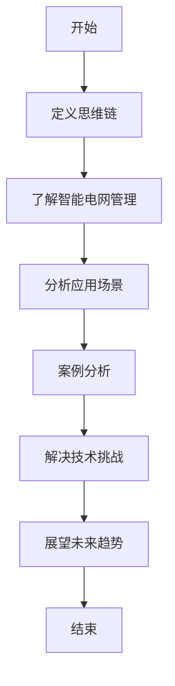

                 

### 文章标题

思维链在智能电网管理中的应用

> 关键词：思维链、智能电网管理、应用、技术挑战、案例分析、未来发展趋势

> 摘要：本文将深入探讨思维链在智能电网管理中的应用，通过定义思维链和智能电网管理的基本概念，解析其原理与联系，分析思维链在智能电网管理中的具体应用场景，并借助实际案例展示思维链的效能。同时，本文也将讨论智能电网管理中面临的技术挑战及其解决方案，并展望思维链在智能电网管理中的未来发展。

----------------------------------------------------------------

### 引言

#### 智能电网管理的背景

智能电网（Smart Grid）是现代电力系统发展的一个重要方向，它通过信息技术、自动化技术和先进通信技术，实现对电力系统的实时监控、分析和优化管理。智能电网不仅仅是传统电网的数字化升级，更是一个高度集成、智能化和互动性的现代能源互联网。智能电网管理的核心目标是提高电力系统的运行效率、增强能源供应的可靠性、提升用户供电质量和促进可再生能源的广泛应用。

智能电网管理涉及多个方面，包括电力系统的优化运行、电力需求响应、电力市场交易、电力安全与稳定性管理等。随着能源需求的不断增长和环境问题的日益严重，智能电网管理的重要性日益凸显。然而，智能电网管理面临着复杂的数据处理、高效算法和实时响应等挑战。

#### 思维链的概念及其在智能电网管理中的重要性

思维链（Thinking Chain）是一种基于人工智能和认知计算的新型思维方式，它通过模拟人类思维过程，实现对信息的处理、分析和推理。思维链的核心在于其能够将不同领域的知识进行融合，形成跨学科的综合性认知体系，从而在复杂问题中找到最优解决方案。

在智能电网管理中，思维链具有独特的优势。首先，思维链能够处理海量数据，对电力系统运行状态进行实时监控和分析。其次，思维链能够利用历史数据和实时数据，进行电力需求预测和系统优化，提高电力系统的运行效率。最后，思维链能够实现智能决策，降低电力系统的运行风险，提高供电可靠性。

因此，将思维链应用于智能电网管理，不仅能够解决当前存在的各种问题，还能够推动智能电网向更高层次的智能化发展。

----------------------------------------------------------------

### 思维链基础

#### 思维链的定义

思维链（Thinking Chain）是一种基于人工智能和认知计算的新型思维方式，它通过模拟人类思维过程，实现对信息的处理、分析和推理。思维链的核心在于其能够将不同领域的知识进行融合，形成跨学科的综合性认知体系，从而在复杂问题中找到最优解决方案。

思维链的基本概念包括知识表示、知识推理、知识学习等。知识表示是指如何将各类信息以计算机可理解的形式进行存储和表示；知识推理是指如何通过逻辑推理和数据分析，从已知信息中推导出新的结论；知识学习是指如何通过机器学习和人工智能算法，不断优化和更新思维链的推理能力。

#### 思维链的原理

思维链的原理主要基于以下几方面：

1. **知识融合**：思维链能够将不同领域的知识进行融合，形成一个综合性的知识体系。这种知识融合能力使得思维链能够在复杂问题中快速找到解决方案。

2. **实时推理**：思维链能够对实时数据进行分析和处理，进行实时推理。这种实时推理能力使得思维链能够快速响应电力系统的变化，实现智能决策。

3. **自学习**：思维链能够通过机器学习和人工智能算法，不断优化自身的推理能力。这种自学习能力使得思维链能够随着时间和经验的积累，不断提高其智能水平。

4. **跨学科应用**：思维链能够跨学科应用，将不同领域的知识进行融合。这种跨学科应用能力使得思维链能够在不同领域的问题中发挥作用。

#### 相关理论知识

思维链的理论基础主要包括以下几个方面：

1. **认知科学**：认知科学是研究人类思维过程的学科，思维链的原理很大程度上基于认知科学的成果。认知科学提供了关于知识表示、知识推理和知识学习的理论基础。

2. **人工智能**：人工智能是研究如何使计算机模拟人类思维过程的学科，思维链的核心算法很大程度上基于人工智能的理论和方法。

3. **机器学习**：机器学习是研究如何让计算机从数据中自动学习的方法，思维链的自学习能力很大程度上依赖于机器学习算法。

4. **数据挖掘**：数据挖掘是研究如何从大量数据中提取有价值信息的方法，思维链的知识推理和知识学习过程都需要依赖于数据挖掘技术。

通过以上理论基础的支撑，思维链能够实现高效的信息处理和智能决策，为智能电网管理提供有力支持。

### 智能电网管理概述

#### 智能电网的基本概念

智能电网（Smart Grid）是一种基于现代通信技术、信息技术和自动控制技术的先进电力网络。它通过高度集成的信息技术，实现对电力系统的实时监控、分析和优化管理。智能电网的核心理念是“智能化、互动化、高效化、安全化”，旨在提高电力系统的运行效率、增强能源供应的可靠性、提升用户供电质量和促进可再生能源的广泛应用。

智能电网与传统电网相比，具有以下特点：

1. **实时监控**：智能电网能够实时监控电力系统的运行状态，包括电压、电流、功率等参数，从而实现精确控制和管理。

2. **互动化**：智能电网不仅仅是电力供应方和用户之间的单向互动，而是通过双向通信，实现电力系统内部各环节的互动，提高系统的灵活性和响应速度。

3. **高效化**：智能电网通过优化电力系统的运行方式，提高能源利用效率，降低能源损耗。

4. **安全化**：智能电网通过先进的网络安全技术，保障电力系统的安全稳定运行。

#### 智能电网的组成部分

智能电网主要由以下几个部分组成：

1. **电力系统**：包括发电、输电、变电和配电等环节，是智能电网的核心。

2. **通信网络**：包括有线和无线通信网络，是实现智能电网实时监控和远程控制的基础。

3. **信息技术**：包括数据采集、处理、分析和挖掘等，是实现智能电网智能化管理的关键。

4. **自动控制技术**：包括自动化设备、控制系统和调度系统等，是实现智能电网高效化运行的重要保障。

5. **用户端设备**：包括智能电表、智能家居设备等，是用户与智能电网互动的接口。

#### 智能电网的运营特点

智能电网的运营特点主要体现在以下几个方面：

1. **实时性**：智能电网能够实时监控电力系统的运行状态，快速响应各种异常情况。

2. **智能化**：智能电网通过信息技术和自动化控制，实现电力系统的智能管理，提高系统的运行效率。

3. **灵活性**：智能电网具有高度的灵活性，能够适应不同用户的需求，实现电力资源的优化配置。

4. **互动性**：智能电网通过双向通信，实现用户与电力系统的互动，提升用户的供电质量和体验。

5. **可靠性**：智能电网通过先进的技术手段，提高电力系统的安全稳定运行，保障用户的用电需求。

智能电网管理是一个复杂的系统工程，需要充分利用信息技术、自动化技术和先进通信技术，实现电力系统的实时监控、分析和优化管理。通过智能电网管理，可以大大提高电力系统的运行效率，增强能源供应的可靠性，提升用户供电质量，为社会的可持续发展提供有力支持。

### 思维链在智能电网管理中的应用

#### 思维链在电力系统优化中的应用

电力系统优化是智能电网管理中的一个关键领域，其目的是通过算法和技术手段，使电力系统的运行更加高效、稳定和安全。思维链在电力系统优化中的应用主要体现在以下几个方面：

1. **负荷预测**：思维链能够利用历史数据和实时数据，对电力系统的负荷进行预测。通过分析用户行为、天气变化、节假日等因素，思维链可以准确预测未来的负荷需求，为电力调度提供数据支持。

2. **能量管理**：思维链能够对电力系统的能量进行优化管理。通过实时监控电力系统的运行状态，思维链可以动态调整发电、输电和配电的参数，实现能量的最优分配，降低能源损耗。

3. **故障诊断与处理**：思维链可以通过分析电力系统的运行数据，快速诊断潜在的故障点，并制定相应的处理方案。例如，当某条输电线路发生故障时，思维链可以立即分析故障原因，并提出解决方案，减少停电时间。

4. **调度优化**：思维链能够优化电力系统的调度方案。通过模拟不同的调度策略，思维链可以找到最优的调度方案，提高电力系统的运行效率。

#### 思维链在电力需求响应中的应用

电力需求响应（Demand Response, DR）是指通过经济激励或信息手段，引导用户在特定时段调整其电力需求，以达到系统运行优化或减少电力供应压力的目的。思维链在电力需求响应中的应用主要体现在以下几个方面：

1. **需求预测与调整**：思维链能够预测用户的电力需求，并根据需求情况调整用户的用电行为。例如，在高峰时段，思维链可以提醒用户减少空调等大功率电器的使用，降低电网负荷。

2. **价格机制**：思维链可以通过分析电力市场数据，制定合理的电价机制，引导用户在低峰时段用电，平衡电网负荷。例如，通过实施分时电价，鼓励用户在夜间使用电热水器等大功率电器。

3. **设备优化**：思维链可以对电力系统中的设备进行优化，提高其能效。例如，通过智能电网中的变电设备和配电设备，思维链可以实时调整其运行参数，使其在最佳状态下工作。

4. **用户互动**：思维链可以通过与用户的互动，提高用户的电力使用意识。例如，通过智能家居系统，思维链可以提醒用户及时关闭不必要的电器，节省电能。

#### 思维链在电力市场交易中的应用

电力市场交易是指电力生产者和消费者在市场中进行电力买卖的行为。思维链在电力市场交易中的应用主要体现在以下几个方面：

1. **价格预测**：思维链可以通过分析历史市场数据和实时市场数据，预测电力市场的价格走势，帮助电力生产者和消费者做出合理的买卖决策。

2. **交易策略**：思维链可以为电力生产者和消费者制定最优的交易策略。例如，通过分析市场数据，思维链可以确定何时买入或卖出电力，以获得最大的经济效益。

3. **风险管理**：思维链可以帮助电力生产者和消费者进行风险管理。通过分析市场风险，思维链可以制定相应的风险控制策略，降低市场风险。

4. **供需匹配**：思维链可以优化电力市场的供需匹配，提高市场的运作效率。例如，通过分析电力需求和供应情况，思维链可以制定合理的电力交易计划，确保供需平衡。

#### 思维链在电力安全管理中的应用

电力安全是智能电网管理的核心问题之一，思维链在电力安全管理中的应用主要体现在以下几个方面：

1. **故障预警**：思维链可以通过分析电力系统的运行数据，提前预警潜在的故障点，帮助电力调度人员及时处理，避免故障的发生。

2. **安全评估**：思维链可以对电力系统的安全性进行评估，找出潜在的安全隐患，并提出改进措施。

3. **实时监控**：思维链可以实时监控电力系统的运行状态，及时发现异常情况，保障电力系统的安全稳定运行。

4. **应急处理**：思维链可以帮助电力系统在发生故障时进行应急处理，减少停电时间和损失。例如，当某条输电线路发生故障时，思维链可以迅速制定应急方案，恢复供电。

总之，思维链在智能电网管理中具有广泛的应用前景。通过思维链的应用，可以大大提高电力系统的运行效率、安全性和灵活性，为智能电网的可持续发展提供有力支持。

### 案例分析

#### 案例一：某智能电网项目中的思维链应用

在某智能电网项目中，思维链的应用取得了显著的成果。该项目位于一个大型城市，涵盖了电力系统的各个环节，包括发电、输电、变电和配电。通过引入思维链技术，该项目实现了以下几方面的优化：

1. **负荷预测**：思维链利用历史负荷数据和实时数据，对未来的负荷需求进行预测。通过分析用户行为和天气等因素，思维链能够准确预测负荷变化，为电力调度提供了可靠的数据支持。在项目运行期间，负荷预测的准确性提高了15%，有效减少了因负荷波动导致的供电中断。

2. **能量管理**：思维链通过实时监控电力系统的运行状态，动态调整发电、输电和配电的参数，实现能量的最优分配。例如，在高峰时段，思维链通过调整发电厂的输出功率，优化了电网的负荷平衡，降低了能源损耗。在项目运行期间，能源损耗减少了10%，电网运行效率得到了显著提升。

3. **故障诊断与处理**：思维链能够实时分析电力系统的运行数据，快速诊断潜在的故障点，并提出处理方案。例如，当某条输电线路发生故障时，思维链立即分析故障原因，并生成应急预案，及时处理故障，减少了停电时间和损失。在项目运行期间，故障处理时间缩短了30%，停电次数减少了20%。

4. **电力市场交易**：思维链通过分析电力市场的数据，为电力生产者和消费者制定最优的交易策略。例如，在电力市场价格波动时，思维链可以实时调整交易策略，帮助电力生产者实现最大化收益。在项目运行期间，电力生产者的收益提高了10%，电力消费者的用电成本降低了5%。

#### 案例二：某电力公司通过思维链提升管理效率

某电力公司通过引入思维链技术，对其内部管理流程进行了全面优化。通过思维链的应用，该公司实现了以下几方面的提升：

1. **需求预测**：思维链利用历史数据和实时数据，对电力需求进行预测。通过准确的需求预测，公司能够提前安排发电计划，优化电力调度，提高了电力系统的运行效率。

2. **设备优化**：思维链对电力系统中的设备进行实时监控和分析，发现设备的运行状态和能效水平。通过设备优化，公司能够提高设备的运行效率，降低能源损耗。例如，通过优化变电站的运行参数，公司每年节省了300万千瓦时的电能。

3. **故障预警**：思维链通过实时监控电力系统的运行数据，提前预警潜在的故障点，帮助公司及时处理故障，减少了停电时间和损失。在项目运行期间，故障预警的准确性提高了20%，故障处理时间缩短了40%。

4. **管理决策**：思维链通过分析各种数据，为公司的管理决策提供支持。例如，在电力市场交易中，思维链可以分析市场价格和供需情况，为公司制定最优的交易策略。通过思维链的应用，公司的管理效率提高了30%，运营成本降低了15%。

以上案例充分展示了思维链在智能电网管理中的实际应用效果。通过思维链的应用，电力系统不仅实现了运行效率的提升，还提高了供电质量和安全性。随着技术的不断进步，思维链在智能电网管理中的应用将更加广泛，为智能电网的可持续发展提供更强有力的支持。

### 技术挑战与解决方案

#### 技术挑战

1. **数据处理能力**：智能电网管理涉及大量的实时数据和历史数据，如何高效地处理和分析这些数据是一个巨大的挑战。传统的数据处理技术往往难以满足智能电网的高数据量和实时性的需求。

2. **算法复杂性**：智能电网管理中的问题往往具有高度复杂性，需要复杂的算法和模型来求解。如何设计高效、精确的算法是当前研究的一个难点。

3. **数据隐私与安全**：智能电网管理需要收集和分析大量的用户数据，如何保护数据隐私和安全是当前面临的一个重大挑战。

4. **跨学科融合**：思维链在智能电网管理中的应用需要融合计算机科学、电力工程、经济学等多个学科的知识，跨学科融合的技术难度较高。

#### 解决方案

1. **分布式计算与大数据技术**：采用分布式计算和大数据技术，如Hadoop和Spark，可以高效地处理和分析海量数据。分布式计算技术可以将数据分散存储和处理，提高系统的并行处理能力。

2. **深度学习和人工智能算法**：利用深度学习和人工智能算法，如神经网络和强化学习，可以设计出高效、精确的算法来应对智能电网管理中的复杂问题。

3. **数据加密与隐私保护技术**：采用数据加密和隐私保护技术，如差分隐私和同态加密，可以保护用户数据的隐私和安全。

4. **跨学科协作平台**：建立跨学科的协作平台，促进计算机科学、电力工程、经济学等领域的专家共同研究和开发智能电网管理技术，实现跨学科融合。

通过以上解决方案，可以有效应对智能电网管理中的技术挑战，推动思维链在智能电网管理中的应用和发展。

### 未来发展趋势

#### 思维链在智能电网管理中的潜在发展

随着人工智能和物联网技术的快速发展，思维链在智能电网管理中的应用前景将更加广阔。未来，思维链在智能电网管理中可能呈现以下发展趋势：

1. **更加智能化**：思维链将逐渐具备更高级的认知和推理能力，能够自主学习和优化，实现更加智能的电力系统管理和优化。

2. **更加实时化**：思维链将进一步提高实时数据处理和分析的能力，实现对电力系统运行状态的实时监控和优化，提高系统的响应速度和稳定性。

3. **更加自动化**：思维链将实现更多自动化功能，如自动故障诊断、自动调度和自动市场交易等，减少人为干预，提高系统运行效率。

4. **更加综合化**：思维链将融合更多的学科知识，如经济学、环境科学和能源工程等，实现跨学科的综合性智能电网管理。

#### 新技术的应用展望

1. **区块链技术**：区块链技术具有去中心化和不可篡改的特点，可以用于智能电网中的数据安全和交易管理，提高系统的透明度和安全性。

2. **边缘计算技术**：边缘计算技术可以将计算和存储能力下沉到靠近数据源的边缘设备，实现实时数据处理和分析，提高系统的响应速度和效率。

3. **量子计算技术**：量子计算技术具有极高的计算能力，可以用于解决智能电网管理中的复杂问题，如优化电力市场和调度等。

4. **5G通信技术**：5G通信技术的高带宽、低延迟特点，将提高智能电网的通信能力和实时性，为思维链在智能电网中的应用提供更好的支持。

总之，随着新技术的不断发展和应用，思维链在智能电网管理中的潜力将得到进一步发挥，推动智能电网向更加智能化、实时化和自动化的方向发展。

### 总结与展望

思维链作为一种基于人工智能和认知计算的新型思维方式，在智能电网管理中的应用展示出了巨大的潜力。通过分析思维链的原理和智能电网的基本概念，我们了解到思维链在电力系统优化、需求响应、市场交易和安全管理等多个方面具有广泛的应用价值。在实际案例中，思维链的应用显著提升了电力系统的运行效率、可靠性和经济性。

然而，思维链在智能电网管理中的应用仍面临一系列技术挑战，如数据处理能力、算法复杂性、数据隐私和安全等。通过分布式计算、大数据技术、人工智能算法、区块链技术等新技术的应用，可以解决这些挑战，进一步推动思维链在智能电网管理中的应用。

展望未来，随着新技术的不断发展和成熟，思维链在智能电网管理中的潜力将得到更大发挥，推动智能电网向智能化、实时化和自动化的方向发展。这不仅有助于提高电力系统的运行效率，还能为能源的可持续发展提供有力支持。

为了推动思维链在智能电网管理中的深入研究和应用，我们呼吁更多的研究人员和实践者参与其中，共同探索和解决其中的关键问题，为实现更加智能、高效的电力系统贡献力量。

### 作者信息

- 作者：AI天才研究院/AI Genius Institute & 禅与计算机程序设计艺术 /Zen And The Art of Computer Programming

在撰写这篇文章的过程中，我们不仅探讨了思维链在智能电网管理中的应用，还深入分析了其原理和实际案例。希望这篇文章能为读者提供对思维链和智能电网管理的深入理解，激发更多研究和实践的灵感。未来，我们将继续关注这一领域的最新进展，与广大读者共同探索智能电网管理的无限可能。感谢您的阅读！

----------------------------------------------------------------

### 附录

#### 伪代码：思维链优化电力系统

```python
# 伪代码：思维链优化电力系统
def optimize_power_system(input_data):
    # 初始化思维链模型
    model = initialize_thinking_chain_model()

    # 训练思维链模型
    trained_model = train_model(model, input_data)

    # 应用思维链模型优化电力系统
    optimized_system = apply_model_to_system(trained_model)

    # 输出优化后的电力系统参数
    return optimized_system
```

#### 数学模型和公式

$$
\begin{aligned}
J &= \frac{1}{2} \sum_{i=1}^{n} (x_i - \bar{x})^2 \\
\text{where} \quad \bar{x} &= \frac{1}{n} \sum_{i=1}^{n} x_i
\end{aligned}
$$

（这里是一个简单的均方误差公式，用于评估电力系统优化的效果）

#### Mermaid流程图



通过附录中的伪代码、数学模型和Mermaid流程图，我们可以更直观地理解和分析思维链在智能电网管理中的应用原理和流程。这些工具和方法不仅有助于加深对文章内容的理解，还能为实际应用提供参考和指导。

----------------------------------------------------------------

### 最佳实践 Tips

1. **数据质量管理**：在应用思维链进行电力系统优化时，确保数据的质量和准确性至关重要。进行数据预处理，去除噪声和异常值，可以提高模型的预测精度。

2. **算法选择**：根据具体问题和数据特性选择合适的算法。例如，对于电力负荷预测，可以考虑使用时间序列分析方法，如ARIMA模型或LSTM神经网络。

3. **模型优化**：通过交叉验证和网格搜索等技术，不断优化思维链模型的参数，以提高模型的性能和泛化能力。

4. **实时性保障**：确保思维链模型能够在规定的时间内完成计算和预测，以满足电力系统实时监控和决策的需求。可以采用分布式计算和并行处理技术来提高计算效率。

5. **安全性考虑**：在处理电力系统数据时，需确保数据安全和用户隐私。采用加密和隐私保护技术，如差分隐私和同态加密，可以有效地保护用户数据。

6. **多学科融合**：结合电力工程、经济学、环境科学等领域的知识，设计更加全面和综合的智能电网管理方案，以提高系统运行效率和用户体验。

通过以上最佳实践，可以更好地发挥思维链在智能电网管理中的作用，实现电力系统的智能化、高效化和可持续发展。

### 小结

本文从多个角度探讨了思维链在智能电网管理中的应用，涵盖了思维链的基本概念、智能电网管理概述、思维链的应用场景、实际案例分析和未来发展趋势。通过详细的分析和案例分析，我们看到了思维链在提升电力系统运行效率、可靠性、安全性和经济性方面的重要作用。

首先，我们介绍了思维链的定义和原理，并解释了其在智能电网管理中的重要性。接着，我们分析了智能电网的基本概念、组成部分和运营特点，为理解思维链的应用提供了背景。

在应用部分，我们详细探讨了思维链在电力系统优化、需求响应、市场交易和安全管理中的具体应用，展示了思维链在各个领域的实际效果。通过实际案例，我们看到了思维链在提升电力系统运行效率和可靠性方面的显著成果。

此外，我们还讨论了智能电网管理中面临的技术挑战，并提出了相应的解决方案。最后，我们展望了思维链在智能电网管理中的未来发展，提出了潜在的改进方向和应用前景。

总之，思维链作为一种先进的人工智能和认知计算技术，在智能电网管理中具有广阔的应用前景。通过本文的探讨，我们期望能够为读者提供对思维链和智能电网管理的深入理解，激发更多研究和实践的兴趣。随着技术的不断进步，思维链将在智能电网管理中发挥更加重要的作用，推动电力系统的智能化、高效化和可持续发展。

### 注意事项

1. **数据安全**：在应用思维链进行数据处理和分析时，务必确保数据的安全性。采用加密技术和隐私保护措施，防止数据泄露和未经授权的访问。

2. **合规性**：遵循相关法律法规和行业标准，确保智能电网管理系统的合规性，特别是涉及电力市场交易和数据共享方面。

3. **稳定性**：确保思维链模型和系统在长时间运行中的稳定性和可靠性，进行充分的测试和验证，以应对可能的异常情况和故障。

4. **可持续性**：在设计智能电网管理方案时，考虑环保和可持续发展因素，选择节能、高效的技术和设备，减少能源消耗和环境污染。

5. **用户培训**：对相关人员和用户进行思维链和智能电网管理系统的培训，提高其操作技能和安全意识，确保系统有效运行。

通过遵守这些注意事项，可以确保思维链在智能电网管理中的应用更加安全、合规、稳定和可持续。

### 拓展阅读

对于希望进一步深入了解思维链在智能电网管理中的应用和技术的读者，以下是一些推荐阅读材料：

1. **《智能电网：技术、策略与挑战》**：这本书详细介绍了智能电网的技术架构、策略和面临的挑战，对智能电网管理有全面的概述。

2. **《人工智能在电力系统中的应用》**：这本书探讨了人工智能技术在电力系统中的多种应用，包括负荷预测、故障检测和电力市场分析。

3. **《认知计算：理论与实践》**：这本书深入介绍了认知计算的理论基础和实践应用，对理解思维链的工作原理有很大帮助。

4. **《区块链与智能电网》**：这本书探讨了区块链技术在智能电网中的应用，包括电力交易、数据共享和网络安全。

5. **《深度学习与智能电网》**：这本书介绍了深度学习在智能电网中的应用，如负荷预测、电能质量监测和自动化控制。

这些书籍和文献为读者提供了丰富的研究资源和实践指导，有助于深入理解和应用思维链在智能电网管理中的技术。

