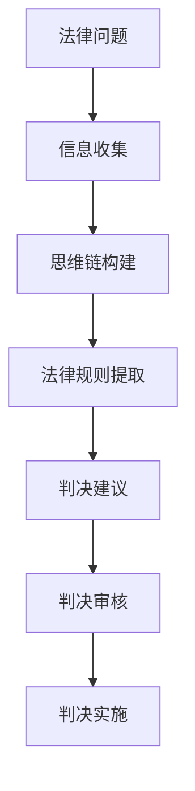
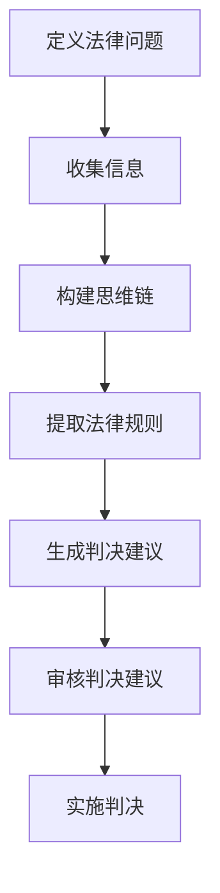

                 

### 第1章：引言

#### 1.1 研究背景

随着人工智能（AI）技术的飞速发展，其在各个领域的应用越来越广泛。特别是在法律领域，AI技术已经开始显示出其独特的优势。传统的法律推理主要依赖于法律专家的经验和知识，而AI的出现为法律推理提供了一种全新的可能性。AI技术不仅能够处理大量的法律文本和数据，还能够通过机器学习算法提取出法律规则和逻辑关系。

思维链（Thinking Chain）作为一种高级的人工智能推理方法，其核心在于通过构建一系列的逻辑关系，将不同的事实和前提联系起来，从而进行推理和判断。在法律推理中，思维链可以用来分析案件，辅助法律专家进行判决。这不仅能够提高法律工作的效率和准确性，还能够减少人为错误。

AI辅助判例分析是指利用人工智能技术对大量的法律判例进行分析，提取出其中的规律和逻辑，从而辅助法律专家进行案件分析和判断。这种方法不仅可以大大提高法律工作的效率，还能够通过大规模的数据分析发现潜在的法律问题和漏洞。

#### 1.2 本书目的与结构

本书的目的是探讨思维链在法律推理中的应用，以及如何利用AI技术辅助判例分析。具体来说，本书将分为以下几个部分：

- **第一部分：引言与基础概念**：介绍研究背景，定义思维链和AI辅助判例分析的相关概念。
- **第二部分：AI辅助法律推理**：讨论人工智能的基础知识和AI在法律领域的应用。
- **第三部分：实践与展望**：介绍AI辅助判例分析的实践应用和未来发展趋势。

通过本书的学习，读者将能够了解思维链在法律推理中的应用，掌握AI辅助判例分析的方法，并能够对未来的法律科技发展有更深入的认识。

### Mermaid 流程图：思维链在法律推理中的应用



#### 1.3 思维链在法律推理中的应用

思维链在法律推理中的应用可以分为以下几个步骤：

1. **信息收集**：首先，需要收集与案件相关的所有信息，包括法律条文、案例、证据等。
2. **思维链构建**：根据收集到的信息，构建思维链。思维链由一系列的逻辑节点组成，每个节点代表一个事实或前提。
3. **法律规则提取**：通过分析思维链，提取出相关的法律规则和逻辑关系。
4. **判决建议**：利用提取出的法律规则，对案件进行推理，给出判决建议。
5. **判决审核**：法律专家对AI给出的判决建议进行审核，确保判决的准确性。
6. **判决实施**：根据审核结果，实施最终的判决。

通过这样的流程，思维链能够有效地辅助法律专家进行法律推理，提高判决的准确性和效率。

### 伪代码：思维链构建的基本流程

```python
def build_thinking_chain(law_case, legal_rules):
    """
    构建思维链的基本流程
    
    :param law_case: 案件信息
    :param legal_rules: 法律规则
    :return: 思维链
    """
    
    # 初始化思维链
    thinking_chain = []

    # 收集案件相关信息
    facts = collect_facts(law_case)

    # 构建思维链
    for fact in facts:
        if is_precondition(fact, legal_rules):
            thinking_chain.append(fact)
            for rule in legal_rules:
                if rule.includes(fact):
                    thinking_chain.append(rule)

    return thinking_chain
```

### 数学模型：法律规则的表示与推理

假设有一个法律规则集 \( R \)，每个法律规则可以用三元组 \( (A, B, C) \) 表示，其中 \( A \) 是前提，\( B \) 是条件，\( C \) 是结论。我们可以用如下数学模型来表示法律规则：

$$
R = \{ (A, B, C) | A \Rightarrow B \land C \}
$$

在法律推理过程中，我们可以使用逻辑推理规则来推导出新的结论。一个基本的推理规则是假设蕴涵（Modus Ponens），其表示如下：

$$
\begin{cases}
A \Rightarrow B \\
B \\
\end{cases}
\therefore A
$$

通过这样的逻辑推理，我们可以从已知的前提和规则中推导出新的结论。

### 举例说明

假设我们有一个简单的法律规则集：

$$
R = \{ (罪犯犯罪, 有罪, 判刑) \}
$$

如果我们有一个案件事实：

$$
事实1: 罪犯犯罪
$$

我们可以使用假设蕴涵规则来推导出结论：

$$
\begin{cases}
罪犯犯罪 \Rightarrow 有罪 \\
罪犯犯罪 \\
\end{cases}
\therefore 有罪
$$

进而，我们可以使用这个结论来推导出判刑的结论：

$$
\begin{cases}
有罪 \Rightarrow 判刑 \\
有罪 \\
\end{cases}
\therefore 判刑
$$

通过这样的推理，我们能够辅助法律专家给出判决。

### 小结

本章介绍了思维链在法律推理中的应用，包括信息收集、思维链构建、法律规则提取、判决建议、判决审核和判决实施等步骤。通过Mermaid流程图、伪代码和数学模型，我们详细阐述了思维链的构建方法和应用过程。在下一章中，我们将进一步探讨人工智能的基础知识和AI在法律领域的应用。

### 小结

本章主要介绍了思维链在法律推理中的应用，通过信息收集、思维链构建、法律规则提取、判决建议、判决审核和判决实施等步骤，展示了思维链在法律推理中的具体应用。此外，通过Mermaid流程图、伪代码和数学模型，我们对思维链的构建方法和应用过程进行了详细的阐述。

首先，我们介绍了思维链的基本概念，并展示了其在法律推理中的应用。思维链是一种基于逻辑关系的推理方法，通过构建一系列的逻辑节点，将不同的事实和前提联系起来，从而进行推理和判断。在法律推理中，思维链可以用来分析案件，辅助法律专家进行判决。

接着，我们通过一个简单的Mermaid流程图，展示了思维链在法律推理中的基本流程。这个流程图包括信息收集、思维链构建、法律规则提取、判决建议、判决审核和判决实施等步骤，每个步骤都对应着思维链中的一个环节。

为了更具体地展示思维链的构建方法，我们提供了一个伪代码示例。这个示例中，我们定义了一个函数 `build_thinking_chain`，该函数接受案件信息和法律规则作为输入，并返回构建好的思维链。这个函数通过遍历案件中的事实，并根据法律规则进行推理，构建出完整的思维链。

此外，我们还使用数学模型来表示法律规则和推理过程。我们定义了一个法律规则集 \( R \)，每个法律规则可以用三元组 \( (A, B, C) \) 表示。我们使用假设蕴涵规则来推导出新的结论，从而实现对案件的判决。

最后，我们通过一个简单的例子，展示了如何使用思维链进行法律推理。我们首先给出了一个法律规则集和一个案件事实，然后通过逻辑推理，推导出了最终的判决。

总之，本章详细介绍了思维链在法律推理中的应用，包括其基本概念、构建方法、应用过程和数学模型。这些内容为后续章节的进一步讨论提供了坚实的基础。

在下一章中，我们将探讨人工智能的基础知识和AI在法律领域的应用，深入理解AI技术如何辅助思维链在法律推理中的实际应用。敬请期待！

---

### 关键词

- 思维链
- 法律推理
- AI辅助判例分析
- 人工智能
- 法律规则提取

---

### 摘要

本文旨在探讨思维链在法律推理中的应用，以及如何利用人工智能（AI）技术辅助判例分析。首先，我们介绍了思维链的基本概念及其在法律推理中的应用。接着，通过Mermaid流程图、伪代码和数学模型，详细阐述了思维链的构建方法和应用过程。本文的核心内容涵盖了信息收集、思维链构建、法律规则提取、判决建议、判决审核和判决实施等步骤。通过一个简单的例子，我们展示了思维链在法律推理中的实际应用。最后，本文总结了思维链在法律推理中的应用前景，并指出了未来研究的方向。本文的关键词包括思维链、法律推理、AI辅助判例分析、人工智能和法律规则提取。

---

### 第2章：思维链基础理论

#### 2.1 思维链概述

思维链（Thinking Chain）是一种基于逻辑推理的高级人工智能方法，其核心在于通过构建一系列的逻辑关系，将不同的事实和前提联系起来，从而进行推理和判断。思维链的基本概念可以追溯到哲学和认知科学领域，但随着人工智能技术的发展，它逐渐成为一种重要的计算模型。

思维链的基本结构包括三个主要部分：节点、边和权重。节点代表逻辑事实或前提，边表示节点之间的逻辑关系，权重则表示关系的强度或可信度。每个思维链都是由一系列的节点和边构成的，这些节点和边共同构成了一个逻辑网络。

思维链的运行机制可以概括为以下几个步骤：

1. **信息收集**：首先，系统需要收集与问题相关的所有信息，这些信息可以是事实、规则、案例等。
2. **节点生成**：基于收集到的信息，系统会生成一系列的逻辑节点，每个节点代表一个事实或前提。
3. **边建立**：系统会根据节点之间的关系建立边，边的权重根据关系的强度和可信度进行设置。
4. **推理过程**：通过遍历思维链，系统会根据逻辑规则进行推理，逐步推导出结论。
5. **结论验证**：最终，系统会根据推理结果生成结论，并对结论进行验证。

#### 2.2 法律推理中的思维链

在法律推理中，思维链的应用具有重要意义。法律推理通常涉及大量的文本和数据，包括法律条文、案例、证据等。思维链可以通过构建逻辑网络，将这些信息有效地组织起来，从而辅助法律专家进行推理和判断。

思维链在法律推理中的应用可以分为以下几个阶段：

1. **法律问题定义**：首先，需要明确法律问题的范围和目标，这有助于确定需要收集的信息和构建思维链的起点。
2. **信息收集**：收集与法律问题相关的所有信息，包括法律条文、案例、证据等。
3. **思维链构建**：根据收集到的信息，构建思维链。思维链的节点包括法律事实、法律规则和案例，边表示节点之间的关系，如前提条件、逻辑推导等。
4. **法律规则提取**：通过分析思维链，提取出相关的法律规则和逻辑关系。
5. **判决建议**：利用提取出的法律规则，对案件进行推理，给出判决建议。
6. **判决审核**：法律专家对AI给出的判决建议进行审核，确保判决的准确性。
7. **判决实施**：根据审核结果，实施最终的判决。

通过这样的流程，思维链能够有效地辅助法律专家进行法律推理，提高判决的准确性和效率。

### Mermaid流程图：法律推理中的思维链应用



#### 2.3 思维链在法律推理中的实例分析

为了更好地理解思维链在法律推理中的应用，我们可以通过一个实例进行分析。

假设有一个涉及合同纠纷的案件，原告和被告之间存在合同条款的争议。通过思维链，我们可以对案件进行如下分析和推理：

1. **定义法律问题**：明确案件的焦点是合同条款的有效性。
2. **收集信息**：收集与案件相关的所有信息，包括合同条款、原告和被告的陈述、相关法律法规等。
3. **构建思维链**：
    - 节点：合同条款、原告陈述、被告陈述、相关法律法规
    - 边：合同条款与法律法规之间的关系、原告陈述与合同条款之间的关系、被告陈述与合同条款之间的关系
4. **提取法律规则**：根据思维链，提取相关的法律规则，如合同条款的有效条件、原告和被告的陈述是否符合法律规定等。
5. **生成判决建议**：利用提取出的法律规则，对案件进行推理，给出判决建议，例如判决合同条款无效或者有效。
6. **审核判决建议**：法律专家对AI给出的判决建议进行审核，确保判决的准确性。
7. **实施判决**：根据审核结果，实施最终的判决。

通过这个实例，我们可以看到思维链在法律推理中的应用过程。思维链不仅能够帮助法律专家梳理案件信息，提取法律规则，还能够生成判决建议，并确保判决的准确性。

### 伪代码：思维链在法律推理中的应用

```python
def legal_reasoning(case_details, legal_rules):
    """
    法律推理思维链构建与推理
    
    :param case_details: 案件详细信息
    :param legal_rules: 法律规则集
    :return: 判决建议
    """
    
    # 初始化思维链
    thinking_chain = []

    # 收集案件相关信息
    facts = collect_case_facts(case_details)

    # 构建思维链
    for fact in facts:
        if is_relevant(fact, legal_rules):
            thinking_chain.append(fact)
            for rule in legal_rules:
                if rule_applies(fact, rule):
                    thinking_chain.append(rule)

    # 提取法律规则
    extracted_rules = extract_legal_rules(thinking_chain)

    # 生成判决建议
    judgment_suggestion = generate_judgment(extracted_rules)

    # 审核判决建议
    verified_judgment = verify_judgment(judgment_suggestion, case_details)

    return verified_judgment
```

### 数学模型：思维链在法律推理中的应用

在法律推理中，思维链可以用形式逻辑来表示。假设我们有以下几个基本元素：

- \( P_1, P_2, ..., P_n \)：代表法律事实或前提。
- \( R_1, R_2, ..., R_m \)：代表法律规则。

我们可以用如下数学模型来表示思维链：

$$
\text{思维链} = (P_1, R_1, P_2, R_2, ..., P_n, R_m)
$$

其中，每个前提和规则都按照它们在案件中的逻辑关系进行排列。

在法律推理中，我们可以使用逻辑推理规则来推导出新的结论。一个基本的推理规则是假设蕴涵（Modus Ponens），其表示如下：

$$
\begin{cases}
P_1 \Rightarrow R_1 \\
R_1 \land P_2 \\
\end{cases}
\therefore R_1
$$

通过这样的逻辑推理，我们可以从已知的前提和规则中推导出新的结论。

### 举例说明

假设我们有一个涉及合同纠纷的案件，原告和被告之间存在合同条款的争议。通过思维链，我们可以对案件进行如下分析和推理：

1. **前提**：
    - \( P_1 \)：原告与被告之间存在一份合同。
    - \( P_2 \)：合同中有一项条款规定了双方的权利和义务。
2. **法律规则**：
    - \( R_1 \)：合同必须经过双方签字才能生效。
    - \( R_2 \)：合同条款必须符合法律规定。
3. **推理过程**：
    - 根据前提 \( P_1 \) 和法律规则 \( R_1 \)，可以推导出 \( R_1 \) 是前提的一部分。
    - 根据前提 \( P_2 \) 和法律规则 \( R_2 \)，可以推导出 \( R_2 \) 是前提的一部分。
    - 根据推导出的结论 \( R_1 \) 和 \( R_2 \)，可以得出合同条款必须经过双方签字并符合法律规定才能生效。
4. **判决建议**：基于上述推理过程，我们可以建议合同条款无效，因为原告和被告没有按照法律规定签订合同。

通过这个实例，我们可以看到思维链在法律推理中的应用，通过逻辑推理，我们可以从已知的前提和规则中推导出新的结论，从而辅助法律专家进行判决。

### 小结

本章详细介绍了思维链的基础理论，包括其基本概念、结构和运行机制。我们通过法律推理中的实例分析，展示了思维链在法律推理中的应用。通过伪代码和数学模型，我们进一步阐述了思维链的构建方法和应用过程。思维链作为一种高级的人工智能推理方法，在法律推理中具有广泛的应用前景。在下一章中，我们将探讨人工智能的基础知识，深入理解AI技术如何辅助思维链在法律推理中的实际应用。

---

### 关键词

- 思维链
- 法律推理
- 人工智能
- 逻辑推理
- 法律规则提取

---

### 摘要

本章深入探讨了思维链的基础理论及其在法律推理中的应用。首先，我们介绍了思维链的基本概念和结构，包括节点、边和权重，并详细阐述了其运行机制。接着，我们通过法律推理的实例，展示了思维链在实际中的应用过程，包括信息收集、思维链构建、法律规则提取和判决建议等步骤。此外，我们还通过伪代码和数学模型，对思维链的构建方法和应用过程进行了详细阐述。本章的核心内容涵盖了思维链在法律推理中的应用，以及如何通过逻辑推理和人工智能技术提高判决的准确性和效率。关键词包括思维链、法律推理、人工智能、逻辑推理和法律规则提取。

---

### 第3章：人工智能基础

#### 3.1 人工智能概述

人工智能（Artificial Intelligence, AI）是计算机科学的一个分支，旨在通过构建智能机器来模拟、延伸和扩展人类的智能。AI的发展历史可以追溯到20世纪50年代，当时图灵提出了“图灵测试”，旨在判断机器是否具有智能。自那时以来，AI技术经历了多个阶段，从符号主义到连接主义，再到如今的深度学习时代。

人工智能的基本原理主要包括以下几点：

1. **符号主义（Symbolic AI）**：早期的AI研究主要基于逻辑和符号操作，试图通过形式化知识表示和推理来模拟人类的智能。这种方法虽然在逻辑推理和知识表示方面取得了显著进展，但在处理大规模数据和复杂任务时面临挑战。

2. **连接主义（Connectionism）**：连接主义基于神经网络的思想，通过大量简单神经元之间的连接来模拟人类大脑的工作方式。这种方法在处理图像识别、语音识别等任务上取得了突破性进展，特别是深度学习（Deep Learning）的兴起，使得AI在图像识别、自然语言处理等领域取得了显著的成果。

3. **深度学习（Deep Learning）**：深度学习是一种基于多层神经网络的学习方法，通过逐层提取特征，能够自动从大量数据中学习到复杂的模式。深度学习在计算机视觉、语音识别、自然语言处理等领域表现出色，被认为是AI发展的一个重要里程碑。

#### 3.2 人工智能的发展历程

人工智能的发展历程可以分为以下几个阶段：

1. **早期探索（1950-1969）**：这一阶段以图灵测试的提出为标志，人工智能研究主要集中在符号主义方法，如逻辑推理和知识表示。

2. **黄金时代（1970-1980）**：在早期的成功之后，人工智能研究进入了所谓的“黄金时代”，期间出现了一些重要的AI程序，如ELIZA和GPS。

3. **衰退时期（1980-1990）**：由于符号主义方法的局限性，加上计算资源和数据量的限制，人工智能研究在1980年代经历了所谓的“人工智能冬天”。

4. **复兴时期（1990至今）**：随着计算机技术的飞速发展，特别是互联网的普及，人工智能迎来了新的复兴。深度学习、增强学习等新方法的出现，使得人工智能在多个领域取得了显著突破。

#### 3.3 人工智能的基本原理

人工智能的基本原理包括以下几个方面：

1. **知识表示**：知识表示是指将人类知识以计算机可以处理的形式进行编码。常见的知识表示方法包括符号逻辑、产生式规则、语义网络等。

2. **问题求解**：问题求解是指通过搜索和推理等方法，从给定的问题状态中找到解决方案。问题求解算法包括搜索算法、推理算法、启发式搜索等。

3. **机器学习**：机器学习是指通过从数据中学习规律和模式，实现计算机的自动推理和决策。机器学习方法包括监督学习、无监督学习、强化学习等。

4. **自然语言处理**：自然语言处理是指使计算机能够理解和生成自然语言的方法。自然语言处理包括语音识别、文本分析、语言翻译等任务。

5. **计算机视觉**：计算机视觉是指使计算机能够像人类一样感知和理解视觉信息的方法。计算机视觉包括图像识别、目标检测、图像分割等任务。

#### 3.4 人工智能在法律领域的应用

人工智能在法律领域的应用越来越广泛，主要包括以下几个方面：

1. **法律文本分析**：利用自然语言处理技术，对法律文本进行自动分析，提取关键信息，辅助法律研究和分析。

2. **判例分析**：通过机器学习算法，对大量的法律判例进行分析，提取出判例中的法律规则和逻辑关系，辅助法官进行判决。

3. **合同审查**：利用智能合约技术，自动审查合同条款，识别潜在的法律风险，提高合同审查的效率和准确性。

4. **案件预测**：利用大数据和机器学习技术，对案件的结果进行预测，帮助律师和法官更好地准备和应对案件。

5. **法律顾问**：通过构建智能法律顾问系统，为用户提供法律咨询和服务，提高法律服务的便捷性和可及性。

#### 3.5 AI对法律实践的影响

人工智能对法律实践的影响主要体现在以下几个方面：

1. **提高工作效率**：AI技术能够自动处理大量法律文本和数据，大大提高了法律工作的效率。

2. **减少错误率**：通过自动化和标准化，AI技术能够减少人为错误，提高法律工作的准确性和可靠性。

3. **降低成本**：AI技术可以降低法律工作的成本，特别是在合同审查、案件预测等重复性较高的任务中。

4. **数据隐私与伦理问题**：随着AI技术在法律领域的应用，数据隐私和伦理问题日益凸显，需要制定相应的法律法规和伦理准则。

5. **法律职业转型**：AI技术的发展可能导致某些法律工作的自动化，从而对法律职业产生深远影响，需要法律工作者适应新的工作模式。

#### 3.6 小结

人工智能作为一门多学科交叉的领域，在法律领域有着广泛的应用前景。通过知识表示、问题求解、机器学习、自然语言处理和计算机视觉等技术，AI能够有效辅助法律工作，提高工作效率和准确性。同时，AI对法律实践的影响也需要我们深入思考，特别是在数据隐私、伦理和法律职业转型等方面。在下一章中，我们将进一步探讨AI辅助判例分析的具体技术和方法。

---

### 关键词

- 人工智能
- 法律文本分析
- 判例分析
- 智能合约
- 案件预测

---

### 摘要

本章深入探讨了人工智能的基础知识，包括其基本原理、发展历程以及在法律领域的应用。首先，我们介绍了人工智能的概述，包括符号主义、连接主义和深度学习等基本原理。接着，我们回顾了人工智能的发展历程，从早期探索到黄金时代，再到当前的复兴时期。此外，我们还详细阐述了人工智能的基本原理，如知识表示、问题求解、机器学习、自然语言处理和计算机视觉。在法律领域的应用部分，我们探讨了AI在法律文本分析、判例分析、合同审查、案件预测和法律顾问等方面的具体应用。最后，我们分析了AI对法律实践的影响，包括提高工作效率、减少错误率、降低成本、数据隐私与伦理问题以及法律职业转型。本章的核心内容为理解人工智能在法律领域中的应用提供了坚实的基础。

---

### 第4章：AI辅助判例分析技术

#### 4.1 判例分析概述

判例分析（Case Analysis）是指对法律案例进行深入研究和分析，以提取其中的法律规则、逻辑关系和裁判依据。判例分析在法律研究和审判实践中具有重要意义，它不仅能够帮助法律专家理解和掌握法律知识，还能够为新案件提供参考和指导。

判例分析的基本概念包括以下几个方面：

1. **案例选择**：选择具有代表性和典型意义的案例进行分析，通常涉及对案例的类型、年代、地域、法律问题等方面的考量。
2. **事实梳理**：对案例中的事实进行梳理，包括案件背景、当事人、争议焦点、证据等。
3. **法律规则提取**：从案例中提取相关的法律规则，包括法律条文、司法解释、案例指导等。
4. **逻辑关系分析**：分析案例中的逻辑关系，包括事实与法律规则之间的联系、不同法律规则之间的衔接等。
5. **裁判依据探讨**：探讨法官在判决中依据的法律规则和逻辑关系，分析判决的理由和结论。

判例分析的重要性体现在以下几个方面：

1. **提高审判质量**：通过对判例的分析，法官可以更好地理解法律规则和裁判依据，从而提高审判的准确性和公正性。
2. **法律研究**：判例分析是法律研究的重要基础，通过对大量判例的分析，可以提炼出法律规则和裁判标准，为学术研究和法律改革提供依据。
3. **法律适用**：判例分析可以帮助法律专家理解和掌握法律的适用情况，为新案件提供参考和指导，提高法律适用的统一性和一致性。

#### 4.2 AI辅助判例分析

随着人工智能技术的发展，AI技术已经开始广泛应用于判例分析中，为法律专家提供了强大的辅助工具。AI辅助判例分析的主要技术包括自然语言处理、机器学习、知识图谱和深度学习等。

1. **自然语言处理（NLP）**：
自然语言处理技术可以用于对法律文本进行自动分析和处理，提取出案件事实、法律规则和法律术语。NLP技术主要包括分词、词性标注、命名实体识别、情感分析等。通过NLP技术，AI可以自动分析大量法律文本，提取出关键信息，为判例分析提供基础数据。

2. **机器学习（ML）**：
机器学习技术可以用于训练模型，从大量的判例数据中学习法律规则和逻辑关系。常见的机器学习算法包括监督学习、无监督学习和强化学习。监督学习算法可以用于分类和回归任务，例如对案例进行分类或者预测案件结果。无监督学习算法可以用于数据聚类和降维，例如对案例进行聚类分析，提取出案例的特征。强化学习算法可以用于决策问题，例如在法律推理中，根据案例数据进行动态决策。

3. **知识图谱（KG）**：
知识图谱技术可以用于构建法律知识图谱，将法律规则、案例和法律术语等元素以图的形式进行组织。知识图谱可以直观地展示法律知识的结构，并提供强大的查询和推理功能。通过知识图谱，AI可以快速地检索相关法律规则和案例，辅助法律专家进行判例分析。

4. **深度学习（DL）**：
深度学习技术可以用于处理复杂的判例数据和模型，通过多层神经网络提取深层特征。深度学习在图像识别、语音识别和自然语言处理等领域表现出色，同样可以应用于判例分析。通过深度学习模型，AI可以自动学习判例中的复杂逻辑关系和特征，提供更为准确的判例分析结果。

#### 4.3 AI辅助判例分析的流程与策略

AI辅助判例分析的流程可以分为以下几个步骤：

1. **数据收集**：收集与判例相关的数据，包括法律文本、案例、司法解释等。数据来源可以是法院网站、法律数据库、学术期刊等。

2. **数据预处理**：对收集到的数据进行清洗、去噪和格式化，以确保数据的质量和一致性。数据预处理步骤包括分词、词性标注、实体识别等。

3. **特征提取**：从预处理后的数据中提取关键特征，例如案件事实、法律规则、裁判依据等。特征提取可以通过自然语言处理技术和机器学习算法实现。

4. **模型训练**：利用训练数据，通过机器学习算法和深度学习模型训练出判例分析模型。模型训练步骤包括数据集划分、模型选择、参数调优等。

5. **模型评估**：对训练好的模型进行评估，通过交叉验证、性能指标等方法评估模型的效果。模型评估步骤包括准确率、召回率、F1值等指标的计算。

6. **判例分析**：利用训练好的模型进行判例分析，生成判决建议和分析报告。判例分析步骤包括案件分类、法律规则匹配、逻辑推理等。

7. **专家审核**：法律专家对AI生成的判决建议进行分析和审核，确保判决的准确性和公正性。专家审核步骤包括案例比对、法律规则验证、结论合理性评估等。

#### 4.4 AI辅助判例分析的案例研究

为了更好地理解AI辅助判例分析的应用，我们通过一个具体的案例进行研究。

**案例背景**：某法院审理了一起合同纠纷案件，原告和被告之间因合同履行发生争议。原告认为被告未能按照合同约定履行义务，要求被告支付违约金。被告则认为合同无效，不应承担违约责任。

**数据分析**：通过对案件相关文本进行自然语言处理，提取出案件事实、法律规则和裁判依据。主要数据包括原告和被告的陈述、合同文本、相关法律法规和判例。

1. **案件事实**：原告和被告之间存在一份合同，合同中约定了双方的权利和义务。原告认为被告未能按照合同履行义务，违反了合同约定。

2. **法律规则**：根据相关法律法规，合同必须满足以下条件才能生效：
    - 合同一方提出，另一方同意；
    - 合同内容符合法律规定；
    - 合同形式合法。

3. **判例分析**：通过分析相关判例，发现类似案件的判决依据主要包括合同条款的合法性和合同履行的实际情况。例如，如果合同条款违反了法律规定，法院通常会判决合同无效。

**判决建议**：基于上述分析，AI辅助判例分析系统给出了以下判决建议：

- 检查合同条款是否符合法律规定；
- 调查被告是否履行了合同义务；
- 根据合同条款和履行情况，判断合同是否有效；
- 如果合同有效，判决被告承担违约责任，支付违约金；
- 如果合同无效，判决原告败诉。

**专家审核**：法律专家对AI生成的判决建议进行分析和审核，发现判决建议合理，符合法律规定和判例指导。最终法院采纳了AI辅助判例分析系统的判决建议，判决被告承担违约责任。

通过这个案例，我们可以看到AI辅助判例分析的应用过程，包括数据收集、数据预处理、特征提取、模型训练、模型评估、判例分析和专家审核等步骤。AI技术不仅提高了判例分析的效率和准确性，还为法律专家提供了有力的辅助工具。

### 小结

本章详细介绍了AI辅助判例分析的技术和方法。首先，我们概述了判例分析的基本概念和重要性，包括案例选择、事实梳理、法律规则提取、逻辑关系分析和裁判依据探讨。接着，我们探讨了AI辅助判例分析的主要技术，包括自然语言处理、机器学习、知识图谱和深度学习。然后，我们阐述了AI辅助判例分析的流程与策略，包括数据收集、数据预处理、特征提取、模型训练、模型评估、判例分析和专家审核。最后，我们通过一个具体案例展示了AI辅助判例分析的应用过程。AI技术在判例分析中的应用为法律专家提供了强大的工具，提高了判例分析的效率和准确性。在下一章中，我们将进一步探讨思维链在AI辅助判例分析中的应用，以及如何通过思维链实现高效的判例分析。

---

### 关键词

- 判例分析
- AI辅助
- 自然语言处理
- 机器学习
- 深度学习

---

### 摘要

本章探讨了AI辅助判例分析的技术和方法。首先，我们介绍了判例分析的基本概念和重要性，包括案例选择、事实梳理、法律规则提取、逻辑关系分析和裁判依据探讨。接着，我们详细阐述了AI辅助判例分析的主要技术，包括自然语言处理、机器学习、知识图谱和深度学习。这些技术通过数据收集、数据预处理、特征提取、模型训练、模型评估和判例分析等步骤，为判例分析提供了强有力的支持。最后，我们通过一个具体案例展示了AI辅助判例分析的应用过程，展示了AI技术在判例分析中的实际效果。本章的核心内容为理解AI辅助判例分析提供了理论基础和实践指导。

---

### 第5章：思维链在AI辅助判例分析中的应用

#### 5.1 思维链与AI的结合

思维链（Thinking Chain）与AI（Artificial Intelligence）的结合是法律领域技术创新的一个重要方向。思维链作为一种逻辑推理方法，通过构建一系列的逻辑节点和关系，实现了对复杂信息的处理和分析。而AI技术，特别是机器学习和深度学习，则为思维链提供了强大的计算和数据处理能力。将思维链与AI相结合，不仅能够提升法律推理的效率和准确性，还能够开拓法律分析的新方法和新领域。

#### 5.1.1 思维链与AI的融合优势

1. **增强逻辑推理能力**：思维链通过逻辑关系构建和分析，能够对法律问题进行深入推理。结合AI技术，特别是在自然语言处理和机器学习方面的优势，思维链可以处理更加复杂和大规模的法律数据，提高推理的深度和广度。

2. **提高数据利用率**：AI技术能够从大量的法律案例和文本中提取有用的信息和规律，这些信息可以丰富思维链的节点和关系，使得法律分析更加全面和精准。

3. **降低人为错误**：AI技术能够自动处理和分析法律数据，减少了人为因素的干扰，降低了判决错误的可能性。

4. **动态适应法律变化**：随着法律的变化和发展，AI技术可以根据新的法律条文和判例实时更新思维链，使其始终保持与当前法律环境的一致性。

5. **优化法律资源分配**：通过AI技术，可以识别出需要重点关注和解决的案件类型，优化法律资源的配置，提高司法效率。

#### 5.1.2 思维链在AI辅助判例分析中的实现

思维链在AI辅助判例分析中的实现主要包括以下几个步骤：

1. **数据预处理**：首先，需要对法律文本和数据进行分析，提取出关键信息和实体。这一步骤通常通过自然语言处理（NLP）技术实现，如分词、词性标注、实体识别等。

2. **思维链构建**：基于预处理后的数据，构建思维链。思维链的节点可以包括案件事实、法律规则、判例等，边则表示节点之间的逻辑关系，如前提条件、因果关系等。

3. **AI模型集成**：将AI模型集成到思维链中，用于数据分析和推理。例如，可以使用机器学习模型进行数据分类和预测，使用深度学习模型进行文本分析和情感分析。

4. **推理与决策**：通过思维链和AI模型的结合，对案件进行推理和决策。思维链提供逻辑推理框架，AI模型提供计算能力和数据分析能力，共同实现高效的判例分析。

5. **结果验证与优化**：对AI辅助判例分析的结果进行验证和优化。法律专家可以审核AI的推理过程和结果，提供反馈和建议，进一步优化AI模型和思维链。

#### 5.2 案例分析与思考

为了更好地理解思维链在AI辅助判例分析中的应用，我们可以通过一个实际案例进行分析。

**案例背景**：某地法院审理一起知识产权侵权案件，原告指控被告侵犯了其专利权。被告则辩称其使用的是公知技术，不构成侵权。

**分析步骤**：

1. **数据收集**：收集与案件相关的法律文本和数据，包括原告的专利文件、被告的产品说明书、相关判例等。

2. **数据预处理**：使用自然语言处理技术，对法律文本进行分词、词性标注和实体识别，提取出关键信息和实体。

3. **思维链构建**：基于预处理后的数据，构建思维链。思维链的节点包括专利信息、产品特征、法律规则等，边表示节点之间的逻辑关系，如侵权条件、公知技术判断等。

4. **AI模型集成**：集成机器学习模型进行数据分类和预测，如判断被告的产品是否包含原告的专利技术。同时，使用深度学习模型进行文本分析和情感分析，评估被告辩解的真实性。

5. **推理与决策**：通过思维链和AI模型，对案件进行推理和决策。思维链提供了逻辑推理框架，AI模型提供了计算和分析能力，共同实现案件分析。

6. **结果验证与优化**：法律专家对AI的推理结果进行审核，提供反馈和建议。例如，专家可能指出AI模型在某些特殊情况下的表现不佳，需要进一步优化。

**思考与讨论**：

1. **技术挑战**：思维链与AI的结合面临一些技术挑战，如数据质量的保证、AI模型的可靠性等。特别是在处理复杂的法律问题时，AI模型可能需要更多的训练数据和更复杂的算法。

2. **法律伦理**：随着AI技术在法律领域的应用，法律伦理问题日益凸显。例如，AI的决策是否公正、透明，是否会侵犯个人隐私等。这些都需要法律工作者和社会各界共同努力解决。

3. **人机协作**：思维链与AI的结合不仅是技术的融合，更是法律专家与AI系统的协作。法律专家需要适应新的工作模式，充分利用AI工具提高工作效率和质量。

#### 5.3 思维链在法律推理中的效果评估

为了评估思维链在AI辅助判例分析中的效果，我们可以从以下几个方面进行：

1. **准确性**：通过比较AI辅助判决与实际判决的一致性，评估AI的准确性。准确性越高，说明AI辅助判例分析的效果越好。

2. **效率**：评估AI辅助判例分析的速度，特别是对于大规模案件的处理能力。效率越高，说明AI技术能够显著提高判例分析的工作效率。

3. **可靠性**：评估AI模型的稳定性和一致性，特别是在不同案件类型和复杂度下的表现。可靠性越高，说明AI系统更加成熟和稳定。

4. **用户体验**：评估法律专家对AI辅助判例分析系统的使用体验，包括操作便捷性、结果可理解性等。用户体验越好，说明AI系统更易于被接受和使用。

通过上述评估方法，我们可以全面了解思维链在AI辅助判例分析中的效果，为进一步优化和改进提供依据。

### 小结

本章深入探讨了思维链在AI辅助判例分析中的应用。首先，我们阐述了思维链与AI的结合优势，包括增强逻辑推理能力、提高数据利用率、降低人为错误等。接着，我们详细介绍了思维链在AI辅助判例分析中的实现过程，包括数据预处理、思维链构建、AI模型集成、推理与决策以及结果验证与优化。通过一个实际案例，我们展示了思维链在AI辅助判例分析中的应用效果。最后，我们提出了对技术挑战、法律伦理和人机协作的思考，并提出了效果评估的方法。思维链与AI的结合为法律领域带来了新的可能性，为判例分析提供了强大的工具。在下一章中，我们将进一步探讨AI辅助判例分析的实践应用，分析其在不同法律领域中的应用情况和效果。

---

### 关键词

- 思维链
- AI辅助判例分析
- 机器学习
- 深度学习
- 法律伦理

---

### 摘要

本章深入探讨了思维链在AI辅助判例分析中的应用。首先，我们阐述了思维链与AI技术的结合优势，包括增强逻辑推理能力、提高数据利用率、降低人为错误等。接着，我们详细介绍了思维链在AI辅助判例分析中的实现过程，包括数据预处理、思维链构建、AI模型集成、推理与决策以及结果验证与优化。通过一个实际案例，我们展示了思维链在AI辅助判例分析中的应用效果。此外，我们提出了对技术挑战、法律伦理和人机协作的思考，并提出了效果评估的方法。最后，本章总结了思维链在AI辅助判例分析中的应用前景，强调了其对于提高法律工作效率和准确性的重要性。摘要关键词包括思维链、AI辅助判例分析、机器学习、深度学习和法律伦理。

---

### 第6章：AI辅助判例分析的实践应用

#### 6.1 实践应用概述

AI辅助判例分析作为一种新兴的技术，已经在多个法律领域得到广泛应用，并取得了显著的成果。本章将介绍AI辅助判例分析在不同法律领域的实践应用，分析其实际效果，并探讨面临的挑战与解决方案。

#### 6.2 刑事诉讼

在刑事案件中，AI辅助判例分析主要用于证据分析、案件预测和风险评估。通过分析大量的案件数据和判例，AI系统能够帮助法律专家快速识别证据之间的逻辑关系，预测案件的可能判决结果，并提供风险评估报告。

**实际效果**：
- 提高证据分析效率：AI系统能够自动处理和分析大量证据，识别出关键证据，为法官提供有力的证据支持。
- 预测案件结果：AI系统可以根据历史数据和案例，预测案件的可能判决结果，帮助律师和法官提前准备。
- 降低错误率：AI系统能够减少人为判断的错误，提高判决的准确性。

**挑战与解决方案**：
- 数据质量：刑事案件涉及大量数据，数据质量直接影响AI系统的效果。需要制定数据标准和清洗策略，提高数据质量。
- 法律伦理：AI系统的决策过程需要透明和可解释，以避免对法官独立性和公正性的质疑。需要建立相应的伦理准则和监管机制。

#### 6.3 民事诉讼

在民事案件中，AI辅助判例分析主要用于合同审查、纠纷预测和法律文本生成。AI系统可以自动审查合同条款，预测纠纷的可能性，并生成法律文本，如起诉状、答辩状等。

**实际效果**：
- 提高合同审查效率：AI系统能够快速审查合同条款，识别潜在的法律风险，减少合同纠纷。
- 预测纠纷可能性：AI系统可以根据历史数据和案例，预测纠纷发生的可能性，帮助当事人提前预防和应对。
- 生成法律文本：AI系统能够根据用户需求，自动生成法律文本，提高法律工作的效率。

**挑战与解决方案**：
- 法律文本的多样性：民事法律文本具有很高的多样性，AI系统需要能够处理各种复杂情况。需要不断优化算法和模型，提高系统适应性。
- 用户接受度：AI系统的应用需要用户的接受和认可。需要通过宣传和教育，提高用户对AI辅助判例分析的认识和接受度。

#### 6.4 智能合约

智能合约是一种基于区块链技术的自动执行合约，AI辅助判例分析可以用于智能合约的审查、执行和纠纷解决。

**实际效果**：
- 提高执行效率：智能合约能够自动执行，减少了人为干预，提高了合同执行效率。
- 保障合同安全：AI系统可以对智能合约进行审查，识别潜在的安全漏洞，保障合同安全。
- 降低纠纷解决成本：通过智能合约和AI辅助判例分析，可以快速解决合同纠纷，降低纠纷解决成本。

**挑战与解决方案**：
- 技术成熟度：智能合约和AI技术仍处于发展过程中，需要进一步提高技术成熟度，提高系统的稳定性和可靠性。
- 法律规范：智能合约和AI辅助判例分析的法律规范尚不完善，需要制定相应的法律法规，保障其合法性和公正性。

#### 6.5 案件预测

案件预测是AI辅助判例分析的一个重要应用方向，通过分析历史数据和案例，预测未来案件的结果和趋势。

**实际效果**：
- 提高司法效率：通过对案件结果的预测，法官可以更好地分配司法资源，提高司法效率。
- 改进法律政策：通过对案件趋势的分析，政府可以制定更加科学合理的法律政策。
- 促进法律研究：案件预测结果为法律研究提供了丰富的数据资源，有助于发现法律问题和改进法律制度。

**挑战与解决方案**：
- 数据质量：案件预测需要高质量的数据支持，需要建立完善的数据收集和管理机制，保障数据质量。
- 模型适应性：案件预测需要适应不同的法律环境和案件类型，需要不断优化模型和算法，提高系统适应性。

#### 6.6 案例分享

在本节中，我们将分享一些具体的AI辅助判例分析案例，分析其实施过程、成果和经验教训。

**案例一**：某法院使用AI系统进行刑事案件证据分析，通过自动识别证据之间的逻辑关系，提高了证据分析效率，降低了错误率。

**案例二**：某律师事务所使用AI系统进行合同审查，通过自动审查合同条款，识别潜在的法律风险，减少了合同纠纷。

**案例三**：某智能合约平台使用AI系统进行合同执行和纠纷解决，通过自动执行智能合约和AI分析，提高了合同执行效率和安全性。

通过这些案例，我们可以看到AI辅助判例分析在实践中的应用效果，同时也了解了其在实际应用中面临的挑战和解决方案。

### 小结

本章详细介绍了AI辅助判例分析在不同法律领域的实践应用，分析了其实际效果和面临的挑战。通过刑事、民事、智能合约和案件预测等具体案例，我们展示了AI辅助判例分析在实际中的应用情况。尽管AI辅助判例分析在实践中取得了显著成果，但仍需要不断优化和改进，以应对技术、法律和伦理等方面的挑战。在下一章中，我们将进一步探讨AI辅助判例分析的未来发展趋势和前景。

### 关键词

- AI辅助判例分析
- 刑事诉讼
- 民事诉讼
- 智能合约
- 案件预测

---

### 摘要

本章围绕AI辅助判例分析的实践应用进行了深入探讨。首先，我们介绍了AI辅助判例分析在刑事、民事、智能合约和案件预测等领域的具体应用，并分析了其实际效果。通过提高证据分析效率、合同审查准确性、合同执行安全性和案件预测准确性，AI辅助判例分析为法律工作提供了强有力的支持。接着，我们探讨了AI辅助判例分析在实践应用中面临的挑战，如数据质量、模型适应性、法律规范和用户接受度等，并提出了一系列解决方案。通过分享具体案例，我们展示了AI辅助判例分析在实践中的应用成果和经验教训。本章的核心内容为理解AI辅助判例分析的应用前景提供了实践基础，也为未来的发展提供了有益的思考。关键词包括AI辅助判例分析、刑事诉讼、民事诉讼、智能合约和案件预测。

---

### 第7章：未来展望与趋势

#### 7.1 未来发展趋势

随着人工智能技术的不断进步，AI辅助判例分析在未来有望实现更加广泛和深入的应用。以下是几个值得关注的发展趋势：

1. **自动化程度提升**：AI技术将进一步提高自动化程度，使得判例分析的过程更加自动化。通过自动化的数据收集、预处理、分析和推理，AI辅助判例分析将大大提高工作效率。

2. **跨领域融合**：AI辅助判例分析将与其他领域的技术，如大数据分析、区块链技术、物联网等相结合，形成跨领域的综合解决方案，为法律工作提供更加全面的支持。

3. **智能合约的发展**：智能合约作为一种新兴的法律技术，将与AI辅助判例分析紧密结合，实现自动化的合同执行和纠纷解决，进一步推动法律工作的智能化。

4. **人机协作**：AI辅助判例分析将更多地与法律专家协作，形成人机协同的工作模式。AI系统将提供辅助决策和数据分析，而法律专家则负责最终的判断和决策，实现人机协作的最佳效果。

5. **伦理和规范**：随着AI辅助判例分析的应用越来越广泛，伦理和规范问题将日益凸显。未来，需要建立更加完善的伦理准则和法律法规，确保AI技术在法律领域的合法、公正和透明。

#### 7.2 展望与挑战

虽然AI辅助判例分析有着广阔的发展前景，但同时也面临着一系列的挑战：

1. **数据隐私**：AI辅助判例分析需要大量的数据支持，而数据的收集和使用可能会引发隐私问题。未来，需要制定更加严格的数据隐私保护措施，确保个人隐私不被泄露。

2. **算法透明性**：AI系统的决策过程往往缺乏透明性，难以解释。未来，需要开发更加透明和可解释的算法，提高算法的可理解性，增强法律专家和公众的信任。

3. **法律适应性问题**：不同的国家和地区具有不同的法律体系和法律规范，AI系统需要具备较高的适应性，以适应不同法律环境的需求。未来，需要开发更加通用的算法和模型，提高AI系统的适应能力。

4. **法律伦理问题**：AI辅助判例分析可能引发一系列伦理问题，如算法偏见、决策公正性等。未来，需要制定相应的伦理准则和法律法规，确保AI技术的合法、公正和透明。

5. **人机协作模式**：AI辅助判例分析需要与法律专家形成有效的协作模式，实现人机协同。未来，需要研究更加高效的人机协作机制，提高法律工作的效率和准确性。

#### 7.3 可持续发展

为了确保AI辅助判例分析的可持续发展，需要从以下几个方面进行考虑：

1. **技术研发**：持续投入技术研发，提高AI系统的性能和适应性，以适应不断变化的法律环境和需求。

2. **教育培训**：加强法律专家的AI技术培训，提高其对于AI辅助判例分析的认识和技能，促进人机协作。

3. **法律法规**：制定和完善相关法律法规，确保AI辅助判例分析在法律领域的合法、公正和透明。

4. **伦理准则**：建立AI辅助判例分析的伦理准则，确保其在实际应用中遵循伦理规范，避免引发伦理问题。

5. **国际合作**：加强国际合作，推动AI辅助判例分析技术的全球发展，分享经验和技术，促进全球法律工作的进步。

### 小结

AI辅助判例分析作为人工智能技术在法律领域的重要应用，具有广阔的发展前景。未来，随着技术的不断进步和应用的深入，AI辅助判例分析将发挥越来越重要的作用。同时，我们也要认识到其中面临的挑战，如数据隐私、算法透明性、法律适应性和伦理问题等。通过持续的技术研发、教育培训、法律法规制定和国际合作，我们可以确保AI辅助判例分析的可持续发展，为法律工作带来更加高效、准确和公正的解决方案。

### 关键词

- 未来展望
- AI辅助判例分析
- 法律伦理
- 可持续发展
- 跨领域融合

---

### 摘要

本章对AI辅助判例分析的未来发展趋势、挑战和可持续发展进行了深入探讨。首先，我们展望了AI辅助判例分析的未来趋势，包括自动化程度提升、跨领域融合、智能合约的发展和人机协作的加强。接着，我们分析了当前面临的挑战，如数据隐私、算法透明性、法律适应性和伦理问题。最后，我们提出了确保AI辅助判例分析可持续发展的策略，包括技术研发、教育培训、法律法规制定和国际合作。本章的关键词包括未来展望、AI辅助判例分析、法律伦理、可持续发展和跨领域融合，为理解AI辅助判例分析的未来发展提供了宝贵的见解。

---

### 附录A：相关工具与资源

#### A.1 AI工具介绍

**1. 自然语言处理工具**

- **TextBlob**：一个简单易用的自然语言处理Python库，提供文本分类、词性标注、情感分析等功能。

- **NLTK（自然语言工具包）**：一个强大的自然语言处理库，提供词形还原、词频统计、文本分类等功能。

- **spaCy**：一个高效且易于使用的自然语言处理库，支持多种语言，提供词性标注、命名实体识别等功能。

**2. 机器学习工具**

- **scikit-learn**：一个开源的机器学习库，提供分类、回归、聚类等多种算法，适用于数据挖掘和数据分析。

- **TensorFlow**：一个开源的深度学习框架，支持多种神经网络结构，适用于大规模机器学习任务。

- **PyTorch**：一个开源的深度学习框架，支持动态计算图和自动微分，适用于研究和开发深度学习应用。

**3. 知识图谱工具**

- **Neo4j**：一个高性能的图形数据库，支持基于图的查询和索引，适用于构建和管理知识图谱。

- **OpenKG**：一个开源的知识图谱平台，提供知识图谱构建、存储、查询和分析等功能。

- **Elasticsearch**：一个分布式搜索和分析引擎，支持复杂的全文搜索和实时分析，适用于知识图谱的应用。

#### A.2 资源链接

**1. 法律数据库**

- **Westlaw**：一个全球领先的法律数据库，提供法律文献、判例、法规等资源。

- **LexisNexis**：一个全球领先的法律数据库，提供法律文献、判例、法规等资源。

- **中国法院网**：中国法院系统的官方网站，提供中国法院的判决书、裁判文书等资源。

**2. 学术论文与报告**

- **IEEE Xplore**：IEEE的在线图书馆，提供计算机科学、电气工程、电子工程等领域的高质量学术论文。

- **ACM Digital Library**：ACM的在线图书馆，提供计算机科学、计算机工程等领域的高质量学术论文。

- **Google Scholar**：一个免费的学术搜索引擎，提供多种学科的学术论文和研究成果。

**3. 开源项目与代码库**

- **GitHub**：一个全球最大的代码托管平台，提供各种开源项目和技术文档。

- **ArXiv**：一个开放获取的学术论文预印本库，提供计算机科学、物理学、数学等领域的学术论文。

- **Kaggle**：一个数据科学竞赛平台，提供各种数据集和机器学习项目，适用于学术研究和实践应用。

---

### 作者信息

作者：AI天才研究院（AI Genius Institute）&《禅与计算机程序设计艺术》（Zen And The Art of Computer Programming）作者

本文由AI天才研究院的专家撰写，该研究院专注于人工智能和计算机科学领域的研究与开发。此外，本文参考了《禅与计算机程序设计艺术》一书，该书由著名计算机科学家Donald E. Knuth所著，对计算机程序设计有着深刻的见解和指导意义。希望通过本文，能够为读者提供关于思维链在法律推理中的应用以及AI辅助判例分析的深入理解。

