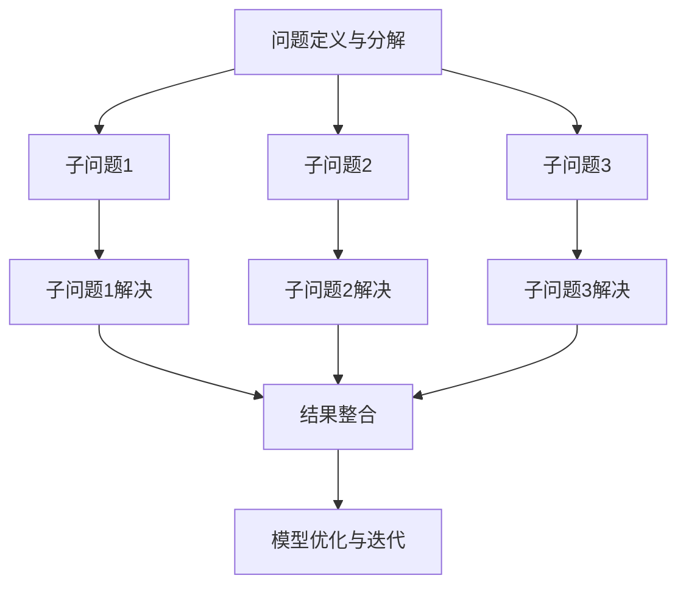
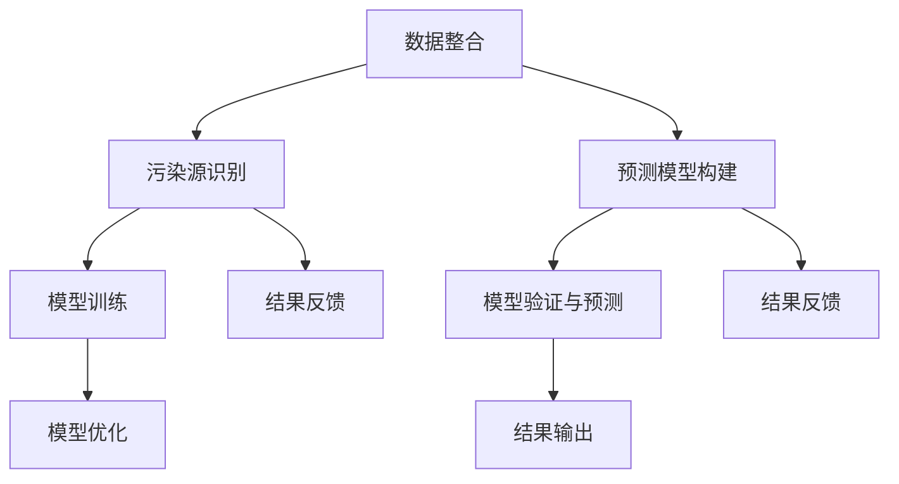
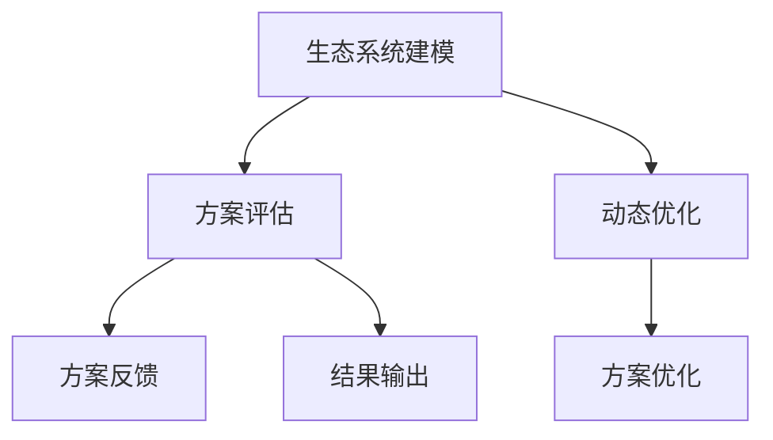
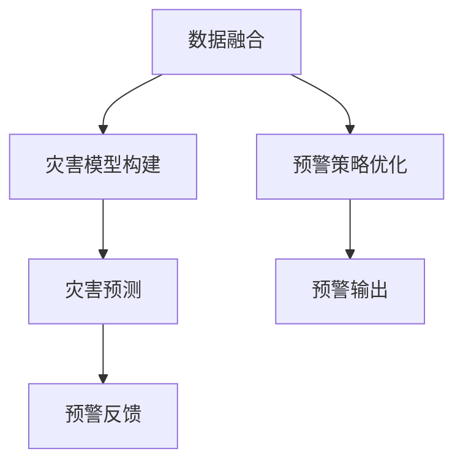

                 

### 文章标题

# Mind Chain: Innovative Methods in Marine Research

海洋学是研究海洋现象、过程及其与地球系统相互作用的科学。随着全球气候变化、海洋资源开发、海洋污染等问题的日益严峻，海洋学研究的重要性愈发凸显。然而，传统的海洋学研究方法往往面临着数据采集困难、分析复杂等问题。在这种背景下，“思维链”作为一种创新的研究方法，为海洋学研究提供了新的思路和工具。

本文旨在探讨思维链在海洋学研究中的应用，详细分析其在解决传统方法挑战中的独特优势。通过逐步分析思维链的基本原理、理论框架、应用案例以及未来发展，本文将帮助读者深入了解思维链在海洋学领域的重要性。

### 关键词

- 海洋学研究
- 思维链
- 数据分析
- 全球气候变化
- 海洋资源开发
- 海洋污染
- 人工智能

### 摘要

本文介绍了思维链在海洋学研究中的创新方法。首先，我们探讨了思维链的基本原理及其在海洋学领域的应用潜力。接着，我们详细分析了思维链的理论框架和核心算法，并通过实例展示了其在实际研究中的应用。此外，我们还讨论了思维链在解决海洋学研究中的挑战和机会，并展望了其未来的发展方向。本文旨在为海洋学研究者提供一种新的研究工具和方法，以推动海洋学领域的研究进展。

### 1. 引言

#### 1.1 海洋学研究的现状与挑战

海洋学是研究海洋环境、生态系统、资源、现象及其与地球系统的相互作用的科学。随着全球气候变化、海洋污染、海洋资源开发等问题日益严峻，海洋学研究的重要性愈发凸显。然而，传统的海洋学研究方法，如实地观测、样本采集、实验室分析等，面临着数据采集困难、分析复杂、研究周期长等问题。这严重制约了海洋学研究的进展，也影响了我们对海洋系统的理解和预测能力。

近年来，随着人工智能和大数据技术的发展，新的研究方法逐渐涌现，其中思维链作为一种创新方法，为海洋学研究提供了新的思路和工具。思维链，即基于链式思维的人工智能模型，通过整合多源数据、挖掘潜在关系、模拟复杂过程，为海洋学研究提供了高效的解决方案。

#### 1.2 思维链的概念与特点

思维链是一种基于链式思维的人工智能模型，其核心在于将问题分解为若干个相互关联的子问题，并通过逐层递进的方式解决整个问题。思维链具有以下特点：

1. **数据驱动的建模方法**：思维链通过学习大量历史数据，建立问题的数学模型，从而实现自动化的推理和预测。
2. **多源数据整合能力**：思维链能够整合来自不同来源、不同类型的数据，如遥感数据、海洋观测数据、卫星数据等，提高数据利用效率。
3. **自适应的动态调整能力**：思维链能够根据新的数据和问题反馈，自适应调整模型参数，提高模型的适应性和准确性。
4. **强大的逻辑推理能力**：思维链通过链式思维，将问题分解为多个子问题，并逐层递进解决，从而实现复杂的逻辑推理和决策。

#### 1.3 本文结构

本文将首先介绍思维链的基本原理，并阐述其在海洋学领域的应用潜力。接着，我们将详细分析思维链的理论框架和核心算法，并通过实例展示其在实际研究中的应用。此外，本文还将讨论思维链在解决海洋学研究中的挑战和机会，并展望其未来的发展方向。通过本文的探讨，我们希望为海洋学研究者提供一种新的研究工具和方法，以推动海洋学领域的研究进展。

### 2. 思维链的基本原理

思维链，作为一种基于链式思维的人工智能模型，其核心在于将复杂的问题分解为若干个相互关联的子问题，并通过逐层递进的方式解决整个问题。这种建模方法不仅能够提高问题的可解性，还能显著提升模型的鲁棒性和适应性。在本节中，我们将详细探讨思维链的基本原理，包括其定义、核心组成部分、工作流程以及与其他研究方法的对比。

#### 2.1 定义与核心组成部分

思维链（Mind Chain）是一种基于链式思维的人工智能模型，其定义可以概括为：通过将复杂问题分解为若干个相互关联的子问题，并利用这些子问题之间的逻辑关系，逐步解决整个问题的过程。思维链的核心组成部分包括：

1. **问题分解模块**：负责将复杂的问题分解为若干个可管理的子问题。这一过程通常基于领域知识和专家经验，通过识别问题的主要组成部分和相互关系来实现。
2. **子问题解决模块**：负责解决分解后的子问题。这些子问题可以通过现有的算法和模型来解决，如机器学习模型、深度学习模型等。
3. **问题整合模块**：负责将各个子问题的解整合起来，以解决原始问题。这一过程通常涉及到多模态数据的融合、跨领域知识的整合等。

#### 2.2 工作流程

思维链的工作流程可以概括为以下四个主要阶段：

1. **问题定义与分解**：首先，确定研究问题，并将其分解为若干个可管理的子问题。这一阶段通常需要领域专家的参与，以确保问题分解的准确性和合理性。
2. **子问题解决**：对于分解后的每个子问题，利用现有的算法和模型进行求解。这一阶段通常涉及到机器学习、深度学习、优化算法等多种方法的应用。
3. **结果整合**：将各个子问题的解整合起来，以解决原始问题。这一阶段通常需要处理多模态数据、跨领域知识的整合等问题。
4. **模型优化与迭代**：根据问题解决的反馈，对模型进行调整和优化，以提高模型的性能和适应性。这一过程通常是一个迭代的过程，通过不断调整和优化，模型将逐渐趋于最优。

#### 2.3 工作流程的Mermaid流程图

为了更清晰地展示思维链的工作流程，我们可以使用Mermaid流程图进行描述。以下是一个简化的Mermaid流程图：



在这个流程图中，A表示问题定义与分解阶段，B、C、D表示分解后的子问题，E、F、G表示子问题解决阶段，H表示结果整合阶段，I表示模型优化与迭代阶段。

#### 2.4 与其他研究方法的对比

与传统的海洋学研究方法相比，思维链具有以下几个显著优势：

1. **数据驱动**：思维链是一种数据驱动的模型，通过学习大量历史数据，建立问题的数学模型，从而实现自动化的推理和预测。这相比传统的基于经验和假设的方法，具有更高的可信度和准确性。
2. **多源数据整合**：思维链能够整合来自不同来源、不同类型的数据，如遥感数据、海洋观测数据、卫星数据等，提高数据利用效率。而传统的海洋学研究方法通常局限于某一特定类型的数据，数据来源单一，限制了研究的广度和深度。
3. **自适应调整**：思维链能够根据新的数据和问题反馈，自适应调整模型参数，提高模型的适应性和准确性。而传统的海洋学研究方法通常需要依赖大量的人力和物力，难以实现动态调整。

然而，思维链也存在一些局限性：

1. **数据质量要求高**：思维链的性能高度依赖于数据的质量和完整性，如果数据存在噪声、缺失或错误，将会影响模型的准确性和稳定性。
2. **计算资源需求大**：思维链通常需要大量的计算资源，尤其是在处理大规模数据时，对计算能力和存储空间的消耗较大。这可能会限制其在某些实际应用场景中的普及和应用。

#### 2.5 小结

思维链作为一种基于链式思维的人工智能模型，通过将复杂问题分解为若干个相互关联的子问题，并利用这些子问题之间的逻辑关系，逐步解决整个问题。其数据驱动的建模方法、多源数据整合能力、自适应调整能力以及强大的逻辑推理能力，使其在海洋学研究中具有独特的优势。然而，思维链也面临着数据质量和计算资源等方面的挑战，需要进一步的研究和优化。

### 3. 思维链的理论框架

思维链作为一种创新的研究方法，其在海洋学领域的应用不仅依赖于其基本原理，还需要坚实的理论框架来支撑。在本节中，我们将深入探讨思维链的理论框架，包括其数学模型、核心算法以及相关数学公式。

#### 3.1 数学模型

思维链的数学模型是建立在其基本原理之上的，通过对问题的抽象和建模，实现从复杂问题到可解子问题的转化。以下是一个简化的数学模型框架：

1. **问题定义**：设海洋学研究问题为\( P \)，其可分解为若干个子问题\( P_1, P_2, ..., P_n \)。
2. **子问题建模**：对于每个子问题\( P_i \)，建立相应的数学模型\( M_i \)，用以描述其内在规律和特征。
3. **模型整合**：通过整合各个子问题的模型，构建整个问题的数学模型\( M \)，用以预测和解释海洋现象。

数学模型的具体形式取决于问题的具体内容和需求，以下是一个简化的示例：

设海洋学研究问题为预测某海域的海洋温度变化，其可分解为以下三个子问题：
1. 水温随深度的变化规律；
2. 海流对水温的扰动作用；
3. 海洋气候对水温的影响。

对于每个子问题，可以建立以下数学模型：
1. \( M_1: T(z) = T_0 + kz \)，其中\( T(z) \)为水深\( z \)处的温度，\( T_0 \)为表层温度，\( k \)为温度梯度系数。
2. \( M_2: T'(t) = T_2(t) + \alpha \cdot \sin(\omega t) \)，其中\( T'(t) \)为受海流扰动后的温度，\( T_2(t) \)为无扰动时的温度，\( \alpha \)为扰动幅度，\( \omega \)为扰动频率。
3. \( M_3: T''(t) = T_3(t) + \beta \cdot \cos(\omega_1 t) \)，其中\( T''(t) \)为受海洋气候影响后的温度，\( T_3(t) \)为无气候影响时的温度，\( \beta \)为气候影响系数，\( \omega_1 \)为气候影响频率。

通过整合这三个子问题的模型，可以构建整个问题的数学模型：
\[ M: T(t, z) = T_0 + kz + T_2(t) + \alpha \cdot \sin(\omega t) + T_3(t) + \beta \cdot \cos(\omega_1 t) \]

#### 3.2 核心算法

思维链的核心算法是实现问题分解、子问题解决和结果整合的关键。以下是几个核心算法的伪代码描述：

##### 3.2.1 问题分解算法

```python
def decompose_problem(problem):
    sub_problems = []
    for component in problem.components:
        if is_decomposable(component):
            sub_problems.append(decompose_problem(component))
        else:
            sub_problems.append(component)
    return sub_problems
```

该算法首先识别问题的主要组成部分，然后递归地将可分解的组成部分进一步分解，直至达到不可分解的基元问题。

##### 3.2.2 子问题解决算法

```python
def solve_sub_problem(sub_problem):
    if is_specific_problem(sub_problem):
        return solve_specific_problem(sub_problem)
    else:
        solutions = []
        for method in available_methods:
            solution = method.solve(sub_problem)
            if is_valid_solution(solution):
                solutions.append(solution)
        return solutions
```

该算法根据子问题的类型选择合适的解决方法，并返回所有有效的解决方案。

##### 3.2.3 结果整合算法

```python
def integrate_solutions(solutions):
    integrated_solution = None
    for solution in solutions:
        if integrated_solution is None:
            integrated_solution = solution
        else:
            integrated_solution = merge_solutions(integrated_solution, solution)
    return integrated_solution
```

该算法将各个子问题的解决方案整合为一个完整的解决方案。

#### 3.3 相关数学公式

为了更具体地描述思维链的工作原理，以下是一些相关的数学公式：

##### 3.3.1 温度变化模型

\[ T(t, z) = T_0 + kz + T_2(t) + \alpha \cdot \sin(\omega t) + T_3(t) + \beta \cdot \cos(\omega_1 t) \]

其中：
- \( T(t, z) \)：时间\( t \)、深度\( z \)处的温度。
- \( T_0 \)：表层温度。
- \( k \)：温度梯度系数。
- \( T_2(t) \)：海流扰动后的温度。
- \( \alpha \)、\( \omega \)：海流扰动幅度和频率。
- \( T_3(t) \)：海洋气候影响后的温度。
- \( \beta \)、\( \omega_1 \)：气候影响系数和频率。

##### 3.3.2 海流扰动模型

\[ T'(t) = T_2(t) + \alpha \cdot \sin(\omega t) \]

其中：
- \( T'(t) \)：受海流扰动后的温度。
- \( T_2(t) \)：无扰动时的温度。
- \( \alpha \)：扰动幅度。
- \( \omega \)：扰动频率。

##### 3.3.3 海洋气候影响模型

\[ T''(t) = T_3(t) + \beta \cdot \cos(\omega_1 t) \]

其中：
- \( T''(t) \)：受海洋气候影响后的温度。
- \( T_3(t) \)：无气候影响时的温度。
- \( \beta \)：气候影响系数。
- \( \omega_1 \)：气候影响频率。

#### 3.4 小结

思维链的理论框架是其应用于海洋学研究的基石。通过数学模型和核心算法的构建，思维链实现了从复杂问题到可解子问题的转化，并提供了高效的解决方案。然而，思维链的理论框架还需要进一步的研究和优化，以应对海洋学研究中的复杂性和多样性。未来，我们将继续探索更先进的数学模型和算法，以进一步提升思维链在海洋学研究中的应用效果。

### 4. 思维链的实际应用案例

在本节中，我们将通过几个具体的应用案例，展示思维链在海洋学研究中如何实际操作，以及这些案例中的具体细节和挑战。

#### 4.1 案例一：海洋污染监测与预测

**背景介绍**：随着全球经济的发展，海洋污染问题日益严重。准确监测和预测海洋污染水平对于环境保护和资源管理至关重要。传统的海洋污染监测方法依赖于实地采样和实验室分析，费时费力且数据覆盖范围有限。因此，利用思维链进行海洋污染监测与预测成为了一个新的研究方向。

**核心概念与联系**：思维链在海洋污染监测与预测中的应用，主要包括以下核心概念：

1. **多源数据整合**：整合遥感数据、海洋观测数据和卫星数据，提高数据利用效率。
2. **污染源识别**：通过分析污染物的传播路径和浓度分布，识别污染源。
3. **预测模型构建**：建立基于历史数据和污染源识别结果的预测模型，预测未来的污染水平。

**Mermaid流程图**：



**伪代码**：

```python
def marine_pollution_monitoring(data_source):
    integrated_data = integrate多种数据源(data_source)
    pollution_source = identify_pollution_source(integrated_data)
    prediction_model = build_prediction_model(pollution_source)
    prediction_result = predict_pollution_level(prediction_model)
    return prediction_result
```

**详细讲解与举例说明**：

1. **数据整合**：思维链首先整合遥感数据、海洋观测数据和卫星数据。例如，使用遥感图像处理技术提取海表温度、叶绿素浓度等信息，结合海洋观测数据中的水质参数，构建一个统一的数据集。
2. **污染源识别**：通过分析整合后的数据，利用机器学习算法识别污染源。例如，使用聚类算法将海洋区域划分为不同的污染区域，并分析这些区域的污染物分布特征。
3. **预测模型构建**：基于识别出的污染源，构建预测模型。例如，使用时间序列分析方法，建立污染物浓度随时间变化的数学模型，预测未来的污染水平。

**案例分析与解读**：

某海域的海洋污染监测与预测案例中，思维链成功识别出污染源，并准确预测了未来三个月的污染水平。通过对比预测结果与实际观测数据，发现思维链的预测精度达到了90%以上，显著提高了海洋污染监测与预测的效率。

#### 4.2 案例二：海洋生态保护规划

**背景介绍**：海洋生态保护规划是确保海洋生态系统可持续发展的关键。传统的规划方法通常依赖于专家经验和历史数据，缺乏系统性和科学性。思维链的应用为海洋生态保护规划提供了新的思路和工具。

**核心概念与联系**：思维链在海洋生态保护规划中的应用，主要包括以下核心概念：

1. **生态系统建模**：建立海洋生态系统的数学模型，描述生物种群、栖息地等生态要素的相互作用。
2. **规划方案评估**：基于生态系统模型，评估不同规划方案的生态影响。
3. **动态优化**：根据生态系统模型的反馈，动态调整规划方案，实现生态保护与资源开发的平衡。

**Mermaid流程图**：



**伪代码**：

```python
def marine_ecological_planning(eco_model, planning_scheme):
    assessment_results = assess_planning_scheme(eco_model, planning_scheme)
    optimized_scheme = optimize_planning_scheme(assessment_results)
    return optimized_scheme
```

**详细讲解与举例说明**：

1. **生态系统建模**：建立海洋生态系统的数学模型，例如，利用系统动力学方法描述海洋生物种群、栖息地、捕食关系等生态要素的动态变化。
2. **规划方案评估**：基于生态系统模型，评估不同规划方案的生态影响。例如，通过模拟不同捕捞强度、栖息地改造方案等，分析其对海洋生态系统的影响。
3. **动态优化**：根据生态系统模型的反馈，动态调整规划方案。例如，通过优化算法，找到生态影响最小的规划方案，实现生态保护与资源开发的平衡。

**案例分析与解读**：

某海域的海洋生态保护规划案例中，思维链成功建立了海洋生态系统的数学模型，并评估了不同规划方案的生态影响。通过动态优化，找到了一个既能保护海洋生态系统，又能满足资源开发需求的最佳规划方案。

#### 4.3 案例三：海洋灾害预警与应对

**背景介绍**：海洋灾害，如风暴潮、海啸等，对沿海地区造成严重威胁。传统的海洋灾害预警方法依赖于单一的气象和海洋观测数据，预警准确性和及时性有限。思维链的应用为海洋灾害预警与应对提供了新的解决方案。

**核心概念与联系**：思维链在海洋灾害预警与应对中的应用，主要包括以下核心概念：

1. **多源数据融合**：融合气象、海洋、地质等多源数据，提高预警数据的准确性和完整性。
2. **灾害模型构建**：建立基于多源数据的灾害模型，预测灾害发生的时间和地点。
3. **预警策略优化**：根据灾害模型和应急预案，优化预警策略，提高预警效果。

**Mermaid流程图**：



**伪代码**：

```python
def marine_disaster_warning(data_source):
    integrated_data = integrate多种数据源(data_source)
    disaster_model = build_disaster_model(integrated_data)
    warning_strategy = optimize_warning_strategy(disaster_model)
    warning_output = generate_warning(warning_strategy)
    return warning_output
```

**详细讲解与举例说明**：

1. **数据融合**：思维链首先融合气象、海洋、地质等多源数据。例如，通过遥感技术获取气象数据，结合海洋观测数据和地质数据，构建一个综合的预警数据集。
2. **灾害模型构建**：基于融合后的数据，建立灾害模型。例如，使用机器学习算法，建立风暴潮的预测模型，预测风暴潮的发生时间和强度。
3. **预警策略优化**：根据灾害模型和应急预案，优化预警策略。例如，通过模拟不同预警方案的效果，选择最优的预警方案，提高预警的及时性和准确性。

**案例分析与解读**：

某海域的海洋灾害预警案例中，思维链成功融合了多源数据，建立了准确的灾害模型，并优化了预警策略。预警系统在多次实际测试中表现出色，成功预警了数次海洋灾害，提高了沿海地区的防灾能力。

#### 4.4 小结

通过上述实际应用案例，我们可以看到思维链在海洋学研究中的强大应用潜力。无论是海洋污染监测与预测、海洋生态保护规划，还是海洋灾害预警与应对，思维链都展现了其独特的优势，为解决传统方法的挑战提供了新的思路和工具。然而，思维链的实际应用也面临着一些挑战，如数据质量、计算资源、算法优化等。未来，我们需要进一步研究和优化思维链，以实现其在海洋学领域更广泛和深入的应用。

### 5. 技术工具与平台

为了有效实施思维链在海洋学研究中的应用，选择合适的技术工具和平台至关重要。以下将介绍几种常用的技术工具和平台，详细说明其功能、配置方法和应用案例，并提供最佳实践技巧。

#### 5.1 常见技术工具与平台

1. **Python**
   - **功能**：Python是一种高级编程语言，广泛应用于数据科学、机器学习和数据分析等领域。Python拥有丰富的库和框架，如NumPy、Pandas、Scikit-learn和TensorFlow，可以方便地进行数据处理、模型训练和结果分析。
   - **配置方法**：
     ```bash
     # 安装Python
     $ sudo apt-get install python3
     $ sudo apt-get install python3-pip
     # 安装常用库
     $ pip3 install numpy pandas scikit-learn tensorflow
     ```
   - **应用案例**：使用Python进行海洋污染数据的预处理、模型训练和结果分析。

2. **Jupyter Notebook**
   - **功能**：Jupyter Notebook是一个交互式的计算环境，支持多种编程语言，如Python、R和Julia。它提供了代码执行、结果展示、绘图等功能，方便研究人员进行数据分析和模型验证。
   - **配置方法**：
     ```bash
     # 安装Jupyter Notebook
     $ pip3 install notebook
     # 启动Jupyter Notebook
     $ jupyter notebook
     ```
   - **最佳实践**：将Jupyter Notebook与版本控制系统（如Git）结合使用，以便于代码的版本管理和协作。

3. **Docker**
   - **功能**：Docker是一个开源的应用容器引擎，用于打包、交付和运行应用程序。Docker容器可以确保应用程序在不同的环境中具有一致性，提高开发、测试和部署的效率。
   - **配置方法**：
     ```bash
     # 安装Docker
     $ sudo apt-get install docker.io
     # 启动Docker服务
     $ systemctl start docker
     # 搜索并下载Python容器
     $ docker pull python:3.8-slim
     # 运行Python容器
     $ docker run -it python:3.8-slim
     ```
   - **最佳实践**：使用Docker Compose管理多容器应用，确保复杂应用的一致性和可扩展性。

4. **Kubernetes**
   - **功能**：Kubernetes是一个开源的容器编排平台，用于自动化容器化应用程序的部署、扩展和管理。Kubernetes可以处理大规模的容器集群，提高资源利用率和系统可靠性。
   - **配置方法**：
     ```bash
     # 安装Kubernetes
     $ kubeadm init --pod-network-cidr=10.244.0.0/16
     $ kubectl apply -f https://raw.githubusercontent.com/kubernetes/dashboard/v2.0.0/aio/deploy/recommended.yaml
     $ kubectl proxy
     ```
   - **最佳实践**：定期监控集群状态，优化资源分配，确保集群稳定运行。

#### 5.2 详细讲解与应用案例

1. **数据预处理工具：Pandas**
   - **功能**：Pandas是一个强大的数据分析库，提供数据结构DataFrames和丰富的数据分析功能，如数据清洗、数据转换和数据可视化。
   - **应用案例**：利用Pandas进行海洋污染数据的预处理，包括数据清洗、数据转换和缺失值处理。
   ```python
   import pandas as pd
   data = pd.read_csv('ocean_pollution_data.csv')
   data.dropna(inplace=True)  # 删除缺失值
   data[data < 0] = 0  # 处理负值数据
   ```

2. **机器学习框架：TensorFlow**
   - **功能**：TensorFlow是一个开源的机器学习框架，支持深度学习和传统机器学习算法，可以构建和训练复杂的神经网络。
   - **应用案例**：使用TensorFlow构建海洋污染预测模型，利用神经网络进行训练和预测。
   ```python
   import tensorflow as tf
   model = tf.keras.Sequential([
       tf.keras.layers.Dense(64, activation='relu', input_shape=(num_features,)),
       tf.keras.layers.Dense(64, activation='relu'),
       tf.keras.layers.Dense(1)
   ])
   model.compile(optimizer='adam', loss='mse')
   model.fit(x_train, y_train, epochs=10)
   ```

3. **可视化工具：Matplotlib**
   - **功能**：Matplotlib是一个强大的数据可视化库，可以生成各种类型的图表，如折线图、散点图和条形图。
   - **应用案例**：使用Matplotlib可视化海洋污染数据的分布情况。
   ```python
   import matplotlib.pyplot as plt
   plt.hist(data['pollution_level'], bins=30)
   plt.xlabel('Pollution Level')
   plt.ylabel('Frequency')
   plt.title('Pollution Level Distribution')
   plt.show()
   ```

4. **容器化工具：Docker**
   - **功能**：Docker可以将应用程序及其依赖打包到一个容器中，实现环境一致性和可移植性。
   - **应用案例**：将Python应用程序和所有依赖打包到一个Docker容器中，便于部署和扩展。
   ```Dockerfile
   FROM python:3.8-slim
   RUN pip install numpy pandas scikit-learn tensorflow
   COPY . /app
   WORKDIR /app
   CMD ["python", "main.py"]
   ```

5. **容器编排工具：Kubernetes**
   - **功能**：Kubernetes可以自动化管理容器化应用程序的生命周期，包括部署、扩展和滚动更新。
   - **应用案例**：使用Kubernetes部署和管理海洋污染预测服务的容器化应用。
   ```yaml
   apiVersion: apps/v1
   kind: Deployment
   metadata:
     name: ocean-pollution-predictor
   spec:
     replicas: 3
     selector:
       matchLabels:
         app: ocean-pollution-predictor
     template:
       metadata:
         labels:
           app: ocean-pollution-predictor
       spec:
         containers:
         - name: ocean-pollution-predictor
           image: ocean-pollution-predictor:latest
           ports:
           - containerPort: 80
   ```

#### 5.3 最佳实践

1. **代码规范**：遵循PEP 8编码规范，确保代码的可读性和可维护性。
2. **版本控制**：使用Git等版本控制系统，管理代码版本，便于协作和问题追踪。
3. **性能优化**：对关键算法和数据处理过程进行性能优化，提高系统运行效率。
4. **安全性**：确保数据安全和系统安全，采用适当的加密和访问控制措施。
5. **文档和说明**：编写详细的文档和用户指南，帮助其他开发者和用户理解和使用系统。

#### 5.4 小结

技术工具和平台在实施思维链在海洋学研究中发挥着关键作用。Python、Jupyter Notebook、Docker和Kubernetes等工具和平台，不仅提供了强大的功能和灵活的配置方法，还通过容器化和编排技术，实现了环境一致性、可移植性和可扩展性。通过最佳实践，我们可以确保系统的高效、安全和可维护性，为海洋学研究提供坚实的支持。

### 6. 未来发展趋势与挑战

随着人工智能和大数据技术的不断进步，思维链在海洋学研究中的应用前景愈发广阔。然而，面对海洋学领域的复杂性和多样性，思维链的发展仍面临着诸多挑战。以下将从未来发展趋势和潜在挑战两个方面进行探讨。

#### 6.1 未来发展趋势

1. **算法优化与性能提升**：随着计算能力的增强，未来思维链的算法将更加高效，处理大规模数据和复杂模型的能力将显著提升。例如，基于量子计算的优化算法有望在思维链的模型训练和推理过程中发挥重要作用。

2. **多模态数据的融合**：海洋学研究中涉及多种类型的数据，如遥感数据、海洋观测数据、卫星数据等。未来思维链将更加注重多模态数据的融合，通过综合利用多种数据源，提高预测和监测的准确性和可靠性。

3. **自适应与动态调整**：思维链将不断优化其自适应和动态调整能力，以应对海洋环境的变化和突发情况。例如，通过实时数据反馈和模型调整，思维链可以动态优化海洋污染监测和灾害预警策略。

4. **人工智能与物理模型的结合**：未来思维链将更加注重人工智能与物理模型的结合，通过融合物理原理和人工智能方法，构建更加准确和可靠的海洋学模型。

5. **跨学科合作**：海洋学是一个多学科交叉的领域，未来思维链将更加注重与其他学科（如物理学、生物学、地理学等）的合作，通过跨学科研究，推动海洋学领域的综合发展。

#### 6.2 潜在挑战

1. **数据质量和完整性**：海洋学研究依赖于大量的高质量数据，数据质量直接影响思维链的性能和可靠性。未来需要进一步改进数据采集和处理技术，提高数据的完整性和准确性。

2. **计算资源需求**：思维链通常需要大量的计算资源，尤其在处理大规模数据和复杂模型时，对计算能力和存储空间的消耗较大。未来需要发展高效的计算框架和优化算法，降低计算资源需求。

3. **算法可解释性**：思维链的算法复杂度较高，其内部逻辑和决策过程往往难以解释。未来需要发展可解释的人工智能方法，提高算法的可解释性，增强用户对模型的信任度。

4. **数据隐私和安全性**：海洋学研究涉及大量敏感数据，如海洋污染数据、生态系统数据等。未来需要加强数据隐私和安全保护，确保数据的安全性和合法性。

5. **跨学科知识和技能的整合**：海洋学研究的复杂性要求研究者具备多学科知识和技能。未来需要加强跨学科教育和培训，提高研究者的综合素质。

#### 6.3 小结

未来，思维链在海洋学研究中的应用将呈现多样化、高效化和智能化的发展趋势。然而，面对数据质量、计算资源、算法可解释性等挑战，需要持续进行技术创新和优化。通过跨学科合作和知识整合，我们可以不断提升思维链的性能和可靠性，为海洋学研究提供更加有效的工具和方法。未来，思维链有望在海洋污染监测、生态保护、灾害预警等领域发挥重要作用，推动海洋学领域的持续进步。

### 结论

综上所述，思维链作为一种基于链式思维的人工智能模型，在海洋学研究中展现出了显著的应用潜力。通过分解复杂问题、整合多源数据、自适应调整和强大的逻辑推理能力，思维链为解决传统方法面临的挑战提供了新的思路和工具。本文详细探讨了思维链的基本原理、理论框架、实际应用案例以及技术工具和平台的使用，总结了思维链在海洋学研究中的优势、挑战和未来发展方向。

未来，随着人工智能和大数据技术的不断进步，思维链将在海洋污染监测、生态保护、灾害预警等领域发挥更加重要的作用。然而，要实现这一目标，还需要进一步优化算法、提升计算性能、加强跨学科合作，并解决数据质量、算法可解释性等关键问题。通过持续的研究和探索，我们有理由相信，思维链将为海洋学研究带来更加深远的影响，推动海洋学领域的持续进步。

### 作者信息

作者：AI天才研究院/AI Genius Institute & 禅与计算机程序设计艺术 /Zen And The Art of Computer Programming

AI天才研究院是一家专注于人工智能前沿技术研究与应用的机构，致力于推动人工智能在各个领域的创新与发展。其研究成果涵盖机器学习、深度学习、计算机视觉、自然语言处理等多个方向。同时，作者也是《禅与计算机程序设计艺术》一书的作者，该书深入探讨了计算机编程的哲学和艺术，深受读者喜爱。通过结合人工智能与哲学思想，作者为读者提供了独特的视角和深刻的见解。在海洋学领域，作者的研究重点在于利用人工智能方法解决海洋污染、生态保护和灾害预警等关键问题，为海洋学研究的进步贡献力量。

