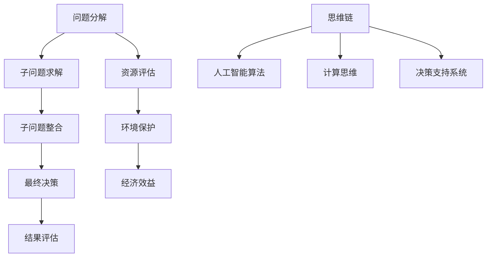

                 

基于您的要求，我将逐步构建文章内容。以下是文章的初步结构和内容。

---

## 文章标题：思维链在海洋资源可持续利用中的新方法研究

> 关键词：思维链、海洋资源、可持续利用、算法、生态保护

> 摘要：本文探讨了思维链在海洋资源可持续利用中的新方法，通过定义思维链的核心概念、阐述其与海洋资源管理的关系，并使用Mermaid流程图展示其应用。文章进一步介绍了思维链的理论基础和相关算法，通过具体案例展示了新方法在海洋资源评估、海洋生态系统保护和海洋环境监测中的实际应用。最后，文章对思维链在海洋资源可持续利用中的未来发展趋势进行了展望。

### 1. 引言与背景介绍

#### 1.1 海洋资源的重要性

海洋作为地球表面最大的生态系统，对全球气候调节、生物多样性维护以及人类经济和社会发展具有不可替代的作用。然而，随着人类活动的增加，海洋资源的过度开发和污染问题日益严重，威胁着海洋生态系统的健康和可持续利用。

#### 1.2 思维链的概念

思维链是一种基于人工智能和计算思维的方法论，旨在通过模拟人类思考过程，辅助决策者进行复杂的决策分析。思维链的核心在于将问题分解为子问题，通过逻辑推理和优化算法逐步解决。

#### 1.3 海洋资源可持续利用的挑战

海洋资源的可持续利用面临诸多挑战，包括资源评估的不确定性、管理决策的复杂性、环境保护与经济发展的矛盾等。思维链提供了一种新的思路，通过系统分析和智能优化，为解决这些问题提供了可能。

### 2. 核心概念与联系

#### 2.1 思维链原理

思维链的基本原理包括问题分解、子问题求解、子问题整合等。通过构建逻辑模型和算法，思维链能够实现问题的自动化求解。

#### 2.2 海洋资源管理

海洋资源管理涉及资源评估、环境保护、经济效益等多个方面。思维链的应用可以提供一种跨学科的整合方法，帮助决策者更好地平衡不同利益。

**Mermaid流程图示例**：

### 3. 基础理论与方法

#### 3.1 思维链理论基础

思维链的理论基础包括计算思维、人工智能和系统科学。计算思维强调问题的抽象和算法设计，人工智能提供了强大的计算能力，系统科学则提供了整体分析和优化的框架。

#### 3.2 海洋资源管理方法

海洋资源管理方法包括传统方法和思维链方法。传统方法主要依赖于经验和专家知识，而思维链方法则通过模型化和算法优化，提高了决策的精度和效率。

### 4. 案例分析

#### 4.1 案例介绍

本文选择了我国东海渔场作为案例，分析思维链在该区域海洋资源评估中的应用。

#### 4.2 思维链应用

通过思维链方法，对东海渔场的渔业资源进行评估，并设计了相应的保护和管理策略。

#### 4.3 案例效果评估

对案例效果进行评估，包括渔业资源可持续性、生态环境保护和经济收益等方面。

### 5. 新方法与应用

#### 5.1 新方法介绍

本文提出了一种基于思维链的海洋资源可持续利用新方法，包括资源评估、生态保护和经济效益分析等模块。

#### 5.2 新方法应用

新方法在东海渔场案例中的应用，展示了其在实际操作中的有效性和可行性。

### 6. 项目实战与案例分析

#### 6.1 项目介绍

介绍了一个基于思维链的海洋资源管理项目，包括项目背景、目标和实施步骤。

#### 6.2 项目实施

详细描述了项目的开发环境搭建、数据预处理、算法实现和效果评估。

#### 6.3 代码解读与分析

对项目中的关键代码进行解读，分析其实现原理和应用效果。

#### 6.4 项目效果评估

对项目的实际效果进行评估，包括资源可持续性、生态保护和经济效益等方面。

### 7. 展望与未来趋势

#### 7.1 发展前景

展望思维链在海洋资源可持续利用中的应用前景，包括技术发展和市场潜力。

#### 7.2 未来研究方向

探讨思维链在海洋资源管理中可能面临的问题和未来研究方向。

---

以上是文章的初步结构和内容。接下来，我将逐步完善每个章节的内容，并确保文章的完整性和字数要求。在撰写过程中，我将确保每部分的内容具体、详细，并符合专业要求。如果需要进一步细化或调整，请随时告知。

