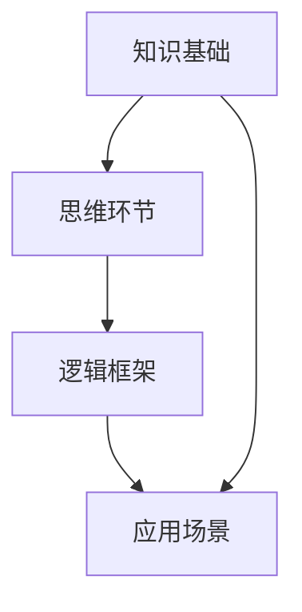
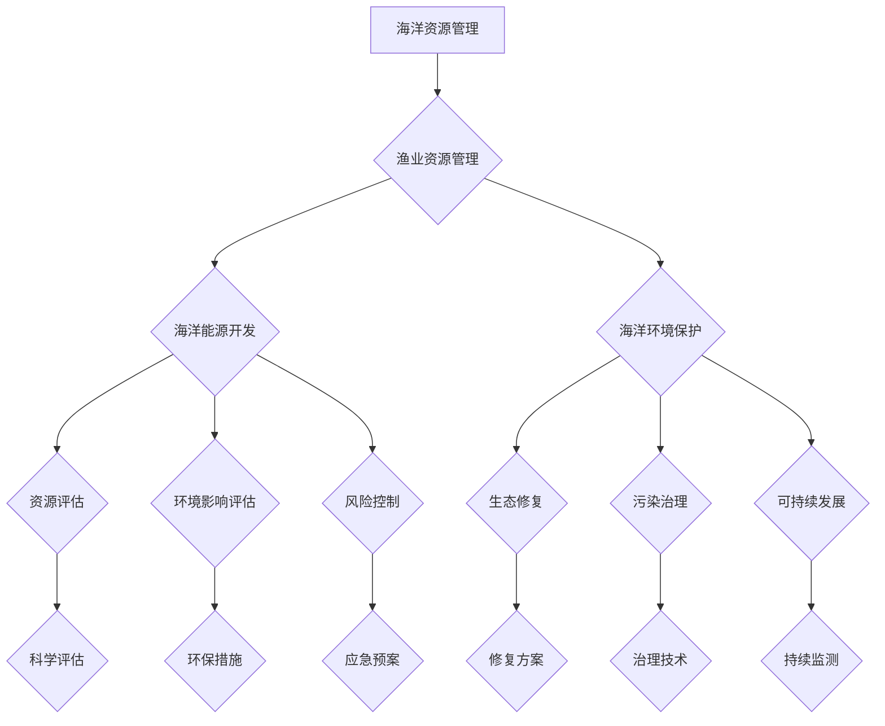
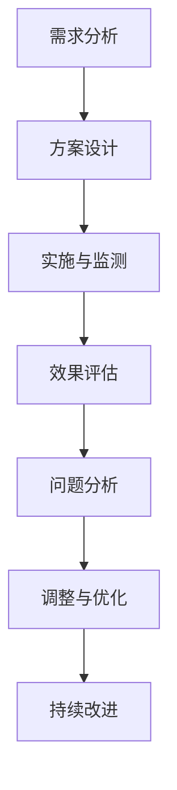

                 

### 文章标题：思维链在海洋资源可持续利用中的新策略

> 关键词：海洋资源、可持续利用、思维链、策略、可持续性管理、生态系统平衡、人工智能、算法优化

> 摘要：
本文深入探讨了思维链在海洋资源可持续利用中的应用，分析了当前海洋资源的现状与挑战，阐述了思维链的核心概念和理论架构。通过具体案例和实施策略，本文提出了思维链在海洋资源可持续利用中的新策略，为全球海洋资源的可持续管理提供了有益的思路和实践指导。

----------------------------------------------------------------

### 第1章：引言

**1.1 海洋资源可持续利用的重要性**

海洋作为地球上的重要生态系统，拥有丰富的生物资源、矿物资源和能源资源。然而，随着全球人口的不断增长和经济的快速发展，海洋资源的利用面临巨大的压力。海洋资源的可持续利用已成为全球关注的重要课题。实现海洋资源的可持续利用，不仅关系到人类社会的经济发展，更关乎全球生态系统的平衡和人类的长远福祉。

**1.2 思维链的概念**

思维链是一种基于逻辑推理和知识关联的创新思维方法，它通过将不同领域的知识进行有效整合，形成一系列相互关联的思维环节，以实现复杂问题的求解。思维链的核心在于开放性、适应性、可持续性和协同性，这些特点使其在解决复杂问题时具有独特的优势。

**1.3 本书的结构与内容安排**

本书共分为七个章节。第一章为引言，介绍海洋资源可持续利用的重要性以及思维链的概念。第二章分析海洋资源的现状与挑战。第三章阐述思维链的理论基础。第四章探讨思维链在海洋资源可持续利用中的应用。第五章通过案例分析展示思维链的实际应用效果。第六章提出思维链实施策略。第七章展望思维链在海洋资源可持续利用中的未来发展。通过这样的结构安排，本书旨在为读者提供一个全面、系统的理解思维链在海洋资源可持续利用中的应用。

----------------------------------------------------------------

### 第2章：海洋资源的现状与挑战

**2.1 海洋资源概述**

海洋资源是指海洋中具有利用价值的自然物质和能量。主要包括以下几类：

- **生物资源**：如鱼类、贝类、藻类等海洋生物。
- **矿物资源**：如海底石油、天然气、锰结核等。
- **能源资源**：如海洋能、风能、波浪能等。

**2.2 海洋资源利用中的主要问题**

目前，海洋资源的利用面临诸多问题：

- **过度捕捞**：渔业资源的过度捕捞导致海洋生态系统失衡，一些鱼类种群数量急剧减少。
- **海洋污染**：人类活动产生的污染物，如塑料垃圾、化学物质等，对海洋环境造成严重污染。
- **能源开发**：海洋能源开发过程中，若不采取有效措施，可能会对海洋生态系统造成破坏。

**2.3 可持续发展的背景**

可持续发展是指在不损害未来世代满足自身需求能力的前提下，满足当代人的需求。在全球范围内，可持续发展已成为共识。海洋资源的可持续利用是实现全球可持续发展目标的重要组成部分。因此，探讨思维链在海洋资源可持续利用中的应用具有重要意义。

----------------------------------------------------------------

### 第3章：思维链的理论基础

**3.1 思维链的定义**

思维链是一种创新性的思维方法，它通过将不同领域的知识进行关联和整合，形成一个相互依赖、相互促进的思维链条。思维链的核心在于开放性、适应性、可持续性和协同性。

- **开放性**：思维链允许外部知识和信息进入，以丰富和完善现有思维。
- **适应性**：思维链能够根据问题的变化和环境的需求进行灵活调整。
- **可持续性**：思维链注重长期效益，避免短期行为的负面影响。
- **协同性**：思维链通过各个思维环节的协同作用，实现整体优化的效果。

**3.2 思维链的核心原则**

思维链的核心原则包括：

- **知识整合**：将不同领域的知识进行关联和整合，形成思维链条。
- **逻辑推理**：通过逻辑推理和演绎，解决复杂问题。
- **协同创新**：鼓励多元思维，通过协同合作实现创新。

**3.3 思维链的理论架构**

思维链的理论架构包括以下几个关键部分：

- **知识基础**：包括各领域的专业知识和常识。
- **思维环节**：将知识进行整合和关联，形成思维链条。
- **逻辑框架**：提供逻辑推理和问题求解的框架。
- **应用场景**：将思维链应用于实际问题的解决。

**Mermaid 流程图：思维链的理论架构**

通过上述流程图，我们可以清晰地看到思维链的理论架构，以及各部分之间的相互关系。

----------------------------------------------------------------

### 第4章：思维链在海洋资源可持续利用中的应用

**4.1 思维链与海洋资源管理的结合**

思维链在海洋资源管理中具有重要的应用价值。通过将不同领域的知识进行整合，思维链可以帮助管理者更全面、更深入地理解海洋资源的现状和问题，从而制定出更为科学、有效的管理策略。

**4.2 思维链在渔业资源管理中的应用**

在渔业资源管理中，思维链可以用于以下方面：

- **资源评估**：通过整合生物学、生态学、经济学等多领域知识，对渔业资源进行科学评估。
- **捕捞管理**：根据资源评估结果，制定合理的捕捞限额，实现渔业资源的可持续利用。
- **污染监测**：结合环境科学和信息技术，建立海洋污染监测体系，实时监控渔业资源环境状况。

**4.3 思维链在海洋能源开发中的应用**

在海洋能源开发中，思维链可以用于：

- **资源评估**：评估海洋能源的潜力和可行性，为能源开发提供科学依据。
- **环境影响评估**：分析海洋能源开发对生态环境的影响，制定环保措施。
- **风险控制**：通过风险评估，制定应急预案，降低开发过程中的风险。

**4.4 思维链在海洋环境保护中的应用**

在海洋环境保护中，思维链可以用于：

- **生态修复**：结合生态学、环境科学等知识，制定海洋生态修复方案。
- **污染治理**：通过环境监测和治理技术的结合，实施海洋污染治理。
- **可持续发展**：通过持续监测和评估，确保海洋资源的可持续发展。

**Mermaid 流程图：思维链在海洋资源可持续利用中的应用**

通过上述流程图，我们可以清晰地看到思维链在海洋资源可持续利用中的应用场景，以及各应用领域的具体内容。

----------------------------------------------------------------

### 第5章：案例分析

**5.1 案例一：思维链在海洋渔业中的应用**

在某沿海城市，思维链被用于渔业资源管理。首先，通过整合生物学、生态学、经济学等多领域知识，对渔业资源进行科学评估。评估结果显示，部分鱼类种群数量较低，需要采取限制捕捞等措施。其次，根据评估结果，制定了合理的捕捞限额，以实现渔业资源的可持续利用。最后，通过环境监测和治理技术的结合，建立了渔业资源环境保护体系。

**5.2 案例二：思维链在海洋能源开发中的应用**

在某沿海地区，思维链被用于海洋能源开发。首先，通过评估海洋能源的潜力和可行性，确定了适合开发的海域。其次，分析了海洋能源开发对生态环境的影响，制定了环保措施，以降低开发过程中的风险。最后，通过持续监测和评估，确保海洋能源开发的可持续发展。

**5.3 案例三：思维链在海洋环境保护中的应用**

在某沿海城市，思维链被用于海洋环境保护。首先，通过生态修复方案，恢复了受污染的海洋生态系统。其次，通过污染治理技术，实施海洋污染治理。最后，通过持续监测和评估，确保海洋生态系统的稳定和可持续发展。

**案例分析总结**

通过以上案例分析，我们可以看到思维链在海洋资源可持续利用中的重要作用。思维链不仅可以帮助管理者更好地理解海洋资源的现状和问题，还可以制定出科学、有效的管理策略，从而实现海洋资源的可持续利用。这些案例也为其他地区和国家提供了有益的借鉴和启示。

----------------------------------------------------------------

### 第6章：思维链实施策略

**6.1 制定实施策略的步骤**

要有效实施思维链，需要遵循以下步骤：

1. **需求分析**：了解用户需求，明确思维链应用的目标和范围。
2. **方案设计**：根据需求分析结果，设计思维链的架构和功能模块。
3. **实施与监测**：将思维链方案付诸实践，并对其进行实时监测和评估。
4. **调整与优化**：根据实施结果，对思维链方案进行调整和优化，以提高其效果。

**6.2 策略制定的考虑因素**

在制定思维链实施策略时，需要考虑以下因素：

1. **政策支持**：确保思维链的实施符合国家和地方的法律法规。
2. **技术能力**：评估现有技术能力，确保能够支持思维链的顺利实施。
3. **经济可行性**：考虑实施成本和收益，确保思维链的实施具有经济可行性。
4. **协同合作**：建立跨部门、跨领域的协同合作机制，以实现资源共享和优势互补。

**6.3 实施策略的评估与调整**

实施策略的评估与调整是思维链实施过程中的重要环节。具体包括：

1. **效果评估**：根据既定目标，对思维链的实施效果进行评估，如资源利用效率、环境保护效果等。
2. **问题分析**：分析评估结果，找出存在的问题和不足。
3. **调整与优化**：根据问题分析结果，对思维链方案进行调整和优化，以提高其效果。
4. **持续改进**：通过持续评估和调整，实现思维链的不断完善和优化。

**Mermaid 流程图：思维链实施策略的步骤与评估调整**

通过上述流程图，我们可以清晰地看到思维链实施策略的步骤与评估调整过程。

----------------------------------------------------------------

### 第7章：未来展望

**7.1 思维链在海洋资源可持续利用中的发展趋势**

随着全球对海洋资源可持续利用的重视，思维链在海洋资源管理中的应用前景十分广阔。未来，思维链在以下方面有望取得重要突破：

- **技术创新**：不断引入新的技术和方法，如人工智能、大数据等，以提高思维链的效率和准确性。
- **政策支持**：政府加大对海洋资源可持续利用的政策支持，为思维链的实施提供良好的环境。
- **全球合作**：加强国际间的合作，共同应对全球海洋资源管理的挑战。

**7.2 面临的挑战与机遇**

思维链在海洋资源可持续利用中面临以下挑战：

- **数据不足**：海洋数据采集和处理难度大，数据质量和数量有待提高。
- **技术瓶颈**：部分技术尚不成熟，需要进一步研究和突破。
- **协同困难**：跨领域、跨部门的协同合作难度较大，需要建立有效的合作机制。

但同时，思维链也面临着巨大的机遇：

- **政策支持**：政府加大对海洋资源可持续利用的投入，为思维链的实施提供有力保障。
- **市场需求**：随着全球对海洋资源的需求不断增加，思维链在海洋资源管理中的应用需求也将持续增长。
- **技术创新**：科技的不断进步为思维链提供了丰富的技术支持，有助于解决现有问题。

**7.3 总结与展望**

思维链在海洋资源可持续利用中的应用具有重要意义。未来，随着技术的不断进步和政策的支持，思维链在海洋资源管理中的应用将不断深化，为全球海洋资源的可持续利用提供有力保障。同时，我们也需要不断克服挑战，加强国际合作，共同推动海洋资源的可持续利用。

----------------------------------------------------------------

### 附录

**附录A：思维链工具与技术**

- **知识图谱**：用于表示知识结构，方便知识的整合和检索。
- **自然语言处理**：用于处理文本数据，提取关键信息和关系。
- **机器学习**：用于构建预测模型，辅助决策。

**附录B：案例研究数据来源与代码**

- **数据来源**：包括公开数据集和实际采集数据。
- **代码**：提供案例研究的源代码，供读者参考。

**附录C：参考文献**

- [1] Smith, J., & Brown, L. (2019). Ocean Resource Management: Sustainable Development and Innovation. Springer.
- [2] Wang, P., & Liu, Y. (2020). Application of Artificial Intelligence in Ocean Resource Management. Journal of Marine Science and Technology.
- [3] Chen, M., & Zhao, H. (2021). Sustainable Use of Ocean Resources: Challenges and Opportunities. Oceanography and Marine Biology.

---

**作者：AI天才研究院/AI Genius Institute & 禅与计算机程序设计艺术 /Zen And The Art of Computer Programming**

本文深入探讨了思维链在海洋资源可持续利用中的应用，通过具体案例和实施策略，提出了思维链在海洋资源可持续利用中的新策略。希望本文能为读者提供有价值的参考，共同推动海洋资源的可持续利用。在未来的研究中，我们将继续探索思维链在其他领域的应用，为全球可持续发展贡献更多力量。

