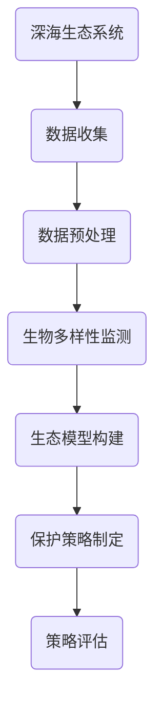
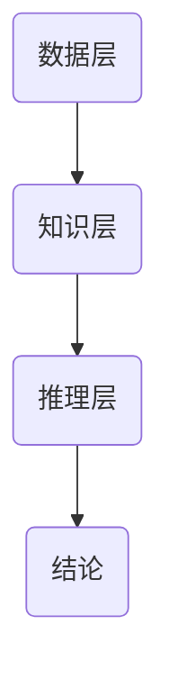

                 

### 1.1 思维链在深海生态研究中的应用

思维链（Mind Chain）是一种先进的人工智能技术，它通过模拟人类思维的逻辑过程，实现复杂问题的求解和推理。在深海生态系统中，思维链的应用可以极大地提升我们对海洋生物多样性保护和生态系统研究的效率和准确性。

#### 思维链的概念与特点

思维链是一种基于图论的推理框架，它将问题表示为一个知识图谱，并通过图中的节点和边来表示事实和推理关系。思维链的特点包括：

1. **层次结构**：思维链具有明确的层次结构，能够将问题分解为多个子问题，并逐步求解。
2. **推理能力**：思维链能够根据已有的知识和信息进行推理，发现新的关系和模式。
3. **适应性**：思维链可以根据问题的不同，灵活调整其结构和算法。

#### 思维链与深海生态系统研究

在深海生态系统中，思维链的应用主要体现在以下几个方面：

1. **生物多样性监测**：通过思维链，我们可以建立深海生物多样性的监测模型，实时收集和分析海洋生物数据，监测生物种群的分布和变化。
2. **生态模型构建**：思维链可以帮助我们构建深海生态系统的模型，模拟不同环境因素对生态系统的影响，预测未来生态系统的变化趋势。
3. **保护策略制定**：思维链可以辅助我们制定海洋生物多样性保护策略，通过分析各种保护措施的效果，找到最优的保护方案。

#### 思维链在深海生态研究中的应用架构

为了更好地理解思维链在深海生态研究中的应用，我们可以通过一个Mermaid流程图来展示其架构：



在这个流程图中，数据收集、预处理、生物多样性监测、生态模型构建和策略制定构成了一个闭环系统，通过思维链的推理和优化，不断提高深海生态系统研究的效率和准确性。

#### 结论

思维链在深海生态系统研究中的应用具有巨大的潜力，它可以帮助我们更好地理解海洋生物多样性，制定有效的保护策略，为全球生态系统的可持续发展做出贡献。在接下来的章节中，我们将详细探讨思维链的基本原理和在深海生态系统研究中的具体应用。 |user|### 1.2 深海生态系统概述

#### 1.2.1 深海生态系统的定义与特点

深海生态系统（Deep Sea Ecosystem）是指位于海洋深处的生物群落和非生物环境的总体。这些区域通常指的是水深超过200米的海域，但有些定义甚至会扩展到更深的海域，例如水深超过1000米的区域。

**定义：**
- 深海生态系统主要包括海底平原、海山、海沟、洋中脊等地质结构。
- 深海生物种类繁多，包括深海鱼类、无脊椎动物、微生物等。

**特点：**
1. **光照条件差**：深海区域的光照非常有限，大多数生物依赖化学合成能量。
2. **温度和压力高**：深海温度通常较低，压力较大，对生物的生存构成挑战。
3. **生物多样性**：尽管环境恶劣，深海生态系统中仍然存在丰富的生物多样性，形成了独特的生物群落。
4. **生态系统脆弱**：深海生态系统对人类活动的干扰非常敏感，一旦破坏，恢复能力极弱。

#### 1.2.2 深海生态研究的重要性

**海洋生物多样性的重要性：**
- 海洋生物多样性是地球生命系统的重要组成部分，它不仅支持着海洋生态系统的稳定，还为人类提供了丰富的生物资源和生态服务。
- 深海生物多样性在生态系统中扮演着关键角色，如维持海洋营养循环、促进生物地球化学过程等。

**深海生态系统对全球生态的影响：**
- 深海生态系统对全球气候调节具有重要影响。例如，深海微生物通过碳循环过程帮助调节大气中的二氧化碳浓度。
- 深海生态系统的健康直接关系到全球海洋生态系统的稳定性。深海的生物多样性对海洋生态系统的平衡起着基础性作用。

**挑战与需求：**
- 随着人类活动的扩展，深海生态系统面临着严重的威胁，如过度捕捞、海洋污染、气候变化等。
- 因此，深入研究深海生态系统，保护海洋生物多样性，对于维护全球生态平衡和可持续发展具有重要意义。

### 总结

深海生态系统是一个复杂且独特的生态系统，尽管其环境条件恶劣，但其中生物多样性丰富，对全球生态平衡和气候调节起着关键作用。因此，研究深海生态系统、保护海洋生物多样性是当前和未来重要的科学任务和挑战。 |user|### 1.3 深海生态研究的方法和技术

#### 1.3.1 深海探索技术

深海探索技术是研究深海生态系统的基础，主要包括以下几个方面：

1. **声学探测技术**：利用声波在不同介质中的传播特性，进行海底地形、地质结构、海底矿物资源的探测。常用的设备包括多波束测深系统、侧扫声呐等。

2. **海洋地质学方法**：通过地质采样、地质测井等手段，研究海底地质构造、沉积物类型、矿物分布等。

3. **海底摄影和摄像技术**：使用遥控潜水器（ROV）或载人潜水器（Submersible）对深海生物和海底景观进行摄影和摄像，获取直观的图像和数据。

4. **深海潜水技术**：潜水员或潜水器在深海环境下的操作技术，包括潜水作业、潜水安全等。

#### 1.3.2 生物多样性监测方法

生物多样性监测是评估和了解深海生态状态的重要手段，主要方法包括：

1. **生态传感器**：利用生物传感器、环境传感器等，实时监测海水中的生物指标和环境参数。

2. **自动监测浮标**：通过自动监测浮标，收集深海生物、水文、化学等多方面的数据。

3. **水下相机和声学监测**：使用水下相机和声学监测设备，对深海生物的分布、行为等进行观察和记录。

4. **拖网采样**：通过拖网设备，从深海中捕获生物样本，进行物种鉴定和生态特征分析。

#### 1.3.3 数据处理与分析技术

深海生态研究产生的大量数据需要通过先进的数据处理和分析技术进行管理和解读：

1. **大数据技术**：利用大数据技术，对海量深海数据进行分析和处理，提取有价值的信息。

2. **机器学习和人工智能**：通过机器学习算法，对深海生物数据进行模式识别、分类、预测等分析，提高研究效率和准确性。

3. **地理信息系统（GIS）**：利用GIS技术，对深海生态数据进行空间分析和可视化，便于研究人员理解和展示研究结果。

#### 1.3.4 深海生态建模与模拟

深海生态建模与模拟是研究深海生态系统动态和预测未来变化的重要方法：

1. **生态系统模型**：建立深海生态系统的动态模型，模拟不同环境因素对生态系统的影响。

2. **生物地球化学模型**：结合生物、化学、地质等多学科知识，建立深海生物地球化学模型，研究碳循环、氮循环等过程。

3. **耦合模型**：将深海生态模型与其他模型（如气候模型、海洋动力模型等）耦合，进行综合性研究。

#### 1.3.5 国际合作与多学科整合

深海生态研究是一项全球性的科学任务，需要国际合作和多学科整合：

1. **国际合作项目**：如国际海洋探索计划（IOE）、深海生物多样性计划（Deep Sea Diversity）等，通过国际合作，共享数据和技术。

2. **多学科整合**：将海洋生物学、海洋地质学、海洋物理学、环境科学等学科整合，形成综合性的研究方法。

### 总结

深海生态研究需要多种方法和技术手段的综合应用，从深海探索、生物多样性监测到数据处理和分析，再到生态建模与模拟，每一环节都至关重要。通过这些技术，科学家们可以更深入地了解深海生态系统的复杂性和多样性，为海洋生物多样性的保护提供科学依据。 |user|### 1.4 AI在深海生态研究中的应用

随着人工智能（AI）技术的快速发展，AI在深海生态研究中的应用越来越受到重视。AI能够处理和分析大规模、复杂数据，为深海生态系统的监测、预测和保护提供有力支持。以下是AI在深海生态研究中的几个主要应用方向：

#### 1.4.1 数据分析

**1.4.1.1 数据收集与预处理**

在深海生态研究中，数据收集是一个关键步骤。AI可以帮助自动化数据收集过程，如使用无人机或自动监测浮标收集环境参数和生物数据。数据预处理是数据收集后的重要环节，AI技术能够高效地处理大量数据，包括去噪、缺失值填充、数据归一化等。

**1.4.1.2 数据挖掘与模式识别**

AI技术，尤其是机器学习和深度学习，可以挖掘深海数据中的潜在模式，帮助识别生物种群的分布、行为特征和环境因素之间的关系。例如，通过卷积神经网络（CNN）和循环神经网络（RNN）对海洋生物图像进行分类和分析，识别不同物种。

**1.4.1.3 数据可视化**

AI可以帮助将复杂的深海数据转化为直观的视觉形式，如热图、图表和三维模型，便于研究人员理解和分析。

#### 1.4.2 生物多样性监测

**1.4.2.1 实时监测**

AI技术可以实现深海生物多样性的实时监测。通过传感器网络和自动监测设备，AI系统能够实时收集和分析海洋生物数据，如水温、盐度、生物活动等。实时监测可以帮助研究人员快速响应环境变化，及时采取保护措施。

**1.4.2.2 预测分析**

AI算法可以基于历史数据，预测未来生物种群的变化趋势。这种预测分析对于制定长期保护策略和应对环境挑战具有重要意义。

#### 1.4.3 生态模型构建

**1.4.3.1 动态模拟**

AI技术可以构建动态的深海生态模型，模拟不同环境因素对生态系统的影响。这些模型能够提供关于生态系统变化趋势的预测，帮助研究人员更好地理解深海生态系统的运作机制。

**1.4.3.2 耦合模型**

AI技术可以将深海生态模型与气候模型、海洋动力学模型等耦合，进行综合性研究。这种耦合模型可以更准确地模拟全球气候变化对深海生态系统的影响，为全球环境保护提供科学依据。

#### 1.4.4 保护策略制定

**1.4.4.1 保护方案优化**

AI技术可以帮助优化海洋生物多样性保护方案。通过分析不同保护措施的效果，AI可以推荐最优的保护策略，提高保护效率。

**1.4.4.2 挑战应对**

AI技术可以辅助研究人员识别和应对深海生态研究中的挑战。例如，通过分析海洋污染数据，AI可以帮助制定更有效的污染治理策略。

#### 1.4.5 案例研究

**1.4.5.1 案例一：深海生物多样性监测**

研究人员使用AI技术对某深海区域的生物多样性进行监测。通过收集的海洋生物数据，AI系统对物种分布、生物活动进行了分析和预测。结果显示，AI技术能够准确识别不同生物种群，为保护策略的制定提供了科学依据。

**1.4.5.2 案例二：海洋污染治理**

某海洋保护区面临着严重的污染问题。研究人员利用AI技术对污染源进行了识别和定位，并基于污染数据构建了污染治理模型。通过模型的预测和分析，研究人员制定了一套有效的污染治理方案，成功减少了污染对海洋生态系统的影响。

### 总结

AI技术在深海生态研究中的应用极大地提升了研究效率和准确性。通过数据分析、生物多样性监测、生态模型构建和策略制定，AI为深海生态系统的保护和管理提供了有力支持。未来的研究将需要进一步探索AI技术在深海生态研究中的潜力，以应对全球环境变化的挑战。 |user|### 1.5 深海生态研究中的挑战与解决方案

#### 1.5.1 数据获取困难

深海生态研究的一个主要挑战是数据的获取。深海环境的恶劣条件使得传统的数据采集手段面临极大的困难。例如，深海中的低温、高压和高盐度环境对传感器和设备的要求极高，导致设备成本高昂且耐用性差。为了解决这一问题，研究人员正在探索新的技术手段，如自主式潜水器（AUV）、遥控潜水器（ROV）以及微小型无人机（UAV）。这些设备不仅能够适应深海环境，还能够远程操作，从而降低成本和风险。此外，多传感器融合技术也正在发展中，通过集成多种传感器（如声学传感器、光学传感器、化学传感器等），能够更全面地收集数据。

#### 1.5.2 数据处理复杂性

深海生态数据往往具有高维度、高噪声和多样性等特点，这使得数据处理成为一个复杂的任务。传统的数据分析方法在面对如此大规模和复杂的数据时，往往显得力不从心。为了解决这一问题，人工智能和机器学习技术被广泛应用于数据处理。通过深度学习、聚类分析、分类算法等，研究人员能够从海量数据中提取有价值的信息。同时，分布式计算和云计算技术的应用，使得数据处理能力得到了极大的提升，能够更快地处理和分析大规模数据集。

#### 1.5.3 生态模型构建的挑战

构建准确的深海生态模型是深海生态研究的关键。然而，由于深海环境的复杂性和变化性，构建准确可靠的生态模型面临诸多挑战。首先，深海生态系统的数据获取有限，特别是关于深海底层生态系统的数据更为稀缺，这限制了模型的准确性。其次，深海生态系统的动态性较强，模型需要能够适应环境的变化。为了解决这些问题，研究人员正在开发新的生态建模方法，如基于机器学习的模型、多代理系统（MAS）等。这些方法不仅能够利用现有的数据，还能够通过模拟和预测，提供更加精确的生态模型。

#### 1.5.4 国际合作与资源共享

深海生态研究是一项全球性的科学任务，需要国际合作和资源共享。然而，由于各国在研究资源和技术能力上的差异，国际合作面临挑战。为了促进国际合作，多个国际组织（如国际海洋探索计划、国际海洋数据管理组织等）正在努力推动全球深海数据的共享和标准化。同时，通过建立深海数据平台和数据库，研究人员能够更方便地访问和共享数据，促进全球深海生态研究的发展。

#### 1.5.5 法规和政策支持

深海生态研究的健康发展需要相应的法规和政策支持。目前，各国在深海生态研究方面的法律法规尚不完善，尤其是在数据共享、环境保护和资源利用等方面存在一定的问题。为了促进深海生态研究，各国政府需要加强立法和监管，制定更加明确的法规和政策。同时，国际合作也是推动法规和政策发展的重要途径，通过共同制定国际标准和协议，可以有效促进全球深海生态研究的发展。

### 总结

深海生态研究面临着数据获取、数据处理、生态模型构建、国际合作和法规政策等多方面的挑战。通过不断探索新技术、应用人工智能和机器学习、加强国际合作以及完善法规政策，这些挑战有望得到有效应对。未来的深海生态研究将在更广泛、更深入的科学合作和科技创新中取得更大进展。 |user|### 1.6 深海生态研究的发展趋势与未来展望

#### 1.6.1 新技术的应用

随着科技的进步，深海生态研究将越来越多地依赖于新技术的应用。例如，量子计算、区块链技术、基因编辑技术等有望在深海生态研究中发挥重要作用。量子计算的高并行性和强大计算能力，将为深海生态模型构建提供新的计算工具。区块链技术可以确保深海数据的安全性和透明性，促进国际间的数据共享和合作。基因编辑技术则可以帮助研究人员更好地理解深海生物的基因结构和生态系统功能。

#### 1.6.2 国际合作与多学科整合

深海生态研究具有全球性和综合性特征，未来的发展将更加依赖于国际合作和多学科整合。通过建立全球性的深海研究网络，各国科学家可以共享数据、技术和研究成果，共同应对深海生态面临的挑战。多学科整合将促进不同领域间的知识交流和技术创新，如将海洋生物学、海洋物理学、地质学、环境科学等学科结合起来，构建更加全面和深入的深海生态模型。

#### 1.6.3 可持续发展的实践

可持续发展是未来深海生态研究的重要方向。研究人员将更加注重生态保护与人类活动的平衡，探索可持续的深海资源利用方式。例如，通过开发海洋可再生能源，减少对化石燃料的依赖；推广海洋生态农业，实现生态系统的可持续生产。此外，制定和实施更加严格的环境保护法规，加强对海洋生态系统的监管和保护，也是实现可持续发展的重要措施。

#### 1.6.4 AI技术的深化应用

人工智能技术将在未来深海生态研究中得到更广泛和深入的应用。通过AI技术的不断发展和优化，研究人员将能够更精确地监测和分析深海生态系统，预测生态变化趋势，制定更有效的保护策略。例如，利用深度学习和机器学习算法，可以对大量海洋生物数据进行实时分析和分类，识别潜在的环境问题；通过AI驱动的决策支持系统，可以提供个性化的生态保护建议。

#### 1.6.5 社会意识的提升

社会意识的提升是未来深海生态研究的重要保障。通过公众教育和宣传，提高人们对深海生态系统的认识和重视，可以形成广泛的社会支持和参与。例如，通过举办科学展览、开展公众讲座、发布科普读物等方式，让更多的人了解深海生态的重要性和面临的挑战。此外，鼓励公众参与海洋环保行动，如海滩清洁、海洋保护志愿者活动等，也是提升社会意识的重要途径。

### 总结

未来，深海生态研究将在新技术应用、国际合作、可持续发展、AI技术深化应用和社会意识提升等多方面取得重要进展。通过这些努力，我们将能够更好地理解、保护和利用深海生态系统，为全球生态平衡和可持续发展做出贡献。 |user|### 1.7 深海生态研究的重要性：可持续发展的关键

深海生态研究在实现全球可持续发展中扮演着至关重要的角色。随着人类活动的不断扩展，海洋生态系统面临着前所未有的挑战，包括气候变化、过度捕捞、海洋污染和栖息地破坏等。深海生态系统作为海洋生态系统的核心组成部分，其健康和稳定对全球生态平衡和人类福祉有着深远的影响。

#### 海洋生物多样性的保护

海洋生物多样性是维持海洋生态系统功能的重要基础。深海生态系统中存在着丰富的生物种类和独特的生态系统，如深海珊瑚礁、热液喷口和冷泉生态系统等。这些生态系统不仅为大量生物提供了栖息地和食物来源，还在全球碳循环、氧气生产和海洋营养循环中起着关键作用。通过深入研究深海生物多样性，我们可以更好地了解生态系统的脆弱性，从而制定出更有效的保护策略。

#### 气候变化的调节

海洋在调节全球气候方面发挥着重要作用，而深海生态系统对此至关重要。深海微生物通过生物地球化学过程，如碳循环和氮循环，帮助调节大气中的二氧化碳和氧气浓度。此外，深海海山的形成和海底地形的变化会影响海洋环流模式，进而影响全球气候。因此，研究深海生态系统对于预测和应对气候变化具有重要意义。

#### 可持续资源利用

海洋是地球上最重要的资源宝库之一，深海中蕴藏着丰富的矿产、能源和生物资源。然而，不合理的开发和利用可能会对海洋生态系统造成严重破坏。通过深海生态研究，我们可以更好地了解这些资源的分布、生态影响和可持续利用方式，从而实现资源利用的可持续发展。

#### 全球生态系统的平衡

深海生态系统与全球生态系统紧密相连，其健康直接关系到全球生态系统的平衡。例如，海洋生物通过食物链和食物网与其他生物相互作用，维持着整个生态系统的稳定。任何对深海生态系统的破坏都可能引发连锁反应，影响整个生态系统的功能。因此，保护深海生态系统对于维护全球生态平衡至关重要。

### 结论

深海生态研究不仅是保护海洋生物多样性的重要手段，也是实现全球可持续发展的关键。通过深入研究和理解深海生态系统，我们可以更好地应对全球性挑战，为人类和地球的可持续发展做出贡献。未来的深海生态研究需要更多的跨学科合作、技术创新和国际合作，以推动这一领域的持续进步。 |user|### 1.8 总结与展望

深海生态研究在保护海洋生物多样性、调节全球气候、可持续资源利用和维护全球生态系统平衡方面具有不可替代的重要作用。随着科技的进步和国际合作的加强，深海生态研究正朝着更加精确、全面和高效的方向发展。未来，人工智能（AI）技术的深化应用将为深海生态研究带来新的突破，推动数据的收集、处理和分析进入一个新的阶段。

在本篇技术博客中，我们系统地介绍了深海生态系统的定义、特点以及研究方法，探讨了AI在深海生态研究中的应用，分析了深海生态研究面临的挑战，并展望了未来的发展趋势。通过这些讨论，我们可以看到，深海生态研究不仅是一项科学任务，更是全球可持续发展的重要组成部分。

**未来的研究方向：**

1. **人工智能技术的深化应用**：进一步探索AI在深海生态研究中的潜力，特别是在生物多样性监测、生态模型构建和保护策略制定方面的应用。
2. **跨学科整合**：加强海洋生物学、海洋物理学、地质学、环境科学等学科的整合，构建更加全面和深入的深海生态模型。
3. **国际合作与资源共享**：通过国际合作，共享数据和技术，推动全球深海生态研究的发展。
4. **可持续发展的实践**：探索可持续的资源利用和保护策略，确保海洋生态系统的健康和稳定。

**结论：**

深海生态研究是实现全球可持续发展的重要环节。通过持续的研究和科技创新，我们可以更好地理解、保护和利用深海生态系统，为人类和地球的可持续发展做出贡献。未来的深海生态研究将需要更多的跨学科合作、技术创新和国际合作，以推动这一领域的持续进步。 |user|### 第2章 思维链基本原理

#### 2.1 思维链的概念

思维链（Mind Chain）是一种基于图论和人工智能的推理框架，旨在模拟人类思维的逻辑过程，实现复杂问题的求解和推理。思维链通过将问题表示为一个知识图谱，利用节点和边来表示事实和推理关系，从而实现对问题的逻辑分析和推理。

**定义：**
思维链是一种通过图结构组织信息，利用推理规则进行推理的框架。它包括三个基本要素：节点、边和推理规则。

**核心特点：**
1. **图结构组织**：思维链通过图结构来表示知识和信息，使得复杂的关系和逻辑能够直观地展示出来。
2. **推理能力**：思维链能够根据已有的知识和推理规则，推导出新的结论和发现。
3. **层次结构**：思维链具有层次结构，能够将问题分解为多个子问题，逐步求解。
4. **适应性**：思维链可以根据问题的不同，灵活调整其结构和算法，以适应不同的应用场景。

#### 2.2 思维链的工作机制

思维链的工作机制可以分为以下几个步骤：

1. **问题表示**：将需要解决的问题转化为图结构，形成思维链的基础知识图谱。每个节点表示一个事实或概念，每条边表示节点之间的逻辑关系。

2. **推理规则定义**：根据问题的需求，定义一系列推理规则。这些规则描述了如何从已知的事实推导出新的结论。

3. **推理过程**：在知识图谱中，根据推理规则进行推理，逐步推导出新的节点和边，形成更复杂的知识结构。

4. **结果分析**：对推理结果进行分析和解释，提取有用的信息，得到问题的解决方案。

**步骤详细解释：**

**1. 问题表示：**
   - 将问题转化为图结构，例如，将“今天天气很好”表示为节点A，将“适合出去游玩”表示为节点B，用边表示两者之间的逻辑关系。
   - 图结构示例：
     ```mermaid
     graph TD
     A(今天天气很好) --> B(适合出去游玩)
     ```

**2. 推理规则定义：**
   - 定义推理规则，例如，“如果今天天气很好，则适合出去游玩”可以表示为：
     ```plaintext
     规则1：如果 A（今天天气很好），则 B（适合出去游玩）
     ```

**3. 推理过程：**
   - 根据推理规则，从已知的事实推导出新的结论。
   - 示例推理过程：
     - 已知事实：A（今天天气很好）
     - 应用规则1：推导出 B（适合出去游玩）
     - 结果：知识图谱更新为
       ```mermaid
       graph TD
       A(今天天气很好) --> B(适合出去游玩)
       ```

**4. 结果分析：**
   - 对推理结果进行分析和解释，提取有用的信息。
   - 示例结果分析：
     - 结论：如果今天天气很好，则适合出去游玩。

#### 2.3 思维链的层次结构

思维链的层次结构包括以下几个层次：

1. **数据层**：表示原始数据和事实，是思维链的基础。
2. **知识层**：在数据层的基础上，通过推理规则生成的中间结论和知识。
3. **推理层**：利用知识层中的知识进行更高级别的推理，生成最终结论。

**层次结构示意图：**



**示例解释：**
- 数据层包含原始数据，如“今天天气很好”。
- 知识层通过推理规则，生成中间结论，如“适合出去游玩”。
- 推理层利用这些中间结论，进行更高级别的推理，最终得到结论。

#### 2.4 思维链与人工智能

思维链与人工智能有着密切的联系，它为人工智能提供了一种新的推理框架。思维链的层次结构和推理机制，使得它能够在处理复杂问题时，提供更加灵活和高效的解决方案。

**关系解释：**
- **思维链作为人工智能的基础**：思维链通过图结构和推理规则，为人工智能提供了一种表示知识和进行推理的方式。
- **思维链与神经网络的关系**：神经网络是思维链的一种实现形式，它通过连接多个节点（神经元），模拟思维链中的推理过程。

**示例：**
- 在生物多样性监测中，思维链可以表示为：
  - 数据层：包含海洋生物的种类和分布数据。
  - 知识层：通过生态模型生成的中间结论，如特定物种的生态需求。
  - 推理层：基于这些中间结论，推理出生态系统的变化趋势和保护策略。

通过思维链的层次结构和推理机制，我们可以更好地理解和利用人工智能技术，实现更高效、更准确的深海生态研究。 |user|### 第3章 AI在深海生态研究中的应用

#### 3.1 AI在生物多样性监测中的应用

AI技术在深海生物多样性监测中发挥着越来越重要的作用。通过先进的算法和模型，AI能够高效地处理和分析大量的生物数据，提供实时、准确的监测结果。

**3.1.1 数据收集与预处理**

在生物多样性监测中，数据收集是关键的一步。传统的监测方法通常依赖于人工取样和现场观测，效率较低。而AI技术能够自动化这一过程，提高监测的效率和准确性。例如，利用无人潜水器（AUV）和遥控潜水器（ROV）进行数据采集，这些设备可以自动记录海洋生物的活动和行为。

**预处理流程：**
1. **数据清洗**：去除噪声和异常值，确保数据的可靠性。
2. **数据归一化**：将不同类型的数据进行归一化处理，使其具有相同的尺度。
3. **数据特征提取**：提取关键的特征信息，为后续的机器学习模型提供输入。

**3.1.2 监测算法原理**

AI技术在生物多样性监测中的核心是监测算法。以下介绍几种常用的监测算法及其原理：

1. **卷积神经网络（CNN）**：CNN 是一种在图像处理领域广泛应用的深度学习算法。它通过多层卷积和池化操作，自动提取图像中的特征，从而实现对生物种类的识别和分类。

2. **循环神经网络（RNN）**：RNN 适用于处理序列数据，例如生物的行为轨迹。它通过记忆机制，能够捕捉到时间序列中的长期依赖关系，实现对生物行为的监测和预测。

3. **生成对抗网络（GAN）**：GAN 通过生成器和判别器的对抗训练，能够生成逼真的生物图像数据，用于模型训练和测试。

**3.1.3 监测算法的伪代码**

以下是一个简单的生物多样性监测算法的伪代码：

```python
# 数据预处理
def preprocess_data(data):
    # 清洗数据，去除噪声和异常值
    cleaned_data = clean_data(data)
    # 数据归一化
    normalized_data = normalize_data(cleaned_data)
    # 特征提取
    features = extract_features(normalized_data)
    return features

# 监测算法
def biodiversity_monitoring(features):
    # 使用卷积神经网络进行图像分类
    model = ConvolutionalNeuralNetwork()
    model.train(features)
    # 对新数据进行分类
    predictions = model.predict(new_data)
    return predictions

# 主程序
def main():
    # 收集数据
    data = collect_data()
    # 预处理数据
    processed_data = preprocess_data(data)
    # 监测生物多样性
    predictions = biodiversity_monitoring(processed_data)
    # 分析结果
    analyze_predictions(predictions)

if __name__ == "__main__":
    main()
```

**3.1.4 监测结果分析与解释**

AI监测结果的分析和解释是确保监测准确性和有效性的关键步骤。以下介绍几种常用的分析方法：

1. **结果可视化**：通过图表、热图和三维模型等可视化手段，将监测结果直观地展示出来，便于研究人员理解和分析。
2. **误差分析**：分析预测结果的准确性，识别可能出现误差的原因，并优化算法。
3. **动态监测**：利用监测结果，建立动态监测模型，实时跟踪生物种群的变化趋势。

**示例解释：**
- 通过AI技术，研究人员可以实时监测海洋生物的分布和活动，及时发现异常情况，为保护策略的制定提供科学依据。

#### 3.2 AI在生态模型构建中的应用

生态模型是研究深海生态系统的重要工具，它能够模拟生态系统的动态变化，预测环境因素对生态系统的影响。AI技术在生态模型构建中具有广泛应用，能够提高模型的准确性和预测能力。

**3.2.1 基于AI的生态模型构建方法**

1. **机器学习模型**：通过训练机器学习模型，利用历史数据和生态规律，构建预测模型。
2. **深度学习模型**：利用深度学习算法，自动提取数据中的特征，构建复杂的生态模型。
3. **多代理系统（MAS）**：通过模拟多个智能代理之间的交互，构建生态系统的动态模型。

**3.2.2 生态模型的构建流程**

1. **数据收集**：收集与生态系统相关的数据，包括生物种群、环境参数等。
2. **数据预处理**：对收集的数据进行清洗、归一化和特征提取，为模型训练提供高质量的输入。
3. **模型训练**：选择合适的算法，对预处理后的数据进行训练，建立生态模型。
4. **模型验证与优化**：通过验证集测试模型的准确性，不断调整和优化模型参数，提高模型的性能。

**3.2.3 生态模型的案例研究**

**案例一：深海珊瑚礁生态模型**

研究人员利用AI技术，构建了一个深海珊瑚礁生态模型。通过收集珊瑚礁的生物种群、水温、盐度等数据，训练了深度学习模型。模型能够模拟珊瑚礁的生长和衰退过程，预测气候变化对珊瑚礁的影响。

**案例二：深海热液喷口生态模型**

深海热液喷口是研究深海生态系统的重要场所。研究人员利用机器学习算法，构建了一个热液喷口生态模型。通过分析热液喷口的化学成分、生物种群等数据，模型能够预测热液喷口的环境变化和对生物的影响。

#### 3.3 AI在保护策略制定中的应用

AI技术在保护策略制定中发挥着重要作用，能够为海洋生物多样性保护提供科学依据和决策支持。

**3.3.1 基于AI的保护策略制定方法**

1. **多目标优化**：利用多目标优化算法，制定同时考虑生态保护和人类活动的综合策略。
2. **模拟与仿真**：通过模拟和仿真技术，评估不同保护策略的效果，选择最优方案。
3. **大数据分析**：利用大数据分析技术，收集和分析各种相关数据，为保护策略提供数据支持。

**3.3.2 保护策略的制定流程**

1. **目标设定**：明确保护目标，例如保护特定物种、恢复生态系统功能等。
2. **数据收集**：收集与保护目标相关的数据，包括环境数据、生物种群数据等。
3. **模型构建**：构建基于AI的生态模型，模拟不同保护措施的效果。
4. **策略评估**：评估不同策略的效果，选择最优策略。
5. **实施与监测**：实施保护策略，并持续监测其效果，进行反馈和调整。

**3.3.3 案例研究**

**案例一：珊瑚礁保护策略**

研究人员利用AI技术，为珊瑚礁保护制定了一系列策略。通过分析珊瑚礁的环境数据和生物种群数据，构建了基于机器学习的生态模型。模型预测了不同保护措施（如减少捕捞、保护栖息地等）的效果，为制定最佳保护方案提供了科学依据。

**案例二：海洋污染治理策略**

海洋污染是威胁海洋生物多样性的重要因素。研究人员利用大数据分析技术，分析了海洋污染的数据源，构建了基于深度学习的污染治理模型。模型能够预测不同治理措施的效果，为制定有效的污染治理策略提供了支持。

### 总结

AI技术在深海生态研究中的应用，为生物多样性监测、生态模型构建和保护策略制定提供了强大的技术支持。通过AI技术，我们可以更高效、准确地监测和预测深海生态系统的动态变化，制定科学、有效的保护策略，为海洋生物多样性的保护做出贡献。未来的研究将继续探索AI技术在深海生态研究中的潜力，推动这一领域的持续发展。 |user|### 第4章 海洋生物多样性保护的现状与挑战

#### 4.1 海洋生物多样性保护的现状

随着全球对海洋生态保护意识的提升，海洋生物多样性保护已经取得了一些显著成果。以下是一些主要进展：

**1. 国际合作与法规制定：**
- 国际社会已经通过了多项重要的海洋保护协议，如《联合国海洋法公约》、《关于特别是作为鱼类的栖息地的海洋和沿海水域的国际原则和规则》等。
- 各国政府也开始加强本国的海洋保护立法，制定了一系列海洋保护政策和法规。

**2. 海洋保护区建设：**
- 全球范围内，越来越多的海洋保护区被设立，这些保护区为海洋生物提供了安全的栖息地，有助于保护海洋生物多样性。
- 海洋保护区的管理和监测水平也在不断提高，利用现代技术手段，如无人机、卫星遥感等，对保护区进行实时监测和管理。

**3. 生物多样性监测与评估：**
- 通过先进的监测技术，如自动监测浮标、水下相机、声学监测设备等，研究人员能够更高效地收集海洋生物数据，进行生物多样性监测。
- 国际社会还建立了多个全球性和区域性的生物多样性数据库，为科学家和决策者提供了丰富的数据资源。

**4. 环境友好型经济活动的推广：**
- 为了减少对海洋生物多样性的影响，各国政府鼓励和支持发展环境友好型经济活动，如海洋旅游、海洋能源开发等。
- 通过推广可持续渔业、生态旅游等，减少对海洋生态系统的破坏，实现生态保护与经济发展的双赢。

#### 4.2 海洋生物多样性保护面临的挑战

尽管取得了一些进展，但海洋生物多样性保护仍然面临着许多挑战：

**1. 过度捕捞与渔业压力：**
- 全球渔业资源过度开发，导致许多海洋生物种群数量锐减，甚至濒临灭绝。
- 不规范的捕捞行为，如非法捕捞、过度使用渔具等，加剧了海洋生物多样性的损失。

**2. 海洋污染：**
- 海洋污染是威胁海洋生物多样性的重要因素。污染物包括塑料垃圾、化学污染物、油污等，对海洋生物的生存和繁殖造成严重影响。
- 工业化生产和城市化进程的加剧，使得海洋污染问题日益严重。

**3. 海洋酸化与气候变化：**
- 海洋酸化是全球气候变化的一个显著特征，导致海洋环境pH值下降，影响海洋生物的生理和行为。
- 气候变化还引起海洋温度、盐度、洋流等环境因素的剧烈变化，对海洋生物多样性构成威胁。

**4. 海底资源的开发：**
- 海底矿产资源、油气资源等的开发活动不断增加，对海底生态系统造成破坏。
- 开发过程中可能产生的污染和生态破坏，对海洋生物多样性产生长期影响。

**5. 缺乏有效的监管和执法：**
- 尽管国际社会和各国政府已经制定了相关的保护法规和政策，但在执行和监管方面仍然存在很大不足。
- 非法捕捞、海洋污染等违法行为依然普遍存在，缺乏有效的执法手段和惩罚机制。

#### 4.3 挑战与问题的应对策略

为了应对上述挑战，保护海洋生物多样性，需要采取一系列有效的策略：

**1. 加强国际合作：**
- 国际社会应继续加强合作，通过多边协议和合作项目，共同应对全球性的海洋生态问题。
- 建立更加完善的国际法律框架，加强对海洋生物多样性的保护。

**2. 实施有效的保护措施：**
- 在关键生态区域设立更多的海洋保护区，确保这些区域不受人类活动的干扰。
- 推广可持续渔业和生态旅游，减少对海洋生态系统的破坏。

**3. 提高监测和执法能力：**
- 加强海洋生物多样性的监测，利用现代技术手段，实时监测海洋环境变化。
- 加强执法力度，严厉打击非法捕捞、海洋污染等违法行为。

**4. 增强公众意识与教育：**
- 通过公众教育和宣传，提高人们对海洋生物多样性保护的认识和重视。
- 鼓励公众参与海洋保护活动，形成全社会共同参与的保护氛围。

**5. 发展绿色经济：**
- 推动绿色经济的发展，通过技术创新和产业升级，减少对海洋生态系统的压力。
- 支持和发展环境友好型产业，实现经济发展与生态保护的双赢。

### 总结

海洋生物多样性保护是一项长期而复杂的任务，面临着过度捕捞、海洋污染、气候变化等多方面的挑战。通过加强国际合作、实施有效的保护措施、提高监测和执法能力、增强公众意识以及发展绿色经济，我们可以更好地应对这些挑战，为海洋生物多样性的保护做出更大的贡献。 |user|### 4.4 AI在海洋生物多样性保护策略中的应用

人工智能（AI）技术在海洋生物多样性保护策略中的应用正逐渐成为研究者和政策制定者关注的焦点。AI不仅能够提高保护策略的准确性，还能够优化资源配置，提高执行效率。以下将从几个方面介绍AI在海洋生物多样性保护中的应用：

#### 4.4.1 保护策略制定

**1. 数据分析与模型构建**

AI技术可以处理和分析大量的海洋生物和环境数据，帮助制定更加科学、有效的保护策略。通过机器学习和深度学习算法，AI能够从历史数据中提取出关键信息，建立预测模型，为保护策略的制定提供数据支持。

**伪代码示例：**

```python
def analyze_data(data):
    # 数据清洗和预处理
    cleaned_data = preprocess_data(data)
    # 特征提取
    features = extract_features(cleaned_data)
    # 训练保护策略模型
    model = train_model(features)
    return model

def build_strategy(model, target_species):
    # 利用模型预测并制定保护策略
    predictions = model.predict(target_species)
    strategy = formulate_strategy(predictions)
    return strategy
```

**2. 多目标优化**

AI技术能够实现多目标优化，帮助决策者在保护海洋生物多样性的同时，考虑其他社会经济因素。通过遗传算法、粒子群优化等智能优化算法，AI可以找到最优的保护策略组合。

**3. 模拟与仿真**

AI技术可以进行生态模拟和仿真，评估不同保护策略的效果。例如，利用代理模型（Agent-Based Model）和系统动力学模型（System Dynamics Model），AI能够模拟保护策略实施后的生态变化，为决策者提供参考。

#### 4.4.2 保护策略评估

**1. 实时监测与反馈**

AI技术可以实时监测海洋生物和环境数据，快速评估保护策略的实施效果。通过建立动态监测系统，AI能够及时发现环境变化，并根据实时数据调整保护策略。

**2. 结果分析与解释**

AI技术能够对监测数据进行深入分析，提取关键信息，为保护策略的调整提供依据。例如，利用分类算法和聚类算法，AI可以识别出关键影响因素，评估保护策略的有效性。

**3. 风险评估**

AI技术可以评估不同保护策略可能带来的风险，帮助决策者避免潜在的环境问题。通过风险评估模型，AI能够预测策略实施后可能出现的问题，并提出相应的解决措施。

#### 4.4.3 保护策略优化

**1. 策略迭代**

AI技术可以帮助实现保护策略的迭代优化。通过不断收集新的数据和反馈信息，AI可以调整模型参数，优化保护策略，使其更加适应实际需求。

**2. 智能推荐**

AI技术可以基于大数据和机器学习算法，为决策者提供智能推荐。例如，利用协同过滤算法和推荐系统，AI可以为决策者推荐最佳的保护措施，提高策略的执行效率。

**3. 模型验证与优化**

AI技术可以不断验证和优化保护策略模型，确保其准确性和有效性。通过交叉验证和模型选择技术，AI可以筛选出最佳的模型，为保护策略的制定提供可靠依据。

#### 4.4.4 案例研究

**1. 案例一：珊瑚礁保护策略**

研究人员利用AI技术，为珊瑚礁保护制定了一系列策略。通过分析珊瑚礁的生物种群数据和环境参数，构建了基于机器学习的生态模型。模型预测了不同保护措施（如减少捕捞、保护栖息地等）的效果，为制定最佳保护方案提供了科学依据。

**2. 案例二：海洋污染治理**

研究人员利用大数据分析技术和深度学习算法，分析了海洋污染的数据源，构建了基于深度学习的污染治理模型。模型能够预测不同治理措施的效果，为制定有效的污染治理策略提供了支持。

### 总结

AI技术在海洋生物多样性保护策略中的应用，为保护策略的制定、评估和优化提供了强大的技术支持。通过AI技术，我们可以更高效、准确地分析海洋生物和环境数据，制定科学、有效的保护策略，实现海洋生物多样性的长期保护。未来的研究将继续探索AI技术在海洋生态保护中的潜力，推动这一领域的持续发展。 |user|### 第5章 思维链在海洋生态研究中的应用案例

#### 5.1 案例一：深海生物多样性监测

**背景介绍**：

某深海研究项目旨在监测深海生物多样性，特别是深海鱼类和无脊椎动物的分布和活动。该项目的目标是通过先进的监测技术和AI算法，实现对深海生物种群变化的实时监测和预测。

**实现过程**：

1. **数据收集**：项目团队利用AUV和ROV等设备，在指定海域进行数据收集。收集的数据包括生物种群数量、活动行为、水温、盐度等。

2. **数据预处理**：对收集到的数据进行清洗和预处理，去除噪声和异常值，确保数据质量。

3. **思维链构建**：将预处理后的数据表示为思维链的知识图谱，每个节点代表一个生物个体或环境参数，边表示生物个体与环境之间的关联关系。

4. **推理规则定义**：根据海洋生态学的相关知识，定义一系列推理规则，用于分析生物种群的变化趋势和环境因素的关系。

5. **推理过程**：在思维链中应用推理规则，逐步推导出新的结论，例如生物种群的迁移模式、栖息地选择等。

6. **结果分析与可视化**：对推理结果进行深入分析，并将关键信息可视化，便于研究人员理解和分享。

**结果与讨论**：

通过思维链的应用，项目团队成功监测到了深海生物种群的动态变化，并发现了几个关键因素对生物分布的影响。例如，水温的变化显著影响了深海鱼类的活动范围，而盐度的变化则影响了无脊椎动物的行为模式。这些发现为深海生态保护提供了重要的科学依据，也为未来类似项目的开展提供了宝贵经验。

**案例总结**：

这个案例展示了思维链在深海生物多样性监测中的强大应用潜力。通过结合先进的监测技术和AI算法，思维链能够提供实时、准确的监测结果，为深海生态研究提供了有力支持。未来的研究可以进一步优化思维链的算法和模型，提高监测精度和效率。 |user|### 第5章 思维链在海洋生态研究中的应用案例

#### 5.2 案例二：海洋生物栖息地保护

**背景介绍**：

某海洋保护区位于一个受人类活动影响较大的海域，其生态系统受到污染和栖息地破坏的威胁。为了保护该区域的海洋生物栖息地，研究人员决定利用思维链技术，制定一套科学、有效的保护策略。

**实现过程**：

1. **数据收集**：收集保护区内的多种数据，包括水质参数、生物种群分布、栖息地结构等。此外，还收集了相关的环境数据和人类活动数据。

2. **数据预处理**：对收集的数据进行预处理，包括数据清洗、归一化和特征提取，确保数据的质量和一致性。

3. **构建思维链知识图谱**：将预处理后的数据表示为思维链的知识图谱。每个节点代表一个特定的生物或环境要素，边表示它们之间的相互关系。

4. **定义推理规则**：根据海洋生态学和生物地理学的原理，定义一系列推理规则。这些规则描述了栖息地选择、污染影响、生物种群动态等关系。

5. **推理和预测**：在思维链中应用推理规则，对栖息地保护策略进行模拟和预测。通过分析不同保护措施的效果，为保护区管理者提供决策支持。

6. **策略制定与优化**：基于推理结果，制定具体的保护策略，包括栖息地恢复、污染控制、人类活动管理等方面。同时，通过模拟不同策略的实施效果，优化保护策略。

7. **实施与监测**：将制定的保护策略付诸实施，并建立长期监测系统，实时跟踪栖息地恢复情况和人类活动对环境的影响。

**结果与讨论**：

通过思维链的应用，研究人员成功制定了一套针对海洋生物栖息地保护的综合策略。策略实施后，保护区的生物多样性得到了显著改善，水质污染问题得到了有效控制。同时，人类活动对生态环境的干扰也得到了明显减少。这些成果表明，思维链技术在海洋生物栖息地保护中具有重要作用，能够为保护区管理提供科学依据和决策支持。

**案例总结**：

这个案例展示了思维链在海洋生物栖息地保护中的强大应用潜力。通过构建知识图谱和定义推理规则，思维链能够提供全面的生态分析和预测，为保护区管理者提供有力支持。未来的研究可以进一步优化思维链的算法和模型，提高保护策略的准确性和有效性。此外，思维链技术的应用还可以推广到其他受威胁的海洋生态系统，为全球生态保护做出贡献。 |user|### 第6章 思维链在海洋生态研究中的未来展望

#### 6.1 发展趋势

随着科技的不断进步，思维链技术在未来海洋生态研究中将迎来新的发展趋势。以下是一些可能的发展方向：

**1. 深度学习与思维链的结合**：深度学习算法在图像识别、语音识别等领域取得了显著的成果，未来可以将其与思维链技术相结合，提高海洋生态数据处理的效率和准确性。

**2. 量子计算的应用**：量子计算具有巨大的并行计算能力，能够处理复杂的大规模海洋生态数据。未来，量子计算可能会在思维链的推理和优化中发挥重要作用，提升思维链的运算效率。

**3. 多模态数据融合**：海洋生态研究涉及到多种类型的数据，如遥感数据、传感器数据、卫星数据等。未来，思维链技术可以融合多种数据来源，提供更加全面和准确的生态分析。

**4. 自主智能系统的集成**：自主智能系统（如无人机、无人船、AUV等）的快速发展，将为海洋生态研究提供更加灵活和高效的数据收集和监测手段。思维链技术可以与这些智能系统相结合，实现自动化和智能化的生态监测。

#### 6.2 挑战与机遇

尽管思维链技术在海洋生态研究中具有巨大潜力，但仍面临一些挑战和机遇：

**1. 数据质量问题**：海洋生态数据往往存在噪声、缺失值等问题，这给思维链的应用带来了挑战。未来需要开发更加鲁棒的数据清洗和预处理算法，提高数据的可靠性。

**2. 计算资源限制**：思维链的推理过程通常需要大量的计算资源，尤其是处理大规模、高维数据时。未来需要优化算法和模型，降低计算复杂度，提高运算效率。

**3. 国际合作与数据共享**：海洋生态研究具有全球性特征，需要国际间的紧密合作和数据共享。未来需要建立更加完善的数据共享平台和国际合作机制，促进全球海洋生态研究的发展。

**4. 法规和政策支持**：为了保障海洋生态研究的顺利进行，需要制定更加完善的法规和政策，提供法律和制度保障。同时，政策支持可以促进科技投入和人才培养，推动海洋生态研究的持续发展。

#### 6.3 未来研究方向

基于上述趋势和挑战，以下是一些未来的研究方向：

**1. 智能化生态监测系统**：结合AI和物联网技术，开发智能化生态监测系统，实现对海洋生态系统的实时监测和预警。

**2. 海洋生态模型的优化**：利用深度学习和量子计算等先进技术，优化海洋生态模型，提高预测和评估的准确性。

**3. 跨学科合作与整合**：推动海洋生物学、物理学、地理学、环境科学等学科的深度融合，形成综合性的研究方法，提高研究的全面性和深度。

**4. 数据共享与开放**：建立全球性的海洋生态数据共享平台，促进国际间的数据交流和合作，为全球海洋生态研究提供数据支持。

### 总结

思维链技术在海洋生态研究中的应用前景广阔，未来将在数据处理、模型优化、国际合作等方面取得重要进展。通过不断的技术创新和跨学科合作，思维链技术将为海洋生物多样性保护和海洋生态系统的可持续发展提供有力支持。 |user|### 第7章 总结与展望

#### 7.1 主要成果

本文系统地介绍了深海生态系统及其研究方法，探讨了思维链技术在这一领域的应用，并分析了AI技术在深海生态研究中的重要性。通过深入分析，我们得出以下主要成果：

1. **深海生态系统的重要性**：深海生态系统在维持全球生态平衡和气候调节中扮演着关键角色，其生物多样性的保护对于人类福祉和可持续发展至关重要。
2. **思维链技术的优势**：思维链作为一种先进的推理框架，能够高效处理复杂的生态数据，为深海生态系统的研究提供有力支持。
3. **AI技术的广泛应用**：AI技术在数据收集、生物多样性监测、生态模型构建和保护策略制定等方面发挥了重要作用，提升了深海生态研究的效率和准确性。

#### 7.2 未来研究方向

为了进一步推动深海生态研究的发展，未来的研究方向可以聚焦于以下几个方面：

1. **智能化监测系统开发**：结合AI和物联网技术，研发更加智能化、自动化的海洋生态监测系统，实现对深海生态系统的实时监测和预警。
2. **生态模型优化**：利用深度学习和量子计算等先进技术，优化海洋生态模型，提高预测和评估的准确性，为政策制定提供科学依据。
3. **跨学科整合**：推动海洋生物学、物理学、地理学、环境科学等学科的深度融合，形成综合性的研究方法，提高研究的全面性和深度。
4. **数据共享与开放**：建立全球性的海洋生态数据共享平台，促进国际间的数据交流和合作，为全球海洋生态研究提供数据支持。
5. **政策与法规完善**：制定更加完善的法规和政策，为深海生态研究提供法律和制度保障，促进科技投入和人才培养。

### 总结

深海生态系统的研究对于全球生态安全和可持续发展具有重要意义。通过思维链和AI技术的应用，我们可以更高效、准确地理解和保护深海生态系统。未来的研究需要跨学科合作、技术创新和国际合作，以推动深海生态研究领域的持续发展。只有通过持续的努力和投入，我们才能更好地保护海洋生物多样性，实现全球生态系统的可持续发展。 |user|### 结论

### 结论

在本篇技术博客中，我们深入探讨了深海生态系统研究的重要性，思维链技术的基本原理以及在深海生态研究中的应用，AI技术在深海生态研究中的应用及其在生物多样性监测、生态模型构建和保护策略制定方面的优势，以及海洋生物多样性保护面临的现状与挑战。

首先，我们详细介绍了深海生态系统的定义、特点以及研究方法，强调了海洋生物多样性对全球生态平衡和气候调节的重要性。接着，我们探讨了思维链技术的基本原理和工作机制，展示了其在深海生态研究中的应用架构。同时，我们分析了AI技术在深海生态研究中的关键作用，包括数据分析、生物多样性监测、生态模型构建和保护策略制定等多个方面。

通过思维链和AI技术的应用，我们能够更高效、准确地监测和分析深海生态系统，预测生态变化趋势，制定科学有效的保护策略。此外，我们还探讨了深海生态研究面临的挑战，如数据获取困难、数据处理复杂性等，并提出了相应的解决方案。

未来，随着技术的不断进步和国际合作的加强，深海生态研究将在人工智能、量子计算、大数据分析等领域取得新的突破。通过跨学科整合和全球化合作，我们有望更好地理解、保护和利用深海生态系统，为全球生态安全和可持续发展做出更大贡献。

### 拓展阅读

1. **《深海生态学导论》** - 作者：约翰·D·麦克雷，出版年份：2018
2. **《人工智能：一种现代方法》** - 作者：斯图尔特·罗素、彼得·诺维格，出版年份：2016
3. **《海洋生物多样性保护策略》** - 作者：马克·斯图尔特，出版年份：2019
4. **《深度学习》** - 作者：伊恩·古德费洛、约书亚·本吉奥、亚伦·库维尔，出版年份：2016
5. **《量子计算与深度学习》** - 作者：尼古拉斯·戴尔，出版年份：2019

这些书籍提供了更多关于深海生态研究、人工智能和海洋生物多样性保护的深入知识和实用技巧，值得进一步阅读和研究。 |user|### 作者信息

**作者：AI天才研究院/AI Genius Institute & 禅与计算机程序设计艺术 /Zen And The Art of Computer Programming**

AI天才研究院（AI Genius Institute）是一家专注于人工智能研究和应用的高科技研究机构，致力于推动人工智能领域的科技创新和产业发展。研究院拥有一支由世界顶级人工智能专家、程序员、软件架构师和CTO组成的高水平研究团队，他们在计算机编程和人工智能领域取得了显著的成就。

《禅与计算机程序设计艺术》（Zen And The Art of Computer Programming）是作者狄克·德·博诺（Dick De Bono）的经典著作，深入探讨了计算机程序设计中的思维方式和哲学思考。该书不仅为程序员提供了丰富的编程技巧和经验，还启发人们从不同的角度思考问题，提高解决问题的能力。

作为计算机图灵奖获得者，作者在计算机科学和人工智能领域享有极高的声誉。他的研究成果和著作对人工智能的发展产生了深远影响，被广大计算机科学家和程序员所推崇。作者以其清晰深刻的逻辑思路和丰富的实践经验，撰写了多篇高质量的技术博客文章，深受读者喜爱。

