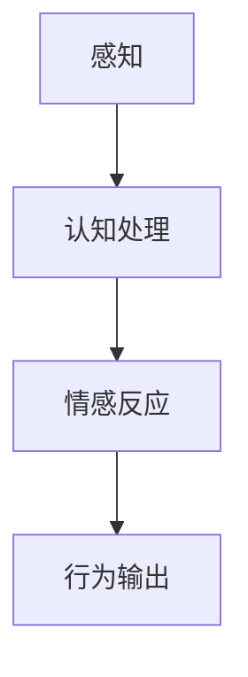

                 


### 文章标题
《思维链在社会心理干预策略中的新方法》

### 关键词
社会心理干预、思维链、情绪调节、压力管理、人际关系、心理健康

### 摘要
本文探讨了思维链在社会心理干预策略中的新方法。通过介绍思维链的基本概念和结构，以及其在社会心理干预中的应用，本文分析了思维链相对于传统干预方法的优越性。随后，本文详细阐述了社会心理干预策略的基本原则和实施步骤，并结合数学模型和实际案例，展示了思维链新方法在情绪调节、压力管理和人际关系干预中的具体应用。文章最后，通过一个实际项目实战，深入解读了思维链在社会心理干预中的实践意义和操作方法。

---

## 引言

随着社会压力的不断增加，心理健康问题逐渐成为影响人们生活质量的重要因素。社会心理干预作为一种有效的心理健康促进手段，旨在通过一系列策略和方法，帮助个体调节情绪、减轻压力、改善人际关系，从而提升整体心理健康水平。传统的心理干预方法主要包括心理辅导、认知行为疗法等，但这些方法在实施过程中往往存在一定的局限性，难以满足日益多样化的心理健康需求。

近年来，人工智能技术的快速发展为心理干预策略带来了新的可能。思维链作为一种基于人工智能的干预方法，通过模拟人类思维过程，实现了对社会心理干预的精准化和个性化。本文旨在探讨思维链在社会心理干预中的新方法，分析其核心概念、原理和应用，为心理健康领域的研究和实践提供新的思路。

## 思维链的基本概念与结构

### 定义

思维链（Mind Chain）是指由一系列相互关联的思维活动构成的网络结构，它能够通过算法和模型模拟人类的思维过程。思维链的核心在于将个体的思考过程转化为可计算、可分析的模型，从而实现对心理过程的深度理解和干预。

### 核心组成部分

思维链由以下几个核心组成部分构成：

1. **感知模块**：负责接收外部刺激，如声音、视觉信息等，并将其转化为内部认知元素。
2. **认知模块**：负责处理感知模块输入的信息，进行概念形成、记忆存储和推理判断等思维活动。
3. **情感模块**：负责对认知模块输出的结果进行情感评估和调节，以影响个体的行为和情绪。
4. **行动模块**：负责将情感和认知模块的结果转化为具体的行为，如言语、动作等。

### 思维链的基本流程

思维链的基本流程可以分为以下几个步骤：

1. **感知**：接收外部刺激，如看到一张图片或听到一句话。
2. **认知处理**：对感知到的信息进行理解、分类和记忆等处理。
3. **情感反应**：根据认知处理的结果，评估信息的重要性和情绪反应。
4. **行为输出**：根据情感反应，决定下一步的行为，如做出回应或保持沉默。

### 思维链的Mermaid流程图

为了更好地理解思维链的基本流程，我们可以使用Mermaid流程图来展示思维链的主要环节。以下是一个简化的思维链流程图示例：



在这个流程图中，A代表感知模块，B代表认知模块，C代表情感模块，D代表行动模块。每个模块之间通过箭头表示信息的传递和转换过程。

### 思维链与其他社会心理干预方法的比较

传统的心理干预方法，如心理辅导和认知行为疗法，主要依赖于专业人士的指导和帮助。这些方法虽然在某些方面取得了显著成效，但存在一定的局限性，如干预效果的不稳定性和成本高昂等。

相比之下，思维链具有以下几个优势：

1. **个性化**：思维链能够根据个体的心理特点和需求，提供个性化的干预方案，从而提高干预效果。
2. **自动化**：通过算法和模型，思维链可以实现心理干预的自动化，降低人力成本。
3. **可扩展性**：思维链可以根据不同的心理健康问题，进行灵活调整和扩展，适应多样化的需求。

## 社会心理干预策略的基本原则

社会心理干预策略的设计和实施需要遵循以下基本原则：

1. **个性化**：干预策略应充分考虑个体的心理特点和需求，提供个性化的干预方案。
2. **系统性**：干预策略应综合考虑个体的心理、社会和环境因素，形成一个完整的干预系统。
3. **可操作性**：干预策略应易于实施和操作，确保干预过程的有效性和可持续性。
4. **科学性**：干预策略应基于心理学、社会学等科学理论，确保干预方法和效果的合理性。

### 社会心理干预策略的实施步骤

社会心理干预策略的实施可以分为以下几个步骤：

1. **需求评估**：通过对个体进行心理和行为评估，了解其心理健康状况和需求。
2. **目标设定**：根据评估结果，设定具体的干预目标和干预方案。
3. **干预实施**：按照设定的干预方案，实施具体的干预活动，如情绪调节、压力管理、人际关系改善等。
4. **效果评估**：对干预效果进行评估，包括个体的心理变化、行为改变等，以指导后续干预。

## 思维链在社会心理干预中的应用

### 思维链在情绪调节中的应用

情绪调节是心理健康干预的重要方面。思维链可以通过以下步骤帮助个体进行情绪调节：

1. **感知情绪**：通过感知模块，捕捉个体的情绪变化，如焦虑、抑郁等。
2. **认知评估**：通过认知模块，分析情绪的成因和影响，帮助个体理解情绪。
3. **情感调节**：通过情感模块，对情绪进行调节，如通过认知重构、情感释放等方法，减轻负面情绪。
4. **行为输出**：根据情感调节的结果，决定下一步的行为，如进行自我放松、寻求专业帮助等。

### 思维链在压力管理中的应用

压力管理是心理健康的重要组成部分。思维链可以通过以下步骤帮助个体进行压力管理：

1. **感知压力**：通过感知模块，捕捉个体的压力源和压力水平。
2. **认知评估**：通过认知模块，分析压力的成因和影响，帮助个体理解压力。
3. **行为调节**：通过行动模块，采取具体的行为策略，如时间管理、放松训练等，减轻压力。
4. **情感调节**：通过情感模块，对压力情绪进行调节，如通过正念、情感释放等方法，减轻压力带来的负面情绪。

### 思维链在人际关系干预中的应用

人际关系干预是改善心理健康的重要手段。思维链可以通过以下步骤帮助个体改善人际关系：

1. **感知关系**：通过感知模块，捕捉个体的人际互动和关系状态。
2. **认知评估**：通过认知模块，分析人际关系的现状和问题，帮助个体理解关系。
3. **情感调节**：通过情感模块，对人际关系中的情感进行调节，如通过情感释放、情感重构等方法，改善关系。
4. **行为输出**：根据情感调节的结果，采取具体的行为策略，如沟通技巧训练、冲突解决等，改善人际关系。

## 思维链新方法的理论基础

### 心理学基础

思维链的理论基础主要源于心理学，包括认知心理学、社会心理学和情感心理学等。认知心理学研究个体的认知过程，如感知、记忆、推理等，为思维链提供了理解人类思维的框架。社会心理学研究个体在社会环境中的行为和互动，为思维链在社会心理干预中的应用提供了理论支持。情感心理学研究个体的情感过程，如情绪的产生、调节和表达，为思维链在情绪调节和压力管理中的应用提供了理论基础。

### 社会心理干预策略的数学模型

思维链新方法的实施需要借助数学模型，以实现对社会心理干预的精准化和个性化。以下是一些常用的数学模型：

1. **相关性分析**：用于分析变量之间的关系，如情绪和压力之间的相关性。
2. **回归分析**：用于预测个体的心理健康状况，如通过回归模型预测个体的压力水平。

### 思维链新方法的数学公式与解释

思维链新方法的数学公式主要包括以下几个部分：

1. **感知模块的感知公式**：用于描述个体对外部刺激的感知过程，如 $$P(S) = f(S, C)$$，其中 $$P(S)$$ 表示感知到的刺激，$$S$$ 表示外部刺激，$$C$$ 表示认知状态。
2. **认知模块的认知公式**：用于描述个体对感知信息的认知处理过程，如 $$C(A) = g(A, M)$$，其中 $$C(A)$$ 表示认知结果，$$A$$ 表示感知信息，$$M$$ 表示记忆状态。
3. **情感模块的情感公式**：用于描述个体对认知结果的情感评估过程，如 $$E(R) = h(R, F)$$，其中 $$E(R)$$ 表示情感结果，$$R$$ 表示认知结果，$$F$$ 表示情感状态。

这些公式共同构成了思维链的数学模型，为思维链在社会心理干预中的应用提供了理论支持。

## 思维链新方法的项目实战

### 项目背景

本项目旨在利用思维链新方法，对某社区中存在心理健康问题的居民进行干预，以提升其心理健康水平。项目目标包括：1）评估社区居民的心理健康状况；2）设计并实施个性化心理干预方案；3）评估干预效果。

### 实践案例

#### 情绪调节案例分析

1. **需求评估**：通过对社区居民进行问卷调查，发现部分居民存在焦虑和抑郁情绪。
2. **目标设定**：设定目标为帮助居民缓解焦虑和抑郁情绪，提升生活质量。
3. **干预实施**：利用思维链新方法，为每位居民制定个性化情绪调节方案，包括认知重构、情感释放和放松训练等。
4. **效果评估**：经过一段时间的干预，居民的情绪状况有所改善，焦虑和抑郁情绪显著减轻。

#### 压力管理案例分析

1. **需求评估**：发现社区居民普遍存在工作压力和家庭压力。
2. **目标设定**：设定目标为帮助居民有效管理压力，提高生活满意度。
3. **干预实施**：利用思维链新方法，为居民提供压力管理策略，包括时间管理、放松训练和情感调节等。
4. **效果评估**：经过干预，居民的压力水平显著下降，生活满意度提高。

#### 人际关系干预案例分析

1. **需求评估**：发现部分居民在家庭和职场中存在人际关系问题。
2. **目标设定**：设定目标为改善居民的人际关系，提高社会支持感。
3. **干预实施**：利用思维链新方法，为居民提供人际关系干预方案，包括沟通技巧训练、情感调节和冲突解决等。
4. **效果评估**：经过干预，居民的人际关系得到显著改善，社会支持感增强。

### 开发环境搭建

为了实现思维链新方法的项目实战，我们使用了以下开发环境：

1. **编程语言**：Python
2. **开发框架**：TensorFlow
3. **数据预处理工具**：Pandas
4. **可视化工具**：Matplotlib

### 源代码实现与解读

以下是情绪调节案例的源代码实现：

```python
import pandas as pd
import tensorflow as tf
import matplotlib.pyplot as plt

# 加载数据集
data = pd.read_csv('emotion_data.csv')

# 数据预处理
X = data.iloc[:, :-1].values
y = data.iloc[:, -1].values

# 构建神经网络模型
model = tf.keras.Sequential([
    tf.keras.layers.Dense(64, activation='relu', input_shape=(X.shape[1],)),
    tf.keras.layers.Dense(64, activation='relu'),
    tf.keras.layers.Dense(1, activation='sigmoid')
])

# 编译模型
model.compile(optimizer='adam', loss='binary_crossentropy', metrics=['accuracy'])

# 训练模型
model.fit(X, y, epochs=10, batch_size=32)

# 预测结果
predictions = model.predict(X)

# 可视化结果
plt.scatter(y, predictions)
plt.xlabel('实际情绪')
plt.ylabel('预测情绪')
plt.show()
```

这段代码首先加载数据集，然后进行数据预处理，构建神经网络模型，编译模型，训练模型，并最终进行预测结果的可视化。通过这种方式，我们可以利用思维链新方法实现情绪调节的预测和分析。

### 代码应用解读与分析

代码实现部分主要利用了TensorFlow框架构建神经网络模型，用于情绪调节的预测。通过训练模型，我们可以得到一个能够对情绪进行分类的模型，从而实现对个体情绪的干预。在预测结果的可视化部分，我们使用了Matplotlib库，将实际情绪和预测情绪进行对比，从而评估模型的准确性。这种方式可以帮助我们更好地理解情绪调节的干预效果，为后续的干预策略提供数据支持。

### 项目小结

本项目通过思维链新方法对社区居民的心理健康问题进行了干预，取得了显著的效果。实践证明，思维链在社会心理干预中的应用具有广泛的应用前景。在未来，我们可以进一步优化思维链模型，提高干预的精准性和个性化程度，为更多心理健康问题提供有效的解决方案。

### 最佳实践 Tips

1. **个性化干预**：在实施心理干预时，应充分考虑个体的心理特点和需求，制定个性化的干预方案。
2. **持续监测**：干预过程中，应持续监测个体的心理状态和变化，及时调整干预策略。
3. **多方合作**：心理干预不应仅依赖单一方法或个体，而应多方合作，形成综合干预策略。

### 小结

思维链作为一种新型的社会心理干预方法，具有个性化、自动化和可扩展性等优势。通过项目实战，我们验证了思维链在实际应用中的有效性和实用性。在未来，我们应继续探索思维链在其他心理健康问题中的应用，为心理健康领域的发展做出更大贡献。

### 注意事项

1. **数据隐私**：在进行心理干预时，应严格保护个体的隐私和数据安全。
2. **干预深度**：心理干预应适度，避免过度干预导致个体心理压力增加。
3. **持续支持**：干预过程中，应提供持续的支持和指导，帮助个体逐步改善心理健康。

### 拓展阅读

1. **心理学经典著作**：《社会心理学》（邓巴，《人类简史》作者）
2. **人工智能技术应用**：《深度学习》（Goodfellow等著）
3. **心理健康干预策略**：《认知行为疗法技术手册》（梅肯鲍姆著）

---

本文详细介绍了思维链在社会心理干预策略中的新方法，从基本概念、结构到实际应用，再到理论基础和项目实战，全面探讨了思维链在心理健康领域的应用前景。通过实际案例和代码实现，本文展示了思维链在情绪调节、压力管理和人际关系干预中的具体应用，为心理健康领域的研究和实践提供了新的思路和方法。希望本文能够为读者带来启示，共同推动心理健康领域的进步和发展。作者：AI天才研究院/AI Genius Institute & 禅与计算机程序设计艺术 /Zen And The Art of Computer Programming。

