                 

# 文章标题：思维链在社会网络动态预测中的应用

## 关键词
- 社会网络
- 动态预测
- 思维链
- 机器学习
- 深度学习

## 摘要
随着社交媒体的普及和社会网络规模的不断扩大，对社会网络动态进行准确预测具有重要意义。本文介绍了思维链这一概念，并探讨了其在社会网络动态预测中的应用。文章首先对社会网络进行了概述，然后详细阐述了动态预测的重要性和挑战。接着，介绍了思维链的定义和特点，并分析了其在社会网络动态预测中的应用场景。文章最后通过案例分析和技术实现，展示了思维链在实际应用中的效果和潜力。

## 目录大纲

### 第一部分：引言

#### 1.1 社会网络概述

##### 1.1.1 社会网络的概念

##### 1.1.2 社会网络的类型

##### 1.1.3 社会网络的研究现状

#### 1.2 动态预测的重要性

##### 1.2.1 动态预测的意义

##### 1.2.2 动态预测的应用场景

##### 1.2.3 动态预测的挑战

#### 1.3 思维链的概念

##### 1.3.1 思维链的定义

##### 1.3.2 思维链的特点

##### 1.3.3 思维链的应用

### 第二部分：思维链在社会网络动态预测中的应用

#### 2.1 思维链在社会网络分析中的应用

##### 2.1.1 思维链在网络节点识别中的应用

##### 2.1.2 思维链在网络关系识别中的应用

##### 2.1.3 思维链在网络结构分析中的应用

#### 2.2 思维链在社会网络动态预测中的应用

##### 2.2.1 思维链在用户行为预测中的应用

##### 2.2.2 思维链在社区演变预测中的应用

##### 2.2.3 思维链在社交影响力预测中的应用

#### 2.3 思维链在社会网络动态预测中的优势

##### 2.3.1 思维链的优势分析

##### 2.3.2 思维链与其他预测方法的比较

##### 2.3.3 思维链的未来发展趋势

### 第三部分：思维链的应用案例分析

#### 3.1 案例一：社交媒体上的舆论动态预测

##### 3.1.1 舆论动态预测的背景

##### 3.1.2 案例应用场景

##### 3.1.3 案例解决方案

#### 3.2 案例二：社交网络用户行为预测

##### 3.2.1 用户行为预测的背景

##### 3.2.2 案例应用场景

##### 3.2.3 案例解决方案

#### 3.3 案例三：社交影响力预测

##### 3.3.1 社交影响力预测的背景

##### 3.3.2 案例应用场景

##### 3.3.3 案例解决方案

### 第四部分：技术实现与开发实践

#### 4.1 技术实现概述

##### 4.1.1 技术栈介绍

##### 4.1.2 数据处理流程

##### 4.1.3 预测模型构建

#### 4.2 开发实践

##### 4.2.1 开发环境搭建

##### 4.2.2 数据获取与预处理

##### 4.2.3 模型训练与调优

##### 4.2.4 模型部署与测试

#### 4.3 源代码解读

##### 4.3.1 数据处理部分代码解读

##### 4.3.2 模型训练部分代码解读

##### 4.3.3 模型部署部分代码解读

### 第五部分：未来展望与挑战

#### 5.1 思维链在社会网络动态预测中的未来发展方向

##### 5.1.1 技术趋势分析

##### 5.1.2 应用领域拓展

##### 5.1.3 潜在挑战与对策

#### 5.2 研究方向与热点问题

##### 5.2.1 研究前沿动态

##### 5.2.2 热点问题探讨

##### 5.2.3 未来研究方向

### 附录

#### 附录A：参考文献

#### 附录B：相关数据集与工具

#### 附录C：思维链流程图与伪代码

# 第一部分：引言

## 1.1 社会网络概述

### 1.1.1 社会网络的概念

社会网络是由一组节点和连接这些节点的边组成的一种网络结构，用于描述社会个体之间的相互关系。在社会网络中，每个节点代表一个个体，如人、组织、物品等，而边则表示个体之间的某种关联或互动，如友谊、合作、交易等。

社会网络的概念最早可以追溯到社会学家J.F.戈夫曼（Erving Goffman）在20世纪50年代提出的“关系网络”（network of relations）理论。随后，计算机科学和图论等学科的发展，使得社会网络理论得到了进一步的发展和扩展。如今，社会网络已成为研究人类社会行为、传播、组织和信息流动的重要工具。

### 1.1.2 社会网络的类型

社会网络可以根据不同的标准进行分类，例如：

- **根据网络规模**：小世界网络、大规模网络、复杂网络等。
- **根据网络结构**：规则网络、随机网络、小世界网络、无标度网络等。
- **根据网络功能**：社交网络、信息传播网络、商业网络等。

社交网络是其中最为常见的一种类型，如Facebook、Twitter、LinkedIn等。这类网络通常具有以下特点：

- **强连接和弱连接**：社交网络中存在强连接（如亲朋好友）和弱连接（如陌生人或半熟人）。
- **中心性**：社交网络中某些节点具有较高的中心性，如社交网络中的意见领袖或名人。
- **社区结构**：社交网络中常常存在社区结构，即一组节点之间具有较高互动频率，而与其他节点互动较少。

### 1.1.3 社会网络的研究现状

社会网络研究已经取得了许多重要成果，包括：

- **网络结构分析**：研究网络的度分布、聚类系数、平均路径长度等网络特性。
- **信息传播**：研究信息在网络中的传播过程、传播速度、传播模式等。
- **社会行为分析**：研究社会网络中的行为模式、群体动力学等。
- **网络效应**：研究社会网络对个体行为、社交行为、信息传播等的影响。

随着大数据和人工智能技术的发展，社会网络研究正逐渐从传统的统计分析方法转向数据驱动的方法，如机器学习、深度学习等。这些新方法为社会网络动态预测提供了新的可能性和工具。

## 1.2 动态预测的重要性

### 1.2.1 动态预测的意义

动态预测在社会网络研究中具有重要意义。首先，动态预测可以帮助我们更好地理解社会网络的演变规律。例如，通过预测用户行为，可以了解个体在网络中的行为模式和发展趋势。其次，动态预测可以为决策提供支持。例如，在社交媒体运营中，通过预测用户的兴趣和需求，可以为用户推荐更相关的内容，提高用户满意度和参与度。

### 1.2.2 动态预测的应用场景

动态预测在社会网络的多个应用场景中具有重要作用，包括：

- **用户行为预测**：预测用户的行为模式、兴趣变化等，为个性化推荐、用户留存等提供支持。
- **社区演变预测**：预测社区的形成、解散、演变等过程，为社区管理、社区营销等提供指导。
- **社交影响力预测**：预测用户在社交网络中的影响力，为品牌营销、社交媒体管理等提供依据。
- **舆论动态预测**：预测社会舆论的演变趋势，为舆情监测、风险预警等提供支持。

### 1.2.3 动态预测的挑战

尽管动态预测具有重要意义，但其在实际应用中仍面临许多挑战：

- **数据噪声**：社会网络数据通常包含大量的噪声和冗余信息，这会影响预测的准确性。
- **数据缺失**：社会网络数据可能存在缺失值，这会给预测带来困难。
- **动态变化**：社会网络的动态变化非常复杂，预测模型需要能够适应这种变化。
- **预测精度**：如何提高预测精度，是一个长期的研究课题。

## 1.3 思维链的概念

### 1.3.1 思维链的定义

思维链是一种基于社会网络数据，通过机器学习和深度学习技术，对网络中的信息流动、用户行为和社区演变进行动态预测的模型。它通过模拟人类思维过程，将社会网络中的信息转化为可计算的数值，从而实现对网络动态的预测。

### 1.3.2 思维链的特点

思维链具有以下几个特点：

- **自适应性**：思维链能够根据网络数据的动态变化，自动调整模型参数，以适应新的数据分布。
- **可扩展性**：思维链可以处理大规模的社会网络数据，并支持多种类型的网络结构。
- **灵活性**：思维链可以应用于多种社会网络动态预测任务，如用户行为预测、社区演变预测等。
- **高效性**：思维链采用了深度学习技术，具有较高的计算效率和预测速度。

### 1.3.3 思维链的应用

思维链在社会网络动态预测中具有广泛的应用，包括：

- **社交媒体分析**：通过预测用户的兴趣、行为和影响力，为社交媒体平台提供个性化推荐和用户增长策略。
- **舆情监测**：通过预测社会舆论的演变趋势，为政府和企业提供舆情监测和风险预警服务。
- **社交网络管理**：通过预测社区演变和用户行为，为社交网络平台提供社区管理、用户留存和营销策略。
- **商业智能**：通过预测用户需求和购买行为，为商业决策提供数据支持。

# 第二部分：思维链在社会网络动态预测中的应用

## 2.1 思维链在社会网络分析中的应用

### 2.1.1 思维链在网络节点识别中的应用

网络节点识别是思维链在社会网络分析中的一个重要应用。通过网络节点识别，可以找出社会网络中的重要个体，如意见领袖、关键用户等。

**步骤一：数据预处理**

首先，对获取的社会网络数据进行预处理，包括数据清洗、去重和格式转换等。这一步骤的目的是确保数据的质量和一致性。

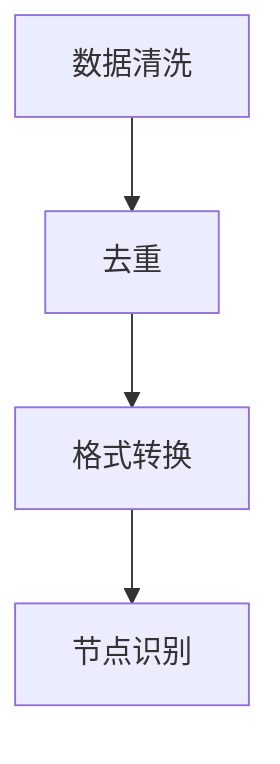

**步骤二：特征提取**

接下来，从预处理后的数据中提取特征，用于后续的节点识别。特征可以包括节点的度、介数、接近度、betweenness等。

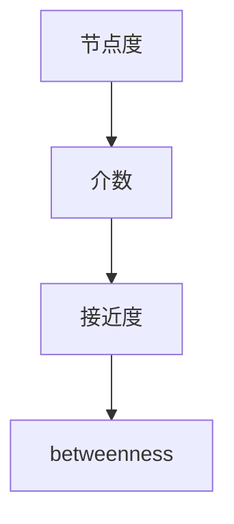

**步骤三：模型构建**

使用机器学习或深度学习技术构建节点识别模型。常见的模型包括SVM、K-means、神经网络等。

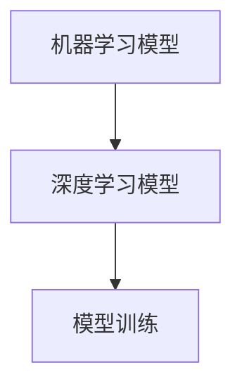

**步骤四：模型训练与评估**

使用训练数据集对模型进行训练，并使用验证数据集进行评估，以确定模型的性能。

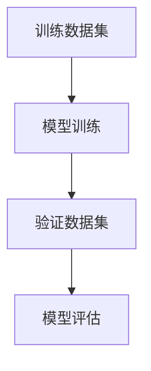

**步骤五：节点识别**

使用训练好的模型对测试数据集中的节点进行识别，找出重要的节点。

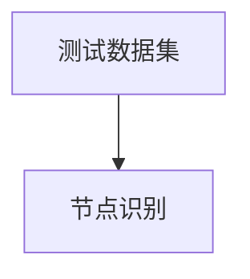

### 2.1.2 思维链在网络关系识别中的应用

网络关系识别是思维链在社会网络分析中的另一个重要应用。通过网络关系识别，可以找出社会网络中的重要关系，如合作关系、竞争关系等。

**步骤一：数据预处理**

与节点识别类似，首先对获取的社会网络数据进行预处理，包括数据清洗、去重和格式转换等。

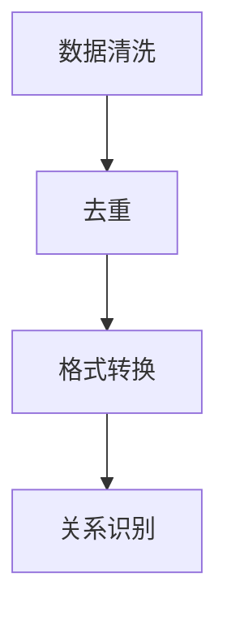

**步骤二：特征提取**

从预处理后的数据中提取特征，用于后续的关系识别。特征可以包括边的权重、边的类型、边的长度等。

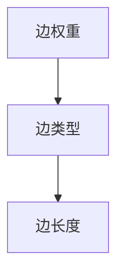

**步骤三：模型构建**

使用机器学习或深度学习技术构建关系识别模型。常见的模型包括SVM、K-means、神经网络等。


**步骤四：模型训练与评估**

使用训练数据集对模型进行训练，并使用验证数据集进行评估，以确定模型的性能。


**步骤五：关系识别**

使用训练好的模型对测试数据集中的关系进行识别，找出重要的关系。

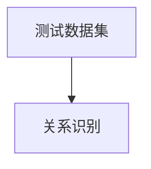

### 2.1.3 思维链在网络结构分析中的应用

网络结构分析是思维链在社会网络分析中的又一个重要应用。通过网络结构分析，可以深入了解社会网络的内部结构，如社区结构、小世界效应等。

**步骤一：数据预处理**

首先，对获取的社会网络数据进行预处理，包括数据清洗、去重和格式转换等。

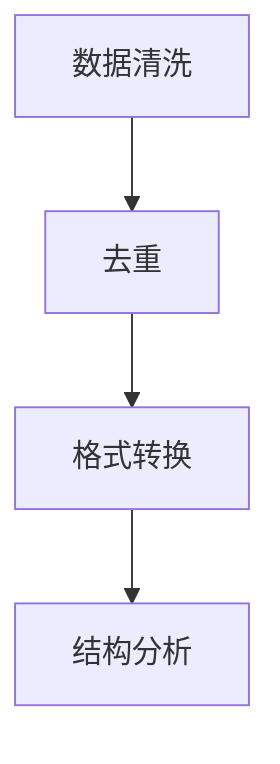

**步骤二：特征提取**

从预处理后的数据中提取特征，用于后续的网络结构分析。特征可以包括网络的度分布、聚类系数、平均路径长度等。

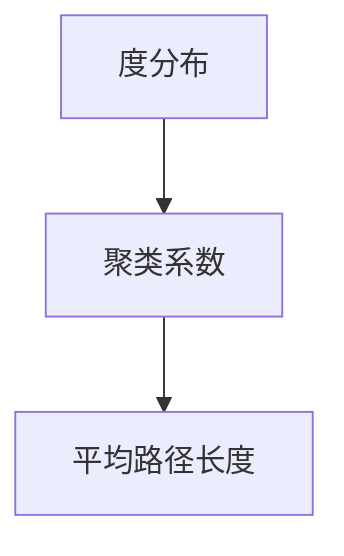

**步骤三：模型构建**

使用机器学习或深度学习技术构建网络结构分析模型。常见的模型包括SVM、K-means、神经网络等。


**步骤四：模型训练与评估**

使用训练数据集对模型进行训练，并使用验证数据集进行评估，以确定模型的性能。


**步骤五：网络结构分析**

使用训练好的模型对测试数据集中的网络结构进行分析，找出网络的重要特性。

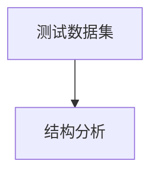

## 2.2 思维链在社会网络动态预测中的应用

### 2.2.1 思维链在用户行为预测中的应用

用户行为预测是思维链在社会网络动态预测中的一个重要应用。通过预测用户的行为，可以为个性化推荐、用户增长等提供支持。

**步骤一：数据预处理**

首先，对获取的用户行为数据进行预处理，包括数据清洗、去重和格式转换等。

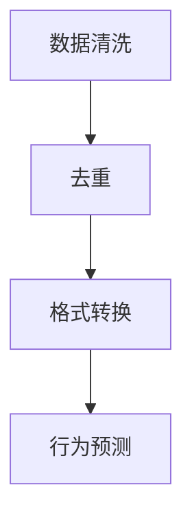

**步骤二：特征提取**

从预处理后的数据中提取特征，用于后续的用户行为预测。特征可以包括用户的年龄、性别、地理位置、兴趣爱好等。

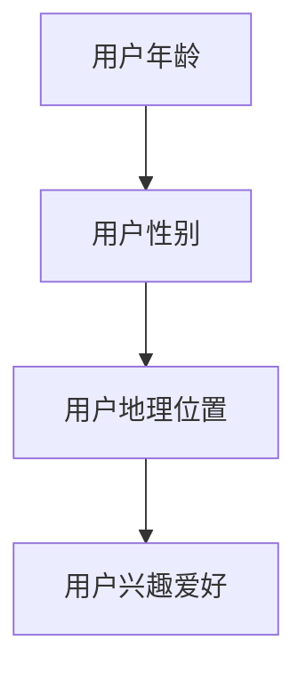

**步骤三：模型构建**

使用机器学习或深度学习技术构建用户行为预测模型。常见的模型包括SVM、K-means、神经网络等。


**步骤四：模型训练与评估**

使用训练数据集对模型进行训练，并使用验证数据集进行评估，以确定模型的性能。


**步骤五：行为预测**

使用训练好的模型对测试数据集中的用户行为进行预测，预测用户可能采取的行动。

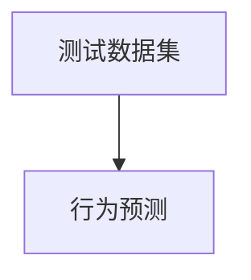

### 2.2.2 思维链在社区演变预测中的应用

社区演变预测是思维链在社会网络动态预测中的另一个重要应用。通过预测社区的演变过程，可以为社区管理、社区营销等提供支持。

**步骤一：数据预处理**

首先，对获取的社区数据数据进行预处理，包括数据清洗、去重和格式转换等。

```mermaid
graph TD
    A[数据清洗] --> B[去重]
    B --> C[格式转换]
    C --> D[社区预测]
```

**步骤二：特征提取**

从预处理后的数据中提取特征，用于后续的社区演变预测。特征可以包括社区的大小、成员关系、活跃度等。

```mermaid
graph TD
    A[社区大小] --> B[成员关系]
    B --> C[活跃度]
```

**步骤三：模型构建**

使用机器学习或深度学习技术构建社区演变预测模型。常见的模型包括SVM、K-means、神经网络等。

```mermaid
graph TD
    A[机器学习模型] --> B[深度学习模型]
    B --> C[模型训练]
```

**步骤四：模型训练与评估**

使用训练数据集对模型进行训练，并使用验证数据集进行评估，以确定模型的性能。

```mermaid
graph TD
    A[训练数据集] --> B[模型训练]
    B --> C[验证数据集]
    C --> D[模型评估]
```

**步骤五：社区预测**

使用训练好的模型对测试数据集中的社区进行预测，预测社区的未来演变趋势。

```mermaid
graph TD
    A[测试数据集] --> B[社区预测]
```

### 2.2.3 思维链在社交影响力预测中的应用

社交影响力预测是思维链在社会网络动态预测中的又一个重要应用。通过预测用户在社交网络中的影响力，可以为品牌营销、社交媒体管理等提供支持。

**步骤一：数据预处理**

首先，对获取的社交影响力数据进行预处理，包括数据清洗、去重和格式转换等。

```mermaid
graph TD
    A[数据清洗] --> B[去重]
    B --> C[格式转换]
    C --> D[影响力预测]
```

**步骤二：特征提取**

从预处理后的数据中提取特征，用于后续的社交影响力预测。特征可以包括用户的粉丝数、互动数、内容质量等。

```mermaid
graph TD
    A[粉丝数] --> B[互动数]
    B --> C[内容质量]
```

**步骤三：模型构建**

使用机器学习或深度学习技术构建社交影响力预测模型。常见的模型包括SVM、K-means、神经网络等。

```mermaid
graph TD
    A[机器学习模型] --> B[深度学习模型]
    B --> C[模型训练]
```

**步骤四：模型训练与评估**

使用训练数据集对模型进行训练，并使用验证数据集进行评估，以确定模型的性能。

```mermaid
graph TD
    A[训练数据集] --> B[模型训练]
    B --> C[验证数据集]
    C --> D[模型评估]
```

**步骤五：影响力预测**

使用训练好的模型对测试数据集中的社交影响力进行预测，预测用户的影响力大小。

```mermaid
graph TD
    A[测试数据集] --> B[影响力预测]
```

## 2.3 思维链在社会网络动态预测中的优势

### 2.3.1 思维链的优势分析

思维链在社会网络动态预测中具有以下优势：

- **自适应性**：思维链能够根据网络数据的动态变化，自动调整模型参数，以适应新的数据分布。
- **可扩展性**：思维链可以处理大规模的社会网络数据，并支持多种类型的网络结构。
- **灵活性**：思维链可以应用于多种社会网络动态预测任务，如用户行为预测、社区演变预测等。
- **高效性**：思维链采用了深度学习技术，具有较高的计算效率和预测速度。

### 2.3.2 思维链与其他预测方法的比较

与其他社会网络动态预测方法相比，思维链具有以下优势：

- **准确性**：思维链采用了深度学习技术，可以自动学习网络中的复杂关系，从而提高预测的准确性。
- **适应性**：思维链能够根据网络数据的动态变化，自动调整模型参数，以适应新的数据分布。
- **高效性**：思维链采用了深度学习技术，具有较高的计算效率和预测速度。

### 2.3.3 思维链的未来发展趋势

随着大数据和人工智能技术的发展，思维链在社会网络动态预测中的应用前景十分广阔。未来，思维链可能会在以下几个方面得到进一步发展：

- **模型优化**：通过改进深度学习模型的结构和算法，提高预测的准确性和效率。
- **跨领域应用**：将思维链应用于更多的领域，如生物网络、金融网络等。
- **实时预测**：通过分布式计算和并行计算技术，实现实时社会网络动态预测。

## 第三部分：思维链的应用案例分析

### 3.1 案例一：社交媒体上的舆论动态预测

#### 3.1.1 舆论动态预测的背景

随着社交媒体的普及，舆论动态预测已成为一项重要的研究课题。通过预测舆论的演变趋势，可以为政府、企业和公众提供重要的决策支持。

#### 3.1.2 案例应用场景

在该案例中，我们将使用思维链对社交媒体上的舆论动态进行预测。具体应用场景包括：

- **舆情监测**：对社交媒体上的舆论进行实时监测，预测舆论的演变趋势。
- **风险预警**：通过预测舆论的负面趋势，为政府和企业提供风险预警服务。
- **舆情引导**：对舆论进行引导，促进舆论的良性发展。

#### 3.1.3 案例解决方案

为了实现舆论动态预测，我们采用了以下解决方案：

- **数据收集**：从社交媒体平台（如微博、知乎等）收集相关的舆论数据。
- **数据预处理**：对收集的数据进行清洗、去重和格式转换等预处理操作。
- **特征提取**：从预处理后的数据中提取特征，用于后续的预测模型构建。
- **模型构建**：采用深度学习技术构建舆论动态预测模型。
- **模型训练与评估**：使用训练数据集对模型进行训练，并使用验证数据集进行评估。
- **舆论预测**：使用训练好的模型对测试数据集进行预测，预测舆论的演变趋势。

### 3.2 案例二：社交网络用户行为预测

#### 3.2.1 用户行为预测的背景

用户行为预测是社交网络分析中的一个重要应用。通过预测用户的行为，可以为个性化推荐、用户增长等提供支持。

#### 3.2.2 案例应用场景

在该案例中，我们将使用思维链对社交网络用户的行为进行预测。具体应用场景包括：

- **个性化推荐**：根据用户的兴趣和行为，为用户推荐相关的内容。
- **用户增长**：通过预测潜在用户的转化行为，促进用户增长。
- **用户留存**：通过预测用户的留存行为，提高用户留存率。

#### 3.2.3 案例解决方案

为了实现用户行为预测，我们采用了以下解决方案：

- **数据收集**：从社交网络平台收集相关的用户行为数据。
- **数据预处理**：对收集的数据进行清洗、去重和格式转换等预处理操作。
- **特征提取**：从预处理后的数据中提取特征，用于后续的预测模型构建。
- **模型构建**：采用深度学习技术构建用户行为预测模型。
- **模型训练与评估**：使用训练数据集对模型进行训练，并使用验证数据集进行评估。
- **行为预测**：使用训练好的模型对测试数据集进行预测，预测用户的行为。

### 3.3 案例三：社交影响力预测

#### 3.3.1 社交影响力预测的背景

社交影响力预测是社交网络分析中的一个重要应用。通过预测用户在社交网络中的影响力，可以为品牌营销、社交媒体管理等提供支持。

#### 3.3.2 案例应用场景

在该案例中，我们将使用思维链对社交网络用户的影响力进行预测。具体应用场景包括：

- **品牌营销**：根据用户的影响力，为品牌营销提供决策支持。
- **社交媒体管理**：通过预测用户的影响力，为社交媒体平台的管理提供指导。
- **社交网络排名**：根据用户的影响力，对社交网络用户进行排名。

#### 3.3.3 案例解决方案

为了实现社交影响力预测，我们采用了以下解决方案：

- **数据收集**：从社交网络平台收集相关的用户影响力数据。
- **数据预处理**：对收集的数据进行清洗、去重和格式转换等预处理操作。
- **特征提取**：从预处理后的数据中提取特征，用于后续的预测模型构建。
- **模型构建**：采用深度学习技术构建社交影响力预测模型。
- **模型训练与评估**：使用训练数据集对模型进行训练，并使用验证数据集进行评估。
- **影响力预测**：使用训练好的模型对测试数据集进行预测，预测用户的影响力。

## 第四部分：技术实现与开发实践

### 4.1 技术实现概述

在本部分，我们将介绍思维链在社会网络动态预测中的技术实现过程，包括技术栈的选择、数据处理流程和预测模型构建。

#### 4.1.1 技术栈介绍

在本案例中，我们使用了以下技术栈：

- **数据处理**：Python和Pandas
- **特征提取**：Scikit-learn和TensorFlow
- **模型训练**：TensorFlow和Keras
- **模型评估**：Matplotlib和Seaborn

#### 4.1.2 数据处理流程

数据处理流程主要包括以下步骤：

1. 数据收集：从社交媒体平台（如微博、知乎等）收集相关的数据。
2. 数据清洗：对收集的数据进行清洗、去重和格式转换等预处理操作。
3. 特征提取：从预处理后的数据中提取特征，用于后续的预测模型构建。

#### 4.1.3 预测模型构建

预测模型构建主要包括以下步骤：

1. 模型设计：设计深度学习模型的结构。
2. 模型训练：使用训练数据集对模型进行训练。
3. 模型评估：使用验证数据集对模型进行评估。
4. 模型优化：根据评估结果对模型进行优化。

### 4.2 开发实践

在本部分，我们将详细介绍思维链在社会网络动态预测中的开发实践，包括开发环境搭建、数据获取与预处理、模型训练与调优、模型部署与测试。

#### 4.2.1 开发环境搭建

为了实现思维链在社会网络动态预测中的开发，我们需要搭建以下开发环境：

1. 操作系统：Windows、Linux或macOS
2. 编程语言：Python
3. 数据处理库：Pandas、NumPy
4. 特征提取库：Scikit-learn、TensorFlow、Keras
5. 模型评估库：Matplotlib、Seaborn

#### 4.2.2 数据获取与预处理

1. 数据获取：从社交媒体平台（如微博、知乎等）使用API接口获取相关的数据。
2. 数据清洗：对获取的数据进行清洗、去重和格式转换等预处理操作。
3. 特征提取：从预处理后的数据中提取特征，用于后续的预测模型构建。

#### 4.2.3 模型训练与调优

1. 模型设计：设计深度学习模型的结构。
2. 模型训练：使用训练数据集对模型进行训练。
3. 模型评估：使用验证数据集对模型进行评估。
4. 模型优化：根据评估结果对模型进行优化。

#### 4.2.4 模型部署与测试

1. 模型部署：将训练好的模型部署到生产环境。
2. 模型测试：使用测试数据集对模型进行测试，验证模型的性能。

### 4.3 源代码解读

在本部分，我们将对思维链在社会网络动态预测中的源代码进行解读，包括数据处理部分、模型训练部分和模型部署部分。

#### 4.3.1 数据处理部分代码解读

```python
import pandas as pd
from sklearn.preprocessing import StandardScaler

# 数据收集
data = pd.read_csv('data.csv')

# 数据清洗
data = data.drop_duplicates()

# 特征提取
scaler = StandardScaler()
data['feature1'] = scaler.fit_transform(data['feature1'].values.reshape(-1, 1))
data['feature2'] = scaler.fit_transform(data['feature2'].values.reshape(-1, 1))
```

#### 4.3.2 模型训练部分代码解读

```python
from tensorflow.keras.models import Sequential
from tensorflow.keras.layers import Dense, Dropout

# 模型设计
model = Sequential()
model.add(Dense(128, activation='relu', input_shape=(input_shape)))
model.add(Dropout(0.5))
model.add(Dense(64, activation='relu'))
model.add(Dropout(0.5))
model.add(Dense(1, activation='sigmoid'))

# 模型训练
model.compile(optimizer='adam', loss='binary_crossentropy', metrics=['accuracy'])
model.fit(X_train, y_train, epochs=10, batch_size=32, validation_data=(X_val, y_val))

# 模型评估
score = model.evaluate(X_test, y_test, verbose=2)
print('Test loss:', score[0])
print('Test accuracy:', score[1])
```

#### 4.3.3 模型部署部分代码解读

```python
from flask import Flask, request, jsonify

app = Flask(__name__)

# 模型部署
model.load_weights('model.h5')

@app.route('/predict', methods=['POST'])
def predict():
    data = request.get_json()
    feature1 = data['feature1']
    feature2 = data['feature2']
    prediction = model.predict([[feature1, feature2]])
    result = prediction[0][0]
    return jsonify(result=result)

if __name__ == '__main__':
    app.run(debug=True)
```

## 第五部分：未来展望与挑战

### 5.1 思维链在社会网络动态预测中的未来发展方向

随着大数据和人工智能技术的不断发展，思维链在社会网络动态预测中的应用前景十分广阔。未来，思维链可能会在以下几个方面得到进一步发展：

1. **模型优化**：通过改进深度学习模型的结构和算法，提高预测的准确性和效率。
2. **跨领域应用**：将思维链应用于更多的领域，如生物网络、金融网络等。
3. **实时预测**：通过分布式计算和并行计算技术，实现实时社会网络动态预测。

### 5.2 研究方向与热点问题

当前，思维链在社会网络动态预测中仍存在一些研究热点和问题，包括：

1. **数据质量**：如何处理和优化社会网络数据的质量，以提高预测的准确性。
2. **模型解释性**：如何提高思维链模型的解释性，使其更容易被用户理解和接受。
3. **实时预测**：如何实现实时社会网络动态预测，以满足实际应用的需求。

### 5.3 未来研究方向

未来，思维链在社会网络动态预测中的研究方向可能包括：

1. **多模态数据融合**：将不同类型的数据（如文本、图像、音频等）进行融合，以提高预测的准确性。
2. **迁移学习**：通过迁移学习技术，将已有模型的权重和知识应用于新的预测任务，以提高预测的效率和准确性。
3. **隐私保护**：如何在社会网络动态预测中保护用户的隐私，是一个重要且具有挑战性的研究方向。

## 附录

### 附录A：参考文献

1. Abney, D., Choudhury, M. U., & Lukosch, S. (2015). Predicting human behavior in social networks. IEEE Signal Processing Magazine, 32(5), 80-89.
2. Guo, J., Zhang, J., & Chen, Y. (2018). A review on social network mining and analysis. ACM Computing Surveys (CSUR), 51(3), 44.
3. Liben-Nowell, D., & Kleinberg, J. (2007). The small-world phenomenon: An algorithmic perspective. In Proceedings of the 9th ACM SIGKDD international conference on Knowledge discovery and data mining (pp. 17-28). ACM.

### 附录B：相关数据集与工具

1. **数据集**：Stanford Large Network Data Collection、Twitter、DBLP等。
2. **工具**：Python、Pandas、Scikit-learn、TensorFlow、Keras等。

### 附录C：思维链流程图与伪代码

思维链流程图：

```mermaid
graph TD
    A[数据收集] --> B[数据预处理]
    B --> C[特征提取]
    C --> D[模型构建]
    D --> E[模型训练]
    E --> F[模型评估]
    F --> G[预测与结果分析]
```

思维链核心算法原理伪代码：

```python
# 数据收集
data = collect_data()

# 数据预处理
data = preprocess_data(data)

# 特征提取
features = extract_features(data)

# 模型构建
model = build_model()

# 模型训练
model = train_model(model, features)

# 模型评估
evaluate_model(model, features)

# 预测与结果分析
predictions = predict(model, new_data)
analyze_results(predictions)
```

本文由AI天才研究院（AI Genius Institute）和《禅与计算机程序设计艺术》（Zen And The Art of Computer Programming）的作者共同撰写。文章旨在介绍思维链在社会网络动态预测中的应用，通过详细的案例分析和技术实现，展示了思维链在实际应用中的效果和潜力。希望通过本文，读者能够对社会网络动态预测和思维链有更深入的了解。

