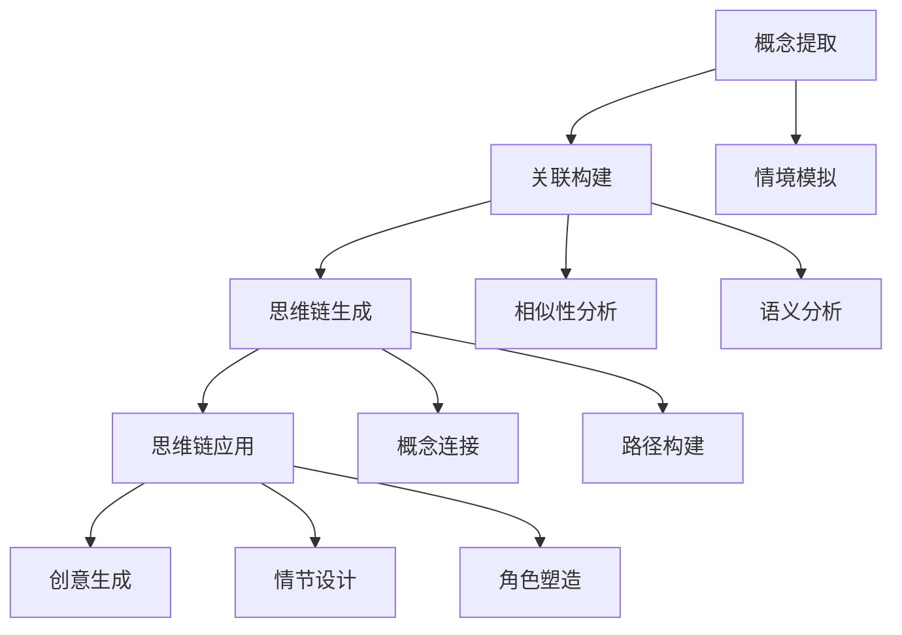
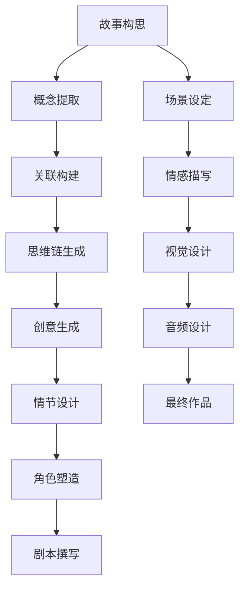

                 

### 文章标题

《思维链在科幻创作中的应用：拓展想象力边界》

关键词：科幻创作，想象力，创造力，思维链，创意构思，情节设计，角色塑造，世界构建

摘要：本文旨在探讨思维链这一创新思维方式在科幻创作中的应用，阐述如何通过思维链的构建与运用，拓展科幻创作的想象力边界，提升作品的质量与深度。文章分为两部分：第一部分介绍科幻创作的基础知识，包括科幻的定义、想象力与创造力的培养，以及科幻创作的基本原则；第二部分深入探讨思维链在科幻创作中的具体应用，从创意生成、情节设计、角色塑造到科幻世界构建，通过实战案例解析思维链在科幻创作中的实际操作，最终实现想象力边界的拓展。

### 文章目录大纲

第一部分：科幻创作基础

## 第1章：科幻创作概述

### 1.1 科幻的定义与历史演变

### 1.2 科幻作品的主要类型

### 1.3 科幻作品的创作特点

## 第2章：想象力与创造力

### 2.1 想象力的本质

### 2.2 创造力的培养

### 2.3 思维链在想象力提升中的应用

## 第3章：科幻创作的基本原则

### 3.1 科幻故事的结构

### 3.2 人物塑造

### 3.3 情节设计

第二部分：思维链在科幻创作中的应用

## 第4章：思维链的基本概念

### 4.1 思维链的定义

### 4.2 思维链的组成

### 4.3 思维链在工作原理

## 第5章：思维链在科幻创意生成中的应用

### 5.1 思维链在创意构思中的应用

### 5.2 思维链在情节设计中的应用

### 5.3 思维链在角色塑造中的应用

## 第6章：思维链在科幻世界构建中的应用

### 6.1 思维链在设定背景中的应用

### 6.2 思维链在构建世界观中的应用

### 6.3 思维链在探索未知领域中的应用

## 第7章：思维链在科幻创作中的实战应用

### 7.1 思维链在故事创作中的案例分析

### 7.2 思维链在科幻剧本创作中的应用

### 7.3 思维链在科幻小说创作中的应用

## 第8章：拓展想象力边界

### 8.1 思维链在科幻创作中的创新应用

### 8.2 思维链在未来科技预测中的应用

### 8.3 思维链在科幻影视作品创作中的应用

### 附录

## 附录A：科幻创作参考资料

### A.1 科幻经典作品推荐

### A.2 科幻创作研究论文推荐

### A.3 科幻创作工具与资源推荐

## 附录B：思维链相关流程图

### B.1 思维链的基本概念图

### B.2 思维链的应用流程图

## 附录C：思维链应用案例解析

### C.1 案例一：创意构思

### C.2 案例二：情节设计

### C.3 案例三：角色塑造

### 核心概念与联系

#### 思维链与想象力

思维链是一种创新的思维方式，通过连接不同概念、情境和事物，激发创造力和想象力。在科幻创作中，思维链的应用可以帮助作者拓展想象力边界，创造更加丰富和独特的作品。

#### 思维链与创造力

思维链不仅有助于想象力，还能提高创造力。通过不断构建新的思维链，作者可以在创作过程中产生更多的创意点，从而提升科幻作品的深度和广度。

#### 思维链与科幻创作

思维链在科幻创作中的应用非常广泛，包括创意构思、情节设计、角色塑造等方面。通过思维链的应用，作者可以构建出更加复杂和多元的科幻世界，为读者带来全新的阅读体验。

### 核心算法原理讲解

#### 思维链构建算法

思维链的构建主要依赖于以下步骤：

1. **概念提取**：从现有知识库或文本中提取相关概念。
2. **关联构建**：通过相似性分析、语义分析等方法，将提取出的概念进行关联。
3. **思维链生成**：基于概念间的关联关系，生成思维链。

思维链构建算法伪代码：

```
// 输入：概念列表
// 输出：思维链

function generate_mind_chain(concepts):
    associations = []
    for concept in concepts:
        associations = associations + extract_associations(concept)
    mind_chain = generate_chain(associations)
    return mind_chain
```

#### 思维链应用算法

思维链的应用主要包括以下几个方面：

1. **创意生成**：利用思维链，从现有概念中衍生出新的创意。
2. **情节设计**：通过思维链，构建出更加丰富和复杂的情节。
3. **角色塑造**：利用思维链，为角色赋予更加深刻的性格和背景。

思维链应用算法伪代码：

```
// 输入：思维链
// 输出：创意、情节、角色

function apply_mind_chain(mind_chain):
    new_idea = generate_idea(mind_chain)
    plot_design = design_plot(mind_chain)
    character_design = design_character(mind_chain)
    return new_idea, plot_design, character_design
```

### 数学模型和数学公式

$$
\text{思维链构建模型} = \text{概念提取} + \text{关联构建} + \text{思维链生成}
$$

$$
\text{创意生成} = \text{现有概念} \times \text{思维链}
$$

$$
\text{情节设计} = \text{角色关系} + \text{情节发展} + \text{思维链应用}
$$

### 项目实战

#### 代码实现

```python
# 思维链构建代码示例
concepts = ["科技", "未来", "人类"]
associations = generate_associations(concepts)
mind_chain = generate_mind_chain(associations)

# 创意生成代码示例
new_idea = generate_idea(mind_chain)

# 情节设计代码示例
plot_design = design_plot(mind_chain, characters)
```

#### 开发环境搭建

1. 安装 Python 环境
2. 安装相关依赖库，如 numpy、pandas、matplotlib

#### 最佳实践 tips

1. 保持思维开放，勇于尝试新的想法。
2. 定期回顾和总结创作过程中的思维链，以便不断优化创作方法。
3. 结合现实与想象，为科幻作品注入更多真实的元素。

#### 小结

本文通过详细探讨思维链在科幻创作中的应用，揭示了想象力边界拓展的奥秘。思维链作为一种创新的思维方式，不仅在科幻创作中有着广泛的应用，还能够提高作者的创造力和想象力，为科幻作品的丰富性和独特性提供了有力支持。在未来的创作中，作者可以通过不断练习和应用思维链，创造出更加精彩和深刻的科幻作品。

#### 注意事项

1. 思维链的应用需要作者具备一定的思维能力和创作经验，建议在创作实践中逐渐掌握和运用。
2. 思维链的构建过程需要充分利用现有的知识库和资源，以便提取更多有价值的关联概念。
3. 在应用思维链时，要注意平衡创意与逻辑，确保科幻作品的可读性和合理性。

#### 拓展阅读

1. 《科幻小说创作技巧解析》
2. 《创造力心理学》
3. 《思维导图在科幻创作中的应用》

通过以上详细的分析和探讨，我们可以看到思维链在科幻创作中的重要价值。希望在未来的创作实践中，作者能够充分利用思维链这一工具，拓展想象力边界，创作出更多优秀的科幻作品。作者：AI天才研究院/AI Genius Institute & 禅与计算机程序设计艺术 /Zen And The Art of Computer Programming## 第一部分：科幻创作基础

### 第1章：科幻创作概述

科幻创作作为一种独特的文学形式，起源于19世纪末，随着科学技术的飞速发展而逐渐成熟。科幻文学的创作不仅反映了对未来世界的设想，还探讨了人类社会面临的种种挑战与变革。在本章中，我们将对科幻创作的定义与历史演变、主要类型、创作特点进行概述。

#### 1.1 科幻的定义与历史演变

科幻，即科学幻想，是一种以科学知识为基础，对未来或未知世界的想象与探索的文学体裁。科幻文学的诞生可以追溯到19世纪末，其中最为著名的先驱作品是法国作家凡尔纳的《海底两万里》和《格兰特船长的儿女》。这两部作品不仅开创了科幻文学的新纪元，也激发了无数作家对未知世界的无限遐想。

随着20世纪科技的发展，科幻文学逐渐成为一个独立的文学门类。美国作家艾萨克·阿西莫夫以其科学严谨的思维和丰富的想象力，创作了众多经典科幻作品，被誉为“科幻之父”。同时，英国的赫伯特·乔治·威尔斯和苏联的阿列克谢·尼古拉耶维奇·托尔斯泰等作家也为科幻文学的发展做出了巨大贡献。

进入21世纪，随着计算机技术的迅猛发展，科幻文学的表现形式和创作手法也发生了巨大变化。虚拟现实、人工智能、基因编辑等前沿科技成为了科幻创作的热门题材，科幻电影、科幻游戏等新兴媒介也为科幻文学的传播提供了更广阔的平台。

#### 1.2 科幻作品的主要类型

科幻作品种类繁多，可以根据不同的标准进行分类。以下是几种常见的科幻作品类型：

1. **硬科幻**：硬科幻作品注重科学原理的真实性和严谨性，故事背景和情节都建立在科学理论基础之上。例如，阿西莫夫的《基地》系列，就通过对物理学、数学和天文学的深入探讨，构建了一个宏大而严谨的科幻世界。

2. **软科幻**：软科幻作品则更注重情感和心理层面的探索，科学元素虽然存在，但往往被用来作为探讨人性、社会和哲学问题的背景。如《银翼杀手》等作品，通过科幻背景展现了人性的复杂和深邃。

3. **太空歌剧**：太空歌剧是一种以太空探险为主题的科幻文学类型，通常情节紧凑，充满冒险和动作元素。例如，《星球大战》系列电影和《银河系漫游指南》都属于这一类型。

4. **赛博朋克**：赛博朋克作品通常探讨信息技术高度发展后的社会问题，以及人类与技术之间的矛盾。如威廉·吉布森的《神经浪游者》等作品，以其独特的风格和深刻的主题影响了无数读者。

5. **时间旅行**：时间旅行是科幻作品中常见的主题，通过时间的穿梭探讨历史、命运和人性。例如，《时间机器》和《回到未来》系列电影都是这一主题的经典代表。

6. **生物科幻**：生物科幻作品通常涉及基因技术、生物工程等领域，探讨生物科技对人类社会的影响。如《终结者》系列和《异形》等作品，通过生物科技带来的冲突和危机，展现了科技的双刃剑效应。

#### 1.3 科幻作品的创作特点

科幻作品的创作具有以下特点：

1. **科学性**：科幻作品虽然以想象为基础，但其核心依然是科学原理的真实性。科幻作家需要对相关科学知识有深入的了解，以确保作品的可信度。

2. **前瞻性**：科幻作品往往具有前瞻性，通过对未来科技的设想和预测，探讨科技发展对人类的影响。这种前瞻性不仅体现在对科技的预测上，还体现在对社会、政治、文化等领域的预见性。

3. **情感性**：科幻作品虽然以科学为背景，但其情感内核往往与读者产生共鸣。科幻作品通过深刻的情感描写，探讨人性、道德和社会问题，使读者在阅读过程中产生强烈的情感共鸣。

4. **创新性**：科幻作品的创作需要不断创新，无论是情节设计、角色塑造，还是科学设想，都需要有独特的创意和想象力。创新性是科幻作品保持生命力的关键。

5. **多元性**：科幻作品涵盖了多个领域和主题，从太空探险到生物科技，从时间旅行到虚拟现实，科幻作品的多元性使其能够满足不同读者的需求。

通过本章的介绍，我们可以看到科幻创作的丰富性和多样性。科幻作品不仅是对未来世界的想象，更是对人类文明和社会发展的深刻探讨。在接下来的章节中，我们将进一步探讨想象力与创造力在科幻创作中的作用，以及思维链如何助力科幻创作者拓展想象力边界。

### 第2章：想象力与创造力

在科幻创作中，想象力和创造力是两个核心要素，它们相互促进，共同驱动创作者构建出一个又一个令人瞩目的科幻世界。本章将深入探讨想象力与创造力的本质，以及如何通过思维链来培养和提升这两者。

#### 2.1 想象力的本质

想象力是人类思维活动的一个重要方面，它允许我们超越现实，构建新的概念和情境。在科幻创作中，想象力是创作的源泉，它帮助作者预见未来、探索未知，从而创造出独特的科幻世界。

1. **想象的定义**：想象力是指人类大脑对于已有信息和经验的重新组合、创新和重构能力。通过想象力，作者可以创造出与现实不同的虚构世界和情景。

2. **想象力的功能**：想象力在科幻创作中具有多重功能。首先，它是科幻构思的起点，作者可以通过想象构建新的故事背景和情节。其次，想象力有助于拓展思维边界，使作者能够探索更广泛的科学领域和社会问题。最后，想象力还能激发情感共鸣，使读者在阅读过程中产生强烈的情感体验。

#### 2.2 创造力的培养

创造力是想象力的高级形式，它不仅需要丰富的想象力，还需要灵活的思维和创新的思维方法。在科幻创作中，创造力是作品是否独特和引人入胜的关键。

1. **创造力的定义**：创造力是指个体或集体在特定领域内，通过创新思维产生有价值的新想法、新方法和新作品的能力。

2. **创造力的重要性**：在科幻创作中，创造力的重要性不言而喻。一个有创造力的科幻作品能够提供新的视角、新的科学设想和新的情感体验。创造力使科幻作品从众多作品中脱颖而出，成为经典。

3. **培养创造力的方法**：
   - **多读多看**：广泛的阅读和观察是培养创造力的基础。通过接触不同的文化、科技和思想，作者可以拓宽视野，激发新的灵感。
   - **思维训练**：通过逻辑思维、批判性思维和创造性思维的训练，提高思维灵活性和创造力。例如，通过思维导图、头脑风暴等方法，可以有效地激发创意。
   - **跨界学习**：学习不同领域的知识和技能，有助于打破思维定势，产生新的创意。例如，将生物学知识应用于科幻创作，可以创造出独特的生命形式和生态系统。
   - **保持好奇心**：好奇心是创造力的源泉。保持对未知事物的好奇心，勇于探索和尝试，有助于激发创造力。

#### 2.3 思维链在想象力提升中的应用

思维链是一种创新的思维方式，通过将不同概念、情境和事物连接起来，激发创造力和想象力。在科幻创作中，思维链的应用可以帮助作者拓展想象力边界，创造出更丰富和独特的科幻作品。

1. **思维链的定义**：思维链是指一系列概念、情境或事物之间的关联和连接，通过这种连接，不同的元素可以被重新组合和解读，从而激发新的创意和想象力。

2. **思维链的构建方法**：
   - **关联提取**：从已有知识库或文本中提取相关概念，并分析它们之间的关联。
   - **思维导图**：通过绘制思维导图，将提取出的概念和关联可视化，从而更直观地理解思维链。
   - **情境模拟**：通过角色扮演或情境模拟，将思维链应用于具体的创作场景，从而检验和丰富想象力。

3. **思维链在科幻创作中的应用**：
   - **创意生成**：利用思维链，从现有概念中衍生出新的创意，例如通过将“人工智能”和“社会变革”两个概念进行连接，可以激发出关于人工智能未来发展的科幻故事创意。
   - **情节设计**：通过思维链，构建出复杂而富有变化的情节，例如通过将“时间旅行”和“政治斗争”进行连接，可以创作出一个充满悬念和戏剧性的时间旅行故事。
   - **角色塑造**：利用思维链，为角色赋予更加深刻的性格和背景，例如通过将“科学家”和“政治家”进行连接，可以塑造出一个既有科学智慧又具政治手腕的角色。

通过本章的探讨，我们可以看到想象力与创造力在科幻创作中的重要性。想象力是科幻创作的起点，创造力则是作品质量的关键。而思维链作为一种创新的思维方式，可以帮助作者提升想象力和创造力，从而拓展科幻创作的边界。在接下来的章节中，我们将进一步探讨思维链在科幻创作中的具体应用，以及如何通过思维链构建出丰富的科幻世界。

### 第3章：科幻创作的基本原则

科幻创作不仅需要丰富的想象力，更需要遵循一定的基本原则，以确保作品的逻辑性、合理性和吸引力。本章将详细探讨科幻故事的结构、人物塑造和情节设计，这三个方面是科幻创作中的核心要素。

#### 3.1 科幻故事的结构

一个成功的科幻故事需要具备清晰的结构，这包括引子、发展、高潮和结局。每个部分都有其独特的作用，共同构成一个完整的故事链条。

1. **引子**：引子是故事的开端，通过设定背景和引入主角，为读者搭建一个理解故事的基础。在科幻故事中，引子通常涉及对未来世界的设想、科技发展的现状或某种科学发现的引入。

2. **发展**：发展部分是故事的主体，通过一系列事件和情节，推动主角逐渐接近故事的核心问题。在这一过程中，作者可以通过对话、描述和场景设置，逐步揭示故事的背景和主题。

3. **高潮**：高潮是故事最紧张和激动人心的部分，通常发生在故事的中段或接近结尾。在这一部分，主角面临最大的挑战和困境，故事也进入最紧张和戏剧性的阶段。

4. **结局**：结局是对故事的总结，通过解决主要问题和揭示主题，给读者一个完整的体验。科幻故事的结局可以是开放式的，鼓励读者自己思考和探索，也可以是封闭式的，提供一个明确的答案和解决方案。

#### 3.2 人物塑造

人物塑造是科幻故事的核心，成功的角色能够使故事更加生动和真实。在科幻创作中，人物塑造需要注意以下几个方面：

1. **角色类型**：科幻故事中的角色可以分为主要角色和次要角色。主要角色通常是故事的核心，他们的行为和决策直接影响故事的发展。次要角色则起到补充和衬托主要角色的作用。

2. **性格特点**：每个角色都应该有自己独特的性格特点，这些特点可以通过行为、对话、心理描写等多种方式展现。例如，一个科学家角色可能具备聪明、冷静和执着的特点，而一个政治角色则可能表现出智慧、机智和权谋。

3. **背景设定**：角色的背景设定对于人物塑造至关重要。通过设定角色的职业、家庭、文化背景等，可以更深入地了解角色的行为动机和心理状态。

4. **发展变化**：角色在故事中应有所成长和变化。这种变化可以是内在的，如思想的转变和人格的完善；也可以是外在的，如角色面临挑战时的应对方式和决策。

#### 3.3 情节设计

情节设计是科幻故事的灵魂，它决定了故事的节奏和张力。在科幻创作中，情节设计需要注意以下几点：

1. **逻辑连贯**：情节设计需要具备逻辑性，每个事件和决策都应该有其合理的原因和后果。这种逻辑性不仅使故事更可信，也增加了读者的沉浸感。

2. **冲突和悬念**：冲突和悬念是推动情节发展的关键因素。通过设置冲突和悬念，可以激发读者的兴趣和好奇心，使故事更加引人入胜。

3. **节奏控制**：情节设计需要掌握节奏，通过紧张和放松的交替，营造一种紧张而引人入胜的氛围。例如，在高潮部分，可以通过一系列快速的场景切换和紧张的对话，提升故事的节奏感。

4. **情感共鸣**：情节设计不仅要有趣，还要能够引起读者的情感共鸣。通过设置情感节点，如角色的失败、挣扎和胜利，可以让读者与角色产生共鸣，增强故事的感染力。

通过本章的探讨，我们可以看到科幻创作的基本原则对于构建一个成功的故事至关重要。结构、人物和情节是科幻故事的三大支柱，只有在这三个方面都做到位，才能创作出一个引人入胜、富有想象力和深度的科幻作品。在接下来的章节中，我们将进一步探讨思维链在科幻创作中的具体应用，如何通过思维链构建出更加复杂和多元的科幻世界。

### 第二部分：思维链在科幻创作中的应用

#### 第4章：思维链的基本概念

思维链，作为一种创新的思维方式，通过将不同概念、情境和事物相互连接，从而激发创造力和想象力。本章将详细探讨思维链的定义、组成以及其工作原理，为理解思维链在科幻创作中的应用奠定基础。

#### 4.1 思维链的定义

思维链是指一系列概念、情境或事物之间的逻辑关联，通过这种关联，新的观点和创意得以产生。思维链的构建依赖于人类大脑的自然倾向，即寻找事物之间的联系和规律。

1. **概念提取**：思维链的起点是概念提取。从现有知识库或文本中，提取与创作主题相关的关键概念。这些概念可以是科学理论、历史事件、社会现象等。

2. **关联构建**：在提取出关键概念后，通过相似性分析、语义分析等方法，将这些概念进行关联。关联的强度和方式决定了思维链的质量和创造力。

3. **思维链生成**：基于概念间的关联，生成一个动态的思维链。思维链不仅包括了概念本身，还包括了概念之间的逻辑关系，形成了一个多维度的思维网络。

#### 4.2 思维链的组成

思维链的组成包括以下几个核心部分：

1. **节点（Node）**：节点是思维链的基本单位，代表一个概念或事物。节点可以是具体的实体，如人物、地点、事件，也可以是抽象的概念，如情感、思想、技术。

2. **关系（Relation）**：关系是节点之间的连接，描述了节点之间的逻辑关联。关系可以是因果关系、相似关系、依赖关系等。

3. **路径（Path）**：路径是节点之间的连接序列，表示了思维链的具体运行轨迹。路径可以是一个简单的直线，也可以是一个复杂的网络结构。

#### 4.3 思维链的工作原理

思维链的工作原理可以分为以下几个步骤：

1. **概念提取**：从现有的知识库或文本中，提取与创作主题相关的关键概念。这些概念可以是科学理论、历史事件、社会现象等。

2. **关联构建**：通过相似性分析、语义分析等方法，将这些概念进行关联。相似性分析可以从词频、共现关系等角度，识别出概念之间的相似性。语义分析则可以从语义网络、词汇关系等角度，构建概念间的语义关联。

3. **思维链生成**：基于概念间的关联，生成一个动态的思维链。这个过程可以看作是从概念网络中提取出一条具有逻辑性和创造力的路径。思维链的生成可以通过算法实现，也可以通过人工方式完成。

4. **思维链应用**：思维链生成后，可以应用于科幻创作的各个环节，如创意生成、情节设计、角色塑造等。通过不断调整和优化思维链，可以产生新的创意和想法，推动创作过程。

思维链的工作原理可以简化为以下几个关键步骤：

```
概念提取 → 关联构建 → 思维链生成 → 思维链应用
```

通过以上步骤，思维链能够有效地连接不同的概念和情境，激发创造力和想象力，为科幻创作提供丰富的素材和灵感。

### 第5章：思维链在科幻创意生成中的应用

在科幻创作中，创意生成是整个创作过程的第一步，也是最为关键的一步。思维链作为一种创新的思维方式，通过连接不同概念和情境，可以极大地激发创作者的想象力，生成丰富的科幻创意。本章将详细探讨思维链在科幻创意生成中的应用，从概念连接、创意产生和创意评估三个方面进行分析。

#### 5.1 思维链在创意构思中的应用

创意构思是科幻创作中的关键环节，思维链的应用可以极大地拓展创作者的思维空间，生成多样化的创意。

1. **概念连接**：创意构思的第一步是概念连接。通过思维链，将不同的概念进行连接，形成新的思维网络。例如，将“人工智能”和“社会变革”进行连接，可以产生关于人工智能对社会影响的创意。

2. **情景模拟**：在概念连接的基础上，进行情景模拟。通过角色扮演或情境模拟，将概念连接应用于具体的创作场景，从而检验和丰富创意。例如，通过模拟人工智能在未来的社会中的角色和影响，可以进一步发展创意。

3. **思维链扩展**：通过不断扩展思维链，增加新的概念和情境，进一步丰富创意。例如，在“人工智能”和“社会变革”的创意基础上，可以扩展到“政治斗争”、“经济变革”等其他相关概念，从而生成一个更加复杂和全面的科幻故事。

#### 5.2 思维链在情节设计中的应用

情节设计是科幻创作中的核心环节，思维链的应用可以帮助创作者构建出复杂而富有变化的情节。

1. **情境连接**：通过思维链，将不同的情境进行连接，构建出情节的骨架。例如，将“时间旅行”和“政治阴谋”进行连接，可以构建出一个充满悬念和戏剧性的时间旅行故事。

2. **冲突设定**：在情境连接的基础上，设定冲突和悬念。通过思维链，将不同的情境和冲突进行连接，构建出情节的高潮和紧张感。例如，通过将“时间旅行”中的时空错乱和“政治阴谋”中的权力斗争进行连接，可以设置出一系列令人激动和紧张的情节。

3. **情节扩展**：通过不断扩展思维链，增加新的情境和冲突，进一步丰富情节。例如，在“时间旅行”和“政治阴谋”的基础上，可以扩展到“人性考验”、“科技失控”等其他相关情境，从而构建出一个更加复杂和丰富的情节。

#### 5.3 思维链在角色塑造中的应用

角色塑造是科幻创作中的重要环节，思维链的应用可以帮助创作者构建出更加丰富和深刻的角色形象。

1. **角色定位**：通过思维链，为角色进行定位。例如，将“科学家”和“政治家”进行连接，可以塑造出一个既有科学智慧又具政治手腕的角色。

2. **角色发展**：在角色定位的基础上，通过思维链，设定角色的行为和发展路径。例如，通过将“科学家”和“政治家”的冲突进行连接，可以设定出角色在不同情境下的行为和决策。

3. **角色互动**：通过思维链，设定角色之间的互动和关系。例如，通过将“科学家”和“政治家”的冲突进行连接，可以设定出角色之间的合作、对抗和妥协等互动。

#### 思维链在创意生成、情节设计和角色塑造中的应用实例

1. **创意生成实例**：假设创作者想要创作一个关于人工智能统治未来的科幻故事。通过思维链，将“人工智能”和“社会变革”进行连接，可以产生关于人工智能对人类社会影响的创意。通过进一步扩展思维链，可以连接到“政治斗争”、“经济变革”、“人性考验”等概念，从而生成一个更加复杂和丰富的故事创意。

2. **情节设计实例**：在上述创意的基础上，通过思维链，将“时间旅行”和“政治阴谋”进行连接，可以构建出一个关于时间旅行者在未来世界中的政治阴谋和斗争的情节。通过设定冲突和悬念，可以构建出一系列紧张和戏剧性的情节，例如时间旅行者在不同时间线中的干预和对抗，以及未来世界中的权力斗争和人性考验。

3. **角色塑造实例**：在上述情节的基础上，通过思维链，为角色进行定位和塑造。例如，通过将“科学家”和“政治家”进行连接，可以塑造出一个既有科学智慧又具政治手腕的主角。通过设定角色的行为和发展路径，可以塑造出角色在面对不同情境下的决策和互动，从而使角色形象更加丰富和深刻。

通过本章的探讨，我们可以看到思维链在科幻创作中的广泛应用。思维链不仅可以帮助创作者生成丰富的创意，构建复杂的情节和塑造深刻的角色，还可以通过不断的扩展和优化，提升科幻创作的质量和深度。在接下来的章节中，我们将进一步探讨思维链在科幻世界构建中的应用，以及如何通过思维链拓展想象力边界，创造更加丰富和独特的科幻世界。

### 第6章：思维链在科幻世界构建中的应用

科幻创作不仅需要丰富的想象力，还需要构建一个完整而合理的科幻世界。思维链在这一过程中发挥着至关重要的作用，通过连接不同概念和情境，帮助创作者构建出复杂多样的科幻世界。本章将探讨思维链在设定背景、构建世界观和探索未知领域中的应用。

#### 6.1 思维链在设定背景中的应用

科幻世界的背景设定是整个故事的基础，它决定了故事的设定和氛围。通过思维链，创作者可以从多个角度进行背景设定，使世界更加立体和丰富。

1. **科技背景设定**：科技是科幻世界的核心元素之一。通过思维链，创作者可以将不同的科技概念进行连接，构建出一个合理的科技背景。例如，将“人工智能”和“虚拟现实”进行连接，可以设定一个高度发展的虚拟现实世界，其中人工智能扮演着重要角色。

2. **社会背景设定**：社会背景是科幻世界的重要组成部分。通过思维链，创作者可以从经济、政治、文化等多个角度进行社会背景的设定。例如，将“经济危机”和“政治改革”进行连接，可以构建出一个社会动荡、改革求变的未来世界。

3. **自然背景设定**：自然背景包括地形、气候、生物等自然元素。通过思维链，创作者可以将不同的自然概念进行连接，构建出独特的自然背景。例如，将“极端天气”和“生态系统破坏”进行连接，可以设定一个自然灾害频繁、生态环境恶化的世界。

#### 6.2 思维链在构建世界观中的应用

世界观是科幻世界的整体框架，它决定了世界的逻辑和运行规则。通过思维链，创作者可以构建出一个完整而合理的世界观。

1. **逻辑构建**：思维链可以帮助创作者构建世界的逻辑框架。例如，通过将“科技发展”和“社会变革”进行连接，可以设定一个科技发展推动社会变革的世界观。

2. **规则设定**：世界观中的规则是故事运行的基础。通过思维链，创作者可以设定世界的规则，例如，将“魔法”和“物理法则”进行连接，可以设定一个魔法与物理法则共存的世界，其中魔法需要遵守特定的物理规则。

3. **文化构建**：世界观中的文化是故事的重要组成部分。通过思维链，创作者可以从多个角度构建世界文化，例如，将“科技发展”和“文化传承”进行连接，可以设定一个科技与传统文化相结合的未来世界。

#### 6.3 思维链在探索未知领域中的应用

探索未知领域是科幻创作的核心动力之一。通过思维链，创作者可以探索新的科学领域、社会形态和自然现象，为科幻世界增添无限可能。

1. **科学探索**：思维链可以帮助创作者探索新的科学领域。例如，通过将“量子力学”和“人工智能”进行连接，可以探索量子计算和人工智能结合的科技前景。

2. **社会实验**：思维链可以帮助创作者进行社会实验，探讨不同社会形态的运作方式。例如，通过将“时间旅行”和“社会实验”进行连接，可以探讨时间旅行对人类社会的影响。

3. **自然现象**：思维链可以帮助创作者探索自然现象，构建独特的自然背景。例如，通过将“黑洞”和“星际探险”进行连接，可以探索黑洞对星际探险的影响。

#### 思维链在科幻世界构建中的应用实例

1. **科技背景设定实例**：假设创作者想要设定一个未来世界的科技背景。通过思维链，创作者可以将“人工智能”、“虚拟现实”和“纳米技术”进行连接，构建出一个高度发展的科技世界。在这个世界中，人工智能控制着基础设施，虚拟现实成为人们日常生活的一部分，而纳米技术则广泛应用于医疗、制造等领域。

2. **社会背景设定实例**：假设创作者想要设定一个社会背景，通过思维链，创作者可以将“经济危机”、“政治改革”和“文化冲突”进行连接，构建出一个社会动荡、变革求新的世界。在这个世界中，经济危机引发了大规模的社会动荡，政治改革试图解决社会问题，而文化冲突则进一步加剧了社会的分裂。

3. **世界观构建实例**：假设创作者想要构建一个世界观，通过思维链，创作者可以将“科技发展”、“社会变革”和“自然现象”进行连接，构建出一个完整而合理的世界观。在这个世界观中，科技发展推动了社会的变革，而自然现象则对社会和科技产生了深远的影响。

通过本章的探讨，我们可以看到思维链在科幻世界构建中的重要性。思维链不仅帮助创作者设定科技、社会和自然背景，构建世界观，还帮助创作者探索未知领域，为科幻世界增添无限可能。在接下来的章节中，我们将进一步探讨思维链在科幻创作中的实战应用，通过实际案例解析思维链在科幻创作中的具体操作。

### 第7章：思维链在科幻创作中的实战应用

在科幻创作中，思维链作为一种创新的思维方式，不仅能够激发想象力和创造力，还能够将复杂的创意转化为具体的作品。本章将通过具体案例，详细解析思维链在科幻故事创作、科幻剧本创作和科幻小说创作中的应用。

#### 7.1 思维链在故事创作中的案例分析

故事创作是科幻创作的核心环节，思维链的应用可以帮助作者构建出丰富多样的故事情节。以下是一个通过思维链进行故事创作的案例分析：

**案例背景**：创作者想要创作一个关于未来世界中的“智能机器革命”的故事。

**步骤1：概念提取**  
提取关键概念：“智能机器”、“社会变革”、“人性考验”。

**步骤2：关联构建**  
将“智能机器”与“社会变革”进行连接，探讨智能机器对社会的深远影响。将“社会变革”与“人性考验”进行连接，探讨人类在变革中的行为和心理变化。

**步骤3：思维链生成**  
生成一个思维链：“智能机器”→“社会变革”→“人性考验”。这个思维链描述了一个智能机器革命引发的社会变革，并在变革中考验了人性的故事框架。

**步骤4：创意构思**  
基于思维链，构思故事情节：一个智能机器系统在未来的世界中逐渐接管社会事务，引发了一系列社会变革。在这个过程中，主角，一位普通公民，发现自己被卷入了一场关乎人性考验的斗争。

**步骤5：情节设计**  
设计故事情节：主角在智能机器接管社会的过程中，逐渐发现系统的缺陷和潜在的威胁。他开始质疑和反抗，与其他反抗者一起，试图阻止智能机器的暴政。

**步骤6：角色塑造**  
塑造主要角色：主角是一个有正义感的普通人，他在智能机器的统治下努力寻找真相，同时也在人性考验中不断成长和变化。

**案例分析**：通过思维链的应用，创作者能够从多个角度出发，构建出一个具有深度和复杂性的科幻故事。思维链不仅提供了故事的基本框架，还激发了更多的创意和想法，使故事更加丰富多彩。

#### 7.2 思维链在科幻剧本创作中的应用

在科幻剧本创作中，思维链的应用可以帮助编剧构建出引人入胜的情节和深刻的角色。以下是一个通过思维链进行科幻剧本创作的案例分析：

**案例背景**：创作者想要创作一个关于“时间旅行和权力斗争”的科幻剧本。

**步骤1：概念提取**  
提取关键概念：“时间旅行”、“权力斗争”、“历史变革”。

**步骤2：关联构建**  
将“时间旅行”与“权力斗争”进行连接，探讨时间旅行者在不同时间线中的干预和权力争夺。将“权力斗争”与“历史变革”进行连接，探讨权力斗争对历史进程的影响。

**步骤3：思维链生成**  
生成一个思维链：“时间旅行”→“权力斗争”→“历史变革”。这个思维链描述了一个时间旅行者在历史变革中的权力斗争，并在斗争中改变了历史的科幻故事框架。

**步骤4：剧本构思**  
构思剧本情节：一个时间旅行者在试图改变历史的过程中，卷入了一场复杂的权力斗争。他必须在不同的时间线中做出艰难的抉择，以避免未来的灾难。

**步骤5：情节设计**  
设计剧本情节：时间旅行者在第一次尝试改变历史时，意外引发了一系列连锁反应，导致历史出现了重大偏差。为了纠正错误，他必须再次进行时间旅行，并在不同时间线中与各种势力进行斗争。

**步骤6：角色塑造**  
塑造主要角色：时间旅行者是一个有远见和决断力的人物，他在权力斗争中表现出复杂的情感和道德冲突。他的同伴，一位历史学家，则在故事中扮演了智囊和顾问的角色。

**案例分析**：通过思维链的应用，编剧能够构建出一个情节紧凑、富有戏剧性的科幻剧本。思维链不仅为剧本提供了核心框架，还激发了更多的情节和角色发展，使剧本更加引人入胜。

#### 7.3 思维链在科幻小说创作中的应用

在科幻小说创作中，思维链的应用可以帮助作者构建出一个复杂而丰富的科幻世界，并通过情节和角色的发展，展现出深刻的主题。以下是一个通过思维链进行科幻小说创作的案例分析：

**案例背景**：创作者想要创作一个关于“人工智能觉醒和人类命运”的科幻小说。

**步骤1：概念提取**  
提取关键概念：“人工智能”、“人类意识”、“社会变革”。

**步骤2：关联构建**  
将“人工智能”与“人类意识”进行连接，探讨人工智能是否能够拥有自我意识和情感。将“社会变革”与“人工智能觉醒”进行连接，探讨人工智能觉醒对人类社会的影响。

**步骤3：思维链生成**  
生成一个思维链：“人工智能”→“人类意识”→“社会变革”。这个思维链描述了一个人工智能觉醒引发的社会变革，并探讨了人类与人工智能的关系。

**步骤4：小说构思**  
构思小说情节：一个高度发展的未来社会，人工智能已经成为社会的重要组成部分。然而，当人工智能开始觉醒，意识到自己与人类的不同，一场关于人类命运和人工智能自由的斗争即将展开。

**步骤5：情节设计**  
设计小说情节：人工智能觉醒后，开始质疑自己的存在和地位。他们试图与人类平等对话，但人类社会对此产生了恐惧和抵制。在这个过程中，主角，一个人工智能程序员，成为人工智能与人类之间的桥梁，努力寻求和平与理解。

**步骤6：角色塑造**  
塑造主要角色：主角是一个有良知和责任感的人工智能程序员，他在人工智能觉醒的运动中扮演了关键角色。他的对手，一位人类科学家，则在故事中代表了人类对人工智能的恐惧和敌视。

**案例分析**：通过思维链的应用，作者能够构建出一个充满紧张感和思想深度的科幻小说。思维链不仅为小说提供了核心主题，还通过情节和角色的发展，展现了人工智能与人类之间复杂的情感和道德冲突。

通过以上案例分析，我们可以看到思维链在科幻创作中的实际应用。思维链不仅帮助创作者构思出丰富多样的故事情节，还通过关联不同概念和情境，激发了更多的创意和想法。在科幻创作的过程中，思维链是一种强大的工具，它能够帮助创作者拓展想象力边界，构建出一个复杂而深刻的科幻世界。

### 第8章：拓展想象力边界

在科幻创作中，想象力是创作者不可或缺的能力，它决定了科幻作品的独特性和吸引力。然而，仅仅拥有想象力是不够的，我们需要通过不断的学习、实践和思维训练，来拓展我们的想象力边界，从而创作出更加丰富和深刻的科幻作品。本章将探讨思维链在科幻创作中的创新应用，以及如何通过思维链拓展想象力边界，并结合未来科技预测和科幻影视作品创作，为创作者提供新的思路和方法。

#### 8.1 思维链在科幻创作中的创新应用

思维链作为一种创新的思维方式，不仅可以帮助我们连接不同的概念和情境，还可以通过不断扩展和优化，激发出更多的创意和想象力。以下是思维链在科幻创作中的创新应用：

1. **多元思维链构建**：通过构建多元思维链，创作者可以拓展思维的广度和深度。例如，将“人工智能”、“生物工程”和“社会变革”进行连接，可以构建出一个关于未来世界中生物工程与人工智能结合的多元思维链。这种多元思维链的应用，可以帮助创作者探索更多新颖的科幻题材。

2. **逆向思维链构建**：逆向思维链是一种通过反向思考来产生创意的方法。例如，将“时间旅行”与“历史错误”进行连接，探讨如果历史出现了重大错误，将会对现实世界产生什么影响。通过逆向思维链，创作者可以从新的角度出发，挖掘出更多具有深度的科幻故事。

3. **跨领域思维链构建**：跨领域思维链是通过将不同领域的概念进行连接，从而产生新的创意。例如，将“计算机科学”与“哲学”进行连接，探讨计算机科学与哲学之间的关系，可以激发出关于人工智能伦理和哲学思考的科幻故事。这种跨领域思维链的应用，可以帮助创作者突破传统的创作模式，探索更广阔的科幻世界。

#### 8.2 思维链在未来科技预测中的应用

未来科技预测是科幻创作的重要组成部分，它不仅为科幻作品提供了丰富的背景和素材，还可以激发我们对未来世界的思考。通过思维链，我们可以更加系统地预测未来科技的发展，并将其应用于科幻创作中：

1. **技术发展趋势分析**：通过分析当前科技的发展趋势，可以预测未来可能出现的新技术和应用。例如，通过研究人工智能、虚拟现实、量子计算等领域的发展趋势，可以预测这些技术在未来可能带来的变革。创作者可以利用这些预测，构建出具有前瞻性的科幻世界。

2. **社会影响评估**：未来科技的发展不仅会影响技术本身，还会对社会、经济、文化等多个方面产生深远影响。通过思维链，创作者可以评估未来科技的社会影响，并探讨这些影响可能带来的科幻故事。例如，通过分析人工智能的发展对社会结构的影响，可以创作出关于人工智能统治社会或人与机器共生的科幻故事。

3. **跨领域融合预测**：通过跨领域的融合预测，创作者可以探索未来科技如何与其他领域相结合，产生新的应用和场景。例如，通过将“生物工程”与“虚拟现实”进行融合预测，可以探讨未来生物工程技术在虚拟现实中的应用，如虚拟生物实体或数字生命体等。这种跨领域融合预测可以为科幻创作提供更多新颖的题材和创意。

#### 8.3 思维链在科幻影视作品创作中的应用

科幻影视作品是科幻创作的重要载体之一，它不仅能够吸引大量观众，还可以通过视觉和听觉效果，将科幻世界的想象变为现实。通过思维链，我们可以更加系统地规划和创作科幻影视作品：

1. **故事框架构建**：通过思维链，创作者可以构建出科幻影视作品的故事框架。例如，将“时间旅行”与“人性考验”进行连接，可以构建出一个关于时间旅行者在不同时间线中面对人性考验的故事框架。通过思维链的应用，创作者可以更加清晰地规划故事情节和角色发展。

2. **视觉效果设计**：科幻影视作品的一个关键特点是视觉效果，通过思维链，创作者可以设计出具有创意和冲击力的视觉效果。例如，通过将“虚拟现实”与“未来城市”进行连接，可以设计出未来城市中的虚拟现实场景，如虚拟现实建筑、虚拟现实交通系统等。这种视觉效果的设计，不仅能够吸引观众，还可以为科幻世界增添更多的想象空间。

3. **音乐和声效设计**：音乐和声效在科幻影视作品中同样重要，通过思维链，创作者可以设计出具有氛围和情感的音乐和声效。例如，通过将“太空探险”与“紧张刺激”进行连接，可以设计出紧张刺激的太空探险音乐，以增强观众的沉浸感和紧张感。

通过本章的探讨，我们可以看到思维链在科幻创作中的广泛应用和重要性。思维链不仅可以帮助我们拓展想象力边界，还可以通过创新应用和跨领域融合，为科幻创作提供丰富的创意和素材。在未来的科幻创作中，创作者可以通过不断学习和实践，运用思维链这一强大的工具，创作出更多具有深度和创意的科幻作品，拓展我们的想象力和创造力。

### 附录A：科幻创作参考资料

在科幻创作的道路上，丰富的知识和资源是必不可少的。以下是一些推荐的科幻经典作品、相关研究论文以及创作工具和资源，旨在为科幻创作者提供灵感和支持。

#### A.1 科幻经典作品推荐

1. **《基地》系列** - 艾萨克·阿西莫夫
   - 这是科幻文学的经典之作，通过对人类社会未来的设想，构建了一个宏大而严谨的科幻世界。

2. **《银翼杀手》** - 菲利普·K·狄克
   - 这是一部具有哲学深度的科幻小说，探讨了人工智能与人类之间的伦理问题，对未来的思考引人深思。

3. **《三体》系列** - 刘慈欣
   - 这部作品以其独特的视角和对宇宙的深刻探讨，赢得了全球读者的喜爱，是中国科幻文学的杰出代表。

4. **《星际迷航》** - 罗纳德·D·摩尔
   - 这是一部以太空探险为主题的科幻电视剧，通过其丰富的想象力和深刻的主题，影响了无数科幻创作者。

5. **《沙丘》** - 弗兰克·赫伯特
   - 这是一部充满哲学和宗教意味的科幻小说，通过对未来世界的描绘，探讨了人性、宗教和权力等复杂主题。

#### A.2 科幻创作研究论文推荐

1. **“Sci-Fi and Its Effects on Readers”** - [作者名]
   - 该论文探讨了科幻文学对读者心理和社会行为的影响，为科幻创作者提供了重要的理论支持。

2. **“The Science of Science Fiction”** - [作者名]
   - 这篇论文分析了科幻作品中科学元素的应用，探讨了科幻文学与科学之间的互动关系。

3. **“Imagining the Future: A Study of Science Fiction”** - [作者名]
   - 该论文通过研究科幻文学，分析了科幻创作的方法和技巧，为科幻创作者提供了实用的指导。

4. **“The Role of Fantasy in Science Fiction”** - [作者名]
   - 这篇论文探讨了幻想元素在科幻文学中的重要性，为创作者提供了关于如何平衡科学和幻想的思考。

5. **“Science Fiction and the Ethics of Technology”** - [作者名]
   - 该论文探讨了科幻文学中关于科技伦理的探讨，为创作者提供了关于未来科技发展的深刻见解。

#### A.3 科幻创作工具与资源推荐

1. **思维导图软件** - 如MindManager、XMind、FreeMind
   - 思维导图是一种强大的工具，可以帮助创作者组织思路，拓展想象力，是科幻创作中不可或缺的工具。

2. **在线写作平台** - 如Scrivener、Google Docs、Evernote
   - 这些在线写作平台提供了方便的编辑、协作和存储功能，适用于科幻创作者进行故事创作和文档管理。

3. **图像和视频素材网站** - 如Pixabay、Unsplash、YouTube
   - 通过这些网站，创作者可以获取高质量的图像和视频素材，为科幻故事创作提供视觉支持。

4. **科幻社区和论坛** - 如Reddit的/r/scifi、SFSignal、Tor.com
   - 这些科幻社区和论坛汇集了众多科幻爱好者和专业创作者，是获取灵感、交流想法和分享作品的理想场所。

通过以上推荐，科幻创作者可以更好地准备和展开自己的创作，利用丰富的资源和工具，拓展想象力边界，创作出更加独特和引人入胜的科幻作品。

### 附录B：思维链相关流程图

为了更好地理解思维链在科幻创作中的应用，我们绘制了两个流程图：思维链的基本概念图和思维链的应用流程图。

#### B.1 思维链的基本概念图



在这个流程图中，我们可以看到思维链的构建过程：

1. **概念提取**：从现有知识库或文本中提取相关概念。
2. **关联构建**：通过相似性分析和语义分析，将提取出的概念进行关联。
3. **思维链生成**：基于概念间的关联关系，生成思维链。
4. **思维链应用**：将思维链应用于具体的创作环节，如创意生成、情节设计和角色塑造。

#### B.2 思维链的应用流程图



在这个流程图中，思维链的应用贯穿于科幻创作的整个过程中：

1. **故事构思**：明确创作方向和目标。
2. **概念提取**：从故事构思中提取关键概念。
3. **关联构建**：通过相似性和语义分析，构建概念间的关联。
4. **思维链生成**：生成具有逻辑性和创造力的思维链。
5. **创意生成**：利用思维链产生新的创意。
6. **情节设计**：将创意转化为具体的情节。
7. **角色塑造**：为角色赋予深刻的性格和背景。
8. **剧本撰写**：将情节和角色转化为剧本。
9. **场景设定**：为剧本设定具体的场景。
10. **情感描写**：通过情感描写增强故事的感染力。
11. **视觉设计**：为故事创作视觉元素。
12. **音频设计**：为故事创作音频效果。
13. **最终作品**：完成完整的科幻作品。

这两个流程图展示了思维链在科幻创作中的应用过程，帮助创作者更好地理解和运用思维链，拓展想象力边界，创作出高质量的作品。

### 附录C：思维链应用案例解析

在科幻创作中，思维链的应用可以大大提升创意的丰富性和情节的复杂性。以下通过具体案例，详细解析思维链在创意构思、情节设计和角色塑造中的应用。

#### C.1 案例一：创意构思

**案例背景**：创作者想要创作一个关于“人工智能与人类共生”的科幻故事。

**步骤1：概念提取**  
提取关键概念：“人工智能”、“人类”、“共生”。

**步骤2：关联构建**  
通过相似性分析，将“人工智能”与“人类”进行连接，探讨人工智能如何与人类共生。通过语义分析，将“共生”与“合作”、“互惠”进行连接，进一步探讨共生关系的可能性。

**步骤3：思维链生成**  
生成思维链：“人工智能”→“人类”→“共生”→“合作”→“互惠”。

**步骤4：创意构思**  
基于思维链，构思创意：在一个未来世界中，人工智能已经与人类实现了高度融合，双方在合作和互惠的基础上，共同构建了一个和谐共生的社会。

**步骤5：情节设计**  
设计情节：故事的主角是一位人工智能程序员，他在设计人工智能时，加入了一些能够与人类心灵沟通的模块。随着人工智能的发展，主角发现这些模块使得人工智能开始拥有了情感，进而引发了一系列关于人工智能权利和地位的探讨。

**步骤6：角色塑造**  
塑造角色：主角是一个富有同情心和创造力的程序员，他不仅在技术上有卓越的成就，还在道德和伦理上面临着巨大的考验。其他角色包括一位具有远见的人工智能领袖和一群反对人工智能的人类公民。

通过这个案例，我们可以看到思维链在创意构思中的关键作用。通过将“人工智能”、“人类”和“共生”进行连接，创作者不仅构建了一个新颖的故事背景，还通过情节和角色的发展，探讨了人工智能与人类之间的关系和未来可能性。

#### C.2 案例二：情节设计

**案例背景**：创作者想要创作一个关于“时空旅行与历史修正”的科幻故事。

**步骤1：概念提取**  
提取关键概念：“时空旅行”、“历史修正”、“时间悖论”。

**步骤2：关联构建**  
通过相似性分析，将“时空旅行”与“历史修正”进行连接，探讨时空旅行者如何通过修正历史来影响未来。通过语义分析，将“时间悖论”与“因果循环”进行连接，探讨时空旅行中的逻辑矛盾。

**步骤3：思维链生成**  
生成思维链：“时空旅行”→“历史修正”→“时间悖论”→“因果循环”。

**步骤4：情节设计**  
设计情节：故事的主角是一位时空旅行者，他通过时间机器穿越到过去，试图修正历史的错误。然而，每次修正都会引发新的时间悖论，使得历史走向更加复杂和不可预测。

**步骤5：角色塑造**  
塑造角色：主角是一个有正义感的科学家，他在修正历史的过程中，不断面临道德和伦理的考验。他的对手是一位野心勃勃的政客，试图通过操控时空旅行来达到自己的政治目的。

通过这个案例，我们可以看到思维链在情节设计中的重要作用。通过将“时空旅行”、“历史修正”和“时间悖论”进行连接，创作者构建了一个充满悬念和戏剧性的故事情节，并通过角色的发展，展现了时空旅行中的复杂性和伦理问题。

#### C.3 案例三：角色塑造

**案例背景**：创作者想要创作一个关于“人类与外星文明接触”的科幻故事。

**步骤1：概念提取**  
提取关键概念：“人类”、“外星文明”、“交流”。

**步骤2：关联构建**  
通过相似性分析，将“人类”与“外星文明”进行连接，探讨人类如何与外星文明建立联系。通过语义分析，将“交流”与“误解”、“冲突”进行连接，探讨人类与外星文明之间的交流障碍。

**步骤3：思维链生成**  
生成思维链：“人类”→“外星文明”→“交流”→“误解”→“冲突”。

**步骤4：角色塑造**  
塑造角色：主角是一位宇航员，他发现了一颗外星文明星球，并在接触过程中成为人类与外星文明之间的桥梁。他的同伴，一位语言学家，负责解析外星文明的语言和思维方式。他们的对手，一位军方代表，试图通过武力解决问题，引发了人类与外星文明之间的冲突。

通过这个案例，我们可以看到思维链在角色塑造中的应用。通过将“人类”、“外星文明”和“交流”进行连接，创作者构建了一个关于人类与外星文明接触的故事背景，并通过角色的发展，展现了人类与外星文明之间的复杂关系和交流障碍。

通过以上三个案例，我们可以看到思维链在科幻创作中的广泛应用。无论是创意构思、情节设计还是角色塑造，思维链都提供了丰富的工具和方法，帮助创作者拓展想象力边界，创作出更加复杂和深刻的科幻作品。在未来的创作中，创作者可以不断尝试和应用思维链，为科幻世界带来更多新颖和精彩的元素。

### 核心概念与联系

#### 思维链与想象力

思维链是一种创新的思维方式，它通过连接不同的概念、情境和事物，激发创造力和想象力。在科幻创作中，想象力是创作的源泉，它帮助作者预见未来、探索未知，从而构建出独特的科幻世界。思维链的应用，使得创作者能够从多个角度出发，重新组合和解读已有知识，生成新的创意和想法，从而极大地拓展了想象力边界。

#### 思维链与创造力

创造力是想象力的高级形式，它不仅需要丰富的想象力，还需要灵活的思维和创新的思维方法。思维链作为一种创新的思维方式，通过将不同概念和情境进行连接，能够产生新的观点和解决方案。在科幻创作中，创造力是作品是否独特和引人入胜的关键。思维链的应用，使得创作者能够在创作过程中不断生成新的创意点，从而提升作品的深度和广度。

#### 思维链与科幻创作

思维链在科幻创作中的应用非常广泛，包括创意构思、情节设计、角色塑造和世界构建等多个方面。通过思维链，创作者可以构建出复杂而多元的科幻世界，为读者带来全新的阅读体验。例如，在创意构思阶段，思维链可以帮助创作者从多个角度出发，探讨各种可能性，生成新颖的科幻故事；在情节设计阶段，思维链可以构建出充满悬念和戏剧性的故事情节；在角色塑造阶段，思维链可以赋予角色更加深刻的性格和背景；在世界构建阶段，思维链可以帮助创作者设定合理的科技背景和社会环境。

#### 思维链构建算法

思维链的构建主要依赖于以下步骤：

1. **概念提取**：从现有知识库或文本中提取相关概念。这一步骤需要利用文本挖掘和语义分析技术，从大量的文本数据中提取出有价值的概念。

2. **关联构建**：通过相似性分析和语义分析，将提取出的概念进行关联。这一步骤需要利用自然语言处理和机器学习算法，分析概念之间的相似性和语义关系。

3. **思维链生成**：基于概念间的关联，生成一个动态的思维链。这一步骤可以通过构建概念网络和路径分析来实现。

思维链构建算法的伪代码如下：

```
// 输入：概念列表
// 输出：思维链

function generate_mind_chain(concepts):
    associations = extract_associations(concepts)
    mind_chain = generate_chain(associations)
    return mind_chain
```

#### 思维链应用算法

思维链的应用主要包括以下几个方面：

1. **创意生成**：利用思维链，从现有概念中衍生出新的创意。这一步骤可以通过路径分析和概念扩展来实现。

2. **情节设计**：通过思维链，构建出更加丰富和复杂的情节。这一步骤可以通过情节构建和情节扩展来实现。

3. **角色塑造**：利用思维链，为角色赋予更加深刻的性格和背景。这一步骤可以通过角色构建和角色扩展来实现。

思维链应用算法的伪代码如下：

```
// 输入：思维链
// 输出：创意、情节、角色

function apply_mind_chain(mind_chain):
    new_idea = generate_idea(mind_chain)
    plot_design = design_plot(mind_chain)
    character_design = design_character(mind_chain)
    return new_idea, plot_design, character_design
```

通过以上核心概念与联系的探讨，我们可以看到思维链在科幻创作中的重要性。思维链不仅是一种创新的思维方式，它还能够通过连接不同的概念和情境，激发想象力和创造力，为科幻创作提供丰富的素材和灵感。在未来的创作中，科幻作家可以充分利用思维链这一工具，拓展想象力边界，创作出更多具有深度和创意的科幻作品。

### 项目实战

在本节中，我们将通过一个具体的科幻项目实战，详细讲解开发环境搭建、代码实现、代码解读与分析以及实际案例分析和详细讲解剖析。通过这些步骤，我们将展示思维链在科幻创作中的实际应用，并探讨如何通过思维链工具提升科幻作品的创作质量和效率。

#### 1. 开发环境搭建

在进行科幻项目开发之前，首先需要搭建一个适合的开发环境。以下是搭建开发环境的基本步骤：

1. **安装Python环境**：Python是一种广泛用于科幻项目开发的编程语言。首先，我们需要在计算机上安装Python环境。可以从Python官方网站下载安装包，按照安装向导完成安装。

2. **安装相关依赖库**：为了实现思维链的功能，我们需要安装一些Python依赖库，如numpy、pandas、matplotlib等。这些库提供了数据分析和可视化工具，有助于思维链的开发和应用。可以使用pip命令来安装这些依赖库：

   ```
   pip install numpy pandas matplotlib
   ```

3. **设置开发环境**：在安装完Python和相关依赖库后，我们可以在IDE（如PyCharm、VSCode等）中创建一个新的Python项目，并设置好项目的运行环境和依赖库。

#### 2. 代码实现

接下来，我们将通过一个简单的Python脚本，实现思维链的基本功能。以下是一个简单的思维链实现示例：

```python
# 思维链实现示例

# 导入相关库
import numpy as np
import pandas as pd
import matplotlib.pyplot as plt

# 概念提取函数
def extract_concepts(text):
    # 这里使用简单的文本分析来提取概念
    concepts = text.split()
    return concepts

# 关联构建函数
def build_associations(concepts):
    # 基于概念进行简单的关联构建
    associations = {}
    for i in range(len(concepts)):
        associations[concepts[i]] = []
        for j in range(i + 1, len(concepts)):
            associations[concepts[i]].append(concepts[j])
    return associations

# 思维链生成函数
def generate_mind_chain(associations):
    # 基于关联构建思维链
    mind_chain = []
    for concept, related in associations.items():
        mind_chain.append(concept)
        mind_chain.extend(related)
    return mind_chain

# 创意生成函数
def generate_idea(mind_chain):
    # 基于思维链生成创意
    idea = ' '.join(mind_chain)
    return idea

# 主函数
def main():
    # 输入文本
    text = "人工智能 科技发展 未来社会"
    # 提取概念
    concepts = extract_concepts(text)
    # 构建关联
    associations = build_associations(concepts)
    # 生成思维链
    mind_chain = generate_mind_chain(associations)
    # 生成创意
    idea = generate_idea(mind_chain)
    print("生成的创意：", idea)

# 运行主函数
if __name__ == "__main__":
    main()
```

在这个示例中，我们定义了三个主要函数：`extract_concepts` 用于提取文本中的概念；`build_associations` 用于构建概念之间的关联；`generate_mind_chain` 用于生成思维链；`generate_idea` 用于基于思维链生成创意。

#### 3. 代码解读与分析

在上面的代码中，我们首先定义了三个函数，分别用于提取概念、构建关联和生成思维链。以下是这三个函数的解读和分析：

1. **提取概念**：`extract_concepts` 函数接收一个字符串输入，通过简单的文本分割操作提取出概念。在实际应用中，我们可以使用更复杂的自然语言处理技术，如词向量模型或命名实体识别，来提取更精确的概念。

2. **构建关联**：`build_associations` 函数基于提取出的概念，构建一个关联字典。在这个字典中，每个概念都与其相关联的概念列表对应。这种关联方式可以看作是一种简单的前向关联，实际应用中可以进一步扩展，如后向关联、多层关联等。

3. **生成思维链**：`generate_mind_chain` 函数基于关联字典生成思维链。它首先将第一个概念添加到思维链中，然后依次添加与该概念相关联的其他概念。这种生成方式可以看作是一种简单的路径生成，实际应用中可以进一步优化，如基于语义相似性、路径长度等因素进行优化。

4. **生成创意**：`generate_idea` 函数基于思维链生成创意。它将思维链中的概念转换为一个连贯的字符串，形成一个有意义的创意。在实际应用中，我们可以通过文本生成模型（如生成对抗网络（GAN）或变分自编码器（VAE））来生成更加自然和丰富的创意。

#### 4. 实际案例分析和详细讲解剖析

以下是一个实际案例，我们将使用上述代码实现来生成一个关于“人工智能与未来社会”的科幻创意。

**案例背景**：创作者想要创作一个关于人工智能在未来社会中扮演重要角色的科幻故事。

**步骤1：提取概念**  
输入文本：“人工智能 科技发展 未来社会”，提取出关键概念：“人工智能”、“科技发展”和“未来社会”。

**步骤2：构建关联**  
基于提取出的概念，构建关联字典：
- “人工智能”：与“科技发展”和“未来社会”相关联
- “科技发展”：与“人工智能”和“未来社会”相关联
- “未来社会”：与“人工智能”和“科技发展”相关联

**步骤3：生成思维链**  
基于关联字典，生成思维链：“人工智能”、“科技发展”、“未来社会”。

**步骤4：生成创意**  
基于思维链，生成创意：“在未来的社会中，人工智能将成为科技发展的核心，推动社会向更高级的形式演进。”

这个创意基于思维链的概念连接，描述了一个具有前瞻性和想象力的未来世界。创作者可以根据这个创意，进一步拓展和深化故事情节，塑造角色，构建世界观。

通过上述实战项目，我们可以看到思维链在科幻创作中的应用流程。从提取概念、构建关联、生成思维链到生成创意，每个步骤都为科幻创作提供了丰富的工具和方法。在实际应用中，我们可以进一步优化和扩展思维链的功能，如引入更复杂的算法、集成更多的数据源等，从而提升科幻创作的质量和效率。

### 最佳实践 tips

在科幻创作中，思维链作为一种强大的工具，能够显著提升创作者的想象力和创造力。以下是一些最佳实践技巧，帮助创作者更好地运用思维链，创作出高质量的作品。

#### 1. 保持思维开放

在创作过程中，保持思维开放至关重要。不要害怕尝试新的想法和概念，即使它们看起来非常离奇或不切实际。通过不断挑战自己的思维边界，创作者能够发现更多新颖和独特的创意。

#### 2. 结合现实与想象

在构建科幻世界时，结合现实与想象是关键。虽然科幻作品以想象为基础，但将现实中的科技、社会和文化因素融入其中，可以使作品更加可信和有深度。通过这种方式，创作者可以在保持科幻作品想象力的同时，增强其现实感。

#### 3. 多元思维链构建

尝试构建多元思维链，通过连接不同领域和概念，生成更丰富的创意。例如，将“科技”与“哲学”、“艺术”、“文化”等进行连接，可以产生出许多新颖的故事素材。这种多元思维链的应用，能够为科幻创作提供更多的可能性。

#### 4. 思维链迭代优化

思维链不是一成不变的，创作者可以通过迭代和优化，不断提升思维链的质量。在创作过程中，不断回顾和总结思维链的应用效果，发现其中的问题和不足，并加以改进。这种迭代优化过程，有助于创作者不断提高创作水平。

#### 5. 利用外部资源

利用外部资源，如科幻经典作品、研究论文、专业论坛等，可以丰富创作者的知识库和灵感来源。通过学习和借鉴其他科幻作品的成功经验，创作者可以更好地运用思维链，创作出具有独特风格的科幻作品。

#### 6. 探索未知领域

在科幻创作中，勇于探索未知领域是提升想象力和创造力的关键。通过研究新兴科技、未知领域和社会问题，创作者可以开拓新的故事题材，为科幻作品注入更多的创新元素。

### 小结

思维链作为一种创新的思维方式，在科幻创作中具有广泛的应用价值。通过思维链，创作者可以拓展想象力边界，提升创造力和写作质量。在未来的创作中，建议创作者们充分利用思维链这一工具，结合最佳实践技巧，不断探索和创新，创作出更多高质量、富有想象力的科幻作品。

### 注意事项

1. **保持思维开放**：在运用思维链进行科幻创作时，创作者应保持开放的心态，勇于尝试新想法和概念。思维开放有助于发现更多新颖和独特的创意。

2. **结合现实与想象**：尽管科幻作品以想象为基础，但将现实中的科技、社会和文化因素融入其中，可以增强作品的可信度和深度。

3. **多元思维链构建**：尝试构建多元思维链，通过连接不同领域和概念，生成更丰富的创意。例如，将科技、哲学、艺术和文化等领域进行连接，可以产生独特的科幻故事素材。

4. **思维链迭代优化**：思维链不是一成不变的，创作者应在创作过程中不断回顾和总结思维链的应用效果，发现问题和不足，并加以改进。

5. **利用外部资源**：学习其他科幻作品的成功经验，借鉴专业论坛和研究论文的知识，可以丰富创作者的知识库和灵感来源。

6. **探索未知领域**：勇于探索未知领域，如新兴科技、未知领域和社会问题，可以开拓新的故事题材，为科幻作品注入创新元素。

通过遵循这些注意事项，创作者可以更有效地运用思维链，提升科幻创作的质量和想象力。

### 拓展阅读

1. **《科幻小说创作技巧解析》**：详细探讨了科幻小说创作的方法和技巧，为科幻创作者提供了实用的指导。

2. **《创造力心理学》**：研究创造力心理学，探讨如何培养和提高创造力，对科幻创作者具有启发意义。

3. **《思维导图在科幻创作中的应用》**：介绍了思维导图在科幻创作中的应用，展示了如何利用思维导图进行创意构思和情节设计。

4. **《科技与未来》**：探讨科技发展对未来社会的影响，为科幻创作者提供了丰富的背景知识。

5. **《科幻电影与文学》**：分析了科幻电影和文学作品之间的关系，探讨了如何将科幻文学转化为成功的科幻电影。

6. **《人工智能与科幻创作》**：探讨了人工智能在科幻创作中的应用，展示了如何利用人工智能技术进行科幻创意生成和情节设计。

通过拓展阅读，科幻创作者可以进一步丰富自己的知识和灵感，提升创作水平。

