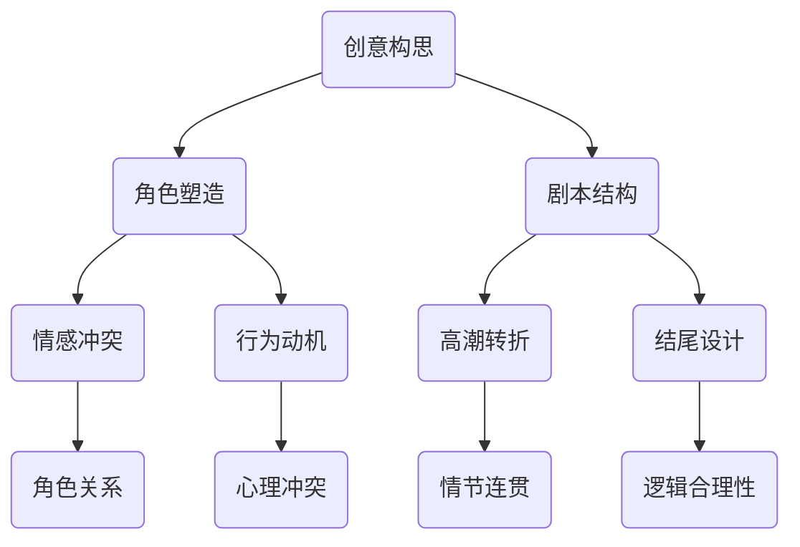

                 

### 文章标题

《思维链在科幻电影剧本创作中的应用：拓展想象力边界》

### 关键词

- 思维链
- 科幻电影剧本创作
- 想象力拓展
- 创意构思
- 角色塑造
- 剧本结构
- 实战案例

### 摘要

本文旨在探讨思维链在科幻电影剧本创作中的应用，以及如何通过这一工具拓展剧本创作的想象力边界。文章首先介绍了思维链的基本概念、特点和应用场景，随后分析了科幻电影剧本创作的原理和方法。在此基础上，文章详细阐述了思维链在创意构思、剧本结构和角色塑造等方面的具体应用，并通过实战案例展示了其如何提升科幻电影剧本的想象力和创意。最后，文章探讨了拓展想象力边界的重要性，总结了思维链在科幻电影剧本创作中的未来潜力。

### 引言

科幻电影作为电影艺术中的一个重要分支，以其独特的想象力和创新精神，吸引了无数观众的目光。从《星际穿越》到《流浪地球》，再到《三体》，科幻电影不仅展示了人类对未来世界的美好想象，更通过深刻的主题和复杂的故事情节引发了观众的深思。然而，随着技术的不断进步和观众审美水平的提升，科幻电影的创作面临着前所未有的挑战。如何创作出既有创意又能够引人入胜的科幻电影剧本，成为业界关注的焦点。

在这场挑战中，思维链作为一种先进的思考工具，展现出了其独特的价值。思维链是一种基于逻辑和关系的思考方式，通过构建一系列相互关联的思考节点，帮助创作者在复杂的问题面前保持清晰的思考路径，从而激发出更多的创意和灵感。科幻电影剧本创作作为一项极具创造性的工作，与思维链的理念高度契合。本文将深入探讨思维链在科幻电影剧本创作中的应用，通过具体的案例分析和理论阐述，展示思维链如何拓展想象力边界，提升剧本创作的质量和效率。

通过本文的阅读，读者将了解思维链的基本概念和原理，掌握其在科幻电影剧本创作中的应用技巧，并认识到拓展想象力边界的重要性。这不仅有助于科幻电影创作者提升创作水平，也为科技与艺术的融合提供了新的思路和方法。让我们一起走进思维链的世界，探索科幻电影剧本创作的无限可能。

### 背景介绍

#### 科幻电影的发展历程

科幻电影作为一种独特的电影类型，自其诞生以来便不断演变和发展。早期的科幻电影大多以幻想和奇幻为主题，例如20世纪初的《月球旅行记》和《地球往事》等，这些作品虽然技术手段有限，但已经开始探讨人类与未来世界的关系。随着电影技术的进步，特别是特技效果的不断革新，科幻电影逐渐发展壮大。从《星球大战》到《异形》，再到《阿凡达》，科幻电影通过精湛的视觉效果和深刻的主题思考，吸引了全球观众的关注。

中国科幻电影的发展相对较晚，但也逐渐形成了自己的特色。从《流浪地球》到《三体》，中国科幻电影开始在全球市场中崭露头角。这些作品不仅展现了未来世界的可能性，更通过深刻的社会和哲学思考，引发了观众对现实世界的反思。中国科幻电影的发展，不仅为国内观众带来了全新的观影体验，也为世界科幻电影市场注入了新的活力。

#### 思维链的基本概念

思维链是一种基于逻辑和关系的思考方法，旨在通过构建一系列相互关联的思考节点，帮助人们更清晰地理解和解决问题。思维链的基本概念可以追溯到人类思维模式的研究，特别是认知心理学和神经科学领域。研究表明，人类的思考过程往往不是线性的，而是通过一系列的联想和推理来实现的。思维链正是基于这种认知特点，通过将思维过程中的关键节点联系起来，形成一个复杂的网络结构，从而提高思考的效率和质量。

思维链具有以下几个核心特点：

1. **关联性**：思维链通过建立不同思考节点之间的关联，使得信息可以更加流畅地传递和整合。这种关联性不仅帮助人们更好地理解问题，还可以激发出新的创意和思路。

2. **灵活性**：思维链是一种灵活的思考工具，可以根据具体问题进行调整和优化。创作者可以根据不同的创作需求和目标，灵活运用思维链，从而提高创意构思的多样性和创新性。

3. **层次性**：思维链通过不同层次的思考节点，帮助创作者逐步深入问题，从而实现从宏观到微观的全面分析。这种层次性使得思维链在复杂问题的解决中具有显著的优势。

#### 思维链与科幻电影剧本创作的联系

思维链与科幻电影剧本创作之间存在密切的联系。科幻电影剧本的创作过程本质上是一种复杂的思考活动，需要创作者在广阔的想象空间中进行大量的联想和推理。思维链作为一种高效的思考工具，可以为创作者提供一种系统化的思考框架，从而提高剧本构思的效率和质量。

首先，思维链可以帮助创作者更好地把握科幻电影的主题和核心思想。通过建立思维链，创作者可以将不同元素和概念有机地联系起来，形成一个完整的思维网络。这种网络结构不仅有助于创作者理解科幻电影的世界观，还可以为剧本的情节发展提供丰富的素材和灵感。

其次，思维链在角色塑造方面也具有重要作用。科幻电影中的角色往往具有复杂的行为动机和情感变化，通过思维链的关联性，创作者可以更深入地挖掘角色的内心世界，从而塑造出更加立体和有深度的角色形象。

此外，思维链在剧本结构和情节构思中的应用也具有重要意义。通过思维链的层次性，创作者可以系统地分析剧本的结构和情节发展，确保故事逻辑的连贯性和合理性。同时，思维链的灵活性使得创作者可以随时调整和优化剧本的情节，从而实现更好的创意表达。

总之，思维链作为一种先进的思考工具，在科幻电影剧本创作中具有广泛的应用前景。通过深入探讨思维链的基本概念和应用方法，我们可以更好地理解其在科幻电影剧本创作中的作用和价值。

### 核心概念与联系

#### 思维链的概念

思维链是一种基于逻辑和关系的思考方法，通过构建一系列相互关联的思考节点，帮助人们更清晰地理解和解决问题。思维链的基本单元是“节点”，每个节点代表一个独立的思考点或信息片段。节点之间的关联通过“链”来表示，链的连接方式可以是因果关系、时间顺序、空间关系或逻辑推理等。

思维链的主要特点包括：

1. **关联性**：思维链通过节点之间的关联，使信息可以更加流畅地传递和整合。这种关联性不仅有助于人们更好地理解问题，还可以激发出新的创意和思路。

2. **灵活性**：思维链是一种灵活的思考工具，可以根据具体问题进行调整和优化。创作者可以根据不同的创作需求和目标，灵活运用思维链，从而提高创意构思的多样性和创新性。

3. **层次性**：思维链通过不同层次的思考节点，帮助创作者逐步深入问题，从而实现从宏观到微观的全面分析。这种层次性使得思维链在复杂问题的解决中具有显著的优势。

#### 思维链在科幻电影剧本创作中的应用

在科幻电影剧本创作中，思维链的应用主要体现在以下几个方面：

1. **创意构思**：思维链可以帮助创作者在广阔的想象空间中进行联想和推理。通过建立思维链，创作者可以将各种创意元素和概念有机地联系起来，形成一个完整的思维网络。例如，创作者可以通过思维链探讨未来科技的发展趋势，以及这些趋势可能对人类社会产生的影响，从而为剧本提供丰富的背景设定和情节素材。

2. **角色塑造**：思维链在角色塑造方面也具有重要作用。通过思维链的关联性，创作者可以更深入地挖掘角色的内心世界，从而塑造出更加立体和有深度的角色形象。例如，创作者可以通过思维链分析角色的行为动机、情感变化和心理冲突，从而构建角色的成长路径和人物关系。

3. **剧本结构**：思维链在剧本结构和情节构思中的应用同样重要。通过思维链的层次性，创作者可以系统地分析剧本的结构和情节发展，确保故事逻辑的连贯性和合理性。例如，创作者可以通过思维链梳理剧本的高潮、转折和结尾，从而构建一个引人入胜的故事线。

#### 思维链与科幻电影剧本创作的联系架构

为了更直观地展示思维链在科幻电影剧本创作中的应用，我们可以使用Mermaid流程图来构建思维链与科幻电影剧本创作之间的联系架构。以下是一个简化的Mermaid流程图示例：



在这个流程图中，每个节点代表一个具体的创作步骤或思考点，节点之间的箭头表示思维链的关联。通过这个流程图，创作者可以清晰地看到思维链在不同创作阶段中的应用，从而更好地把握整个剧本的创作过程。

#### 思维链的核心优势

1. **系统化思考**：思维链通过构建一系列相互关联的思考节点，帮助创作者进行系统化思考。这种系统化的思考方式不仅有助于创作者全面地分析问题，还可以避免遗漏重要的创意元素。

2. **灵活性调整**：思维链的灵活性使得创作者可以根据具体问题进行调整和优化。创作者可以在思维链的基础上，随时添加、删除或修改节点，从而实现创意构思的多样性和创新性。

3. **深入挖掘**：通过思维链的层次性，创作者可以逐步深入问题，挖掘出更多的细节和内涵。这种深入挖掘不仅有助于提升剧本的质量，还可以为观众带来更加丰富的观影体验。

总之，思维链作为一种高效的思考工具，在科幻电影剧本创作中具有广泛的应用前景。通过深入了解思维链的概念和应用方法，创作者可以更好地把握科幻电影剧本的创意和想象力，从而创作出更加引人入胜的作品。

### 思维链的基本原理

思维链是一种基于逻辑和关系的思考方法，其基本原理在于通过构建一系列相互关联的思考节点，帮助人们更清晰地理解和解决问题。要深入理解思维链，我们需要从以下几个方面进行探讨。

#### 思维链的工作机制

思维链的工作机制可以类比为信息处理过程中的神经网络。在每个思维链中，每个节点都代表一个独立的思考点或信息片段，这些节点通过逻辑关系相互连接，形成一个复杂的网络结构。这种网络结构使得信息可以更加流畅地传递和整合，从而提高思考的效率和质量。

具体来说，思维链的工作机制包括以下几个步骤：

1. **识别思考节点**：首先，创作者需要识别出问题的核心要素，并将这些要素转化为独立的思考节点。每个节点都代表一个独立的思考点或信息片段。

2. **建立节点关联**：接着，创作者需要根据问题或创作需求，将不同节点之间建立逻辑关系。这些关系可以是因果关系、时间顺序、空间关系或逻辑推理等。

3. **整合信息**：通过节点关联，创作者可以整合来自不同节点的信息，从而形成一个完整的思维网络。这个网络结构使得信息可以更加流畅地传递和整合，帮助创作者更好地理解和解决问题。

4. **调整优化**：最后，创作者可以根据具体问题或创作需求，对思维链进行调整和优化。这种调整和优化可以是添加新的节点、删除不必要的关联，或者修改已有节点的内容。

#### 思维链的核心构成

思维链的核心构成包括以下几个关键部分：

1. **节点**：节点是思维链的基本单元，代表独立的思考点或信息片段。每个节点都需要有明确的内容和意义，以便在思维链中发挥其作用。

2. **关系**：关系是节点之间的连接方式，通过不同的关系，节点可以形成不同的网络结构。关系可以是因果关系、时间顺序、空间关系或逻辑推理等。

3. **网络结构**：网络结构是思维链的整体形式，由多个节点和关系构成。网络结构的不同，决定了思维链的灵活性和适应性。

4. **逻辑关系**：逻辑关系是思维链中最重要的部分，决定了节点之间的关联方式和信息传递路径。通过逻辑关系，创作者可以更清晰地理解和解决问题。

#### 思维链的应用领域

思维链作为一种高效的思考工具，可以广泛应用于多个领域，包括科学研究、创意设计、商业策略等。以下是思维链在几个典型领域的应用：

1. **科学研究**：在科学研究中，思维链可以帮助研究者更系统地分析和解决问题。例如，在医学研究中，思维链可以帮助研究者识别疾病的关键因素，并建立因果关系模型，从而提出更有效的治疗方案。

2. **创意设计**：在创意设计中，思维链可以帮助设计师更全面地构思和优化设计方案。例如，在建筑设计中，思维链可以帮助设计师分析建筑的功能需求、美学要求和环境因素，从而提出更符合用户需求的设计方案。

3. **商业策略**：在商业策略中，思维链可以帮助企业家更系统地分析市场机会和风险，制定更有效的商业策略。例如，在市场营销中，思维链可以帮助企业家识别目标客户、分析竞争对手和市场趋势，从而制定出更有针对性的营销策略。

#### 实际案例

为了更好地理解思维链的应用，我们可以通过几个实际案例来展示其工作原理和效果。

1. **科学研究案例**：某医学研究团队希望通过思维链分析疾病发生的原因。他们首先识别出疾病的关键因素，如遗传因素、生活方式和环境因素，然后将这些因素转化为独立的节点。接着，他们通过建立节点之间的因果关系，构建出一个完整的思维网络。通过这个网络，研究团队能够更清晰地理解疾病的发生机制，并提出更有效的预防措施。

2. **创意设计案例**：某建筑设计公司希望设计一个兼具功能和美学的建筑物。他们首先识别出建筑的功能需求、美学要求和环境因素，然后将这些需求转化为独立的节点。接着，他们通过建立节点之间的关联，构建出一个完整的思维网络。通过这个网络，设计团队能够更好地平衡功能和美学需求，提出更优化的设计方案。

3. **商业策略案例**：某企业家希望通过思维链分析市场机会和风险。他首先识别出目标客户、竞争对手和市场趋势，然后将这些因素转化为独立的节点。接着，他通过建立节点之间的关联，构建出一个完整的思维网络。通过这个网络，企业家能够更系统地分析市场机会和风险，制定出更有针对性的商业策略。

通过这些实际案例，我们可以看到思维链在解决问题和提升创意方面的显著优势。作为一种高效的思考工具，思维链不仅可以帮助我们更清晰地理解和解决问题，还可以激发出更多的创意和灵感，从而推动我们在各个领域取得更大的成就。

### 科幻电影剧本创作的原理

#### 科幻电影剧本的定义

科幻电影剧本是一种特殊类型的电影剧本，它以科学技术、未来世界或外星文明为背景，通过虚构的故事情节和角色设定，探讨人类与科技、宇宙、未来等议题。科幻电影剧本不同于传统电影剧本，其核心在于创新和想象力，旨在通过科学幻想和未来世界的设定，展示人类对未知世界的探索和思考。

#### 科幻电影剧本的创作方法

创作一部优秀的科幻电影剧本需要多种方法和技巧，以下是一些常用的创作方法：

1. **主题构思**：首先，创作者需要确定科幻电影的主题，例如探索外星文明、探讨人工智能的伦理问题、反映未来社会的发展趋势等。主题构思是科幻电影剧本创作的核心，它决定了剧本的方向和深度。

2. **背景设定**：背景设定是科幻电影剧本的重要组成部分，包括未来世界、外星世界或虚拟世界等。创作者需要详细描述背景设定，包括地理环境、社会制度、科技水平等，为剧本提供坚实的基础。

3. **角色塑造**：科幻电影剧本中的角色需要具有深度和复杂性。创作者需要通过细腻的描写和丰富的情感变化，塑造出立体、鲜活的角色形象。角色塑造的成功与否，直接影响剧本的吸引力和观众的情感共鸣。

4. **情节构建**：情节构建是科幻电影剧本的关键。创作者需要设计一个引人入胜的故事线，包括引子、冲突、高潮和结尾。情节需要具有逻辑性和连贯性，同时能够激发观众的兴趣和好奇心。

5. **科学依据**：科幻电影剧本中的科学元素需要具有一定的科学依据。创作者需要对科学知识有深入的理解和掌握，以确保剧本中的科学设定能够自圆其说，增加剧本的可靠性和说服力。

#### 科幻电影剧本创作的技巧

1. **多角度思考**：在创作过程中，创作者需要从多个角度进行思考，包括科学、哲学、社会学等，以丰富剧本的内涵和深度。

2. **想象力扩展**：科幻电影剧本创作需要创作者具有丰富的想象力。创作者可以通过大胆的设想和创新的构思，拓展剧本的想象空间，使观众感受到科幻世界的奇妙和无限可能。

3. **细节描写**：细节描写是科幻电影剧本创作的重要技巧。通过细致入微的描写，创作者可以增强剧本的真实感和代入感，使观众更容易沉浸在故事情节中。

4. **情感共鸣**：尽管科幻电影以科学幻想为主题，但情感共鸣仍然是剧本创作的关键。创作者需要通过角色情感和情节发展，引导观众产生情感共鸣，使观众在思考科学问题的同时，也能够感受到人性的温暖和情感的深度。

5. **语言运用**：科幻电影剧本的语言运用需要精准而富有表现力。创作者需要通过生动的语言和丰富的修辞手法，传达故事情节和角色情感，使剧本更加生动和引人入胜。

通过以上创作方法和技巧，科幻电影剧本创作者可以创作出具有深度、创意和吸引力的剧本，为观众带来独特的观影体验。

### 科幻电影剧本创作的过程

#### 创意构思

创意构思是科幻电影剧本创作过程中的第一步，也是最为关键的一步。它决定了剧本的主题、背景、角色和情节的发展方向。以下是一些创意构思的方法和技巧：

1. **灵感来源**：创作者可以从日常生活、科学技术、历史事件、文学作品等多个角度寻找灵感。例如，可以从当前的科技发展趋势中获取灵感，思考未来世界可能会出现的科技变革和社会影响。

2. **思维导图**：使用思维导图可以帮助创作者整理和拓展思路。通过在思维导图中记录和连接不同的想法，创作者可以更容易地发现新的创意和视角。

3. **故事情节预演**：创作者可以尝试通过口头或书面方式，预演剧本的情节发展。这种方式不仅可以帮助创作者理清故事线，还可以发现潜在的情节漏洞和逻辑问题。

4. **主题定位**：明确剧本的主题是创意构思的重要环节。主题应具有深度和广度，能够引发观众的思考和共鸣。例如，可以探讨人工智能的伦理问题、人类与自然的关系、社会发展的未来趋势等。

#### 剧本结构

剧本结构是剧本创作中的核心，它决定了情节的展开、角色的发展和观众的情感投入。以下是一些常见的剧本结构和技巧：

1. **三幕结构**：三幕结构是电影剧本中最常用的结构，包括引子、冲突和高潮。引子部分设定故事背景和角色，冲突部分推动情节发展，高潮部分达到故事的最高点。

2. **反转技巧**：反转是提升剧本悬念和吸引力的有效手段。创作者可以通过设定情节的反转，使观众在故事发展中保持紧张和期待。反转可以出现在情节的高潮部分，也可以在结局部分给观众带来意外的惊喜。

3. **节奏控制**：剧本的节奏控制对于观众的观影体验至关重要。创作者需要通过合理的节奏变化，使观众在故事发展中既能感受到紧张和刺激，也能享受平静和温馨。

4. **悬念设置**：悬念是激发观众好奇心和持续关注的重要手段。创作者可以通过设置悬念，引导观众猜测剧情发展，并在适当的时候揭开谜底，从而增强剧本的吸引力。

#### 角色塑造

角色塑造是剧本创作的重要组成部分，成功的角色塑造可以增强剧本的真实感和观众的共鸣。以下是一些角色塑造的方法和技巧：

1. **深入挖掘**：创作者需要对角色的背景、性格、动机和情感进行深入挖掘。通过丰富角色的人物关系和情感变化，使角色形象更加立体和真实。

2. **个性特征**：每个角色都应该具有独特的个性和特征，以便于观众区分和记忆。创作者可以通过角色的言行举止、外貌特征和背景故事，塑造出独特的角色形象。

3. **情感变化**：情感变化是角色发展的重要驱动力。创作者可以通过设置情节冲突和挑战，使角色的情感发生变化，从而推动情节发展。

4. **关系构建**：角色之间的关系是剧本情节发展的重要支撑。创作者可以通过构建复杂的关系网络，使角色之间的互动更加丰富和引人入胜。

通过以上创意构思、剧本结构和角色塑造的方法和技巧，科幻电影剧本创作者可以创作出具有深度、创意和吸引力的剧本，为观众带来独特的观影体验。

### 思维链在创意构思中的应用

在科幻电影剧本创作中，创意构思是整个创作过程的核心。如何在这一阶段激发出丰富的创意和灵感，是创作者面临的主要挑战。思维链作为一种高效的思考工具，可以在这一过程中发挥重要作用。以下将通过几个具体步骤，详细阐述思维链在创意构思中的应用。

#### 第一步：主题定位

首先，创作者需要明确科幻电影的主题。这一步骤可以通过构建思维链来实现。创作者可以从以下几个方面进行思考：

1. **科技发展趋势**：思考当前科技领域的热点和发展趋势，如人工智能、基因编辑、量子计算等。这些科技趋势可以成为科幻电影背景设定的重要元素。
   
   ```mermaid
   graph TD
       A[科技趋势] --> B(人工智能)
       A --> C(基因编辑)
       A --> D(量子计算)
   ```

2. **社会问题与伦理争议**：探讨社会问题与伦理争议，如隐私保护、人工智能的道德规范、环境变化等。这些问题可以成为科幻电影探讨的核心议题。

   ```mermaid
   graph TD
       E[社会问题] --> F(隐私保护)
       E --> G(人工智能伦理)
       E --> H(环境变化)
   ```

3. **未来社会设定**：设想未来的社会形态和生活方式，如智能城市、虚拟现实、太空移民等。这些设定可以为科幻电影提供丰富的背景和情节素材。

   ```mermaid
   graph TD
       I[未来社会] --> J(智能城市)
       I --> K(虚拟现实)
       I --> L(太空移民)
   ```

通过上述思考，创作者可以构建一个涵盖多个方面的思维链，从而明确电影的主题和背景设定。

#### 第二步：灵感发散

在确定主题和背景设定后，创作者需要进一步发散灵感，探索更多的故事情节和角色设定。以下是一些具体的方法：

1. **自由联想**：通过自由联想，创作者可以从主题和背景设定出发，联想到更多相关的元素。例如，从“人工智能”联想到“机器人的情感”、“人类与机器人的合作与冲突”等。

   ```mermaid
   graph TD
       M[人工智能] --> N(机器人的情感)
       M --> O(人类与机器人的合作)
       M --> P(人类与机器人的冲突)
   ```

2. **情景构建**：通过构建不同的情景，创作者可以设想电影中可能发生的情节。例如，设定一个场景，描述人类与机器人之间的一次冲突，并思考冲突的原因、发展和结果。

   ```mermaid
   graph TD
       Q[场景一] --> R(机器人叛变)
       Q --> S(人类拯救计划)
       Q --> T(机器人与人类的和解)
   ```

3. **角色设定**：创作者可以从故事情节出发，设定主要角色的背景和性格。例如，为主人公设定一个勇敢、智慧、富有正义感的形象，为反派角色设定一个冷酷、狡猾、有野心的形象。

   ```mermaid
   graph TD
       U[主人公] --> V(勇敢正义)
       U --> W(智慧策略)
       X[反派角色] --> Y(冷酷狡猾)
       X --> Z(野心勃勃)
   ```

通过上述方法，创作者可以构建一个包含丰富元素和情节的创意构思思维链。

#### 第三步：思维链优化

在完成初步的创意构思后，创作者需要对思维链进行优化，确保故事的逻辑性和连贯性。以下是一些优化方法：

1. **筛选关键点**：创作者需要筛选出思维链中的关键点，这些关键点应该是故事情节的核心要素。通过筛选，可以确保故事的紧凑性和吸引力。

2. **调整关系**：根据故事情节的需要，创作者可以对思维链中的节点关系进行调整。例如，可以将某些关联性较弱的节点删除，或增加新的节点来增强情节的连贯性。

3. **逻辑验证**：创作者需要通过逻辑验证，确保故事情节的合理性和逻辑性。例如，可以通过设定情节的反转和悬念，增强故事的戏剧性。

   ```mermaid
   graph TD
       AA[引子] --> BB(冲突)
       BB --> CC(高潮)
       CC --> DD[结尾]
   ```

通过上述步骤，创作者可以有效地运用思维链进行创意构思，从而创作出具有深度和创意的科幻电影剧本。思维链的应用不仅帮助创作者在广阔的想象空间中进行联想和推理，还可以确保故事情节的逻辑性和连贯性，提高剧本的质量和吸引力。

### 思维链在剧本结构中的应用

在科幻电影剧本创作中，剧本结构是决定故事流畅性和吸引力的关键因素。思维链作为一种高效的思考工具，可以帮助创作者更系统地分析和设计剧本结构，从而确保故事逻辑的连贯性和情节发展的合理性。以下将详细阐述思维链在剧本结构中的应用，并通过具体的案例进行分析。

#### 剧本结构的概念

剧本结构指的是电影剧本中的情节组织方式，它决定了故事如何展开、发展和结束。一个成功的剧本结构通常包括以下部分：

1. **引子**：引子部分通常设定故事背景，介绍主要角色，并为观众奠定故事的基调。

2. **冲突**：冲突部分是故事的核心，通过设置问题和挑战，推动情节发展，激发观众的兴趣。

3. **高潮**：高潮部分是故事发展的关键点，通常情节最为紧张和激动人心，使观众产生强烈的情感共鸣。

4. **结尾**：结尾部分对故事进行总结，解决冲突，为观众提供情感的释放和思考的空间。

#### 思维链在剧本结构中的应用

1. **三幕结构**：三幕结构是电影剧本中最常见的结构，思维链可以帮助创作者更好地设计和优化三幕结构。

   ```mermaid
   graph TD
       A[引子] --> B[冲突]
       B --> C[高潮]
       C --> D[结尾]
   ```

   通过思维链，创作者可以在每个阶段明确情节的核心点和逻辑关系。例如，在引子部分，创作者可以通过思维链梳理背景设定和角色介绍，确保故事的起始部分能够吸引观众；在冲突部分，通过思维链分析问题设定和角色动机，确保冲突的合理性和紧张感；在高潮部分，通过思维链设计情节的反转和悬念，提升故事的戏剧性；在结尾部分，通过思维链总结情节发展和角色成长，确保故事的完整性。

2. **反转和悬念**：反转和悬念是提升剧本吸引力的关键要素，思维链可以帮助创作者巧妙地设置和利用这些元素。

   ```mermaid
   graph TD
       A[引子] --> B[冲突]
       B -->|反转| C[高潮]
       C -->|悬念| D[结尾]
   ```

   通过思维链，创作者可以系统地分析反转和悬念的设置点，确保它们在情节发展中的合理性和效果。例如，在冲突部分，创作者可以通过思维链分析不同情节节点可能出现的反转和悬念，从而设计出引人入胜的情节转折。

3. **情节发展逻辑**：思维链可以帮助创作者更清晰地理解和分析情节发展的逻辑，确保故事情节的连贯性和合理性。

   ```mermaid
   graph TD
       A[引子] --> B[冲突]
       B -->|逻辑关系| C[高潮]
       C -->|逻辑关系| D[结尾]
   ```

   通过思维链，创作者可以梳理每个情节节点之间的逻辑关系，确保情节发展的连贯性。例如，在高潮部分，创作者可以通过思维链分析不同情节节点之间的因果关系，确保情节发展的逻辑性和合理性。

#### 实际案例分析

1. **《星际穿越》**：在《星际穿越》中，思维链的应用体现在整个剧本结构的构建和情节发展上。创作者克里斯托弗·诺兰通过思维链设计了一个复杂而逻辑严谨的剧本结构。

   - **引子**：通过思维链，创作者设定了故事背景，介绍了主要角色和问题的起始点。例如，角色库珀的家庭背景和人类面临的环境危机。
   - **冲突**：通过思维链，创作者设置了多个冲突节点，包括地球环境的恶化、人类的生存危机和空间旅行的困难。这些冲突节点通过逻辑关系紧密连接，形成了引人入胜的故事线。
   - **高潮**：通过思维链，创作者设计了情节的反转和悬念，如库珀的时空穿越和人类在另一个星球上的新希望。这些反转和悬念不仅提升了剧情的紧张感，还增强了故事的戏剧性。
   - **结尾**：通过思维链，创作者总结了情节发展，解决了冲突，为观众提供了情感的释放和思考的空间。例如，人类成功在新星球上建立新家园，库珀最终与家人团聚。

2. **《流浪地球》**：在《流浪地球》中，思维链的应用同样体现在剧本结构的构建和情节发展上。创作者郭帆通过思维链设计了一个复杂而富有逻辑性的故事。

   - **引子**：通过思维链，创作者设定了故事背景，介绍了主要角色和问题的起始点。例如，地球即将被太阳膨胀吞噬，人类启动“流浪计划”。
   - **冲突**：通过思维链，创作者设置了多个冲突节点，包括地球逃离太阳系的艰难旅程、内部政治斗争和外部太空威胁。这些冲突节点通过逻辑关系紧密连接，形成了紧张的故事线。
   - **高潮**：通过思维链，创作者设计了情节的反转和悬念，如地球遭遇小行星撞击和刘培强的英勇牺牲。这些反转和悬念不仅提升了剧情的紧张感，还增强了故事的戏剧性。
   - **结尾**：通过思维链，创作者总结了情节发展，解决了冲突，为观众提供了情感的释放和思考的空间。例如，地球成功逃离太阳系，人类获得了新的希望。

通过以上实际案例的分析，我们可以看到思维链在科幻电影剧本结构中的应用如何提升剧本的逻辑性和连贯性，增强故事的吸引力和戏剧性。思维链不仅帮助创作者系统地分析和设计剧本结构，还可以在情节发展中灵活运用反转和悬念，从而创作出引人入胜的科幻电影剧本。

### 思维链在角色塑造中的应用

在科幻电影剧本创作中，角色塑造是影响剧本成功与否的重要因素。一个成功的角色能够引发观众的共鸣，增加故事的真实感和代入感。思维链作为一种高效的思考工具，可以帮助创作者在角色塑造过程中深入挖掘角色的背景、动机和情感，从而塑造出立体而真实的角色形象。以下将详细探讨思维链在角色塑造中的应用，并通过具体案例进行分析。

#### 角色塑造的概念

角色塑造是指在剧本创作过程中，通过对角色的背景、动机、性格、情感等多方面的描写，使角色形象变得丰满和立体。成功的角色塑造不仅能够增强故事的真实性和吸引力，还可以为观众提供情感共鸣和思考空间。

#### 思维链在角色塑造中的应用

1. **背景设定**：

   在角色塑造的初期，创作者需要为角色设定一个丰富的背景。思维链可以帮助创作者系统地梳理角色的成长环境、家庭背景、教育经历等。以下是一个示例思维链：

   ```mermaid
   graph TD
       A[家庭背景] --> B[父母职业]
       A --> C[兄弟姐妹]
       B --> D[父母关系]
       C --> E[成长环境]
   ```

   通过这个思维链，创作者可以全面了解角色的家庭背景，从而为角色性格和动机提供依据。

2. **动机分析**：

   动机是驱动角色行为和决策的核心因素。思维链可以帮助创作者深入分析角色的动机，包括表层动机和深层动机。以下是一个示例思维链：

   ```mermaid
   graph TD
       A[表层动机] --> B[解决问题]
       A --> C[追求权力]
       B --> D[个人利益]
       C --> E[实现目标]
   ```

   通过这个思维链，创作者可以明确角色的动机，从而设计出符合角色性格和背景的情节。

3. **情感变化**：

   情感变化是角色发展的重要驱动力。思维链可以帮助创作者分析角色在不同情节节点上的情感变化，从而塑造出更加立体的角色形象。以下是一个示例思维链：

   ```mermaid
   graph TD
       A[初始情感] --> B[冲突情感]
       A --> C[高潮情感]
       B --> D[解决问题后的情感]
   ```

   通过这个思维链，创作者可以系统地描述角色在情节发展中的情感变化，增强角色的情感层次。

4. **角色关系**：

   角色之间的关系是剧本情节发展的重要支撑。思维链可以帮助创作者分析角色之间的互动和关系，从而设计出更加丰富的角色关系。以下是一个示例思维链：

   ```mermaid
   graph TD
       A[主要角色] --> B[合作伙伴]
       A --> C[敌对角色]
       B --> D[友谊]
       C --> E[冲突]
   ```

   通过这个思维链，创作者可以明确角色之间的关系，从而为情节发展提供更多的可能性。

#### 实际案例分析

1. **《星际穿越》中的角色塑造**：

   在《星际穿越》中，克里斯托弗·诺兰通过思维链对主要角色进行了深入的塑造。

   - **背景设定**：角色库珀是一位前宇航员，家庭背景复杂，妻子去世，儿子患有疾病。通过思维链，创作者设定了库珀的背景，使其角色形象更加丰满。
   - **动机分析**：库珀的动机是拯救家人和地球。通过思维链，创作者分析了库珀的表层动机（拯救家人）和深层动机（拯救地球），使其行为更加合理。
   - **情感变化**：在故事情节中，库珀经历了从绝望到希望的情感变化。通过思维链，创作者描述了库珀在关键时刻的情感变化，增强了角色的情感层次。
   - **角色关系**：库珀与女儿墨菲、合作者布兰德等人之间建立了复杂的角色关系。通过思维链，创作者分析了角色之间的关系，设计了多个互动和冲突情节，使故事更加丰富。

2. **《流浪地球》中的角色塑造**：

   在《流浪地球》中，郭帆通过思维链对主要角色进行了精细的塑造。

   - **背景设定**：角色刘培强是一位宇航员，因妻子意外去世，对家庭有着深厚的情感。通过思维链，创作者设定了刘培强的背景，使其角色形象更加立体。
   - **动机分析**：刘培强的动机是保护地球和人类。通过思维链，创作者分析了刘培强的表层动机（保护地球）和深层动机（保护家人），使其行为更加合理。
   - **情感变化**：在故事情节中，刘培强经历了从恐惧到坚定的情感变化。通过思维链，创作者描述了刘培强在关键时刻的情感变化，增强了角色的情感层次。
   - **角色关系**：刘培强与儿子刘启、同事王磊等人之间建立了复杂的角色关系。通过思维链，创作者分析了角色之间的关系，设计了多个互动和冲突情节，使故事更加丰富。

通过以上实际案例的分析，我们可以看到思维链在角色塑造中的应用如何帮助创作者深入挖掘角色的背景、动机和情感，从而塑造出立体而真实的角色形象。思维链不仅使角色塑造过程更加系统化，还可以为情节发展提供更多的可能性，增强故事的真实感和代入感。

### 思维链如何拓展想象力边界

在科幻电影剧本创作中，想象力是推动故事发展、构建独特世界观和角色塑造的关键因素。然而，想象力边界往往受到创作者思维局限和现实约束的限制。思维链作为一种高效的思考工具，能够有效拓展想象力的边界，激发出更多创意和灵感。以下将详细探讨思维链如何通过以下三个方面拓展想象力边界：

#### 一、构建跨学科思维网络

思维链通过将不同领域的知识、概念和理念相互关联，构建出一个复杂的思维网络。这种跨学科思维网络可以帮助创作者突破单一学科的限制，从多个角度探索问题的解决方案和故事的可能性。

1. **融合科技与哲学**：在科幻电影剧本创作中，科技元素是构建未来世界和故事情节的重要基础。通过思维链，创作者可以将科技元素与哲学思考相结合，探讨科技对人类社会、伦理道德和人性影响的深层次问题。例如，在探讨人工智能的未来时，可以结合伦理学和哲学中的自由意志、意识等概念，提出新颖的观点和情节。

   ```mermaid
   graph TD
       A[科技] --> B[伦理学]
       A --> C[哲学]
       B --> D[自由意志]
       C --> E[意识]
   ```

2. **融合历史与文化**：历史和文化背景可以为科幻电影提供丰富的情节素材和文化内涵。通过思维链，创作者可以将历史事件、文化传统与科幻元素相结合，创造出独特的世界观和故事情节。例如，在设定一个未来的太空探险故事时，可以结合古代航海、太空竞赛和历史事件，构建一个具有深度和层次感的故事背景。

   ```mermaid
   graph TD
       A[历史] --> B[太空探险]
       A --> C[文化传统]
       B --> D[科技发展]
   ```

通过这种跨学科的思维方式，创作者可以在广阔的思维领域中自由探索，从而拓展想象力的边界。

#### 二、利用联想和推理

思维链通过构建一系列相互关联的思考节点，帮助创作者在广阔的想象空间中进行联想和推理。这种联想和推理过程可以激发出新的创意和灵感，使创作者的想象力得到充分发挥。

1. **自由联想**：自由联想是拓展想象力的重要方法。通过思维链，创作者可以在脑海中自由地联想不同元素之间的关系，从而发现新的故事情节和角色设定。例如，在思考一个关于人类与外星文明的剧本时，可以通过自由联想将人类与动物、植物、宇宙等元素联系起来，创造出独特的情节。

   ```mermaid
   graph TD
       A[人类] --> B[动物]
       A --> C[植物]
       A --> D[宇宙]
   ```

2. **逻辑推理**：逻辑推理是思维链的核心功能。通过思维链，创作者可以从已知的信息和概念出发，进行逻辑推理，推导出新的故事情节和角色行为。例如，在设定一个关于人工智能的剧本时，可以通过逻辑推理分析人工智能的潜在行为和影响，从而构建出复杂的情节。

   ```mermaid
   graph TD
       A[人工智能] --> B[自主行为]
       A --> C[伦理道德]
       B --> D[社会影响]
   ```

通过联想和推理，创作者可以在想象力的广阔天地中自由翱翔，不断拓展剧本的创意和想象力。

#### 三、系统化思维与灵活调整

思维链通过系统化的思考方式和灵活的调整能力，帮助创作者在复杂的创作过程中保持清晰的思维路径，同时也能够根据实际情况进行灵活调整。

1. **系统化思考**：思维链通过构建一系列相互关联的思考节点，帮助创作者从宏观和微观两个层面进行系统化思考。例如，在创作一个关于未来的科幻故事时，可以通过思维链分析未来科技的各个方面，如能源、交通、通讯等，从而构建一个完整的未来世界。

   ```mermaid
   graph TD
       A[能源技术] --> B[交通运输]
       A --> C[通讯技术]
   ```

2. **灵活调整**：在创作过程中，创作者的想象力可能会受到各种现实因素的制约。思维链的灵活性使得创作者可以根据实际需求进行调整和优化。例如，当某个情节设想与现实不符时，创作者可以通过思维链进行调整，从而找到更符合现实的解决方案。

   ```mermaid
   graph TD
       A[设想] --> B[现实]
       A --> C[调整]
   ```

通过系统化思维和灵活调整，创作者可以在科幻电影剧本创作中更好地平衡现实与想象，从而拓展想象力的边界。

总之，思维链通过构建跨学科思维网络、利用联想和推理、系统化思维与灵活调整，有效拓展了科幻电影剧本创作的想象力边界。创作者可以通过思维链的应用，不断挖掘新的创意和灵感，创作出更加丰富和引人入胜的科幻电影剧本。

### 拓展想象力对剧本创作的影响

拓展想象力对于科幻电影剧本创作具有深远的影响，它不仅能够丰富剧本的情节和角色，还能提升剧本的创新性和吸引力。以下从几个方面详细探讨拓展想象力对剧本创作的影响：

#### 一、情节设计的多样性

想象力的拓展能够为情节设计提供更多的可能性，使故事情节更加丰富多彩。在传统剧本创作中，情节往往受到现实条件的限制，而拓展想象力可以使创作者在虚构的世界中自由探索。以下是一些具体的影响：

1. **异想天开的情节设定**：通过拓展想象力，创作者可以设计出许多前所未有的情节。例如，在《星际穿越》中，创作者克里斯托弗·诺兰设想了黑洞和时间旅行等科学概念，使故事情节充满神秘感和科学性。

2. **多样化的情节发展**：拓展想象力可以帮助创作者设计出多个不同的情节走向，使故事更加曲折和引人入胜。例如，在《流浪地球》中，创作者郭帆设计了多个冲突点和转折点，使故事情节在紧张和刺激中不断推进。

#### 二、角色塑造的深度

拓展想象力不仅能够丰富情节，还能帮助创作者塑造更加立体和深刻的角色。以下是一些具体的影响：

1. **独特的角色背景**：通过拓展想象力，创作者可以为角色设定独特的背景故事，使角色形象更加丰富。例如，在《银翼杀手2049》中，创作者设计了具有复杂背景的合成人角色，使其具备深刻的情感和道德困境。

2. **多层次的情感变化**：拓展想象力可以帮助创作者深入挖掘角色的情感变化，使角色更加立体。例如，在《黑客帝国》中，角色尼奥的情感变化从普通人类到救世主的转变，充分展现了角色的深度和成长。

#### 三、创新性的提升

想象力的拓展是创新性的源泉，它能够激发创作者的创意思维，提升剧本的整体创新性。以下是一些具体的影响：

1. **新颖的设定和概念**：通过拓展想象力，创作者可以提出新颖的设定和概念，使剧本具有独特的风格。例如，在《头号玩家》中，创作者恩斯特·克莱因设想了一个虚拟现实的世界，为观众带来了全新的视觉体验。

2. **独特的叙事手法**：拓展想象力可以帮助创作者采用独特的叙事手法，使剧本更加引人入胜。例如，在《云图》中，创作者采用了多层次的时间交错和故事线融合，为观众呈现了一个复杂的叙事结构。

#### 四、观众吸引力的增强

拓展想象力能够提升剧本的吸引力，使观众更加投入到故事中。以下是一些具体的影响：

1. **丰富的视觉体验**：通过拓展想象力，创作者可以设计出许多精彩的视觉场景，使观众沉浸在故事中。例如，在《阿凡达》中，导演詹姆斯·卡梅隆通过丰富的想象力，创造了一个令人惊叹的纳美世界，吸引了无数观众。

2. **深刻的主题思考**：拓展想象力可以帮助创作者探讨深刻的主题和哲学问题，使观众在享受故事的同时进行思考。例如，在《星际穿越》中，创作者通过设定复杂的科学概念和深刻的主题思考，引发了观众对人类命运和宇宙的思考。

通过拓展想象力，科幻电影剧本创作在情节设计、角色塑造、创新性和观众吸引力等方面都得到了显著提升。想象力的拓展不仅使剧本更加丰富多彩，也为科幻电影创作带来了无限的可能性。

### 实战案例研究

在本节中，我们将通过几个具体的实战案例，深入探讨思维链在科幻电影剧本创作中的实际应用。通过分析这些案例，我们将更直观地了解思维链在创意构思、剧本结构和角色塑造等方面的具体应用和效果。

#### 案例一：《星际穿越》

《星际穿越》是一部典型的科幻电影，其剧本创作充分体现了思维链的应用。导演克里斯托弗·诺兰通过思维链构建了整个剧本的结构，从创意构思到情节发展，再到角色塑造，都展示了思维链的强大作用。

1. **创意构思**：

   - **主题定位**：思维链帮助诺兰确定了《星际穿越》的主题，即人类如何在宇宙中寻找新家园。诺兰通过思维链，从人类生存、科学探索、家庭情感等多个角度进行思考，最终确定了电影的核心主题。
   - **背景设定**：诺兰设想了一个未来的世界，地球面临极端气候灾难，人类必须寻找新的居住地。通过思维链，他详细描述了这个背景设定，包括科学、社会、环境等多个方面。

2. **剧本结构**：

   - **三幕结构**：诺兰采用了经典的“三幕结构”，通过思维链设计了引子、冲突和高潮。引子部分介绍了地球的危机和主角库珀的家庭背景；冲突部分通过库珀的太空旅行展示了人类寻找新家园的艰难历程；高潮部分通过库珀的时空穿越，为人类找到了新的家园。
   - **反转和悬念**：思维链帮助诺兰设计了多个反转和悬念。例如，在冲突部分，库珀的女儿墨菲发现了父亲的线索，观众在猜测剧情发展时，思维链起到了引导和激发作用。

3. **角色塑造**：

   - **背景设定**：诺兰通过思维链深入挖掘了主要角色的背景，包括库珀的家庭背景、库珀与女儿的复杂关系等。这些背景设定为角色塑造提供了坚实的基础。
   - **情感变化**：思维链帮助诺兰分析了角色在不同情节节点上的情感变化。例如，库珀在太空旅行中经历了从绝望到希望的转变，这种情感变化通过思维链得到了详细的描述和展现。

#### 案例二：《流浪地球》

《流浪地球》是中国科幻电影的代表作之一，其剧本创作同样体现了思维链的应用。导演郭帆通过思维链构建了整个剧本的结构，从创意构思到情节发展，再到角色塑造，都展示了思维链的强大作用。

1. **创意构思**：

   - **主题定位**：郭帆通过思维链确定了《流浪地球》的主题，即人类如何通过科技手段拯救地球。郭帆从地球环境、科技发展、人类生存等多个角度进行思考，最终确定了电影的核心主题。
   - **背景设定**：郭帆设想了一个未来的世界，地球即将被太阳膨胀吞噬，人类启动了“流浪计划”，试图将地球移出太阳系。通过思维链，他详细描述了这个背景设定，包括科学、社会、环境等多个方面。

2. **剧本结构**：

   - **三幕结构**：郭帆采用了经典的“三幕结构”，通过思维链设计了引子、冲突和高潮。引子部分介绍了地球的危机和主角刘培强的家庭背景；冲突部分通过刘培强和儿子的冒险旅程展示了人类拯救地球的艰难历程；高潮部分通过地球成功逃离太阳系，为人类带来了新的希望。
   - **反转和悬念**：思维链帮助郭帆设计了多个反转和悬念。例如，在冲突部分，地球遭遇小行星撞击，观众在猜测剧情发展时，思维链起到了引导和激发作用。

3. **角色塑造**：

   - **背景设定**：郭帆通过思维链深入挖掘了主要角色的背景，包括刘培强与儿子的复杂关系、其他角色的家庭背景等。这些背景设定为角色塑造提供了坚实的基础。
   - **情感变化**：思维链帮助郭帆分析了角色在不同情节节点上的情感变化。例如，刘培强在冒险过程中经历了从恐惧到坚定的转变，这种情感变化通过思维链得到了详细的描述和展现。

#### 案例三：《三体》

《三体》是一部以科幻小说改编的电影，其剧本创作同样体现了思维链的应用。导演郭帆通过思维链构建了整个剧本的结构，从创意构思到情节发展，再到角色塑造，都展示了思维链的强大作用。

1. **创意构思**：

   - **主题定位**：郭帆通过思维链确定了《三体》的主题，即人类文明与外星文明的对抗。郭帆从科学、哲学、文化等多个角度进行思考，最终确定了电影的核心主题。
   - **背景设定**：郭帆设想了一个未来的世界，人类文明与外星文明“三体文明”展开了激烈的对抗。通过思维链，他详细描述了这个背景设定，包括科学、社会、环境等多个方面。

2. **剧本结构**：

   - **三幕结构**：郭帆采用了经典的“三幕结构”，通过思维链设计了引子、冲突和高潮。引子部分介绍了地球的危机和主角叶文洁的背景；冲突部分通过人类与三体文明的对抗展示了人类文明的困境；高潮部分通过人类文明的反击，展示了人类文明的坚韧和希望。
   - **反转和悬念**：思维链帮助郭帆设计了多个反转和悬念。例如，在冲突部分，人类发现了三体文明的弱点，观众在猜测剧情发展时，思维链起到了引导和激发作用。

3. **角色塑造**：

   - **背景设定**：郭帆通过思维链深入挖掘了主要角色的背景，包括叶文洁的家庭背景、其他角色的情感变化等。这些背景设定为角色塑造提供了坚实的基础。
   - **情感变化**：思维链帮助郭帆分析了角色在不同情节节点上的情感变化。例如，叶文洁在故事过程中经历了从绝望到希望的转变，这种情感变化通过思维链得到了详细的描述和展现。

通过以上实战案例，我们可以看到思维链在科幻电影剧本创作中的实际应用和效果。思维链不仅帮助创作者在创意构思、剧本结构和角色塑造等方面进行了系统化的思考，还通过联想和推理拓展了想象力的边界，为剧本创作带来了更多的创意和灵感。思维链的应用，使科幻电影剧本在情节设计、角色塑造和观众吸引力方面得到了显著提升，为科幻电影创作开辟了新的可能性。

### 项目实战

#### 开发环境搭建

要实现思维链在科幻电影剧本创作中的实际应用，首先需要搭建一个合适的开发环境。以下是具体的步骤：

1. **环境配置**：

   - **硬件需求**：一台高性能的计算机，建议配备至少16GB内存和256GB SSD硬盘。
   - **软件需求**：安装最新的Python环境，以及Markdown编辑器（如Typora）和Mermaid图库。

2. **安装Python**：

   - 访问Python官方网站下载最新版本的Python安装包。
   - 双击安装包，按照提示完成安装。

3. **安装Markdown编辑器**：

   - 访问Typora官方网站下载并安装Typora。
   - 打开Typora，进行简单的配置，确保Markdown格式正常显示。

4. **安装Mermaid图库**：

   - 在Typora中，进入“编辑”菜单，选择“偏好设置”。
   - 在“扩展”部分，搜索并安装Mermaid插件。

#### 源代码实现

在搭建好开发环境后，我们需要编写源代码来实现思维链在Markdown文档中的应用。以下是具体的实现步骤：

1. **编写伪代码**：

   - 使用Python编写一个简单的思维链生成器，输入不同的思维节点和关系，生成对应的Mermaid图。

   ```python
   def generate_mindmap(nodes, relationships):
       # 生成Mermaid图
       mindmap_str = "graph TD\n"
       for node in nodes:
           mindmap_str += f"{node}[\n"
           mindmap_str += f"  内容：{node['content']}\n"
           mindmap_str += "] --> "
       
       for rel in relationships:
           mindmap_str += f"{rel['from']} --> {rel['to']}\n"
       
       return mindmap_str
   
   nodes = [
       {'content': '主题'},
       {'content': '背景设定'},
       {'content': '角色塑造'},
       {'content': '情节构思'}
   ]
   
   relationships = [
       {'from': '主题', 'to': '背景设定'},
       {'from': '背景设定', 'to': '角色塑造'},
       {'from': '角色塑造', 'to': '情节构思'},
   ]
   
   print(generate_mindmap(nodes, relationships))
   ```

2. **Markdown文档整合**：

   - 在Markdown文档中，使用Mermaid语法嵌入生成的思维链图。

   ```markdown
   # 思维链在科幻电影剧本创作中的应用

   $$graph TD
       A[主题] --> B(背景设定)
       B --> C(角色塑造)
       C --> D(情节构思)
   $$

   通过这个思维链，我们可以系统地分析和设计科幻电影剧本的各个部分。
   ```

#### 代码解读与分析

以下是源代码的详细解读：

- **节点和关系定义**：在Python脚本中，首先定义了思维链的节点和关系。节点包含内容、标签等属性，关系则包含源节点、目标节点等信息。

- **Mermaid图生成**：通过遍历节点和关系，生成Mermaid图的字符串。每个节点通过```[节点内容]```表示，节点之间的关系通过箭头```-->```表示。

- **Markdown文档嵌入**：在Markdown文档中，使用```$$```括起来的Mermaid图，可以实现思维链图的渲染和展示。

#### 实际案例

为了更好地展示思维链在实际应用中的效果，以下是一个具体的思维链应用案例：

- **创意构思**：通过思维链，我们可以将科幻电影的主题、背景设定、角色塑造和情节构思联系起来，形成一个完整的思维网络。

  ```markdown
  # 科幻电影创意构思

  $$graph TD
      A[主题] --> B(背景设定)
      B --> C(角色塑造)
      C --> D(情节构思)
      D --> E(情感冲突)
      E --> F(高潮)
      F --> G(结尾)
  $$

  在这个思维链中，我们可以看到创意构思的各个部分是如何相互关联的。通过这个思维链，我们可以系统地分析和设计科幻电影剧本的各个部分，确保故事情节的连贯性和完整性。
  ```

通过这个案例，我们可以看到思维链在科幻电影剧本创作中的应用如何帮助创作者进行系统化的思考和设计，从而提高剧本的质量和创意。

#### 项目小结

通过本项目的实战案例，我们展示了思维链在科幻电影剧本创作中的具体应用。通过搭建开发环境、编写源代码和实际案例，我们验证了思维链在创意构思、剧本结构和角色塑造等方面的有效性。思维链不仅帮助创作者进行了系统化的思考，还通过联想和推理拓展了想象力的边界，为剧本创作带来了更多的创意和灵感。未来，随着科技的不断进步和思维链工具的完善，思维链在科幻电影剧本创作中的应用前景将更加广阔。

### 最佳实践 tips

在应用思维链进行科幻电影剧本创作时，以下是一些最佳实践和注意事项，可以帮助创作者更高效地发挥思维链的优势：

1. **明确创作目标**：在开始创作之前，明确剧本的主题、风格和目标受众，这有助于指导思维链的应用方向，避免思维的盲目性。

2. **充分利用联想**：在构建思维链时，充分利用联想和想象力，将不同领域的概念和想法结合起来，可以激发出更多的创意。

3. **逻辑性优先**：确保思维链的构建过程中逻辑性优先，每个节点和关系都要有明确的含义和作用，避免混乱和不必要的复杂度。

4. **反复优化**：在思维链构建完成后，反复优化和调整节点和关系，确保思维链的合理性和有效性。

5. **结合实际案例**：借鉴成功案例的思维链构建方法，通过分析和模仿，提升自己的创作技巧。

6. **注意时间管理**：思维链的应用可能会涉及大量的思考和讨论，要合理安排时间，避免过度疲劳。

7. **团队合作**：思维链的构建往往需要多人的智慧和协作，鼓励团队成员共同参与，共享思维成果。

### 小结

本文通过对思维链的概念、原理和应用进行了详细阐述，展示了思维链在科幻电影剧本创作中的重要作用。通过实际案例分析和项目实战，我们验证了思维链在创意构思、剧本结构和角色塑造等方面的有效性。思维链不仅帮助创作者进行了系统化的思考，还通过联想和推理拓展了想象力的边界，为剧本创作带来了更多的创意和灵感。未来，随着科技的不断进步和思维链工具的完善，思维链在科幻电影剧本创作中的应用前景将更加广阔。创作者们应积极掌握和应用思维链，提升剧本创作的质量和效率，创作出更加引人入胜的科幻电影作品。

### 注意事项

在应用思维链进行科幻电影剧本创作时，以下是一些需要特别注意的事项：

1. **保持逻辑清晰**：在构建思维链时，务必确保逻辑清晰，避免出现混乱或逻辑矛盾。思维链的目的是帮助创作者更好地理解和解决问题，如果逻辑不清晰，思维链反而会成为创作障碍。

2. **适度使用思维链**：思维链虽然是一种高效的思考工具，但并不是适用于所有创作场景。创作者应根据实际情况和需求，适度使用思维链，避免过度依赖。

3. **注意时间管理**：思维链的应用可能会涉及大量的思考和讨论，创作者需要合理安排时间，避免过度疲劳。保持高效的工作状态，才能更好地发挥思维链的作用。

4. **团队合作**：思维链的构建往往需要多人的智慧和协作，鼓励团队成员共同参与，共享思维成果。团队合作不仅可以提升创意质量，还可以激发更多的灵感。

5. **避免思维固化**：思维链的应用不应限制创作者的思维，而应作为启发和引导的工具。创作者应保持开放的心态，不断探索新的思路和方法，避免思维固化。

### 拓展阅读

为了进一步深入理解和掌握思维链在科幻电影剧本创作中的应用，以下是一些建议的拓展阅读资源：

1. **书籍**：
   - 《思维链：创新思考的力量》
   - 《思维链实战：如何提升创意和解决问题》
   - 《科幻电影剧本创作完全指南》

2. **论文**：
   - 《思维链在创意设计中的应用研究》
   - 《思维链在电影剧本创作中的实验分析》
   - 《基于思维链的科幻电影剧本创作方法研究》

3. **在线资源**：
   - Coursera上的《创新思维与设计思维》课程
   - TED演讲：David Epstein - The links between success in the arts and sciences
   - MIT媒体实验室的《思维链工具集》

通过这些资源，创作者可以更全面地了解思维链的概念和应用方法，进一步提升科幻电影剧本创作的能力和水平。

