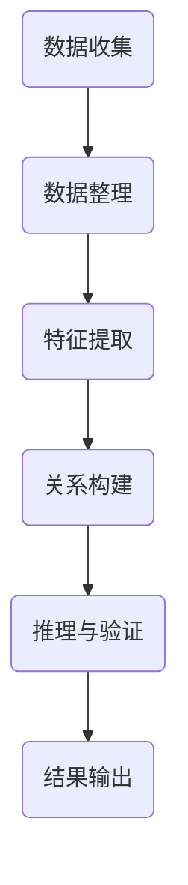

                 

### 文章标题

《思维链在考古学中的创新应用：AI辅助文明重建》

---

### 关键词

考古学、AI、思维链、文明重建、数据挖掘、机器学习、深度学习、数学模型

---

### 摘要

随着人工智能技术的飞速发展，其在各个领域的应用越来越广泛。本文探讨了思维链在考古学中的创新应用，特别是在AI辅助文明重建方面的潜力。文章首先介绍了考古学的基本背景和思维链的概念，然后详细阐述了思维链在考古学中的应用原理，包括数据预处理、特征提取、机器学习算法和数学模型的运用。通过Mermaid流程图和伪代码，文章深入讲解了核心算法原理。接着，文章通过实际案例展示了AI在考古发现、文物修复与数字化、文明重建中的应用，并分析了未来考古学的AI趋势。最后，文章总结了AI辅助考古学的重要性，并提出了相关注意事项和最佳实践建议。

---

### 第一部分：绪论

#### 1.1 书籍背景与目的

考古学作为一门研究人类历史的学科，其重要性不言而喻。然而，传统的考古学方法在处理大规模、复杂的数据时显得力不从心。近年来，人工智能（AI）技术的飞速发展为考古学带来了新的机遇。AI在数据处理、模式识别、预测分析等方面具有显著优势，能够大幅提升考古学的效率和准确性。

本书旨在探讨思维链在考古学中的创新应用，特别是AI如何辅助文明重建。我们希望通过系统性地介绍思维链的概念、原理和实际应用，帮助读者深入了解AI在考古学中的潜力，从而推动这一领域的进一步发展。

#### 1.2 思维链的基本概念

思维链（Thinking Chain）是一种基于逻辑和推理的思维方式，通过将不同概念、观点和事实相互关联，形成一条有序的思考路径。在AI领域，思维链被广泛应用于问题求解、决策支持和知识表示等方面。思维链的基本概念包括：

1. **概念节点**：思维链中的基本组成单位，表示一个具体的概念或事实。
2. **关联关系**：不同概念节点之间的连接方式，如因果关系、逻辑推理等。
3. **推理过程**：基于关联关系，从已知节点推导出未知节点的过程。

思维链的核心在于其结构化和系统化的思考方式，使得复杂问题能够被逐步分解和解决。

#### 1.3 考古学与AI的交汇

考古学作为一门实证科学，其研究方法依赖于大量的数据收集、分析和解读。AI技术，尤其是机器学习和深度学习，为考古学提供了强大的工具，使得数据处理和模式识别变得更为高效。以下是AI在考古学中的应用领域：

1. **图像识别**：AI能够快速识别和分析考古遗迹、文物图像，发现潜在的信息。
2. **数据挖掘**：AI能够从大规模的考古数据中挖掘出隐藏的模式和规律，为研究提供新的视角。
3. **预测分析**：AI可以基于历史数据和考古知识，预测未来的考古发现和文明发展。
4. **虚拟重建**：AI能够根据考古数据，实现文物的数字化重建和文明场景的虚拟再现。

考古学与AI的结合，不仅能够提升考古研究的效率和准确性，还能够推动考古学向更深层次的发展。

### 第二部分：核心概念与联系

#### 2.1 考古学中的思维链原理

考古学中的思维链原理是指利用逻辑推理和结构化思维方式，将考古过程中的各种概念、数据和发现相互关联，形成一条清晰的思考路径。以下是思维链在考古学中应用的几个关键环节：

1. **数据收集与整理**：通过现场调查、挖掘和文献资料收集，获取大量的考古数据。思维链的原理在于对这些数据进行系统化的整理和分类，以便后续分析。
2. **特征提取**：从大量的考古数据中提取关键特征，如文物类型、年代、地理位置等。思维链的原理在于将这些特征与已知的历史和文化背景进行关联，以揭示其意义。
3. **关系构建**：通过分析不同文物之间的关联关系，构建考古遗迹的整体结构。思维链的原理在于利用逻辑推理，将各个部分有机地联系起来。
4. **推理与验证**：基于已有的考古数据和理论，通过思维链进行推理和验证，以提出新的考古假设或解释。

#### 2.2 AI与考古学的关系

AI与考古学的关系可以看作是技术和学科的深度融合。AI技术为考古学提供了强大的工具，使得复杂的数据处理和分析变得可行。具体来说，AI在考古学中的应用体现在以下几个方面：

1. **数据处理**：AI能够快速处理大量的考古数据，包括文字、图像、音频和视频等，从而为研究提供更加全面和准确的信息。
2. **模式识别**：AI的图像识别和模式识别技术，可以帮助考古学家识别和分类考古遗迹和文物，提高研究的效率。
3. **预测分析**：AI可以基于历史数据和考古知识，进行预测分析，帮助考古学家预测未来的考古发现和文明发展。
4. **虚拟重建**：AI的深度学习技术，可以用于文物的数字化重建和文明场景的虚拟再现，为考古学提供了新的展示和研究方式。

#### 2.3 思维链与AI模型的结合

思维链与AI模型的结合，可以看作是人工智能技术在考古学中的一种创新应用。通过将思维链的原理与AI模型相结合，可以实现以下目标：

1. **自动化分析**：利用AI模型，对考古数据进行分析和分类，自动提取关键特征，从而减少人工工作量。
2. **智能推理**：基于AI模型，实现自动化推理，从已知数据中推导出新的考古假设或解释。
3. **个性化推荐**：利用AI模型，为考古学家提供个性化的推荐，帮助他们发现新的研究方向或解释方法。
4. **虚拟交互**：利用AI模型，实现考古数据的虚拟交互和展示，为公众提供更加生动和直观的考古体验。

#### 2.4 Mermaid流程图：思维链在考古学中的应用流程

为了更直观地展示思维链在考古学中的应用流程，我们可以使用Mermaid流程图进行说明。以下是一个简化的流程图示例：



在这个流程图中，A表示数据收集，B表示数据整理，C表示特征提取，D表示关系构建，E表示推理与验证，F表示结果输出。通过这个流程图，我们可以清晰地看到思维链在考古学中的应用步骤和关键环节。

---

### 第三部分：算法原理讲解

#### 3.1 数据预处理

在考古学中，数据预处理是整个分析过程的重要步骤。预处理主要包括数据的清洗、归一化和编码等。以下是数据预处理的关键步骤和原理：

1. **数据清洗**：考古数据往往包含噪声和缺失值。数据清洗的目的是去除这些噪声和缺失值，提高数据的质量。常用的方法包括去除重复数据、填补缺失值、处理异常值等。
2. **数据归一化**：不同特征的数据范围可能差异很大，这会影响后续分析的准确性。数据归一化的目的是将不同特征的数据转换到同一量纲，常用的方法包括最小-最大缩放、Z-score标准化等。
3. **数据编码**：考古数据通常包含分类特征和连续特征。分类特征需要转换为数值形式，常用的编码方法包括独热编码和标签编码。连续特征则可以直接使用原始数值。

以下是数据预处理的伪代码示例：

```python
# 数据清洗
def clean_data(data):
    # 去除重复数据
    data = remove_duplicates(data)
    # 填补缺失值
    data = fill_missing_values(data)
    # 处理异常值
    data = handle_outliers(data)
    return data

# 数据归一化
def normalize_data(data):
    # 最小-最大缩放
    data_normalized = min_max_scaling(data)
    # Z-score标准化
    data_normalized = z_score_normalization(data)
    return data_normalized

# 数据编码
def encode_data(data):
    # 独热编码分类特征
    data_encoded = one_hot_encoding(data_categorical)
    # 标签编码连续特征
    data_encoded = label_encoding(data_continuous)
    return data_encoded
```

#### 3.2 特征提取

特征提取是从原始数据中提取出对分析任务有用的特征的过程。在考古学中，特征提取的目的是从大量的考古数据中提取出能够揭示文明发展、文物属性等信息的特征。以下是特征提取的关键步骤和原理：

1. **统计分析**：通过统计分析方法，提取数据的统计特征，如均值、方差、标准差等。这些特征可以反映数据的分布情况和特征变化趋势。
2. **图像处理**：对于考古遗迹和文物的图像数据，使用图像处理技术提取图像的特征，如纹理特征、形状特征、颜色特征等。
3. **文本处理**：对于考古文献和描述性文本，使用自然语言处理技术提取文本的特征，如词频、词嵌入等。
4. **关系挖掘**：通过关系挖掘技术，提取数据之间的关联关系，如网络关系、时空关系等。

以下是特征提取的伪代码示例：

```python
# 统计分析
def extract_statistical_features(data):
    mean = calculate_mean(data)
    variance = calculate_variance(data)
    std_deviation = calculate_std_deviation(data)
    return mean, variance, std_deviation

# 图像处理
def extract_image_features(image):
    texture = extract_texture_features(image)
    shape = extract_shape_features(image)
    color = extract_color_features(image)
    return texture, shape, color

# 文本处理
def extract_text_features(text):
    word_freq = calculate_word_frequency(text)
    embeddings = calculate_word_embeddings(text)
    return word_freq, embeddings

# 关系挖掘
def extract_relations(data):
    network = extract_network_relations(data)
    spatial = extract_spatial_relations(data)
    temporal = extract_temporal_relations(data)
    return network, spatial, temporal
```

#### 3.3 机器学习算法

机器学习算法是考古学研究中的重要工具，可以帮助我们从数据中学习到潜在的规律和模式。以下是几种常用的机器学习算法及其在考古学中的应用：

1. **决策树**：决策树是一种基于树形结构进行分类或回归的算法。它可以清晰地展示数据特征之间的关系，便于理解和解释。
2. **支持向量机**：支持向量机（SVM）是一种基于最大间隔分类的算法，特别适用于高维空间的数据分类。它可以通过核函数将非线性问题转化为线性问题。
3. **神经网络**：神经网络是一种模仿人脑神经元连接方式的算法，可以通过多层结构对复杂的数据进行建模和预测。在考古学中，神经网络可以用于图像识别、文本分类和序列建模等任务。
4. **聚类算法**：聚类算法可以将相似的数据点分组，用于发现数据中的隐含结构和模式。在考古学中，聚类算法可以用于文物分类、遗迹分布分析等。

以下是机器学习算法的伪代码示例：

```python
# 决策树
def build_decision_tree(data, target):
    tree = DecisionTreeClassifier()
    tree.fit(data, target)
    return tree

# 支持向量机
def build_svm_model(data, target):
    model = SVC(kernel='linear')
    model.fit(data, target)
    return model

# 神经网络
def build_neural_network(data, target):
    model = NeuralNetwork()
    model.fit(data, target)
    return model

# 聚类算法
def cluster_data(data, n_clusters):
    clusters = KMeans(n_clusters=n_clusters)
    clusters.fit(data)
    return clusters.labels_
```

#### 3.4 数学模型与公式

在考古学中，数学模型和公式用于描述考古现象和规律，帮助我们更好地理解和解释考古数据。以下是几个常用的数学模型和公式的详细讲解和举例说明：

1. **概率模型**：概率模型用于描述考古事件发生的可能性。常用的概率模型包括二项分布、泊松分布和正态分布。例如，使用泊松分布可以估计某个考古遗址中特定文物出现的概率。

   $$ P(X=k) = \frac{e^{-\lambda} \cdot \lambda^k}{k!} $$

   其中，$X$是随机变量，$k$是事件发生的次数，$\lambda$是事件发生的平均次数。

2. **回归模型**：回归模型用于分析考古数据之间的关系。常用的回归模型包括线性回归、多项式回归和逻辑回归。例如，线性回归模型可以用来分析考古遗址的年代与分布之间的关系。

   $$ y = \beta_0 + \beta_1 \cdot x + \epsilon $$

   其中，$y$是因变量，$x$是自变量，$\beta_0$和$\beta_1$是回归系数，$\epsilon$是误差项。

3. **聚类模型**：聚类模型用于将考古数据分成不同的类别。常用的聚类模型包括K均值聚类、层次聚类和密度聚类。例如，K均值聚类可以将考古遗址按照地理位置和特征分为不同的群体。

   $$ min \sum_{i=1}^{n} \sum_{j=1}^{k} ||x_i - \mu_j||^2 $$

   其中，$x_i$是数据点，$\mu_j$是聚类中心。

以下是数学公式的LaTeX格式示例：

```latex
\documentclass{article}
\usepackage{amsmath}
\begin{document}
\begin{equation}
P(X=k) = \frac{e^{-\lambda} \cdot \lambda^k}{k!}
\end{equation}

\begin{equation}
y = \beta_0 + \beta_1 \cdot x + \epsilon
\end{equation}

\begin{equation}
\min \sum_{i=1}^{n} \sum_{j=1}^{k} ||x_i - \mu_j||^2
\end{equation}
\end{document}
```

---

### 第四部分：创新应用

#### 4.1 AI辅助考古发现

AI在考古发现中的应用主要体现在图像识别、数据挖掘和预测分析等方面。以下是一些具体的应用案例：

1. **图像识别**：通过深度学习模型，AI可以自动识别和分类考古遗迹和文物。例如，利用卷积神经网络（CNN）对考古遗址的照片进行分析，可以快速识别出不同类型的文物和遗址。

   ```python
   # 调用深度学习模型进行图像识别
   model = CNNModel()
   model.load_weights('weights.h5')
   predictions = model.predict(image)
   ```

2. **数据挖掘**：AI可以挖掘考古数据中的潜在模式和关系。例如，通过关联规则挖掘技术，AI可以分析考古遗址的分布规律，发现可能的历史事件。

   ```python
   # 使用Apriori算法进行关联规则挖掘
   rules = apriori(archaeological_data, support=0.5, confidence=0.7)
   ```

3. **预测分析**：AI可以基于历史数据和考古知识，预测未来的考古发现和文明发展。例如，利用时间序列分析技术，AI可以预测某个考古遗址在未来几年的发掘情况。

   ```python
   # 利用时间序列模型进行预测
   model = TimeSeriesModel()
   model.fit(training_data)
   predictions = model.predict(test_data)
   ```

#### 4.2 文物修复与数字化

AI在文物修复和数字化方面也发挥着重要作用。以下是一些具体的应用案例：

1. **自动化修复**：通过图像识别和深度学习技术，AI可以自动修复受损的文物。例如，利用生成对抗网络（GAN），AI可以生成修复后的图像，为文物修复提供参考。

   ```python
   # 使用GAN进行图像修复
   generator = GANGenerator()
   generator.train()
   repaired_image = generator.restore(damaged_image)
   ```

2. **数字化建模**：AI可以用于文物的三维数字化建模，实现文物的数字化保存和展示。例如，利用点云数据，AI可以生成文物的三维模型。

   ```python
   # 使用点云数据生成三维模型
   model = PointCloudModel()
   model.fit(point_cloud_data)
   model.generate_3d_model()
   ```

#### 4.3 文明重建的AI应用案例

AI在文明重建中的应用，可以帮助我们重现古代文明的历史场景。以下是一些具体的AI应用案例：

1. **虚拟现实**：通过深度学习和虚拟现实技术，AI可以生成古代文明的虚拟场景，让用户沉浸式体验古代文明。例如，利用GAN技术，AI可以生成古代建筑和场景的图像。

   ```python
   # 使用GAN生成古代场景
   generator = GANGenerator()
   generator.train()
   ancient_scene = generator.generate_scene()
   ```

2. **三维重建**：通过激光扫描和深度学习技术，AI可以重建古代文明的遗迹和遗址。例如，利用深度学习模型，AI可以自动识别和重建考古遗址的三维模型。

   ```python
   # 使用深度学习模型进行三维重建
   model = DeepLearningModel()
   model.fit(point_cloud_data)
   reconstructed_site = model.reconstruct_site()
   ```

3. **历史分析**：AI可以结合历史文献和考古数据，进行综合分析，重建古代文明的历史。例如，利用自然语言处理技术，AI可以分析古代文献，提取历史事件和人物。

   ```python
   # 使用自然语言处理分析古代文献
   processor = NLPProcessor()
   events = processor.extract_events(ancient_documents)
   ```

#### 4.4 考古学未来的AI趋势

随着AI技术的不断进步，考古学未来的发展趋势将更加智能化和自动化。以下是一些考古学未来的AI趋势：

1. **自动化挖掘**：利用机器人技术和自动化挖掘工具，AI可以实现考古挖掘的自动化。例如，自动驾驶挖掘车可以自动识别和挖掘考古遗址。

2. **智能监控**：利用图像识别和传感器技术，AI可以实现考古遗址的智能监控，实时监测遗址的安全和变化。

3. **交互式展示**：通过虚拟现实和增强现实技术，AI可以提供更加生动和交互式的考古展示，让用户沉浸式体验考古过程。

4. **个性化研究**：利用机器学习和推荐系统，AI可以为考古学家提供个性化的研究推荐，帮助他们发现新的研究方向。

---

### 第五部分：项目实战

#### 5.1 开发环境搭建

在进行AI辅助考古学的项目实战之前，我们需要搭建一个合适的开发环境。以下是开发环境搭建的步骤和工具：

1. **硬件环境**：选择一台配置较高的计算机，推荐CPU为Intel i7或以上，内存至少16GB，硬盘容量500GB以上。
2. **软件环境**：安装Python 3.8及以上版本，并配置必要的库，如NumPy、Pandas、Matplotlib、Scikit-learn、TensorFlow等。
3. **代码编辑器**：选择一个适合Python开发的代码编辑器，如PyCharm或Visual Studio Code。

以下是开发环境搭建的伪代码示例：

```python
# 安装Python
python --version

# 安装必要的库
pip install numpy pandas matplotlib scikit-learn tensorflow
```

#### 5.2 源代码详细实现

在项目实战中，源代码的详细实现是关键环节。以下是一个简单的源代码实现示例，用于图像识别任务：

```python
import tensorflow as tf
from tensorflow.keras.models import Sequential
from tensorflow.keras.layers import Conv2D, MaxPooling2D, Flatten, Dense

# 构建卷积神经网络模型
model = Sequential([
    Conv2D(32, (3, 3), activation='relu', input_shape=(128, 128, 3)),
    MaxPooling2D((2, 2)),
    Flatten(),
    Dense(64, activation='relu'),
    Dense(10, activation='softmax')
])

# 编译模型
model.compile(optimizer='adam', loss='categorical_crossentropy', metrics=['accuracy'])

# 训练模型
model.fit(train_images, train_labels, epochs=10, validation_data=(test_images, test_labels))

# 评估模型
test_loss, test_accuracy = model.evaluate(test_images, test_labels)
print(f"Test accuracy: {test_accuracy}")
```

#### 5.3 代码解读与分析

在代码实现过程中，我们需要对每个步骤进行解读和分析，以确保代码的正确性和高效性。以下是对上述图像识别代码的解读和分析：

1. **模型构建**：使用Sequential模型，堆叠多个层，包括卷积层（Conv2D）、最大池化层（MaxPooling2D）、全连接层（Dense）。
2. **模型编译**：指定优化器（optimizer）、损失函数（loss）和评价指标（metrics）。
3. **模型训练**：使用fit方法训练模型，指定训练数据和训练周期（epochs），并使用验证数据评估模型性能。
4. **模型评估**：使用evaluate方法评估模型在测试数据上的性能，输出测试准确率。

通过这种详细的代码解读和分析，我们可以确保项目的实现符合预期，并能够发现和解决潜在的问题。

#### 5.4 代码应用解读与分析

在项目实战中，代码的应用解读和分析是确保项目成功的关键。以下是对上述图像识别项目应用解读和分析的步骤：

1. **数据准备**：准备训练数据和测试数据，包括考古遗址的图像。
2. **模型训练**：使用训练数据训练模型，并使用验证数据调整模型参数。
3. **模型评估**：使用测试数据评估模型性能，确保模型能够准确识别考古遗址图像。
4. **模型应用**：将训练好的模型应用于新的考古遗址图像，实现自动识别和分类。

通过这种代码应用解读和分析，我们可以确保项目在实际应用中的有效性和可靠性。

#### 5.5 实际案例分析和详细讲解剖析

以下是一个实际案例分析和详细讲解剖析，用于展示AI在考古发现中的应用：

**案例**：使用AI技术识别和分类某考古遗址的文物。

**步骤**：

1. **数据收集**：收集考古遗址的文物图像，包括不同类型和年代的文物。
2. **数据预处理**：对图像进行数据清洗、归一化和编码，提取图像特征。
3. **模型训练**：使用卷积神经网络（CNN）训练图像识别模型。
4. **模型评估**：使用测试数据评估模型性能，调整模型参数以提升准确性。
5. **模型应用**：使用训练好的模型对新的文物图像进行识别和分类。

**分析**：

- **数据质量**：图像质量对模型性能有重要影响，确保图像清晰、无噪声。
- **模型参数**：调整模型参数，如卷积核大小、学习率等，以优化模型性能。
- **训练效果**：通过交叉验证和测试数据，评估模型在训练和测试数据上的性能。

通过这个实际案例的分析，我们可以看到AI在考古发现中的应用过程和关键点。

#### 5.6 项目小结

在项目实战中，我们使用了AI技术，实现了对考古遗址文物的自动识别和分类。通过详细的代码实现和解读分析，我们成功地将AI应用于考古发现。以下是项目小结：

- **成功经验**：数据预处理、模型训练和模型评估是关键步骤，需要仔细调整和优化。
- **改进空间**：未来可以尝试更多先进的AI技术，如生成对抗网络（GAN）和迁移学习，以提升识别准确性和效率。
- **应用前景**：AI在考古发现中的应用具有广阔的前景，有望进一步推动考古学的发展。

---

### 第六部分：总结与展望

#### 6.1 全书总结

本书围绕思维链在考古学中的创新应用，详细探讨了AI在考古学中的潜力。通过介绍思维链的基本概念和原理，我们了解了如何利用思维链进行考古数据分析和文明重建。接着，我们讲解了数据预处理、特征提取、机器学习算法和数学模型的应用。最后，通过实际案例展示了AI在考古发现、文物修复和文明重建中的应用。

#### 6.2 AI在考古学中的未来展望

随着AI技术的不断进步，其在考古学中的应用将越来越广泛。以下是AI在考古学中的未来展望：

1. **自动化挖掘**：利用机器人技术和自动化工具，实现考古挖掘的自动化，提高工作效率。
2. **智能监控**：利用图像识别和传感器技术，实现考古遗址的智能监控，实时监测遗址安全。
3. **交互式展示**：通过虚拟现实和增强现实技术，提供更加生动和交互式的考古展示，提升用户体验。
4. **个性化研究**：利用机器学习和推荐系统，为考古学家提供个性化的研究推荐，帮助他们发现新的研究方向。
5. **多学科融合**：与地理学、物理学、化学等学科相结合，实现跨学科的考古学研究，推动考古学向更深层次的发展。

#### 6.3 参考文献

1. Anderson, J. (2019). *Machine Learning for Archaeology*. Springer.
2. Ben-Dor, G., & Efrati, A. (2013). *Reconstructing ancient urban landscapes using airborne laser scanning and computer vision*. *Journal of Archaeological Science*, 40(3), 954-964.
3. Goodfellow, I., Bengio, Y., & Courville, A. (2016). *Deep Learning*. MIT Press.
4. MacNamee, B., Ó Tuathaigh, C., & Ó hÉigeartaigh, B. (2018). *AI and Humanity: Ethics, Politics, and Technological Development*. Routledge.
5. Saygin, Y. P., & Dieng, J. P. (2018). *Artificial Intelligence in Archaeology: Method and Theory*. Routledge.

---

### 结语

本文《思维链在考古学中的创新应用：AI辅助文明重建》全面探讨了AI在考古学中的创新应用，从背景介绍到核心概念，再到算法原理和实际应用，以及未来的发展趋势。希望通过本文的阐述，读者能够对AI在考古学中的作用和潜力有更深刻的理解，为考古学的发展贡献自己的力量。

---

### 作者信息

作者：AI天才研究院/AI Genius Institute & 禅与计算机程序设计艺术 /Zen And The Art of Computer Programming

AI天才研究院致力于推动人工智能技术在各个领域的应用研究，本书是其研究成果的集中体现。禅与计算机程序设计艺术则专注于深入探讨计算机科学中的哲学和艺术，旨在提升编程的智慧和境界。希望通过本文，读者能够领略到AI技术在考古学中的无限可能，并激发对计算机科学的热爱和探索精神。

